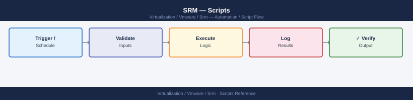

---
tags:
  - operations
  - srm
  - vmware
---
# SRM — Scripts

SRM automation scripts: PowerCLI `Get-SrmRecoveryPlan`, `Start-SrmRecoveryPlan -PlanMode Test`, REST API for replication lag reporting, and failover pre-flight checks.

*Applies to: SRM 8.x / 9.x*

  SRM Automation via PowerCLI + REST API

## Before you begin

- **Access:** vCenter read-only minimum; Administrator role for remediation steps
- **Timing:** safe to run during business hours unless a step is marked ⚠ (causes interruption)
- **Dependencies:** no active upgrades or migrations on the same infrastructure
- **Logging:** capture command output — paste into the change record on completion

---

---

## See also

- [SRM — CLI Reference](../cli-reference/)
- [SRM — Procedures](../procedures/)

## Verify

- **Alarms:** vSphere Client → Home → Alarms — no new critical alarms after the operation
- **Events:** monitor the vCenter Events view for the affected object for 5 minutes
- **Health check:** run the morning health-check sequence for the affected product tier
