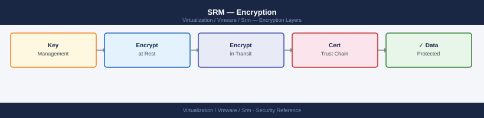

---
tags:
  - security
  - srm
  - vmware
description: "Encryption reference covering Encryption at Recovery Site, Certificate Management for SRM Server, SRA Credential Storage Encryption, FIPS Mode."
---
# SRM — Encryption

Encryption reference covering Encryption at Recovery Site, Certificate Management for SRM Server, SRA Credential Storage Encryption, FIPS Mode.

*Applies to: SRM 8.x / 9.x*

  TLS Encryption Coverage

## Before you begin

- **Access:** vCenter Administrator role
- **Change management:** security changes require CAB approval in most environments
- **Rollback plan:** document current state before any security control change
- **Testing:** validate in a non-production environment first where possible

---

## See also

- [SRM — Hardening](../hardening/)
- [SRM — Health Checks](../../operations/health-checks/)
