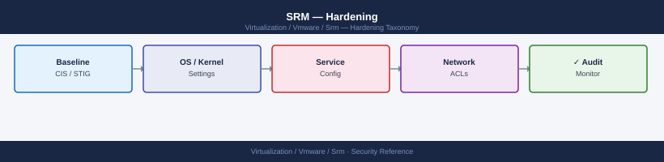

---
tags:
  - security
  - srm
  - vmware
description: "Hardening reference covering Least-Privilege SRA Service Accounts, Rotate SRA Credentials, Test Recovery Plans Regularly, Restrict Who Can Execute..."
---
# SRM — Hardening

Hardening reference covering Least-Privilege SRA Service Accounts, Rotate SRA Credentials, Test Recovery Plans Regularly, Restrict Who Can Execute Recovery, Secure Recovery Site Network Design and 3 more sections.

*Applies to: SRM 8.x / 9.x*

  SRM Hardening Controls

## Before you begin

- **Access:** vCenter Administrator role
- **Change management:** security changes require CAB approval in most environments
- **Rollback plan:** document current state before any security control change
- **Testing:** validate in a non-production environment first where possible

---

## See also

- [SRM — Access Control](../access-control/)
- [SRM — Authentication](../authentication/)
- [SRM — Health Checks](../../operations/health-checks/)
