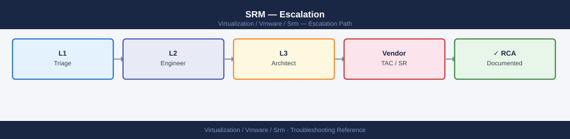

---
tags:
  - srm
  - troubleshooting
  - vmware
search:
  boost: 1.5
---
# SRM — Escalation

<div class="kb-summary">
How to escalate VMware Site Recovery Manager issues to Broadcom support: what data to collect, how to generate SRM support bundles from both sites, step-by-step case creation on support.broadcom.com, and the escalation path when progress stalls.

*Applies to: SRM 8.x / 9.x*
</div>



---

```d2
direction: down

symptom: Identify Symptom {shape: diamond}
preescalation_selfcheck: "Pre-Escalation Self-Check" {shape: rectangle}
stepbystep_data_collection: "Step-by-Step Data Collection" {shape: rectangle}
how_to_open_the_sr_on_supportbroadco: "How to Open the SR on support.broadcom.com" {shape: rectangle}
escalation_path: "Escalation Path" {shape: rectangle}
what_not_to_do: "What NOT to Do" {shape: rectangle}
useful_commands_for_case_updates: "Useful Commands for Case Updates" {shape: rectangle}
resolution: Resolve or Escalate {shape: oval}

symptom -> preescalation_selfcheck: investigate
symptom -> stepbystep_data_collection: investigate
symptom -> how_to_open_the_sr_on_supportbroadco: investigate
symptom -> escalation_path: investigate
symptom -> what_not_to_do: investigate
symptom -> useful_commands_for_case_updates: investigate
preescalation_selfcheck -> resolution
stepbystep_data_collection -> resolution
how_to_open_the_sr_on_supportbroadco -> resolution
escalation_path -> resolution
what_not_to_do -> resolution
useful_commands_for_case_updates -> resolution
```

## Before you begin

- **Access required:** SRM Administrator role on both sites; RDP to SRM Server (Windows) or SSH to SRM appliance; Broadcom support account at support.broadcom.com with active SRM entitlement
- **Do NOT retry a failed real failover** without GSS direction — further retry attempts may corrupt the recovery plan state and prevent any subsequent recovery attempt from succeeding
- **Bundles from BOTH sites are required** — GSS will ask for the protected site and recovery site bundles in their first response. Collect them immediately before any state changes
- **SRA issues require dual vendor engagement:** if the failure is in the SRA or array-side replication, open a case with VMware AND open a parallel case with the storage vendor (Dell, NetApp, Pure). Share case numbers between vendors

---

## Pre-Escalation Self-Check

Run these before opening the case.

| Check | Where to look | Expected result |
|---|---|---|
| SRM version | vSphere Client → Site Recovery → About | Note full SRM version + build |
| Site pair status | vSphere Client → Site Recovery → Sites | Site pair shows Connected |
| vCenter pair status | vSphere Client → Site Recovery → Sites → vCenters | Both vCenters show Paired |
| Protection group status | vSphere Client → Site Recovery → Protection Groups | All groups show OK (not Error) |
| Recovery plan status | vSphere Client → Site Recovery → Recovery Plans | Plan in Ready state (or see error details) |
| vSR replication state | vSphere Client → Site Recovery → Replications | All replications show OK; no RPO violations |
| SRA version | vSphere Client → Site Recovery → Adapters | Note SRA name and version |
| Recent plan history | vSphere Client → Site Recovery → Recovery Plans → [plan] → History | Note last test date and result |
| SRM Server service | Windows Services on SRM host: `VMware vCenter Site Recovery Manager` | Running |

---

## Step-by-Step Data Collection

Collect from BOTH the protected site and the recovery site.

### 1. Get the SRM version, SRA version, and array firmware version

In vSphere Client: navigate to the **Site Recovery** plugin.

1. Click **About** (bottom left or Help menu) — note the SRM version and build number.
2. Click **Adapters** (left sidebar) — note the SRA adapter name and version for the storage platform in use.
3. Log into the storage array admin console and note the firmware version.

### 2. Generate the SRM support bundle (both sites)

**Method 1 — From the SRM Admin UI (recommended):**

1. In vSphere Client → Site Recovery → click the **Support** option in the left menu (or access the SRM Server web UI directly at `https://<srm-server-ip>/dr/`).
2. Click **Download Support Bundle**.
3. Wait 2–5 minutes for bundle generation.
4. Download the resulting archive.

Repeat this on BOTH the protected and recovery site SRM Servers.

**Method 2 — For SRM Appliance:**

```bash
# SSH to the SRM Appliance
ssh root@<srm-appliance-ip>

# Generate the support bundle
/usr/lib/vmware-dr/bin/dr-backup.sh --export /tmp/srm-bundle-$(hostname)-$(date +%Y%m%d).tgz

# Verify and copy off
ls -lh /tmp/srm-bundle-*.tgz
scp root@<srm-appliance-ip>:/tmp/srm-bundle-*.tgz /tmp/
```


```text title="Expected output"
root@srm-appliance:~# /usr/lib/vmware-dr/bin/dr-backup.sh --export /tmp/srm-bundle-$(hostname)-$(date +%Y%m%d).tgz
Exporting SRM configuration and logs...
[====================================] 100%
Export completed successfully.
Bundle size: 487 MB
Export location: /tmp/srm-bundle-srm-appliance-20240115.tgz

root@srm-appliance:~# ls -lh /tmp/srm-bundle-*.tgz
-rw-r--r-- 1 root root 487M Jan 15 10:42 /tmp/srm-bundle-srm-appliance-20240115.tgz

root@srm-appliance:~# exit
Connection to 192.168.1.45 closed.

local:~$ scp root@192.168.1.45:/tmp/srm-bundle-*.tgz /tmp/
srm-bundle-srm-appliance-20240115.tgz          100%  487MB   8.2MB/s   00:59
```

!!! warning "Common errors"
    **`/usr/lib/vmware-dr/bin/dr-backup.sh: command not found`** — Verify the SRM version and confirm the correct path with `find / -name dr-backup.sh 2>/dev/null`.
    **`Permission denied`** — Ensure you are logged in as root or have sudo privileges; use `sudo /usr/lib/vmware-dr/bin/dr-backup.sh` if needed.
    **`scp: /tmp/srm-bundle-*.tgz: No such file or directory`** — Verify the bundle was created successfully by checking `/tmp/` directly on the SRM appliance before attempting to copy.
### 3. Generate the vSphere Replication (vSR) bundle (both sites)

If vSphere Replication is used (rather than array-based replication):

1. Navigate to the vSphere Replication Appliance admin UI at `https://<vra-ip>:5480`.
2. Click **Support** → **Download Support Bundle**.
3. Repeat for the vRA on both sites.

### 4. Export the recovery plan execution log

1. In vSphere Client → Site Recovery → **Recovery Plans** → select the affected plan.
2. Click the **History** tab.
3. Click the failed run entry → **Export Log**.
4. Download the log. This is the most specific data for GSS when a plan execution failed.

### 5. Write the timeline

```text
SRM version: 8.8.0 (build 22140268)
SRA: NetApp SnapMirror SRA v4.2
Protected site: vcenter-prod.corp.local (SRM: srm-prod-01.corp.local)
Recovery site: vcenter-dr.corp.local (SRM: srm-dr-01.corp.local)
Issue first observed: 2026-06-14 03:00 UTC (real failover initiated)
Last successful test: 2026-06-07 (non-disruptive test — passed)
Timeline of the incident:
  - 02:55: Primary datacenter power failure detected
  - 03:00: Real failover initiated from recovery site SRM
  - 03:05: Failover progress stalled at "Promoting replication" step for all VMs
  - 03:15: Error in recovery plan log: "SRA operation timed out after 600s"
  - 03:20: Failover manually cancelled to prevent further state corruption
Steps already taken:
  - Recovery plan execution log exported; shows SRA timeout at promote step
  - SRA logs show array could not promote replicated volumes (access denied)
  - Did NOT retry the failover or modify the recovery plan
Blast radius: 50 production VMs cannot start at DR site; DR failover capability lost
```

---

## How to Open the SR on support.broadcom.com

1. Go to **support.broadcom.com** and sign in with your Broadcom account.

2. Click **Open a Support Request**.

3. Under **Product Group**, select **VMware Cloud Foundation and Virtualization** → **VMware Site Recovery Manager**.

4. Under **Version**, select your SRM version from Step 1.

5. Under **Severity**, select:
   - **Severity 1 — Critical**: Active real DR failover failed mid-execution; VMs cannot start at the recovery site; production is down with no DR fallback; no workaround
   - **Severity 2 — High**: DR capability is significantly degraded; protection groups in error state; vSphere Replication RPO violations; site pair disconnected; real failover not possible
   - **Severity 3 — Medium**: Test failover failed; one protection group in error; single VM not protected; configuration issue with a workaround
   - **Severity 4 — Low**: How-to question, pre-upgrade planning, compatibility question, or documentation clarification

6. In the **Summary** field: product + symptom + scope. Example: `SRM 8.8 — real failover stalled at "Promoting replication" step (SRA timeout), 50 VMs cannot start at DR site, DR capability lost`.

7. In the **Description** field, paste:
   - SRM version, SRA version, and array firmware version from Step 1
   - The error message from the recovery plan execution log (Step 4)
   - The timeline from Step 5
   - The SRA vendor case number if you have already opened a parallel case with the storage vendor

8. Under **Attachments**, upload:
   - SRM support bundles from BOTH sites (Step 2)
   - vSR bundle from both sites if vSphere Replication is in use (Step 3)
   - The recovery plan execution log from Step 4

9. Click **Submit**. You will receive a case number by email immediately.

10. **Severity 1 only:** call Broadcom/VMware support immediately after submission:
    - North America: +1 877-486-9273 (24×7 for Severity 1)
    - EMEA: +44 (0)3453 700 100
    - State "Severity 1 — SRM real failover failed, DR capability lost, 50 VMs cannot start" at the start of the call.

---

## Escalation Path

```text
Step 1 — Open case at support.broadcom.com with both-site SRM bundles and plan log attached
         ↓
Step 2 — T1 support engineer acknowledges and reviews the bundle (Sev1: < 30 min)
         ↓
Step 3 — If no meaningful progress in 30 minutes for Sev1 or 2 hours for Sev2:
         → Reply in case: "Requesting escalation to SRM Senior Engineer"
         → State: "[failover failed / 50 VMs cannot start at DR / DR capability lost]"
         ↓
Step 4 — SRM T2 Senior Engineer is assigned
         → They will review the recovery plan execution log and SRA logs
         → Have RDP to both SRM Servers and storage admin credentials ready
         ↓
Step 5 — If the SRA is involved (storage replication adapter failure):
         → VMware escalates to the SRA vendor (Dell, NetApp, Pure)
         → Open a PARALLEL case with the storage vendor if you haven't already
         → Share case numbers: include the storage vendor case number in the VMware case
         ↓
Step 6 — For Sev1 with no DR failover capability and unresolved after 2 hours:
         → Request CritSit (Critical Situation) escalation via the case
         → Contact your Broadcom TAM or Account Executive to initiate CritSit
```

---

## What NOT to Do

| Do NOT do this | Why | What to do instead |
|---|---|---|
| Retry the failed real failover without GSS direction | Further retry attempts may corrupt the recovery plan state; each attempt changes the SRA's replication state | Wait for GSS to review the execution log; they will direct the exact next step |
| Modify the recovery plan during the incident | Changes the VM configuration and IP mapping GSS is analysing | Freeze all recovery plan changes until the case is resolved |
| Remove the SRA adapter mid-case | Removing the adapter changes the replication topology in a state that is hard to diagnose | Leave the adapter in place; only remove it if GSS specifically instructs you to |
| Clear the recovery plan execution history | The execution history contains the only record of what happened during the failed failover | Leave history intact; export the log to a file if you need to preserve it |
| Power off VMs at the protected site while diagnosis is in progress | May permanently prevent array-based replication from recovering the RPO | Hold power state changes at the protected site until GSS advises |
| Run storage array operations (promote, demote, reverse replication) without coordination | SRA and array state changes propagate to SRM; uncoordinated changes confuse the recovery plan | Make all array-side changes only after confirming with BOTH VMware and storage vendor support |

---

## Useful Commands for Case Updates

```powershell
# Run on SRM Server host (Windows)

# SRM service status
Get-Service "VMware vCenter Site Recovery Manager" | Select-Object Name, Status

# SRM log location (Windows)
Get-ChildItem "C:\ProgramData\VMware\VMware vCenter Site Recovery Manager\Logs\" |
  Sort-Object LastWriteTime -Descending | Select-Object -First 10

# Recent SRM errors in Windows Event Log
Get-EventLog -LogName Application -Source "VMware Site Recovery Manager" -EntryType Error -Newest 50 |
  Select-Object TimeGenerated, EventID, Message | Format-List
```

```bash
# For SRM Appliance (SSH)
# Check service status
systemctl status vmware-dr

# Recent SRM appliance log
tail -200 /var/log/vmware/dr/dr*.log | grep -i "error\|fail\|exception"

# vSphere Replication appliance log (at recovery site)
ssh root@<vra-ip>
tail -200 /var/log/vmware/hbrsrv/hbrsrv.log | grep -i "error\|fail"
```


```text title="Expected output"
● vmware-dr.service - VMware Site Recovery Manager
     Loaded: loaded (/etc/systemd/system/vmware-dr.service; enabled; vendor preset: enabled)
     Active: active (running) since Wed 2024-01-17 14:32:18 UTC; 2 days ago
   Main PID: 4521 (java)
      Tasks: 47 (limit: 4915)
     Memory: 892.3M
        CPU: 2h 14m 32s
     CGroup: /system.slice/vmware-dr.service
             └─4521 /usr/java/default/bin/java -Xmx2048m -Xms1024m...

2024-01-17T14:45:22.891Z ERROR [SrmServer] Failed to connect to vCenter: Connection timeout after 30000ms
2024-01-17T14:46:01.234Z EXCEPTION [ReplicationManager] Array replication paused: LUN 0x5a3f offline
2024-01-17T14:52:15.567Z ERROR [InventorySync] Inventory sync failed for site-pair prod-dr-01: Permission denied
2024-01-17T15:03:44.123Z FAIL [RecoveryPlan] Recovery plan 'Finance-Tier1' validation failed: Target resource pool unavailable

root@vra-recovery-01:~# tail -200 /var/log/vmware/hbrsrv/hbrsrv.log | grep -i "error\|fail"
2024-01-17 14:33:12 ERROR: Failed to establish replication channel to source site 192.168.1.45:31031
2024-01-17 14:35:47 ERROR: Replication lag exceeded threshold (285 seconds > 60 second limit)
2024-01-17 14:41:22 FAIL: Bitmap sync incomplete for VM prod-db-02 (87% complete)
```

!!! warning "Common errors"
    **`tail: cannot open '/var/log/vmware/dr/dr*.log' for reading: No such file or directory`** — Verify the SRM appliance is fully deployed and check the actual log path with `find /var/log/vmware -name "*.log" -type f`.
    **`ssh: connect to host <vra-ip> port 22: Connection refused`** — Ensure the vSphere Replication appliance is powered on and SSH is enabled; verify the IP address is correct with `ping <vra-ip>`.
    **`grep: (standard input): Permission denied`** — Run the command with `sudo` or ensure your user account has read permissions on the log files with `sudo tail -200 /var/log/vmware/hbrsrv/hbrsrv.log`.
---

## Support SLA Reference

| Severity | Definition | Initial Response SLA |
|---|---|---|
| Sev 1 — Critical | Real failover failed; DR capability lost; production down | < 30 min (24×7) |
| Sev 2 — High | DR capability degraded; protection groups in error; RPO violations | < 2 hours (24×7) |
| Sev 3 — Medium | Test failover failed; single VM not protected; workaround exists | < 8 hours |
| Sev 4 — Low | How-to, planning, compatibility question | Next business day |

---

## See also

- [SRM — Diagnostics](../diagnostics/)
- [SRM — Common Issues](../common-issues/)

---

## Verify resolution

- In vSphere Client → Site Recovery → **Sites**: site pair shows Connected
- Check **Protection Groups**: all groups show OK with no errors
- Check **Recovery Plans**: the plan is in Ready state
- If vSR is in use: check **Replications** — all replications show OK with RPO within policy
- Run a non-disruptive **Test** of the recovery plan and confirm it completes successfully
- Check both site SRM Server Windows Services: `VMware vCenter Site Recovery Manager` shows Running
- Monitor for 24 hours after restoration to confirm replication is catching up and RPO is within policy
