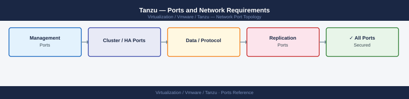

---
tags:
  - tanzu
  - tkg
  - kubernetes
  - networking
  - firewall
  - ports
  - vsphere
---
# Tanzu — Ports and Network Requirements

<div class="kb-summary">
Firewall port reference for VMware Tanzu (vSphere with Tanzu / TKG). Covers the Supervisor Cluster API, Tanzu Kubernetes Grid workload clusters, Tanzu Mission Control connectivity, and container registry access.

*Applies to: vSphere with Tanzu (TKGs) 7.x/8.x / TKG 2.x*
</div>


## Before you begin

- vSphere with Tanzu uses the Supervisor Cluster as the management plane — it runs on ESXi hosts managed by vCenter
- Each Tanzu Kubernetes Grid (TKG) workload cluster has its own API server endpoint (FQDN or VIP); open 6443 per cluster
- NSX-T handles overlay traffic — see [NSX Ports](../../../nsx/architecture/ports/) for TEP/Geneve port requirements
- Tanzu Mission Control (TMC) is a SaaS service — clusters must reach cloud.vmware.com or tmc.cloud.vmware.com on 443

---

## Inbound — Admin to Supervisor Control Plane

| Port | Protocol | Source | Purpose |
|---|---|---|---|
| 6443 | TCP | kubectl clients, Tanzu CLI | Supervisor Cluster Kubernetes API |
| 443 | TCP | Admin workstations | vSphere Namespace REST API and Tanzu management |

---

## Inbound — Access to TKG Workload Clusters

| Port | Protocol | Source | Purpose |
|---|---|---|---|
| 6443 | TCP | DevOps, CI/CD, kubectl clients | TKG workload cluster Kubernetes API server (per-cluster VIP) |
| 443 | TCP | End users | Application Ingress (HTTPS routes via NSX ALB or HAProxy) |
| 80 | TCP | End users | Application Ingress (HTTP routes) |

---

## Supervisor to vSphere Infrastructure

| Port | Protocol | Source | Destination | Purpose |
|---|---|---|---|---|
| 443 | TCP | Supervisor control plane VMs | vCenter Server | Supervisor → vCenter API (VM provisioning, namespace management) |
| 443 | TCP | Supervisor control plane VMs | NSX Manager | NSX integration for overlay networking |

---

## Supervisor / TKG to Container Registries

| Port | Protocol | Destination | Purpose |
|---|---|---|---|
| 443 | TCP | Supervisor / TKG nodes | Harbor registry (self-hosted) | Container image pull for TKG system components |
| 443 | TCP | Supervisor / TKG nodes | registry.vmware.com, projects.registry.vmware.com | Tanzu system image pull (if using public registry) |
| 443 | TCP | Supervisor / TKG nodes | *.pkg.dev, *.gcr.io | TKG 2.x images on GCR |

---

## Tanzu Mission Control (TMC — SaaS)

| Port | Protocol | Source | Destination | Purpose |
|---|---|---|---|---|
| 443 | TCP | TKG cluster nodes | tmc.cloud.vmware.com | TMC SaaS connectivity — cluster registration agent |
| 443 | TCP | TKG cluster nodes | *.gcp.svc.pivotal.io | TMC-related telemetry and agent config |

---

## TKG Cluster Internal

| Port | Protocol | Between | Purpose |
|---|---|---|---|
| 6443 | TCP | Worker nodes → Control plane | kubelet → API server |
| 10250 | TCP | Control plane → Worker nodes | kubelet API (exec, logs) |
| 6081 | UDP | All nodes | Antrea CNI Geneve overlay (default for TKG) |
| 2379/2380 | TCP | etcd nodes | etcd cluster (control plane internal) |

---

## Outbound — TKG Node to External Services

| Port | Protocol | Destination | Purpose |
|---|---|---|---|
| 443 | TCP | *.vmware.com | License check, TMC, plugin updates |
| 123 | UDP | NTP server | Time sync — required for certificate operations |
| 53 | TCP/UDP | DNS server | Name resolution for cluster endpoints |

---

## Firewall Zone Summary

| From | To | Ports | Notes |
|---|---|---|---|
| kubectl / DevOps | Supervisor API VIP | 6443 | Supervisor management entry point |
| kubectl / DevOps | TKG cluster API VIP | 6443 | Per-workload-cluster API |
| End users | NSX ALB / HAProxy | 443, 80 | Application Ingress |
| Supervisor | vCenter | 443 | Namespace and VM management |
| TKG nodes | Harbor / registry | 443 | Image pull |
| TKG nodes | TMC (SaaS) | 443 | Cluster registration |
| TKG nodes | TKG nodes | 6081 UDP | Antrea overlay (Geneve) |

---

## Verify

```bash
# From kubectl client — test Supervisor API
kubectl --server=https://<supervisor-vip>:6443 cluster-info

# From TKG cluster node — test overlay
nc -zu <peer-node-ip> 6081

# From TKG cluster node — test image registry
curl -sk -o /dev/null -w "%{http_code}" https://<harbor-host>/v2/

# From TKG node — test TMC connectivity
curl -sk -o /dev/null -w "%{http_code}" https://tmc.cloud.vmware.com/

# OCI check — workload cluster status
tanzu cluster list
```


```text title="Expected output"
Kubernetes control plane is running at https://10.20.50.100:6443
CoreDNS is running at https://10.20.50.100:6443/api/v1/namespaces/kube-system/services/coredns/proxy

Command 'nc' for host 10.20.51.42 port 6081 [udp/*] succeeded!

200

200

NAME                    NAMESPACE       STATUS   CONTROLPLANE   WORKERS   KUBERNETES        
tkg-prod-cluster-01     default         running  3/3            5/5       v1.27.5+vmware.2
tkg-dev-cluster-02      dev-ns          running  1/1            2/2       v1.27.5+vmware.2
```

!!! warning "Common errors"
    **`Unable to connect to the server: dial tcp 10.20.50.100:6443: i/o timeout`** — Verify the Supervisor VIP is reachable and the API server is running with `kubectl get nodes -A` from the Supervisor cluster.
    **`Connection refused`** — Confirm the overlay network is operational on the peer node by checking `ip link show` for the VXLAN interface and verifying vSphere Distributed Switch settings.
    **`curl: (60) SSL certificate problem: self signed certificate`** — Add the `-k` flag to skip certificate verification, or import the Harbor/TMC CA certificate into your system trust store.
---

## See also

- [Tanzu — Architecture](../how-it-works/)
- [Tanzu — Deploy](../../deploy/)
- [NSX — Ports](../../nsx/architecture/ports.md)
- [OpenShift — Ports](../../../../openshift/architecture/ports.md)
- [vCenter — Ports](../../vcenter/architecture/ports.md)
