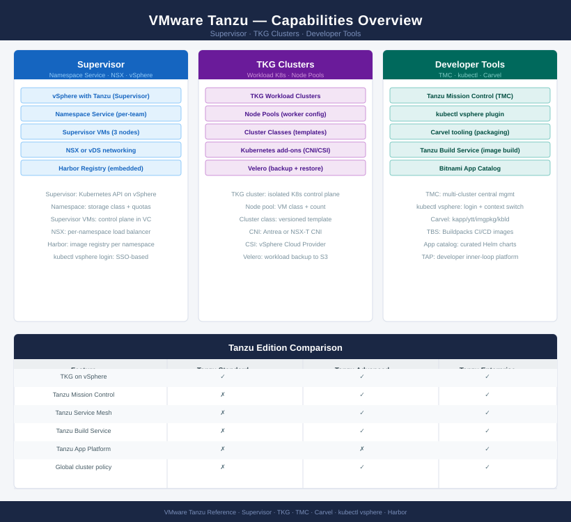
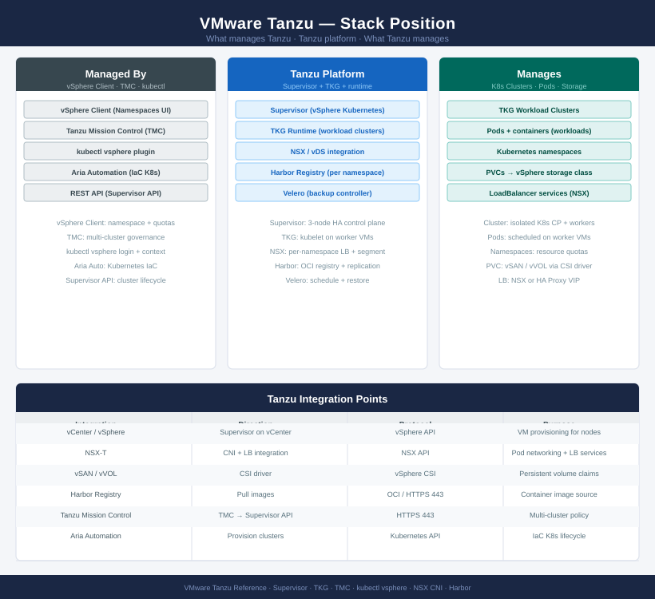

---
tags:
  - tanzu
  - vmware
description: "Tanzu knowledge base — deploy, architecture, operations, CLI references, security, and troubleshooting for VMware Tanzu Kubernetes Grid on vSphere."
---
# Tanzu

<div class="kb-summary">
Tanzu knowledge base — deploy, architecture, operations, CLI references, security, and troubleshooting for VMware Tanzu Kubernetes Grid on vSphere.

*Applies to: Tanzu 2.x*
</div>





```text
┌─────────────────────────── VMware Tanzu Kubernetes — Installation Sequence ───────────────────────────┐
│                                                                                                       │
│  Step 1 · Pre-Requisites                                                                              │
│  ─────────────────────────────────────────────────────────────────────────────────────────            │
│  vSphere 7.0 U2+ or vSphere 8  ·  Enterprise Plus licence (Workload Management)                       │
│  NSX-T deployed OR vSphere Distributed Switch 7.0+ for VDS networking mode                            │
│  Shared storage: vSAN or NFS/iSCSI datastore for supervisor control plane VMs                         │
│  DNS: A-records for Supervisor API server VIP + worker node VMs                                       │
│  NTP: all ESXi hosts and vCenter time-synced  ·  Registry (Harbor) planned                            │
│                                                                                                       │
│                                        │  enable Workload Management (Supervisor)                     │
│                                        ▼                                                              │
│  Step 2 · Enable Workload Management                                                                  │
│  ─────────────────────────────────────────────────────────────────────────────────────────            │
│  vCenter → Workload Management → Enable  ·  Select cluster                                            │
│  Choose networking: NSX-T (recommended) or VDS with HAProxy                                           │
│  Control Plane VMs: size (tiny/small/medium/large)  ·  3 VMs deployed automatically                   │
│  Ingress/Egress CIDR, Pod CIDRs, Service CIDR: enter non-overlapping ranges                           │
│  Wait for Supervisor Ready state  ·  Control plane VMs healthy in vCenter                             │
│                                                                                                       │
│                                        │  configure namespaces                                        │
│                                        ▼                                                              │
│  Step 3 · vSphere Namespace Configuration                                                             │
│  ─────────────────────────────────────────────────────────────────────────────────────────            │
│  Create vSphere namespace per team or environment                                                     │
│  Resource limits: CPU, memory, storage quotas per namespace                                           │
│  Storage policy: assign vSAN or NFS storage policy for PVC provisioning                               │
│  Network: assign NSX segment or VDS network to namespace                                              │
│  Permissions: assign AD users/groups to namespace with edit/view roles                                │
│                                                                                                       │
│                                        │  deploy Tanzu Kubernetes Grid clusters                       │
│                                        ▼                                                              │
│  Step 4 · TKG Cluster Deployment                                                                      │
│  ─────────────────────────────────────────────────────────────────────────────────────────            │
│  kubectl vsphere login --server <supervisor-VIP>  ·  Authenticate via AD/SSO                          │
│  Switch context to vSphere namespace  ·  Apply TanzuKubernetesCluster YAML                            │
│  Define control plane + worker node pools  ·  Choose TKR (Kubernetes release)                         │
│  Storage class and CNI (Antrea) applied automatically  ·  Cluster provisions                          │
│  Get kubeconfig  ·  kubectl get nodes  ·  All nodes Ready state confirmed                             │
│                                                                                                       │
│                                        │  deploy Harbor container registry                            │
│                                        ▼                                                              │
│  Step 5 · Harbor Container Registry                                                                   │
│  ─────────────────────────────────────────────────────────────────────────────────────────            │
│  Deploy Harbor via Aria Automation, Helm, or as embedded in Supervisor                                │
│  Set admin password  ·  Configure internal CA or upload CA-signed cert                                │
│  Create projects: one per team/namespace  ·  Assign project roles to AD groups                        │
│  Robot accounts: create per CI/CD pipeline  ·  Assign pull/push rights                                │
│  Configure replication: mirror images from Docker Hub / external registry                             │
│                                                                                                       │
│                                        │  developer onboarding                                        │
│                                        ▼                                                              │
│  Step 6 · Developer Onboarding                                                                        │
│  ─────────────────────────────────────────────────────────────────────────────────────────            │
│  Provide kubectl vsphere login command + Supervisor VIP to teams                                      │
│  Namespace RBAC: AD groups mapped to Kubernetes RBAC roles via namespace                              │
│  CI/CD integration: pipeline authenticates to Harbor  ·  Build → push → deploy                        │
│  Resource quotas enforced: pods over quota blocked  ·  Teams manage own limits                        │
│  Monitoring: Aria Operations with Kubernetes MP  ·  Alerts on pod failures                            │
│                                                                                                       │
└───────────────────────────────────────────────────────────────────────────────────────────────────────┘
```


<div class="kb-grid kb-grid-3">

<a class="kb-card" href="architecture/">
  <strong>Architecture</strong>
  <span>How it works, integrations, and design standards.</span>
</a>

<a class="kb-card" href="deploy/">
  <strong>Deploy</strong>
  <span>Workload Management enablement, Supervisor init, namespace config, and TKG cluster provisioning.</span>
</a>

<a class="kb-card" href="operations/">
  <strong>Operations</strong>
  <span>CLI reference, health checks, procedures, lifecycle, backup, and scripts.</span>
</a>

<a class="kb-card" href="security/">
  <strong>Security</strong>
  <span>Authentication, access control, encryption, and hardening.</span>
</a>

<a class="kb-card" href="troubleshooting/">
  <strong>Troubleshooting</strong>
  <span>Common issues, diagnostics, and escalation.</span>
</a>

</div>
