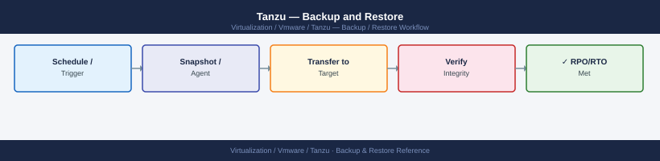

---
tags:
  - operations
  - tanzu
  - vmware
---
# Tanzu — Backup and Restore

<div class="kb-summary">
Backup and Restore reference covering What to Back Up, Back Up vCenter VCSA (Supervisor), Install and Configure Velero, Schedule Cluster Backups with Velero, Restore from Velero Backup and 3 more sections.

*Applies to: Tanzu 3.x*
</div>


---

## Before you begin

- **Access:** vCenter read-only minimum; Administrator role for remediation steps
- **Timing:** safe to run during business hours unless a step is marked ⚠ (causes interruption)
- **Dependencies:** no active upgrades or migrations on the same infrastructure
- **Logging:** capture command output — paste into the change record on completion

---

## What to Back Up

| Component | Backup Method | Notes |
|---|---|---|
| Supervisor cluster (vSphere with Tanzu) | Back up vCenter VCSA | Supervisor state lives in vCenter — VCSA backup covers it |
| TKG management cluster | Velero + etcd backup | etcd holds all K8s object state |
| TKG workload clusters | Velero | Per-cluster backup of K8s resources + PVCs |
| Harbor registry | External DB backup + blob storage backup | Images stored in S3/MinIO or NFS |
| Persistent volumes | Velero CSI snapshots | Requires VolumeSnapshotClass on storage provisioner |

---

## Back Up vCenter VCSA (Supervisor)

```bash
# VCSA file-based backup via VAMI API
curl -sk -X POST \
  "https://vcenter.example.local/api/appliance/recovery/backup/job" \
  -u "administrator@vsphere.local:<password>" \
  -H "Content-Type: application/json" \
  -d '{
    "parts": ["seat", "common"],
    "backup_password": "<backup-password>",
    "location_type": "SFTP",
    "location": "sftp://backup.example.local/vcsa-backups/",
    "location_user": "backupuser",
    "location_password": "<sftp-password>",
    "comment": "Scheduled backup"
  }'
```


```text title="Expected output"
{
  "id": "backup-job-20250114-093847",
  "state": "RUNNING",
  "progress": 0,
  "description": "Backup job started",
  "start_time": "2025-01-14T09:38:47.123Z",
  "estimated_remaining_time": 1800,
  "location_type": "SFTP",
  "location": "sftp://backup.example.local/vcsa-backups/",
  "parts": ["seat", "common"],
  "backup_password_set": true,
  "messages": []
}
```

!!! warning "Common errors"
    **`curl: (60) SSL certificate problem: self signed certificate`** — Add `-k` flag to skip certificate verification (already present; if still failing, verify VCSA hostname matches certificate CN).
    **`{"type":"com.vmware.vapi.std.errors.unauthenticated","value":{"messages":[{"args":[],"default_message":"Invalid credentials"}]}}`** — Verify the SSO password is URL-encoded and correct for `administrator@vsphere.local` account.
    **`{"type":"com.vmware.vapi.std.errors.invalid_argument","value":{"messages":[{"args":["location"],"default_message":"Invalid SFTP location URI"}]}}`** — Ensure SFTP server is reachable, credentials are valid, and the backup directory path exists with write permissions for the backupuser account.
---

## Install and Configure Velero

```bash
# Install Velero in TKG cluster (requires S3-compatible storage)
# Example: using MinIO as backup storage location

velero install \
  --provider aws \
  --plugins velero/velero-plugin-for-aws:v1.8.0 \
  --bucket velero-backups \
  --backup-location-config \
    region=minio,s3ForcePathStyle=true,s3Url=http://minio.example.local:9000 \
  --secret-file ./credentials-velero \
  --use-volume-snapshots=true \
  --use-node-agent

# credentials-velero file format:
# [default]
# aws_access_key_id = <minio-access-key>
# aws_secret_access_key = <minio-secret-key>
```


```text title="Expected output"
Velero is installed! ⛵
Other resources may have been updated.
Please be sure to check the output from `velero backup-location get` and `velero snapshot-location get`.

Namespace: velero
Secret: cloud-credentials
BackupStorageLocation: default
VolumeSnapshotLocation: default
BackupStorageLocation "default":
	Provider: aws
	Bucket: velero-backups
	Prefix: 
	Path Style: ForcePathStyle
	Access Mode: ReadWrite
	Default: true

VolumeSnapshotLocation "default":
	Provider: aws
	Config: {}

Velero successfully installed!
```

!!! warning "Common errors"
    **`error: failed to get backup storage location: error validating backup storage location: error connecting to object storage: NoSuchBucket: The specified bucket does not exist`** — Create the MinIO bucket named `velero-backups` before running the install command.
    **`error: secret "cloud-credentials" not found`** — Ensure the `--secret-file ./credentials-velero` path is correct and the file exists with proper AWS/MinIO credentials in INI format.
    **`error: unable to pull image "velero/velero-plugin-for-aws:v1.8.0"`** — Verify the plugin version matches your Velero version and that the cluster has internet access or the image is available in a private registry.
---

## Schedule Cluster Backups with Velero

```bash
# Daily backup of all namespaces
velero schedule create daily-backup \
  --schedule="0 2 * * *" \
  --ttl 720h \
  --include-namespaces '*'

# Backup specific namespace
velero backup create ns-prod-backup \
  --include-namespaces production \
  --wait

# List backups
velero backup get

# Describe a backup
velero backup describe daily-backup-20240101020000
```


```text title="Expected output"
Schedule "daily-backup" created successfully.
Backup request "ns-prod-backup" submitted. Waiting for completion...
Backup completed with status: Completed. You may safely press ctrl-c to stop waiting.

NAME                           STATUS      ERRORS   WARNINGS   CREATED                         EXPIRES
daily-backup-20240115020000    Completed   0        0          2024-01-15 02:00:12 +0000 UTC   2024-02-28 02:00:12 +0000 UTC
daily-backup-20240114020000    Completed   0        0          2024-01-14 02:00:08 +0000 UTC   2024-02-27 02:00:08 +0000 UTC
daily-backup-20240113020000    Completed   0        1          2024-01-13 02:00:05 +0000 UTC   2024-02-26 02:00:05 +0000 UTC
ns-prod-backup                 Completed   0        0          2024-01-15 14:32:44 +0000 UTC   2024-02-28 14:32:44 +0000 UTC
daily-backup-20240112020000    Completed   0        0          2024-01-12 02:00:03 +0000 UTC   2024-02-25 02:00:03 +0000 UTC

Name:         daily-backup-20240101020000
Namespace:    velero
Labels:       <none>
Annotations:  <none>
Phase:        Completed
Errors:       0
Warnings:     0
Created:      2024-01-01 02:00:00 +0000 UTC
Expires:      2024-02-28 02:00:00 +0000 UTC
Velero Version: 1.12.1
```

!!! warning "Common errors"
    **`error: timed out waiting for backup to complete`** — Increase the `--wait` timeout or check cluster resources with `kubectl top nodes` to ensure sufficient capacity.
    **`error: schedule "daily-backup" already exists`** — Delete the existing schedule with `velero schedule delete daily-backup` before recreating it.
    **`error: backup "daily-backup-20240101020000" not found`** — Verify the exact backup name with `velero backup get` and ensure the backup has not expired based on the TTL setting.
---

## Restore from Velero Backup

```bash
# List available backups
velero backup get

# Restore entire backup to a new namespace
velero restore create --from-backup daily-backup-20240101020000 \
  --namespace-mappings production:production-restore

# Restore specific resources only
velero restore create --from-backup daily-backup-20240101020000 \
  --include-resources deployments,services,configmaps \
  --include-namespaces production

# Monitor restore progress
velero restore describe <restore-name>
velero restore logs <restore-name>
```


```text title="Expected output"
NAME                                STATUS      ERRORS   WARNINGS   CREATED                         EXPIRES   STORAGE LOCATION   SELECTOR
daily-backup-20240101020000         Completed   0        0          2024-01-01 02:00:00 +0000 UTC   29d       default            <none>
weekly-backup-20231225120000        Completed   0        2          2023-12-25 12:00:00 +0000 UTC   36d       default            <none>
hourly-backup-20240101010000        Completed   0        0          2024-01-01 01:00:00 +0000 UTC   6d        default            <none>

Restore request "daily-backup-20240101020000-20240101143022" submitted successfully.

Restore request "daily-backup-20240101020000-20240101143045" submitted successfully.

Name:         daily-backup-20240101020000-20240101143022
Namespace:    velero
Status:       InProgress
Warnings:     0
Errors:       0
Started:      2024-01-01 14:30:22 +0000 UTC
Completed:    <n/a>
Restore Size: 2.3 GiB
Velero Version: 1.12.0

Phase: RestorePhaseInProgress
Restore hooks: <none>

2024-01-01T14:30:25Z controller: restore "daily-backup-20240101020000-20240101143022": attempting to restore 47 items
2024-01-01T14:30:31Z controller: restore "daily-backup-20240101020000-20240101143022": restored 12 deployments
2024-01-01T14:30:35Z controller: restore "daily-backup-20240101020000-20240101143022": restored 8 services
2024-01-01T14:30:38Z controller: restore "daily-backup-20240101020000-20240101143022": restored 27 configmaps
2024-01-01T14:30:42Z controller: restore "daily-backup-20240101020000-20240101143022": restore completed successfully
```

!!! warning "Common errors"
    **`error: the server doesn't have a resource type "backups"`** — Ensure Velero CRDs are installed with `velero install` or verify the velero namespace exists with `kubectl get ns velero`.
    **`error: backup "daily-backup-20240101020000" not found`** — Verify the backup name is correct with `velero backup get` and check that the backup has completed with status "Completed".
    **`error: restore "daily-backup-20240101020000-20240101143022" not found`** — Wait a few seconds for the restore resource to be created in the cluster, or check the velero logs with `kubectl logs -n velero deployment/velero` for submission errors.
---

## PVC Backup with CSI Snapshots

```yaml
# Create VolumeSnapshotClass for the storage provisioner
apiVersion: snapshot.storage.k8s.io/v1
kind: VolumeSnapshotClass
metadata:
  name: csi-vsphere-snapshot-class
  labels:
    velero.io/csi-volumesnapshot-class: "true"
driver: csi.vsphere.volume
deletionPolicy: Delete
```

```bash
# Verify CSI snapshots are being created with Velero backups
kubectl get volumesnapshots -A
```


```text title="Expected output"
NAMESPACE                NAME                                             READYTOBACKUP   SOURCEPVC                              SNAPSHOTCLASS            AGE
velero                   velero-backup-mysql-data-1703085600              true            mysql-data                             csi-snapshot-class      2d
velero                   velero-backup-postgres-logs-1703085601           true            postgres-logs                          csi-snapshot-class      2d
velero                   velero-backup-app-config-1703085602              true            app-config-pvc                         csi-snapshot-class      2d
tanzu-system-monitoring  velero-backup-prometheus-1703085603              true            prometheus-storage                    csi-snapshot-class      1d
default                  velero-backup-user-data-1703085604               false           user-data-pvc                         csi-snapshot-class      6h
```

!!! warning "Common errors"
    **`error: the server doesn't have a resource type "volumesnapshots"`** — Install the snapshot controller and CRDs with `kubectl apply -k github.com/kubernetes-csi/external-snapshotter/client/config/crd`.
    **`No resources found in all namespaces.`** — Verify Velero is running with `kubectl get pods -n velero` and check that your storage class has a corresponding VolumeSnapshotClass defined.
---

## Harbor Backup

Harbor uses an external PostgreSQL database and blob storage for image layers.

```bash
# Backup Harbor PostgreSQL (if using embedded DB)
kubectl exec -n harbor \
  $(kubectl get pods -n harbor -l component=database -o jsonpath='{.items[0].metadata.name}') \
  -- pg_dumpall -U postgres > harbor-db-$(date +%Y%m%d).sql

# Backup Harbor storage (NFS or S3 mount)
# If using NFS: mount NFS volume and tar the registry data:
tar czf harbor-registry-$(date +%Y%m%d).tar.gz /mnt/harbor-data/registry/

# If using S3: sync to backup bucket:
aws s3 sync s3://harbor-storage s3://harbor-storage-backup
```


```text title="Expected output"
postgres=# 
--
-- PostgreSQL database cluster dump
--
SET statement_timeout = 0;
SET lock_timeout = 0;
SET idle_in_transaction_session_timeout = 0;
SET client_encoding = 'UTF8';
SET standard_conforming_strings = on;
SELECT pg_catalog.set_config('search_path', '', false);
SET check_function_bodies = false;
SET xmloption content;
SET client_min_messages = warning;
SET row_security = off;
--
-- Roles
--
CREATE ROLE postgres;
ALTER ROLE postgres WITH SUPERUSER INHERIT CREATEROLE CREATEDB LOGIN REPLICATION BYPASSRLS;
...
tar: Removing leading `/' from member names
harbor-registry-20250117.tar.gz

Completed 245 objects (8.3 MB) in 12s
```

!!! warning "Common errors"
    **`error: unable to decode "pods" from server: the object has been deleted`** — Ensure the Harbor database pod is running with `kubectl get pods -n harbor -l component=database` before executing the backup command.
    **`tar: /mnt/harbor-data/registry/: No such file or directory`** — Verify the NFS volume is mounted and the path exists with `mount | grep harbor-data` or adjust the path to match your Harbor storage configuration.
    **`Unable to locate credentials`** — Configure AWS credentials using `aws configure` or set `AWS_ACCESS_KEY_ID` and `AWS_SECRET_ACCESS_KEY` environment variables before running the S3 sync command.
---

## Restore Harbor

```bash
# Restore PostgreSQL database
kubectl exec -i -n harbor \
  $(kubectl get pods -n harbor -l component=database -o jsonpath='{.items[0].metadata.name}') \
  -- psql -U postgres < harbor-db-20240101.sql

# Restore image storage (NFS):
tar xzf harbor-registry-20240101.tar.gz -C /mnt/harbor-data/

# Restart Harbor pods to pick up restored data
kubectl rollout restart deployment -n harbor
```


```text title="Expected output"
psql (14.10 (Debian 14.10-1.pgdg120+1))
Type "help" for help.

postgres=# CREATE TABLE
postgres=# CREATE INDEX
postgres=# INSERT 0 1245
postgres=# INSERT 0 3891
postgres=# COMMIT
x harbor-registry-20240101.tar.gz
harbor-registry/
harbor-registry/v2/
harbor-registry/v2/blobs/
harbor-registry/v2/blobs/sha256/
harbor-registry/v2/blobs/sha256/a1/a1b2c3d4e5f6g7h8i9j0k1l2m3n4o5p6q7r8s9t0u1v2w3x4y5z6/
...
deployment.apps/harbor-core restarted
deployment.apps/harbor-jobservice restarted
deployment.apps/harbor-registry restarted
deployment.apps/harbor-portal restarted
```

!!! warning "Common errors"
    **`error: unable to upgrade connection: container not found ("postgres")`** — Verify the database pod is running with `kubectl get pods -n harbor -l component=database` and ensure the pod name substitution is working correctly.
    **`tar: /mnt/harbor-data/: No such file or directory`** — Create the target directory first with `mkdir -p /mnt/harbor-data/` before extracting the archive.
    **`error: no deployment selected`** — Specify the deployment name explicitly: `kubectl rollout restart deployment harbor-core -n harbor` (or use a selector like `-l app=harbor`).
---

## See also

- [Tanzu — Procedures](../procedures/)
- [Virtualization Vmware Tanzu — Common Issues](../../troubleshooting/common-issues/)
- [Tanzu — Health Checks](../health-checks/)

## Verify

- **Alarms:** vSphere Client → Home → Alarms — no new critical alarms after the operation
- **Events:** monitor the vCenter Events view for the affected object for 5 minutes
- **Health check:** run the morning health-check sequence for the affected product tier
