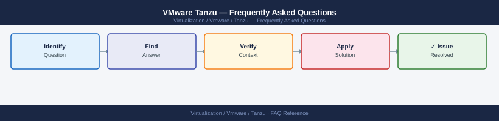

---
tags:
  - tanzu
  - faq
  - operations
description: "Common questions about VMware Tanzu operations, configuration, and troubleshooting. For step-by-step procedures, see the Operations section."
---
# VMware Tanzu — Frequently Asked Questions

*Applies to: VMware Tanzu*

Common questions about VMware Tanzu operations, configuration, and troubleshooting. For step-by-step procedures, see the <a href="index.md">Operations</a> section.

## General

**Q: What Tanzu Kubernetes Grid version is recommended?**
A: TKG 2.4.x or the Supervisor-embedded Kubernetes version tied to your vSphere version. Check: `tanzu version` (CLI) or vCenter → Workload Management → Supervisors → Kubernetes version.

**Q: How do I check the current VMware Tanzu version?**
A: `tanzu version`

## Configuration

**Q: What is the default node size for Tanzu Kubernetes clusters?**
A: Default is 2 vCPU / 4 GB RAM per worker node (small). Use medium (2 vCPU / 8 GB) or large (4 vCPU / 16 GB) for production workloads. Set in the TanzuKubernetesCluster spec under `nodePools[].vmClass`.

**Q: How do I enable Tanzu Service Mesh (TSM) for inter-cluster networking?**
A: TSM is a separate SaaS service (console.cloud.vmware.com). Onboard clusters by deploying the TSM agent: `kubectl apply -f tsm-agent.yaml`. Configure global namespaces for cross-cluster service discovery.

## Operations

**Q: How do I upgrade Tanzu Kubernetes clusters without downtime?**
A: Update the TanzuKubernetesCluster spec to the new Kubernetes version. The supervisor performs rolling node replacement. Control plane nodes update first, then workers one at a time. Monitor with `kubectl get nodes -w`.

**Q: What is the correct procedure to provision a new Tanzu Kubernetes cluster?**
A: kubectl apply a `TanzuKubernetesCluster` CR in the vSphere namespace. Specify control plane and worker node count, VM class, and storage class. The Supervisor creates the cluster within 10-20 minutes.

## Troubleshooting

**Q: Tanzu Kubernetes cluster shows 'NodeNotReady'. What does it mean?**
A: A cluster node cannot communicate with the API server or its kubelet is unhealthy. Check the node VM in vCenter. SSH to the node and check `systemctl status kubelet`. Common causes: disk pressure, network misconfiguration, or failed CNI plugin.

**Q: Pods on Tanzu clusters have high scheduling latency — where do I start?**
A: Check node resource utilisation: `kubectl describe nodes | grep -A5 Allocated`. Review scheduler events: `kubectl get events --sort-by=.metadata.creationTimestamp`. Check storage class provisioning time — slow PVC creation delays pod starts.

## Backup and Recovery

**Q: How often should I back up Tanzu cluster configuration?**
A: Store all TanzuKubernetesCluster manifests in Git. Use Velero (installed via Tanzu Mission Control) for application-level namespace backup. Back up the Supervisor etcd as part of vCenter backup.

**Q: Can I restore a deleted Tanzu namespace without a full cluster restore?**
A: If Velero backups were configured, restore the namespace: `velero restore create --from-backup <backup-name> --include-namespaces <ns>`. Without Velero, the namespace content is lost — only the TanzuKubernetesCluster CR (stored in vCenter) is recoverable.

## See Also

- [VMware Tanzu Operations](index.md)
- [VMware Tanzu Troubleshooting](../troubleshooting/index.md)
