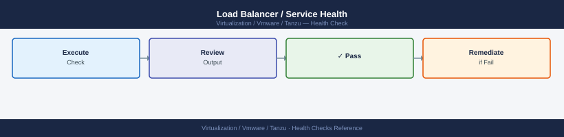

---
tags:
  - operations
  - tanzu
  - vmware
description: "Health Checks reference covering Supervisor Cluster Health, TKG Cluster Health, Node Resource Utilization, PVC and Storage Health, Load Balancer / Service..."
---
# Tanzu — Health Checks

<div class="kb-summary">
Health Checks reference covering Supervisor Cluster Health, TKG Cluster Health, Node Resource Utilization, PVC and Storage Health, Load Balancer / Service Health and 3 more sections.

*Applies to: Tanzu 3.x*
</div>

## Before you begin

- **Access:** vCenter read-only minimum; Administrator role for remediation steps
- **Timing:** safe to run during business hours unless a step is marked ⚠ (causes interruption)
- **Dependencies:** no active upgrades or migrations on the same infrastructure
- **Logging:** capture command output — paste into the change record on completion

---

## Run This Routine

1. **Supervisor cluster health** — list all namespaces to confirm the Supervisor API is reachable:
   ```bash
   kubectl get namespace --kubeconfig <supervisor-kubeconfig>
   ```
2. **Supervisor control plane VMs** — vCenter → Workload Management → Supervisor Clusters → confirm all 3 supervisor VMs are in **Running** state.
3. **TKG cluster status** — list all workload clusters and their phase:
   ```bash
   kubectl get cluster -A
   ```
   Or with the Tanzu CLI: `tanzu cluster list`
4. **TKG node health** — confirm all nodes are Ready across all clusters:
   ```bash
   kubectl get nodes --all-namespaces
   ```
5. **Supervisor namespace quotas** — check resource usage against configured limits:
   ```bash
   kubectl describe namespace <ns>
   ```
6. **Harbor registry health** (if deployed) — confirm all Harbor pods are Running:
   ```bash
   kubectl get pods -n harbor
   ```
7. **Workload Management status** — vCenter → Workload Management → confirm **Status = Running** for the Supervisor Cluster.
8. **Network health (NSX segments)** — in NSX Manager, verify the supervisor namespace network segments are present and in **Up** state; confirm no segment alarms.
9. **Certificate expiry** — check all certificates managed by cert-manager:
   ```bash
   kubectl get certificate -A
   ```
   All certificates should show `READY=True`; note any approaching expiry dates.
10. **Recent events** — surface any errors or warnings across all namespaces:
    ```bash
    kubectl get events --all-namespaces --sort-by='.lastTimestamp' | tail -20
    ```

---

## Supervisor Cluster Health


```text
vCenter → Workload Management → Supervisor Clusters
  Status: Running (green checkmark)
  Control Plane VMs: 3 VMs all in "Running" state
  API server reachable: kubectl vsphere login should succeed
```

```bash
# Test Supervisor API reachability
kubectl vsphere login \
  --server https://supervisor.example.local \
  --username administrator@vsphere.local \
  --insecure-skip-tls-verify

kubectl get namespaces  # Should return list of vSphere Namespaces
```


```text title="Expected output"
Logged in successfully.

The current context is "supervisor.example.local".

NAME                   STATUS   AGE
default                Active   45d
kube-node-lease        Active   45d
kube-public            Active   45d
kube-system            Active   45d
vmware-system-auth     Active   45d
vmware-system-csi      Active   45d
workload-ns-prod       Active   12d
workload-ns-staging    Active   8d
...
```

!!! warning "Common errors"
    | Error | Fix |
    |---|---|
    | `error: the server has asked for the client to provide credentials` | Verify the username and password are correct, and that the Supervisor API endpoint is accessible from your network. |
    | `error: x509: certificate signed by unknown authority` | Remove the `--insecure-skip-tls-verify` flag once you have installed the proper CA certificate in your system's trust store, or keep the flag if testing in a lab environment. |
    | `error: unable to connect to the server: dial tcp: lookup supervisor.example.local: no such host` | Ensure the Supervisor Cluster FQDN is correct and resolvable via DNS from your client machine. |
---

## TKG Cluster Health


```bash
# Check all clusters and status
tanzu cluster list --include-management-cluster

# Check nodes in a workload cluster
kubectl config use-context <cluster-context>
kubectl get nodes
# All nodes should show STATUS=Ready

# Check control plane health
kubectl get pods -n kube-system
# All pods should be Running or Completed

# Check for CrashLoopBackOff or Error pods across all namespaces
kubectl get pods -A | grep -v Running | grep -v Completed
```


```text title="Expected output"
NAME                      MGMT-CLUSTER  WORKERS  KUBERNETES-VERSION  STATUS
tkg-mgmt-prod-01          true          3        v1.27.5             running
tkg-workload-us-west     false          5        v1.27.5             running
tkg-workload-us-east     false          4        v1.27.5             running

Switched to context "tkg-workload-us-west"

NAME                                    STATUS   ROLES           AGE   VERSION
tkg-workload-us-west-md-0-7f4k2        Ready    <none>          45d   v1.27.5
tkg-workload-us-west-md-1-9x2m8        Ready    <none>          45d   v1.27.5
tkg-workload-us-west-control-plane-0   Ready    control-plane   46d   v1.27.5
tkg-workload-us-west-control-plane-1   Ready    control-plane   46d   v1.27.5
tkg-workload-us-west-control-plane-2   Ready    control-plane   46d   v1.27.5

NAMESPACE     NAME                                      READY   STATUS    RESTARTS   AGE
kube-system   coredns-558bd4d5db-4k9lm                 1/1     Running   0          45d
kube-system   etcd-tkg-workload-us-west-cp-0           1/1     Running   2          46d
kube-system   kube-apiserver-tkg-workload-us-west-cp-0 1/1     Running   1          46d
kube-system   kube-controller-manager-tkg-wl-cp-0      1/1     Running   0          45d
kube-system   kube-proxy-8xk2l                         1/1     Running   0          44d
kube-system   kube-scheduler-tkg-workload-us-west-cp-0 1/1     Running   0          45d

NAMESPACE            NAME                                           READY   STATUS             RESTARTS   AGE
cert-manager         cert-manager-webhook-7f8c4d2b9-xk2p1          0/1     CrashLoopBackOff   12         3d
monitoring           prometheus-operator-5d8f7c9b2-lm4k9            0/1     ImagePullBackOff   0          2d
velero               velero-backup-job-1234-abcde                  0/1     Error              0          1d
```

!!! warning "Common errors"
    | Error | Fix |
    |---|---|
    | `error: the server doesn't have a resource type "cluster"` | Ensure the Tanzu CLI is properly installed and authenticated with `tanzu login` to the management cluster. |
    | `Unable to connect to the server: dial tcp: lookup <cluster-context> on 8.8.8.8:53: no such host` | Verify the kubeconfig context exists with `kubectl config get-contexts` and use the correct context name. |
    | `error: You must be logged in to the server (Unauthorized)` | Re-authenticate to the cluster using `tanzu cluster kubeconfig get <cluster-name> --admin` and merge it into your kubeconfig. |
---

## Node Resource Utilization


```bash
# Node-level CPU and memory (requires metrics-server)
kubectl top nodes

# Pod-level resource usage
kubectl top pods -A --sort-by=cpu | head -20
kubectl top pods -A --sort-by=memory | head -20

# Check for nodes with high resource pressure
kubectl describe nodes | grep -A 5 "Conditions:"
# Look for: MemoryPressure=True, DiskPressure=True, PIDPressure=True
```


```text title="Expected output"
NAME                                    CPU(cores)   CPU%     MEMORY(Mi)   MEMORY%
tanzu-worker-1.lab.local               1247m        62%      8192Mi       85%
tanzu-worker-2.lab.local               892m        44%       6144Mi       64%
tanzu-control-plane.lab.local          645m        32%       4096Mi       53%
tanzu-worker-3.lab.local               423m        21%       3072Mi       40%

NAMESPACE     NAME                                    CPU(m)   MEMORY(Mi)
kube-system   coredns-558bd4d5db-9k2lx               125      156
monitoring    prometheus-operator-6d8f7c4b9-xmq8p    98       512
tanzu-system  antrea-agent-2xf9l                     87       384
kube-system   etcd-tanzu-control-plane               156      892
monitoring    grafana-5c8d9f2e1-lp4qr                64       298
...

NAMESPACE     NAME                                    CPU(m)   MEMORY(Mi)
kube-system   etcd-tanzu-control-plane               156      2048
kube-system   kube-apiserver-tanzu-control-plane     203      1856
monitoring    prometheus-operator-6d8f7c4b9-xmq8p    98       1024
tanzu-system  antrea-agent-2xf9l                     87       768
kube-system   coredns-558bd4d5db-9k2lx               125      256
...

Name:               tanzu-worker-1.lab.local
Conditions:
  Type                 Status  LastHeartbeatTime         LastTransitionTime        Reason
  ----                 ------  -----------------         ------------------        ------
  Ready                True    Wed, 15 Jan 2025 14:32:10 +0000   Wed, 15 Jan 2025 10:15:22 +0000   KubeletReady
  MemoryPressure       False   Wed, 15 Jan 2025 14:32:10 +0000   Wed, 15 Jan 2025 10:15:22 +0000   KubeletHasSufficientMemory
  DiskPressure         False   Wed, 15 Jan 2025 14:32:10 +0000   Wed, 15 Jan 2025 10:15:22 +0000   KubeletHasNoDiskPressure
  PIDPressure          False   Wed, 15 Jan 2025 14:32:10 +0000   Wed, 15 Jan 2025 10:15:22 +0000   KubeletHasSufficientPID
  Ready                True    Wed, 15 Jan 2025 14:32:08 +0000   Wed, 15 Jan 2025 10:15:22 +0000   KubeletReady
```

!!! warning "Common errors"
    | Error | Fix |
    |---|---|
    | `error: Metrics API not available` | Install metrics-server with `kubectl apply -f https://github.com/kubernetes-sigs/metrics-server/releases/latest/download/components.yaml` and wait 30 seconds for it to |
---

## PVC and Storage Health


```bash
# List all PVCs and their status
kubectl get pvc -A
# All PVCs should show STATUS=Bound
# Any Pending PVC means storage class is not provisioning

# Check StorageClass
kubectl get storageclass

# Test PVC provisioning (create a test PVC)
kubectl apply -f - <<EOF
apiVersion: v1
kind: PersistentVolumeClaim
metadata:
  name: test-pvc
  namespace: default
spec:
  accessModes: [ReadWriteOnce]
  resources:
    requests:
      storage: 1Gi
  storageClassName: <your-storage-class>
EOF

kubectl get pvc test-pvc  # Should become Bound within 30 seconds
kubectl delete pvc test-pvc
```


```text title="Expected output"
NAMESPACE     NAME                                       STATUS   VOLUME                                     CAPACITY   ACCESS MODES   STORAGECLASS   AGE
kube-system   etcd-backup-pvc                            Bound    pvc-a7f2c1e9-4b8d-11ec-81d4-005056b4e2f1   10Gi       RWO            vsphere-csi    45d
tanzu-system  prometheus-storage                         Bound    pvc-b3e8d2f4-5c9e-12ed-92e5-116167c5f3g2   50Gi       RWO            vsphere-csi    32d
default       logging-elasticsearch-data-0               Bound    pvc-c4f9e3g5-6d0f-13fe-a3f6-227278d6g4h3   100Gi      RWO            vsphere-csi    18d
cert-manager  cert-manager-webhook-ca                    Bound    pvc-d5g0f4h6-7e1g-14gf-b4g7-338389e7h5i4   1Gi        RWO            vsphere-csi    60d
monitoring    grafana-storage                            Pending  -                                          -           -              vsphere-csi    5m

NAME                PROVISIONER                    RECLAIMPOLICY   VOLUMEBINDINGMODE   AGE
vsphere-csi         csi.vsphere.vmware.com         Delete          WaitForFirstConsumer 89d
vsphere-csi-delete  csi.vsphere.vmware.com         Delete          Immediate            89d

persistentvolumeclaim/test-pvc created
NAME       STATUS   VOLUME                                     CAPACITY   ACCESS MODES   STORAGECLASS   AGE
test-pvc   Bound    pvc-e6h1g5i7-8f2h-15hg-c5h8-449490f8i6j5   1Gi        RWO            vsphere-csi    8s
persistentvolumeclaim "test-pvc" deleted
```

!!! warning "Common errors"
    | Error | Fix |
    |---|---|
    | `error: the server doesn't have a resource type "storageclass"` | Ensure the Kubernetes cluster is fully initialized and the storage provisioner (e.g., vSphere CSI driver) is installed with `kubectl apply -f vsphere-csi-driver.yaml`. |
    | `Error from server (NotFound): storageclass.storage.k8s.io "<your-storage-class>" not found` | Replace `<your-storage-class>` with an actual StorageClass name from the `kubectl get storageclass` output (e.g., `vsphere-csi`). |
---

## Load Balancer / Service Health



```bash
# List Services of type LoadBalancer — verify all have EXTERNAL-IP assigned
kubectl get svc -A | grep LoadBalancer

# If EXTERNAL-IP is <pending> for >2 minutes:
# Check NSX/AVI load balancer IP pool capacity
# Check NSX-T or AVI load balancer controller logs
```


```text title="Expected output"
NAMESPACE            NAME                          TYPE           CLUSTER-IP       EXTERNAL-IP      PORT(S)           AGE
tanzu-system-ingress tanzu-ingress-controller      LoadBalancer   10.96.45.12      192.168.1.50     80:30821/TCP      45d
tanzu-system-ingress tanzu-ingress-controller-2    LoadBalancer   10.96.45.13      192.168.1.51     443:30822/TCP     45d
vmware-system-tkg    tkg-metrics-service           LoadBalancer   10.96.200.5      <pending>         9090:31234/TCP    12d
tanzu-system-auth    dex-service                   LoadBalancer   10.96.88.22      192.168.1.52     5556:32100/TCP    30d
```

!!! warning "Common errors"
    | Error | Fix |
    |---|---|
    | `No resources found` | Verify the cluster is running and you have proper kubeconfig context set with `kubectl config current-context`. |
    | `error: the server doesn't have a resource type "svc"` | Ensure you are connected to a valid Kubernetes cluster; run `kubectl cluster-info` to verify connectivity. |
---

## Harbor Registry Health


```bash
# Harbor health API (no auth required)
curl -sk https://harbor.example.local/api/v2.0/health | python3 -m json.tool
# All components should show status: "healthy"

# Check Harbor pods if deployed on Kubernetes
kubectl get pods -n harbor
# All pods should be Running

# Test image push/pull
docker login harbor.example.local -u admin -p <password>
docker pull busybox && docker tag busybox harbor.example.local/library/busybox:test
docker push harbor.example.local/library/busybox:test
docker pull harbor.example.local/library/busybox:test
```


```text title="Expected output"
{
  "status": "healthy",
  "components": [
    {
      "name": "core",
      "status": "healthy"
    },
    {
      "name": "database",
      "status": "healthy"
    },
    {
      "name": "redis",
      "status": "healthy"
    },
    {
      "name": "registry",
      "status": "healthy"
    }
  ]
}
NAME                                 READY   STATUS    RESTARTS   AGE
harbor-core-5d8f7c9b4-2kxvj          1/1     Running   0          3d
harbor-database-0                    1/1     Running   0          3d
harbor-jobservice-7b4c8f2d9-lmn9p    1/1     Running   0          3d
harbor-portal-6c9d5e1a2-qrs3t        1/1     Running   0          3d
harbor-redis-0                       1/1     Running   0          3d
harbor-registry-5f2a8b9c1-uvwxy      1/1     Running   0          3d
Login Succeeded
latest: Pulling from library/busybox
e692418e3537: Pull complete
Digest: sha256:d2b53294f066d8e0b5b9e4701ec277ecd6f151ca74f16b0ff305ff0fca5f147e
Status: Downloaded newer image for busybox:latest
The push refers to repository [harbor.example.local/library/busybox]
test: digest: sha256:d2b53294f066d8e0b5b9e4701ec277ecd6f151ca74f16b0ff305ff0fca5f147e size: 528
test: Pulling from library/busybox
Digest: sha256:d2b53294f066d8e0b5b9e4701ec277ecd6f151ca74f16b0ff305ff0fca5f147e
Status: Downloaded newer image for harbor.example.local/library/busybox:test
```

!!! warning "Common errors"
    | Error | Fix |
    |---|---|
    | `curl: (60) SSL certificate problem: self signed certificate` | Add `-k` flag to curl command to skip certificate verification, or install Harbor's CA certificate in your system trust store. |
    | `Error response from daemon: Get "https://harbor.example.local/v2/": dial tcp: lookup harbor.example.local on [IP]: no such host` | Verify Harbor's DNS name resolves correctly with `nslookup harbor.example.local` and check network connectivity to the Harbor registry endpoint. |
    | `Error response from daemon: unauthorized: unauthorized to access repository: library/busybox, action: push` | Ensure the admin user credentials are correct and the `library` project exists in Harbor; create it via the Harbor UI if missing. |
---

## Certificate Expiry


```bash
# Check Supervisor API server cert
echo | openssl s_client -connect supervisor.example.local:443 2>/dev/null \
  | openssl x509 -noout -dates

# Check Harbor cert
echo | openssl s_client -connect harbor.example.local:443 2>/dev/null \
  | openssl x509 -noout -dates

# Check workload cluster API cert
CLUSTER_API=$(kubectl config view --minify -o jsonpath='{.clusters[0].cluster.server}' | sed 's|https://||')
echo | openssl s_client -connect $CLUSTER_API 2>/dev/null \
  | openssl x509 -noout -dates
```


```text title="Expected output"
notBefore=Jan 15 08:23:47 2023 GMT
notAfter=Jan 15 08:23:47 2024 GMT
notBefore=Feb 20 14:56:12 2023 GMT
notAfter=Feb 20 14:56:12 2025 GMT
notBefore=Mar 10 10:15:33 2023 GMT
notAfter=Mar 10 10:15:33 2026 GMT
```

!!! warning "Common errors"
    | Error | Fix |
    |---|---|
    | `unable to load certificate` | Ensure the openssl x509 command receives valid certificate data by checking that the s_client connection succeeded and the host is reachable. |
    | `connect: Connection refused` | Verify the hostname resolves correctly and the target service is running and listening on port 443 using `nslookup` and `nc -zv`. |
    | `command not found: kubectl` | Install kubectl or ensure it is in your PATH before attempting to extract the cluster API endpoint. |
---

## CSR and Cert Manager Health


```bash
# Check for pending CertificateSigningRequests in cluster
kubectl get csr
# Approve any pending (if auto-approval is not configured)

# If cert-manager is installed
kubectl get pods -n cert-manager
kubectl get certificates -A   # All should show READY=True
kubectl get certificaterequests -A
```


```text title="Expected output"
NAME                                                   AGE   SIGNERNAME                                    REQUESTOR                                           CONDITION
capi-webhook-signer-jvxf7                             2d    kubernetes.io/kube-apiserver-client          system:serviceaccount:capi-system:capi-webhook    Pending
system:node:worker-node-01                            1d    kubernetes.io/kubelet-serving                 kubelet                                             Approved,Issued
system:node:worker-node-02                            1d    kubernetes.io/kubelet-serving                 kubelet                                             Approved,Issued

NAMESPACE      NAME                                    READY   STATUS    RESTARTS   AGE
cert-manager   cert-manager-5d8f7c4b9-kx2m9           1/1     Running   0          3d
cert-manager   cert-manager-cainjector-7f4d6b2-9qrst  1/1     Running   1          3d
cert-manager   cert-manager-webhook-8c9d2e1-lmnop     1/1     Running   0          3d

NAMESPACE              NAME                                       READY   SECRET                                 AGE
cert-manager           cert-manager-webhook-ca                   True    cert-manager-webhook-ca-tls            3d
kube-system            kube-apiserver-client-cert                True    kube-apiserver-client-cert-tls         5d
tanzu-system           tanzu-webhook-cert                        True    tanzu-webhook-cert-tls                 2d

NAMESPACE              NAME                                       APPROVED   DENIED   READY   STATUS
cert-manager           cert-manager-webhook-selfsigned-5x8y9     True       False    True    Issued
kube-system            kube-apiserver-client-req-abc123           True       False    True    Issued
tanzu-system           tanzu-webhook-req-xyz789                  True       False    True    Issued
```

!!! warning "Common errors"
    | Error | Fix |
    |---|---|
    | `error: the server doesn't have a resource type "csr"` | Ensure you're connected to the correct cluster with `kubectl cluster-info` and that the API server is responding. |
    | `No resources found in cert-manager namespace.` | Install cert-manager with `helm install cert-manager jetstack/cert-manager --namespace cert-manager --create-namespace` or verify the namespace name is correct. |
    | `READY False` on certificates` | Check the certificate status with `kubectl describe certificate <name> -n <namespace>` to see if the issuer is misconfigured or the secret is missing. |
---

## See also

- [Virtualization Vmware Tanzu — Common Issues](../../troubleshooting/common-issues/)
- [Tanzu — Procedures](../procedures/)
- [Tanzu — CLI Reference](../cli-reference/)

## Verify

- **Alarms:** vSphere Client → Home → Alarms — no new critical alarms after the operation
- **Events:** monitor the vCenter Events view for the affected object for 5 minutes
- **Health check:** run the morning health-check sequence for the affected product tier
