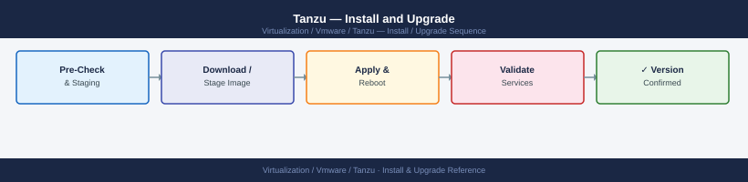

---
tags:
  - operations
  - tanzu
  - vmware
description: "Install and Upgrade reference covering Prerequisites for vSphere with Tanzu (Supervisor), Enable Workload Management on vSphere, Deploy TKG Management..."
---
# Tanzu — Install and Upgrade

<div class="kb-summary">
Install and Upgrade reference covering Prerequisites for vSphere with Tanzu (Supervisor), Enable Workload Management on vSphere, Deploy TKG Management Cluster (Standalone), Deploy a TKG Workload Cluster, Harbor Deployment (OVA) and 3 more sections.

*Applies to: Tanzu 3.x*
</div>


---

## Before you begin

- **Access:** vCenter Administrator; vSphere Namespace Administrator role for Workload Management; `kubectl vsphere` access after deployment
- **Timing:** Workload Management enablement triggers ESXi remediation — plan a maintenance window; hosts reboot in sequence
- **Dependencies:** vSphere 7.x+ with a supported vSAN or vSAN ESA cluster; NSX-T or VDS networking pre-configured; Supervisor control plane VIP range reserved in IPAM; DNS entries for Supervisor VIP created
- **Logging:** capture every wizard step and record all IP addresses assigned during Supervisor configuration

---

!!! warning "Host enters maintenance mode"
    ESXi remediation puts hosts into maintenance mode, triggering DRS evacuation. Confirm DRS is Fully Automated and HA admission control is satisfied before starting.
## Prerequisites for vSphere with Tanzu (Supervisor)

| Requirement | Detail |
|---|---|
| vSphere | 7.0 U3+ or 8.x |
| Storage | vSAN, NFS, or vSphere CSI-compatible storage |
| Networking | NSX-T 3.1+ OR AVI (NSX Advanced Load Balancer) |
| DNS | Forward/reverse DNS for Supervisor API VIP and control plane VMs |
| NTP | All hosts synchronized |
| License | vSphere with Tanzu license or Tanzu Standard/Advanced |

---

## Enable Workload Management on vSphere

```text
vCenter → Workload Management → Get Started
  Step 1: Select Cluster (must be vSAN cluster or have compatible storage)
  Step 2: Control Plane Size: Tiny/Small/Medium/Large
    (for production: Medium — 4 vCPU, 16 GB RAM per control plane VM)
  Step 3: Storage: select default storage policy for Supervisor
  Step 4: Load Balancer: NSX-T (auto-config) or AVI (enter AVI controller FQDN)
  Step 5: Management Network: select portgroup, enter IP range for control plane VMs
  Step 6: Workload Network: select NSX-T network or portgroup range
  Step 7: TKG Service Content Library: register Tanzu content library
  Step 8: DNS, NTP → confirm → Finish

Deployment takes 30-60 minutes. Monitor progress in Workload Management.
```

---

## Deploy TKG Management Cluster (Standalone)

For TKG deployed outside of vSphere with Tanzu:

```bash
# Create cluster config YAML
cat > mgmt-cluster-config.yaml <<EOF
CLUSTER_NAME: mgmt-cluster
CLUSTER_PLAN: prod
INFRASTRUCTURE_PROVIDER: vsphere
VSPHERE_SERVER: vcenter.example.local
VSPHERE_USERNAME: administrator@vsphere.local
VSPHERE_PASSWORD: <password>
VSPHERE_DATACENTER: /DC01
VSPHERE_RESOURCE_POOL: /DC01/host/Cluster01/Resources/TKG
VSPHERE_DATASTORE: /DC01/datastore/vsan-ds
VSPHERE_FOLDER: /DC01/vm/TKG
VSPHERE_NETWORK: TKG-Management
VSPHERE_SSH_AUTHORIZED_KEY: <ssh-public-key>
CONTROL_PLANE_MACHINE_COUNT: 3
WORKER_MACHINE_COUNT: 3
ENABLE_AUDIT_LOGGING: true
EOF

tanzu management-cluster create --file mgmt-cluster-config.yaml -v 6
```


```text title="Expected output"
Validating configuration...
Connecting to vCenter: vcenter.example.local
Datacenter found: /DC01
Resource pool found: /DC01/host/Cluster01/Resources/TKG
Datastore found: /DC01/datastore/vsan-ds
Network found: TKG-Management
SSH key validated
Creating management cluster: mgmt-cluster
Bootstrapping cluster...
Deploying control plane nodes (3/3)...
  Node mgmt-cluster-control-plane-7k9m2: 45% complete
  Node mgmt-cluster-control-plane-5xj8n: 78% complete
  Node mgmt-cluster-control-plane-2lq4p: 100% complete
Deploying worker nodes (3/3)...
  Node mgmt-cluster-worker-9d6k1: 92% complete
  Node mgmt-cluster-worker-4m2x7: 100% complete
  Node mgmt-cluster-worker-8p1n3: 100% complete
Cluster creation completed successfully in 18m42s
Management cluster 'mgmt-cluster' is now active
```

!!! warning "Common errors"
    | Error | Fix |
    |---|---|
    | `Error: invalid credentials for vCenter server vcenter.example.local` | Verify VSPHERE_USERNAME and VSPHERE_PASSWORD are correct and the account has Administrator role on the vCenter instance. |
    | `Error: resource pool /DC01/host/Cluster01/Resources/TKG not found` | Confirm the VSPHERE_RESOURCE_POOL path exists in vCenter and matches the exact folder hierarchy using the vSphere client. |
    | `Error: SSH public key format invalid` | Ensure VSPHERE_SSH_AUTHORIZED_KEY contains a valid public key in OpenSSH format (starting with ssh-rsa, ssh-ed25519, etc.) without line breaks. |
---

## Deploy a TKG Workload Cluster

```bash
cat > workload-cluster.yaml <<EOF
CLUSTER_NAME: prod-workload-01
CLUSTER_PLAN: prod
NAMESPACE: production
VSPHERE_SERVER: vcenter.example.local
VSPHERE_USERNAME: administrator@vsphere.local
VSPHERE_PASSWORD: <password>
VSPHERE_DATACENTER: /DC01
VSPHERE_RESOURCE_POOL: /DC01/host/Cluster01/Resources/TKG
VSPHERE_DATASTORE: /DC01/datastore/vsan-ds
VSPHERE_FOLDER: /DC01/vm/TKG
VSPHERE_NETWORK: TKG-Workloads
VSPHERE_SSH_AUTHORIZED_KEY: <ssh-public-key>
CONTROL_PLANE_MACHINE_COUNT: 3
WORKER_MACHINE_COUNT: 5
KUBERNETES_VERSION: v1.26.5+vmware.2
EOF

tanzu cluster create --file workload-cluster.yaml
```


```text title="Expected output"
Validating configuration...
Creating workload cluster 'prod-workload-01' in namespace 'production'...
Connecting to vSphere endpoint vcenter.example.local...
Creating control plane machines (3 replicas)...
  prod-workload-01-control-plane-7k9m2 [████████░░] 80%
  prod-workload-01-control-plane-5x3n1 [██████████] 100%
  prod-workload-01-control-plane-8q2p4 [██████████] 100%
Creating worker machines (5 replicas)...
  prod-workload-01-worker-node-1 [██████████] 100%
  prod-workload-01-worker-node-2 [██████████] 100%
  prod-workload-01-worker-node-3 [██████████] 100%
  prod-workload-01-worker-node-4 [██████████] 100%
  prod-workload-01-worker-node-5 [██████████] 100%
Waiting for cluster to be ready...
Cluster 'prod-workload-01' created successfully in namespace 'production'
Kubeconfig written to ~/.kube/config
```

!!! warning "Common errors"
    | Error | Fix |
    |---|---|
    | `Error: invalid credentials for vSphere server vcenter.example.local` | Verify VSPHERE_USERNAME, VSPHERE_PASSWORD, and vCenter hostname are correct in the YAML file. |
    | `Error: resource pool /DC01/host/Cluster01/Resources/TKG not found` | Confirm the VSPHERE_RESOURCE_POOL path exists in vSphere and matches the exact folder hierarchy. |
    | `Error: namespace 'production' does not exist` | Create the namespace first with `kubectl create namespace production` on the management cluster. |
---

## Harbor Deployment (OVA)

```text
vCenter → Deploy OVF Template → Harbor-<version>.ova
  Network: Management network
  Storage: shared NFS or vSAN datastore (images stored here)
  
Post-deploy — configure via HTTPS on port 443:
  Admin password → change from Harbor12345 default
  Configure LDAP/OIDC
  Configure S3 or NFS for image storage
  Enable vulnerability scanning (Trivy)
```

---

## Upgrade Order

Strict upgrade sequence:

1. **vCenter** (if upgrading vSphere)
2. **Supervisor** — upgrades automatically after vCenter upgrade (managed by vCenter lifecycle manager)
3. **TKG management cluster:**
   ```bash
   tanzu management-cluster upgrade
   ```
4. **TKG workload clusters** — one at a time:
   ```bash
   tanzu cluster list  # check current versions
   tanzu cluster upgrade <cluster-name>
   # Upgrades control plane first, then workers (rolling)
   ```
5. **Harbor** — OVA-based; redeploy from new OVA preserving external DB and storage

---

## Upgrade a TKG Workload Cluster

```bash
# Check available Kubernetes versions for upgrade
tanzu kubernetes-release get  # or check content library

# Upgrade cluster (rolling — one node at a time)
tanzu cluster upgrade prod-workload-01 --yes

# Monitor upgrade
tanzu cluster get prod-workload-01
kubectl get nodes -w  # watch node status during rolling upgrade

# Verify after upgrade
kubectl get nodes  # all nodes on new version
```


```text title="Expected output"
NAME                                    VERSION
prod-workload-01                        v1.27.5

NAME                                    STATUS   ROLES           AGE     VERSION
prod-workload-01-control-plane-1        Ready    control-plane   187d    v1.28.2
prod-workload-01-worker-1               Ready    <none>          187d    v1.27.5
prod-workload-01-worker-2               Ready    <none>          187d    v1.27.5
prod-workload-01-worker-3               Ready    <none>          187d    v1.27.5

Upgrading cluster prod-workload-01 to v1.28.2...
Control plane upgrade in progress
prod-workload-01-control-plane-1: upgrade completed
Worker node upgrade in progress
prod-workload-01-worker-1: cordoned, draining, upgrading...
prod-workload-01-worker-2: cordoned, draining, upgrading...
prod-workload-01-worker-3: cordoned, draining, upgrading...
Cluster upgrade completed successfully

NAME                                    STATUS   ROLES           AGE     VERSION
prod-workload-01-control-plane-1        Ready    control-plane   187d    v1.28.2
prod-workload-01-worker-1               Ready    <none>          187d    v1.28.2
prod-workload-01-worker-2               Ready    <none>          187d    v1.28.2
prod-workload-01-worker-3               Ready    <none>          187d    v1.28.2
```

!!! warning "Common errors"
    | Error | Fix |
    |---|---|
    | `Error: cluster prod-workload-01 not found` | Verify cluster name with `tanzu cluster list` and ensure you are targeting the correct management cluster context. |
    | `Error: upgrade already in progress for cluster prod-workload-01` | Wait for the current upgrade to complete or check `tanzu cluster get prod-workload-01` for status before retrying. |
    | `Error: insufficient resources to drain node prod-workload-01-worker-1` | Ensure PodDisruptionBudgets are not blocking evictions and that other nodes have capacity for pod migration. |
---

## Version Compatibility

Check VMware Tanzu Kubernetes releases compatibility before upgrade:
- https://docs.vmware.com/en/VMware-Tanzu-Kubernetes-Grid/
- Key compat: TKG version ↔ vSphere version ↔ Harbor version ↔ Kubernetes version

---

## See also

- [Tanzu — Health Checks](../health-checks/)
- [Virtualization Vmware Tanzu — Common Issues](../../troubleshooting/common-issues/)
- [Tanzu — Procedures](../procedures/)

## Verify

- **Alarms:** vSphere Client → Home → Alarms — no new critical alarms after the operation
- **Events:** monitor the vCenter Events view for the affected object for 5 minutes
- **Health check:** run the morning health-check sequence for the affected product tier
