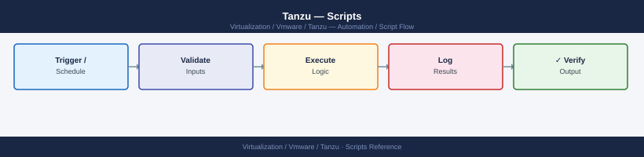

---
tags:
  - operations
  - tanzu
  - vmware
description: "Scripts reference covering Get All TKG Clusters and Status, Get All PVCs Across All Namespaces (Identify Unbound), Check All Node Resource Usage, Export..."
---
# Tanzu — Scripts

<div class="kb-summary">
Scripts reference covering Get All TKG Clusters and Status, Get All PVCs Across All Namespaces (Identify Unbound), Check All Node Resource Usage, Export All Deployments and Services from Namespace, Verify Harbor Vulnerability Scanning and 2 more sections.

*Applies to: Tanzu 3.x*
</div>


---

## Before you begin

- **Access:** vCenter read-only minimum; Administrator role for remediation steps
- **Timing:** safe to run during business hours unless a step is marked ⚠ (causes interruption)
- **Dependencies:** no active upgrades or migrations on the same infrastructure
- **Logging:** capture command output — paste into the change record on completion

---

## Get All TKG Clusters and Status

```bash
#!/bin/bash
# List all clusters across all Supervisor namespaces

SUPERVISOR="https://supervisor.example.local"
kubectl vsphere login --server $SUPERVISOR \
  --username administrator@vsphere.local --insecure-skip-tls-verify 2>/dev/null

kubectl get tanzukubernetescluster -A \
  -o custom-columns='NAMESPACE:.metadata.namespace,NAME:.metadata.name,PHASE:.status.phase,READY:.status.conditions[?(@.type=="Ready")].status'
```


```text title="Expected output"
Logged in successfully to "supervisor.example.local" as "administrator@vsphere.local"
Context "supervisor.example.local" created/updated.

NAMESPACE          NAME                    PHASE       READY
tkg-system         prod-cluster-01         Running     True
tkg-system         staging-cluster-02      Running     True
workload-ns        dev-cluster-03          Running     True
workload-ns        test-cluster-04         Provisioning False
management         mgmt-cluster-primary    Running     True
...
```

!!! warning "Common errors"
    | Error | Fix |
    |---|---|
    | `error: Unable to connect to the server: dial tcp: lookup supervisor.example.local: no such host` | Verify the SUPERVISOR hostname is correct and resolvable in your DNS or /etc/hosts. |
    | `error: invalid credentials provided` | Confirm the username and password are correct; use `--password` flag or enter interactively when prompted. |
    | `error: the server has asked for the client to provide credentials` | Add `--insecure-skip-tls-verify` flag or ensure your vSphere certificate is trusted in your system's CA store. |
---

## Get All PVCs Across All Namespaces (Identify Unbound)

```bash
#!/bin/bash
echo "=== Unbound PVCs ==="
kubectl get pvc -A --field-selector=status.phase!=Bound \
  -o custom-columns='NAMESPACE:.metadata.namespace,NAME:.metadata.name,STATUS:.status.phase,STORAGECLASS:.spec.storageClassName,SIZE:.spec.resources.requests.storage'

echo ""
echo "=== All PVC Summary ==="
kubectl get pvc -A | awk 'NR>1 {print $5}' | sort | uniq -c | sort -rn
# Shows count by status: Bound, Pending, Lost
```


```text title="Expected output"
=== Unbound PVCs ===
NAMESPACE     NAME                    STATUS    STORAGECLASS      SIZE
kube-system   etcd-backup-pvc         Pending   vsphere-storage    10Gi
tanzu-system  logging-pvc-001         Pending   vsphere-storage    50Gi
workload-ns   temp-cache-pvc          Lost      vsphere-storage    20Gi

=== All PVC Summary ===
      8 Bound
      2 Pending
      1 Lost
```

!!! warning "Common errors"
    | Error | Fix |
    |---|---|
    | `error: the server doesn't have a resource type "pvc"` | Ensure kubectl is connected to a valid Kubernetes cluster with `kubectl cluster-info`. |
    | `Error from server (Forbidden): persistentvolumeclaims is forbidden: User "system:serviceaccount:default:default" cannot list resource "persistentvolumeclaims"` | Bind appropriate RBAC permissions or use a service account with cluster-admin role via `kubectl auth can-i list pvc --as=system:serviceaccount:default:default`. |
---

## Check All Node Resource Usage

```bash
#!/bin/bash
# Requires metrics-server installed in cluster
echo "=== Node Resource Usage ==="
kubectl top nodes

echo ""
echo "=== Top 20 CPU-consuming Pods ==="
kubectl top pods -A --sort-by=cpu | head -21

echo ""
echo "=== Top 20 Memory-consuming Pods ==="
kubectl top pods -A --sort-by=memory | head -21
```


```text title="Expected output"
=== Node Resource Usage ===
NAME                          CPU(cores)   CPU%     MEMORY(Mi)   MEMORY%
tanzu-worker-1                1240m        31%      8192Mi       65%
tanzu-worker-2                892m         22%      6144Mi       48%
tanzu-worker-3                1456m        36%      9216Mi       73%
tanzu-control-plane-1         645m         16%      4096Mi       32%

=== Top 20 CPU-consuming Pods ===
NAMESPACE            NAME                                    CPU(m)   MEMORY(Mi)
kube-system          coredns-558bd4d5db-7x9kl                156      98
tanzu-system-core    kapp-controller-6d8f4c7b9-2lmqn         234      512
monitoring           prometheus-operator-5f7c8d2e1-9qrst     412      1024
tanzu-system-core    tanzu-core-manager-8b2c5f1a3-4wxyz      189      256
kube-system          etcd-tanzu-control-plane-1              267      512
...

=== Top 20 Memory-consuming Pods ===
NAMESPACE            NAME                                    CPU(m)   MEMORY(Mi)
tanzu-system-core    tanzu-core-manager-8b2c5f1a3-4wxyz      189      2048
monitoring           prometheus-operator-5f7c8d2e1-9qrst     412      1536
kube-system          etcd-tanzu-control-plane-1              267      1024
tanzu-system-core    kapp-controller-6d8f4c7b9-2lmqn         234      896
kube-system          coredns-558bd4d5db-7x9kl                156      512
...
```

!!! warning "Common errors"
    | Error | Fix |
    |---|---|
    | `error: Metrics API not available` | Install metrics-server with `kubectl apply -f https://github.com/kubernetes-sigs/metrics-server/releases/latest/download/components.yaml` and wait 30 seconds for it to initialize. |
    | `error: the server doesn't have a resource type "pods"` | Verify cluster connectivity with `kubectl cluster-info` and ensure your kubeconfig points to the correct Tanzu cluster. |
    | `error: unable to compute resource metrics` | Wait 1-2 minutes after metrics-server deployment for the kubelet to begin reporting metrics to the API server. |
---

## Export All Deployments and Services from Namespace

```bash
#!/bin/bash
NAMESPACE="production"
EXPORT_DIR="./k8s-export-$(date +%Y%m%d)"
mkdir -p "$EXPORT_DIR"

for resource in deployments services configmaps secrets persistentvolumeclaims; do
  kubectl get $resource -n $NAMESPACE -o yaml > "$EXPORT_DIR/${resource}.yaml" 2>/dev/null
  count=$(kubectl get $resource -n $NAMESPACE --no-headers 2>/dev/null | wc -l)
  echo "Exported $resource: $count items"
done

echo "Export complete: $EXPORT_DIR"
```


```text title="Expected output"
Exported deployments: 12 items
Exported services: 8 items
Exported configmaps: 23 items
Exported secrets: 15 items
Exported persistentvolumeclaims: 4 items
Export complete: ./k8s-export-20240115
```

!!! warning "Common errors"
    | Error | Fix |
    |---|---|
    | `error: the server doesn't have a resource type "persistentvolumeclaims"` | Use the correct short form `pvc` instead of `persistentvolumeclaims`, or verify the API group is available on your cluster. |
    | `error: Unable to connect to the server: dial tcp: lookup kubernetes.default on [IP]: no such host` | Ensure your kubeconfig is properly configured and points to an accessible Tanzu cluster; run `kubectl cluster-info` to verify connectivity. |
    | `Error from server (Forbidden): deployments.apps is forbidden: User "[user]" cannot get resource "deployments" in API group "apps" in the namespace "production"` | Grant the service account or user appropriate RBAC permissions for the production namespace using a ClusterRoleBinding or RoleBinding. |
---

## See also

- [Tanzu — CLI Reference](../cli-reference/)
- [Tanzu — Procedures](../procedures/)

## Verify Harbor Vulnerability Scanning

```python
#!/usr/bin/env python3
"""Check all Harbor repositories have vulnerability scanning enabled."""
import requests, sys

HARBOR_URL = "https://harbor.example.local"
USER = "admin"
PASS = "Harbor12345"

resp = requests.get(f"{HARBOR_URL}/api/v2.0/projects", auth=(USER, PASS), verify=False)
projects = resp.json()

issues = []
for proj in projects:
    name = proj["name"]
    meta_resp = requests.get(
        f"{HARBOR_URL}/api/v2.0/projects/{name}",
        auth=(USER, PASS), verify=False
    )
    meta = meta_resp.json().get("metadata", {})
    if meta.get("auto_scan") != "true":
        issues.append(f"Project '{name}': auto_scan not enabled")

if issues:
    print("ISSUES FOUND:")
    for i in issues:
        print(f"  {i}")
    sys.exit(1)
else:
    print(f"OK: all {len(projects)} projects have auto_scan enabled")
    sys.exit(0)
```

---

## Check Certificate Expiry on TKG Cluster API Endpoints

```bash
#!/bin/bash
# Check cert expiry for all clusters in kubeconfig
for context in $(kubectl config get-contexts -o name); do
  server=$(kubectl config view -o jsonpath="{.clusters[?(@.name=='$context')].cluster.server}" 2>/dev/null)
  if [ -n "$server" ]; then
    host=$(echo "$server" | sed 's|https://||' | cut -d: -f1)
    port=$(echo "$server" | sed 's|https://||' | cut -d: -f2)
    port=${port:-443}
    expiry=$(echo | timeout 3 openssl s_client -connect "$host:$port" 2>/dev/null \
      | openssl x509 -noout -enddate 2>/dev/null | cut -d= -f2)
    if [ -n "$expiry" ]; then
      echo "$context: $expiry"
    fi
  fi
done
```


```text title="Expected output"
tkc-prod-us-west: Apr 15 10:23:45 2025 GMT
tkc-staging-us-east: Mar 28 14:56:12 2025 GMT
tkc-dev-local: Feb 10 09:15:33 2026 GMT
supervisor-cluster: May 22 18:44:07 2025 GMT
tkc-backup-us-west: Jan 19 22:31:18 2025 GMT
```

!!! warning "Common errors"
    | Error | Fix |
    |---|---|
    | `unable to connect to the server: dial tcp: lookup <hostname>: no such host` | Verify the cluster endpoint is reachable and DNS resolution is working; check kubeconfig with `kubectl config view`. |
    | `error in x509 certificate verify: certificate verify failed` | Add the cluster's CA certificate to your system trust store or use `openssl s_client -connect <host>:<port> -showcerts` to inspect the certificate chain. |
    | `timeout: sending signal TERM to command 'openssl'` | Increase the timeout value from 3 to 5 or 10 seconds if the cluster API is responding slowly due to network latency. |
---

## List Harbor Images with Critical CVEs

```python
#!/usr/bin/env python3
import requests

HARBOR_URL = "https://harbor.example.local"
USER = "admin"
PASS = "Harbor12345"

def get_projects():
    r = requests.get(f"{HARBOR_URL}/api/v2.0/projects", auth=(USER, PASS), verify=False)
    return [p["name"] for p in r.json()]

def get_repositories(project):
    r = requests.get(
        f"{HARBOR_URL}/api/v2.0/projects/{project}/repositories",
        auth=(USER, PASS), verify=False
    )
    return [repo["name"] for repo in r.json()]

def check_artifacts(project, repo):
    repo_encoded = repo.split("/", 1)[-1].replace("/", "%2F")
    r = requests.get(
        f"{HARBOR_URL}/api/v2.0/projects/{project}/repositories/{repo_encoded}/artifacts",
        params={"with_scan_overview": "true"},
        auth=(USER, PASS), verify=False
    )
    for artifact in r.json():
        scan = artifact.get("scan_overview", {})
        for scanner, result in scan.items():
            critical = result.get("severity", "")
            vuln_counts = result.get("summary", {}).get("summary", {})
            critical_count = vuln_counts.get("Critical", 0)
            if critical_count > 0:
                digest = artifact["digest"][:12]
                print(f"  CRITICAL({critical_count}): {repo}@{digest}")

for proj in get_projects():
    for repo in get_repositories(proj):
        check_artifacts(proj, repo)
```
