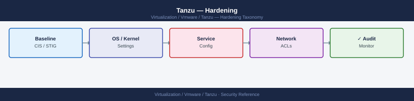

---
tags:
  - security
  - tanzu
  - vmware
description: "Hardening reference covering Pod Security Admission, Default Deny Network Policy, Disallow Privileged Containers (OPA Gatekeeper), Require Resource..."
---
# Tanzu — Hardening

<div class="kb-summary">
Hardening reference covering Pod Security Admission, Default Deny Network Policy, Disallow Privileged Containers (OPA Gatekeeper), Require Resource Limits, Harbor Vulnerability Scanning Policy and 4 more sections.

*Applies to: Tanzu 3.x*
</div>


---

## Before you begin

- **Access:** vCenter Administrator role
- **Change management:** security changes require CAB approval in most environments
- **Rollback plan:** document current state before any security control change
- **Testing:** validate in a non-production environment first where possible

---

## Pod Security Admission

Enforce Pod Security Standards at the namespace level:

```bash
# Restricted: no privileged containers, no hostPath, required securityContext
kubectl label namespace production \
  pod-security.kubernetes.io/enforce=restricted \
  pod-security.kubernetes.io/warn=restricted \
  pod-security.kubernetes.io/audit=restricted

# Baseline: minimal restrictions for less-sensitive workloads
kubectl label namespace logging \
  pod-security.kubernetes.io/enforce=baseline
```


```text title="Expected output"
namespace/production labeled
namespace/logging labeled
```

!!! warning "Common errors"
    **`error: namespaces "production" not found`** — Verify the namespace exists with `kubectl get namespaces` before applying labels.
    **`error: label keys and values must be alphanumeric or -._`** — Ensure label keys use only alphanumeric characters, hyphens, dots, and underscores; the pod-security.kubernetes.io/ prefix is valid but custom labels cannot contain forward slashes outside the domain prefix.
---

## Default Deny Network Policy

Every namespace should have a default-deny policy:

```yaml
apiVersion: networking.k8s.io/v1
kind: NetworkPolicy
metadata:
  name: default-deny-all
  namespace: production
spec:
  podSelector: {}
  policyTypes:
  - Ingress
  - Egress
---
# Then allow only what is needed:
apiVersion: networking.k8s.io/v1
kind: NetworkPolicy
metadata:
  name: allow-dns-egress
  namespace: production
spec:
  podSelector: {}
  egress:
  - ports:
    - protocol: UDP
      port: 53
    - protocol: TCP
      port: 53
```

---

## Disallow Privileged Containers (OPA Gatekeeper)

```yaml
apiVersion: templates.gatekeeper.sh/v1
kind: ConstraintTemplate
metadata:
  name: noprivilegedcontainers
spec:
  crd:
    spec:
      names:
        kind: NoPrivilegedContainers
  targets:
  - target: admission.k8s.gatekeeper.sh
    rego: |
      package noprivilegedcontainers
      violation[{"msg": msg}] {
        c := input.review.object.spec.containers[_]
        c.securityContext.privileged == true
        msg := sprintf("Container '%v' must not run as privileged", [c.name])
      }
---
apiVersion: constraints.gatekeeper.sh/v1beta1
kind: NoPrivilegedContainers
metadata:
  name: deny-privileged-all
spec:
  match:
    kinds:
    - apiGroups: [""]
      kinds: ["Pod"]
```

---

## Require Resource Limits

```yaml
apiVersion: v1
kind: LimitRange
metadata:
  name: default-limits
  namespace: production
spec:
  limits:
  - default:
      cpu: "500m"
      memory: "512Mi"
    defaultRequest:
      cpu: "100m"
      memory: "128Mi"
    type: Container
```

---

## Harbor Vulnerability Scanning Policy

Block images with critical CVEs from being pulled:

```text
Harbor UI → [Project] → Configuration
  Prevent vulnerable images from running: Yes
  Severity threshold: High
  Auto scan on push: Yes
```

Images with Critical or High CVEs will return a 403 when clients try to pull them, even if they are present in the registry.

---

## Restrict Registry to Harbor Only

```yaml
# OPA Gatekeeper: allow only images from harbor.example.local
apiVersion: templates.gatekeeper.sh/v1
kind: ConstraintTemplate
metadata:
  name: allowedregistries
spec:
  crd:
    spec:
      names:
        kind: AllowedRegistries
      validation:
        openAPIV3Schema:
          properties:
            allowedRegistries:
              type: array
              items:
                type: string
  targets:
  - target: admission.k8s.gatekeeper.sh
    rego: |
      package allowedregistries
      violation[{"msg": msg}] {
        container := input.review.object.spec.containers[_]
        not startswith(container.image, "harbor.example.local/")
        msg := sprintf("Image '%v' not from allowed registry", [container.image])
      }
---
apiVersion: constraints.gatekeeper.sh/v1beta1
kind: AllowedRegistries
metadata:
  name: harbor-only
spec:
  parameters:
    allowedRegistries: ["harbor.example.local/"]
  match:
    kinds:
    - apiGroups: [""]
      kinds: ["Pod"]
```

---

## Kubernetes API Server Audit Logging

```yaml
# In TKG cluster config — enable audit logging:
ENABLE_AUDIT_LOGGING: true

# Audit policy (stored on control plane node):
# /etc/kubernetes/audit-policy.yaml
apiVersion: audit.k8s.io/v1
kind: Policy
rules:
- level: Metadata
  resources:
  - group: ""
    resources: ["secrets", "configmaps"]
- level: Request
  verbs: ["delete"]
  resources:
  - group: ""
    resources: ["pods", "services", "persistentvolumeclaims"]
- level: None
  verbs: ["get", "list", "watch"]
```

---

## SSH Access to K8s Nodes

TKG nodes should not have direct SSH access in production:

```bash
# Check if any TKG nodes have SSH exposed externally
kubectl get nodes -o jsonpath='{.items[*].status.addresses[?(@.type=="ExternalIP")].address}'
# Should return empty — nodes should have internal IPs only

# Access via kubectl debug (no SSH needed for most debugging):
kubectl debug node/<node-name> -it --image=busybox
```


```text title="Expected output"
(no output — command completes silently)

Entering debugger. Type 'help' for commands.
/ #
```

!!! warning "Common errors"
    **`error: unable to find node "<node-name>"`** — Verify the exact node name with `kubectl get nodes` and ensure you're querying the correct cluster context.
    **`error: image "busybox" not found`** — Specify a valid debug image available in your registry, such as `--image=gcr.io/gke-release/gke-metrics-agent:latest` or check your cluster's image pull policy.
---

## Rotate kubeconfig Credentials

```bash
# Revoke and regenerate admin kubeconfig for a TKG cluster:
tanzu cluster kubeconfig get my-cluster --admin
# This generates a new kubeconfig — distribute to new admins and revoke old tokens

# For OIDC users — tokens expire automatically; re-login to refresh:
kubectl vsphere login --server https://supervisor.example.local --username user@corp.local
```


```text title="Expected output"
Fetching kubeconfig for admin of cluster 'my-cluster'...
Kubeconfig written to /home/admin/.kube/config
Context "my-cluster-admin" added to kubeconfig.
Cluster "my-cluster" set.
User "my-cluster-admin" set.
Current context is now "my-cluster-admin".

Logging in to vSphere with Kubernetes...
Waiting for the vSphere login extension to be ready...
Logged in successfully.
Current context: supervisor.example.local
```

!!! warning "Common errors"
    **`Error: cluster 'my-cluster' not found`** — Verify the cluster name matches output from `tanzu cluster list` and you are in the correct management cluster context.
    **`Error: unable to connect to supervisor.example.local: no such host`** — Ensure the supervisor hostname is resolvable and correct; check DNS or use the IP address instead.
    **`Error: invalid credentials for user@corp.local`** — Confirm the username and domain are correct and the OIDC provider is reachable from the cluster network.
## See also

- [Tanzu — Access Control](../access-control/)
- [Tanzu — Authentication](../authentication/)
- [Tanzu — Health Checks](../../operations/health-checks/)
