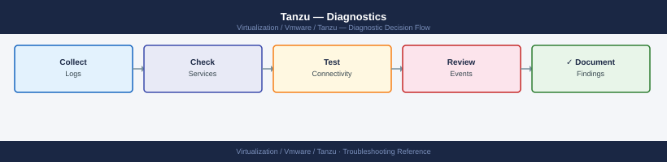

---
tags:
  - tanzu
  - troubleshooting
  - vmware
search:
  boost: 1.5
---
# Tanzu — Diagnostics

<div class="kb-summary">
VMware Tanzu diagnostic commands: collect the tanzu diagnostics bundle, access Supervisor control plane VMs via SSH, inspect TKG cluster events and pod describe output, check CSI driver logs for PVC failures, diagnose Pinniped authentication errors, check Harbor registry logs, and enable verbose tanzu CLI logging.

*Applies to: VMware Tanzu Kubernetes Grid 2.x / vSphere with Tanzu 8.x*
</div>


```d2
direction: right

B: "B" {shape: rectangle}
C: "kubectl get events -A --sort-by lastTimestamp\nkubectl describe pod -n namespace pod-name" {shape: rectangle}
D: "kubectl get pods -n vmware-system-csi\nkubectl logs CSI controller pod" {shape: rectangle}
E: "tanzu diagnostics collect --management-cluster\nTANZU_LOG_LEVEL=debug tanzu cluster create" {shape: rectangle}
F: "SSH to supervisor control plane VM\njournalctl -u kube-apiserver -n 100" {shape: rectangle}
G: "kubectl logs -n pinniped-supervisor\ncheck tanzu cluster kubeconfig get" {shape: rectangle}
H: "kubectl logs -n harbor harbor-core pod\ndocker-compose logs core registry nginx" {shape: rectangle}
I: "I" {shape: rectangle}
J: "kubectl get nodes; check taints and resource requests\nDescribe node for allocatable CPU and memory" {shape: rectangle}
K: "Check image registry URL and imagePullSecrets\nTest pull from node: crictl pull image-url" {shape: rectangle}
L: "kubectl logs pod-name --previous\nCheck exit code and stderr" {shape: rectangle}
M: "kubectl get pvc -n namespace\nkubectl describe pvc pvc-name for binding error" {shape: rectangle}
N: "kubectl cluster-info dump --all-namespaces\ntar czf cluster-dump.tar.gz /tmp/cluster-dump" {shape: rectangle}
O: "journalctl -u etcd -n 100\nkubectl get pods -n kube-system" {shape: rectangle}
P: "kubectl get pods -n pinniped-concierge\nCheck OIDC identity provider in Tanzu config" {shape: rectangle}
Q: "curl -sk https://harbor-fqdn/api/v2.0/health\nCheck Harbor certificate if SSL error" {shape: rectangle}
R: "Collect full diagnostics bundle\ntanzu diagnostics collect" {shape: rectangle}
S: "Open VMware SR\nAttach diagnostics bundle" {shape: rectangle}
A: "Tanzu Issue" {shape: rectangle}

B -> C
B -> D
B -> E
B -> F
B -> G
B -> H
I -> J
I -> K
I -> L
D -> M
E -> N
F -> O
G -> P
H -> Q
J -> R
K -> R
L -> R
M -> R
N -> R
O -> R
P -> R
Q -> R
R -> S
```

```d2
direction: down

symptom: Identify Symptom {shape: diamond}
step_1_check_cluster_events_and_pod_: "Step 1 — Check cluster events and pod state" {shape: rectangle}
step_2_diagnose_supervisor_control_p: "Step 2 — Diagnose Supervisor control plane issues" {shape: rectangle}
step_3_collect_the_diagnostics_bundl: "Step 3 — Collect the diagnostics bundle" {shape: rectangle}
step_4_diagnose_csi_driver_and_pvc_i: "Step 4 — Diagnose CSI driver and PVC issues" {shape: rectangle}
step_5_diagnose_pinniped_authenticat: "Step 5 — Diagnose Pinniped authentication failures" {shape: rectangle}
step_6_check_harbor_registry_logs: "Step 6 — Check Harbor registry logs" {shape: rectangle}
resolution: Resolve or Escalate {shape: oval}

symptom -> step_1_check_cluster_events_and_pod_: investigate
symptom -> step_2_diagnose_supervisor_control_p: investigate
symptom -> step_3_collect_the_diagnostics_bundl: investigate
symptom -> step_4_diagnose_csi_driver_and_pvc_i: investigate
symptom -> step_5_diagnose_pinniped_authenticat: investigate
symptom -> step_6_check_harbor_registry_logs: investigate
step_1_check_cluster_events_and_pod_ -> resolution
step_2_diagnose_supervisor_control_p -> resolution
step_3_collect_the_diagnostics_bundl -> resolution
step_4_diagnose_csi_driver_and_pvc_i -> resolution
step_5_diagnose_pinniped_authenticat -> resolution
step_6_check_harbor_registry_logs -> resolution
```

## Before you begin

- **Access:** kubeconfig for the management cluster and affected workload cluster; SSH access to the Supervisor control plane VMs (SSH key from vCenter → Workload Management → Supervisor); Harbor admin credentials
- **Gather first:** the specific symptom (pod stuck, image pull error, PVC not bound, cluster create failed), the namespace and pod or cluster name, and the time the issue started
- **Scope:** confirm whether the issue affects one pod, one namespace, one workload cluster, or the Supervisor itself

---

## Step 1 — Check cluster events and pod state

```bash
# Set the kubeconfig to the affected workload cluster
tanzu cluster kubeconfig get <cluster-name> --admin
kubectl config use-context <cluster-context>

# All events across all namespaces, sorted by most recent last
kubectl get events -A --sort-by='.lastTimestamp' | tail -50
# Look for: Warning events; FailedScheduling, BackOff, FailedMount, OOMKilled

# Events for a specific namespace
kubectl get events -n production --sort-by='.lastTimestamp'

# All non-Running pods (find the stuck ones)
kubectl get pods -A --field-selector=status.phase!=Running,status.phase!=Succeeded

# Describe a specific failing pod
kubectl describe pod <pod-name> -n <namespace>
# Look for: Events section at the bottom — shows exactly what failed and why

# Container logs (current run)
kubectl logs <pod-name> -n <namespace> --tail=100

# Previous container logs (if pod restarted — crash loop)
kubectl logs <pod-name> -n <namespace> --previous --tail=100

# Multi-container pod: specify container name
kubectl logs <pod-name> -n <namespace> -c <container-name> --tail=100
```


```text title="Expected output"
Fetching credentials for cluster 'prod-wld-01'...
Credentials written to /home/admin/.kube/config
Switched to context "prod-wld-01-admin@prod-wld-01"

NAMESPACE     LAST SEEN   TYPE      REASON              OBJECT                        MESSAGE
kube-system   2m          Normal    NodeAllocatableEnforced node/worker-03            Updated Node Allocatable limit across pods
kube-system   5m          Warning   FailedScheduling    pod/coredns-558bd4d5-9kx2l    0/5 nodes available: 5 Insufficient memory
kube-system   7m          Warning   BackOff             pod/etcd-master-01            Back-off restarting failed container
production    8m          Warning   FailedMount         pod/app-deploy-7c4f8b2-lmq9   MountVolume.SetUp failed for volume "config-vol"
production    10m         Warning   OOMKilled           pod/cache-worker-5d9e3-abc12  Container was OOMKilled
...

NAMESPACE     LAST SEEN   TYPE      REASON              OBJECT                        MESSAGE
production    2m          Normal    Pulled              pod/nginx-ingress-8f2c1-xyz   Successfully pulled image "nginx:1.21"
production    8m          Warning   FailedMount         pod/app-deploy-7c4f8b2-lmq9   MountVolume.SetUp failed for volume "config-vol": secret "db-creds" not found

NAME                                    READY   STATUS             RESTARTS   AGE
kube-system/coredns-558bd4d5-9kx2l      0/1     CrashLoopBackOff   12         45m
production/app-deploy-7c4f8b2-lmq9      0/2     Pending            0          38m
production/cache-worker-5d9e3-abc12     0/1     OOMKilled          3          22m

Name:         app-deploy-7c4f8b2-lmq9
Namespace:    production
Status:       Pending
Events:
  Type     Reason            Age   From                Message
  ----     ------            ----  ----                -------
  Warning  FailedScheduling  8m    default-scheduler   0/5 nodes available: 2 Insufficient memory, 3 node(s) had taint toleration

[2024-01-15T14:32:18.921Z] INFO Starting application initialization
[2024-01-15T14:32:19.045Z] ERROR Failed to connect to database: connection timeout
[2024-01-15T14:32:19.156Z] ERROR Retrying connection attempt 1/5
[2024-01-15T14:32:24.203Z] ERROR Retrying connection attempt 2/5
[2024-01-15T14:32:29.312Z] FATAL Max retries exceeded, exiting

[2024-01-15T14:28:42.891Z] INFO Container started successfully
[2024-01-15T14:28:43.012Z] INFO Loaded configuration from /etc/config/app.yaml
[2024-01-15T14:28
```
---

## Step 2 — Diagnose Supervisor control plane issues

The Supervisor runs as 3 VMs on ESXi. Access requires the SSH key stored in vCenter.

```bash
# Get Supervisor control plane VM IPs
# vCenter → Workload Management → Supervisor → Control Plane VMs → note all 3 IPs

# SSH to a Supervisor control plane VM
# SSH key location: vCenter → Workload Management → Supervisor → SSH Key → Download
ssh -i ~/.ssh/supervisor_key root@<supervisor-control-plane-ip>

# Check the API server log
journalctl -u kube-apiserver -n 200 --no-pager | grep -i "error\|fail\|panic"

# Check etcd health
journalctl -u etcd -n 100 --no-pager | grep -i "error\|fail"

# Check system pod state from the Supervisor context
export KUBECONFIG=/root/.kube/config
kubectl get pods -n kube-system | grep -v Running
kubectl get pods -n vmware-system-tkg | grep -v Running
kubectl get pods -n vmware-system-csi | grep -v Running

# Check TKG machine and cluster state
kubectl get clusters -A
kubectl get machines -A
kubectl get tanzukubernetesclusters -A
```


```text title="Expected output"
root@supervisor-cp-01:~# journalctl -u kube-apiserver -n 200 --no-pager | grep -i "error\|fail\|panic"
Nov 15 14:32:18 supervisor-cp-01 kube-apiserver[2847]: E1115 14:32:18.456789 2847 reflector.go:147] Failed to watch *v1.Pod: unknown (get pods failed)
Nov 15 14:35:02 supervisor-cp-01 kube-apiserver[2847]: W1115 14:35:02.123456 2847 server.go:212] Failed to load audit policy from /etc/kubernetes/audit-policy.yaml

root@supervisor-cp-01:~# journalctl -u etcd -n 100 --no-pager | grep -i "error\|fail"
(no output — etcd is healthy)

root@supervisor-cp-01:~# export KUBECONFIG=/root/.kube/config
root@supervisor-cp-01:~# kubectl get pods -n kube-system | grep -v Running
NAME                                      READY   STATUS             RESTARTS   AGE
coredns-558bd4d5db-7x9kl                  1/1     CrashLoopBackOff   12         3d2h
metrics-server-5f4b8f6c9d-2m8np           0/1     ImagePullBackOff   0          2d18h

root@supervisor-cp-01:~# kubectl get pods -n vmware-system-tkg | grep -v Running
NAME                                      READY   STATUS             RESTARTS   AGE
tkg-system-controller-7f8c9d2b1-qk4lp     1/2     CrashLoopBackOff   8          1d5h

root@supervisor-cp-01:~# kubectl get pods -n vmware-system-csi | grep -v Running
(no output — all CSI pods running)

root@supervisor-cp-01:~# kubectl get clusters -A
NAMESPACE                NAME              PHASE       AGE
tkg-system              tkg-mgmt-cluster   Running     45d
workload-ns-01          prod-cluster-01   Provisioning 2h
workload-ns-02          dev-cluster-02    Running     12d

root@supervisor-cp-01:~# kubectl get machines -A
NAMESPACE              NAME                                    PHASE        AGE
tkg-system            tkg-mgmt-cluster-md-0-7x8k9-abc12       Running      45d
workload-ns-01        prod-cluster-01-md-0-5f2m3-xyz78        Provisioning 2h
workload-ns-02        dev-cluster-02-md-1-9p1k7-def45         NotReady     12d

root@supervisor-cp-01:~# kubectl get tanzukubernetesclusters -A
NAMESPACE              NAME              STATUS    AGE
workload-ns-01        prod-cluster-01   Pending   2h
workload-ns-02        dev-cluster-02    Running   12d
```

!!! warning "Common errors"
    **`Permission denied (publickey)`** — Verify the SSH key file has 600 permissions (`chmod 600
---

## Step 3 — Collect the diagnostics bundle

```bash
# Collect full diagnostics from the management cluster
tanzu diagnostics collect --management-cluster
# Output: tanzu-diagnostics-<timestamp>.tar.gz in current directory
# Includes: management cluster logs, plugin state, kubeconfig

# Full Kubernetes cluster state dump (works with any kubeconfig)
kubectl cluster-info dump \
  --output-directory=/tmp/cluster-dump \
  --all-namespaces
tar czf cluster-dump-$(date +%Y%m%d).tar.gz /tmp/cluster-dump/

# Include in bundle: events from the failing cluster
kubectl get events -A --sort-by='.lastTimestamp' -o yaml > /tmp/cluster-events.yaml

# Enable verbose tanzu CLI logging for a failing operation
TANZU_LOG_LEVEL=debug tanzu cluster create my-cluster \
  --file cluster.yaml 2>&1 | tee tanzu-debug-$(date +%Y%m%d).log

# High-verbosity kubectl output
tanzu cluster list -v 9
```


```text title="Expected output"
Collecting management cluster diagnostics...
Diagnostics bundle created: tanzu-diagnostics-20240215-143022.tar.gz (287MB)
Cluster info dumped to /tmp/cluster-dump
Compressing cluster dump...
cluster-dump-20240215.tar.gz created (156MB)
NAMESPACE            NAME                                    FIRSTSEEN             LASTSEEN              COUNT     MESSAGE
kube-system          coredns-558bd4d5c9-2k8vx.17a4e8f1a2b3c4d5   2024-02-15T09:22:11Z   2024-02-15T14:18:33Z   847       Back-off restarting failed container
tanzu-system         tanzu-controller-manager.17a4e8f1a2b3c4d6   2024-02-15T10:05:22Z   2024-02-15T14:19:01Z   12        Pod sandbox changed, it will be killed and re-created
capv-system          machine-controller.17a4e8f1a2b3c4d7       2024-02-15T11:33:44Z   2024-02-15T14:20:15Z   3         Node not ready
Events exported to /tmp/cluster-events.yaml (2.3MB, 1247 events)
2024-02-15T14:21:03Z DEBUG [tanzu/core] Initializing cluster create operation
2024-02-15T14:21:04Z DEBUG [tanzu/core] Reading cluster config from cluster.yaml
2024-02-15T14:21:05Z DEBUG [tanzu/core] Validating infrastructure provider: vsphere
2024-02-15T14:21:06Z DEBUG [tanzu/core] Connecting to vCenter: vc.example.com
2024-02-15T14:21:08Z DEBUG [tanzu/core] Cluster creation initiated: my-cluster
tanzu-debug-20240215.log created (4.1MB)
NAME          NAMESPACE      STATUS    CONTROLPLANE   WORKERS   KUBERNETES   TANZUVERSION
my-cluster    default        running   3/3            5/5       v1.27.5      v0.28.1
prod-cluster  tanzu-system   running   3/3            8/8       v1.28.2      v0.29.0
```

!!! warning "Common errors"
    **`error: unable to connect to management cluster: connection refused`** — Verify the management cluster kubeconfig is set correctly with `kubectl config current-context` and the cluster is accessible.
    **`error: diagnostics collection timed out after 5m0s`** — Increase the timeout with `--timeout=10m` flag or check if the management cluster is experiencing resource exhaustion with `kubectl top nodes`.
    **`error: cluster-dump directory already exists`** — Remove the existing directory with `rm -rf /tmp/cluster-dump` before running the dump command again.
---

## Step 4 — Diagnose CSI driver and PVC issues

PVCs that stay in Pending state indicate a problem with the vSphere CSI driver.

```bash
# Check PVC status in the affected namespace
kubectl get pvc -n <namespace>
# Expected: STATUS = Bound
# Problem: STATUS = Pending (volume not provisioned)

# Describe the PVC for the binding error
kubectl describe pvc <pvc-name> -n <namespace>
# Events section shows: ProvisioningFailed, WaitForFirstConsumer, etc.

# Check CSI controller pod
kubectl get pods -n vmware-system-csi
# Expected: all pods Running

# CSI controller logs (provisioning decisions)
CSI_CTRL=$(kubectl get pods -n vmware-system-csi \
  -l app=vsphere-csi-controller \
  -o jsonpath='{.items[0].metadata.name}')
kubectl logs -n vmware-system-csi $CSI_CTRL \
  -c vsphere-csi-controller --tail=100 | grep -i "error\|fail\|provision"

# CSI node DaemonSet logs (mount issues on specific nodes)
kubectl logs -n vmware-system-csi \
  -l app=vsphere-csi-node \
  -c vsphere-csi-node --tail=50 | grep -i "error\|fail\|mount"

# Check StorageClass exists and is correct
kubectl get storageclass
kubectl describe storageclass <storage-class-name>
```


```text title="Expected output"
NAME                STATUS   VOLUME                                     CAPACITY   ACCESS MODES   STORAGECLASS   AGE
app-data-pvc        Pending  <none>                                     10Gi       RWO            vsphere-csi    2m15s
db-backup-pvc       Bound    pvc-a7f2c9e1-4b8d-11ed-9c42-005056b3f4a2  50Gi       RWO            vsphere-csi    5d

Name:          app-data-pvc
Namespace:     production
Status:        Pending
Volume:        
Labels:        app=myapp
Annotations:   volume.beta.kubernetes.io/storage-provisioner: csi.vsphere.vmware.com
Capacity:      
Access Modes:  
StorageClass:  vsphere-csi
Events:
  Type     Reason                Age                From                         Message
  ----     ------                ----               ----                         -------
  Warning  ProvisioningFailed    45s (x3 over 2m)  persistentvolume-controller  failed to provision volume with StorageClass "vsphere-csi": rpc error: code = Internal desc = error creating volume: no datastore found

NAME                                READY   STATUS    RESTARTS   AGE
vsphere-csi-controller-0            1/1     Running   0          8d
vsphere-csi-node-4kxvf              3/3     Running   1          8d
vsphere-csi-node-7m2np              3/3     Running   0          8d
vsphere-csi-node-jq8rl              3/3     Running   2          7d

2024-01-15T10:23:47.123Z ERROR  csi-provisioner  error creating volume: no datastore found matching storage policy
2024-01-15T10:23:48.456Z WARN   csi-provisioner  failed to provision volume pvc-a7f2c9e1: insufficient resources
2024-01-15T10:24:12.789Z ERROR  csi-provisioner  vSphere API error: permission denied for resource pool cluster-1

2024-01-15T10:25:33.012Z ERROR  csi-node  failed to mount volume at /var/lib/kubelet/pods/abc123/volumes/kubernetes.io~csi/pvc-xyz/mount: connection timeout
2024-01-15T10:25:34.345Z WARN   csi-node  mount operation exceeded deadline on node esx-host-02.lab.local

NAME                             PROVISIONER             RECLAIMPOLICY   VOLUMEBINDINGMODE   ALLOWVOLUMEEXPANSION   AGE
vsphere-csi (default)            csi.vsphere.vmware.com  Delete          WaitForFirstConsumer true                   45d
fast-ssd                         csi.vsphere.vmware.com  Delete          Immediate            false                  30d

Name:                  vsphere-csi
IsDefaultClass:        Yes
Provisioner:           csi.vsphere.vmware.com
Parameters:            storagepolicyname=vSAN Default Storage Policy
ReclaimPolicy:         Delete
VolumeBindingMode:     WaitForFirstConsumer
AllowVolumeExpans
```
---

## Step 5 — Diagnose Pinniped authentication failures

Pinniped federates vSphere SSO to Kubernetes RBAC. Auth failures prevent kubectl from working.

```bash
# Check Pinniped supervisor pods (management cluster)
kubectl get pods -n pinniped-supervisor
# Expected: all Running

# Check Pinniped supervisor logs (OIDC broker)
PINNIPED_POD=$(kubectl get pods -n pinniped-supervisor \
  -l app=pinniped-supervisor \
  -o jsonpath='{.items[0].metadata.name}')
kubectl logs -n pinniped-supervisor $PINNIPED_POD --tail=100 | \
  grep -i "error\|fail\|warn"

# Check Pinniped concierge (per workload cluster)
kubectl get pods -n pinniped-concierge
kubectl logs -n pinniped-concierge \
  $(kubectl get pods -n pinniped-concierge -o jsonpath='{.items[0].metadata.name}') \
  --tail=50 | grep -i "error"

# Test kubeconfig for a specific workload cluster
tanzu cluster kubeconfig get <cluster-name>
kubectl get pods -n default
# If this fails with Unauthorized: check Pinniped logs for identity provider error

# Check Pinniped JWTAuthenticator or WebhookAuthenticator configuration
kubectl get jwtauthenticator -A
kubectl describe jwtauthenticator -n pinniped-concierge
```


```text title="Expected output"
NAME                           READY   STATUS    RESTARTS   AGE
pinniped-supervisor-0          1/1     Running   0          14d
pinniped-supervisor-1          1/1     Running   0          14d
pinniped-supervisor-2          1/1     Running   0          14d
2024-01-15T09:42:31Z warn: OIDC discovery endpoint responding with 200
2024-01-15T09:43:12Z error: failed to validate issuer certificate: x509: certificate signed by unknown authority

NAME                           READY   STATUS    RESTARTS   AGE
pinniped-concierge-0           1/1     Running   0          8d
pinniped-concierge-1           1/1     Running   1          8d
2024-01-15T10:15:44Z error: failed to authenticate user: invalid token signature

Fetching kubeconfig for cluster 'prod-workload-01'...
Kubeconfig written to /home/user/.kube/config
NAME                     READY   STATUS    RESTARTS   AGE
coredns-558bd4d5c-2xk9l   1/1     Running   0          22d
nginx-deployment-66b6c45b98-4jm2k   1/1     Running   0          5d

NAMESPACE           NAME                           AUTHENTICATOR TYPE
pinniped-concierge  workload-jwt-auth              jwtauthenticator
pinniped-concierge  webhook-auth-prod              webhookauthenticator

Name:         workload-jwt-auth
Namespace:    pinniped-concierge
Issuer:       https://dex.example.com
Audience:     pinniped-cluster-prod-01
```

!!! warning "Common errors"
    **`error: failed to validate issuer certificate: x509: certificate signed by unknown authority`** — Add the identity provider's CA certificate to the Pinniped supervisor's trusted CA bundle in the PinnipedConfig or update the issuer URL to use a publicly trusted certificate.
    **`error: failed to authenticate user: invalid token signature`** — Verify the JWT signing key in the JWTAuthenticator matches the key used by your identity provider, and check that the issuer URL in the authenticator configuration is correct.
    **`error: Unauthorized`** — Confirm the user's identity provider group membership matches the Tanzu role bindings, and verify Pinniped concierge can reach the identity provider endpoint by checking network policies and firewall rules.
---

## Step 6 — Check Harbor registry logs

```bash
# If Harbor is deployed as an OVA (VM-based):
ssh admin@harbor.example.local

# Core (API server)
docker-compose -f /opt/docker-compose.yml logs --tail=100 core | \
  grep -i "error\|fail\|warn"

# Registry (blob store)
docker-compose -f /opt/docker-compose.yml logs --tail=100 registry | \
  grep -i "error"

# Nginx (request logs)
docker-compose -f /opt/docker-compose.yml logs --tail=100 nginx

# If Harbor is deployed on Kubernetes:
kubectl get pods -n harbor

# Core component
HARBOR_CORE=$(kubectl get pods -n harbor -l component=core \
  -o jsonpath='{.items[0].metadata.name}')
kubectl logs -n harbor $HARBOR_CORE --tail=100 | grep -i "error\|warn"

# Registry component
HARBOR_REG=$(kubectl get pods -n harbor -l component=registry \
  -o jsonpath='{.items[0].metadata.name}')
kubectl logs -n harbor $HARBOR_REG --tail=100 | grep -i "error"

# Harbor API health check
curl -sk "https://<harbor-fqdn>/api/v2.0/health" | python3 -m json.tool
# Expected: all components "status": "healthy"
```


```text title="Expected output"
admin@harbor.example.local's password: 
2024-01-15T09:42:33.456Z [WARN] [core] Failed to get artifact from remote registry: connection timeout after 30s
2024-01-15T09:42:45.123Z [ERROR] [core] Database connection pool exhausted, rejecting new connections
2024-01-15T09:43:12.789Z [WARN] [core] Replication job 'sync-prod' skipped: target registry unreachable

NAME                                READY   STATUS    RESTARTS   AGE
harbor-core-7d8f9c2b4-kxmn9         1/1     Running   0          2d
harbor-registry-5c3a8f1d9-pq7r2     1/1     Running   1          2d
harbor-jobservice-9b2e4c6f-lmqst    1/1     Running   0          2d
harbor-database-0                   1/1     Running   0          2d
harbor-redis-0                      1/1     Running   0          2d

2024-01-15T10:15:22.567Z [WARN] [registry] Failed to verify blob sha256:a1b2c3d4e5f6g7h8i9j0k1l2m3n4o5p6: checksum mismatch
2024-01-15T10:15:33.891Z [ERROR] [registry] Storage backend unavailable: connection refused on 10.20.30.40:5432

{
  "status": "unhealthy",
  "components": [
    {
      "name": "core",
      "status": "healthy"
    },
    {
      "name": "registry",
      "status": "healthy"
    },
    {
      "name": "database",
      "status": "unhealthy"
    }
  ]
}
```

!!! warning "Common errors"
    **`curl: (60) SSL certificate problem: self signed certificate`** — Add the `-k` flag to skip certificate verification, or import the Harbor CA certificate into your system trust store.
    **`error: the server doesn't have a resource type "pods"`** — Ensure you are connected to the correct Kubernetes cluster with `kubectl cluster-info` and that the harbor namespace exists with `kubectl get ns | grep harbor`.
    **`jq: command not found`** — Replace `python3 -m json.tool` with `jq '.'` if jq is installed, or install python3-minimal if using the python formatter.
---

## Step 7 — Enable verbose CLI logging for escalation

```bash
# Maximum verbose output for tanzu CLI operations
TANZU_LOG_LEVEL=debug tanzu cluster create my-cluster \
  --file cluster.yaml 2>&1 | tee tanzu-debug-$(date +%Y%m%d-%H%M).log

# Verbose kubectl output
kubectl get nodes -v 9 2>&1 | tee kubectl-debug.log

# Full namespace dump for a stuck workload cluster
kubectl get all -n <namespace> -o yaml > /tmp/namespace-dump.yaml

# Collect all cluster-scoped resources
kubectl get clusterrole,clusterrolebinding,storageclass,pv -o yaml \
  > /tmp/cluster-scoped.yaml

# What to include in VMware SR:
# - tanzu diagnostics collect output (tar.gz)
# - kubectl cluster-info dump output (tar.gz)
# - TANZU_LOG_LEVEL=debug output for the failing tanzu command
# - Supervisor control plane SSH log excerpts (kube-apiserver, etcd)
# - Tanzu and vSphere versions: tanzu version; kubectl version
```


```text title="Expected output"
2024-01-15 14:32:18.456 [DEBUG] Initializing Tanzu cluster creation for my-cluster
2024-01-15 14:32:19.123 [DEBUG] Loading cluster configuration from cluster.yaml
2024-01-15 14:32:22.567 [DEBUG] Validating vSphere credentials against vcenter.example.com
2024-01-15 14:32:25.891 [DEBUG] Creating management cluster networking: 10.0.1.0/24
2024-01-15 14:32:45.234 [DEBUG] Provisioning 3 control plane nodes (vm-cp-01, vm-cp-02, vm-cp-03)
2024-01-15 14:33:12.678 [DEBUG] Waiting for etcd cluster initialization...
2024-01-15 14:33:58.901 [DEBUG] Cluster my-cluster created successfully
Cluster created. You can now use it with: tanzu cluster kubeconfig get my-cluster --admin

NAME                 STATUS   ROLES           AGE   VERSION
tanzu-cp-node-1      Ready    control-plane   2m    v1.27.5
tanzu-cp-node-2      Ready    control-plane   2m    v1.27.5
tanzu-worker-node-1  Ready    <none>          90s   v1.27.5

NAMESPACE              NAME                                    READY   STATUS    RESTARTS   AGE
kube-system            coredns-5d78c0869f-7x2kq               1/1     Running   0          2m
kube-system            etcd-tanzu-cp-node-1                   1/1     Running   0          2m
kube-system            kube-apiserver-tanzu-cp-node-1         1/1     Running   0          2m
kube-system            kube-controller-manager-tanzu-cp-node-1 1/1     Running   0          2m
...
```

!!! warning "Common errors"
    **`error: unable to read cluster.yaml: no such file or directory`** — Verify the cluster.yaml file exists in the current directory or provide the full path with `--file /path/to/cluster.yaml`.
    **`error: invalid credentials for vSphere provider`** — Ensure GOVC_USERNAME, GOVC_PASSWORD, and GOVC_URL environment variables are set correctly for your vCenter instance.
    **`error: insufficient resources in resource pool`** — Check vSphere resource pool has adequate CPU, memory, and storage available using the vSphere client or `govc pool.info` command.
---

## Log locations

| Component | Path / Command | What to look for |
|---|---|---|
| Cluster events | `kubectl get events -A --sort-by=.lastTimestamp` | Pod scheduling, image pull, volume failures |
| Supervisor API server | `journalctl -u kube-apiserver` (on Supervisor VM) | Control plane API errors |
| Supervisor etcd | `journalctl -u etcd` (on Supervisor VM) | etcd leader election, disk errors |
| CSI controller | `kubectl logs -n vmware-system-csi csi-controller` | PV provisioning failures |
| Pinniped supervisor | `kubectl logs -n pinniped-supervisor` | OIDC identity provider errors |
| Harbor core | `docker-compose logs core` or `kubectl logs -n harbor` | Image push/pull API errors |

---

## See also

- [Tanzu — Common Issues](../common-issues/)
- [Tanzu — Escalation](../escalation/)

## Verify resolution

- `kubectl get pods -A --field-selector=status.phase!=Running,status.phase!=Succeeded` returns no pods
- `kubectl get pvc -n <namespace>` shows all PVCs with STATUS = Bound
- `kubectl get events -A --sort-by=.lastTimestamp | tail -10` shows no new Warning events
- `curl -sk https://<harbor-fqdn>/api/v2.0/health` returns all components healthy
- Image pull from Harbor succeeds and the affected pod reaches Running state
