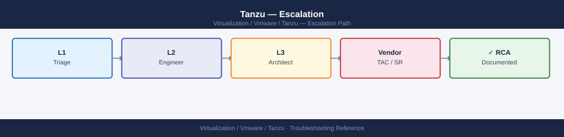

---
tags:
  - tanzu
  - troubleshooting
  - vmware
search:
  boost: 1.5
description: "How to escalate VMware Tanzu / TKG issues to Broadcom support: what data to collect, how to run the Tanzu diagnostics bundle, step-by-step case creation..."
---
# Tanzu — Escalation

<div class="kb-summary">
How to escalate VMware Tanzu / TKG issues to Broadcom support: what data to collect, how to run the Tanzu diagnostics bundle, step-by-step case creation on support.broadcom.com, and the escalation path when progress stalls.

*Applies to: Tanzu Kubernetes Grid (TKG) 2.x / 3.x · vSphere with Tanzu 8.x*
</div>



---

```d2
direction: down

symptom: Identify Symptom {shape: diamond}
preescalation_selfcheck: "Pre-Escalation Self-Check" {shape: rectangle}
stepbystep_data_collection: "Step-by-Step Data Collection" {shape: rectangle}
how_to_open_the_sr_on_supportbroadco: "How to Open the SR on support.broadcom.com" {shape: rectangle}
escalation_path: "Escalation Path" {shape: rectangle}
what_not_to_do: "What NOT to Do" {shape: rectangle}
useful_commands_for_case_updates: "Useful Commands for Case Updates" {shape: rectangle}
resolution: Resolve or Escalate {shape: oval}

symptom -> preescalation_selfcheck: investigate
symptom -> stepbystep_data_collection: investigate
symptom -> how_to_open_the_sr_on_supportbroadco: investigate
symptom -> escalation_path: investigate
symptom -> what_not_to_do: investigate
symptom -> useful_commands_for_case_updates: investigate
preescalation_selfcheck -> resolution
stepbystep_data_collection -> resolution
how_to_open_the_sr_on_supportbroadco -> resolution
escalation_path -> resolution
what_not_to_do -> resolution
useful_commands_for_case_updates -> resolution
```

## Before you begin

- **Access required:** Tanzu CLI configured with kubeconfig for the management cluster; kubectl access to affected clusters; Broadcom support account at support.broadcom.com with active TKG/Tanzu entitlement
- **Do NOT delete a failed workload cluster** without GSS guidance — the cluster VMs may still be running with workloads on them; deletion destroys them without a clean drain
- **Do NOT run `tanzu mc reset`** without explicit GSS direction — this factory-resets the management cluster, deleting all workload cluster registration
- **Collect data from BOTH the management cluster and the affected workload cluster** — GSS will need both for any workload cluster issue

---

## Pre-Escalation Self-Check

Run these before opening the case.

| Check | Command | Expected result |
|---|---|---|
| Tanzu CLI version | `tanzu version` | Note full version string |
| Management cluster health | `tanzu cluster list --include-management-cluster` | MC shows `Running` |
| Workload cluster health | `tanzu cluster list` | All WC show `Running` |
| Cluster node status | `kubectl get nodes -A --kubeconfig <cluster-kubeconfig>` | All nodes `Ready` |
| Pod status | `kubectl get pods -A --kubeconfig <cluster-kubeconfig>` | No pods stuck `Pending` or `CrashLoopBackOff` |
| Supervisor health (vSphere with Tanzu) | vSphere Client → Workload Management → Supervisors | Supervisor shows `Running` |
| NSX networking | `kubectl get ns -A` | Namespaces accessible |
| Harbor registry health (if used) | Harbor UI → System Health | All components green |
| vCenter version | vCenter → Help → About | Note full vCenter version |

---

## Step-by-Step Data Collection

### 1. Get the Tanzu CLI version and Kubernetes versions

```bash
# Tanzu CLI version — include in every case description
tanzu version

# Kubernetes versions across clusters
tanzu cluster list --include-management-cluster
kubectl version --kubeconfig <management-cluster-kubeconfig>

# For vSphere with Tanzu: check Supervisor version
kubectl get ns -A 2>&1 | head -20
```


```text title="Expected output"
version: v0.28.1
buildDate: 2024-01-15T09:42:31Z
sha: a3f8c9e2b1d4e5f6g7h8i9j0k1l2m3n4

NAME                    NAMESPACE                      STATUS   KUBERNETES VERSION
mgmt-cluster-prod       tkg-system                     running  v1.27.8+vmware.2
workload-us-west-2      tkg-system                     running  v1.26.5+vmware.1
workload-us-east-1      tkg-system                     running  v1.27.8+vmware.2

Client Version: v1.27.8+vmware.2
Kube-apiserver Version: v1.27.8+vmware.2
Kubelet Version: v1.27.8+vmware.2

NAMESPACE                           STATUS   AGE
vmware-system-csi                   Active   342d
vmware-system-tkg                   Active   342d
kube-system                         Active   342d
kube-public                         Active   342d
kube-node-lease                     Active   342d
tanzu-system                        Active   340d
...
```

!!! warning "Common errors"
    **`error: unable to connect to the server: dial tcp: lookup mgmt-cluster on "10.0.0.1:53": no such host`** — Verify the kubeconfig path is correct and the management cluster hostname resolves in your DNS or /etc/hosts.
    **`error: the server doesn't have a resource type "cluster"`** — Ensure you are logged into the correct Tanzu management cluster context with `tanzu context list` and `tanzu context use <context-name>`.
    **`Unable to connect to the vSphere Supervisor: certificate verify failed`** — Update your kubeconfig with current credentials using `tanzu cluster kubeconfig get <cluster-name>` or refresh vSphere credentials in your Tanzu configuration.
### 2. Collect the Tanzu diagnostics bundle

```bash
# Tanzu CLI built-in diagnostics collection
# For management cluster issues:
tanzu diagnostics collect --management-cluster <mgmt-cluster-name>

# For workload cluster issues:
tanzu diagnostics collect --cluster <workload-cluster-name>

# Bundle is saved to the current directory as:
# diagnostics-<cluster-name>-<timestamp>.tar.gz
ls -lh diagnostics-*.tar.gz

# Alternative: collect with verbose logging enabled
TANZU_LOG_LEVEL=debug tanzu cluster get <cluster-name> 2>&1 | tee tanzu-verbose-$(date +%Y%m%d).log
```


```text title="Expected output"
Collecting diagnostics for management cluster 'prod-mgmt-01'...
Gathering cluster information...
Collecting logs from all nodes...
Collecting API server logs...
Collecting controller manager logs...
Diagnostics collection completed successfully.
Bundle saved to: diagnostics-prod-mgmt-01-20240115-143022.tar.gz

-rw-r--r-- 1 admin admin 287M Jan 15 14:30 diagnostics-prod-mgmt-01-20240115-143022.tar.gz

NAME           NAMESPACE   STATUS   READY   SEVERITY   MESSAGE
prod-mgmt-01   tkg-system  running  True    -          Cluster is healthy
```

!!! warning "Common errors"
    **`Error: management cluster '<mgmt-cluster-name>' not found in kubeconfig`** — Verify the cluster name matches your kubeconfig context and run `tanzu cluster list` to confirm available clusters.
    **`Error: failed to collect logs: permission denied`** — Ensure your kubeconfig has sufficient RBAC permissions and run `kubectl auth can-i get pods --all-namespaces` to verify access.
    **`Error: diagnostics bundle creation failed: disk space insufficient`** — Free up disk space in the current directory (bundles typically require 500MB–2GB) and retry the collection.
### 3. Collect the Kubernetes cluster dump

```bash
# Full cluster dump — all namespaces (can be large)
kubectl cluster-info dump \
  --output-directory=/tmp/cluster-dump-$(date +%Y%m%d) \
  --all-namespaces \
  --kubeconfig <cluster-kubeconfig>

# Compress for upload
tar czf /tmp/cluster-dump-$(date +%Y%m%d).tar.gz /tmp/cluster-dump-$(date +%Y%m%d)/
```


```text title="Expected output"
Clustering info dumped to /tmp/cluster-dump-20240315
Dumping namespaces...
Dumping namespace: default
Dumping namespace: kube-system
Dumping namespace: kube-public
Dumping namespace: kube-node-lease
Dumping namespace: tanzu-system
Dumping namespace: vmware-system-csi
...
Dumping cluster-scoped resources
Dumping events from all namespaces

tar: Removing leading `/' from member names
```

!!! warning "Common errors"
    **`error: unable to connect to the server: dial tcp: lookup <cluster-kubeconfig>: no such host`** — Verify the kubeconfig file path is correct and the cluster endpoint is reachable with `kubectl cluster-info --kubeconfig <path>`.
    **`mkdir: cannot create directory '/tmp/cluster-dump-20240315': Permission denied`** — Run the command with `sudo` or ensure `/tmp` is writable by your user with `ls -ld /tmp`.
    **`tar: /tmp/cluster-dump-20240315/: Cannot stat: No such file or directory`** — Check that the first command completed successfully by verifying the dump directory exists with `ls -la /tmp/cluster-dump-*`.
### 4. Collect vCenter and NSX events for cluster VMs

In vSphere Client: navigate to the **datacenter or cluster** hosting the Tanzu node VMs.
- Click **Monitor → Events**
- Filter by the time range covering the failure
- Export all events to a CSV file

For NSX-related networking failures:

```bash
# In the Supervisor or workload cluster:
kubectl get events -A --sort-by='.lastTimestamp' --kubeconfig <cluster-kubeconfig> | tail -100

# Check pod logs for failing control-plane pods
kubectl get pods -n kube-system --kubeconfig <cluster-kubeconfig>
kubectl logs <failing-pod-name> -n kube-system --kubeconfig <cluster-kubeconfig> | tail -200
```


```text title="Expected output"
NAMESPACE     LAST SEEN   TYPE      REASON                OBJECT                                    MESSAGE
kube-system   2m          Normal    Scheduled             pod/etcd-supervisor-1                     Successfully assigned to node-1
kube-system   2m          Normal    Pulled                pod/etcd-supervisor-1                     Container image "registry.tanzu.vmware.com/tanzu_core/etcd:v3.5.6" already present on machine
kube-system   2m          Normal    Created               pod/etcd-supervisor-1                     Created container etcd
kube-system   2m          Normal    Started               pod/etcd-supervisor-1                     Started container etcd
kube-system   1m          Warning   BackOff               pod/kube-apiserver-supervisor-1           Back-off restarting failed container
kube-system   45s         Warning   FailedScheduling      pod/coredns-5d78c0869d-xyz9k              0/3 nodes available: 3 Insufficient memory
kube-system   30s         Normal    NodeReady             node/supervisor-1                         Node supervisor-1 status is now: NodeReady
kube-system   15s         Warning   FailedProbeWarning    pod/kube-controller-manager-supervisor-1  Readiness probe failed: HTTP probe failed with statuscode: 503

NAME                                      READY   STATUS             RESTARTS   AGE
coredns-5d78c0869d-xyz9k                  0/1     Pending            0          8m
etcd-supervisor-1                         1/1     Running            0          10m
kube-apiserver-supervisor-1               0/1     CrashLoopBackOff   5          8m
kube-controller-manager-supervisor-1      1/1     Running            2          9m
kube-scheduler-supervisor-1                1/1     Running            0          10m

W0315 14:23:45.123456   12847 client.go:432] WARNING: the server chose to advertise the hostname instead of the IP address
E0315 14:23:47.654321   12847 run.go:74] "Failed to start kube-apiserver" err="listen tcp 10.0.1.45:6443: bind: address already in use"
panic: runtime error: invalid memory address or nil pointer dereference
[signal SIGSEGV: segmentation fault]
goroutine 42 [running]:
main.(*Server).Run(0xc0004a2000, 0x0, 0x0)
	/go/src/kubernetes/cmd/kube-apiserver/app/server.go:156 +0x2c8
```

!!! warning "Common errors"
    **`error: the server doesn't have a resource type "events"`** — Ensure you have sufficient RBAC permissions and the kubeconfig points to a valid cluster endpoint.
    **`Unable to connect to the server: dial tcp 10.0.1.45:6443: i/o timeout`** — Verify the cluster-kubeconfig path is correct and the Supervisor cluster API server is reachable from your management network.
    **`pod "kube-apiserver-supervisor-1" not found`** — Confirm the pod name matches exactly (use `kubectl get pods -n kube-system` first) and you are querying
### 5. Write the timeline

```text
Tanzu CLI version: v0.29.0
TKG version: v2.3.1
Management cluster: tkg-mgmt-01
Platform: TKG on vSphere 8.0
vCenter version: 8.0.2 (build 22385739)
Issue first observed: 2026-06-14 10:30 UTC
Last known good state: 2026-06-14 09:00 UTC
Changes in 24h before the issue:
  - 09:00: TKG 2.3.0 → 2.3.1 upgrade applied to the management cluster
  - 10:30: All new workload cluster create attempts fail with error:
    "Error: Cluster API provider reconciliation failed — machine not provisioning"
  - Existing workload clusters are still running
Steps already taken:
  - kubectl get nodes -A: MC nodes all show Ready
  - tanzu cluster list: existing WCs show Running; new cluster create hangs
  - Did NOT delete the failed cluster objects or run tanzu mc reset
Blast radius: New Kubernetes workload cluster creation completely blocked
```

---

## How to Open the SR on support.broadcom.com

1. Go to **support.broadcom.com** and sign in with your Broadcom account.

2. Click **Open a Support Request**.

3. Under **Product Group**, select **VMware Cloud Foundation and Virtualization** → **VMware Tanzu Kubernetes Grid** (for TKG standalone or TKGm) or **VMware vSphere with Tanzu** (for Supervisor-based deployments).

4. Under **Version**, select your TKG or vSphere version from Step 1.

5. Under **Severity**, select:
   - **Severity 1 — Critical**: Supervisor completely down; all workload clusters inaccessible; no cluster creation possible; production workloads halted; no workaround
   - **Severity 2 — High**: Management cluster degraded; workload cluster creation failing; significant pod scheduling failures; existing workloads running but degraded
   - **Severity 3 — Medium**: Single workload cluster in error state; Harbor registry down; specific namespace failing; workaround exists
   - **Severity 4 — Low**: How-to question, pre-upgrade planning, interop compatibility question

6. In the **Summary** field: TKG version + symptom + scope. Example: `TKG 2.3.1 tkg-mgmt-01 — new workload cluster creation failing after MC upgrade, Cluster API reconciliation error, cluster creation blocked`.

7. In the **Description** field, paste:
   - TKG CLI version and Kubernetes version from Step 1
   - The exact error message from `tanzu cluster list` or `kubectl get events`
   - The timeline from Step 5

8. Under **Attachments**, upload:
   - The Tanzu diagnostics bundle from Step 2
   - The Kubernetes cluster dump from Step 3

9. Click **Submit**. You will receive a case number by email immediately.

10. **Severity 1 only:** call Broadcom/VMware support after submission:
    - North America: +1 877-486-9273 (24×7 for Severity 1)
    - EMEA: +44 (0)3453 700 100
    - State "Severity 1 — Tanzu Supervisor/management cluster down, production halted" at the start of the call.

---

## Escalation Path

```text
Step 1 — Open case at support.broadcom.com with diagnostics bundle attached
         ↓
Step 2 — T1 support engineer acknowledges (Sev1: < 30 min; Sev2: < 2 hr)
         ↓
Step 3 — If no meaningful progress in 30 minutes for Sev1 or 2 hours for Sev2:
         → Reply: "Requesting escalation to Tanzu Senior Engineer"
         → State: "[Supervisor down / cluster creation blocked / production halted]"
         ↓
Step 4 — Tanzu T2 Senior Engineer is assigned; they may request kubectl access
         → Have kubeconfig for the management cluster available for a shared session
         → Have vCenter credentials ready in case the issue involves vSphere networking
         ↓
Step 5 — If issue involves a specific component:
         → NSX networking issue: GSS may open a parallel NSX case
         → Harbor registry issue: escalates to Harbor team within Broadcom GSS
         → vSphere integration issue: may involve the vSphere team
         ↓
Step 6 — For Sev1 with no resolution after 2 hours:
         → Request CritSit escalation; contact your Broadcom TAM
```

---

## What NOT to Do

| Do NOT do this | Why | What to do instead |
|---|---|---|
| Delete a failed workload cluster without GSS direction | Cluster VMs may still be running workloads; deletion destroys them without a clean drain | Report the cluster state to GSS; they will direct the exact delete/reprovision sequence |
| Run `tanzu mc reset` without GSS | Factory-resets the management cluster; deletes all workload cluster registration | Only run if GSS explicitly instructs after all diagnostic data is collected |
| `kubectl delete` pods on the management cluster | May interrupt Cluster API reconciliation mid-operation | Let GSS diagnose the pod failures before any pod restarts |
| Upgrade the TKG version during an active incident | Changes the version GSS is diagnosing; upgrade may be blocked by the current issue | Freeze all upgrades until the incident is resolved |
| Remove NSX or load balancer integration mid-case | Changes the networking topology GSS is analysing | Hold all infrastructure integration changes until GSS advises |
| Apply Harbor configuration changes during investigation | Changes the registry state if the issue involves Harbor | Freeze all Harbor config changes during the case |

---

## Useful Commands for Case Updates

```bash
# Cluster state summary — paste into every case update
tanzu version
tanzu cluster list --include-management-cluster

# Management cluster node and pod health
kubectl get nodes -A --kubeconfig <mgmt-kubeconfig>
kubectl get pods -A --kubeconfig <mgmt-kubeconfig> | grep -v Running | grep -v Completed

# Workload cluster node state
kubectl get nodes --kubeconfig <workload-kubeconfig>

# Cluster API machine state (in management cluster)
kubectl get machines -A --kubeconfig <mgmt-kubeconfig>
kubectl get machinedeployments -A --kubeconfig <mgmt-kubeconfig>

# Recent events across all namespaces
kubectl get events -A --sort-by='.lastTimestamp' --kubeconfig <mgmt-kubeconfig> | tail -50

# Package installs (if carvel packages are involved)
tanzu package installed list -A
```


```text title="Expected output"
version: v0.28.1

NAME                      NAMESPACE     STATUS   CONTROLPLANE   WORKERS   KUBERNETES
mgmt-cluster              tkg-system    running  1/1            3/3       v1.27.5
prod-workload-01          default       running  3/3            5/5       v1.27.5
staging-workload-02       default       running  1/1            2/2       v1.27.4

NAME                                    STATUS   ROLES           AGE     VERSION
mgmt-node-01                            Ready    control-plane   45d     v1.27.5
mgmt-node-02                            Ready    worker          45d     v1.27.5
mgmt-node-03                            Ready    worker          45d     v1.27.5
prod-wld-cp-xvk9m                       Ready    control-plane   12d     v1.27.5
prod-wld-worker-pool-a-abc123           Ready    worker          12d     v1.27.5

NAMESPACE            NAME                                    READY   STATUS             RESTARTS   AGE
kube-system          coredns-558bd4d5db-2k8pq               0/1     CrashLoopBackOff   7          3h
kube-system          etcd-mgmt-node-01                      1/1     Running            0          45d
tkg-system           tkr-controller-manager-5d7c8f9b2-lmq9  1/1     Running            0          45d
tanzu-system-auth    dex-5f8b9c2d1-9qrs                     1/1     Running            0           8d

NAME                                    STATUS   ROLES           AGE     VERSION
prod-wld-cp-xvk9m                       Ready    control-plane   12d     v1.27.5
prod-wld-worker-pool-a-abc123           Ready    worker          12d     v1.27.5
prod-wld-worker-pool-a-def456           Ready    worker          12d     v1.27.5

NAME                                    PHASE        AGE   VERSION
mgmt-cluster-control-plane-abc12        Running      45d   v1.27.5
prod-workload-01-control-plane-xyz78    Running      12d   v1.27.5
prod-workload-01-md-0-worker-def45      Running      12d   v1.27.5

NAME                                    REPLICAS   UPDATED   READY   AVAILABLE   AGE
prod-workload-01-md-0                   5          5         4       4           12d
prod-workload-01-md-1                   3          3         3       3           8d

NAMESPACE            LAST SEEN   TYPE      REASON                  OBJECT
kube-system          3m          Warning   BackOff                 pod/coredns-558bd4d5db-2k8pq
kube-system          12m         Normal    NodeHasSufficientDisk   node/mgmt-node-02
tkg-system           8m          Warning   FailedScheduling        pod/new-addon-installer-job-xyz
default              15m         Normal    SuccessfulCreate        machinedeployment/prod-workload-01
```
---

## Support SLA Reference

| Severity | Definition | Initial Response SLA |
|---|---|---|
| Sev 1 — Critical | Supervisor down; all workloads inaccessible; no cluster creation possible | < 30 min (24×7) |
| Sev 2 — High | MC degraded; WC creation failing; significant scheduling failures | < 2 hours (24×7) |
| Sev 3 — Medium | Single cluster/namespace failing; workaround exists | < 8 hours |
| Sev 4 — Low | How-to, planning, compatibility question | Next business day |

---

## Component-Specific Support

| Component | Owner within Broadcom GSS |
|---|---|
| Supervisor / vSphere with Tanzu | vSphere team (may involve NSX team) |
| TKG management / workload cluster | Tanzu team |
| Harbor Registry | Harbor team (within Tanzu group) |
| NSX load balancer (Supervisor) | NSX/NSX ALB team |
| Pinniped authentication | Tanzu team |
| carvel packages | Tanzu team |

---

## See also

- [Tanzu — Diagnostics](../diagnostics/)
- [Tanzu — Common Issues](../common-issues/)

---

## Verify resolution

- Run `tanzu cluster list --include-management-cluster` and confirm all clusters show `Running`
- Run `kubectl get nodes -A --kubeconfig <mgmt-kubeconfig>` and confirm all nodes are `Ready`
- Attempt to create a new small workload cluster and confirm it provisions successfully
- Run `kubectl get pods -A` on both the MC and an existing WC and confirm no pods stuck in `Pending` or `CrashLoopBackOff`
- Monitor for 15 minutes to confirm no new failures appear
