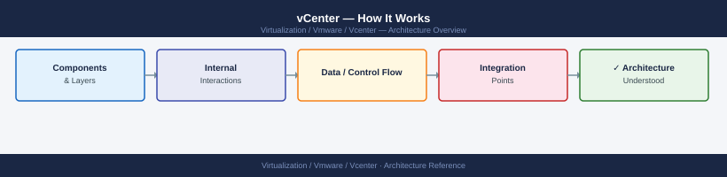
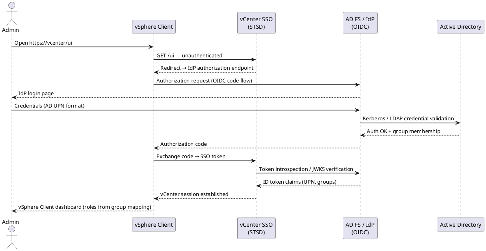

---
tags:
  - architecture
  - vcenter
  - vmware
  - vsphere-8
description: "How It Works reference covering Deployment Model, Core Services, Main Dependencies, vCenter HA (VCHA), Service Startup Order and 7 more sections."
---
# vCenter — How It Works

<div class="kb-summary">
How It Works reference covering Deployment Model, Core Services, Main Dependencies, vCenter HA (VCHA), Service Startup Order and 7 more sections.

*Applies to: vSphere 7.x · 8.x*
</div>


```d2
direction: right

vcenter: vCenter Server (VCSA) {
  shape: hexagon
}

clients: vSphere Clients {shape: person}
ad: Active Directory {shape: rectangle}
dns: DNS {shape: rectangle}
ntp: NTP {shape: rectangle}
esxi: ESXi Hosts {shape: rectangle}
vsan: vSAN Datastore {shape: cylinder}
nsx: NSX Manager {shape: rectangle}
backup: Backup Target {shape: cylinder}

clients -> vcenter: HTTPS 443
vcenter -> ad: LDAP/S 389·636
vcenter -> dns: UDP 53
vcenter -> ntp: UDP 123
vcenter -> esxi: TCP 443·902
esxi -> vsan: vSAN traffic
vcenter -> nsx: REST API 443
vcenter -> backup: SCP·SFTP
```

## Deployment Model

vCenter Server is delivered as the **vCenter Server Appliance (VCSA)** — a Photon OS-based virtual appliance. Since vCenter 7.0, the Platform Services Controller (PSC) is embedded directly in the appliance (external PSC is deprecated). The embedded database is PostgreSQL.

A single VCSA manages the full vSphere inventory: datacenters, clusters, hosts, VMs, datastores, networks, and policies.

## Core Services

| Service | Description |
|---|---|
| vCenter Server Appliance (VCSA) | The main management appliance; Photon OS-based |
| vpxd | Core vCenter daemon — inventory, scheduling, HA/DRS orchestration |
| vSphere Client | HTML5 web UI at `https://<vcenter>/ui` |
| Embedded PSC / SSO | Authentication, SSO domain, VMCA certificate authority, licensing |
| vPostgres (PostgreSQL) | Embedded database — vCenter inventory, events, tasks |
| vAPI Endpoint | Modern REST API at `https://<vcenter>/api` |
| Lookup Service | Service registry for all vCenter components |
| Certificate Manager (VMCA) | Issues and renews certificates for VCSA and ESXi hosts |
| Backup Scheduler | Built-in file-based backup via VAMI |

## Main Dependencies

| Dependency | Notes |
|---|---|
| DNS | Forward and reverse resolution required for VCSA FQDN and all ESXi hosts |
| NTP | Time sync mandatory; skew > 5 minutes breaks Kerberos and SSO |
| Authentication Source | AD/LDAP identity source for user authentication |
| Management Network | VCSA must be reachable from all ESXi hosts on port 443; hosts reachable on 902 |
| Storage | VCSA runs as a VM; requires reliable datastore access |
| Certificate Trust | All services use TLS; expired certificates cascade into auth failures |

---

## vCenter HA (VCHA)

VCHA provides active/passive failover for the VCSA itself. Three nodes required:

- **Active** — serves all management traffic
- **Passive** — hot standby, continuously replicates from active
- **Witness** — tie-breaker for split-brain; can be a small VM (2 vCPU / 1 GB RAM)

Shared storage is **not** required — replication is network-based over a dedicated HA network. Failover is automatic on active node failure; RPO is near-zero, RTO is typically under 60 seconds.

---

## Service Startup Order

Services must start in the correct dependency order or vpxd will fail to initialise:

```bash
# Manual restart in dependency order
service-control --stop --all
service-control --start vmware-vpostgres
service-control --start vmware-stsd
service-control --start vmware-sts-idmd
service-control --start vpxd
service-control --start --all

# Verify
service-control --status --all
```


```text title="Expected output"
Stopping all services...
Stopped vpxd
Stopped vmware-sts-idmd
Stopped vmware-stsd
Stopped vmware-vpostgres
Stopped vmware-rhttpproxy
Stopped vmware-vsan-health
All services stopped successfully.

Starting vmware-vpostgres...
Service vmware-vpostgres started successfully
Starting vmware-stsd...
Service vmware-stsd started successfully
Starting vmware-sts-idmd...
Service vmware-sts-idmd started successfully
Starting vpxd...
Service vpxd started successfully
Starting all remaining services...
Service vmware-rhttpproxy started successfully
Service vmware-vsan-health started successfully
All services started successfully.

Service                 Status
vmware-vpostgres        RUNNING
vmware-stsd             RUNNING
vmware-sts-idmd         RUNNING
vpxd                    RUNNING
vmware-rhttpproxy       RUNNING
vmware-vsan-health      RUNNING
```

!!! warning "Common errors"
    **`Error: vpxd failed to start. Dependency vmware-stsd is not running.`** — Verify vmware-stsd started successfully with `service-control --status vmware-stsd` before starting vpxd.
    **`Error: Cannot connect to service-control daemon. Is vmon running?`** — Restart the service control daemon with `systemctl restart vmon` or reboot the vCenter appliance.
    **`Error: vmware-vpostgres failed to start: database directory not accessible`** — Check disk space and permissions on `/storage/db` with `df -h` and `ls -la /storage/db`.
---

## Sizing

| Deployment Size | Max Hosts | Max VMs | vCPU | RAM | Disk (OS + DB) |
|---|---|---|---|---|---|
| Tiny (lab) | 10 | 100 | 2 | 12 GB | 415 GB |
| Small | 100 | 1,000 | 4 | 19 GB | 480 GB |
| Medium | 400 | 4,000 | 8 | 28 GB | 700 GB |
| Large | 1,000 | 10,000 | 16 | 37 GB | 1,065 GB |
| X-Large | 2,000 | 35,000 | 24 | 56 GB | 1,805 GB |

Sizing is set at deploy time and can be changed by modifying vCPU/RAM after deployment (requires reboot). Disk partitions can be expanded online.

```vegalite
{
  "$schema": "https://vega.github.io/schema/vega-lite/v5.json",
  "title": "vCenter Sizing — Maximum VMs by Deployment Size",
  "width": 400,
  "height": 200,
  "data": {
    "values": [
      {"size": "Tiny",    "max_vms": 100,   "max_hosts": 10},
      {"size": "Small",   "max_vms": 1000,  "max_hosts": 100},
      {"size": "Medium",  "max_vms": 4000,  "max_hosts": 400},
      {"size": "Large",   "max_vms": 10000, "max_hosts": 1000},
      {"size": "X-Large", "max_vms": 35000, "max_hosts": 2000}
    ]
  },
  "layer": [
    {
      "mark": {"type": "bar", "tooltip": true},
      "encoding": {
        "x": {
          "field": "size",
          "type": "ordinal",
          "sort": ["Tiny", "Small", "Medium", "Large", "X-Large"],
          "title": "Deployment Size"
        },
        "y": {"field": "max_vms", "type": "quantitative", "title": "Max VMs"},
        "color": {
          "field": "size",
          "type": "nominal",
          "legend": null,
          "scale": {"range": ["#64b5f6","#42a5f5","#2196f3","#1e88e5","#1565c0"]}
        }
      }
    },
    {
      "mark": {"type": "text", "dy": -6, "fontSize": 11},
      "encoding": {
        "x": {
          "field": "size",
          "type": "ordinal",
          "sort": ["Tiny", "Small", "Medium", "Large", "X-Large"]
        },
        "y": {"field": "max_vms", "type": "quantitative"},
        "text": {"field": "max_vms", "type": "quantitative"}
      }
    }
  ]
}
```

---

## Failure Domains

| Failure | Impact | Recovery |
|---|---|---|
| vCenter failure | Hosts and VMs continue running; HA/DRS stop; no management plane | Restore VCSA from backup or VCHA failover |
| PSC/SSO failure | Authentication failures; vSphere Client inaccessible | Restart SSO services; fix identity source |
| Database failure | vCenter services crash | Restore from last backup |
| VCHA passive failure | No impact to active; witness still provides quorum | Repair passive before next failover |
| Partition full (`/storage/log`) | vCenter services may crash or stop logging | Free space; rotate/archive logs |

---

## Ports and Protocols

| Use | Protocol | Port |
|---|---|---|
| vSphere Client / API | HTTPS | 443 |
| ESXi host agent heartbeat | TCP/UDP | 902 |
| VCSA VAMI (appliance management) | HTTPS | 5480 |
| vCenter HA replication | TCP | 8443 |
| LDAP | TCP | 389 |
| LDAPS | TCP | 636 |
| Syslog | UDP/TCP | 514 |
| DNS | TCP/UDP | 53 |
| NTP | UDP | 123 |

---

## Key Logs

| Component | Log Path |
|---|---|
| vpxd (core service) | `/var/log/vmware/vpxd/vpxd.log` |
| vSphere Client | `/var/log/vmware/vsphere-ui/logs/vsphere_client_virgo.log` |
| SSO / identity | `/var/log/vmware/sso/vmware-sts-idmd.log` |
| SSO admin server | `/var/log/vmware/sso/ssoAdminServer.log` |
| VAMI | `/var/log/vmware/applmgmt/applmgmt.log` |
| Upgrade / patch | `/var/log/vmware/applmgmt/software-packages.log` |
| Certificate manager | `/var/log/vmware/vmcad/certificate-manager.log` |
| Postgres DB | `/var/log/vmware/vpostgres/postgresql-*.log` |

---

## Useful Commands

```bash
# Service status
service-control --status --all

# Disk usage
df -h

# VECS certificate store — check expiry
/usr/lib/vmware-vmafd/bin/vecs-cli entry list --store MACHINE_SSL_CERT --text | grep -E "Alias|Not After"

# SSO domain info
/usr/lib/vmware-vmafd/bin/vmafd-cli get-domain-name --server-name localhost

# System resource usage
top
vmstat 1 5

# Network — open listening ports
ss -tlnp

# Photon OS version
cat /etc/photon-release
```


```text title="Expected output"
SERVICE CONTROL STATUS:
Service                                    Running  Startup
applmgmt                                   true     Automatic
certificatemanagement                      true     Automatic
eam                                        true     Automatic
envoy                                      true     Automatic
imagebuilder                               true     Automatic
...

DISK USAGE:
Filesystem                Size  Used Avail Use% Mounted on
/dev/sda1                 100G   47G   53G  47% /
/dev/sda2                  50G   12G   38G  24% /storage
tmpfs                      32G  512M   32G   2% /dev/shm

VECS CERTIFICATE STORE:
Alias: __MACHINE_CERT
Not After: 2026-03-15T18:42:33Z

Alias: __MACHINE_CERT_CA
Not After: 2033-03-15T18:42:33Z

SSO DOMAIN INFO:
vsphere.local

SYSTEM RESOURCE USAGE:
top - 14:32:18 up 127 days, 3:45, 1 user, load average: 2.14, 1.98, 1.87
Tasks: 287 total, 2 running, 285 sleeping, 0 stopped, 0 zombie
%Cpu(s): 18.2 us, 4.1 sy, 0.0 ni, 77.1 id, 0.6 wa, 0.0 hi, 0.0 si, 0.0 st

procs -----------memory---------- ---swap-- -----io---- -system-- ------cpu-----
 r  b   swpd   free   buff  cache   si   so    bi    bo   in   cs us sy id wa st
 2  0      0 18432M 2048M 8192M    0    0    12    45  892 1247 18  4 77  1  0
 1  0      0 18401M 2048M 8195M    0    0     8    32  856 1198 16  3 80  1  0
 0  0      0 18375M 2048M 8198M    0    0     4    18  734 1056 14  2 83  1  0
 1  0      0 18350M 2048M 8201M    0    0     6    24  798 1134 17  3 79  1  0
 0  0      0 18328M 2048M 8204M    0    0     3    12  712  998 13  2 84  1  0

NETWORK LISTENING PORTS:
State  Recv-Q Send-Q Local Address:Port        Peer Address:Port Process
LISTEN 0      128    0.0.0.0:22               0.0.0.0:*        users:(("sshd",pid=1247,fd=3))
LISTEN 0      128    0.0.0.0:443              0.0.0.0:*        users:(("envoy",pid=8934,fd=21))
LISTEN 0      128    0.0.0.0:80               0.0.0.0:*        users:(("envoy",pid=8934,fd=19))
```
---

## Database Operations

```bash
# Connect to embedded PostgreSQL
/opt/vmware/vpostgres/current/bin/psql -U postgres -d VCDB

# Inside psql
\dt                                          # list tables
SELECT pg_size_pretty(pg_database_size('VCDB'));  # check DB size
SELECT COUNT(*) FROM vc_event;               # verify DB is intact
\q
```


```text title="Expected output"
psql (12.7)
Type "help" for help.

VCDB=# \dt
                           List of relations
 Schema |                Name                 | Type  |  Owner   
--------+-------------------------------------+-------+----------
 public | vc_event                            | table | postgres
 public | vc_task                             | table | postgres
 public | vc_host                             | table | postgres
 public | vc_vm                               | table | postgres
 public | vc_cluster                          | table | postgres
 public | vc_datastore                        | table | postgres
 public | vc_network                          | table | postgres
(7 rows)

VCDB=# SELECT pg_size_pretty(pg_database_size('VCDB'));
 pg_size_pretty 
----------------
 8547 MB
(1 row)

VCDB=# SELECT COUNT(*) FROM vc_event;
  count  
---------
 2847561
(1 row)

VCDB=# \q
```

!!! warning "Common errors"
    **`psql: error: could not connect to server: No such file or directory`** — Ensure the vPostgres service is running with `systemctl status vpostgres` and verify `/opt/vmware/vpostgres/current/bin/psql` exists.
    **`FATAL: role "postgres" does not exist`** — The embedded PostgreSQL instance may be corrupted; restart vCenter services with `service-control --stop --all` followed by `service-control --start --all`.
    **`ERROR: relation "vc_event" does not exist`** — The VCDB schema is incomplete; restore from backup or reinitialize the vCenter database using the vCenter installer.
Do not modify the vCenter database directly unless directed by VMware Support.

---

## REST API Quick Reference

```bash
# Authenticate
TOKEN=$(curl -sk -u 'administrator@vsphere.local:<password>' \
    -X POST https://vcenter.example.local/api/session | tr -d '"')

# Host inventory
curl -sk -H "vmware-api-session-id: $TOKEN" \
    "https://vcenter.example.local/api/vcenter/host" | python3 -m json.tool

# VM inventory
curl -sk -H "vmware-api-session-id: $TOKEN" \
    "https://vcenter.example.local/api/vcenter/vm" | python3 -m json.tool

# System health
curl -sk -H "vmware-api-session-id: $TOKEN" \
    "https://vcenter.example.local/api/vcenter/health/system"

# Delete session
curl -sk -H "vmware-api-session-id: $TOKEN" \
    -X DELETE https://vcenter.example.local/api/session
```


```text title="Expected output"
[
  {
    "host": "host-123",
    "name": "esx01.example.local",
    "connection_state": "CONNECTED",
    "power_state": "POWERED_ON"
  },
  {
    "host": "host-124",
    "name": "esx02.example.local",
    "connection_state": "CONNECTED",
    "power_state": "POWERED_ON"
  }
]
[
  {
    "vm": "vm-456",
    "name": "prod-web-01",
    "power_state": "POWERED_ON",
    "cpu_count": 4,
    "memory_mb": 8192
  },
  {
    "vm": "vm-457",
    "name": "prod-db-01",
    "power_state": "POWERED_ON",
    "cpu_count": 8,
    "memory_mb": 16384
  },
  {
    "vm": "vm-458",
    "name": "dev-test-01",
    "power_state": "POWERED_OFF",
    "cpu_count": 2,
    "memory_mb": 4096
  }
]
{
  "status": "green",
  "messages": [],
  "last_check_time": "2024-01-15T14:32:18.456Z"
}
(no output — command completes silently)
```

!!! warning "Common errors"
    **`curl: (60) SSL certificate problem: self signed certificate`** — Add `-k` flag to skip certificate verification (already present; if error persists, verify vCenter hostname matches certificate CN).
    **`{"type":"com.vmware.vapi.std.errors.unauthenticated","value":{"messages":[]}}`** — Verify credentials are correct and TOKEN variable is populated; re-run authentication command and check for shell quoting issues with special characters in password.
    **`curl: (7) Failed to connect to vcenter.example.local port 443: Name or service not known`** — Confirm vCenter FQDN is resolvable and accessible from your network; check DNS or use IP address instead.
Swagger UI: `https://<vcenter>/apiexplorer`

---

## vCenter HA (VCHA) — Topology

---

## Identity Federation (vSphere 8)

vSphere 8 supports Active Directory Federation Services (AD FS) as an external identity provider via OIDC, replacing the older LDAP bind model. The flow below shows how vSphere Client authenticates a user through an external IdP.



---

## VM Encryption — Key Hierarchy

---

## Content Library — Publish & Subscribe

---

## Resource Pools — Shares, Limits & Reservations

---

## vMotion Types — Comparison

---

## DRS — Placement & Balancing Logic

## See also

- [vCenter — Design Standards](../design-standards/)
- [vCenter — Deploy](../../deploy/)
- [vCenter — Integrations](../integrations/)
