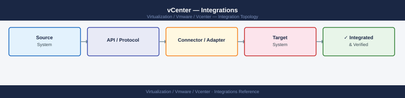

---
tags:
  - architecture
  - vcenter
  - vmware
  - vsphere-8
description: "Integrations reference covering Veeam Backup & Replication, Identity and Authentication Integration, Monitoring Integration, NSX Integration."
---
# vCenter — Integrations

<div class="kb-summary">
Integrations reference covering Veeam Backup & Replication, Identity and Authentication Integration, Monitoring Integration, NSX Integration.

*Applies to: vSphere 7.x · 8.x*
</div>


- **IWA**: Uses the machine account of the VCSA; requires VCSA joined to AD domain
- **LDAP**: Explicit bind account; use LDAPS (port 636) for encrypted queries

## Identity Integration

### SSO Domain

vCenter ships with a local `vsphere.local` SSO domain. The `administrator@vsphere.local` account is the bootstrap admin. In production:

- Add AD as an identity source
- Grant required AD groups vSphere roles
- Do not use `administrator@vsphere.local` for day-to-day operations
- Rotate `administrator@vsphere.local` password per policy; document in password vault

### SAML Federation

vCenter can act as a SAML service provider for external IdPs (ADFS, Okta, Azure AD). Configure under **SSO → Configuration → SAML Service Provider**. Useful for MFA enforcement at the IdP level.

## Monitoring Integration

### Aria Operations (VMware)

- Deploy Aria Operations (formerly vRealize Operations) and register vCenter as a **vCenter Adapter**
- Provides capacity analytics, performance anomaly detection, cost reporting
- Aria Operations vCenter adapter collects metrics every 5 minutes by default
- Predictive DRS requires Aria Operations integration with vCenter

### REST API

vCenter exposes a modern REST API at `https://<vcenter>/api` (vSphere 7.0+). The legacy vSphere Automation SDK endpoint is at `https://<vcenter>/rest`.

```bash
# Authenticate and get session token
curl -sk -u 'administrator@vsphere.local:password' \
  -X POST https://<vcenter>/api/session

# List VMs
curl -sk -H "vmware-api-session-id: <token>" \
  https://<vcenter>/api/vcenter/vm
```


```text title="Expected output"
{
  "value": "52b1042c-3ca3-4900-a236-2d2322e7eb41"
}
{
  "value": [
    {
      "vm": "vm-42",
      "name": "web-server-01",
      "power_state": "POWERED_ON",
      "cpu_count": 4,
      "memory_MB": 8192
    },
    {
      "vm": "vm-156",
      "name": "db-primary-prod",
      "power_state": "POWERED_ON",
      "cpu_count": 8,
      "memory_MB": 16384
    },
    {
      "vm": "vm-203",
      "name": "backup-vault-02",
      "power_state": "POWERED_OFF",
      "cpu_count": 2,
      "memory_MB": 4096
    },
    {
      "vm": "vm-891",
      "name": "test-vm-staging",
      "power_state": "POWERED_ON",
      "cpu_count": 2,
      "memory_MB": 2048
    }
  ]
}
```

!!! warning "Common errors"
    **`curl: (60) SSL certificate problem: self signed certificate`** — Add `-k` flag to skip SSL verification, or import the vCenter CA certificate into your system trust store.
    **`{"type":"com.vmware.vapi.std.errors.unauthenticated","value":{"messages":[{"default_message":"Invalid session.","id":"Com.Vmware.Vapi.Std.Errors.Unauthenticated"}]}}`** — Ensure the session token from the first curl command is correctly passed in the `vmware-api-session-id` header and hasn't expired (tokens expire after 30 minutes of inactivity).
    **`curl: (7) Failed to connect to <vcenter>: Name or service not known`** — Verify the vCenter hostname or IP address is correct and resolvable; check DNS or use the FQDN instead of a short hostname.
### Syslog / SIEM

vCenter forwards events as syslog (RFC 5424). Configure in VAMI or via PowerCLI:

```powershell
Set-VMHostSysLogServer -SysLogServer 'udp://<syslog-host>:514' -VMHost <host>
```

For vCenter appliance-level syslog, configure at **VAMI → Syslog**.

## NSX Integration

NSX registers vCenter as a **Compute Manager**. This enables:

- NSX automatically discovers ESXi hosts from vCenter inventory
- vCenter tags flow into NSX for dynamic security group membership (DFW policies)
- VDS (vSphere Distributed Switch) is used as the NSX data plane transport on ESXi (VDS 7.0+)
- NSX segments appear as vCenter port groups

Register from NSX Manager: **System → Fabric → Compute Managers → Add vCenter**

Permissions required: vCenter account with `Host → Configuration` and `Network` privileges.

## See also

- [vCenter — How It Works](../how-it-works/)
- [vCenter — Deploy](../../deploy/)
