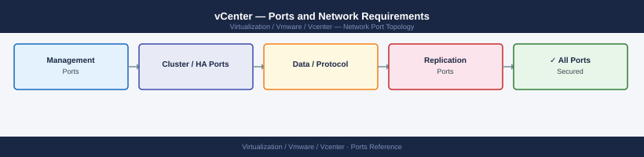

---
tags:
  - vcenter
  - networking
  - firewall
  - ports
  - vsphere
  - vsphere-7
  - vsphere-8
description: "Firewall port reference for vCenter Server Appliance (VCSA). Use this to build firewall change requests and validate network segmentation before..."
---
# vCenter — Ports and Network Requirements

<div class="kb-summary">
Firewall port reference for vCenter Server Appliance (VCSA). Use this to build firewall change requests and validate network segmentation before deployment or migration.

*Applies to: vSphere 7.x / 8.x*
</div>


## Before you begin

- Identify source IP ranges for each traffic category (admin workstations, backup proxies, monitoring)
- vCenter HA nodes must reach each other on the HA network — same L2 subnet is strongly recommended
- The vSAN VMkernel and vMotion VMkernel ports are on ESXi hosts, not vCenter — see [ESXi ports](../../../esxi/architecture/ports/)

---

## Inbound — Client to vCenter

| Port | Protocol | Source | Purpose |
|---|---|---|---|
| 443 | TCP | Admin workstations, APIs, SDK clients, backup proxies | vSphere Client, REST API, Web Services SDK, VAMI redirect |
| 80 | TCP | Clients | HTTP — redirects to 443 |
| 9443 | TCP | Clients (legacy) | vSphere Web Client (vSphere 6.x legacy; not required for 7.x+) |
| 5480 | TCP | Admin workstations | VAMI appliance management UI |
| 22 | TCP | Jump hosts / admin | SSH — enable only when needed |

---

## Outbound — vCenter to Infrastructure

| Port | Protocol | Destination | Purpose |
|---|---|---|---|
| 443 | TCP | ESXi hosts | vCenter → ESXi HTTPS API (host management) |
| 902 | TCP | ESXi hosts | VMware Authorization Daemon (vmware-authd) — required for vCenter to manage hosts |
| 389 | TCP/UDP | Active Directory DCs | LDAP for SSO identity source |
| 636 | TCP | Active Directory DCs | LDAPS (recommended over plain LDAP) |
| 3268 | TCP | Active Directory DCs | Global Catalog (multi-domain environments) |
| 3269 | TCP | Active Directory DCs | Global Catalog over SSL |
| 88 | TCP/UDP | Active Directory DCs | Kerberos authentication |
| 123 | UDP | NTP servers | Time synchronisation |
| 514 | UDP/TCP | Syslog server | Log forwarding |
| 162 | UDP | SNMP trap receiver | SNMP traps |
| 5696 | TCP | External KMS | KMIP key management (vSAN encryption, VM encryption) |
| 443 | TCP | broadcom.com / vmware.com | Call-home telemetry, CEIP, patch metadata |

---

## vCenter HA (3-Node Active/Passive/Witness)

All three VCSA nodes must reach each other. Recommended: dedicated HA network (separate NIC/VLAN).

| Port | Protocol | Between | Purpose |
|---|---|---|---|
| 2012 | TCP | VCSA nodes | HA cluster heartbeat (unicast) |
| 2014 | TCP | VCSA nodes | HA cluster internal API |
| 2020 | TCP | VCSA nodes | HA cluster configuration sync |

---

## Backup Agent to vCenter

| Port | Protocol | Source | Purpose |
|---|---|---|---|
| 443 | TCP | Backup proxy (Veeam, Commvault, NBU) | VADP — vStorage API for Data Protection |

---

## Monitoring and Management Tools

| Port | Protocol | Source | Purpose |
|---|---|---|---|
| 161 | UDP | Monitoring server (inbound to vCenter) | SNMP polling |
| 443 | TCP | Aria Operations, third-party monitoring | API polling for vCenter metrics |

---

## Firewall Zone Summary

| From | To | Ports | Notes |
|---|---|---|---|
| Admin clients | vCenter | 443, 5480, 22 | Restrict SSH to jump host only |
| vCenter | ESXi hosts | 902, 443 | Required for all host management |
| vCenter | Active Directory | 389, 636, 88, 3268 | Use 636 (LDAPS) not 389 |
| vCenter | NTP | 123/UDP | All appliances need NTP |
| Backup proxies | vCenter | 443 | VADP for backup operations |
| vCenter HA nodes | vCenter HA nodes | 2012, 2014, 2020 | Same subnet preferred |

---

## Verify

```bash
# From a client workstation — test vCenter API reachability
curl -sk https://<vcenter-fqdn>/rest/com/vmware/cis/session -X POST -u 'administrator@vsphere.local:<pass>' | head -c 100

# From vCenter VCSA shell — test AD connectivity
nc -zv dc.corp.local 389
nc -zv dc.corp.local 636

# From vCenter VCSA shell — test ESXi agent port
nc -zv esxi01.corp.local 902

# From vCenter VCSA shell — test NTP
ntpq -p
```


```text title="Expected output"
{"value":"52b2d8f6-e8e5-4a5c-9f2a-1c7d3e9a2b4f"}
Connection to dc.corp.local 389 port 389 [tcp/ldap] succeeded!
Connection to dc.corp.local 636 port 636 [tcp/ldaps] succeeded!
Connection to esxi01.corp.local 902 port 902 [tcp/opsec-3] succeeded!
     remote           refid      st t when poll reach   delay   offset  jitter
==============================================================================
*ntp.ubuntu.com     17.253.34.125  2 u   52   64  377   28.441   -1.234   2.156
+time.google.com    216.239.35.0   2 u   48   64  377   31.892    0.876   1.543
+ntp.apple.com      17.253.34.123  2 u   51   64  377   29.334    1.102   2.891
-time.cloudflare.co 162.125.18.133  3 u   50   64  377   45.221   -2.445   3.012
```

!!! warning "Common errors"
    **`curl: (60) SSL certificate problem: self-signed certificate`** — Add `-k` flag to skip certificate verification (already present in example, but ensure it's included if removed).
    **`nc: getaddrinfo for name/port failed: Name or service not known`** — Verify the FQDN is resolvable by running `nslookup dc.corp.local` and confirm DNS is configured on the VCSA.
    **`Connection refused`** — Confirm the ESXi host is powered on and the vCenter management network can reach the ESXi management interface on port 902.
---

## See also

- [ESXi — Ports](../../esxi/architecture/ports.md)
- [vSAN — Ports](../../vsan/architecture/ports.md)
- [NSX — Ports](../../nsx/architecture/ports.md)
- [vCenter — Architecture](../how-it-works/)
- [vCenter — Deploy](../../deploy/)
