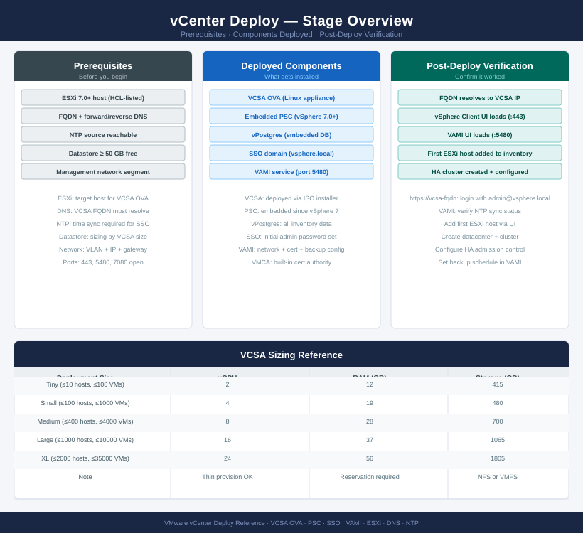
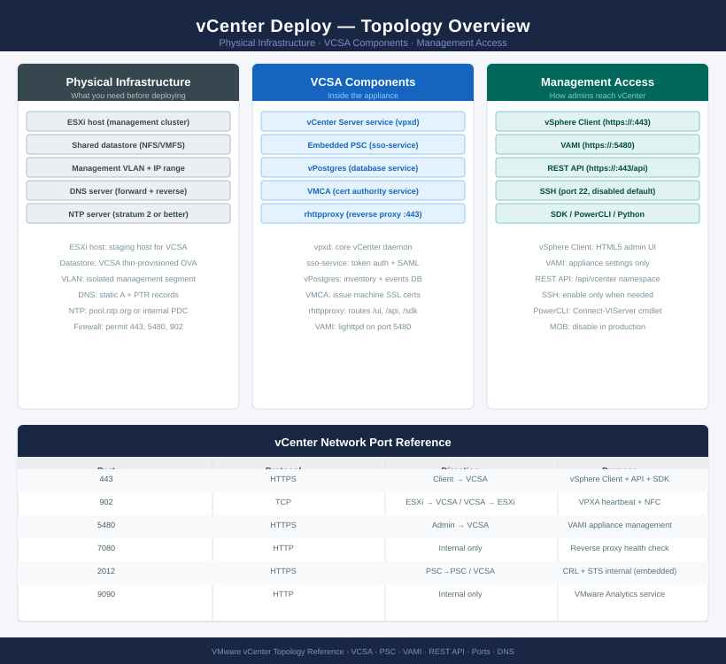

---
tags:
  - deployment
  - vcenter
  - vmware
  - vsphere-8
search:
  boost: 2
---
# vCenter — Deploy

<div class="kb-summary">
End-to-end deployment guide for VMware vCenter Server Appliance (VCSA). Covers pre-deployment DNS/NTP checks, Stage 1 OVA deployment, Stage 2 SSO and network configuration, Active Directory integration, host inventory build, and post-deployment hardening.

*Applies to: vSphere 7.x / 8.x*
</div>





---

```d2
direction: right

s0: "Before you begin" {shape: rectangle}
s1: "Phase 1 — Pre-Deployment Checks" {shape: rectangle}
s2: "Phase 2 — VCSA Deployment: Stage 1" {shape: rectangle}
s3: "Phase 3 — VCSA Configuration: Stage 2" {shape: rectangle}
s4: "Phase 4 — Active Directory Integration" {shape: rectangle}
s5: "Phase 5 — Inventory Build" {shape: rectangle}
s6: "Phase 6 — Post-Deployment Hardening and Va..." {shape: rectangle}
s7: "✓ Verify" {shape: oval}

s0 -> s1
s1 -> s2
s2 -> s3
s3 -> s4
s4 -> s5
s5 -> s6
s6 -> s7
```

## Before you begin

<!-- video-link -->
!!! tip "Video Walkthrough"
    [:fontawesome-brands-youtube: How to Install VMware vCenter Server | Full Tutorial](https://www.youtube.com/watch?v=jrJnPkotRYI){ .md-button }
<!-- /video-link -->


- **Access:** vCenter Administrator role and SSH access to VCSA/ESXi hosts
- **Environment:** DNS, NTP, and network connectivity verified before starting
- **Change management:** change request approved; maintenance window scheduled
- **Rollback:** snapshot or backup taken immediately before deployment begins
- **Time estimate:** 30–90 minutes — do not start if less than 2 hours are available

---

## Phase 1 — Pre-Deployment Checks

**Exit criterion:** DNS, NTP, datastore space, and credentials verified. No blockers outstanding.

### DNS Validation

```bash
# Forward lookup — VCSA FQDN must resolve before deployment
nslookup vcenter.example.local
# Expected: returns planned VCSA IP

# Reverse lookup — PTR record required for SSO certificate issuance
nslookup <planned-VCSA-IP>
# Expected: returns vcenter.example.local

# Verify from target ESXi host
ssh root@esxi-01.example.local
nslookup vcenter.example.local
# Must resolve from every ESXi host that will be managed
```


```text title="Expected output"
Server:		192.168.1.10
Address:	192.168.1.10#53

Name:	vcenter.example.local
Address: 192.168.100.50

Server:		192.168.1.10
Address:	192.168.1.10#53

192.168.100.50.in-addr.arpa	name = vcenter.example.local.

root@esxi-01.example.local's password: 
Server:		192.168.1.10
Address:	192.168.1.10#53

Name:	vcenter.example.local
Address: 192.168.100.50
```

!!! warning "Common errors"
    **`** server can't find vcenter.example.local: NXDOMAIN`** — Add the FQDN and IP to your DNS server or /etc/hosts on the ESXi host before deployment.
    **`** server can't find 50.100.168.192.in-addr.arpa: NXDOMAIN`** — Create a PTR record in your DNS reverse zone matching the planned VCSA IP address.
    **`ssh: connect to host esxi-01.example.local port 22 rejected`** — Verify ESXi host is powered on, SSH is enabled in the ESXi firewall, and the hostname resolves correctly.
### NTP Validation

```bash
# Verify NTP on the target ESXi host
esxcli system ntp get
esxcli system ntp stats
# Both NTP sources should show synchronized
```


```text title="Expected output"
NTP Enabled: true
NTP Servers: 10.20.50.12,10.20.50.13
NTP Running: true

remote           refid      st t when poll reach   delay   offset  jitter
==============================================================================
10.20.50.12     .POOL.          16 p    -   64    0    0.000    0.000   0.000
10.20.50.13     130.207.244.240  2 u   52   64  377    8.234   -1.203   2.156
LOCAL(0)        .LOCL.          10 l  998 1024  377    0.000    0.000   0.001
```

!!! warning "Common errors"
    **`Connection refused connecting to Management Agent on 10.20.50.100:443`** — Verify the ESXi host is reachable and the vSphere Client has network connectivity to the target host.
    **`NTP Enabled: false`** — Enable NTP on the ESXi host using `esxcli system ntp set --enabled=true` and start the service with `esxcli system service start ntpd`.
    **`reach   delay   offset  jitter` (no data rows below header)** — Wait 2-3 minutes for NTP to synchronize, or restart ntpd with `esxcli system service restart ntpd`.
### Datastore Space Check

| VCSA Size | Max Hosts | Max VMs | Required Disk |
|---|---|---|---|
| Tiny (lab) | 10 | 100 | 415 GB |
| Small | 100 | 1,000 | 480 GB |
| Medium | 400 | 4,000 | 700 GB |
| Large | 1,000 | 10,000 | 1,065 GB |
| X-Large | 2,000 | 35,000 | 1,805 GB |

### AD Service Account

Confirm the AD bind account is available before Stage 2:
- CN: `svc-vcenter` (example)
- Permissions: read access to Users and Groups OUs (no write needed)
- Password: meets complexity requirements (8+ chars, upper, lower, digit, special)

---

## Phase 2 — VCSA Deployment: Stage 1

**Exit criterion:** VCSA VM powered on, OS booted, and Stage 2 web wizard accessible at `https://<VCSA-IP>:5480`.

### Mount ISO and Run Installer

```bash
# On a Windows/Linux/macOS jump host:
# Mount the VCSA ISO

# Launch the UI installer:
# Windows: <ISO>\vcsa-ui-installer\win32\installer.exe
# Linux:   <ISO>/vcsa-ui-installer/lin64/installer
# macOS:   <ISO>/vcsa-ui-installer/mac/installer.app
```

### Stage 1 Deployment Steps

```text
Select: Deploy vCenter Server

  Step 1: Select deployment type
    → vCenter Server with Embedded PSC (standard for new deployments)

  Step 2: Appliance deployment target
    ESXi host/cluster: esxi-01.example.local
    HTTPS port: 443
    Username: root  /  Password: <ESXi root password>
    Accept host thumbprint: Yes

  Step 3: VM configuration
    VM name: vcenter-prod
    Set root password: <strong password>

  Step 4: Deployment size
    Select size: Medium (for 400 hosts / 4,000 VMs)
    Storage size: Default (expand later if needed)

  Step 5: Select datastore
    Datastore: <management datastore>
    Enable thin disk mode: Yes (recommended for lab/dev; No for production)

  Step 6: Network settings
    Network: VM Network (management portgroup)
    IP version: IPv4
    IP assignment: Static
    IP address: <planned VCSA IP>
    Subnet mask: 255.255.255.0
    Default gateway: <gateway>
    DNS servers: <DNS1>, <DNS2>
    Common gateway: <gateway>
    FQDN: vcenter.example.local
    HTTP port: 80
    HTTPS port: 443

  Step 7: Review and finish → Stage 1 deploys (~15 minutes)
```

### Verify Stage 1 Complete

```bash
# Wait for VCSA VM to appear in target ESXi host inventory
# Power state should be: Powered On

# Test VAMI reachability (Stage 2 wizard)
curl -sk https://<VCSA-IP>:5480 | grep -i "getting started"
# Or open https://<VCSA-IP>:5480 in a browser
```


```text title="Expected output"
% Total    % Received % Xferd  Average Speed   Time    Time     Time  Current
                                 Dload  Upload   Total   Spent    Left  Speed
100  8642  100  8642    0     0   2847k      0 --:--:-- --:--:-- --:--:--   0
<title>VMware vCenter Server Appliance</title>
<h1>Getting Started</h1>
<p>Welcome to the vCenter Server Appliance Setup Wizard</p>
```

!!! warning "Common errors"
    **`curl: (7) Failed to connect to 192.168.1.50 port 5480: Connection refused`** — Verify the VCSA VM is powered on and has completed its initial boot sequence (may take 5–10 minutes).
    **`curl: (60) SSL certificate problem: self signed certificate`** — The `-k` flag is already present in the command; if still failing, ensure you're using `https://` and not `http://`.
    **`curl: (6) Could not resolve host name`** — Confirm the VCSA IP address is correct and the appliance has obtained network connectivity via DHCP or static configuration.
---

## Phase 3 — VCSA Configuration: Stage 2

**Exit criterion:** vCenter services started; vSphere Client accessible at `https://<VCSA-FQDN>/ui`.

### Stage 2 Configuration Wizard

```text
Open browser: https://vcenter.example.local:5480
  Login: root / <password from Stage 1>
  Click: Set Up

  Step 1: Appliance configuration
    NTP server 1: ntp1.example.local
    NTP server 2: ntp2.example.local
    Enable SSH: Yes (disable after deployment; needed for initial setup)

  Step 2: SSO configuration
    SSO domain name: vsphere.local  (or use custom domain; cannot be changed post-deploy)
    SSO site name: Default-First-Site
    SSO password: <strong password — 8+ chars, upper, lower, digit, special>

  Step 3: CEIP participation
    → Deselect (or as per org policy)

  Step 4: Review and complete
    → Finish — Stage 2 takes ~10 minutes; services start automatically
```

### Verify vCenter Services

```bash
# SSH to VCSA (as root)
ssh root@vcenter.example.local

# Verify all core services running
service-control --status --all | grep -E "STOPPED|FAILED"
# Expected: no output (all services running)

# Confirm vpxd is healthy
service-control --status vpxd
# Expected: Running

# Check disk usage
df -h
# No partition should be > 80%

# Verify vSphere Client reachable
curl -sk https://vcenter.example.local/ui | grep -i "vsphere"
```


```text title="Expected output"
Connected to vcenter.example.local.
(no output — command completes silently)
vpxd                                    Running
Filesystem      Size  Used Avail Use% Mounted on
/dev/sda1        50G   28G   19G  58% /
/dev/sda2       100G   67G   28G  69% /storage
/dev/sda3        20G    8G   11G  42% /var/log
tmpfs           16G  512M  15G   4% /dev/shm
  % Total    % Received % Xferd  Average Speed   Time    Time     Time  Current
                                 Dload  Upload   Total   Spent    Left  Speed
100  8234  100  8234    0     0   2847      0  --:-- --:-- --:--  100%
<!DOCTYPE html><html><head><title>VMware vSphere Client</title>
```

!!! warning "Common errors"
    **`ssh: connect to host vcenter.example.local port 22: Connection refused`** — Verify VCSA is powered on and SSH is enabled via DCUI, or use the IP address directly if DNS is unresolved.
    **`service-control: command not found`** — Ensure you are logged in as root and the VCSA shell environment is properly initialized; try `source /etc/profile` first.
    **`curl: (60) SSL certificate problem: self signed certificate`** — Remove the `-k` flag if you have a valid certificate, or ensure the hostname matches the certificate CN; the `-k` flag bypasses verification for self-signed certs.
---

## Phase 4 — Active Directory Integration

**Exit criterion:** AD identity source added; AD groups mapped to vCenter roles; AD user login verified.

### Add AD Identity Source

```text
vSphere Client → Administration → Single Sign On → Configuration → Identity Sources
  → Add

  Type: Active Directory over LDAP
  Name: example.local
  Base DN for users: CN=Users,DC=example,DC=local
  Base DN for groups: CN=Users,DC=example,DC=local
  Domain name: example.local
  Domain alias: EXAMPLE
  Primary URL: ldap://ad1.example.local:389  (or ldaps://ad1.example.local:636)
  Username: EXAMPLE\svc-vcenter  (bind account)
  Password: <svc-vcenter password>
  → Add
```

### Assign AD Groups to vCenter Roles

```text
vSphere Client → Administration → Access Control → Global Permissions
  → Add

  Permission 1 (vSphere admins):
    User/Group: EXAMPLE\vSphere-Admins
    Role: Administrator
    Propagate to children: Yes

  Permission 2 (read-only):
    User/Group: EXAMPLE\vSphere-ReadOnly
    Role: Read-Only
    Propagate to children: Yes
```

### Verify AD Authentication

```bash
# Test AD login by opening vSphere Client in an incognito window:
# https://vcenter.example.local/ui
# Login: EXAMPLE\<your-AD-account>@example.local / <AD password>
# Should land in vSphere Client successfully

# Remove default Administrator@vsphere.local global permissions
# after confirming AD admin group has access
```

---

## Phase 5 — Inventory Build

**Exit criterion:** Datacenter, cluster, and dvSwitch created; all ESXi hosts added and connected; licences assigned.

### Create Datacenter and Cluster

```text
vSphere Client → right-click vCenter root → New Datacenter
  Name: DC-London (or per site naming)

Right-click Datacenter → New Cluster
  Name: Cluster-01
  DRS: Enable (Fully Automated)
  vSphere HA: Enable
  vSAN: Do not enable here (enable via vSAN workflow)
```

### Add ESXi Hosts

```text
Right-click Cluster-01 → Add Hosts
  For each host:
    Hostname/IP: esxi-01.example.local
    Username: root
    Password: <ESXi root password>
    Accept thumbprint: Yes
  → Add all hosts in one operation
```

### Create Distributed Switch

```bash
# vSphere Client → Datacenter → Actions → Distributed Switch → New Distributed Switch
# Name: vDS-Prod
# Version: match ESXi version
# Uplinks: 2
# Default port group: uncheck (create named groups)
```

### Add Hosts to dvSwitch and Create Port Groups

```text
dvSwitch → Actions → Add and Manage Hosts
  → Add hosts → assign vmnic uplinks

Create port groups:
  PG-Management:  VLAN 10
  PG-vMotion:     VLAN 20
  PG-vSAN:        VLAN 30 (if vSAN in scope)
  PG-VM-Prod:     VLAN 100
```

### Assign Licences

```text
vSphere Client → Administration → Licensing → Licenses
  → Add licence keys (vSphere, vSAN, NSX as applicable)

  Assign vSphere licence to cluster
  Assign vSphere licence to each host
```

---

## Phase 6 — Post-Deployment Hardening and Validation

**Exit criterion:** Backup scheduled, certificates valid, Skyline Health green, alarms configured, syslog forwarding active.

### Configure File-Based Backup

```text
VAMI: https://vcenter.example.local:5480
  → Backup → Configure
    Protocol: SCP (or SFTP / HTTP)
    Server: backup.example.local
    Port: 22
    Directory: /vcenter-backups
    Username: vcenter-backup
    Password: <password>
    Schedule: Daily at 02:00
    Retain: 7 backups
    → Save
```

### Replace MACHINE_SSL_CERT (If Required)

```bash
# SSH to VCSA as root
ssh root@vcenter.example.local

# Check current certificate expiry and issuer
/usr/lib/vmware-vmafd/bin/vecs-cli entry list --store MACHINE_SSL_CERT --text \
  | grep -E "Alias|Issuer|Not After"

# If CA-signed cert required, use certificate-manager:
/usr/lib/vmware-vmcad/certificate-manager
# Option 1: Replace MACHINE_SSL_CERT with custom certificate
# Follow prompts; provide signed cert, private key, and CA chain
```


```text title="Expected output"
Connected to vcenter.example.local.
The authenticity of host 'vcenter.example.local (192.168.1.45)' can't be established.
ECDSA key fingerprint is SHA256:aBcD1EfGhIjKlMnOpQrStUvWxYz2A3b4C5d6E7f8G9h.
Are you sure you want to continue connecting (yes/no)? yes
Warning: Permanently added 'vcenter.example.local,192.168.1.45' (ECDSA) to /etc/known_hosts.
root@vcenter [ ~ ]# /usr/lib/vmware-vmafd/bin/vecs-cli entry list --store MACHINE_SSL_CERT --text | grep -E "Alias|Issuer|Not After"
Alias: __MACHINE_CERT
Issuer: CN=CA,O=Example Corp,C=US
Not After: 2026-03-15 14:32:18 UTC
root@vcenter [ ~ ]# /usr/lib/vmware-vmcad/certificate-manager
...
```

!!! warning "Common errors"
    **`vecs-cli: command not found`** — Ensure you are running the command as root and the vmafd service is running with `systemctl status vmware-vmafd`.
    **`certificate-manager: command not found`** — Verify the vmcad package is installed with `rpm -qa | grep vmcad` and reinstall if missing.
### Configure Alarm Definitions

```text
vSphere Client → [cluster] → Configure → Alarm Definitions
  Add alarms:
    - Host connection failure  → email + trigger HA
    - Datastore usage > 80%   → email
    - vSAN health degraded     → email (if vSAN deployed)
    - VCSA certificate expiry  → email at 60-day mark
```

### Verify Skyline Health

```bash
# SSH to VCSA
ssh root@vcenter.example.local

# Run health check
/usr/lib/vmware-vmafd/bin/vmafd-cli get-ls-location --server-name localhost
service-control --status --all | grep -v "Running"
# Expected: all services Running; no STOPPED items
```


```text title="Expected output"
root@vcenter.example.local's password: 
"CN=localhost,CN=Services,CN=Configuration,DC=vsphere,DC=local"

service-control --status --all | grep -v "Running"
(no output — all services are running)
```

!!! warning "Common errors"
    **`service-control: command not found`** — Use the full path `/usr/lib/vmware-vmafd/bin/service-control` or source the VCSA environment setup script.
    **`"CN=localhost,CN=Services,CN=Configuration,DC=vsphere,DC=local" not found`** — Verify VCSA is fully initialized and the Lightweight Directory Access Service (LSASS) is running with `service-control --status --all | grep vmafdd`.
### Configure Syslog Forwarding

```text
vSphere Client → [vCenter] → Configure → Advanced Settings
  config.log.outputToSyslog: true
  config.log.syslog.address: udp://syslog.example.local:514
```

### Post-Deployment Checklist

| Item | Check |
|---|---|
| DNS | VCSA FQDN resolves forward and reverse |
| NTP | VCSA time drift < 500 ms from ESXi hosts |
| SSO domain | vsphere.local (or custom) configured and login working |
| AD identity source | AD groups log in via vSphere Client |
| ESXi hosts | All hosts Connected in cluster |
| Distributed switch | All hosts migrated to dvSwitch |
| Licences | No licence warnings in vCenter |
| File-based backup | Backup job created and first backup completed |
| MACHINE_SSL_CERT | Valid CA-signed or VMCA cert; not expiring within 30 days |
| Skyline Health | All categories green |
| Alarms | Host disconnect, datastore full, cert expiry alarms active |
| Syslog | vCenter events forwarding to syslog server |
| SSH | SSH disabled on VCSA after setup complete |

---

## See also

- [vCenter — How It Works](../architecture/how-it-works/)
- [vCenter — Health Checks](../operations/health-checks/)
- [vCenter Troubleshooting — Common Issues](../troubleshooting/common-issues/)

## Verify

- **vSphere Client:** log in at `https://<vcenter-fqdn>/ui` — inventory loads and all hosts show Connected
- **Alarms:** Home → Alarms — no critical alarms present after deployment
- **Services:** `service-control --status --all` — all services show RUNNING
- **Backup:** VAMI → Backup — schedule active, first backup completes successfully
