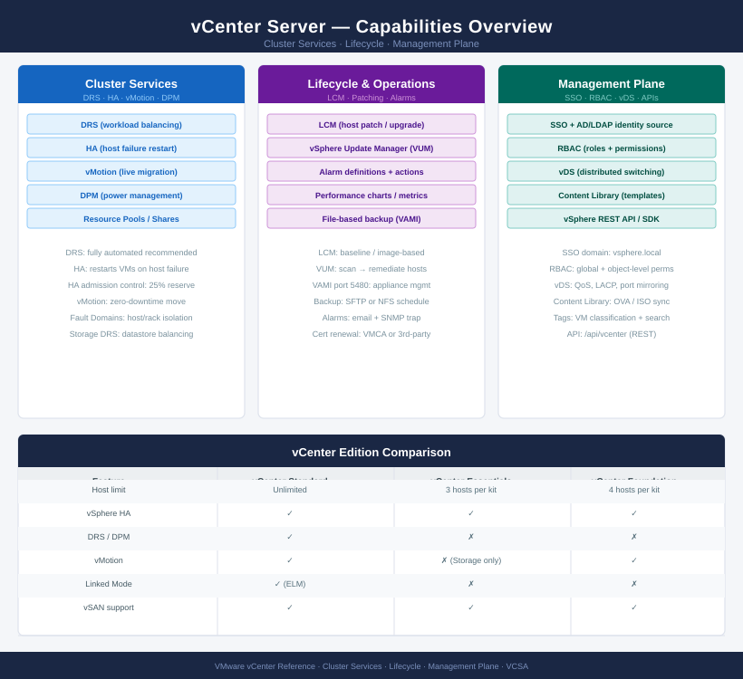
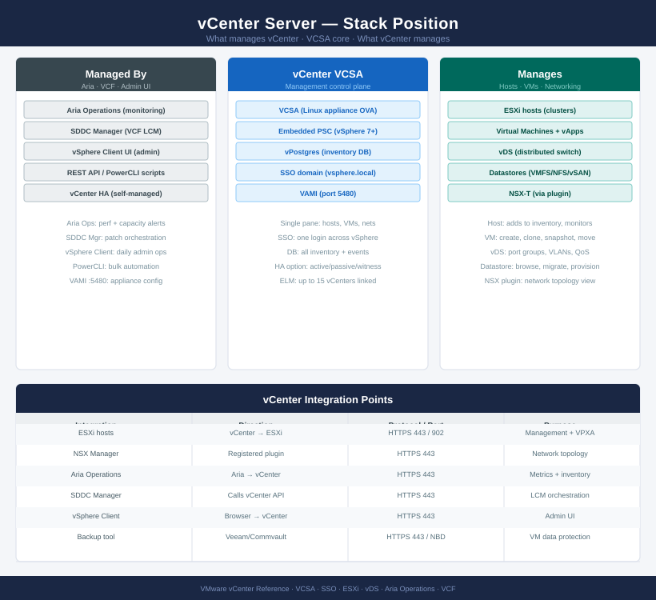

---
tags:
  - vcenter
  - vmware
  - vsphere-8
description: "Technical and operational reference for VMware vCenter Server (VCSA). Covers architecture, cluster management, lifecycle, security, and troubleshooting..."
---
# vCenter

<div class="kb-summary">
Technical and operational reference for VMware vCenter Server (VCSA). Covers architecture, cluster management, lifecycle, security, and troubleshooting for the vSphere management plane.

*Applies to: vSphere 7.x · 8.x*
</div>





```text
┌─────────────────────────────── vCenter Server — Installation Sequence ────────────────────────────────┐
│                                                                                                       │
│  Step 1 · Pre-Deploy Checks                                                                           │
│  ─────────────────────────────────────────────────────────────────────────────────────────            │
│  DNS: A-record and PTR for vCenter FQDN created  ·  Resolves from all hosts                           │
│  NTP: two sources reachable  ·  ESXi hosts already time-synced                                        │
│  Service account in AD: SSO admin, AD join credentials ready                                          │
│  Certificates: CA ready to sign or self-signed accepted per policy                                    │
│  Target datastore free space: ≥550 GB (small), ≥1150 GB (medium), ≥1700 GB (large)                    │
│                                                                                                       │
│                                        │  deploy VCSA OVA                                             │
│                                        ▼                                                              │
│  Step 2 · VCSA Deploy — Stage 1                                                                       │
│  ─────────────────────────────────────────────────────────────────────────────────────────            │
│  Mount VCSA ISO  ·  Launch installer (UI or CLI)  ·  Select Deploy                                    │
│  Enter ESXi host FQDN + credentials  ·  Accept host thumbprint                                        │
│  VM name, size selection (tiny/small/medium/large/x-large)                                            │
│  Select datastore  ·  Set network, IP, gateway, DNS, FQDN                                             │
│  Stage 1 completes: VCSA VM powered on, OS booted, ready for Stage 2                                  │
│                                                                                                       │
│                                        │  complete Stage 2 configuration                              │
│                                        ▼                                                              │
│  Step 3 · VCSA Configure — Stage 2                                                                    │
│  ─────────────────────────────────────────────────────────────────────────────────────────            │
│  Connect to Stage 2 wizard at https://vcsa-fqdn:5480                                                  │
│  NTP servers entered  ·  SSH access: enable for setup, disable post-config                            │
│  SSO domain name (vsphere.local or custom)  ·  SSO admin password set                                 │
│  Inventory size: select to match expected VM/host count for DB sizing                                 │
│  Stage 2 completes: vCenter services start  ·  vSphere Client accessible                              │
│                                                                                                       │
│                                        │  integrate with Active Directory                             │
│                                        ▼                                                              │
│  Step 4 · AD Integration & Identity                                                                   │
│  ─────────────────────────────────────────────────────────────────────────────────────────            │
│  Add AD identity source: Administration → SSO → Identity Sources                                      │
│  Service account for LDAP bind  ·  Base DN for users and groups                                       │
│  Assign AD groups to vCenter roles: administrators, read-only, operators                              │
│  Verify AD login works  ·  Remove default permissions after role mapping                              │
│  Confirm token lifetime and lockout policy match security baseline                                    │
│                                                                                                       │
│                                        │  build inventory                                             │
│                                        ▼                                                              │
│  Step 5 · Inventory Build                                                                             │
│  ─────────────────────────────────────────────────────────────────────────────────────────            │
│  Create datacenter object  ·  Add cluster  ·  Configure HA and DRS settings                           │
│  Add all ESXi hosts to cluster  ·  Hosts enter connected state                                        │
│  Create distributed switch  ·  Migrate hosts from vSS to vDS uplinks                                  │
│  Configure port groups: management, vMotion, vSAN, VM networks                                        │
│  Assign licences to hosts and cluster  ·  Verify no licence warnings                                  │
│                                                                                                       │
│                                        │  validate and harden                                         │
│                                        ▼                                                              │
│  Step 6 · Post-Install Validation                                                                     │
│  ─────────────────────────────────────────────────────────────────────────────────────────            │
│  Configure alarm definitions: host disconnect, datastore full, HA failure                             │
│  vCenter backup: File-Based Backup (FTP/SCP/HTTP) schedule configured daily                           │
│  Certificate: replace MACHINE_SSL_CERT with CA-signed if required                                     │
│  Skyline Health: enable and confirm green status for vCenter                                          │
│  SNMP or syslog forwarding configured for monitoring platform                                         │
│                                                                                                       │
└───────────────────────────────────────────────────────────────────────────────────────────────────────┘
```


<div class="kb-grid kb-grid-3">

<a class="kb-card" href="architecture/">
  <strong>Architecture</strong>
  <span>How it works, integrations, and design standards.</span>
</a>

<a class="kb-card" href="deploy/">
  <strong>Deploy</strong>
  <span>VCSA Stage 1 OVA deploy, Stage 2 SSO config, AD integration, and inventory build.</span>
</a>

<a class="kb-card" href="operations/">
  <strong>Operations</strong>
  <span>CLI reference, health checks, procedures, lifecycle, backup, and scripts.</span>
</a>

<a class="kb-card" href="security/">
  <strong>Security</strong>
  <span>Authentication, access control, encryption, and hardening.</span>
</a>

<a class="kb-card" href="troubleshooting/">
  <strong>Troubleshooting</strong>
  <span>Common issues, diagnostics, and escalation.</span>
</a>

</div>
