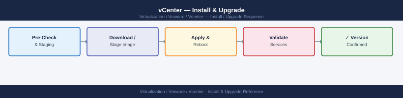

---
tags:
  - operations
  - vcenter
  - vmware
  - vsphere-8
---
# vCenter — Install & Upgrade

Install & Upgrade reference covering vCenter Upgrade Procedure (VCSA), vSphere Lifecycle Manager (vLCM), Interoperability Matrix, Patch Cadence, EOL Planning and 2 more sections.

*Applies to: vSphere 7.x / 8.x*

## Before you begin

- **Access:** vCenter read-only minimum; Administrator role for remediation steps
- **Timing:** safe to run during business hours unless a step is marked ⚠ (causes interruption)
- **Dependencies:** no active upgrades or migrations on the same infrastructure
- **Logging:** capture command output — paste into the change record on completion

---

!!! warning "Host enters maintenance mode"
    ESXi remediation puts hosts into maintenance mode, triggering DRS evacuation. Confirm DRS is Fully Automated and HA admission control is satisfied before starting.

## vCenter Upgrade Procedure (VCSA)

1. Take a **file-based backup** of vCenter (VAMI → Backup)
2. Snapshot the VCSA VM (if on a separate vCenter; do not rely on this for recovery)
3. Download the new VCSA ISO from Broadcom portal
4. Mount ISO and run the **Stage 1** installer (deploys new appliance alongside existing)
5. Run **Stage 2** (migrates data, cuts over, shuts down old appliance)
6. Validate: vSphere Client accessible, all hosts connected, SSO working
7. Remove old appliance after 24-hour validation window

## vSphere Lifecycle Manager (vLCM)

vLCM replaces the legacy vSphere Update Manager (VUM) for ESXi host lifecycle management. vLCM uses **cluster images** — a single desired-state image (ESXi base + vendor add-ons + VIBs) applied cluster-wide via remediation.

Key concepts:
- **Image**: ESXi base version + vendor add-ons (drivers) + components (VIBs)
- **Depot**: VMware Online depot or a local UMDS-synced depot
- **Compliance**: Per-host comparison of running state against cluster image
- **Remediation**: Puts host in maintenance mode, applies image, reboots, exits maintenance mode

## Interoperability Matrix

Before any upgrade, check the [VMware Product Interoperability Matrix](https://interopmatrix.broadcom.com):

| Component | Constraint |
|---|---|
| vSAN version | Must match vSphere version (same release train) |
| NSX-T / NSX 4.x | Supported vCenter versions listed per NSX release |
| Aria Operations | Specific adapter versions per vCenter/vSphere release |
| Veeam Backup | Veeam release supports specific vCenter/ESXi versions |
| Hardware (HCL) | ESXi version must support the physical server model |

## Patch Cadence

- VMware releases patches quarterly and out-of-band for critical CVEs
- **Critical Security Advisories (VMSA)**: apply within 30 days; P1 CVEs within 72 hours per most security policies
- Subscribe to [Broadcom Security Advisories](https://support.broadcom.com/web/ecx/security-advisory) RSS/email feed

## EOL Planning

When a vSphere version approaches EOL:

1. Identify all vCenter instances and ESXi hosts on the EOL version
2. Check interop matrix for target version vs. NSX, vSAN, plugins
3. Plan upgrade windows (typically 2–3 cluster-per-weekend cadence)
4. Update runbooks, monitoring thresholds, and backup schedules post-upgrade
5. Validate vLCM cluster images for all clusters post-upgrade

## Rollback Considerations

vCenter upgrade rollback is possible only via **file-based backup restore** — there is no in-place rollback. The old appliance is kept powered off for the validation window. Key points:

- Rollback means full restore from pre-upgrade backup
- Any changes made post-upgrade (new VMs, config changes) are lost on rollback
- ESXi downgrades are **not supported** — test on one host first and maintain rollback window before cluster-wide remediation

## Lifecycle

### vSphere Update Manager (VUM) — Legacy

Baseline-based patching. Still available in vSphere 7 but deprecated in 8. Use for standalone hosts not in vLCM-managed clusters.

---

## See also

- [vCenter — Health Checks](../health-checks/)
- [vCenter Troubleshooting — Common Issues](../../troubleshooting/common-issues/)
- [vCenter — Procedures](../procedures/)

## Verify

- **Alarms:** vSphere Client → Home → Alarms — no new critical alarms after the operation
- **Events:** monitor the vCenter Events view for the affected object for 5 minutes
- **Health check:** run the morning health-check sequence for the affected product tier
