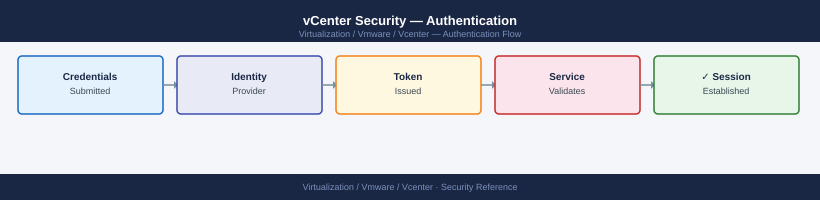
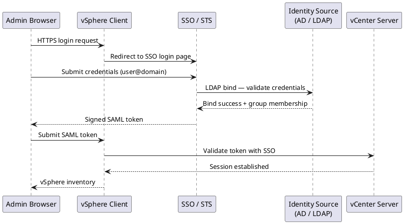

---
tags:
  - security
  - vcenter
  - vmware
  - vsphere-8
---
# vCenter Security — Authentication

<div class="kb-summary">
Authentication reference covering SSO Security, TLS Configuration, Certificates to Track, Certificate Replacement Process, Validation After Replacement and 5 more sections.

*Applies to: vSphere 7.x / 8.x*
</div>


## Before you begin

- **Access:** vCenter Administrator role
- **Change management:** security changes require CAB approval in most environments
- **Rollback plan:** document current state before any security control change
- **Testing:** validate in a non-production environment first where possible

---

## SSO Login Flow



## TLS Configuration

vCenter enforces TLS 1.2 minimum by default (vSphere 7.0+). TLS 1.0 and 1.1 are disabled.

### Certificate Modes

| Mode | Description | When to Use |
|---|---|---|
| VMCA (default) | vCenter acts as CA; signs all vCenter/host certs | Lab, small deployments |
| Custom CA | Enterprise CA signs all certs; VMCA subordinate to enterprise CA | Enterprise/compliance |
| Hybrid | VMCA for machine SSL; custom CA for solution user certs | Transitional |
| External CA — all custom | All certs replaced with enterprise CA-signed certs | Strict compliance |

### Certificate Replacement — Machine SSL (VCSA)

```bash
# On VCSA shell
/usr/lib/vmware-vmca/bin/certificate-manager
# Option 1: Generate CSR signed by external CA
# Option 5: Replace machine SSL certificate
```


```text title="Expected output"
vCenter Certificate Manager

1. Generate Certificate Signing Request (CSR)
2. Create a Self-Signed Certificate
3. Replace Machine SSL Certificate with VMCA-signed Certificate
4. Replace Machine SSL Certificate with Custom Certificate
5. Replace VMCA Root Certificate
6. Regenerate VMCA Root Certificate
7. Reset all Certificates to Default
8. View Certificate Information

Please select an option [1-8]:
```

!!! warning "Common errors"
    **`Error: Unable to connect to VMware Certificate Authority. Please check VMCA service status.`** — Verify VMCA service is running with `systemctl status vmware-vmca` and restart if needed.
    **`Error: Certificate file not found at /path/to/cert.pem`** — Ensure the certificate file path is correct and readable by the root user before proceeding.
    **`Error: Private key does not match certificate. Certificate installation failed.`** — Verify the private key and certificate are from the same CSR and were not corrupted during transfer.
Replacement requires vCenter services restart. Plan a maintenance window.

### Certificate Monitoring

```powershell
# PowerCLI — check vCenter endpoint certificate expiry
$req = [Net.HttpWebRequest]::Create("https://<vcenter>")
$req.GetResponse() | Out-Null
$cert = $req.ServicePoint.Certificate
[DateTime]::Parse($cert.GetExpirationDateString())
```

```bash
# Check certificate expiry from outside VCSA
echo | openssl s_client -connect <vcenter-fqdn>:443 -servername <vcenter-fqdn> 2>/dev/null \
  | openssl x509 -noout -dates

# List certificates in VECS store on VCSA (SSH)
/usr/lib/vmware-vmafd/bin/vecs-cli entry list --store MACHINE_SSL_CERT --text \
  | grep -E "Alias|Not After"
```


```text title="Expected output"
notBefore=Jan 15 10:23:45 2023 GMT
notAfter=Jan 15 10:23:45 2025 GMT

Alias: __MACHINE_CERT
Not After: 2025-01-15T10:23:45Z

Alias: __MACHINE_CERT_ALT
Not After: 2025-01-15T10:23:45Z

Alias: BACKUP_MACHINE_CERT
Not After: 2024-06-20T14:57:12Z
```

!!! warning "Common errors"
    **`connect: Connection refused`** — Verify the vCenter FQDN is correct, the host is reachable on port 443, and vCenter services are running.
    **`vecs-cli: command not found`** — Ensure you are connected via SSH to the VCSA appliance itself, not a remote system; the tool only runs on the vCenter Server Appliance.
    **`SSL: CERTIFICATE_VERIFY_FAILED`** — This is expected when checking self-signed certificates; the command still returns valid expiry dates despite the verification warning.
## Certificates to Track

| Certificate | Location | Risk if Expired |
|---|---|---|
| vCenter Machine SSL | VAMI → Certificate Management | Browser warnings, API failures |
| VMCA Root Certificate | VAMI → Certificate Management | Breaks all VMCA-issued certs |
| STS Certificate | vSphere Client → SSO → Certificates | Login failures platform-wide |
| Solution User Certificates | VAMI → Certificate Management | Service-to-service auth failures |

## Certificate Replacement Process

```d2
direction: right

id1: "Identify expiring cert\n(VAMI / openssl check" {shape: rectangle}
id2: "Confirm vCenter\nbackup is current" {shape: rectangle}
id3: "Schedule maintenance\nwindow" {shape: rectangle}
id4: "Replace via\ncertificate-manager" {shape: rectangle}
id5: "Restart affected\nservices" {shape: rectangle}
id6: "Validate browser,\nSSO, integrations" {shape: rectangle}

id1 -> id2
id2 -> id3
id3 -> id4
id4 -> id5
id5 -> id6
```

1. Identify the certificate and replacement method (VMCA, custom CA, or self-signed)
2. Confirm backup of vCenter is current
3. Schedule a maintenance window
4. Replace the certificate using the appropriate method
5. Restart affected services
6. Validate all integrations and logins

## Validation After Replacement

- Browser access to vCenter confirmed with no certificate warning
- All ESXi hosts Connected
- SSO login working for both local and AD accounts
- Aria, NSX, and backup integrations confirmed working

## Emergency Escalation

If certificate expiry causes a login or service failure:
- Check if the local administrator account (`administrator@vsphere.local`) still works
- Engage VMware support if SSO or STS cannot be recovered in place

---

## SAML Federation (External IdP)

vCenter can act as a SAML service provider for an external IdP such as ADFS, Okta, or Azure AD. This enables MFA enforcement at the IdP level without requiring MFA on every VCSA individually.

Configure at **Administration → Single Sign On → Configuration → Identity Provider → Set up SAML Service Provider**.

### ADFS Configuration (High Level)

1. Export the vCenter SAML metadata from **SSO → Configuration → SAML Service Provider → Download Service Provider Metadata**
2. In ADFS: Add a new Relying Party Trust using the metadata file
3. Add claim rules: `UPN → NameID`, `Token-Groups (unqualified names) → Group`
4. In vCenter: Set the IdP metadata URL (your ADFS federation metadata endpoint)
5. Test login: users should be redirected to ADFS login page and returned to vSphere Client with their AD group memberships

After federation is configured, grant permissions to AD groups (not individual users) in vCenter. The group SID comparison is done via the SAML assertion attributes.

---

## vCenter Enhanced Linked Mode (ELM)

Enhanced Linked Mode connects multiple vCenter instances to a shared SSO domain, providing single-pane-of-glass management across sites.

| Feature | Linked Mode |
|---|---|
| Single login | Yes — authenticate once, manage all vCenters |
| Shared roles | Yes — roles defined on one vCenter are visible on others |
| Shared permissions | Partially — global permissions apply to all; local permissions are per-vCenter |
| Shared inventory | Yes — view VMs and hosts across all vCenters |
| vMotion across vCenters | Yes — cross-vCenter vMotion supported (requires same SSO domain) |

```powershell
# Connect to multiple vCenters simultaneously
Connect-VIServer -Server vcenter-lon.example.local, vcenter-ams.example.local

# List all VMs across both vCenters
Get-VM | Select-Object Name, @{N="vCenter";E={$_.Uid.Split(':')[0]}}, PowerState

# Disconnect all
Disconnect-VIServer * -Confirm:$false
```

---

## Unlocking Accounts

### Unlock administrator@vsphere.local

```bash
# SSH to VCSA
/usr/lib/vmware-vmafd/bin/dir-cli user unlock \
    --account administrator \
    --domain vsphere.local \
    --password <current-password>

# If the password is also lost, reset via VCSA console (single-user mode)
# See VMware KB 2069041 for the reset procedure
```


```text title="Expected output"
(no output — command completes silently)
```

!!! warning "Common errors"
    **`dir-cli: error while loading shared libraries: libvmafd.so.0: cannot open shared object file`** — Ensure you are running the command from the VCSA appliance itself, not a remote system, as the vmafd libraries are only available locally.
    **`Error: Authentication failed for user 'administrator@vsphere.local'`** — Verify the current password is correct and that the administrator account exists in the vsphere.local domain.
    **`Error: Account 'administrator' is not locked`** — Confirm the account is actually locked before attempting to unlock it; use `dir-cli user list` to check account status first.
### Unlock an AD Account (from vCenter)

AD account lockouts caused by vCenter (e.g. cached wrong password in identity source):
1. Check if the bind account password has changed — update in **SSO → Identity Sources → Edit**
2. Unlock the AD account from Active Directory Users and Computers or PowerShell:
   ```powershell
   # On a domain controller
   Unlock-ADAccount -Identity jsmith
   ```
3. Restart `vmware-sts-idmd` service to clear any cached authentication state:
   ```bash
   service-control --restart vmware-sts-idmd
   ```
---

## Related Reference

- [Standard LDAP Integration](../../../../../security/ldap-integration/index.md) — field reference, service account standards, TLS requirements, and connectivity testing
- [Standard SAML Configuration](../../../../../security/saml-configuration/index.md) — SP/IdP setup, Azure AD and Okta steps, attribute mapping, and security requirements

## See also

- [vCenter Security — Access Control](../access-control/)
- [vCenter Security — Hardening](../hardening/)
