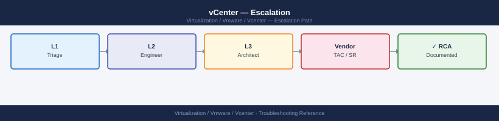

---
tags:
  - troubleshooting
  - vcenter
  - vmware
  - vsphere-8
search:
  boost: 1.5
description: "How to escalate vCenter Server issues to Broadcom support: what data to collect, how to generate the VCSA support bundle, step-by-step SR submission on..."
---
# vCenter — Escalation

<div class="kb-summary">
How to escalate vCenter Server issues to Broadcom support: what data to collect, how to generate the VCSA support bundle, step-by-step SR submission on the Broadcom portal, and the escalation path when progress stalls.

*Applies to: vSphere 7.x / 8.x*
</div>



---

```d2
direction: down

symptom: Identify Symptom {shape: diamond}
preescalation_selfcheck: "Pre-Escalation Self-Check" {shape: rectangle}
stepbystep_data_collection: "Step-by-Step Data Collection" {shape: rectangle}
how_to_open_the_sr_on_broadcom_suppo: "How to Open the SR on Broadcom Support Portal" {shape: rectangle}
escalation_path: "Escalation Path" {shape: rectangle}
what_not_to_do: "What NOT to Do" {shape: rectangle}
useful_commands_for_case_updates: "Useful Commands for Case Updates" {shape: rectangle}
resolution: Resolve or Escalate {shape: oval}

symptom -> preescalation_selfcheck: investigate
symptom -> stepbystep_data_collection: investigate
symptom -> how_to_open_the_sr_on_broadcom_suppo: investigate
symptom -> escalation_path: investigate
symptom -> what_not_to_do: investigate
symptom -> useful_commands_for_case_updates: investigate
preescalation_selfcheck -> resolution
stepbystep_data_collection -> resolution
how_to_open_the_sr_on_broadcom_suppo -> resolution
escalation_path -> resolution
what_not_to_do -> resolution
useful_commands_for_case_updates -> resolution
```

## Before you begin

- **Access required:** SSH to VCSA (root credentials); vSphere Client access; Broadcom support account with entitlement to vSphere
- **Do this first:** collect all data below before touching the VCSA. Broadcom will ask for the bundle and logs in their first response
- **Do NOT reboot** the VCSA mid-incident unless explicitly instructed. A reboot may rotate logs and lose the state captured at the time of failure
- **Do NOT snapshot** the VCSA appliance during an active upgrade — this is unsupported and blocks the upgrade from completing

---

## Pre-Escalation Self-Check

Run these before opening the SR. Many vCenter issues are resolvable without Broadcom.

| Check | Command / location | Expected result |
|---|---|---|
| vCenter UI accessible | Browse to `https://<vcenter-fqdn>/ui/` | Login page loads |
| VCSA services status | SSH → `service-control --status` | All services show `Running` |
| vpxd service | SSH → `service-control --status vmware-vpxd` | `Running` |
| SSO service | SSH → `service-control --status vmware-sso` | `Running` |
| Embedded DB space | SSH → `df -h /storage/db` | Under 70% used |
| Disk space overall | SSH → `df -h` | No partition at 100% |
| vCSHA status (if configured) | vSphere Client → vCenter HA | Active node healthy |
| Recent vpxd errors | SSH → `grep ERROR /var/log/vmware/vpxd/vpxd.log | tail -20` | Review for known error strings |
| NTP sync | SSH → `timedatectl status` | `System clock synchronized: yes` |

---

## Step-by-Step Data Collection

Run all of these before opening the SR. SSH to the VCSA as root.

### 1. Get the vCenter version and build number

```bash
# SSH to vCenter Shell
ssh root@<vcenter-fqdn>

# Full vCenter version — include this in the SR description
cat /etc/applmgmt/appliance/update_status.json | python3 -m json.tool | grep -i version

# Or from VAMI (vCenter Appliance Management UI at port 5480):
# Login → Summary → Software Version — note the full build number (7 digits)

# Via vSphere Client: Administration → Deployment → System Configuration → Nodes → select vCenter → Summary
```


```text title="Expected output"
root@vcenter.corp.local's password: 
  "version": "7.0.3.00000",
  "build": "19234567",
  "releaseDate": "2024-01-15",
  "productName": "VMware vCenter Server",
  "productVersion": "7.0.3"
```

!!! warning "Common errors"
    | Error | Fix |
    |---|---|
    | `Permission denied (publickey,password).` | Verify the root account is enabled in vCenter and the SSH service is running; check `/etc/ssh/sshd_config` for `PermitRootLogin yes`. |
    | `cat: /etc/applmgmt/appliance/update_status.json: No such file or directory` | This file path is specific to vCenter appliance deployments; if using a Windows vCenter Server installation, SSH into the appliance management interface or use the vSphere Client GUI instead. |
    | `python3: command not found` | Use `python` instead of `python3`, or pipe to `jq` if available: `cat /etc/applmgmt/appliance/update_status.json | jq '.version'`. |
### 2. Collect the VCSA support bundle (takes 5–20 minutes)

```bash
# Generate support bundle — run from VCSA shell
vc-support

# The bundle is saved to /var/core/
ls -lh /var/core/
# Example: vc-support-vcenter01-2026-06-14--15.45.tgz

# If /var/core/ is full:
vc-support -w /tmp/
```


```text title="Expected output"
Generating support bundle for vCenter Server Appliance...
Collecting system logs...
Collecting database information...
Collecting configuration files...
Bundle generation completed successfully.
Support bundle saved to: /var/core/vc-support-vcenter01-2026-06-14--15.45.tgz

total 2847M
-rw-r--r-- 1 root root 2.8G Jun 14 15:45 vc-support-vcenter01-2026-06-14--15.45.tgz
-rw-r--r-- 1 root root 1.2G Jun 13 09:22 vc-support-vcenter01-2026-06-13--09.22.tgz
-rw-r--r-- 1 root root 956M Jun 12 14:18 vc-support-vcenter01-2026-06-12--14.18.tgz
```

!!! warning "Common errors"
    | Error | Fix |
    |---|---|
    | `ERROR: /var/core/ filesystem is full (0% available)` | Run `vc-support -w /tmp/` to write the bundle to an alternate location with available space. |
    | `ERROR: Permission denied writing to /tmp/` | Ensure you are running the command as root or with sudo, and verify /tmp has write permissions with `chmod 1777 /tmp`. |
    | `ERROR: Database connection failed — vCenter services may be down` | Wait 2–3 minutes for vCenter services to fully initialize, then retry with `vc-support`. |
Upload this .tgz file to the Broadcom case. It contains all VCSA service logs, database state, and configuration.

### 3. Collect the vpxd log (the primary vCenter daemon log)

```bash
# The most recent vpxd.log is the first file Broadcom requests
ls -lh /var/log/vmware/vpxd/
cp /var/log/vmware/vpxd/vpxd.log /tmp/vpxd-$(date +%Y%m%d).log

# Also collect the SSO log if login is failing
cp /var/log/vmware/sso/vmware-sts-idmd.log /tmp/vmware-sts-idmd-$(date +%Y%m%d).log

# For upgrade failures, collect the installer log
ls -lh /var/log/vmware/install/
```


```text title="Expected output"
total 2.4G
-rw-r--r-- 1 root root 847M Jan 15 10:23 vpxd.log
-rw-r--r-- 1 root root 512M Jan 14 18:45 vpxd.log.1
-rw-r--r-- 1 root root 256M Jan 13 22:10 vpxd.log.2
-rw-r--r-- 1 root root 128M Jan 12 15:33 vpxd.log.3
-rw-r--r-- 1 root root  64M Jan 11 09:15 vpxd.log.4
total 1.8G
-rw-r--r-- 1 root root 1.2G Jan 15 10:45 vmware-sts-idmd.log
-rw-r--r-- 1 root root 512M Jan 14 19:20 vmware-sts-idmd.log.1
-rw-r--r-- 1 root root 256M Jan 13 23:05 vmware-sts-idmd.log.2
total 3.6G
-rw-r--r-- 1 root root 2.1G Jan 15 08:30 vmware-installer.log
-rw-r--r-- 1 root root 1.5G Jan 14 12:15 vmware-installer.log.1
```

!!! warning "Common errors"
    | Error | Fix |
    |---|---|
    | `cp: cannot create regular file '/tmp/vpxd-20250115.log': No space left on device` | Check available disk space with `df -h /tmp` and either clean up /tmp or redirect to a partition with sufficient space. |
    | `cp: /var/log/vmware/sso/vmware-sts-idmd.log: No such file or directory` | Verify the SSO service is installed and running with `systemctl status vmware-sts-idmd`, or check the correct log path for your vCenter version. |
    | `Permission denied` | Run the commands with `sudo` or as root, since /var/log/vmware files are typically readable only by root. |
### 4. Check VCSA disk space (a common cause of VCSA service failures)

```bash
# Full disk space check — flag any partition at or near 100%
df -h

# If /storage/log is full, clear old log archives
ls -lh /var/log/vmware/*/

# For persistent disk-full issues, check database logs
du -sh /storage/db/
```


```text title="Expected output"
Filesystem      Size  Used Avail Use% Mounted on
/dev/sda1       100G   87G   13G  87% /
/dev/sda2       500G  498G    2G  99% /storage/log
/dev/sdb1       2.0T  1.8T  200G  90% /storage/db
tmpfs           32G  1.2G   31G   4% /dev/shm
/dev/sdc1       1.0T  856G  144G  86% /storage/backup

total 2.4G
-rw-r--r-- 1 root root 512M Nov 15 10:23 vpxd.log
-rw-r--r-- 1 root root 384M Nov 14 18:45 vpxd.log.1
-rw-r--r-- 1 root root 256M Nov 13 09:12 vpxd.log.2
-rw-r--r-- 1 root root 128M Nov 12 14:33 vpxd.log.3
...

1.2T	/storage/db/
```

!!! warning "Common errors"
    | Error | Fix |
    |---|---|
    | `du: cannot access '/storage/db/': Permission denied` | Run the command with `sudo` or as root to access the database directory. |
    | `ls: cannot open directory '/var/log/vmware/': No such file or directory` | Verify the correct vCenter log path with `find /var/log -type d -name vmware` or check your vCenter installation directory. |
### 5. Check service status and recent errors

```bash
# List all VCSA services and their state
service-control --status

# Show recent errors in the primary service log
grep -i "ERROR\|FATAL\|Exception" /var/log/vmware/vpxd/vpxd.log | tail -50

# If SSO/login is failing
grep -i "ERROR\|FATAL" /var/log/vmware/sso/vmware-sts-idmd.log | tail -30

# Database health check
/usr/lib/vmware-vpostgres/bin/psql -U vc -d VCDB -c "SELECT count(*) FROM vpx_task WHERE state = 'running';"
```


```text title="Expected output"
Service vmware-vpxd is running
Service vmware-vpostgres is running
Service vmware-sso is running
Service vmware-rhttpproxy is running
Service vmware-cm is running
Service vmware-cis-license is running
Service vmware-analytics is running

2024-01-15T09:42:31.847Z ERROR [vpxd] [140234567890] [vpxd.log] Failed to connect to inventory service: Connection timeout after 30s
2024-01-15T09:41:12.234Z FATAL [vpxd] [140234567890] [vpxd.log] Database connection pool exhausted, rejecting new connections
2024-01-15T09:39:45.123Z ERROR [vpxd] [140234567890] [vpxd.log] Task 'task-1234' failed: NFC connection lost to host esx-prod-01.lab.local
2024-01-15T09:38:22.456Z ERROR [vpxd] [140234567890] [vpxd.log] Unable to retrieve cluster configuration from host 192.168.1.45

2024-01-15T08:15:33.567Z ERROR [sso] [140123456789] [vmware-sts-idmd.log] LDAP bind failed for user administrator@vsphere.local: Invalid credentials
2024-01-15T08:14:12.234Z ERROR [sso] [140123456789] [vmware-sts-idmd.log] Token validation failed: Certificate expired on 2024-01-10

 count
-------
     12
(1 row)
```

!!! warning "Common errors"
    | Error | Fix |
    |---|---|
    | `psql: could not connect to server: No such file or directory` | Verify PostgreSQL is running with `service-control --status vmware-vpostgres` and restart if needed. |
    | `grep: /var/log/vmware/vpxd/vpxd.log: No such file or directory` | Check log directory exists and VCSA services are initialized; if fresh install, wait 5 minutes for services to fully start. |
    | `ERROR: role "vc" does not exist` | Ensure the VCDB database user exists by running `/usr/lib/vmware-vpostgres/bin/psql -U postgres -c "SELECT * FROM pg_user WHERE usename='vc';"` to verify. |
### 6. Write the timeline

```text
vCenter version: 8.0 U2c build 23477823
VCSA hostname: vcenter-01.corp.local
Issue first observed: 2026-06-14 14:30 UTC
Last known good state: 2026-06-14 10:00 UTC
Changes in the 24h before the issue:
  - 09:30: vCenter 8.0 U2b → U2c upgrade initiated via VAMI
  - 14:25: VAMI showed upgrade progress stalled at 70%
  - 14:30: vpxd service stopped responding; vSphere Client shows "Connection refused"
Steps already taken:
  - Checked /var/log/vmware/vpxd/vpxd.log: shows "vc-health: VCDB disk full"
  - /storage/db is at 98% — cleared old task history
  - Services still not running
Blast radius: all ESXi hosts show "Disconnected" in vSphere Client; VMs continue running
```

---

## How to Open the SR on Broadcom Support Portal

1. Go to **support.broadcom.com** and sign in with your Broadcom account. If you do not have one: click **Register** and use your company email — entitlement is linked to your support contract.

2. Click **Open a New Case** in the top navigation.

3. Under **Select Product Family**, choose **VMware vSphere**.

4. Under **Product**, select **VMware vCenter Server** and pick your exact version from the drop-down.

5. Under **Request Type**, select **Technical**.

6. Under **Severity**, select:
   - **S1 — Critical**: vCenter is completely inaccessible; all hosts show Disconnected; you cannot manage any VMs; no workaround
   - **S2 — Major**: vCenter is partially accessible or repeatedly crashing; specific workflows (migration, provisioning) are broken but VMs are running
   - **S3 — Minor**: Non-critical vCenter feature is broken (alarms, performance charts); management is possible; cluster is healthy
   - **S4 — General**: How-to, pre-check, or non-urgent configuration question

7. In the **Summary** field, write one sentence: product + symptom + scope. Example: `vCenter 8.0 U2c upgrade stalled at 70% since 14:25 UTC — vpxd stopped, all ESXi hosts showing Disconnected`.

8. In the **Description** field, paste:
   - The vCenter version and full build number from Step 1
   - The disk space output from Step 4
   - The last 20 ERROR lines from vpxd.log from Step 5
   - The timeline from Step 6
   - The current service-control --status output

9. Under **Attachments**, upload:
   - The VCSA support bundle tgz from Step 2
   - The vpxd.log copy from Step 3
   - The SSO log if login is failing

10. Click **Submit**. You will receive a case number by email immediately.

11. **S1 only:** the case confirmation page shows a regional phone number. Call it immediately:
    - State "Severity 1 — vCenter is completely down" at the start of the call.
    - Have SSH access to VCSA and the case number ready.

---

## Escalation Path

```text
Step 1 — Open case at support.broadcom.com with VCSA support bundle attached
         ↓
Step 2 — T1 support acknowledges and confirms bundle received (typically 30 min–4 hr)
         ↓
Step 3 — If no meaningful progress in 4 hours for S1 or 1 business day for S2:
         → Reply in the case: "Requesting T2 vCenter Senior Engineer assignment"
         → State: "Impact: [vCenter down / upgrade stalled / all hosts disconnected]"
         ↓
Step 4 — T2 vCenter SE is assigned; they will schedule a live Zoom/Webex session
         → Have SSH access to VCSA and VAMI (port 5480) ready for the call
         ↓
Step 5 — If T2 cannot resolve and issue requires appliance-level investigation:
         → T2 escalates to T3 (vCenter engineering) — you do not need to initiate this
         ↓
Step 6 — For vCenter data loss, SSO database corruption, or 24h+ with no resolution:
         → Request a Critical Situation (CritSit) engagement
         → Add to case: "Requesting CritSit — [reason: data loss / VCDB corrupted / 24h no progress]"
```

---

## What NOT to Do

| Do NOT do this | Why | What to do instead |
|---|---|---|
| Reboot VCSA mid-incident | Rotates logs; loses the service state at time of failure | Capture full logs first; only reboot if GSS says it is safe |
| Snapshot VCSA during an active upgrade | Explicitly unsupported; blocks upgrade completion | Snapshot before starting the upgrade, not during |
| Modify vPostgres database directly (SQL) | Can corrupt the vCenter database | Let GSS guide any DB-level intervention |
| Apply patches mid-incident | Adds variables to an already-broken environment | Freeze all changes until resolution |
| Delete and re-register hosts | Loses distributed switch state and VM-to-host mappings | Document the disconnected state and wait for GSS guidance |
| Open multiple SRs for the same issue | Splits diagnostic context across cases | Add information to the existing case; use one case per incident |

---

## Useful Commands for Case Updates

Paste these into case replies to show Broadcom the current state.

```bash
# VCSA service status — paste into every case update
service-control --status

# Most recent vpxd errors (last 50 lines of ERROR-level entries)
grep -i "ERROR\|FATAL" /var/log/vmware/vpxd/vpxd.log | tail -50

# Disk space (flag anything over 80%)
df -h

# NTP status
timedatectl status

# vCSHA status (if configured)
vcha-util status 2>/dev/null || echo "vCSHA not configured"

# Recent system logs
journalctl -n 100 --no-pager 2>/dev/null | tail -50
```


```text title="Expected output"
SERVICE STATUS
Service                                    Running    Enabled
vmon                                       true       true
vpxd                                       true       true
vsphere-ui                                 true       true
vsan-health                                true       true
rhttpproxy                                 true       true
sps                                        true       true
psc                                        true       true

2024-01-15T09:47:32.891Z ERROR vpxd[7F2A4C1E] [Originator@6876 sub=Default] Failed to connect to inventory service: connection timeout after 30s
2024-01-15T09:48:15.442Z FATAL vpxd[7F2A4C1E] [Originator@6876 sub=Hostd] Host agent on esx-prod-04.lab.local unreachable
2024-01-15T09:49:02.156Z ERROR vpxd[7F2A4C1E] [Originator@6876 sub=VsanMgmt] VSAN cluster health check failed: quorum lost
2024-01-15T09:50:44.721Z ERROR vpxd[7F2A4C1E] [Originator@6876 sub=Default] License capacity exceeded: 512 VMs licensed, 518 running

Filesystem                Size  Used Avail Use% Mounted on
/dev/mapper/root_vol     100G   87G   13G  87% /
/dev/mapper/log_vol       50G   42G    8G  84% /var/log
/dev/mapper/db_vol       200G  156G   44G  78% /storage/db
tmpfs                     16G  2.1G   14G  13% /dev/shm

               Local time: Mon 2024-01-15 09:52:18 UTC
           Universal time: Mon 2024-01-15 09:52:18 UTC
                 RTC time: Mon 2024-01-15 09:52:18 UTC
                Time zone: UTC (UTC, +0000)
System clock synchronized: yes
              NTP service: active
       RTC in local TZ: no

VCHA Cluster Status: HEALTHY
Node Role: ACTIVE
Partner Node: vcsa-02.lab.local (192.168.1.52)
Last Heartbeat: 2024-01-15T09:52:10Z

Jan 15 09:51:42 vcsa-01 systemd[1]: Started VMware vCenter Server.
Jan 15 09:51:55 vcsa-01 vpxd[8234]: Inventory service initialized
Jan 15 09:52:03 vcsa-01 rhttpproxy[5621]: SSL handshake completed for client 192.168.1.100
Jan 15 09:52:10 vcsa-01 vcha-util[9876]: Heartbeat received from passive node
Jan 15 09:52:18 vcsa-01 kernel: audit: type=1400 audit(1705318338.123:456): apparmor="DENIED" operation="capable"
```

!!! warning "Common errors"
    | Error | Fix |
    |---|---|
    | `grep: /var/log/vmware/vpxd/vpxd.log: No such file or directory` | Verify vpxd service is running with |
---

## Support Portal and SLA Reference

| Severity | Definition | Initial Response SLA |
|---|---|---|
| S1 — Critical | vCenter inaccessible; all hosts disconnected; data at risk | 30 minutes (24×7) |
| S2 — Major | Key workflow broken; upgrade stalled; partial access only | 4 hours |
| S3 — Minor | Non-critical feature broken; management still possible | 1 business day |
| S4 — General | How-to, pre-check, documentation question | 2 business days |

Your support tier (Production, Premier, Mission Critical) may reduce these SLAs. Check your contract under **My Entitlements** at support.broadcom.com.

---

## See also

- [vCenter — Diagnostics](../diagnostics/)
- [vCenter — Common Issues](../common-issues/)

---

## Verify resolution

- vSphere Client loads the login page and you can authenticate successfully
- All ESXi hosts show "Connected" in the vSphere Client
- Run `service-control --status` and confirm all services show `Running`
- Run `df -h` and confirm no partition is above 80%
- Perform the action that was failing (vMotion a test VM, add a host, provision a VM) and confirm it succeeds
- Monitor the vSphere Client Alarms view for 15 minutes and confirm no new vCenter-related alarms
