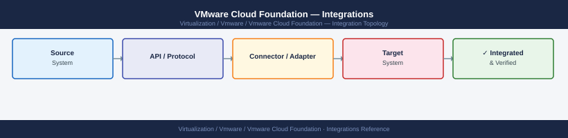

---
tags:
  - architecture
  - vcf
  - vmware
---
# VMware Cloud Foundation — Integrations

*Applies to: VMware vSphere 7.x / 8.x*


```bash
ldapsearch -H ldaps://<dc-ip>:636 -x -D "<bind-account-dn>" -W \
  -b "dc=domain,dc=com" "(sAMAccountName=<test-user>)"
```
```text
SDDC Manager → Administration → Backup → Configure
→ Set SFTP target → schedule daily → retain 7+ restore points
```
```text
SDDC Manager → Administration → Syslog → Add Syslog Server
→ Protocol: TLS (recommended) or UDP/TCP → Port: 6514 or 514
```
```powershell

## Configure syslog forwarding on all ESXi hosts in a cluster
Get-Cluster "ClusterName" | Get-VMHost | ForEach-Object {
  Set-VMHostSysLogServer -VMHost $_ -SysLogServer "udp://<siem-ip>:514"
  Restart-VMHostService -VMHost $_ -Key "syslog" -Confirm:$false
}
```

## See also

- [VMware Cloud Foundation — How It Works](../how-it-works/)
- [VMware Cloud Foundation — Deploy](../../deploy/)
