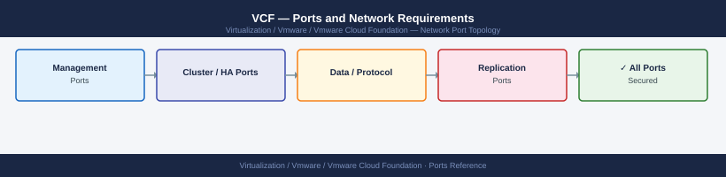

---
tags:
  - vcf
  - vmware-cloud-foundation
  - networking
  - firewall
  - ports
  - sddc
description: "Firewall port reference for VMware Cloud Foundation (VCF). VCF uses the same ports as its component products (vCenter, ESXi, vSAN, NSX). This page covers..."
---
# VCF — Ports and Network Requirements

<div class="kb-summary">
Firewall port reference for VMware Cloud Foundation (VCF). VCF uses the same ports as its component products (vCenter, ESXi, vSAN, NSX). This page covers the VCF-specific additions: SDDC Manager and Cloud Builder, which are the management plane unique to VCF.

*Applies to: VCF 5.x*
</div>


## Before you begin

- VCF is a composed stack — the underlying port requirements come from vCenter, ESXi, vSAN, NSX, and optionally Aria Suite
- SDDC Manager is the VCF-specific orchestrator; it requires inbound 443 from admins and outbound 443 to all managed components
- Cloud Builder is used only during initial VCF bring-up — it can be decommissioned after the management domain is deployed
- Open all ports from the linked product pages in addition to the SDDC Manager-specific ports listed here

---

## Inbound — Client to SDDC Manager

| Port | Protocol | Source | Purpose |
|---|---|---|---|
| 443 | TCP | Admin workstations, automation | SDDC Manager UI and REST API |
| 22 | TCP | Jump hosts | SDDC Manager SSH (vcf user) |

---

## SDDC Manager to Management Domain Components

| Port | Protocol | Source | Destination | Purpose |
|---|---|---|---|---|
| 443 | TCP | SDDC Manager | vCenter Server (management domain) | Lifecycle management, cluster expansion |
| 443 | TCP | SDDC Manager | NSX Manager (management domain) | NSX lifecycle and configuration |
| 443 | TCP | SDDC Manager | ESXi hosts (management domain) | Host commissioning and updates |
| 443 | TCP | SDDC Manager | Aria Suite (if deployed) | Aria lifecycle management integration |

---

## SDDC Manager to Workload Domain Components

| Port | Protocol | Source | Destination | Purpose |
|---|---|---|---|---|
| 443 | TCP | SDDC Manager | vCenter Server (workload domains) | Workload domain lifecycle |
| 443 | TCP | SDDC Manager | NSX Manager (workload domains) | Workload domain NSX operations |
| 443 | TCP | SDDC Manager | ESXi hosts (workload domains) | Host commissioning, remediation, updates |

---

## SDDC Manager — Outbound Services

| Port | Protocol | Destination | Purpose |
|---|---|---|---|
| 443 | TCP | *.vmware.com, *.broadcom.com | VCF download depot — bundle downloads, license checks |
| 123 | UDP | NTP servers | Time synchronisation |
| 514 | UDP/TCP | Syslog server | Log forwarding |

---

## Cloud Builder (Initial Deployment Only)

Cloud Builder is a temporary VM used only for VCF bring-up. Decommission after management domain deployment completes.

| Port | Protocol | Source | Destination | Purpose |
|---|---|---|---|---|
| 443 | TCP | Admin workstations | Cloud Builder IP | Cloud Builder UI (bring-up wizard) |
| 22 | TCP | Jump hosts | Cloud Builder IP | SSH for troubleshooting during bring-up |
| 443 | TCP | Cloud Builder | All ESXi hosts | Host commissioning during bring-up |
| 443 | TCP | Cloud Builder | *.broadcom.com | License validation during bring-up |

---

## All Underlying Product Ports

VCF requires all ports from:

| Product | Ports Reference |
|---|---|
| vCenter | [vCenter — Ports](../../../vcenter/architecture/ports/) |
| ESXi | [ESXi — Ports](../../../esxi/architecture/ports/) |
| vSAN | [vSAN — Ports](../../../vsan/architecture/ports/) |
| NSX | [NSX — Ports](../../../nsx/architecture/ports/) |

---

## Firewall Zone Summary

| From | To | Ports | Notes |
|---|---|---|---|
| Admin clients | SDDC Manager | 443 | UI and API — primary VCF management entry point |
| SDDC Manager | vCenter (all domains) | 443 | Lifecycle management |
| SDDC Manager | NSX Manager (all domains) | 443 | NSX lifecycle |
| SDDC Manager | ESXi hosts (all domains) | 443 | Host operations |
| SDDC Manager | *.broadcom.com | 443 | Bundle downloads (outbound) |
| Cloud Builder | ESXi hosts | 443 | Bring-up only — decommission after |

---

## Verify

```bash
# From admin workstation — test SDDC Manager API
curl -sk -o /dev/null -w "%{http_code}" https://<sddc-manager-ip>/v1/sddcmanager

# From SDDC Manager SSH — test vCenter reachability
curl -sk -o /dev/null -w "%{http_code}" https://<vcenter-ip>/rest/com/vmware/cis/session

# From SDDC Manager SSH — test NSX Manager reachability
curl -sk -o /dev/null -w "%{http_code}" https://<nsx-manager-ip>/api/v1/cluster/status

# From SDDC Manager SSH — test bundle depot connectivity
curl -sk -o /dev/null -w "%{http_code}" https://depot.vmware.com/

# From SDDC Manager — check bundle downloads
curl -sk -u admin:<pass> https://localhost/v1/bundles | python3 -m json.tool | grep -A2 '"status"'
```


```text title="Expected output"
200
200
200
200
{
  "status": "AVAILABLE",
  "downloadStatus": "COMPLETED"
},
{
  "status": "AVAILABLE",
  "downloadStatus": "COMPLETED"
},
{
  "status": "STAGED",
  "downloadStatus": "IN_PROGRESS"
}
```

!!! warning "Common errors"
    **`curl: (60) SSL certificate problem: self signed certificate`** — Add the `-k` flag to skip certificate verification, or import the SDDC Manager CA certificate into your system trust store.
    **`curl: (7) Failed to connect to <sddc-manager-ip> port 443: Connection refused`** — Verify the SDDC Manager IP address is correct and that port 443 is open; check firewall rules and confirm SDDC Manager services are running with `systemctl status vcf-*.service`.
    **`jq: command not found` or `python3: No module named json.tool`** — Install `jq` with `apt-get install jq` or use `python3 -m json.tool` if Python 3 is available on your SDDC Manager appliance.
---

## See also

- [VCF — Architecture](../how-it-works/)
- [VCF — Deploy](../../deploy/)
- [VCF — Operations](../../operations/)
- [vCenter — Ports](../../vcenter/architecture/ports.md)
- [NSX — Ports](../../nsx/architecture/ports.md)
- [vSAN — Ports](../../vsan/architecture/ports.md)
