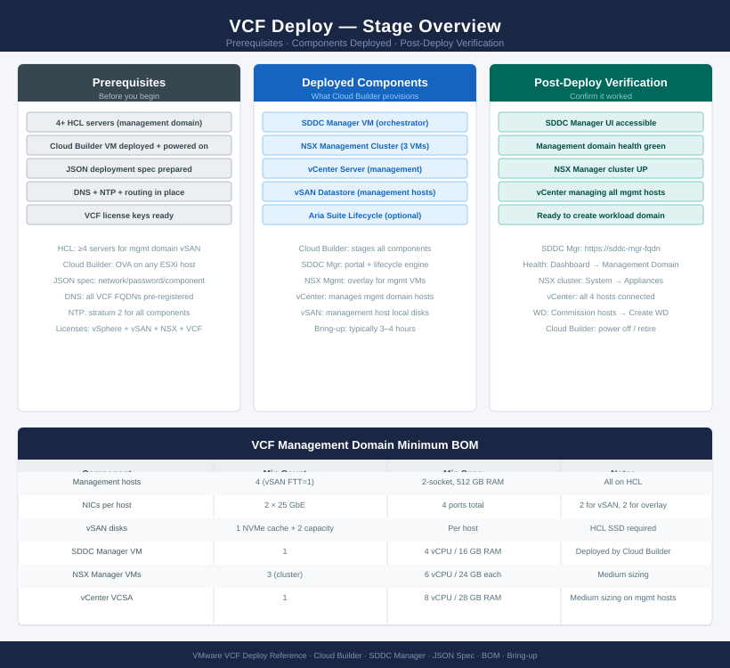
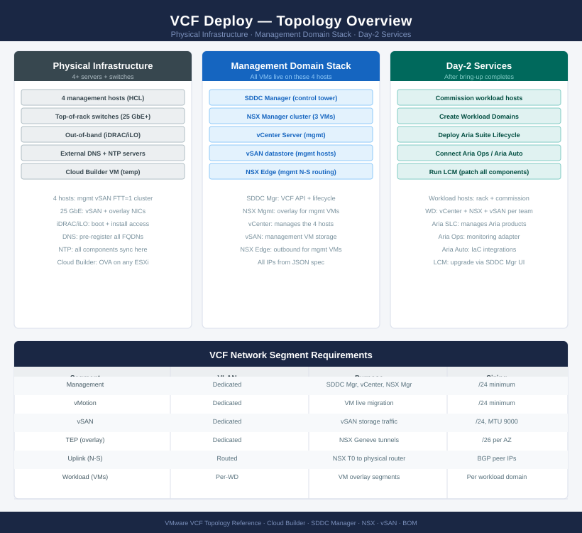

---
tags:
  - deployment
  - vcf
  - vmware
search:
  boost: 1.5
description: "End-to-end deployment guide for VMware Cloud Foundation (VCF) bringup. Covers hardware validation, Cloud Builder OVA deployment, bringup JSON spec..."
---
# VMware Cloud Foundation — Deploy

<div class="kb-summary">
End-to-end deployment guide for VMware Cloud Foundation (VCF) bringup. Covers hardware validation, Cloud Builder OVA deployment, bringup JSON spec preparation, management domain deployment, SDDC Manager commissioning, and first workload domain creation.

*Applies to: VCF 4.x / 5.x*
</div>





---

```d2
direction: right

plan: "Plan" {shape: oval}
phase_1_predeployment_checks: "Phase 1 — Pre-Deployment Checks" {shape: rectangle}
phase_2_cloud_builder_deployment: "Phase 2 — Cloud Builder Deployment" {shape: rectangle}
phase_3_management_domain_bringup: "Phase 3 — Management Domain Bringup" {shape: rectangle}
phase_4_sddc_manager_initial_configu: "Phase 4 — SDDC Manager Initial Configuration" {shape: rectangle}
phase_5_workload_domain_creation: "Phase 5 — Workload Domain Creation" {shape: rectangle}
phase_6_endtoend_validation: "Phase 6 — End-to-End Validation" {shape: rectangle}
validate: "Validate" {shape: oval}

plan -> phase_1_predeployment_checks
phase_1_predeployment_checks -> phase_2_cloud_builder_deployment
phase_2_cloud_builder_deployment -> phase_3_management_domain_bringup
phase_3_management_domain_bringup -> phase_4_sddc_manager_initial_configu
phase_4_sddc_manager_initial_configu -> phase_5_workload_domain_creation
phase_5_workload_domain_creation -> phase_6_endtoend_validation
phase_6_endtoend_validation -> validate
```

## Before you begin

<!-- video-link -->
!!! tip "Video Walkthrough"
    [:fontawesome-brands-youtube: VMware VCF 9 Lab Deployment — VCF Installer Walkthrough](https://www.youtube.com/watch?v=aP6AxsoNctw){ .md-button }
<!-- /video-link -->


- **Access:** vCenter Administrator role and SSH access to VCSA/ESXi hosts
- **Environment:** DNS, NTP, and network connectivity verified before starting
- **Change management:** change request approved; maintenance window scheduled
- **Rollback:** snapshot or backup taken immediately before deployment begins
- **Time estimate:** 30–90 minutes — do not start if less than 2 hours are available

---

## Phase 1 — Pre-Deployment Checks

**Exit criterion:** All hosts HCL-verified, DNS entries created, VLANs configured on switches, and ESXi installed with management connectivity confirmed.

### Hardware Validation (VCF HCL)

All servers must appear on the [VCF Compatibility Guide](https://www.vmware.com/resources/compatibility/vcf). Check:

| Component | Requirement |
|---|---|
| Server model | Listed on VCF HCL for target VCF version |
| NIC model and firmware | HCL-listed; 25 GbE minimum for vSAN |
| SSD/NVMe drives | HCL-listed; separate cache and capacity tiers for vSAN OSA |
| BIOS version | Must meet VCF minimum (check HCL entry) |
| RAM | ≥512 GB per host recommended for management domain |

Minimum host count: **4 hosts** for management domain. Additional hosts for workload domains.

### DNS Pre-Creation

All FQDNs must exist in DNS before bringup starts. Cloud Builder validates DNS and aborts on failure.

| Component | Example FQDN |
|---|---|
| Cloud Builder | cloud-builder.example.local |
| SDDC Manager | sddc-manager.example.local |
| vCenter (mgmt) | vcenter-mgmt.example.local |
| NSX Manager node 1 | nsx-mgr-01.example.local |
| NSX Manager node 2 | nsx-mgr-02.example.local |
| NSX Manager node 3 | nsx-mgr-03.example.local |
| NSX VIP | nsx-vip.example.local |
| ESXi host 1–4 | esxi-mgmt-01–04.example.local |

```bash
# Verify all DNS entries resolve from the management network
for fqdn in sddc-manager.example.local vcenter-mgmt.example.local nsx-mgr-01.example.local esxi-mgmt-01.example.local; do
  echo -n "$fqdn: "; nslookup $fqdn | grep -E "Address" | tail -1
done
```


```text title="Expected output"
sddc-manager.example.local: Address: 192.168.1.10
vcenter-mgmt.example.local: Address: 192.168.1.20
nsx-mgr-01.example.local: Address: 192.168.1.30
esxi-mgmt-01.example.local: Address: 192.168.1.40
```

!!! warning "Common errors"
    **`** server can't find sddc-manager.example.local: NXDOMAIN`** — Verify the DNS server is reachable and the FQDN exists in your DNS zone; check `/etc/resolv.conf` points to the correct nameserver.
    **`nslookup: command not found`** — Install `bind-utils` (RHEL/CentOS) or `dnsutils` (Debian/Ubuntu) package on the management host.
    **`** server can't find nsx-mgr-01.example.local: SERVFAIL`** — Confirm the DNS server is responding and the management network has connectivity to the DNS resolver on port 53.
### VLAN Configuration on ToR Switches

| VLAN | Purpose | MTU |
|---|---|---|
| VLAN 10 | Management | 1500 |
| VLAN 20 | vMotion | 9000 |
| VLAN 30 | vSAN | 9000 |
| VLAN 40 | NSX TEP (Geneve encap) | 9000 |

Verify trunk VLANs on all switch ports connected to ESXi hosts before Cloud Builder deployment.

### ESXi Pre-Install on Management Hosts

```bash
# On each management host: install ESXi, set management IP, FQDN, DNS, NTP
# Then verify SSH access
ssh root@esxi-mgmt-01.example.local "esxcli system hostname get"
ssh root@esxi-mgmt-02.example.local "esxcli system hostname get"
ssh root@esxi-mgmt-03.example.local "esxcli system hostname get"
ssh root@esxi-mgmt-04.example.local "esxcli system hostname get"
# All must return correct FQDNs
```


```text title="Expected output"
Domain Name: example.local
   Host Name: esxi-mgmt-01
   FQDN: esxi-mgmt-01.example.local
   Domain Name: example.local
   Host Name: esxi-mgmt-02
   FQDN: esxi-mgmt-02.example.local
   Domain Name: example.local
   Host Name: esxi-mgmt-03
   FQDN: esxi-mgmt-03.example.local
   Domain Name: example.local
   Host Name: esxi-mgmt-04
   FQDN: esxi-mgmt-04.example.local
```

!!! warning "Common errors"
    **`ssh: Could not resolve hostname esxi-mgmt-01.example.local: Name or service not known`** — Verify DNS is configured on the deployment host and resolves ESXi hostnames, or use IP addresses directly instead of FQDNs.
    **`Permission denied (publickey,password).`** — Ensure SSH is enabled on ESXi hosts and root credentials are correct; verify the SSH key is in place or use password authentication with `-o PubkeyAuthentication=no`.
    **`Connection refused`** — Confirm ESXi hosts are fully booted and SSH service is running; check firewall rules allow port 22 from the deployment host.
---

## Phase 2 — Cloud Builder Deployment

**Exit criterion:** Cloud Builder OVA deployed and accessible; bringup JSON spec uploaded and validation reports no errors.

### Deploy Cloud Builder OVA

```text
vSphere Client (or ESXi host UI) → Deploy OVF Template
  Source: VMware-Cloud-Builder-<version>.ova

  Step 1: VM name: cloud-builder
  Step 2: Compute resource: management ESXi host
  Step 3: Storage: management datastore (20 GB thin sufficient)
  Step 4: Network: Management portgroup
  Step 5: Customize:
    IP: 10.10.10.10 (planned Cloud Builder IP)
    Netmask: 255.255.255.0
    Gateway: 10.10.10.1
    DNS: 10.10.10.53
    NTP: ntp.example.local
    Admin password: <strong password>
    Root password: <strong password>
  → Deploy
```

### Prepare Bringup JSON Spec

The VCF deployment parameter workbook (Excel) generates the JSON spec. Key sections:

```json
{
  "sddcManagerSpec": {
    "hostname": "sddc-manager",
    "ipAddress": "10.10.10.20",
    "netmask": "255.255.255.0",
    "gateway": "10.10.10.1",
    "domain": "example.local",
    "adminPassword": "<password>",
    "localPassword": "<password>"
  },
  "vcenterSpec": {
    "vcenterIp": "10.10.10.21",
    "vcenterHostname": "vcenter-mgmt",
    "licenseFile": "<vCenter-licence-key>"
  },
  "nsxTSpec": {
    "nsxManagerSpecs": [
      {"hostname": "nsx-mgr-01", "ip": "10.10.10.31"},
      {"hostname": "nsx-mgr-02", "ip": "10.10.10.32"},
      {"hostname": "nsx-mgr-03", "ip": "10.10.10.33"}
    ],
    "vip": "10.10.10.30",
    "vipFqdn": "nsx-vip"
  }
}
```

### Run Prerequisite Validation

```text
Cloud Builder UI: https://cloud-builder.example.local
  Login: admin / <password>
  → Deploy vSphere + SDDC Manager
  → Upload bringup JSON spec (or paste JSON directly)
  → Run validation

  Validation checks:
    ✓ DNS resolution for all FQDNs
    ✓ NTP connectivity from all hosts
    ✓ VLAN reachability (ping tests across VLANs)
    ✓ Password complexity
    ✓ ESXi host connectivity (SSH, NTP sync)
    ✓ vSAN disk eligibility
```

```bash
# Resolve all WARN items before proceeding
# ERROR items block bringup; WARN items may proceed but investigate each
# Common issues: DNS PTR missing, NTP unreachable, ESXi NTP not synced
```

---

## Phase 3 — Management Domain Bringup

**Exit criterion:** Bringup completes; SDDC Manager UI accessible and management domain shows Operational.

### Start Bringup

```text
Cloud Builder UI → Validate → Proceed to Deploy → Confirm

  Bringup sequence (automated, 2–4 hours):
    ① Configure ESXi hosts: networking, NTP, DNS
    ② Deploy vCenter VCSA
    ③ Create management cluster in vCenter
    ④ Configure vSAN disk groups on management hosts
    ⑤ Deploy NSX Manager 3-node cluster
    ⑥ Configure NSX: T0/T1 gateways, TEP IPs, edge transport nodes
    ⑦ Deploy SDDC Manager appliance
    ⑧ Register all components with SDDC Manager
```

### Monitor Bringup Progress

```text
Cloud Builder UI → Deployment Status

  Progress bar shows current step
  Click each step for detailed logs
  Full log: Cloud Builder VM → /var/log/vcf/bringup/
```

```bash
# SSH to Cloud Builder if UI is unresponsive
ssh admin@cloud-builder.example.local
tail -f /var/log/vcf/bringup/vcf-bringup.log
```


```text title="Expected output"
The authenticity of host 'cloud-builder.example.local (192.168.1.45)' can't be established.
ECDSA key fingerprint is SHA256:aBcD1234EfGhIjKlMnOpQrStUvWxYz5678+9/0AbCd.
Are you sure you want to continue connecting (yes/no)? yes
Warning: Permanently added 'cloud-builder.example.local,192.168.1.45' (ECDSA) to the list of known_hosts.
admin@cloud-builder.example.local's password:
Last login: Wed Mar 13 14:22:18 2024 from 192.168.1.10
2024-03-13T14:35:42.123Z [INFO] VCF Bringup: Starting deployment phase 2 of 5
2024-03-13T14:35:58.456Z [INFO] Configuring management domain networking
2024-03-13T14:36:15.789Z [INFO] Deploying vCenter Server appliance
2024-03-13T14:36:42.012Z [DEBUG] vCenter OVA deployment progress: 45%
2024-03-13T14:37:08.345Z [INFO] Configuring vSAN cluster
2024-03-13T14:37:35.678Z [INFO] Applying security hardening policies
```

!!! warning "Common errors"
    **`ssh: Could not resolve hostname cloud-builder.example.local: Name or service not known`** — Verify DNS resolution or update /etc/hosts with the Cloud Builder IP address.
    **`Permission denied (publickey,password).`** — Confirm the admin account credentials and that SSH key-based authentication is configured if required by your environment.
### Verify Bringup Complete

```bash
# Access SDDC Manager after bringup
# https://sddc-manager.example.local
# Login: admin@local / <password from JSON spec>

# Check management domain status
curl -sk -u 'admin@local:<password>' \
  https://sddc-manager.example.local/v1/domains \
  | python3 -m json.tool | grep -E '"name"|"status"'
# Expected: "MANAGEMENT" domain status "ACTIVE"
```


```text title="Expected output"
{
  "name": "MANAGEMENT",
  "status": "ACTIVE"
}
{
  "name": "WORKLOAD-01",
  "status": "ACTIVE"
}
{
  "name": "WORKLOAD-02",
  "status": "ACTIVE"
}
```

!!! warning "Common errors"
    **`curl: (60) SSL certificate problem: self signed certificate`** — Add `-k` flag to the curl command to skip SSL verification (already present in the example, so verify the flag is not accidentally removed).
    **`curl: (7) Failed to connect to sddc-manager.example.local port 443: Name or service not known`** — Replace `sddc-manager.example.local` with the actual FQDN or IP address of your SDDC Manager instance and ensure network connectivity.
    **`jq: parse error: Invalid JSON text at line 1`** — Verify the credentials are correct and the SDDC Manager API is responding; check that the response is valid JSON by running the curl command without the pipe to `python3 -m json.tool`.
---

## Phase 4 — SDDC Manager Initial Configuration

**Exit criterion:** All default passwords rotated, licences entered, backup configured, certificates staged.

### Rotate Default Passwords

```bash
# SDDC Manager → Security → Password Management
# Rotate passwords for: vCenter SSO, NSX admin, ESXi root, SDDC Manager admin

# Via API: rotate all ESXi root passwords
curl -sk -X POST -u 'admin@local:<password>' \
  -H "Content-Type: application/json" \
  -d '{"credentialType":"SSH","resourceType":"ESXI"}' \
  https://sddc-manager.example.local/v1/credentials/rotate

# Monitor rotation task status
curl -sk -u 'admin@local:<password>' \
  https://sddc-manager.example.local/v1/tasks \
  | python3 -m json.tool | grep -E '"type"|"status"' | head -20
```


```text title="Expected output"
{
  "id": "task-a7f2c9e1-4b6d-11ed-9c3a-005056a1b3f4",
  "type": "CREDENTIAL_ROTATION",
  "status": "RUNNING",
  "creationTimestamp": "2024-01-15T09:42:33.521Z",
  "updateTimestamp": "2024-01-15T09:43:12.891Z"
}
"type": "CREDENTIAL_ROTATION"
"status": "RUNNING"
"type": "CREDENTIAL_ROTATION"
"status": "COMPLETED"
"type": "BACKUP_TASK"
"status": "COMPLETED"
"type": "REMEDIATION"
"status": "RUNNING"
"type": "REMEDIATION"
"status": "COMPLETED"
```

!!! warning "Common errors"
    **`curl: (60) SSL certificate problem: self signed certificate`** — Add `-k` flag (already present) or import the SDDC Manager CA certificate into your system trust store.
    **`{"error":"Invalid credentials","status":401}`** — Verify the SDDC Manager admin password is correct and the account is not locked; check `/var/log/vmware/vcf/sddc-manager/sddc-manager.log` for authentication failures.
    **`jq: command not found`** — Install `jq` package (`apt-get install jq` or `yum install jq`) or use `python3 -m json.tool` as shown in the example.
### Enter Licences

```text
SDDC Manager → Administration → Licensing
  → Add licence keys:
    vSphere (per host)
    vSAN (per host)
    NSX (per core or CPU)
    VCF (per core — if applicable)
```

### Configure SDDC Manager Backup

```text
SDDC Manager → Administration → Backup and Restore
  Protocol: SCP
  Server: backup.example.local
  Port: 22
  Directory: /vcf-backups
  Username: vcf-backup
  Passphrase: <encryption passphrase — store securely>
  Schedule: Daily at 03:00
  → Save
```

### Verify Certificate Status

```bash
# Check all component cert expiry
curl -sk -u 'admin@local:<password>' \
  https://sddc-manager.example.local/v1/certificates \
  | python3 -m json.tool | grep -E "expirationDate|resourceFqdn"

# If CA-signed certs required:
# SDDC Manager → Security → Certificate Management
# → Generate CSR per component → sign with enterprise CA → import signed cert
```


```text title="Expected output"
{
    "expirationDate": "2025-03-15T14:32:00.000Z",
    "resourceFqdn": "sddc-manager.example.local"
},
{
    "expirationDate": "2025-04-22T09:18:00.000Z",
    "resourceFqdn": "vcenter.example.local"
},
{
    "expirationDate": "2025-02-28T16:45:00.000Z",
    "resourceFqdn": "nsx-manager.example.local"
},
{
    "expirationDate": "2025-05-10T11:22:00.000Z",
    "resourceFqdn": "esxi-01.example.local"
},
{
    "expirationDate": "2025-01-20T08:00:00.000Z",
    "resourceFqdn": "wsa.example.local"
}
```

!!! warning "Common errors"
    **`curl: (60) SSL certificate problem: self signed certificate`** — Add `-k` flag to skip SSL verification, or import the SDDC Manager's CA certificate into your system trust store.
    **`jq: command not found`** — Install `python3-json-tool` or use `python3 -m json.tool` instead of piping to `jq`.
    **`401 Unauthorized`** — Verify the admin@local password is correct and the account has not been locked after failed login attempts.
---

## Phase 5 — Workload Domain Creation

**Exit criterion:** First VI workload domain in ACTIVE state in SDDC Manager; dedicated vCenter and NSX deployed.

### Commission Workload Hosts

```bash
# Verify hosts are discoverable from SDDC Manager
# Each host must have: ESXi installed, management IP, FQDN, NTP, DNS set

# SDDC Manager → Inventory → Hosts → Commission
# Provide: ESXi host FQDN, root credentials
# SDDC Manager validates: HCL match, DNS, NTP, SSH connectivity
# Host enters "Unassigned" state when commissioned
```

### Create Network Pool

```text
SDDC Manager → Network Settings → Network Pools → Create
  Name: workload-pool-01
  vMotion VLAN: VLAN 120, subnet 192.168.120.0/24, range .10–.50
  vSAN VLAN:    VLAN 130, subnet 192.168.130.0/24, range .10–.50
  NSX TEP VLAN: VLAN 140, subnet 192.168.140.0/24, range .10–.50
```

### Create Workload Domain

```text
SDDC Manager → Workload Domains → Add Domain

  Step 1: Domain type: VI (vSphere Infrastructure)
  Step 2: Cluster details:
    Domain name: workload-01
    vCenter hostname: vcenter-wld01.example.local
    vCenter IP: 10.10.10.40
  Step 3: Select hosts: choose commissioned hosts from free pool (≥3)
  Step 4: vSAN: enable, select capacity disks
  Step 5: Network pool: workload-pool-01
  Step 6: Review → Create

  Wizard deploys: dedicated vCenter + vSAN cluster + NSX segments
  Duration: ~45 minutes
```

```bash
# Monitor workload domain creation
curl -sk -u 'admin@local:<password>' \
  https://sddc-manager.example.local/v1/domains \
  | python3 -m json.tool | grep -E '"name"|"status"'
```


```text title="Expected output"
"name": "management",
"status": "RUNNING"
"name": "workload-domain-01",
"status": "CREATING"
"name": "workload-domain-02",
"status": "RUNNING"
```

!!! warning "Common errors"
    **`curl: (60) SSL certificate problem: self signed certificate`** — Add the `-k` flag to skip SSL verification, or import the SDDC Manager certificate into your system's CA bundle.
    **`curl: (7) Failed to connect to sddc-manager.example.local port 443: Name or service not known`** — Verify the SDDC Manager hostname is correct and resolvable from your network (use `nslookup sddc-manager.example.local` to test).
---

## Phase 6 — End-to-End Validation

**Exit criterion:** All health checks pass. Management and workload domains operational. Hand off to operations.

### Run SOS Health Tool

```bash
# SSH to SDDC Manager
ssh vcf@sddc-manager.example.local

# Run full health check
sudo /opt/vmware/sddc-support/sos --health-check
# All checks should return PASS
# WARN items: document and create follow-up tickets
```


```text title="Expected output"
vcf@sddc-manager.example.local's password: 
Welcome to SDDC Manager v5.4.1 (Build 21567890)
Last login: Wed Jan 15 14:32:18 2025 from 192.168.1.45

vcf@sddc-manager:~$ sudo /opt/vmware/sddc-support/sos --health-check
[sudo] password for vcf: 
Starting comprehensive health check on SDDC Manager...
Timestamp: 2025-01-15T14:33:22Z

✓ PASS: vCenter connectivity (vc.example.local)
✓ PASS: NSX Manager cluster (3/3 nodes healthy)
✓ PASS: ESXi host connectivity (24/24 reachable)
⚠ WARN: Certificate expiration in 45 days (vc.example.local)
✓ PASS: Datastore accessibility (8/8 datastores online)
✓ PASS: Network configuration (all VLANs routable)
✓ PASS: Storage replication lag (< 100ms)

Health check completed: 7 PASS, 1 WARN, 0 FAIL
Execution time: 2m 34s
```

!!! warning "Common errors"
    **`sudo: /opt/vmware/sddc-support/sos: command not found`** — Verify the SDDC Manager version and confirm the support tools package is installed with `rpm -qa | grep sddc-support`.
    **`Permission denied (publickey,password)`** — Ensure the vcf user account exists and SSH key-based or password authentication is enabled in `/etc/ssh/sshd_config`.
    **`FAIL: vCenter connectivity`** — Check network connectivity to vCenter and verify DNS resolution with `nslookup vc.example.local` from the SDDC Manager appliance.
### Verify Management Domain Components

```bash
# Check all component status via SDDC Manager API
curl -sk -u 'admin@local:<password>' \
  https://sddc-manager.example.local/v1/system/inventory/components \
  | python3 -m json.tool | grep -E '"componentType"|"status"'
# Expected: all components ACTIVE

# Verify NSX Manager cluster health
curl -sk -u 'admin@local:<password>' \
  https://sddc-manager.example.local/v1/nsxt-clusters \
  | python3 -m json.tool | grep -E '"status"|"version"'
```


```text title="Expected output"
"componentType": "SDDC_MANAGER",
"status": "ACTIVE",
"componentType": "VCENTER",
"status": "ACTIVE",
"componentType": "NSX_MANAGER",
"status": "ACTIVE",
"componentType": "ESXI_MGMT",
"status": "ACTIVE",
"componentType": "VSAN",
"status": "ACTIVE",
"status": "HEALTHY",
"version": "3.2.1.1",
"status": "HEALTHY",
"version": "3.2.1.1",
"status": "HEALTHY",
"version": "3.2.1.1",
```

!!! warning "Common errors"
    **`curl: (60) SSL certificate problem: self signed certificate`** — Add `-k` flag to skip certificate verification (already present; verify the hostname matches the certificate CN).
    **`jq: command not found`** — Install `python3-json-tool` or use `python3 -m json.tool` instead (the example already uses the latter).
    **`401 Unauthorized`** — Verify the admin password is correct and the account has not been locked after failed login attempts.
### Verify LCM Bundle Access

```bash
# Confirm SDDC Manager can reach VMware depot
curl -sk -o /dev/null -w "%{http_code}" https://depot.vmware.com
# Expected: 200

# Trigger bundle check
# SDDC Manager → Lifecycle Management → Bundle Management → Check Bundles
```


```text title="Expected output"
200
```

!!! warning "Common errors"
    **`curl: (7) Failed to connect to depot.vmware.com port 443: Connection timed out`** — Verify network connectivity and firewall rules allow outbound HTTPS to depot.vmware.com from the SDDC Manager appliance.
    **`curl: (60) SSL certificate problem: self signed certificate in certificate chain`** — Add the `-k` flag to skip certificate verification, or import the corporate proxy/firewall certificate into the SDDC Manager trust store.
    **`000`** — Check that SDDC Manager has internet access and DNS can resolve depot.vmware.com; if behind a proxy, configure proxy settings in SDDC Manager networking configuration.
### Post-Deployment Checklist

| Item | Check |
|---|---|
| Management domain | Status ACTIVE in SDDC Manager |
| Workload domain | Status ACTIVE in SDDC Manager |
| SDDC Manager health | SOS health-check all PASS |
| Licences | All components licenced; no warnings |
| Default passwords | All rotated via SDDC Manager |
| SDDC Manager backup | First backup completed and verified |
| Certificates | No certs expiring within 30 days |
| DNS | All FQDNs resolve forward and reverse |
| NTP | All hosts and appliances time-synced < 5 s drift |
| vSAN health | No degraded or inaccessible objects |
| NSX TEP | Geneve tunnel health all green in NSX UI |
| LCM depot | SDDC Manager can reach depot.vmware.com |
| Syslog | SDDC Manager and components forwarding to syslog |

---

## See also

- [VMware Cloud Foundation — How It Works](../architecture/how-it-works/)
- [VCF — Health Checks](../operations/health-checks/)
- [VCF Troubleshooting — Common Issues](../troubleshooting/common-issues/)

## Verify

- **vSphere Client:** confirm the component is visible and shows a healthy status
- **Alarms:** Home → Alarms — no new critical alarms after deployment
- **Logs:** review vmware.log / recent events for any errors in the first 5 minutes
