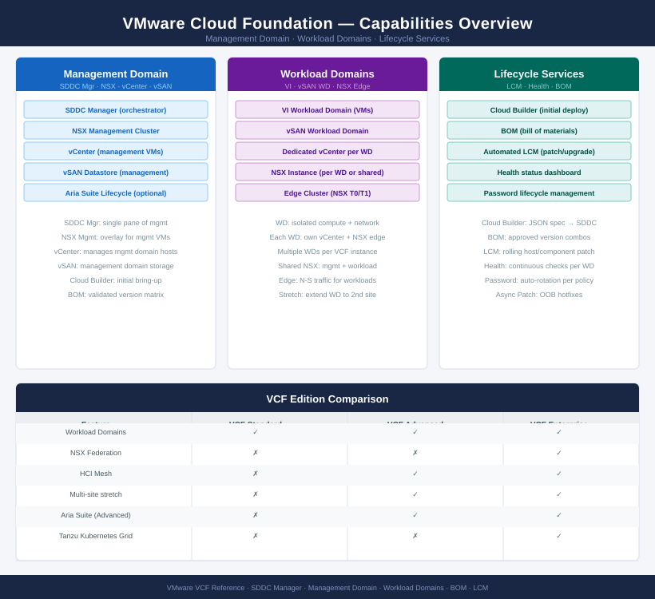
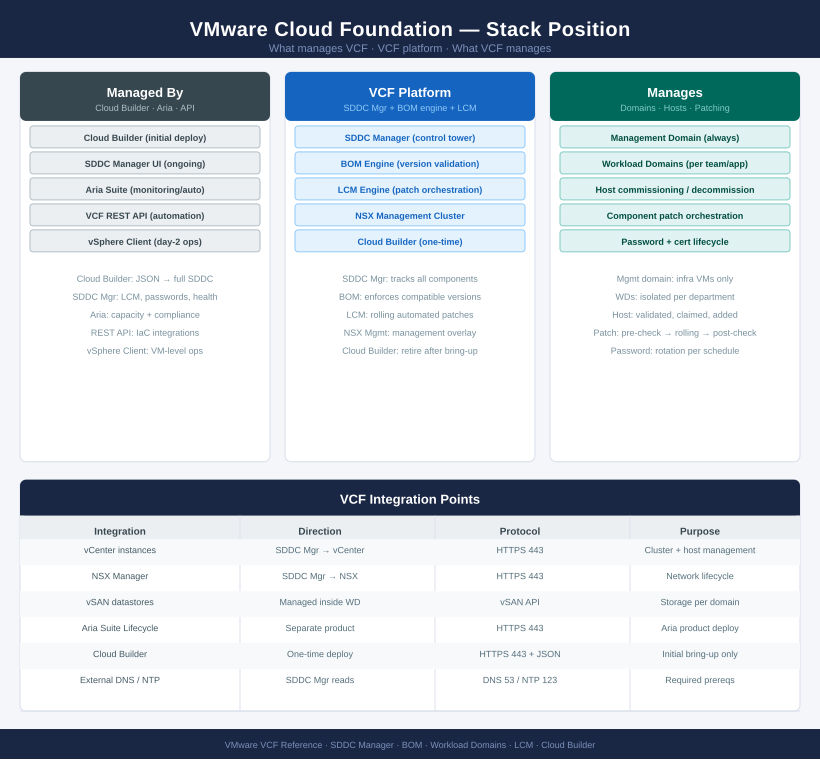

---
tags:
  - vcf
  - vmware
description: "Technical and operational reference for VMware Cloud Foundation (VCF). Covers SDDC Manager, workload domains, lifecycle management, vSphere, vSAN, and NSX..."
---
# VMware Cloud Foundation

<div class="kb-summary">
Technical and operational reference for VMware Cloud Foundation (VCF). Covers SDDC Manager, workload domains, lifecycle management, vSphere, vSAN, and NSX integration across the full-stack private cloud platform.

*Applies to: VCF 4.x · 5.x*
</div>





```text
┌──────────────────────── VMware Cloud Foundation (VCF) — Installation Sequence ────────────────────────┐
│                                                                                                       │
│  Step 1 · Pre-Deploy Checks                                                                           │
│  ─────────────────────────────────────────────────────────────────────────────────────────            │
│  Minimum 4 ESXi hosts for management domain  ·  Each meets VCF HCL requirements                       │
│  DNS: all host FQDNs, vCenter FQDN, NSX FQDN, SDDC Manager FQDN pre-created                           │
│  NTP: all hosts synced to same source before Cloud Builder starts                                     │
│  Network: management, vSAN, vMotion, NSX TEP VLANs configured on ToR switches                         │
│  VCF deployment JSON (EMS file) prepared: IPs, VLANs, credentials for all components                  │
│                                                                                                       │
│                                        │  deploy Cloud Builder VM                                     │
│                                        ▼                                                              │
│  Step 2 · Cloud Builder Deployment                                                                    │
│  ─────────────────────────────────────────────────────────────────────────────────────────            │
│  Download Cloud Builder OVA from VMware portal  ·  Deploy on any ESXi host                            │
│  Set management IP, gateway, DNS, NTP  ·  Admin password                                              │
│  Access Cloud Builder UI  ·  Import deployment JSON (EMS/bringup spec)                                │
│  Cloud Builder validates JSON: DNS, NTP, network, and hardware prerequisites                          │
│  Resolve all validation warnings/errors before proceeding to bringup                                  │
│                                                                                                       │
│                                        │  run management domain bringup                               │
│                                        ▼                                                              │
│  Step 3 · Management Domain Bringup                                                                   │
│  ─────────────────────────────────────────────────────────────────────────────────────────            │
│  Cloud Builder orchestrates full management domain deployment automatically:                          │
│    ① Configure ESXi hosts (networking, NTP, DNS)  → ② Deploy vCenter VCSA                             │
│    ③ Create management cluster  → ④ Configure vSAN on management hosts                                │
│    ⑤ Deploy NSX Manager 3-node cluster  → ⑥ Deploy SDDC Manager                                       │
│  Bringup takes 2–4 hours  ·  Monitor progress in Cloud Builder UI                                     │
│                                                                                                       │
│                                        │  validate SDDC Manager                                       │
│                                        ▼                                                              │
│  Step 4 · SDDC Manager Validation                                                                     │
│  ─────────────────────────────────────────────────────────────────────────────────────────            │
│  Login to SDDC Manager  ·  Review management domain health dashboard                                  │
│  Credentials vault: update all default passwords via SDDC Manager password rotation                   │
│  Licences: enter vSphere, vSAN, NSX, and VCF licences in SDDC Manager                                 │
│  Configure backup: SDDC Manager backup to external SCP/SFTP target                                    │
│  Certificates: replace SDDC Manager and management component certs with CA-signed                     │
│                                                                                                       │
│                                        │  commission hosts and create workload domain                 │
│                                        ▼                                                              │
│  Step 5 · Workload Domain Creation                                                                    │
│  ─────────────────────────────────────────────────────────────────────────────────────────            │
│  Commission additional ESXi hosts: SDDC Manager → Hosts → Commission                                  │
│  Cloud Builder validates commissioned hosts against HCL and configuration                             │
│  Create Workload Domain: SDDC Manager → Workload Domains → Add Domain                                 │
│  Wizard deploys dedicated vCenter, vSAN, NSX segments for workload domain                             │
│  Workload domain available in SDDC Manager  ·  Assign to project/team                                 │
│                                                                                                       │
│                                        │  lifecycle management and day-2                              │
│                                        ▼                                                              │
│  Step 6 · Lifecycle Management & Day-2                                                                │
│  ─────────────────────────────────────────────────────────────────────────────────────────            │
│  LCM bundles: SDDC Manager downloads patch bundles from depot (online or air-gap)                     │
│  Upgrade sequencing: NSX → vCenter → ESXi hosts per SDDC Manager guidance                             │
│  Aria Suite: deploy Operations, Automation, Logs via LCM for full SDDC observability                  │
│  Capacity expansion: commission additional hosts  ·  Add to existing domain                           │
│  DR: configure SRM + vSphere Replication across VCF management domains                                │
│                                                                                                       │
└───────────────────────────────────────────────────────────────────────────────────────────────────────┘
```


<div class="kb-grid kb-grid-3">

<a class="kb-card" href="architecture/">
  <strong>Architecture</strong>
  <span>How it works, integrations, and design standards.</span>
</a>

<a class="kb-card" href="deploy/">
  <strong>Deploy</strong>
  <span>Cloud Builder OVA bringup, management domain deployment, SDDC Manager setup, and workload domain creation.</span>
</a>

<a class="kb-card" href="operations/">
  <strong>Operations</strong>
  <span>CLI reference, health checks, procedures, lifecycle, backup, and scripts.</span>
</a>

<a class="kb-card" href="security/">
  <strong>Security</strong>
  <span>Authentication, access control, encryption, and hardening.</span>
</a>

<a class="kb-card" href="troubleshooting/">
  <strong>Troubleshooting</strong>
  <span>Common issues, diagnostics, and escalation.</span>
</a>

</div>
