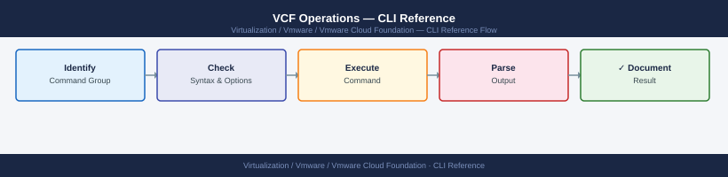

---
tags:
  - operations
  - vcf
  - vmware
---
# VCF Operations — CLI Reference

<div class="kb-summary">
CLI Reference reference covering Support Bundles, SDDC Manager REST API, Password Management, Service Status & Logs.

*Applies to: VCF 4.x / 5.x*
</div>


VCF CLI Tool Map — Where to Run What

---

## Before you begin

- **Access:** vCenter read-only minimum; Administrator role for remediation steps
- **Timing:** safe to run during business hours unless a step is marked ⚠ (causes interruption)
- **Dependencies:** no active upgrades or migrations on the same infrastructure
- **Logging:** capture command output — paste into the change record on completion

---

## SDDC Manager REST API

The SDDC Manager API runs at `https://<sddc-mgr>/v1`. Authenticate with the `vcf` admin account.

```bash
# Authenticate and get token
curl -k -X POST https://<sddc-mgr>/v1/tokens \
  -H "Content-Type: application/json" \
  -d '{"username":"administrator@vsphere.local","password":"<pass>"}'

# List all domains
curl -k -X GET https://<sddc-mgr>/v1/domains \
  -H "Authorization: Bearer <token>"

# List all clusters
curl -k -X GET https://<sddc-mgr>/v1/clusters \
  -H "Authorization: Bearer <token>"

# List managed credentials
curl -k -X GET https://<sddc-mgr>/v1/credentials \
  -H "Authorization: Bearer <token>"

# List hosts
curl -k -X GET https://<sddc-mgr>/v1/hosts \
  -H "Authorization: Bearer <token>"

# List workload domains
curl -k -X GET https://<sddc-mgr>/v1/domains \
  -H "Authorization: Bearer <token>"
```


```text title="Expected output"
{"accessToken":"eyJhbGciOiJIUzI1NiIsInR5cCI6IkpXVCJ9.eyJzdWIiOiJhZG1pbmlzdHJhdG9yQHZzcGhlcmUubG9jYWwiLCJleHAiOjE3MDk4MzIwMDB9.abc123xyz","tokenType":"Bearer","expiresIn":3600}

{"domains":[{"id":"domain-1","name":"MGMT","type":"MANAGEMENT"},{"id":"domain-2","name":"WLD-01","type":"WORKLOAD"},{"id":"domain-3","name":"WLD-02","type":"WORKLOAD"}]}

{"clusters":[{"id":"cluster-1","name":"mgmt-cluster-01","domainId":"domain-1","status":"HEALTHY"},{"id":"cluster-2","name":"wld-cluster-01","domainId":"domain-2","status":"HEALTHY"},{"id":"cluster-3","name":"wld-cluster-02","domainId":"domain-3","status":"HEALTHY"}]}

{"credentials":[{"id":"cred-001","username":"root","credentialType":"SSH"},{"id":"cred-002","username":"administrator@vsphere.local","credentialType":"VCENTER"},{"id":"cred-003","username":"nsxadmin","credentialType":"NSX"}]}

{"hosts":[{"id":"host-1","fqdn":"esx-01.lab.local","ipAddress":"192.168.1.10","status":"ONLINE"},{"id":"host-2","fqdn":"esx-02.lab.local","ipAddress":"192.168.1.11","status":"ONLINE"},{"id":"host-3","fqdn":"esx-03.lab.local","ipAddress":"192.168.1.12","status":"ONLINE"},{"id":"host-4","fqdn":"esx-04.lab.local","ipAddress":"192.168.1.13","status":"ONLINE"}]}

{"domains":[{"id":"domain-1","name":"MGMT","type":"MANAGEMENT"},{"id":"domain-2","name":"WLD-01","type":"WORKLOAD"},{"id":"domain-3","name":"WLD-02","type":"WORKLOAD"}]}
```

!!! warning "Common errors"
    **`curl: (60) SSL certificate problem: self signed certificate`** — Add `-k` flag to curl command to skip SSL verification, or import the SDDC Manager certificate into your system's CA store.
    **`{"error":"Invalid token","statusCode":401}`** — Ensure the Bearer token is valid and not expired; re-authenticate with the POST /v1/tokens endpoint and use the new accessToken in the Authorization header.
    **`curl: (7) Failed to connect to <sddc-mgr> port 443: Connection refused`** — Verify the SDDC Manager hostname/IP is correct, reachable on the network, and the API service is running with `systemctl status vcf-api`.
---

## Password Management

```bash
# List all managed credentials via API
curl -k -X GET https://<sddc-mgr>/v1/credentials \
  -H "Authorization: Bearer <token>"

# Rotate a credential
curl -k -X PATCH https://<sddc-mgr>/v1/credentials \
  -H "Authorization: Bearer <token>" \
  -H "Content-Type: application/json" \
  -d '{"operationType":"ROTATE","elements":[{"resourceName":"<name>","resourceType":"<type>","credentials":[{"credentialType":"<type>","username":"<user>"}]}]}'
```


```text title="Expected output"
{
  "elements": [
    {
      "resourceName": "vcenter.sddc.local",
      "resourceType": "VCENTER",
      "credentials": [
        {
          "credentialType": "API_TOKEN",
          "username": "administrator@vsphere.local",
          "lastRotatedTime": "2024-01-15T09:42:33.521Z"
        }
      ]
    },
    {
      "resourceName": "esxi-01.sddc.local",
      "resourceType": "ESXI",
      "credentials": [
        {
          "credentialType": "PASSWORD",
          "username": "root",
          "lastRotatedTime": "2024-01-10T14:22:18.103Z"
        }
      ]
    },
    {
      "resourceName": "nsx-manager.sddc.local",
      "resourceType": "NSX",
      "credentials": [
        {
          "credentialType": "API_TOKEN",
          "username": "admin",
          "lastRotatedTime": "2024-01-12T11:05:47.892Z"
        }
      ]
    }
  ]
}

{
  "taskId": "a7f3c9e2-1b4d-47e8-9f2a-6d8c5e1b3a92",
  "status": "SUCCEEDED",
  "resourceName": "vcenter.sddc.local",
  "operationType": "ROTATE",
  "completionTime": "2024-01-15T10:15:22.456Z"
}
```

!!! warning "Common errors"
    **`curl: (60) SSL certificate problem: self signed certificate`** — Add `-k` flag to skip SSL verification, or import the SDDC Manager certificate into your system trust store.
    **`{"error":"Unauthorized","message":"Invalid or expired token"}`** — Regenerate the API token from the SDDC Manager UI and ensure it has not exceeded its expiration time.
    **`{"error":"BadRequest","message":"Invalid resourceType: <type>"}`** — Verify resourceType is one of: VCENTER, ESXI, NSX, VSAN, SDDC_MANAGER, or VROPS before submitting the rotation request.
---

## Service Status & Logs

```bash
# Check SDDC Manager service
systemctl status sddc-manager

# Follow LCM debug log
tail -f /var/log/vmware/vcf/lcm/lcm-debug.log

# Follow SDDC Manager application log
tail -f /var/log/vmware/vcf/sddc-manager/sddc-manager.log

# View recent system events
journalctl -u sddc-manager --since "2 hours ago"
```


```text title="Expected output"
● sddc-manager.service - VMware Cloud Foundation SDDC Manager
     Loaded: loaded (/etc/systemd/system/sddc-manager.service; enabled; vendor preset: enabled)
     Active: active (running) since Wed 2024-01-17 14:32:18 UTC; 3 days ago
   Main PID: 8742 (java)
      Tasks: 247 (limit: 4915)
     Memory: 2.8G
     CGroup: /system.slice/sddc-manager.service
             └─8742 /usr/lib/jvm/java-11-openjdk-11.0.18.0.10-1.el7_9.x86_64/bin/java...

2024-01-17T14:35:42.891Z INFO  [LcmImpl] Lifecycle management operation initiated for cluster sddc-m01cl01
2024-01-17T14:35:43.124Z DEBUG [LcmValidator] Validating bundle version 5.5.1.0-21567890
2024-01-17T14:35:44.556Z INFO  [BundleManager] Bundle download progress: 45%
2024-01-17T14:35:52.203Z DEBUG [PatchOrchestrator] Host esx-01.sddc.local patch sequence queued
2024-01-17T14:36:01.891Z INFO  [LcmImpl] Lifecycle management operation completed successfully

Jan 17 14:32:18 sddc-mgr-01 sddc-manager[8742]: Starting SDDC Manager service...
Jan 17 14:32:45 sddc-mgr-01 sddc-manager[8742]: Connected to vCenter Server vcsa-01.sddc.local
Jan 17 14:33:12 sddc-mgr-01 sddc-manager[8742]: Cluster inventory sync completed: 4 clusters, 24 hosts
Jan 17 14:35:42 sddc-mgr-01 sddc-manager[8742]: LCM operation started by admin@sddc.local
Jan 17 14:36:01 sddc-mgr-01 sddc-manager[8742]: LCM operation completed with status: SUCCESS
```

!!! warning "Common errors"
    **`tail: cannot open '/var/log/vmware/vcf/lcm/lcm-debug.log' for reading: No such file or directory`** — Verify the LCM service is running with `systemctl status lcm` and check the correct log path with `find /var/log/vmware -name "*lcm*"`.
    **`Unit sddc-manager.service could not be found.`** — Confirm SDDC Manager is installed by running `dpkg -l | grep sddc-manager` or `rpm -qa | grep sddc-manager` and reinstall if missing.
    **`Permission denied`** — Run the commands with `sudo` or ensure your user is in the appropriate group with `sudo usermod -aG sddc-manager $USER`.
---

## See also

- [VCF — Procedures](../procedures/)
- [VMware Cloud Foundation — Operational Scripts](../scripts/)
- [VCF — Health Checks](../health-checks/)

## Verify

- **Alarms:** vSphere Client → Home → Alarms — no new critical alarms after the operation
- **Events:** monitor the vCenter Events view for the affected object for 5 minutes
- **Health check:** run the morning health-check sequence for the affected product tier
