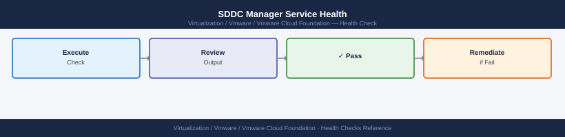
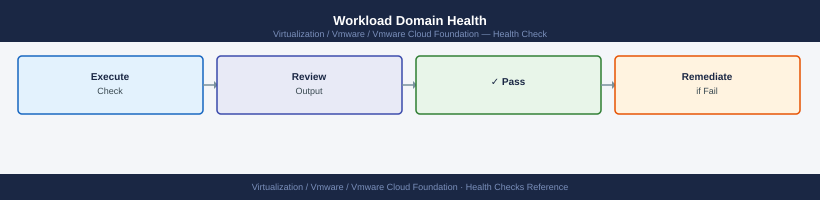
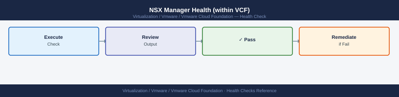

---
tags:
  - operations
  - vcf
  - vmware
description: "VCF health checks: SDDC Manager health API, lcm health check, workload domain cluster status, NSX edge health, and vSAN stretched cluster rebalance status."
---
# VCF — Health Checks

<div class="kb-summary">
VCF health checks: SDDC Manager health API, `lcm health check`, workload domain cluster status, NSX edge health, and vSAN stretched cluster rebalance status.

*Applies to: VCF 4.x / 5.x*
</div>

VCF Daily Health Check — Coverage Map

## Before you begin

- **Access:** vCenter read-only minimum; Administrator role for remediation steps
- **Timing:** safe to run during business hours unless a step is marked ⚠ (causes interruption)
- **Dependencies:** no active upgrades or migrations on the same infrastructure
- **Logging:** capture command output — paste into the change record on completion

---

## Run This Routine

1. **SDDC Manager service health** — query the system health API and review the JSON output for any non-OK status:
   ```bash
   curl -sk -u 'admin@local:password' https://sddc-manager/v1/system/health | python3 -m json.tool
   ```
2. **Domain health overview** — SDDC Manager UI → Dashboard → confirm all domains show green status across vCenter, NSX, and vSAN.
3. **Credential rotation status** — check no ESXi credentials are expired or pending rotation:
   ```bash
   curl -sk -u 'admin@local:password' 'https://sddc-manager/v1/credentials?resourceType=ESXI'
   ```
4. **Certificate expiry check** — SDDC Manager → Security → Certificate Management → review all certificates; flag any expiring within 30 days.
5. **LCM bundle status** — SDDC Manager → Lifecycle Management → check for available updates; note any bundles downloaded but not applied.
6. **Precheck execution** — SDDC Manager → Lifecycle Management → Precheck → run precheck for management domain and review results before any upgrade window.
7. **Commissioned hosts in free pool** — SDDC Manager → Inventory → Hosts → count Unassigned hosts; alert if free pool is empty (no capacity for domain expansion).
8. **NSX manager cluster status** — verify all NSX manager nodes are online and cluster is stable:
   ```bash
   curl -sk -u 'admin:password' https://<nsx>/api/v1/cluster/status
   ```
9. **vSAN health across all domains** — for each workload domain: vCenter → Cluster → Monitor → vSAN Health → confirm no red or yellow alerts.
10. **SDDC Manager audit log review** — scan recent audit entries for unexpected API calls, failed logins, or credential changes:
    ```bash
    tail -50 /var/log/vmware/vcf/commonsvcs/audit.log
    ```

## Common Operational Issues


| Symptom | Where to Check | Action |
|---|---|---|
| Workload domain shows Warning | SDDC Manager → Dashboard | Review component health; expand domain view |
| NSX transport node degraded | NSX Manager → System → Fabric → Nodes | Check NSX agent on affected ESXi host |
| Certificate expiry warning | SDDC Manager → Security → Certificates | Use Certificate Management to renew |
| LCM upgrade stuck | SDDC Manager → Administration → Tasks | Review task details; check `/var/log/vmware/vcf/sddc-manager/` |
| SDDC Manager disk full | SSH → `df -h` | Archive old LCM bundle downloads from `/nfs/vmware/vcf/nfs-mount/` |
| BGP peer down | NSX Manager → Networking → Tier-0 → BGP | Check edge node uptime; verify upstream router config |

---

## SDDC Manager Service Health



All core VCF services must be running on SDDC Manager. SSH to SDDC Manager and verify:

```bash
# SSH to SDDC Manager appliance
ssh vcf@sddc-manager.example.local

# Check core VCF services — all must show: active (running)
systemctl status vcf-operationsmanager
systemctl status vcf-commonsvcs
systemctl status vcf-domainmanager
systemctl status nginx

# Bulk check: list all vcf services and their states
systemctl list-units 'vcf-*' --state=failed
# Expected output: 0 loaded units (no failed services)

# If any service is failed, restart it
sudo systemctl restart vcf-operationsmanager   # example
# Then re-check status; if restart fails, check journal
journalctl -u vcf-operationsmanager --since "30 minutes ago" | tail -50
```


```text title="Expected output"
vcf@sddc-manager:~$ systemctl status vcf-operationsmanager
● vcf-operationsmanager.service - VCF Operations Manager
     Loaded: loaded (/etc/systemd/system/vcf-operationsmanager.service; enabled; vendor preset: enabled)
     Active: active (running) since Wed 2024-01-17 14:32:18 UTC; 2 days ago
   Main PID: 4521 (java)
      Tasks: 47 (limit: 4915)
     Memory: 1.2G
     CGroup: /system.slice/vcf-operationsmanager.service
             └─4521 /usr/lib/jvm/java-11-openjdk-amd64/bin/java -Xmx2g...

vcf@sddc-manager:~$ systemctl status vcf-commonsvcs
● vcf-commonsvcs.service - VCF Common Services
     Loaded: loaded (/etc/systemd/system/vcf-commonsvcs.service; enabled; vendor preset: enabled)
     Active: active (running) since Wed 2024-01-17 14:32:22 UTC; 2 days ago
   Main PID: 4687 (java)
      Tasks: 52 (limit: 4915)
     Memory: 1.8G

vcf@sddc-manager:~$ systemctl status vcf-domainmanager
● vcf-domainmanager.service - VCF Domain Manager
     Loaded: loaded (/etc/systemd/system/vcf-domainmanager.service; enabled; vendor preset: enabled)
     Active: active (running) since Wed 2024-01-17 14:32:25 UTC; 2 days ago
   Main PID: 4823 (java)
      Tasks: 38 (limit: 4915)
     Memory: 956M

vcf@sddc-manager:~$ systemctl status nginx
● nginx.service - A high performance web server and a reverse proxy server
     Loaded: loaded (/lib/systemd/system/nginx.service; enabled; vendor preset: enabled)
     Active: active (running) since Wed 2024-01-17 14:32:10 UTC; 2 days ago
   Main PID: 3891 (nginx)
      Tasks: 8 (limit: 4915)
     Memory: 24.3M

vcf@sddc-manager:~$ systemctl list-units 'vcf-*' --state=failed
     UNIT LOAD ACTIVE SUB
0 loaded units listed. Pass --all to see loaded but inactive units.

vcf@sddc-manager:~$ sudo systemctl restart vcf-operationsmanager
vcf@sddc-manager:~$ journalctl -u vcf-operationsmanager --since "30 minutes ago" | tail -50
Jan 17 15:02:14 sddc-manager systemd[1]: Stopping VCF Operations Manager...
Jan 17 15:02:15 sddc-manager systemd[1]: vcf-operationsmanager.service: Main process exited, code=exited, status=0/SUCCESS
Jan 17 15:02:15 sddc-manager systemd[1]: Stopped VCF Operations
```
---

## Workload Domain Health



1. **UI check**: SDDC Manager → **Inventory** → **Workload Domains** → confirm every domain shows **Status: Succeeded**
   - Yellow / Warning: drill in to identify which component (vCenter, ESXi, vSAN, NSX) is degraded
   - Red / Failed: treat as P1; component is unreachable or has failed validation
2. **Per-domain component check**: click the domain → review the **Components** tab → vCenter, ESXi hosts, vSAN cluster, and NSX segment must all show healthy
3. **API-based domain status query**:
   ```bash
   curl -sk -u admin:<password> \
     https://sddc-manager.example.com/v1/domains | \
     python3 -m json.tool | grep -E '"name"|"status"'
   # Expected: "status": "SUCCEEDED" for every domain
   # "FAILED" or "PARTIALLY_SUCCESSFUL" require investigation
   ```

---

## ESXi Host Pool Health


Hosts not assigned to a domain (free pool) provide capacity for domain expansion. Hosts in a failed state block commissioning.

```bash
# Query all hosts and their assignment status
curl -sk -u admin:<password> \
  https://sddc-manager.example.com/v1/hosts | \
  python3 -m json.tool | grep -E '"fqdn"|"status"'
# Expected statuses:
#   "ASSIGNED"   — host is active in a workload domain
#   "UNASSIGNED" — host is in the free pool, available for commissioning
#   "FAILED"     — host has a problem; investigate before attempting assignment
```


```text title="Expected output"
"fqdn": "esx-wld1-01.corp.local",
"status": "ASSIGNED",
"fqdn": "esx-wld1-02.corp.local",
"status": "ASSIGNED",
"fqdn": "esx-wld2-01.corp.local",
"status": "ASSIGNED",
"fqdn": "esx-mgmt-01.corp.local",
"status": "ASSIGNED",
"fqdn": "esx-pool-01.corp.local",
"status": "UNASSIGNED",
"fqdn": "esx-pool-02.corp.local",
"status": "UNASSIGNED",
"fqdn": "esx-failed-01.corp.local",
"status": "FAILED",
```

!!! warning "Common errors"
    | Error | Fix |
    |---|---|
    | `curl: (60) SSL certificate problem: self signed certificate` | Add the `-k` flag to skip certificate verification, or import the SDDC Manager's CA certificate into your system trust store. |
    | `curl: (7) Failed to connect to sddc-manager.example.com port 443: Connection refused` | Verify the SDDC Manager hostname/IP is correct and the appliance is running; check network connectivity with `ping` or `nc -zv`. |
    | `jq: parse error: Invalid JSON at line 1` | Ensure the API endpoint is correct and the SDDC Manager is responding; test with `curl -sk -u admin:<password> https://sddc-manager.example.com/v1/hosts` without piping to confirm valid JSON output. |
UI check: SDDC Manager → **Inventory** → **Hosts** → filter by **Status: FAILED** — any results require immediate attention.

For hosts in FAILED state: check ESXi connectivity (ping FQDN), verify management vmkernel adapter is up, and review SDDC Manager task logs under **Administration → Tasks**.

---

## Certificate Expiry Check


Expired certificates in VCF cause SSO failures, API authentication errors, and blocked LCM operations.

1. **UI check**: SDDC Manager → **Administration** → **Certificate Management** → review the **Expiry Date** column for all components
   - Alert threshold: **60 days** before expiry — initiate renewal immediately
   - Components to check: SDDC Manager, vCenter (per domain), NSX Manager (per domain), ESXi (if externally managed)
2. **API bulk certificate query**:
   ```bash
   # Check vCenter certificates across all domains
   curl -sk -u admin:<password> \
     "https://sddc-manager.example.com/v1/certificates?resourceType=VCENTER" | \
     python3 -m json.tool | grep -E '"expirationDate"|"commonName"'

   # Check NSX Manager certificates
   curl -sk -u admin:<password> \
     "https://sddc-manager.example.com/v1/certificates?resourceType=NSX_MANAGER" | \
     python3 -m json.tool | grep -E '"expirationDate"|"commonName"'
   ```
3. **Certificate renewal**: SDDC Manager → Certificate Management → select the component → **Generate CSR** → submit to CA → **Import Certificate** → SDDC Manager distributes the new cert to the component automatically

---

## VCF Backup Health


SDDC Manager must be backed up daily; losing SDDC Manager without a backup makes domain recovery significantly harder.

1. **UI check**: SDDC Manager → **Administration** → **Backup and Restore** → verify **Last Successful Backup** timestamp — alert if older than 24 hours
2. **Backup target reachability**:
   ```bash
   # From SDDC Manager, test SFTP backup target reachability
   ssh vcf@sddc-manager.example.local
   curl -v sftp://backup-server.example.local:22 --user backupuser:password 2>&1 | grep -E "Connected|refused|timeout"
   # Or ping the target
   ping -c 4 backup-server.example.local
   ```
3. **Trigger a manual backup**: SDDC Manager → Administration → Backup and Restore → **Backup Now** → monitor task completion in **Administration → Tasks**
4. **Verify backup file on target**: SSH to the backup SFTP server → confirm a new file exists with today's date in the configured backup directory

---

## NSX Manager Health (within VCF)



All three NSX Manager nodes must be active and the management cluster must be stable.

```bash
# Query NSX manager cluster status
curl -sk -u admin:<password> \
  https://nsx-manager.example.com/api/v1/cluster/status | \
  python3 -m json.tool | grep -E '"overall_status"|"mgmt_cluster_status"'
# Expected: "STABLE" for both fields
# "DEGRADED" or "UNSTABLE" = one or more NSX manager nodes are unreachable or not elected

# Check individual node status
curl -sk -u admin:<password> \
  https://nsx-manager.example.com/api/v1/cluster/nodes | \
  python3 -m json.tool | grep -E '"display_name"|"manager_role"|"connectivity_status"'
# All nodes must show: "connectivity_status": "CONNECTED"
```


```text title="Expected output"
"overall_status": "STABLE",
  "mgmt_cluster_status": "STABLE"
  "display_name": "nsx-manager-1.example.com",
  "manager_role": "ACTIVE",
  "connectivity_status": "CONNECTED"
  "display_name": "nsx-manager-2.example.com",
  "manager_role": "STANDBY",
  "connectivity_status": "CONNECTED"
  "display_name": "nsx-manager-3.example.com",
  "manager_role": "STANDBY",
  "connectivity_status": "CONNECTED"
```

!!! warning "Common errors"
    | Error | Fix |
    |---|---|
    | `curl: (60) SSL certificate problem: self signed certificate` | Add the `-k` flag to skip certificate verification, or import the NSX manager's CA certificate into your system trust store. |
    | `curl: (7) Failed to connect to nsx-manager.example.com port 443: Connection refused` | Verify the NSX manager hostname/IP is correct, the management network is reachable, and the NSX manager API service is running (check `systemctl status nsxd` on the manager node). |
    | `"connectivity_status": "DISCONNECTED"` | Restart the affected NSX manager node or check network connectivity between cluster members; if persistent, reinitialize the node from the NSX manager UI. |
UI check: NSX Manager → **System** → **Overview** — the cluster health indicator must show green for all three manager nodes and the controller cluster.

---

## vCenter Health (within VCF)


Each VCF workload domain has a dedicated vCenter; verify all are healthy.

```bash
# Check vCenter overall health for each domain's vCenter
curl -sk -k -u administrator@vsphere.local:<password> \
  https://vcenter.example.com/rest/appliance/health/overall
# Expected response: {"value":"green"}
# "yellow" = degraded service; "red" = critical service failure

# Check individual service health
curl -sk -k -u administrator@vsphere.local:<password> \
  https://vcenter.example.com/rest/appliance/health/services | \
  python3 -m json.tool | grep -E '"name"|"health"'
```


```text title="Expected output"
{"value":"green"}
    "name": "applmgmt",
    "health": "green"
    "name": "certificatemanagement",
    "health": "green"
    "name": "eam",
    "health": "green"
    "name": "envoy",
    "health": "green"
    "name": "imagebuilder",
    "health": "green"
    "name": "netdump",
    "health": "green"
    "name": "sts",
    "health": "green"
    "name": "vapi",
    "health": "green"
    "name": "vmon",
    "health": "green"
...
```

!!! warning "Common errors"
    | Error | Fix |
    |---|---|
    | `curl: (60) SSL certificate problem: self signed certificate` | Add `-k` flag to skip certificate verification (note: the command already includes `-sk -k`, so remove one `-k` or verify the certificate chain is trusted). |
    | `curl: (7) Failed to connect to vcenter.example.com port 443: Connection refused` | Verify vCenter hostname/IP is correct and the appliance management API is accessible on port 443 using `curl -sk https://vcenter.example.com/rest/appliance/health/overall`. |
    | `jq: command not found` or `json.tool: No module named json.tool` | Install python3-json or use `jq` instead: `curl -sk -u administrator@vsphere.local:<password> https://vcenter.example.com/rest/appliance/health/services | jq '.value[] | {name, health}'`. |
UI check: vCenter → **Administration** → **Appliance** → **Health** — all service health indicators must be green.

If vCenter shows red: SSH to the vCenter appliance → `service-control --status --all` → restart the failing service → re-check health endpoint.

---

## Upgrade Precheck Status


Run the upgrade precheck before every LCM-managed upgrade window. Do not proceed if any check fails.

1. SDDC Manager → **Lifecycle Management** → select the domain or component to upgrade → **Run Precheck**
2. Review precheck results:
   - Green: check passed
   - Yellow (Warning): review but may proceed
   - Red (Failed): must be resolved before upgrade
3. **Common precheck failures and resolutions:**

| Failure | Resolution |
|---|---|
| NTP drift > 500ms | Sync time on all components: `chronyc makestep` on each ESXi host |
| Certificate expiry < 30 days | Renew via Certificate Management before proceeding |
| Insufficient disk space on SDDC Manager | `df -h`; clear old bundles from `/nfs/vmware/vcf/nfs-mount/` |
| ESXi host not in maintenance mode | Place hosts in maintenance mode before upgrade starts |
| vSAN resync in progress | Wait for resync to complete: vCenter → Cluster → Monitor → vSAN → Resyncing Components = 0 |
| Password expiry warning | Rotate affected credentials: SDDC Manager → Security → Credentials |

4. After resolving failures, re-run precheck until all checks are green or warning-only

---

## LCM Bundle Repository


Upgrade bundles must be downloaded to SDDC Manager before an upgrade can be scheduled.

1. **UI check**: SDDC Manager → **Lifecycle Management** → **Bundle Management** → review the **Status** column for each component bundle
   - **Available for download**: bundle must be downloaded before use → click **Download**
   - **Downloaded**: ready for upgrade scheduling
   - **Download failed**: investigate connectivity
2. **If download fails — check internet access or proxy**:
   ```bash
   # Test depot reachability from SDDC Manager
   curl -sv https://depot.vmware.com 2>&1 | grep -E "Connected|SSL|refused|timeout" | head -10
   # If behind a proxy, verify proxy setting in SDDC Manager:
   # Administration → Network Settings → Proxy — confirm proxy FQDN and port are correct
   ```
3. **Manual depot sync**: SDDC Manager → Lifecycle Management → Bundle Management → **Sync Now** — forces re-check of available bundles from the VMware depot
4. **Offline depot**: for air-gapped environments, upload bundles manually via SDDC Manager → Lifecycle Management → **Offline Bundle Upload**; verify the bundle checksum matches the manifest

---

## See also

- [VCF Troubleshooting — Common Issues](../../troubleshooting/common-issues/)
- [VCF — Procedures](../procedures/)
- [VCF Operations — CLI Reference](../cli-reference/)

## Verify

- **Alarms:** vSphere Client → Home → Alarms — no new critical alarms after the operation
- **Events:** monitor the vCenter Events view for the affected object for 5 minutes
- **Health check:** run the morning health-check sequence for the affected product tier
