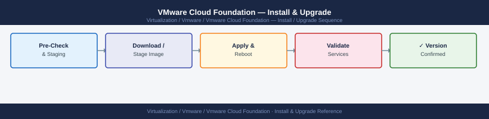

---
tags:
  - operations
  - vcf
  - vmware
---
# VMware Cloud Foundation — Install & Upgrade

*Applies to: VMware vSphere 7.x / 8.x*


```bash

## Before you begin

- **Access:** vCenter read-only minimum; Administrator role for remediation steps
- **Timing:** safe to run during business hours unless a step is marked ⚠ (causes interruption)
- **Dependencies:** no active upgrades or migrations on the same infrastructure
- **Logging:** capture command output — paste into the change record on completion

---

!!! warning "Host enters maintenance mode"
    ESXi remediation puts hosts into maintenance mode, triggering DRS evacuation. Confirm DRS is Fully Automated and HA admission control is satisfied before starting.

## Run pre-check for a workload domain upgrade
curl -sk -X POST -u admin:<password> \
  https://localhost/v1/upgrades \
  -H "Content-Type: application/json" \
  -d '{
    "resourceType": "DOMAIN",
    "resourceId": "<domain-id>",
    "bundleId": "<bundle-id>",
    "requestType": "PRECHECK"
  }'

## Retrieve pre-check results
curl -sk -u admin:<password> \
  https://localhost/v1/upgrades/<precheck-id> \
  | python3 -m json.tool

## Check SDDC Manager logs for pre-check detail
tail -200 /var/log/vmware/vcf/sddc-manager/vcf-sddc-manager.log | grep -i "precheck"
```

```text title="Expected output"
{"id":"precheck-20250114-a7f3k","resourceType":"DOMAIN","resourceId":"domain-01","bundleId":"bundle-8.0.1-24156789","status":"IN_PROGRESS","createdAt":"2025-01-14T09:47:23Z"}

{
  "id": "precheck-20250114-a7f3k",
  "resourceType": "DOMAIN",
  "resourceId": "domain-01",
  "bundleId": "bundle-8.0.1-24156789",
  "status": "COMPLETED",
  "createdAt": "2025-01-14T09:47:23Z",
  "completedAt": "2025-01-14T09:52:18Z",
  "result": {
    "overallStatus": "PASSED",
    "checks": [
      {"name": "vSphere Cluster Health", "status": "PASSED"},
      {"name": "Storage Capacity", "status": "PASSED"},
      {"name": "Network Connectivity", "status": "PASSED"},
      {"name": "vSAN Health", "status": "WARNING", "message": "1 disk showing elevated latency"}
    ]
  }
}

2025-01-14 09:47:24,156 [INFO] Precheck request received for domain-01
2025-01-14 09:47:45,892 [INFO] Precheck validation started: bundle-8.0.1-24156789
2025-01-14 09:51:12,334 [INFO] vSphere cluster health check passed
2025-01-14 09:52:18,401 [INFO] Precheck completed with status PASSED
```

!!! warning "Common errors"
    | Error | Fix |
    |---|---|
    | `curl: (60) SSL certificate problem: self signed certificate` | Add `-k` flag to skip certificate verification (already present in the example, but ensure it's included if you remove it). |
    | `jq: command not found` | Install `jq` package or use `python3 -m json.tool` as shown in the example for JSON formatting. |
    | `grep: /var/log/vmware/vcf/sddc-manager/vcf-sddc-manager.log: No such file or directory` | Verify SDDC Manager is running and check the correct log path with `find /var/log -name "*sddc-manager*" -type f`. |
```bash
## Check current component versions in SDDC Manager
curl -sk -u admin:<password> \
  https://localhost/v1/system/inventory/components \
  | python3 -m json.tool

## See also

- [VCF — Health Checks](../health-checks/)
- [VCF Troubleshooting — Common Issues](../../troubleshooting/common-issues/)
- [VCF — Procedures](../procedures/)

## Verify NSX version compatibility
curl -sk -u admin:<password> \
  https://localhost/v1/nsxt-clusters \
  | python3 -m json.tool | grep -E "version|id"
```

```text title="Expected output"
{
  "elements": [
    {
      "id": "sddc-mgr-001",
      "name": "SDDC Manager",
      "version": "5.1.0.0-21567890",
      "type": "MANAGEMENT",
      "status": "HEALTHY"
    },
    {
      "id": "vcenter-prod-01",
      "name": "vCenter Server",
      "version": "8.0.1.00000-21932109",
      "type": "COMPUTE",
      "status": "HEALTHY"
    },
    {
      "id": "nsx-manager-cluster",
      "name": "NSX Manager",
      "version": "4.1.2.0-21456789",
      "type": "NETWORK",
      "status": "HEALTHY"
    },
    {
      "id": "vsan-cluster-01",
      "name": "vSAN Cluster",
      "version": "8.0.1",
      "type": "STORAGE",
      "status": "HEALTHY"
    }
  ]
}
  "id": "nsx-cluster-prod",
  "version": "4.1.2.0-21456789"
  "id": "nsx-cluster-dr",
  "version": "4.1.1.0-21234567"
```

!!! warning "Common errors"
    | Error | Fix |
    |---|---|
    | `curl: (60) SSL certificate problem: self signed certificate` | Add `-k` flag to skip certificate verification (already present in example; if error persists, verify SDDC Manager API endpoint is accessible). |
    | `curl: (7) Failed to connect to localhost port 443: Connection refused` | Ensure SDDC Manager service is running with `systemctl status sddc-manager` and verify you're connecting from a host with network access to the management cluster. |
    | `jq: command not found` | Install `python3-json-tool` or use `python3 -m json.tool` instead (already shown in example; if json.tool fails, verify Python 3.6+ is installed). |
```bash
## Verify SDDC Manager backup is current
curl -sk -u admin:<password> \
  https://localhost/v1/backups/tasks \
  | python3 -m json.tool | grep -E "status|completionTimestamp" | head -20

## Trigger an on-demand SDDC Manager backup
curl -sk -X POST -u admin:<password> \
  https://localhost/v1/backups \
  -H "Content-Type: application/json" \
  -d '{"elements": [{"resourceType": "SDDC_MANAGER"}]}'

## Check for existing VM snapshots that must be removed pre-upgrade
curl -sk -u admin:<password> \
  https://localhost/v1/system/inventory/snapshots \
  | python3 -m json.tool
```

```text title="Expected output"
"status": "COMPLETED",
  "completionTimestamp": "2024-01-15T03:45:22.891Z",
  "status": "COMPLETED",
  "completionTimestamp": "2024-01-14T18:22:15.443Z",
  "status": "IN_PROGRESS",
  "completionTimestamp": null,
  "status": "COMPLETED",
  "completionTimestamp": "2024-01-13T09:12:44.556Z",

{
  "taskId": "backup-task-a7f2c9e1-4b3d-11ee-9c2a-001a6b5c8d92",
  "status": "QUEUED",
  "creationTimestamp": "2024-01-15T04:18:33.221Z"
}

{
  "snapshots": [
    {
      "vmName": "vcenter-01.sddc.local",
      "snapshotName": "pre-upgrade-snapshot",
      "creationTime": "2024-01-14T22:15:00Z",
      "sizeGB": 45.2
    },
    {
      "vmName": "nsx-manager-01.sddc.local",
      "snapshotName": "backup-jan15",
      "creationTime": "2024-01-15T02:30:00Z",
      "sizeGB": 78.5
    }
  ],
  "snapshotCount": 2
}
```

!!! warning "Common errors"
    | Error | Fix |
    |---|---|
    | `curl: (60) SSL certificate problem: self signed certificate` | Add the `-k` flag to skip certificate verification, or import the SDDC Manager CA certificate into your system trust store. |
    | `HTTP/1.1 401 Unauthorized` | Verify the admin password is correct and hasn't expired; reset credentials in SDDC Manager if needed. |
    | `curl: (7) Failed to connect to localhost port 443: Connection refused` | Ensure you are running this command on the SDDC Manager appliance itself or have network access to its management IP, and verify the API service is running with `systemctl status sddc-manager-api`. |
```bash
## Test connectivity from SDDC Manager to VMware depot
curl -sk -o /dev/null -w "%{http_code}" https://depot.vmware.com

## Test vCenter reachability
curl -sk -o /dev/null -w "%{http_code}" https://<vcenter-fqdn>/sdk

## Test NSX Manager reachability
curl -sk -o /dev/null -w "%{http_code}" https://<nsx-manager-fqdn>/api/v1/node
```

```text title="Expected output"
200
200
200
```

!!! warning "Common errors"
    | Error | Fix |
    |---|---|
    | `curl: (7) Failed to connect to depot.vmware.com port 443: Connection timed out` | Verify outbound HTTPS connectivity from SDDC Manager to the internet and check firewall rules allow access to depot.vmware.com. |
    | `curl: (60) SSL certificate problem: self signed certificate` | The `-k` flag should skip certificate validation, but if using an older curl version, update curl or ensure the certificate chain is trusted in the system CA store. |
    | `curl: (6) Could not resolve host name` | Replace `<vcenter-fqdn>` and `<nsx-manager-fqdn>` with actual FQDNs and verify DNS resolution is working from SDDC Manager with `nslookup` or `dig`. |
```bash
## Add environment-specific commands here
```
