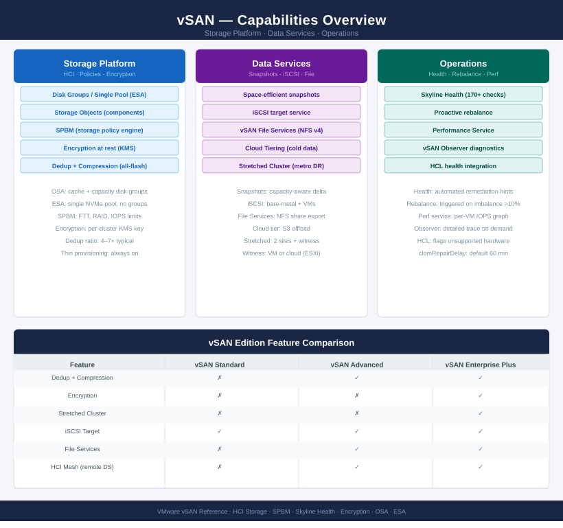
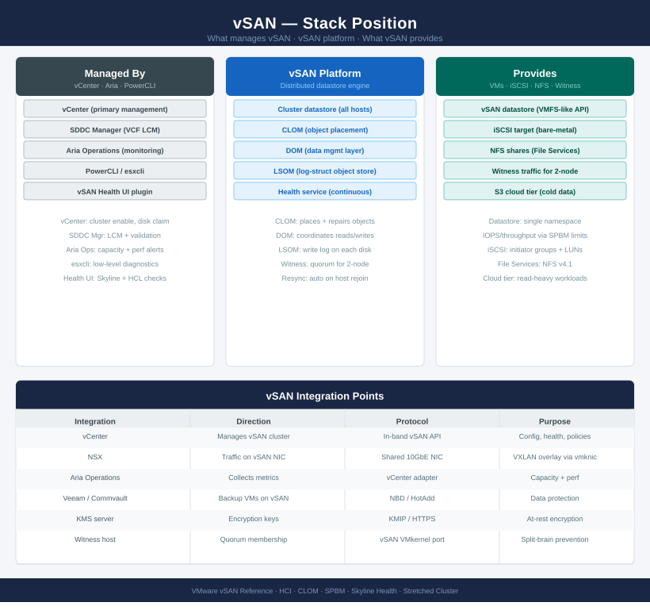

# vSAN

<div class="kb-summary">
Technical and operational reference for VMware vSAN. Covers storage policies, disk groups, capacity management, resync operations, health monitoring, and troubleshooting for software-defined storage in vSphere clusters.

*Applies to: vSAN 7.x · 8.x*
</div>





```text
┌──────────────────────────────────── vSAN — Installation Sequence ─────────────────────────────────────┐
│                                                                                                       │
│  Step 1 · Pre-Checks                                                                                  │
│  ─────────────────────────────────────────────────────────────────────────────────────────            │
│  All hosts in cluster have vSAN VMkernel adapter  ·  MTU 9000 confirmed                               │
│  vSAN HCL: SSD/NVMe cache tier and HDD/NVMe capacity tier all listed                                  │
│  Minimum disk requirements: 1 cache + 1 capacity per disk group per host                              │
│  Network: dedicated 10 GbE+ uplinks for vSAN traffic  ·  No shared vMotion                            │
│  Cluster has ≥3 hosts for FTT=1  ·  ≥5 hosts for RAID-5 erasure coding                                │
│                                                                                                       │
│                                        │  enable vSAN on cluster                                      │
│                                        ▼                                                              │
│  Step 2 · Enable vSAN                                                                                 │
│  ─────────────────────────────────────────────────────────────────────────────────────────            │
│  vCenter → Cluster → Configure → vSAN → Turn On                                                       │
│  Select single-site or stretched cluster  ·  Enable deduplication/compression                         │
│  Fault domains: configure if multi-rack to honour rack-level failure tolerance                        │
│  Encryption: enable at rest if data-at-rest policy requires it                                        │
│  vSAN bootstrap: first disk group created on each host during wizard                                  │
│                                                                                                       │
│                                        │  claim disks and configure disk groups                       │
│                                        ▼                                                              │
│  Step 3 · Disk Group Configuration                                                                    │
│  ─────────────────────────────────────────────────────────────────────────────────────────            │
│  Claim cache tier (NVMe/SSD)  ·  Claim capacity tier (NVMe/SSD/HDD)                                   │
│  Disk format: disk group type — hybrid or all-flash  ·  On-disk format v14+                           │
│  Add capacity hosts: each host must contribute at least one disk group                                │
│  Verify disk groups healthy: no degraded, absent, or inaccessible components                          │
│  Capacity: confirm usable capacity matches expected after FTT overhead                                │
│                                                                                                       │
│                                        │  configure storage policies                                  │
│                                        ▼                                                              │
│  Step 4 · Storage Policy Configuration                                                                │
│  ─────────────────────────────────────────────────────────────────────────────────────────            │
│  Create SPBM policies: FTT=1 RAID-1 (default), FTT=1 RAID-5, FTT=2 RAID-6                             │
│  Assign default policy to cluster  ·  VM home namespace policy set                                    │
│  Tag-based placement rules if multiple datastores or fault domains exist                              │
│  Test policy compliance: deploy test VM, confirm object placement correct                             │
│  Verify existing VM storage objects are compliant (no yellow/red warnings)                            │
│                                                                                                       │
│                                        │  migrate workloads                                           │
│                                        ▼                                                              │
│  Step 5 · Workload Migration                                                                          │
│  ─────────────────────────────────────────────────────────────────────────────────────────            │
│  svMotion existing VMs from local/NFS datastores to vSAN datastore                                    │
│  Monitor resyncing objects: vSAN → Monitor → Resyncing Objects                                        │
│  Confirm all objects reach Healthy state after migration                                              │
│  Remove old datastores and disconnect legacy storage paths if decommissioning                         │
│  Performance: enable vSAN Performance Service for per-VM IOPS dashboards                              │
│                                                                                                       │
│                                        │  health, monitoring and day-2                                │
│                                        ▼                                                              │
│  Step 6 · Health & Monitoring                                                                         │
│  ─────────────────────────────────────────────────────────────────────────────────────────            │
│  vSAN Health Service: run full check  ·  Resolve any warnings before production                       │
│  Network partition test: verify all hosts see same vSAN partition                                     │
│  Proactive rebalance: run if capacity usage is uneven across hosts                                    │
│  Skyline Health: onboard cluster for ongoing vSAN health recommendations                              │
│  Backup: configure VM-level backup via Veeam/Commvault before go-live                                 │
│                                                                                                       │
└───────────────────────────────────────────────────────────────────────────────────────────────────────┘
```


<div class="kb-grid kb-grid-3">

<a class="kb-card" href="architecture/">
  <strong>Architecture</strong>
  <span>How it works, component states, resync mechanics, integrations, and design standards.</span>
</a>

<a class="kb-card" href="deploy/">
  <strong>Deploy</strong>
  <span>End-to-end deployment from bare metal through vSAN enablement, policies, and validation.</span>
</a>

<a class="kb-card" href="operations/">
  <strong>Operations</strong>
  <span>CLI reference, health checks, procedures, lifecycle, backup, and scripts.</span>
</a>

<a class="kb-card" href="security/">
  <strong>Security</strong>
  <span>Authentication, access control, encryption, and hardening.</span>
</a>

<a class="kb-card" href="troubleshooting/">
  <strong>Troubleshooting</strong>
  <span>Common issues, diagnostics, and escalation.</span>
</a>

</div>
