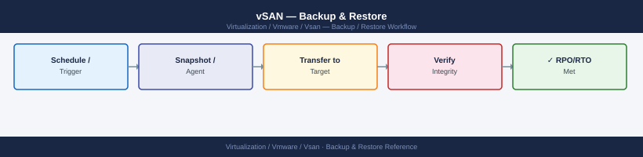

---
tags:
  - operations
  - vmware
  - vsan
  - vsphere-8
---
# vSAN — Backup & Restore

<div class="kb-summary">
Backup & Restore reference covering Supported Backup Methods, vSAN Configuration Backup, Restore Procedures, Backup Validation and Testing, Recovery Point and Recovery Time Objectives.

*Applies to: vSAN 7.x / 8.x*
</div>


## Backup Tool Integration

**Reset CBT if incremental backups are failing:**

```bash
# From PowerCLI — disable, snapshot, delete snapshot, re-enable
$vm = Get-VM <vmname>
$spec = New-Object VMware.Vim.VirtualMachineConfigSpec
$spec.changeTrackingEnabled = $false
$vm.ExtensionData.ReconfigVM($spec)

$snap = New-Snapshot -VM $vm -Name "CBT-Reset"
Remove-Snapshot -Snapshot $snap -Confirm:$false

$spec.changeTrackingEnabled = $true
$vm.ExtensionData.ReconfigVM($spec)
```


```text title="Expected output"
Name                 PowerState Num CPUs MemoryGB
----                 ---------- -------- --------
prod-web-01          PoweredOn   8        32

Snapshot created: CBT-Reset
Snapshot removed successfully.
(no output — command completes silently)
```

!!! warning "Common errors"
    **`You cannot call a method on a null-valued expression.`** — Ensure the VM name is correct and the vCenter session is active with `Connect-VIServer`.
    **`The operation is not allowed in the current state.`** — Power off the VM or disable vSAN data protection policies before attempting CBT reconfiguration.
### Veeam Backup & Replication

Veeam is the most widely deployed backup tool for vSAN environments. It uses VADP and supports vSAN-specific transport modes.

**Recommended transport mode for vSAN:**

- **Direct NFS transport (vSAN):** Veeam mounts vSAN datastores directly via the vSAN NFS interface. Eliminates LAN traffic for backup — most efficient for large vSAN clusters.
- **Network mode (NBD):** Backup data traverses the management or vSAN network. Use when Direct NFS is not available.

**Veeam job configuration for vSAN:**

1. Create a backup job targeting the vSAN cluster or specific VMs.
2. Set **Transport Mode** to `Automatic` (Veeam will select Direct NFS if available).
3. Enable **Application-aware processing** for VMs running SQL, Exchange, or AD.
4. Enable **Changed Block Tracking** in job settings.
5. Set a retention policy aligned with RPO/RTO requirements.

**Verify Veeam proxy access to vSAN:**

The Veeam proxy VM must be hosted on a host with access to the vSAN datastore. For Direct NFS, the proxy must have a vmkernel adapter on the vSAN network.

### Commvault IntelliSnap

Commvault supports vSAN through VADP. IntelliSnap creates application-consistent snapshots and integrates with vSAN for granular file-level and VM-level recovery.

**Key configuration points:**

- Install the Commvault Virtual Server Agent (VSA) on a proxy VM hosted on a vSAN cluster host.
- Configure the vCenter as a hypervisor client in the Commvault CommCell.
- Enable IntelliSnap for vSAN by selecting the vSAN datastore in the subclient.

### Zerto

Zerto provides continuous data protection (CDP) for vSAN-backed VMs. It replicates at the hypervisor level, journal-based, and supports near-zero RPO.

- Zerto Virtual Replication Appliance (ZRA) is deployed per host.
- Compatible with vSAN datastores on both source and target.
- Does not use VADP — replicates at the virtual disk I/O level.

---

## Before you begin

- **Access:** vCenter read-only minimum; Administrator role for remediation steps
- **Timing:** safe to run during business hours unless a step is marked ⚠ (causes interruption)
- **Dependencies:** no active upgrades or migrations on the same infrastructure
- **Logging:** capture command output — paste into the change record on completion

---

## vSAN Configuration Backup

vSAN cluster configuration is stored in vCenter. The vSAN configuration itself (disk groups, policies, cluster settings) is not separately backed up — it is recovered by rebuilding the cluster from vCenter configuration.

**What to back up:**

| Item | Backup method |
|---|---|
| vCenter Server Appliance (VCSA) | VCSA File-Based Backup (SFTP/FTP/HTTP) |
| Storage policies (SPBM) | Export via PowerCLI |
| vSAN advanced settings | Document in change records |
| Stretched cluster configuration | Document fault domain layout and witness details |

**Export storage policies via PowerCLI:**

```powershell
Connect-VIServer <vcenter>

# Export all storage policies to a text report
Get-SpbmStoragePolicy | Select Name, Description, @{N='Rules';E={
    $_.AnyOfRuleSets | ForEach-Object { $_.AllOfRules | Select Name, Value }
}} | ConvertTo-Json | Out-File "vsan_policies_$(Get-Date -Format yyyyMMdd).json"
```

**VCSA File-Based Backup (recommended — schedule daily):**

```bash
# From VCSA shell — backup to SFTP target
/usr/lib/applmgmt/backup_restore/py/vmwareappliance/backup.py \
  --location sftp://backup-server/vcsa-backups \
  --username backupuser \
  --password <password> \
  --backuptype SEAT \
  --comment "daily-backup"
```


```text title="Expected output"
Backup job initialized
Backup started at 2024-01-15T09:42:17.123Z
Backing up: Analytics Database
Backing up: vCenter Server
Backing up: Inventory Service
Backing up: vSAN Health Service
Backup completed successfully
Backup location: sftp://backup-server/vcsa-backups/VCSA-backup-2024-01-15-094217.tar.gz
Backup size: 12.4 GB
Backup duration: 18 minutes 34 seconds
Backup ID: a7f3c9e2-1b4d-4e8f-9d2a-5c6b8e1f3a4d
```

!!! warning "Common errors"
    **`Authentication failed for user 'backupuser' on sftp://backup-server`** — Verify the SFTP credentials are correct and the backup user account exists on the target server.
    **`Connection timeout connecting to backup-server:22`** — Confirm the SFTP server is reachable and listening on port 22, and check firewall rules between VCSA and the backup target.
    **`Insufficient disk space on sftp://backup-server/vcsa-backups`** — Ensure the SFTP target has at least 15 GB of free space available for the backup.
Or configure the backup schedule via vSphere Client: **vCenter → Administration → Backup → Schedule**

---

## Restore Procedures

### Restore Individual VM (Veeam)

1. In the Veeam console, navigate to **Backups** and locate the target VM.
2. Right-click the VM → **Restore** → **Entire VM**.
3. Select the restore point (date/time).
4. Choose the target: restore to original location or to a new vSAN datastore.
5. Select the target storage policy for the restored VM.
6. Power on the VM after restore completes.
7. Verify guest OS boot and application health.

**File-level restore (Veeam FLR):**

1. Right-click the VM backup → **Restore guest files** → **Microsoft Windows** or **Linux**.
2. Mount the restore point as a disk — browse the file system.
3. Copy the required files back to the production VM.

### Restore Individual VM (PowerCLI + Snapshot Rollback)

Snapshot rollback is a short-term rollback mechanism, not a restore from backup. Only use this within hours of creating the snapshot.

```powershell
# Roll back to a snapshot
$vm = Get-VM <vmname>
$snap = Get-Snapshot -VM $vm -Name "pre-change-snapshot"
Set-VM -VM $vm -Snapshot $snap -Confirm:$false
```

Remove all snapshots after rollback to avoid delta disk growth:

```powershell
Remove-Snapshot -VM $vm -RemoveChildren -Confirm:$false
```

### Recover vCenter from VCSA Backup

If vCenter is lost (and therefore vSAN health monitoring is lost), existing VMs continue running — vSAN data plane is independent of vCenter. Recovering vCenter restores management plane access.

**VCSA recovery procedure:**

1. Deploy a new VCSA OVA to a standalone ESXi host (not the vSAN cluster — use a separate management host).
2. During VCSA setup, choose **Restore from backup**.
3. Provide the SFTP/FTP backup location and credentials.
4. Select the most recent backup.
5. After restore, the VCSA reconnects to all ESXi hosts and the vSAN cluster becomes visible again.

### Rebuild Disk Group After Drive Failure

If a disk group has been lost due to cache SSD failure:

```bash
# 1. Verify which disk group is affected
esxcli vsan storage list | grep -E "naa\.|Is SSD|Disk Group UUID|Is Capacity Tier"

# 2. Check object health — expect degraded components
esxcli vsan debug object list | grep -v healthy

!!! warning "Run only after hardware is replaced and visible to ESXi"
    Do not remove the failed disk group until the replacement hardware is physically installed and confirmed visible to the ESXi host. Removing before the new hardware is ready leaves the host with no disk group, which may trigger vSAN object degradation if FTT is already reduced.

# 3. Remove the failed disk group (after hardware replacement)
esxcli vsan storage remove -s <new_ssd_naa>

# 4. Rebuild the disk group with new hardware
esxcli vsan storage add -s <new_ssd_naa> -d <capacity_naa1> -d <capacity_naa2>

# 5. Monitor resync
esxcli vsan debug resync summary get
```


```text title="Expected output"
naa.5001405a1b2c3d4e
Is SSD: true
Disk Group UUID: 52d4a8f1-7c9e-4b2a-9f3d-1a5c8e2b4d6f
Is Capacity Tier: false

naa.5001405a1b2c3d4f
Is SSD: false
Disk Group UUID: 52d4a8f1-7c9e-4b2a-9f3d-1a5c8e2b4d6f
Is Capacity Tier: true

Object: vsan:52d4a8f1-7c9e-4b2a-9f3d-1a5c8e2b4d6f:0x1a2b3c4d
Health: degraded
Components: 2/3 present

Object: vsan:52d4a8f1-7c9e-4b2a-9f3d-1a5c8e2b4d6f:0x5e6f7a8b
Health: degraded
Components: 1/2 present

Disk group removal successful for naa.5001405a1b2c3d4e

Disk group creation successful
Disk Group UUID: 52d4a8f1-7c9e-4b2a-9f3d-1a5c8e2b4d6f

Resync Status: In Progress
Objects pending resync: 47
Estimated time remaining: 2h 34m
```

!!! warning "Common errors"
    **`Error: The disk group cannot be removed while objects are still present`** — Wait for all vSAN objects to migrate off the disk group or reduce FTT before removal.
    **`Error: Device naa.5001405a1b2c3d4e not found`** — Verify the replacement disk is physically installed, rescanned with `esxcli storage core adapter rescan -A vmhba0`, and visible in `esxcli storage core device list`.
    **`Error: Insufficient capacity to add disk group with specified disks`** — Ensure at least one SSD and one capacity disk are specified, and that the disks are not already claimed by another disk group.
---

## Backup Validation and Testing

Untested backups are assumptions. Test restores on a schedule:

| Test Type | Frequency | Method |
|---|---|---|
| Individual VM restore | Monthly | Restore to isolated network, verify boot |
| Application-consistent restore | Quarterly | Restore DB or AD VM, verify application start |
| Full site restore (DR test) | Annually | Restore full cluster from backup to DR site |
| CBT integrity check | After each ESXi upgrade | Disable/re-enable CBT, run full backup |

**Common backup failure points on vSAN:**

| Failure | Cause | Fix |
|---|---|---|
| CBT errors on incremental backup | Stale CBT after snapshot orphan | Reset CBT (disable/enable cycle with snapshot) |
| Snapshot stuck or delta disk growing | High write I/O during backup | Schedule backup during off-peak hours; increase snapshot quiesce timeout |
| Backup proxy cannot access vSAN datastore | Proxy not on vSAN network segment | Move proxy VM to a host with vSAN vmkernel connectivity |
| Backup job slow on large VMs | Network mode instead of Direct NFS | Reconfigure Veeam proxy transport mode |

---

## Recovery Point and Recovery Time Objectives

Document RPO and RTO per workload tier before deploying backup:

| Workload Tier | RPO Target | RTO Target | Backup Method |
|---|---|---|---|
| Tier-1 Databases | < 1 hour | < 2 hours | Veeam application-aware + Zerto CDP |
| Tier-2 General VMs | < 4 hours | < 4 hours | Veeam daily backup |
| Dev/Test | < 24 hours | < 8 hours | Veeam daily backup or snapshot |

vSAN stretched cluster does not improve RPO for logical failures — it only protects against site-level hardware failure. Backup remains required regardless of stretched cluster configuration.

---

## See also

- [vSAN — Procedures](../procedures/)
- [vSAN — Common Issues](../../troubleshooting/common-issues/)
- [vSAN — Health Checks](../health-checks/)

## Verify

- **Alarms:** vSphere Client → Home → Alarms — no new critical alarms after the operation
- **Events:** monitor the vCenter Events view for the affected object for 5 minutes
- **Health check:** run the morning health-check sequence for the affected product tier
