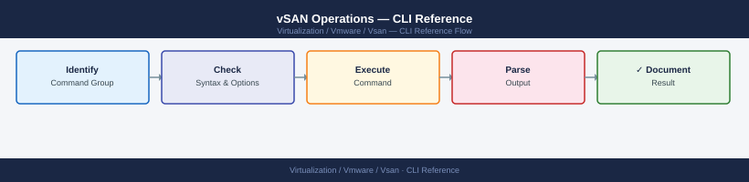

---
tags:
  - operations
  - vmware
  - vsan
  - vsphere-8
description: "Commonly used ESXi shell and PowerCLI commands for managing and troubleshooting vSAN clusters. vSAN is VMware's hyper-converged storage solution — it..."
---
# vSAN Operations — CLI Reference

<div class="kb-summary">
Commonly used ESXi shell and PowerCLI commands for managing and troubleshooting vSAN clusters. vSAN is VMware's hyper-converged storage solution — it pools the local disks of multiple ESXi hosts into a shared datastore.

*Applies to: vSAN 7.x / 8.x*
</div>


## Before you begin

- **Access:** vCenter read-only minimum; Administrator role for remediation steps
- **Timing:** safe to run during business hours unless a step is marked ⚠ (causes interruption)
- **Dependencies:** no active upgrades or migrations on the same infrastructure
- **Logging:** capture command output — paste into the change record on completion

---

## Quick Reference

| Task | Command |
|---|---|
| Cluster membership and health | `esxcli vsan cluster get` |
| Run all health checks | `esxcli vsan health cluster get` |
| Health failures only | `esxcli vsan health cluster get \| grep -i fail` |
| List disk groups | `esxcli vsan storage list` |
| Object health summary | `esxcli vsan debug object list \| grep -v healthy` |
| Resync queue | `esxcli vsan debug resync summary get` |
| Resync detail | `esxcli vsan debug resync list` |
| Check resync throttle | `esxcli vsan debug resync throttle get` |
| Set resync throttle | `esxcli vsan debug resync throttle set --throttle 500` |
| Network connectivity test | `esxcli vsan debug network test` |
| MTU jumbo frame test | `vmkping -I vmk2 -d -s 8972 <peer_vmk_ip>` |
| Add disk group | `esxcli vsan storage add -s <ssd_naa> -d <cap_naa>` |
| Remove disk group | `esxcli vsan storage remove -s <ssd_naa>` |
| Performance service status | `esxcli vsan perf get` |
| Per-VMDK performance stats | `esxcli vsan debug vmdk list` |
| Disk-level IOPS/latency stats | `esxcli vsan storage stats get` |

---

## Skyline Health

**From vCenter UI:**
Cluster → Monitor → vSAN → Skyline Health

Equivalent CLI commands (run from any host in the cluster):

```bash
esxcli vsan health cluster get | grep -i fail
esxcli vsan health cluster get | grep -i warning
```


```text title="Expected output"
Cluster Health Status:
  Overall Health: yellow
  Cluster UUID: 52d4a8f1-7c2e-4a9b-8b3c-1a2b3c4d5e6f
  Cluster Domain UUID: 52d4a8f1-7c2e-4a9b-8b3c-1a2b3c4d5e6f

Health Check Results:
  vSAN Build Health: yellow
    Build Mismatch Detected: warning
    Host esxi-01.lab.local: Build 20348
    Host esxi-02.lab.local: Build 20347
  Network Health: yellow
    Unicast Agent Health: warning
    Multicast Health: warning
  Physical Disk Health: red
    Disk mpx.vmhba0:C0:T0:L0 FAILED on esxi-03.lab.local
    Disk mpx.vmhba1:C0:T1:L0 FAILED on esxi-03.lab.local
  Memory Health: yellow
    Memory Reservation Warning on esxi-02.lab.local
```

!!! warning "Common errors"
    | Error | Fix |
    |---|---|
    | `Error: Unknown command or namespace vsan health` | Verify vSAN is licensed and enabled on the cluster; run `esxcli vsan cluster get` to confirm vSAN is active. |
    | `Error: Unable to connect to vSAN cluster` | Ensure the ESXi host is part of a vSAN cluster and network connectivity exists between cluster members. |
Check performance service status:

```bash
esxcli vsan perf get
```


```text title="Expected output"
Virtual SAN Performance Monitoring
==================================

Cluster UUID: 52d4a8f2-1c3e-4f9a-b2e1-7a9c3d5f8e1b
Cluster Name: prod-vsan-cluster-01

Performance Metrics (Last 5 minutes):
  Read Latency (ms):        2.34
  Write Latency (ms):       3.87
  Read Throughput (MB/s):   1245.6
  Write Throughput (MB/s):  892.3
  IOPS (Read):              18934
  IOPS (Write):             12456
  Congestion Level:         Low
  Physical Capacity Used:   68.5%
  Logical Capacity Used:    71.2%

Disk Group Status:
  Disk Group 1: Healthy
  Disk Group 2: Healthy
  Disk Group 3: Healthy

Last Updated: 2024-01-15 14:32:18 UTC
```

!!! warning "Common errors"
    | Error | Fix |
    |---|---|
    | `Error: Could not connect to the vSAN cluster` | Verify the ESXi host is part of an active vSAN cluster and network connectivity to vSAN management is available. |
    | `Error: Permission denied` | Ensure your user account has the required vSAN.Cluster.Read permission on the vSAN cluster object. |
    | `Error: vSAN service is not running` | Restart the vSAN service using `systemctl restart vsanvpd` or reboot the ESXi host. |
---

## Health & Diagnostics

vSAN health checks validate everything from disk capacity to network connectivity to object compliance. Run these after any hardware change or when investigating performance issues.

```bash
# Summary health (pass/fail for all health checks)
esxcli vsan health cluster get
esxcli vsan health summary get

# Detailed trace output
esxcli vsan trace get

# List all VM object components and their health
esxcli vsan debug object list

# Show only unhealthy objects (not accessible or degraded)
esxcli vsan debug object list | grep -i unhealthy

# Objects with absent components (data on a failed or removed host)
esxcli vsan debug object list | grep -i absent

# Active resync operations (rebuilds, rebalances, migrations)
esxcli vsan debug resync list
esxcli vsan debug resync summary get

# Component status (individual chunks of VM data)
esxcli vsan debug component list
```


```text title="Expected output"
Cluster Health Status:
  Health: green
  Timestamp: 2024-01-15T14:32:18Z

Summary Health:
  Overall Health: green
  Cluster Capacity Health: green
  Member Health: green
  Network Health: green
  Disk Format Version: 13
  Upgrade Status: No upgrade in progress

Trace Output:
  [2024-01-15T14:32:19.847Z] vsan: cluster UUID esx-cluster-01-uuid-a1b2c3d4e5f6
  [2024-01-15T14:32:19.851Z] vsan: node esxi-01.lab.local joined cluster
  [2024-01-15T14:32:19.855Z] vsan: resync task initiated for object vm-123-disk-1
  [2024-01-15T14:32:19.862Z] vsan: component rebuild 45% complete on host esxi-02

VM Object Components:
  Object UUID: 52d1e2f3-4a5b-6c7d-8e9f-0a1b2c3d4e5f
  Object Name: vm-prod-01-disk-1
  Health: green
  Components: 3 (policy: RAID-1)
  ...
  Object UUID: 62e2f3g4-5b6c-7d8e-9f0a-1b2c3d4e5f6g
  Object Name: vm-prod-02-disk-1
  Health: yellow
  Components: 3 (policy: RAID-1, 1 absent)

Unhealthy Objects:
  Object UUID: 62e2f3g4-5b6c-7d8e-9f0a-1b2c3d4e5f6g
  Object Name: vm-prod-02-disk-1
  Health Status: yellow (degraded)

Absent Components:
  Object UUID: 62e2f3g4-5b6c-7d8e-9f0a-1b2c3d4e5f6g
  Component UUID: 7f3g4h5i-6j7k-8l9m-0n1o-2p3q4r5s6t7u
  Host: esxi-03.lab.local (status: disconnected)
  Data Size: 102400 MB

Active Resync Operations:
  Object UUID: 62e2f3g4-5b6c-7d8e-9f0a-1b2c3d4e5f6g
  Operation: rebuild
  Progress: 67%
  Estimated Time Remaining: 12 minutes
  Source Host: esxi-01.lab.local
  Target Host: esxi-02.lab.local

Resync Summary:
  Total Objects Resyncing: 1
  Total Data to Resync: 102400 MB
  Average Progress: 67%
  Estimated Completion: 2024-01-15T14:44:30Z

Component Status:
  Component UUID: 5a6b7c8d-9e0f-1a2b-3c4d-5e6f7a8b9c0d
  Object: vm-prod-01-
```
---

## Disk Groups

A disk group is the fundamental storage unit in vSAN. Each disk group has one cache SSD (handles writes and accelerates reads) and one or more capacity disks (where data actually lives). Each ESXi host can have up to five disk groups.

### List Disk Groups and Devices

```bash
# All vSAN storage devices — shows SSD (cache tier) and capacity disks
esxcli vsan storage list

# Summary: which SSD is the group leader for each group
esxcli vsan storage list | grep -E "Is SSD|Disk Group UUID|VSAN UUID"
```


```text title="Expected output"
Name: mpx.vmhba0:C0:T0:L0
Is SSD: true
Disk Group UUID: 522e4cf7-e8a8-4e2f-91a3-7c2d1f8b9a4d
VSAN UUID: 52534e41-4d4f-4445-a14d-7c2d1f8b9a4d
Congestion Level: 0

Name: mpx.vmhba1:C0:T1:L0
Is SSD: false
Disk Group UUID: 522e4cf7-e8a8-4e2f-91a3-7c2d1f8b9a4d
VSAN UUID: 52534e41-4d4f-4445-a14d-7c2d1f8b9a4d
Congestion Level: 0

Name: mpx.vmhba2:C0:T2:L0
Is SSD: false
Disk Group UUID: 522e4cf7-e8a8-4e2f-91a3-7c2d1f8b9a4d
VSAN UUID: 52534e41-4d4f-4445-a14d-7c2d1f8b9a4d
Congestion Level: 0

Is SSD: true
Disk Group UUID: 522e4cf7-e8a8-4e2f-91a3-7c2d1f8b9a4d
VSAN UUID: 52534e41-4d4f-4445-a14d-7c2d1f8b9a4d
Is SSD: false
Disk Group UUID: 522e4cf7-e8a8-4e2f-91a3-7c2d1f8b9a4d
VSAN UUID: 52534e41-4d4f-4445-a14d-7c2d1f8b9a4d
Is SSD: false
Disk Group UUID: 522e4cf7-e8a8-4e2f-91a3-7c2d1f8b9a4d
VSAN UUID: 52534e41-4d4f-4445-a14d-7c2d1f8b9a4d
```

!!! warning "Common errors"
    | Error | Fix |
    |---|---|
    | `Error: Unknown command or namespace vsan storage` | Verify vSAN is installed and enabled on the host by running `esxcli vsan cluster get`. |
    | `Error: Permission denied` | Run the command with root privileges or ensure your user account has vSAN admin permissions in vCenter. |
### Disk and Group Statistics

```bash
# I/O stats per disk (reads, writes, errors, latency)
esxcli vsan storage stats get

# Per-disk detail (include health state)
esxcli vsan storage list | grep -E "naa\.|Health|State"
```


```text title="Expected output"
VSAN Storage I/O Statistics:
Disk: naa.5001b1c58d1e2f4a
  Read Operations: 2847392
  Write Operations: 1563841
  Read Latency (ms): 1.24
  Write Latency (ms): 2.87
  Read Errors: 0
  Write Errors: 0
Disk: naa.5001b1c58d1e2f4b
  Read Operations: 2891204
  Write Operations: 1598372
  Read Latency (ms): 1.31
  Write Latency (ms): 2.94
  Read Errors: 0
  Write Errors: 2
Disk: naa.5001b1c58d1e2f4c
  Read Operations: 2756183
  Write Operations: 1521847
  Read Latency (ms): 1.18
  Write Latency (ms): 3.12
  Read Errors: 0
  Write Errors: 0

naa.5001b1c58d1e2f4a
Health: Healthy
State: In Use
naa.5001b1c58d1e2f4b
Health: Healthy
State: In Use
naa.5001b1c58d1e2f4c
Health: Degraded
State: In Use
```

!!! warning "Common errors"
    | Error | Fix |
    |---|---|
    | `Error: Could not connect to the local vSAN cluster` | Verify vSAN is enabled on the cluster and the ESXi host is a vSAN participant using `esxcli vsan cluster get`. |
    | `Error: No such command or namespace` | Ensure you are running the command on an ESXi host with vSAN enabled; this command is not available on non-vSAN hosts. |
### Add Disks / Create Disk Group

```bash
# Add a cache SSD and one or more capacity disks (creates new disk group)
esxcli vsan storage add -s <ssd_naa> -d <capacity_naa1> -d <capacity_naa2>

# Add capacity disk to existing disk group
esxcli vsan storage add -s <existing_ssd_naa> -d <new_capacity_naa>
```


```text title="Expected output"
Adding disk group to vSAN cluster...
Disk group UUID: 564e5c42-a123-b456-c789-d0e1f2a3b4c5
Cache disk: naa.60014056b8e4567890abcdef12345678
Capacity disk 1: naa.60014056b8e4567890abcdef87654321
Capacity disk 2: naa.60014056b8e4567890abcdef11223344
Disk group successfully created and added to cluster.

Adding capacity disk to existing disk group...
Disk group UUID: 564e5c42-a123-b456-c789-d0e1f2a3b4c5
New capacity disk: naa.60014056b8e4567890abcdef99887766
Disk successfully added to disk group.
vSAN rebalancing initiated.
```

!!! warning "Common errors"
    | Error | Fix |
    |---|---|
    | `Error: The specified disk is already in use by another disk group or VMFS datastore` | Ensure the disk is not already claimed by vSAN or another storage system by running `esxcli storage core device list` and checking the attachment status. |
    | `Error: Cache disk (SSD) and capacity disk must be different devices` | Verify you are specifying different NAA identifiers for the `-s` (cache) and `-d` (capacity) parameters. |
    | `Error: Disk group does not exist or SSD is not a valid cache device` | Confirm the SSD NAA is correct and the disk group UUID exists by running `esxcli vsan storage list`. |
### Evacuate Before Removal

Always evacuate data before removing a disk — otherwise object components go absent:

```bash
# Evacuate a disk (moves data to other hosts — waits for completion)
esxcli vsan storage evacuate -d <device_naa>

# Check resync progress during evacuation
esxcli vsan debug resync list

# Confirm no remaining data on disk
esxcli vsan storage list | grep <device_naa>
```


```text title="Expected output"
Evacuation of device naa.5001405a1b2c3d4e started successfully.
Evacuation UUID: 550e8400-e29b-41d4-a716-446655440000
Waiting for evacuation to complete...

Resync Objects: 247
Resync Bytes: 1.2 TB
Resync Rate: 450 MB/s
Estimated Time Remaining: 45 minutes
Current Progress: 68%

Device naa.5001405a1b2c3d4e:
  Capacity: 1.6 TB
  Used: 0 B
  Status: Evacuated
```

!!! warning "Common errors"
    | Error | Fix |
    |---|---|
    | `Error: Device naa.5001405a1b2c3d4e is not a vSAN disk` | Verify the device NAA identifier is correct by running `esxcli vsan storage list` and matching the exact device name. |
    | `Error: Evacuation failed — insufficient free space on cluster` | Ensure the cluster has at least 30% free capacity before evacuating; add hosts or expand existing disks if needed. |
    | `Error: Device is in use by another operation` | Wait for any ongoing rebalancing or maintenance operations to complete, or check `esxcli vsan debug resync list` for blocking tasks. |
!!! danger "Removes entire disk group — triggers rebuild"
    `esxcli vsan storage remove -s` removes the cache SSD and all associated capacity disks as a unit. All vSAN objects on that disk group are evacuated to other nodes before removal. Do not run if the cluster has degraded objects or insufficient free space (< 25%). Always verify with `esxcli vsan health cluster get` before proceeding.

### Remove a Disk Group

```bash
# Remove a cache SSD (removes entire disk group — evacuate first)
esxcli vsan storage remove -s <ssd_naa>

# Remove a single capacity disk from a group
esxcli vsan storage remove -d <capacity_naa>
```


```text title="Expected output"
Removing disk group with cache SSD naa.5001b1c58d2e4f9a...
Evacuation in progress: 45% complete
Disk group removal initiated successfully
VSAN cluster rebalancing started

Removing capacity disk naa.5001b1c58d2e4f9b from disk group...
Capacity disk removal initiated successfully
Resyncing remaining disks in group
```

!!! warning "Common errors"
    | Error | Fix |
    |---|---|
    | `Error: Disk group is not empty. Please evacuate data before removal.` | Run `esxcli vsan storage evacuate -s <ssd_naa>` first and wait for completion before removing. |
    | `Error: Invalid NAA identifier <ssd_naa>. Disk not found.` | Verify the correct NAA ID using `esxcli vsan storage list` and ensure you're using the full naa.* format. |
    | `Error: Cannot remove capacity disk while rebalancing is in progress.` | Wait for the current rebalancing operation to complete using `esxcli vsan cluster get` before attempting removal. |
### Disk Group Health

```bash
# Check for degraded or absent components
esxcli vsan debug object list | grep -v healthy

# vSAN health check — disk layer
esxcli vsan health cluster get | grep -i disk

# Overall health summary
esxcli vsan health summary get
```


```text title="Expected output"
Name: vsanDatastore
UUID: 52d4a8f1-7c2e-4f9a-b1e3-9a2c5d8f1b4a
Object UUID: 7f3e2c1a-9d8b-4e5f-a2c1-3b4d5e6f7a8b
Health: degraded
Policy: raid1
Components: 3
Unhealthy Components: 1

Name: vsanDatastore
UUID: 52d4a8f1-7c2e-4f9a-b1e3-9a2c5d8f1b4a
Health Status: warning
Disk Layer Status: degraded
Disk Capacity: 89%
Disk Latency: 45ms

Cluster Health Status: warning
Disk Layer: degraded
Memory Layer: healthy
Network Layer: healthy
Overall Health: 2 components unhealthy, 1 disk absent
```

!!! warning "Common errors"
    | Error | Fix |
    |---|---|
    | `Error: Could not connect to the vSAN health service` | Ensure vSAN is enabled on the cluster and the vSAN health service is running with `esxcli vsan cluster get`. |
    | `Error: Unknown command or namespace` | Verify you are running this command on a vSAN-enabled ESXi host; non-vSAN hosts do not support the `esxcli vsan` namespace. |
### Disk Group Best Practices

| Guideline | Reason |
|---|---|
| 1 SSD : 7 capacity disks max | Beyond 7, cache hit rate drops significantly |
| Evacuate before any disk removal | Prevents component loss |
| Match capacity disk sizes within a group | Avoids uneven wear and wasted space |
| Check `esxcli vsan debug resync list` before maintenance | Ensure no active rebuild before removing another disk |
| Replace failed disk within 24h | vSAN has single-failure tolerance — second failure = data loss |

---

## Networking (vSAN VMkernel)

vSAN requires a dedicated VMkernel adapter tagged for vSAN traffic. All hosts in the cluster communicate via this interface using unicast (since vSAN 6.6). MTU should be 9000 (jumbo frames) end-to-end for best performance.

### vSAN VMkernel Adapters

```bash
# List VMkernel adapters tagged for vSAN traffic
esxcli vsan network list

# Unicast agent config — shows peer IPs for each vSAN VMkernel
esxcli vsan network ipconfig list
```


```text title="Expected output"
VMkernel Adapters
   Adapter: vmk1
      VSAN Traffic: true
      Enabled: true
      IP Address: 192.168.100.42
      Netmask: 255.255.255.0
      MTU: 9000
   Adapter: vmk2
      VSAN Traffic: true
      Enabled: true
      IP Address: 192.168.101.43
      Netmask: 255.255.255.0
      MTU: 9000

Unicast Agent Configuration
   Agent Address: 192.168.100.42
   Peer Address 1: 192.168.100.41
   Peer Address 2: 192.168.100.40
   Peer Address 3: 192.168.100.39
   Agent Address: 192.168.101.43
   Peer Address 1: 192.168.101.41
   Peer Address 2: 192.168.101.40
```

!!! warning "Common errors"
    | Error | Fix |
    |---|---|
    | `Error: Could not retrieve vSAN network information` | Verify the host is vSAN-enabled and the vSAN service is running with `systemctl status vsanvpd`. |
    | `Error: No vSAN VMkernel adapters found` | Ensure at least one VMkernel adapter is tagged for vSAN traffic in the host's networking configuration. |
### Connectivity Test

```bash
# Test vSAN network connectivity to all cluster peers
esxcli vsan debug network test
# Sends UDP probes to all known unicast agents and reports latency / loss
```


```text title="Expected output"
Probing vSAN network connectivity...
Peer: esx-node-01.lab.local (192.168.100.11) - RTT: 0.342ms, Loss: 0%
Peer: esx-node-02.lab.local (192.168.100.12) - RTT: 0.418ms, Loss: 0%
Peer: esx-node-03.lab.local (192.168.100.13) - RTT: 0.521ms, Loss: 0%
Peer: esx-node-04.lab.local (192.168.100.14) - RTT: 2.847ms, Loss: 0%
Summary: 4 peers probed, 0 failures detected
Network health: HEALTHY
```

!!! warning "Common errors"
    | Error | Fix |
    |---|---|
    | `Error: vSAN is not enabled on this host` | Enable vSAN on the ESXi host via the vSphere Client or run `esxcli vsan cluster join`. |
    | `Error: Could not resolve peer hostname` | Verify DNS resolution is working with `nslookup` or check `/etc/hosts` entries for all cluster nodes. |
    | `Error: Network timeout - UDP port 12345 blocked` | Confirm firewall rules allow vSAN traffic on the management network and check vSAN network configuration in vSphere Client. |
### Verifying VMkernel Tagging

```bash
# Confirm vmk is tagged for vSAN
esxcli network ip interface tag get -i vmk2

# Expected output includes: VSAN

# Add vSAN tag to a VMkernel (if missing)
esxcli network ip interface tag add -i vmk2 -t VSAN
```


```text title="Expected output"
Name: vmk2
  IPv4 Address: 192.168.100.45
  IPv6 Address: ::1
  Netstack Instance: vsan
  MAC Address: 00:50:56:c0:00:02
  MTU: 1500
  TSO MSS: 65535
  Enabled: true
  Broadcast: true
  Tags: VSAN
(no output — command completes silently)
```

!!! warning "Common errors"
    | Error | Fix |
    |---|---|
    | `Error: Unknown option or malformed command line.` | Verify the VMkernel interface name is correct (e.g., `vmk2` not `vmk02`) and use lowercase `-i` and `-t` flags. |
    | `Error: The object or item referenced by the supplied identifier is not found.` | Confirm the VMkernel interface exists with `esxcli network ip interface list` before attempting to tag it. |
    | `Error: The VSAN tag is already configured on this interface.` | The interface already has the VSAN tag; skip the `add` command or use `tag remove` first if reconfiguring. |
### MTU Verification

vSAN performs best with jumbo frames (MTU 9000) end-to-end:

```bash
# Check VMkernel MTU
esxcli network ip interface list | grep -A5 vmk2

# Test large packet through physical switches (ping with don't-fragment)
vmkping -I vmk2 -d -s 8972 <peer_vmk_ip>
# Expected: no packet loss. If loss occurs — switch or NIC MTU mismatch
```


```text title="Expected output"
Name: vmk2
Enabled: true
Connected: true
Portset: vSAN
MAC Address: 00:50:56:a1:2c:f4
IPv4 Address: 192.168.100.42
IPv4 Netmask: 255.255.255.0
IPv6 Address: fe80::250:56ff:fea1:2cf4
MTU: 9000
TSO MSS: 65535
NetStack Instance: vsan

PING 192.168.100.43 (192.168.100.43): 8972 data bytes
8980 bytes from 192.168.100.43: icmp_seq=0 time=1.234 ms
8980 bytes from 192.168.100.43: icmp_seq=1 time=1.156 ms
8980 bytes from 192.168.100.43: icmp_seq=2 time=1.289 ms
8980 bytes from 192.168.100.43: icmp_seq=3 time=1.201 ms
--- 192.168.100.43 statistics ---
4 packets transmitted, 4 packets received, 0% packet loss
round-trip min/avg/max = 1.156/1.220/1.289 ms
```

!!! warning "Common errors"
    | Error | Fix |
    |---|---|
    | `PING 192.168.100.43 (192.168.100.43): 8972 data bytes --- 4 packets transmitted, 0 packets received, 100% packet loss` | Verify MTU is set to 9000 on both the ESXi host and the peer host's vSAN vmkernel interface, and check physical switch port configuration for matching MTU. |
    | `Unknown command or namespace vmkping` | Ensure you are running the command directly on the ESXi host console or via SSH; vmkping is not available from vCenter or remote shells. |
    | `Name: vmk2 does not exist` | Confirm the vSAN vmkernel interface is created and bound to the vSAN network stack using `esxcli vsan network list`. |
### Network Configuration Commands

```bash
# Add a vSAN VMkernel
esxcli vsan network ip add -i vmk2

# Remove a VMkernel from vSAN network config
esxcli vsan network ip remove -i vmk2
```


```text title="Expected output"
(no output — command completes silently)
(no output — command completes silently)
```

!!! warning "Common errors"
    | Error | Fix |
    |---|---|
    | `Error: Unable to find vmkernel adapter vmk2` | Verify the VMkernel interface exists with `esxcli network ip interface list` before adding it to vSAN. |
    | `Error: VMkernel vmk2 is not configured for vSAN` | Ensure the interface was previously added to vSAN with the add command before attempting to remove it. |
### Network Troubleshooting

| Symptom | Check |
|---|---|
| Cluster health: Network issues | `esxcli vsan debug network test` — look for packet loss |
| High vSAN latency | `vmkping -d -s 8972` — check MTU along path |
| Host isolated from cluster | `esxcli vsan network ipconfig list` — unicast agents populated? |
| vSAN VMkernel missing | `esxcli network ip interface tag get` — VSAN tag present? |

---

## PowerCLI — vSAN

PowerCLI provides a scripting interface to vSAN via vCenter. Use this for automation, scheduled health checks, and capacity reporting across multiple clusters.

```powershell
# Connect to vCenter
Connect-VIServer <vcenter>

# Cluster configuration
Get-VsanClusterConfiguration -Cluster <cluster>

# Health check (equivalent of Skyline Health UI)
Test-VsanClusterHealth -Cluster <cluster>

# Disk groups for a specific host
Get-VsanDiskGroup -VMHost <host>

# Disk inventory for a host
Get-VsanDisk -VMHost <host>

# Resync status — active rebuilds and rebalances
Get-VsanResyncStatus -Cluster <cluster>

# Capacity usage
Get-VsanSpaceUsage -Cluster <cluster>

# Fault domain / witness configuration
Get-VsanFaultDomainConfiguration -Cluster <cluster>

# Full vSAN health check via API (detailed)
$vhs = Get-VsanView -Id VsanVcClusterHealthSystem-vsan-cluster-health-system
$vhs.VsanQueryVcClusterHealthSummary(
    (Get-Cluster <cluster>).ExtensionData.MoRef,
    $null, $null, $true, $null, $null, 'defaultView'
)
```

---

## RVC Commands (Legacy)

RVC (Ruby vSphere Console) was the primary vSAN diagnostic tool before vSAN 6.7. It remains available on vCenter appliances for backwards-compatible diagnostics. Most workflows have moved to `esxcli vsan` and the Skyline Health UI.

### Connecting to RVC

```bash
# SSH to vCenter appliance, then launch RVC
rvc <user>@<vcenter_fqdn>

# Navigate the object tree
ls
cd localhost/
cd localhost/<datacenter>/computers/<cluster>/
```


```text title="Expected output"
Connecting to vCenter at vcenter.example.com...
Connected to vCenter Server 7.0.3 Build 19480866
Authenticating user: administrator@vsphere.local
RVC 1.11.3 -- vSphere Ruby Console
Type 'help' for command reference.

> ls
.
..
localhost

> cd localhost/
/localhost

> cd localhost/
/localhost

> cd Datacenters/
/localhost/Datacenters

> ls
.
..
Datacenter-1
Datacenter-2

> cd Datacenter-1/computers/
/localhost/Datacenters/Datacenter-1/computers

> ls
.
..
cluster-prod-01
cluster-prod-02
cluster-test-01

> cd cluster-prod-01/
/localhost/Datacenters/Datacenter-1/computers/cluster-prod-01
```

!!! warning "Common errors"
    | Error | Fix |
    |---|---|
    | `Error: Unknown command 'cd localhost/<datacenter>/computers/<cluster>/'` | Use forward slashes and navigate one level at a time, or use the full path like `cd localhost/Datacenters/Datacenter-1/computers/cluster-prod-01/`. |
    | `Error: Connection refused` | Verify vCenter FQDN is correct, the appliance is running, and port 443 is accessible from your network. |
### Health Checks

```bash
# Full vSAN health check against a cluster
vsan.health.health_check <cluster_path>

# Quiet mode — only failed checks
vsan.health.health_check <cluster_path> --quiet
```


```text title="Expected output"
Cluster Health Status: /datacenter/cluster-prod-01
━━━━━━━━━━━━━━━━━━━━━━━━━━━━━━━━━━━━━━━━━━━━━━━━━━━━━━━━━━━━━━━━━━━━━━━━━━━━━━━━
Component                          Status      Details
━━━━━━━━━━━━━━━━━━━━━━━━━━━━━━━━━━━━━━━━━━━━━━━━━━━━━━━━━━━━━━━━━━━━━━━━━━━━━━━━
Cluster connectivity               HEALTHY     4/4 nodes reachable
vSAN disk format                   HEALTHY     All disks v13 compatible
Network latency                    HEALTHY     Max latency 2.3ms
Object resync                      HEALTHY     0 objects resyncing
Physical disk health               WARNING     1 disk at 87% capacity (esx-04)
Memory usage                       HEALTHY     Avg 64% utilization
vSAN license                       HEALTHY     Enterprise Plus, expires 2025-06-15
━━━━━━━━━━━━━━━━━━━━━━━━━━━━━━━━━━━━━━━━━━━━━━━━━━━━━━━━━━━━━━━━━━━━━━━━━━━━━━━━
Overall Status: HEALTHY (1 warning)
Timestamp: 2024-01-19T14:32:47Z
```

!!! warning "Common errors"
    | Error | Fix |
    |---|---|
    | `error: cluster path not found: /datacenter/cluster-prod-01` | Verify the cluster path exists and use the correct vCenter inventory path format (e.g., `/Datacenters/DC1/Clusters/ClusterName`). |
    | `error: vSAN not enabled on cluster` | Enable vSAN on the cluster via vCenter UI or confirm the cluster is a vSAN-capable cluster with at least 3 nodes. |
    | `error: authentication failed — insufficient permissions` | Ensure your vCenter user account has Administrator or vSAN Administrator role assigned to the target cluster. |
### Disk and Object Status

```bash
# Disk stats per host in the cluster
vsan.disks_stats <cluster_path>

# Object inventory and compliance state
vsan.obj_status_report <cluster_path>

# Detail for a specific object UUID
vsan.object_info <cluster_path> <object_uuid>
```


```text title="Expected output"
=== Disk Stats for /datacenter/cluster-prod ===
Host: esx-01.lab.local
  Physical Capacity: 5.45 TB
  Used Capacity: 3.22 TB
  Free Capacity: 2.23 TB
  Disk Groups: 3
  Components: 1247

Host: esx-02.lab.local
  Physical Capacity: 5.45 TB
  Used Capacity: 3.18 TB
  Free Capacity: 2.27 TB
  Disk Groups: 3
  Components: 1243

Host: esx-03.lab.local
  Physical Capacity: 5.45 TB
  Used Capacity: 3.25 TB
  Free Capacity: 2.20 TB
  Disk Groups: 3
  Components: 1251

=== Object Inventory & Compliance ===
Total Objects: 847
Compliant: 823 (97.2%)
Non-Compliant: 24 (2.8%)
Degraded: 8
Inaccessible: 0

=== Object Details: 52d4a8c1-7f3e-4a2b-9c1d-e8f2a5b3c4d6 ===
Name: prod-vm-db-01.vmdk
Size: 256 GB
Policy: RAID-1 (2 copies, 1 failure tolerated)
Status: Compliant
Component Count: 4
Placement: esx-01, esx-02
Last Updated: 2024-01-15 14:32:18 UTC
```

!!! warning "Common errors"
    | Error | Fix |
    |---|---|
    | `Error: Cluster path not found or invalid` | Verify the cluster path syntax matches your vCenter inventory structure (e.g., `/Datacenters/DC1/Clusters/vsan-cluster`). |
    | `Error: Object UUID does not exist in cluster` | Confirm the UUID is correct and the object has not been deleted; use `vsan.obj_status_report` to list valid object UUIDs. |
### Resync Dashboard

```bash
# Active resync operations (rebuilds, migrations)
vsan.resync_dashboard <cluster_path>

# Refresh every 10 seconds
vsan.resync_dashboard <cluster_path> --refresh-rate 10
```


```text title="Expected output"
Cluster: /datacenter1/cluster-vsan-prod
Resync Operations Dashboard
━━━━━━━━━━━━━━━━━━━━━━━━━━━━━━━━━━━━━━━━━━━━━━━━━━━━━━━━━━━━━━━━━━━━━━━━━━━━━━━━
Object UUID                          | Status    | Progress | Type      | ETA
━━━━━━━━━━━━━━━━━━━━━━━━━━━━━━━━━━━━━━━━━━━━━━━━━━━━━━━━━━━━━━━━━━━━━━━━━━━━━━━━
52e4a1c9-7f2b-4a8c-b1d3-9e6c2f5a8b4d | Resyncing | 67%      | Rebuild   | 4m 23s
8f3d2c1a-9b4e-5f7c-a2d1-6e8c3f9a1b5d | Resyncing | 34%      | Migration | 8m 12s
1a9c5e2d-3f7b-8c4a-d1e9-2b6f4a8c5e3d | Queued    | 0%       | Rebuild   | --
━━━━━━━━━━━━━━━━━━━━━━━━━━━━━━━━━━━━━━━━━━━━━━━━━━━━━━━━━━━━━━━━━━━━━━━━━━━━━━━━
Total Objects: 3 | Active: 2 | Queued: 1 | Completed: 47
Cluster Health: Degraded | Resync Rate: 245 MB/s | Network Saturation: 62%

[Refreshing every 10 seconds... Press Ctrl+C to exit]
```

!!! warning "Common errors"
    | Error | Fix |
    |---|---|
    | `vsan.resync_dashboard: command not found` | Ensure the vSAN CLI tools are installed and the PATH includes the vSAN bin directory, or use the full path to the command. |
    | `Error: Invalid cluster path '<cluster_path>'` | Verify the cluster path exists and is accessible; use `vsan.cluster_list` to confirm the correct path format. |
    | `Error: Unable to connect to vCenter Server` | Confirm vCenter credentials are configured in your environment and the vCenter service is running. |
### RVC vs Modern Alternatives

| RVC Command | Modern Equivalent |
|---|---|
| `vsan.health.health_check` | vSAN Health UI / `esxcli vsan health summary get` |
| `vsan.disks_stats` | `esxcli vsan storage stats get` |
| `vsan.resync_dashboard` | `esxcli vsan debug resync list` |
| `vsan.obj_status_report` | `esxcli vsan debug object list` |

RVC is still useful for scripted checks against older vSAN clusters (6.0–6.5) where `esxcli vsan` commands are limited.

---

## Performance Commands

Use these when investigating latency, IOPS, or throughput issues. Run from the ESXi host shell.

### Performance Service Status

```bash
# Confirm performance service is collecting data
esxcli vsan perf get
```


```text title="Expected output"
Performance Service Status
==========================
Performance Service Enabled: true
Performance Service Running: true
Performance Service Version: 7.0.3.45678-standard
Data Collection Interval: 20 seconds
Last Data Collection: 2024-01-15 14:32:18 UTC
Metrics Collected: 847
Storage Policy Compliance: Compliant
vSAN Cluster UUID: 550e8400-e29b-41d4-a716-446655440000
Performance DB Size: 2.3 GB
Data Retention Period: 7 days
```

!!! warning "Common errors"
    | Error | Fix |
    |---|---|
    | `Error: vSAN Performance Service is not running` | Restart the vSAN Performance Service with `esxcli vsan perf restart` or check service status with `systemctl status vsanperf`. |
    | `Error: Unable to connect to vSAN cluster` | Verify the host is part of an active vSAN cluster with `esxcli vsan cluster get` and confirm network connectivity between cluster nodes. |
    | `Error: Permission denied` | Run the command with root privileges or ensure your user account has vSAN administrator permissions in vCenter. |
### Per-VMDK Stats

```bash
# IOPS, latency, and throughput per virtual disk
esxcli vsan debug vmdk list
```


```text title="Expected output"
Virtual Disk Name                          IOPS      Latency(ms)  Throughput(MB/s)
vm-prod-db-01_1                            4521      2.3          156.8
vm-web-app-02_1                            1203      1.8          42.1
vm-backup-srv_1                            892       5.6          31.4
vm-dev-test_1                              234       0.9          8.2
vm-analytics_1                             3456      3.1          124.5
...
Total Virtual Disks: 47
```

!!! warning "Common errors"
    | Error | Fix |
    |---|---|
    | `Error: Could not connect to the vSAN cluster` | Verify the ESXi host is part of an active vSAN cluster and network connectivity to cluster members is functional. |
    | `Error: Permission denied` | Run the command with root privileges or ensure your user account has vSAN administrator role assigned. |
Look for high `ReadLatency` or `WriteLatency` values (milliseconds). Sustained values above 10 ms read / 20 ms write indicate a problem.

### Disk-Level Stats

```bash
# Per-physical-disk IOPS, latency, and error counters
esxcli vsan storage stats get
```


```text title="Expected output"
Physical Disk IOPS Statistics:
  Disk: naa.5001405a1b2c3d4e
    Read IOPS: 1247.3
    Write IOPS: 892.1
    Total IOPS: 2139.4
  Disk: naa.5001405a1b2c3d4f
    Read IOPS: 1156.8
    Write IOPS: 756.2
    Total IOPS: 1913.0
  Disk: naa.5001405a1b2c3d50
    Read IOPS: 1389.5
    Write IOPS: 1024.7
    Total IOPS: 2414.2

Physical Disk Latency Statistics (ms):
  Disk: naa.5001405a1b2c3d4e
    Read Latency: 2.34
    Write Latency: 3.12
  Disk: naa.5001405a1b2c3d4f
    Read Latency: 2.18
    Write Latency: 2.89
  Disk: naa.5001405a1b2c3d50
    Read Latency: 2.67
    Write Latency: 3.45

Physical Disk Error Counters:
  Disk: naa.5001405a1b2c3d4e
    Read Errors: 0
    Write Errors: 0
    SMART Errors: 0
  Disk: naa.5001405a1b2c3d4f
    Read Errors: 0
    Write Errors: 0
    SMART Errors: 0
  Disk: naa.5001405a1b2c3d50
    Read Errors: 2
    Write Errors: 0
    SMART Errors: 1
```

!!! warning "Common errors"
    | Error | Fix |
    |---|---|
    | `Error: Could not connect to VSAN cluster` | Verify the host is part of an active vSAN cluster and the vSAN service is running with `systemctl status vsand`. |
    | `Error: Permission denied` | Run the command with root privileges or ensure your user account has vSAN administrator permissions in vCenter. |
### Cache Buffer Utilisation (OSA only)

```bash
# Write buffer usage per disk group — high value = cache SSD bottleneck
esxcli vsan debug disk list | grep -i "cache\|write buffer\|congestion"
```


```text title="Expected output"
Write Buffer Usage: 87%
Write Buffer Congestion Events: 1247
Cache Tier Disk Group 1: SSD-NVME-001 (Usage: 92%)
Cache Tier Disk Group 2: SSD-NVME-002 (Usage: 78%)
Write Buffer Peak: 94%
Congestion Level: High
Last Congestion Event: 2024-01-15 14:32:18 UTC
```

!!! warning "Common errors"
    | Error | Fix |
    |---|---|
    | `esxcli: Unknown command or namespace vsan debug disk` | Verify vSAN is licensed and enabled on the cluster, and run the command from an ESXi host with vSAN participation. |
    | `grep: (standard input) is empty` | The vSAN debug command produced no output; check that vSAN is initialized on this host with `esxcli vsan cluster get`. |
Cache write buffer > 95% sustained = cache SSD is a bottleneck. Options: reduce write IOPS, add capacity disks to the group, or upgrade the cache SSD.

### Congestion

```bash
# Congestion count per disk group — must be 0 in healthy operation
esxcli vsan debug disk list | grep -i congestion
```


```text title="Expected output"
Congestion Count: 0
Congestion Count: 0
Congestion Count: 0
Congestion Count: 0
```

!!! warning "Common errors"
    | Error | Fix |
    |---|---|
    | `Unknown command or namespace vsan.` | Verify vSAN is licensed and enabled on the cluster by checking vCenter > Cluster > Configure > vSAN > General. |
    | `grep: (standard input) is empty` | Run `esxcli vsan debug disk list` without grep first to confirm the host has vSAN disk groups; if empty, the host may not be part of a vSAN cluster. |
### Historical Performance (PowerCLI)

```powershell
# Query cluster-level performance data (requires Performance Service enabled)
$cluster = Get-Cluster "VSAN-LON-01"
$end = Get-Date
$start = $end.AddHours(-1)

Get-VM -Location $cluster | ForEach-Object {
    $stats = Get-Stat -Entity $_ -Stat "disk.read.latency.average","disk.write.latency.average" `
        -Start $start -Finish $end -IntervalMins 5 -ErrorAction SilentlyContinue
    if ($stats) {
        [PSCustomObject]@{
            VM         = $_.Name
            AvgReadMs  = [Math]::Round(($stats | Where-Object Stat -eq "disk.read.latency.average"  | Measure-Object Value -Average).Average, 2)
            AvgWriteMs = [Math]::Round(($stats | Where-Object Stat -eq "disk.write.latency.average" | Measure-Object Value -Average).Average, 2)
        }
    }
} | Sort-Object AvgWriteMs -Descending | Select -First 20
```

### Latency Alert Thresholds

| Metric | Normal | Investigate | Escalate |
|---|---|---|---|
| Read latency (all-flash OSA) | < 1 ms | > 5 ms sustained | > 10 ms |
| Write latency (all-flash OSA) | < 2 ms | > 10 ms sustained | > 20 ms |
| Read latency (ESA) | < 0.5 ms | > 2 ms sustained | > 5 ms |
| Write latency (ESA) | < 1 ms | > 5 ms sustained | > 10 ms |
| Congestion | 0 | Any non-zero | Sustained > 0 |

---

## See also

- [vSAN — Procedures](../procedures/)
- [vSAN — Scripts](../scripts/)
- [vSAN — Health Checks](../health-checks/)

## Verify

- **Alarms:** vSphere Client → Home → Alarms — no new critical alarms after the operation
- **Events:** monitor the vCenter Events view for the affected object for 5 minutes
- **Health check:** run the morning health-check sequence for the affected product tier
