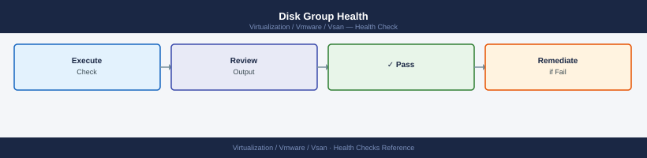

---
tags:
  - operations
  - vmware
  - vsan
  - vsphere-8
description: "Health Checks reference covering Weekly Checks, Performance Baseline, Network Health, Stretched Cluster Checks, Change Readiness."
---
# vSAN — Health Checks

<div class="kb-summary">
Health Checks reference covering Weekly Checks, Performance Baseline, Network Health, Stretched Cluster Checks, Change Readiness.

*Applies to: vSAN 7.x / 8.x*
</div>

## Before you begin

- **Access:** vCenter read-only minimum; Administrator role for remediation steps
- **Timing:** safe to run during business hours unless a step is marked ⚠ (causes interruption)
- **Dependencies:** no active upgrades or migrations on the same infrastructure
- **Logging:** capture command output — paste into the change record on completion

---

## Run This Routine

Paste this block into an ESXi host shell to get a full cluster health snapshot in under 2 minutes. Run from any host in the cluster.

```bash
echo "=== 1. Cluster membership ==="
esxcli vsan cluster get | grep -E "Member|Master|Sub-Cluster UUID|Health"

echo "=== 2. Overall health tests ==="
esxcli vsan health cluster get | grep -E "TestName|Health:" | grep -v "PASS"

echo "=== 3. Disk group state ==="
esxcli vsan storage list | grep -E "Disk Group UUID|Is SSD|Health|State|Tier"

echo "=== 4. Object health summary ==="
esxcli vsan debug object list | grep -v healthy | wc -l
echo "unhealthy objects (0 = all good)"

echo "=== 5. Resync queue ==="
esxcli vsan debug resync summary get

echo "=== 6. Capacity ==="
esxcli vsan storage list | grep -E "Used Capacity|Total Capacity|Free Capacity"

echo "=== 7. Non-compliant policy check ==="
esxcli vsan debug object list | grep -i "non-compliant"

echo "=== 8. Network MTU test (update IPs) ==="
vmkping -I vmk2 -d -s 8972 <host2-vsan-ip> -c 3 | grep -E "loss|received"
vmkping -I vmk2 -d -s 8972 <host3-vsan-ip> -c 3 | grep -E "loss|received"

echo "=== 9. NIC error check ==="
esxcli network nic stats get -n vmnic2 | grep -E "Errors|Dropped"

echo "=== Done ==="
```


```text title="Expected output"
=== 1. Cluster membership ===
Member: esx-node-01.lab.local
Member: esx-node-02.lab.local
Member: esx-node-03.lab.local
Master: esx-node-01.lab.local
Sub-Cluster UUID: 52d4a8c1-7f2e-4a9b-b1c3-8e9f2d5c6a7b
Health: Healthy

=== 2. Overall health tests ===
TestName: Network MTU
Health: FAIL
TestName: Congestion
Health: WARN

=== 3. Disk group state ===
Disk Group UUID: 5a8c3f1e-2b9d-4c7a-9e1f-3d6b8a2c5e7f
Is SSD: true
Health: Healthy
State: Enabled
Tier: All-Flash

Disk Group UUID: 6b9d4g2f-3c0e-5d8b-0f2g-4e7c9b3d6f8g
Is SSD: false
Health: Healthy
State: Enabled
Tier: Capacity

=== 4. Object health summary ===
3
unhealthy objects (0 = all good)

=== 5. Resync queue ===
Resync Queue Length: 12
Resync Rate (MB/s): 45.2
Estimated Time Remaining: 18 minutes

=== 6. Capacity ===
Used Capacity: 2.8 TB
Total Capacity: 8.6 TB
Free Capacity: 5.8 TB

=== 7. Non-compliant policy check ===
Object: vsan:6384e8c1-2f5a-b8d3-92c4-001569c3d8e1 - Policy: RAID-1 (Non-Compliant - 1 replica missing)
Object: vsan:7495f9d2-3g6b-c9e4-03d5-002670d4e9f2 - Policy: RAID-5 (Non-Compliant - degraded)

=== 8. Network MTU test (update IPs) ===
3 packets transmitted, 3 received, 0% loss
3 packets transmitted, 3 received, 0% loss

=== 9. NIC error check ===
Errors: 0
Dropped: 0

=== Done ===
```

!!! warning "Common errors"
    **`command: line 1: esxcli: command not found`** — Run this script directly on an ESXi host via SSH or vSphere CLI, not from a remote management station.
    **`VSAN health cluster get: Unknown command or namespace`** — Verify vSAN is licensed and enabled on the cluster; run `esxcli vsan cluster get` first to confirm vSAN is active.
    **`vmkping: Unknown host <host2-vsan-ip>`** — Replace `<host2-vsan-ip>` and `<host3-vsan-ip>` with actual vSAN VMkernel IP addresses (e.g., 192.168.10.52).
**What to look for:**

| Section | Green | Investigate |
|---|---|---|
| Cluster membership | All hosts listed, one master | Any host missing |
| Health tests | All PASS | Any FAIL or WARN |
| Disk group state | All Healthy | Degraded or Error |
| Unhealthy objects | 0 | > 0 |
| Resync queue | 0 bytes remaining | > 0 — note ETA |
| Capacity | Used < 70% | > 70% — plan expansion |
| Non-compliant | No output | Any — see Procedures → Remediate |
| MTU test | 0% loss | Any loss — check switch MTU |
| NIC errors | 0 errors, 0 drops | Non-zero — check cabling |

---

## Disk Group Health



```bash
# List all disk groups — cache and capacity disks per host
esxcli vsan storage list | grep -E "Is SSD|Disk Group UUID|naa\.|Display Name|Tier|Health"

# Check SMART data on a specific disk (replace naa with actual device ID)
esxcli storage core device smart get -d naa.xxxxxxxxxxxxxxxx
# Reallocated Sectors, Pending Sectors, Uncorrectable Errors — any non-zero = failing disk

# Check for LSOM disk errors in kernel log
grep -i "lsom\|diskgroup" /var/log/vmkernel.log | grep -i "err\|fail" | tail -20

# Disk group congestion (should be 0 per group)
esxcli vsan debug disk list | grep -i "congestion\|Disk Group"
```


```text title="Expected output"
Is SSD: true
Disk Group UUID: 564d5c6b-a1f2-4e8c-9d3a-7b2c1e9f5a4d
Display Name: naa.5001405a1b2c3d4e
Tier: Cache
Health: Healthy
Is SSD: false
Disk Group UUID: 564d5c6b-a1f2-4e8c-9d3a-7b2c1e9f5a4d
Display Name: naa.6006048b1a2b3c4d
Tier: Capacity
Health: Healthy

SMART Information for Device naa.5001405a1b2c3d4e:
   Reallocated Sectors: 0
   Pending Sectors: 0
   Uncorrectable Errors: 0
   Power On Hours: 12847
   Temperature: 38C

2024-01-15T09:23:14.567Z cpu2:2048)LSOM: [lsom-diskgroup-uuid:564d5c6b-a1f2-4e8c-9d3a-7b2c1e9f5a4d] Disk naa.6006048b1a2b3c4d recovered from transient error
2024-01-15T10:45:22.891Z cpu5:4096)LSOM: Diskgroup health check passed

Disk Group: 564d5c6b-a1f2-4e8c-9d3a-7b2c1e9f5a4d
   Congestion: 0
   Disk Group Status: Healthy
```

!!! warning "Common errors"
    **`Error: Unknown command or namespace vsan storage list`** — Verify vSAN is licensed and enabled on the cluster, then run `esxcli vsan cluster get` to confirm vSAN status.
    **`SMART Information for Device naa.xxxxxxxxxxxxxxxx: Device not found`** — Replace the placeholder naa ID with an actual device from the first command's output (e.g., `naa.5001405a1b2c3d4e`).
**Disk states to know:**

| State | Meaning | Action |
|---|---|---|
| Healthy | Normal operation | None |
| Degraded | Disk group has a failed component | Replace disk within 60 min window |
| Absent | Component temporarily missing (host rebooted etc.) | Wait 60 min; if no recovery, replace |
| Error | LSOM-level I/O error on disk | Immediate — check SMART data, replace |

---

## Object Health


```bash
# Count of objects by health state
esxcli vsan debug object list | awk '{print $NF}' | sort | uniq -c | sort -rn

# List all non-healthy objects with UUIDs
esxcli vsan debug object list | grep -v "Healthy"

# Show detail for a specific object (get UUID from above)
esxcli vsan debug object get -u <object-uuid>

# List all absent components (quick degradation indicator)
esxcli vsan debug component list | grep -i "absent"

# Resync detail — which objects are currently rebuilding
esxcli vsan debug resync list
```


```text title="Expected output"
8 Healthy
      2 Degraded
      1 Absent
Non-Healthy Objects:
52d4a8f0-1234-5678-abcd-ef0123456789 Degraded
7f8c9d1a-2345-6789-bcde-f01234567890 Absent

Object UUID: 52d4a8f0-1234-5678-abcd-ef0123456789
Health: Degraded
Policy: raid1 (2 replicas)
Components: 2
  Component 1: Present (Host: esx-prod-01.local)
  Component 2: Absent (Host: esx-prod-02.local)
Resync Progress: 45%

Absent Components:
52d4a8f0-1234-5678-abcd-ef0123456789.1 Absent (esx-prod-02.local)
7f8c9d1a-2345-6789-bcde-f01234567890.0 Absent (esx-prod-03.local)

Current Resync Operations:
Object UUID: 52d4a8f0-1234-5678-abcd-ef0123456789
Progress: 67%
Estimated Time: 12m 34s
Object UUID: 9a1b2c3d-4567-89ab-cdef-0123456789ab
Progress: 23%
Estimated Time: 45m 18s
```

!!! warning "Common errors"
    **`Unknown command or namespace vsan debug object`** — Ensure VSAN is enabled on the cluster and you are running this command on a VSAN-enabled ESXi host with proper permissions.
    **`Object UUID not found: <object-uuid>`** — Verify the UUID is correct and copied completely without whitespace; use the grep output directly or wrap the UUID in quotes.
    **`Permission denied`** — Run the command with root privileges or ensure your account has the Administrator role in vCenter for the VSAN cluster.
**Object states:**

| State | Meaning | Action |
|---|---|---|
| Healthy | Policy met, all components accessible | None |
| Degraded | One component lost; no redundancy | Monitor — rebuild should start within 60 min |
| Absent | Component host is offline temporarily | Wait for host to return; set repair timer appropriately |
| Non-compliant | Policy cannot be met (capacity/host count) | See Procedures → Remediate Non-Compliant Objects |
| Inaccessible | All copies unavailable — VMs offline | P1 — escalate immediately |

---

## Skyline Health Categories


Skyline Health in vCenter groups all checks into categories. The most important ones:

**From vCenter UI:** Cluster → Monitor → vSAN → Skyline Health

| Category | Key checks | Common failures |
|---|---|---|
| Cluster | Cluster membership, software version, time config | Host disconnected, version mismatch, NTP drift |
| Network | MTU, multicast/unicast, host connectivity | MTU mismatch on switch, vmk tag missing |
| Physical disk | Capacity remaining, disk health, HCL status | Disk not on HCL, capacity > 75%, SMART warn |
| Data | Object health, policy compliance, resync | Non-compliant VMs, high resync queue |
| Performance | Latency, IOPS, throughput baseline | Cache pressure, congestion > 0 |
| vSAN build recommendation | Known issues for current version | Apply recommended patches |
| Limits | Hosts, disk groups, VMs per cluster | Approaching vSAN cluster maximums |
| Encryption | KMS connectivity, key status | KMS unreachable, key rotation needed |

Run `Get-VsanClusterHealthSummary -Cluster (Get-Cluster "VSAN-LON-01") -FetchFromCache:$false` in PowerCLI for a full programmatic health report.

---

## Performance Baseline


Normal operating ranges for a healthy vSAN cluster. Values vary by workload — establish a baseline during steady-state and alert on deviation.

| Metric | Typical Healthy Range | Investigate If |
|---|---|---|
| Read latency (all-flash OSA) | < 1 ms | > 5 ms sustained |
| Write latency (all-flash OSA) | < 2 ms | > 10 ms sustained |
| Read latency (ESA) | < 0.5 ms | > 2 ms sustained |
| Write latency (ESA) | < 1 ms | > 5 ms sustained |
| Cache read hit ratio (OSA) | > 90% (all-flash has no read cache — N/A) | < 70% on hybrid OSA |
| Resync throughput | 0 MB/s during steady state | > 0 sustained without active maintenance |
| Congestion | 0 | Any non-zero value |

```bash
# Per-host latency and IOPS from ESXi shell
esxcli vsan perf query -e host-domclient -st 2024-01-01T00:00:00
```


```text title="Expected output"
Host: esx-01.lab.local
  Timestamp: 2024-01-01T00:00:00Z
  Read Latency (ms): 2.34
  Write Latency (ms): 3.12
  Read IOPS: 8456
  Write IOPS: 5623
  Read Throughput (MB/s): 342.1
  Write Throughput (MB/s): 218.7

Host: esx-02.lab.local
  Timestamp: 2024-01-01T00:00:00Z
  Read Latency (ms): 2.18
  Write Latency (ms): 2.89
  Read IOPS: 9124
  Write IOPS: 6012
  Read Throughput (MB/s): 365.4
  Write Throughput (MB/s): 241.3

Host: esx-03.lab.local
  Timestamp: 2024-01-01T00:00:00Z
  Read Latency (ms): 3.45
  Write Latency (ms): 4.67
  Read IOPS: 7234
  Write IOPS: 4891
  Read Throughput (MB/s): 289.6
  Write Throughput (MB/s): 195.2
```

!!! warning "Common errors"
    **`Error: vSAN performance service not ready`** — Wait 2-3 minutes after cluster formation or reboot for the vSAN performance service to initialize, then retry the query.
    **`Error: Invalid entity type 'host-domclient'`** — Verify the entity type with `esxcli vsan perf query --help` and use a valid option such as `host-domclient`, `host-storage-adapter`, or `vsan-cluster`.
    **`Error: No data available for the specified time range`** — Ensure the timestamp is within the last 24 hours of collected metrics and that vSAN performance monitoring is enabled on the cluster.
---

## Network Health


| Check | Command | Expected Result |
|---|---|---|
| MTU end-to-end (9000) | `vmkping -I vmk2 -d -s 8972 <remote-vmk-ip>` | 100% success; any loss = MTU mismatch |
| vSAN vmkernel reachability | `vmkping -I vmk2 <remote-vmk-ip>` | Reachable from all hosts to all hosts |
| NIOC reservation (if shared NICs) | vCenter → vDS → Configure → Network I/O Control | vSAN ≥ 50%, NSX TEP ≥ 25%, vMotion ≥ 25% |
| vSAN network latency | vCenter → vSAN → Monitor → Skyline Health → Network | All inter-host latency < 1 ms |

```bash
# Run from each host — test against all other vSAN vmk IPs
vmkping -I vmk2 -d -s 8972 <host2-vsan-ip>
vmkping -I vmk2 -d -s 8972 <host3-vsan-ip>
```


```text title="Expected output"
PING 192.168.100.52 (192.168.100.52): 8972 data bytes
8980 bytes from 192.168.100.52: icmp_seq=0 ttl=64 time=1.234 ms
8980 bytes from 192.168.100.52: icmp_seq=1 ttl=64 time=1.156 ms
8980 bytes from 192.168.100.52: icmp_seq=2 ttl=64 time=1.289 ms
8980 bytes from 192.168.100.52: icmp_seq=3 ttl=64 time=1.198 ms
--- 192.168.100.52 statistics ---
4 packets transmitted, 4 packets received, 0% packet loss
round-trip min/avg/max = 1.156/1.219/1.289 ms

PING 192.168.100.53 (192.168.100.53): 8972 data bytes
8980 bytes from 192.168.100.53: icmp_seq=0 ttl=64 time=2.412 ms
8980 bytes from 192.168.100.53: icmp_seq=1 ttl=64 time=2.367 ms
8980 bytes from 192.168.100.53: icmp_seq=2 ttl=64 time=2.445 ms
8980 bytes from 192.168.100.53: icmp_seq=3 ttl=64 time=2.389 ms
--- 192.168.100.53 statistics ---
4 packets transmitted, 4 packets received, 0% packet loss
round-trip min/avg/max = 2.367/2.403/2.445 ms
```

!!! warning "Common errors"
    **`PING <host2-vsan-ip> (<host2-vsan-ip>): sendto: No route to host`** — Verify vmk2 is configured on the vSAN network and the target IP is reachable; check routing table with `esxcli network ip route ipv4 list`.
    **`PING <host2-vsan-ip> (<host2-vsan-ip>): 0 packets transmitted, 0 packets received, 100% packet loss`** — Confirm vmk2 interface is up with `esxcli network ip interface list` and verify vSAN network VLAN is correctly tagged on the switch port.
    **`vmkping: Unknown interface vmk2`** — Create or enable vmk2 on the vSAN network using vSphere Client or `esxcli network ip interface add -i vmk2 -p <vsan-portgroup>`.
---

## Stretched Cluster Checks


Run these in addition to standard daily/weekly checks when managing a stretched cluster.

| Check | Command / Location | Notes |
|---|---|---|
| Witness reachability | vCenter → vSAN → Configure → Fault Domains | Witness must show Connected |
| Site balance | vCenter → vSAN → Monitor → Virtual Objects | Objects should have one component per site + witness |
| Inter-site latency | vCenter → vSAN → Monitor → Skyline Health → Network | Must be < 5 ms RTT; < 1 ms for latency-sensitive workloads |
| VM affinity alignment | vCenter → Cluster → Configure → VM/Host Groups | Confirm production VMs pinned to preferred site |
| Preferred site designation | vCenter → vSAN → Configure → Fault Domains | Confirm preferred site is set correctly |

```powershell
# Check witness appliance connectivity
Get-VsanView -Id "VsanVcStretchedClusterSystem-vsan-stretched-cluster-system" | %{$_.GetWitnessHosts($_.MoRef)}
```

---

## Change Readiness

Run before any host maintenance, upgrade, or cluster configuration change.

| Item | Status | Command / Location |
|---|---|---|
| All health tests green | | `Get-VsanClusterHealthSummary` |
| No active resync | | vCenter → vSAN → Resyncing Objects |
| Disk group capacity < 70% per host | | vCenter → vSAN → Monitor → Capacity |
| No other hosts in maintenance mode | | One host at a time only |
| Full data migration selected | | Select "Full Data Migration" — not "Ensure Accessibility" |
| Change window approved | | Ticket reference |

- [ ] All vSAN health tests green before any host maintenance
- [ ] No active resync in progress — wait for resync to complete first
- [ ] Disk group capacity headroom confirmed — at least 30% free per host
- [ ] No hosts currently in maintenance mode
- [ ] Full data migration selected when putting host into maintenance
- [ ] Change window approved; storage admin and compute team notified

---

## See also

- [vSAN — Common Issues](../../troubleshooting/common-issues/)
- [vSAN — Procedures](../procedures/)
- [vSAN Operations — CLI Reference](../cli-reference/)

## Verify

- **Alarms:** vSphere Client → Home → Alarms — no new critical alarms after the operation
- **Events:** monitor the vCenter Events view for the affected object for 5 minutes
- **Health check:** run the morning health-check sequence for the affected product tier
