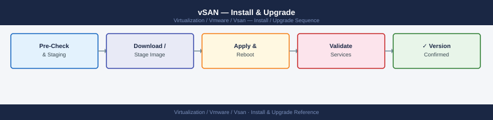

---
tags:
  - operations
  - vmware
  - vsan
  - vsphere-8
description: "Install & Upgrade reference covering ESA Migration, Driver and Firmware."
---
# vSAN — Install & Upgrade

<div class="kb-summary">
Install & Upgrade reference covering ESA Migration, Driver and Firmware.

*Applies to: vSAN 7.x / 8.x*
</div>


## Before you begin

- **Access:** vCenter read-only minimum; Administrator role for remediation steps
- **Timing:** safe to run during business hours unless a step is marked ⚠ (causes interruption)
- **Dependencies:** no active upgrades or migrations on the same infrastructure
- **Logging:** capture command output — paste into the change record on completion

---

!!! warning "Host enters maintenance mode"
    ESXi remediation puts hosts into maintenance mode, triggering DRS evacuation. Confirm DRS is Fully Automated and HA admission control is satisfied before starting.

## Upgrade Procedure

All health checks must pass before beginning an upgrade. Resolve any degraded objects or active resyncs before proceeding.

**Upgrade sequence:**

1. Upgrade vCenter Server first (never upgrade ESXi before vCenter on a vSAN cluster).
2. Update vLCM cluster image baseline to the target ESXi version.
3. Remediate one host at a time via vLCM. vLCM will:
   - Place the host in maintenance mode with the "Ensure Accessibility" or "Full Data Migration" option.
   - Validate vSAN health before and after each host.
   - Upgrade ESXi and NVMe/disk controller drivers in a single reboot.
4. Verify vSAN health after each host remediation before proceeding to the next.

**FTT requirement during upgrade:**

vSAN must maintain policy compliance throughout the upgrade. With FTT=1, one host is in maintenance at a time — the cluster needs at least 3 remaining healthy hosts. With FTT=2, at least 5 hosts must remain healthy while one is in maintenance.

If the cluster does not have sufficient hosts to maintain FTT during the upgrade, either:
- Temporarily change the storage policy to a lower FTT (accept reduced protection).
- Add hosts before upgrading.

**Post-upgrade validation:**

```bash
# Verify all hosts on new build
esxcli system version get

# Verify vSAN health
esxcli vsan health cluster list

# Check object compliance
esxcli vsan debug object list | grep -i noncompliant
```


```text title="Expected output"
Product: VMware ESXi
Version: 7.0.3
Build: 19193900
Update: 3
Patch: ESXi700-202301001

Cluster Health Status: Healthy
Overall Health: green
Data Health: green
Memory Health: green
Network Health: green
Physical Disk Health: green
Disk Format Version: 13

(no output — all objects compliant)
```

!!! warning "Common errors"
    **`Unknown command or namespace vsan health cluster`** — Verify vSAN is licensed and enabled on the cluster; run `esxcli vsan cluster get` instead if using older ESXi versions.
    **`Error: Unknown command or namespace vsan debug object`** — Enable vSAN debug mode with `esxcli vsan debug object list` requires elevated privileges; run the command on the vSAN cluster coordinator host.
## ESA Migration

The Express Storage Architecture (ESA) introduced in vSAN 8.0 is not an in-place upgrade from OSA. Migration requires a new cluster build.

**Migration options:**

1. **Build a new ESA cluster** in the same vCenter and Storage vMotion VMs from the OSA cluster to the ESA cluster. This is the recommended approach for minimal downtime.
2. **Site-level failover** (for stretched clusters): fail over to one site, rebuild the other as ESA, then fail back and rebuild the original site.
3. **Backup and restore** via Veeam or another backup tool: restore VMs to the new ESA cluster.

ESA requires:
- vSphere 8.0 or later.
- NVMe devices on the ESA-specific HCL (different from OSA HCL).
- Minimum 4 hosts.
- All hosts in the cluster must use ESA; mixed OSA/ESA is not supported.

## Driver and Firmware

vSAN is highly sensitive to disk controller driver versions. Use only hardware on the VMware HCL and only the driver versions certified for the specific controller and vSAN version.

```bash
# Check disk controller driver version
esxcli software vib list | grep -i <controller-name>

# Check device/firmware info
esxcli storage core device list
```


```text title="Expected output"
Name                           Version                Install Date
lsi-mr3                        7.715.06.00-1OEM.700.1.0.15160138  2024-01-15
bnx2x                          20.2.592.0v-1OEM.700.1.0.15160138   2024-01-15

t10.ATA_____SAMSUNG_SSD_870_QVO_1TB__________________S5YTNF0N123456AB
   Display Name: Samsung SSD 870 QVO 1TB
   Has Settable Display Name: true
   Size: 1099511627776
   Device Type: Direct-Access
   Multipath Plugin: NMP
   Devfs Path: /vmfs/devices/disks/t10.ATA_____SAMSUNG_SSD_870_QVO_1TB__________________S5YTNF0N123456AB
   Vendor: ATA
   Model: SAMSUNG SSD 870
   Revision: EMT04B6Q
   SCSI Level: 5
   Is SSD: true
   Is Local: true
   Is Removable: false
   Is RDM Capable: false
   Firmware Version: EMT04B6Q
```

!!! warning "Common errors"
    **`grep: (standard input): No such file or directory`** — Verify the ESXi host is accessible and esxcli is properly configured by running `esxcli system version get` first.
    **`Error: Unknown option or esxcli not found`** — Ensure you are running this command directly on an ESXi host or via SSH with proper vSphere CLI tools installed on a remote system.
**vLCM with hardware support manager:** If the server vendor (Dell, HPE, Lenovo) provides a vSphere Lifecycle Manager Hardware Support Manager plugin, use it to manage firmware and driver updates alongside ESXi updates in a single vLCM image. This ensures certified driver/firmware combinations are applied together.

**Key rule:** Never apply an ESXi patch without also verifying that the disk controller driver version in the vLCM image is HCL-certified for vSAN. Mismatched drivers are a leading cause of disk group failures post-upgrade.

---

## See also

- [vSAN — Health Checks](../health-checks/)
- [vSAN — Common Issues](../../troubleshooting/common-issues/)
- [vSAN — Procedures](../procedures/)

## Verify

- **Alarms:** vSphere Client → Home → Alarms — no new critical alarms after the operation
- **Events:** monitor the vCenter Events view for the affected object for 5 minutes
- **Health check:** run the morning health-check sequence for the affected product tier
