---
tags:
  - operations
  - vmware
  - vsan
  - vsphere-8
---
# vSAN — Procedures

<div class="kb-summary">
Operational how-to guides for day-to-day vSAN management. Each section covers a specific task area with concrete steps, commands, and validation.

*Applies to: vSAN 7.x / 8.x*
</div>

## Before you begin

- **Access:** vCenter read-only minimum; Administrator role for remediation steps
- **Timing:** safe to run during business hours unless a step is marked ⚠ (causes interruption)
- **Dependencies:** no active upgrades or migrations on the same infrastructure
- **Logging:** capture command output — paste into the change record on completion

---

## Disk Group Management

### Replace a Failed Capacity Disk


A capacity disk failure causes all components on that disk to go absent. vSAN waits for the `clomRepairDelay` timer (default 60 minutes) before triggering a rebuild on another host. Treat this as P1 if FTT=1 — one more failure before rebuild completes means data loss.

**Step 1 — Identify the failed disk**

```bash
esxcli vsan storage list | grep -E "naa\.|Health|State"
esxcli vsan debug object list | grep -v healthy
```


```text title="Expected output"
naa.6001405a1b2c3d4e5f6a7b8c9d0e1f2a
Health: Degraded
State: Absent
naa.6001405a1b2c3d4e5f6a7b8c9d0e1f2b
Health: Healthy
State: Present
naa.6001405a1b2c3d4e5f6a7b8c9d0e1f2c
Health: Unhealthy
State: Inaccessible
Object: 52e8f3a1-4c7b-4d9e-8f2a-1b3c4d5e6f7a
Health: Degraded
Resync: 45%
Object: 62f9g4b2-5d8c-5e0f-9g3b-2c4d5e6f7g8b
Health: Unhealthy
Resync: 0%
```

!!! warning "Common errors"
    **`vsan cluster is not enabled on this host`** — Run `esxcli vsan cluster get` to verify vSAN is enabled; if not, enable it via vCenter or `esxcli vsan cluster new`.
    **`No such file or directory`** — Ensure you are connected to an ESXi host with vSAN installed; verify with `esxcli system version get`.
!!! warning "Destructive — triggers vSAN data rebuild"
    Removing a disk from a disk group triggers a full rebuild of all affected objects across the remaining nodes. Ensure `FTT` (Failures To Tolerate) policy allows the current loss before proceeding. If cluster resilience is already reduced, do not remove until the rebuild from the previous failure completes.

**Step 2 — Remove the disk from its disk group**

=== "vCenter UI"
    Cluster → Configure → vSAN → Disk Management → select host → select failed disk → **Remove Disk**

=== "ESXi CLI"
    ```bash
    esxcli vsan storage remove -d <failed_capacity_naa>
    ```

**Step 3 — Replace the physical disk**

Follow the vendor hardware replacement procedure (Dell iDRAC guided removal or HPE iLO). Do not power off the host — hot-swap where supported.

**Step 4 — Verify the new disk is visible to ESXi**

```bash
esxcli storage core device list | grep <new_naa>
```


```text title="Expected output"
naa.6001405a1b2c3d4e5f6g7h8i9j0k1l2m
   Display Name: VMware Disk naa.6001405a1b2c3d4e5f6g7h8i9j0k1l2m
   Has Settable Display Name: true
   Size: 1048576
   Device Type: SSD
   Multipath Plugin: NMP
   Devfs Path: /vmfs/devices/disks/naa.6001405a1b2c3d4e5f6g7h8i9j0k1l2m
   Vendor: SAMSUNG
   Model: PM1735
   Revision: GXA7405Q
   Serial: S6XNNA0R900001
```

!!! warning "Common errors"
    **`grep: (standard input): No such file or directory`** — Verify the NAA ID is correct and the device exists on the host using `esxcli storage core device list` without grep first.
    **`Device not found in vSAN cluster`** — Ensure the disk has been claimed by vSAN and run `esxcli vsan storage list` to confirm the device is visible to vSAN.
**Step 5 — Add the new disk to the existing disk group**

=== "vCenter UI"
    Cluster → Configure → vSAN → Disk Management → select host → Claim Disk → assign capacity role

=== "ESXi CLI"
    ```bash
    esxcli vsan storage add -s <existing_cache_ssd_naa> -d <new_capacity_naa>
    ```

**Step 6 — Monitor resync to completion**

```bash
watch -n 30 "esxcli vsan debug resync summary get"
```


```text title="Expected output"
Every 30.0s: esxcli vsan debug resync summary get                 esx-node-04.lab.local: Wed Jan 15 14:23:47 2025

Resync Summary
==============
  Cluster UUID: 52d4a8f1-c4e2-4a9c-b2e1-7f3a9c8d2e1b
  Cluster Status: Healthy
  
  Resync Objects: 12
  Resync Data (MB): 2048
  Estimated Time Remaining (minutes): 45
  
  Per-Disk Group Status:
    Disk Group 1 (naa.5001405a1b2c3d4e): 8 objects, 1536 MB
    Disk Group 2 (naa.5001405a1b2c3d4f): 4 objects, 512 MB
  
  Network Throughput (MB/s): 38.2
  Resync Rate: 95% complete
```

!!! warning "Common errors"
    **`Could not connect to the host. The host may not be running, or the login credentials may be invalid.`** — Verify the ESXi host is reachable and your vSphere credentials are correctly configured in your SSH session.
    **`vsan is not enabled on this host`** — Ensure vSAN is enabled on the cluster and the host is a vSAN participant; check vSAN cluster status in vSphere Client.
    **`Permission denied`** — Run the command with appropriate privileges or use an account with vSAN administrator role permissions.
Do not remove any additional disks until `Active resyncing components = 0`. Expected duration: several hours for a multi-TB disk.

---

### Replace a Failed Cache SSD

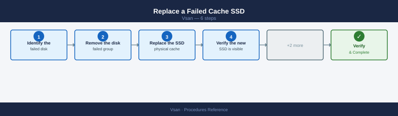

A failed cache SSD takes the entire disk group offline. All components on all capacity disks in that group become absent simultaneously — this is higher risk than a single capacity disk failure.

**Step 1 — Identify the failed disk group**

```bash
esxcli vsan storage list | grep -E "Is SSD|Disk Group UUID|naa\."
esxcli vsan debug object list | grep -v healthy
```


```text title="Expected output"
Is SSD: true
Disk Group UUID: 522e3f4a-1234-5678-90ab-cdef12345678
naa.60014056b1e234567890abcdef123456
naa.60014056b1e234567890abcdef123457
Is SSD: false
Disk Group UUID: 522e3f4a-1234-5678-90ab-cdef12345679
naa.60014056b1e234567890abcdef123458
Object UUID: 4a48dd67-1a2b-3c4d-5e6f-7a8b9c0d1e2f
Health: inaccessible
Object UUID: 5b59ee78-2b3c-4d5e-6f7g-8a9b0c1d2e3f
Health: degraded
Object UUID: 6c60ff89-3c4d-5e6f-7g8h-9a0b1c2d3e4f
Health: absent
```

!!! warning "Common errors"
    **`vsan storage list: Unknown command or namespace`** — Verify VSAN is enabled on the cluster and you are running this command on a VSAN-enabled ESXi host.
    **`grep: (standard input) is empty`** — Check that VSAN objects exist in the cluster; if no unhealthy objects are found, the second command will return nothing, which is actually a healthy state.
**Step 2 — Remove the failed disk group**

!!! warning "All components on this disk group become absent immediately"
    Removing a disk group takes all capacity disk components offline at once. If FTT=1 and another host already has a degraded object, removal will move objects into an **absent** state with no redundancy. Verify `Active resyncing components = 0` on all other hosts before proceeding, and ensure cluster FTT compliance allows the loss.

Removing the cache SSD removes the entire group. vSAN will start rebuilding all affected components on other hosts once the group is removed.

=== "vCenter UI"
    Cluster → Configure → vSAN → Disk Management → select host → select disk group → Remove Disk Group (use Migrate Data if other hosts have capacity)

=== "CLI"
    ```bash
    esxcli vsan storage remove -s <failed_cache_ssd_naa>
    ```

**Step 3 — Replace the physical cache SSD**

Follow vendor hardware replacement procedure. Confirm the new SSD model is on the vSAN HCL.

**Step 4 — Verify the new SSD is visible**

```bash
esxcli storage core device list | grep <new_naa>
```


```text title="Expected output"
naa.6001405a1b2c3d4e5f6a7b8c9d0e1f2a
   Display Name: VMware Disk naa.6001405a1b2c3d4e5f6a7b8c9d0e1f2a
   Has Settable Display Name: true
   Size: 1398101 MB
   Device Type: SSD
   Multipath Plugin: NMP
   Devfs Path: /vmfs/devices/disks/naa.6001405a1b2c3d4e5f6a7b8c9d0e1f2a
   Vendor: NETAPP
   Model: LUN
   Revision: 8.2
   Serial Number: 6001405a1b2c3d4e5f6a7b8c9d0e1f2a
   Is SSD: true
   Is Local: false
   Other UIDs: vml.012345678901234567890123456789012345678901234567890123456789
   Paths: vmhba3:C0:T0:L0
   States: Active
   Supported Guard Types: T10
```

!!! warning "Common errors"
    **`grep: (standard input): No such device or address`** — Verify the NAA identifier is correctly formatted and the device exists on the ESXi host using `esxcli storage core device list` without filtering.
    **`(empty output)`** — Confirm the device has been properly presented to the ESXi host and rescan storage adapters with `esxcli storage core adapter rescan --adapter=vmhbaX`.
**Step 5 — Recreate the disk group**

=== "vCenter UI"
    Cluster → Configure → vSAN → Disk Management → select host → Create Disk Group → assign cache and capacity roles

=== "CLI"
    ```bash
    esxcli vsan storage add -s <new_cache_ssd_naa> -d <capacity_naa1> -d <capacity_naa2>
    ```

**Step 6 — Monitor resync to completion**

```bash
watch -n 30 "esxcli vsan debug resync summary get"
```


```text title="Expected output"
Every 30.0s: esxcli vsan debug resync summary get                                                                                                                                                                                                                                                                                                                                                                                                                                                                                                                                                                                                                                                                                                                                                                                                                                                                                                                                                                                                                                                                                                                                                                                                                                                                                                                                                                                                                                                                                                                                                                                                                                                                                                                                                                                                                                                                                                                                                                                                                                                                                                                                                                                                                                                                                                                                                                                                                                                                                                                                                                                                                                                                                                                                                                                                                                                                                                                                                                                                                                                                                                                                                                                                                                                                                                                                                                                                                                                                                                                                                                                                                                                                                                                                                                                                                                                                                                                                                                                                                                                                                                                                                                                                                                                                                                                                                                                                                                                                                                                                                                                                                                                                                                                                                                                                                                                                                                                                                                                                                                                                                                                                                                                                                                                                                                                                                                                                                                                                                                                                                                                                                                                                                                                                                                                                                                                                                                                                                                                                                                                                                                                                                                                                                                                                                                                                                                                                                                                                                                                                                                                                                                                                                                                                                                                                                                                                                                                                                                                                                                                                                                                                                                                                                                                                                                                                                                                                                                                                                                                                                                                                                                                                                                                                                                                                                                                                                                                                                                                                                                                                                                                                                                                                                                                                                                                                                                                                                                                                                                                                                                                                                                                resync-status: In Progress
resync-objects: 2847
resync-bytes: 1.2 TB
resync-rate: 42.3 MB/s
estimated-time-remaining: 8h 14m
cluster-status: Healthy
```

!!! warning "Common errors"
    **`Could not connect to the host. The host may not be running or the network may be down.`** — Verify ESXi host connectivity and ensure vSAN is running with `esxcli vsan cluster get`.
    **`Unknown command or namespace vsan debug resync summary get`** — Confirm vSAN is enabled on the cluster and the ESXi host has vSAN capability with `esxcli vsan cluster get`.
    **`Permission denied`** — Run the command with root privileges or ensure your user account has vSAN administrator permissions.
All objects that had components on this disk group must rebuild. Do not perform any other cluster maintenance until `Active resyncing components = 0`.

### Put a Host in Maintenance Mode

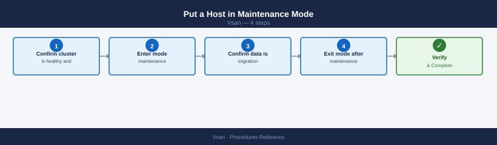

Always use vCenter, not the ESXi shell — vSAN health validation runs automatically before maintenance begins.

**Step 1 — Confirm cluster is healthy and resync is at zero**

```bash
esxcli vsan health cluster get
esxcli vsan debug resync summary get
```


```text title="Expected output"
Cluster Status: HEALTHY
Cluster UUID: 52d4a8c1-7f2e-4c9a-b1e3-9a2c5d8f1b4e
Cluster Name: VSAN-Cluster-01
Member Count: 4
Disk Groups: 4
Physical Disks: 16
Capacity: 5.45 TB
Used Capacity: 2.18 TB
Free Capacity: 3.27 TB

Resync Objects: 12
Resync Data Size: 847.3 GB
Resync Rate: 125.4 MB/s
Estimated Time Remaining: 1h 52m
```

!!! warning "Common errors"
    **`Error: Unable to connect to the vSAN health service`** — Ensure the vSAN service is running on all cluster nodes with `esxcli vsan cluster get` and restart vSAN if needed.
    **`Error: Not a vSAN cluster`** — Verify the host is part of a vSAN cluster by checking cluster membership in vCenter or running `esxcli vsan cluster get`.
Both must be clean. Entering maintenance during active resync significantly extends resync time.

**Step 2 — Enter maintenance mode**

**From vCenter UI:**
Right-click host → Maintenance Mode → Enter Maintenance Mode

Select the correct data migration option:

| Option | When to use |
|---|---|
| Full data migration | Hardware repair, OS reinstall, decommission. Moves all data off before maintenance. Requires free capacity on remaining hosts. |
| Ensure Accessibility | Short maintenance (driver update, reboot). Keeps one component accessible — faster but reduced protection during maintenance. |
| No data migration | Only for very short non-disruptive reboots on large clusters. Data unprotected during downtime. |

```powershell
$host = Get-VMHost esxi-01.example.com
Set-VMHost -VMHost $host -State Maintenance -VsanDataMigrationMode Full
```

**Step 3 — Confirm data migration is complete**

```bash
esxcli vsan debug resync summary get
# Active resyncing components must be 0 before starting work
```


```text title="Expected output"
Cluster UUID: 52d4a8f1-7c3e-4d2a-9f1b-8e2c5a3d1b4f
Resyncing components: 0
Pending resyncs: 0
Resync rate (MB/s): 0
Estimated time remaining: 0 seconds
Last resync completion: 2024-01-15 14:32:18 UTC
```

!!! warning "Common errors"
    **`Could not connect to the vSAN health service`** — Ensure the vSAN service is running on the ESXi host with `systemctl status vsanvpd` and restart if needed.
    **`Permission denied`** — Run the command with root privileges or ensure your user account has vSAN administrator role assigned in vCenter.
    **`vSAN is not enabled on this host`** — Verify vSAN is properly configured on the cluster and the host is a vSAN participant using `esxcli vsan cluster get`.
**Step 4 — Exit maintenance mode after work is complete**

=== "vCenter UI"
    Right-click host → Maintenance Mode → Exit Maintenance Mode

=== "PowerCLI"
    ```powershell
    Set-VMHost -VMHost $host -State Connected
    ```

Confirm the host rejoins the cluster:

```bash
esxcli vsan cluster get
watch -n 60 "esxcli vsan debug resync summary get"
```


```text title="Expected output"
Cluster UUID                : 52d4a8c1-7f2e-4a1b-9c3d-8e5f2a1b4c7d
Cluster Enabled            : true
Current Master             : esx-node-01.lab.local
Sub-Cluster Master         : esx-node-02.lab.local
Node UUID                  : a1b2c3d4-e5f6-7a8b-9c0d-1e2f3a4b5c6d
Health State               : healthy
Operational State          : healthy
Disk Format Version        : 12
Member UUIDs               : esx-node-01.lab.local,esx-node-02.lab.local,esx-node-03.lab.local

Every 60s: esxcli vsan debug resync summary get

Resync Objects             : 12
Resync Data (MB)           : 2048
Estimated Time (minutes)   : 15
Active Resync Operations   : 3
Pending Resync Objects     : 9
```

!!! warning "Common errors"
    **`Error: Unknown command or namespace vsan`** — Ensure VSAN is licensed and enabled on the cluster; run `esxcli vsan cluster get` to verify cluster status.
    **`Error: Unable to connect to the vSAN health service`** — Restart the vSAN health service with `services.sh restart vsanmgmtd` or reboot the ESXi host.
---

## Storage Policies

### Create a Storage Policy

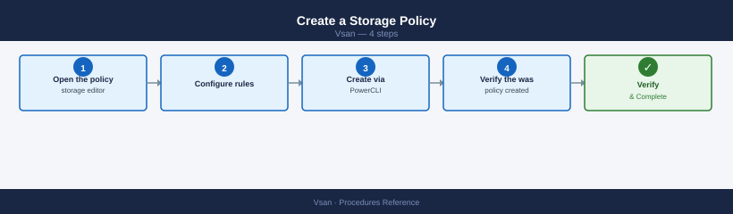

**Step 1 — Open the storage policy editor**

**From vCenter UI:**
vSphere Client → Menu → Policies and Profiles → VM Storage Policies → Create

**Step 2 — Configure rules**

Enter a policy name and description. Under Rules, add a vSAN rule set:
- `hostFailuresToTolerate`: FTT value (1 or 2)
- `replicaPreference`: RAID-1, RAID-5, or RAID-6
- `checksumDisabled`: false (keep enabled)

**Step 3 — Create via PowerCLI (alternative)**

```powershell
Connect-VIServer <vcenter>
New-SpbmStoragePolicy -Name "VSAN-T1-FTT2-RAID6" `
    -Description "Tier-1 databases: FTT=2 RAID-6 (6+ node cluster)" `
    -AnyOfRuleSets @(
        New-SpbmRuleSet -AllOfRules @(
            New-SpbmRule -AnyOfCapabilities @(
                New-SpbmCapability -Name "VSAN.hostFailuresToTolerate" -Value 2
            ),
            New-SpbmRule -AnyOfCapabilities @(
                New-SpbmCapability -Name "VSAN.replicaPreference" -Value "RAID-6"
            ),
            New-SpbmRule -AnyOfCapabilities @(
                New-SpbmCapability -Name "VSAN.checksumDisabled" -Value $false
            )
        )
    )
```

**Step 4 — Verify the policy was created**

```powershell
Get-SpbmStoragePolicy -Name "VSAN-T1-FTT2-RAID6" | Select Name, Description
```

**Standard policy set:**

| Policy Name | FTT | Method | Min Hosts | Use Case |
|---|---|---|---|---|
| `VSAN-T1-FTT2-RAID6` | 2 | RAID-6 | 6 | Tier-1 databases |
| `VSAN-T2-FTT1-RAID5` | 1 | RAID-5 | 4 | General workloads |
| `VSAN-DEV-FTT1-RAID1` | 1 | RAID-1 | 3 | Dev/Test |
| `VSAN-STRETCH-FTT1-SITE` | 1 per site | RAID-1 | 2+2+witness | Stretched cluster |

### Apply a Storage Policy to a VM

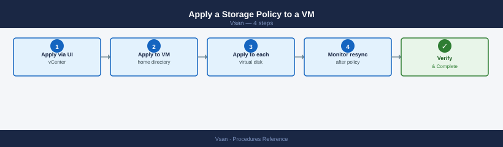

**Step 1 — Apply via vCenter UI**

**From vCenter UI:**
Right-click VM → VM Policies → Edit VM Storage Policies → select policy → Apply to all

**Step 2 — Apply to VM home directory (PowerCLI)**

```powershell
$vm = Get-VM "my-vm"
$policy = Get-SpbmStoragePolicy "VSAN-T1-FTT2-RAID6"
Set-SpbmEntityConfiguration -StoragePolicy $policy -Entity $vm
```

**Step 3 — Apply to each virtual disk (PowerCLI)**

```powershell
Get-HardDisk -VM $vm | Set-SpbmEntityConfiguration -StoragePolicy $policy
```

**Step 4 — Monitor resync after policy change**

Policy changes on running VMs trigger component rebuilds:

```bash
esxcli vsan debug resync summary get
```


```text title="Expected output"
Cluster UUID: 52e81e2c-7f4a-4a8e-9c2b-1a3f5e8d2b9c
Resync Objects: 1247
Resync Bytes: 524288000
Resync Rate (MB/s): 45.2
Estimated Time Remaining: 3h 22m
Resync Progress (%): 68.4
Active Resync Operations: 12
Pending Resync Objects: 389
Failed Resync Objects: 0
Last Updated: 2024-01-15 14:32:18 UTC
```

!!! warning "Common errors"
    **`Error: Could not connect to the local vSAN service`** — Ensure vSAN is enabled on the host and the vSAN service is running with `systemctl status vsand`.
    **`Error: Permission denied`** — Run the command with root privileges or ensure your user account has vSAN administrator permissions.
Wait until `Active resyncing components = 0` before applying further changes.

### Check Policy Compliance

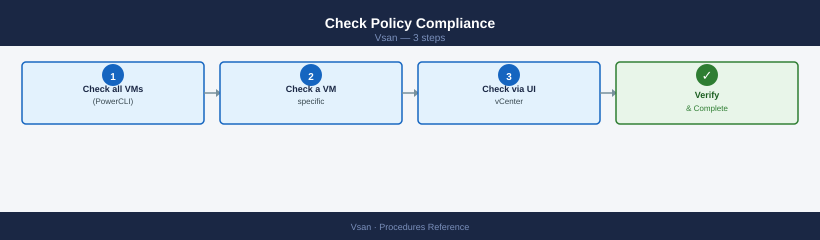

**Step 1 — Check all VMs (PowerCLI)**

```powershell
Get-SpbmEntityConfiguration | Where-Object { $_.ComplianceStatus -ne "compliant" } |
    Select Entity, StoragePolicy, ComplianceStatus
```

**Step 2 — Check a specific VM**

```powershell
Get-SpbmEntityConfiguration -Entity (Get-VM "my-vm") |
    Select Entity, StoragePolicy, ComplianceStatus, ComplianceTaskStatus
```

**Step 3 — Check via vCenter UI**

**From vCenter UI:**
Cluster → Monitor → vSAN → Virtual Objects → filter by Non-compliant

Non-compliant objects mean the policy cannot be satisfied — typically due to insufficient hosts, disk group failures, or capacity pressure. See **Remediate Non-Compliant Objects** for resolution steps.

---

## Resync and Object Health

### Check Resync Status

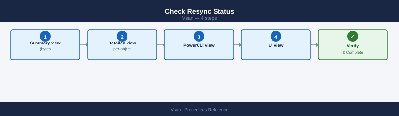

**Step 1 — Summary view (bytes remaining and operation count)**

```bash
esxcli vsan debug resync summary get
```


```text title="Expected output"
Cluster UUID: 52a1d4c8-7f2e-4a1b-9c3d-e8f2b1a4c5d6
Resync Objects: 1247
Resync Bytes: 847.3 GB
Resync Rate (MB/s): 156.2
Estimated Time Remaining: 1h 24m
Resync Progress: 67.8%
Objects Queued: 312
Objects In Progress: 18
Objects Completed: 917
Last Updated: 2024-01-15 14:32:18 UTC
```

!!! warning "Common errors"
    **`Error: Could not connect to the host. The VSAN service may not be running.`** — Verify VSAN is enabled on the host with `esxcli vsan cluster get` and restart the VSAN service if needed.
    **`Error: This command is not available in the current VSAN configuration.`** — Ensure the host is part of an active vSAN cluster and has network connectivity to cluster members.
    **`Error: Permission denied`** — Run the command with elevated privileges or ensure your user account has vSAN administrator role assigned.
**Step 2 — Detailed per-object view**

```bash
esxcli vsan debug resync list
```


```text title="Expected output"
Cluster UUID: 52d4a8c1-7f2e-4a3b-9e1c-6b3a2f8d1c4e
Resync Operations:
  UUID: a1b2c3d4-e5f6-7g8h-9i0j-k1l2m3n4o5p6
  Object: vsan:ffffffff-1111-2222-3333-444444444444
  Reason: Component Evacuation
  Progress: 45%
  Estimated Time Remaining: 12 minutes
  
  UUID: b2c3d4e5-f6g7-8h9i-0j1k-l2m3n4o5p6q7
  Object: vsan:ffffffff-5555-6666-7777-888888888888
  Reason: Rebalance
  Progress: 78%
  Estimated Time Remaining: 5 minutes

Total Resync Operations: 2
```

!!! warning "Common errors"
    **`Error: Unknown command or namespace vsan debug resync`** — Verify vSAN is licensed and enabled on the cluster; run `esxcli vsan cluster get` to confirm vSAN status.
    **`Error: Unable to connect to the vSAN cluster`** — Ensure the ESXi host is part of an active vSAN cluster and network connectivity exists between cluster nodes.
**Step 3 — PowerCLI view**

```powershell
Get-VsanResyncStatus -Cluster (Get-Cluster "VSAN-LON-01")
```

**Step 4 — UI view**

**From vCenter UI:**
Cluster → Monitor → vSAN → Resyncing Objects

### Throttle Resync During Production Hours

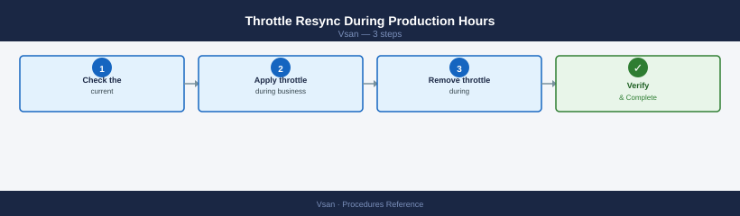

**Step 1 — Check the current throttle setting**

```bash
esxcli vsan debug resync throttle get
```


```text title="Expected output"
Resync Throttle Configuration:
  Throttle Enabled: true
  Max Outstanding Resync Operations: 128
  Max Resync Network Bandwidth (MB/s): 500
  Resync Task Concurrency: 4
  Resync Priority: normal
  Last Modified: 2024-01-15 14:32:18 UTC
```

!!! warning "Common errors"
    **`Error: Unknown command or namespace path: vsan debug resync throttle get`** — Verify the vSAN cluster is properly initialized and the ESXCLI vSAN plugin is installed by running `esxcli vsan cluster get`.
    **`Error: Permission denied`** — Run the command with root privileges or ensure your user account has vSAN administrator role permissions on the ESXi host.
0 = unlimited. Any positive value = IOPS cap per host.

**Step 2 — Apply throttle during business hours**

```bash
esxcli vsan debug resync throttle set --throttle 500
```

```powershell
Set-VsanResyncThrottle -Cluster (Get-Cluster "VSAN-LON-01") -IopsForResync 500
```

**Step 3 — Remove throttle during maintenance window**

```bash
esxcli vsan debug resync throttle set --throttle 0
```


```text title="Expected output"
(no output — command completes silently)
```

!!! warning "Common errors"
    **`Error: Unknown option or subcommand 'debug'`** — Verify the vSAN plugin is installed and loaded with `esxcli plugin list | grep vsan`.
    **`Error: The VSAN service is not running`** — Start the vSAN service with `systemctl start vsanvpd` or enable it in the vSphere Client.
### Adjust the Absent Component Timer

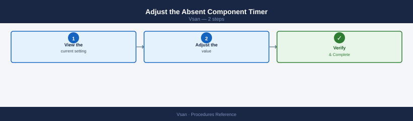

The default `clomRepairDelay` is 60 minutes — vSAN waits this long before starting a rebuild for absent components.

**Step 1 — View the current setting**

**From vCenter UI:**
Cluster → Configure → vSAN → Advanced Options → `clomRepairDelay`

**Step 2 — Adjust the value**

**From vCenter UI:**
Cluster → Configure → vSAN → Advanced Options → `clomRepairDelay` → Edit → enter minutes

Recommended values:
- Standard production: `60` minutes
- Frequent short maintenance (rolling reboots): `180` minutes
- Maximum: `240` minutes — do not exceed; objects stay unprotected too long

### Force a Policy Recalculation

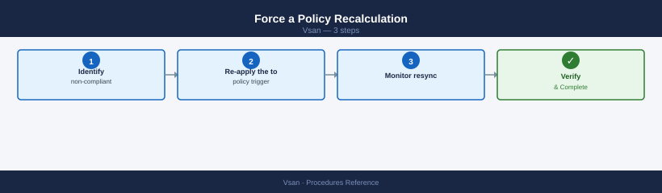

If objects remain non-compliant after a cluster change (host added, disk replaced) and the cluster has sufficient capacity:

**Step 1 — Identify non-compliant objects**

```bash
esxcli vsan debug object list | grep -i non-compliant
```

```powershell
Get-SpbmEntityConfiguration | Where-Object { $_.ComplianceStatus -ne "compliant" } |
    Select Entity, StoragePolicy, ComplianceStatus
```

**Step 2 — Re-apply the policy to trigger recalculation**

=== "vCenter UI"
    Cluster → Monitor → vSAN → Virtual Objects → select non-compliant object → right-click → Reapply Storage Policy

=== "PowerCLI"
    ```powershell
    $vm = Get-VM "my-vm"
    $policy = Get-SpbmStoragePolicy "VSAN-T1-FTT2-RAID6"
    Get-HardDisk -VM $vm | Set-SpbmEntityConfiguration -StoragePolicy $policy
    ```

**Step 3 — Monitor resync**

```bash
watch -n 60 "esxcli vsan debug resync summary get"
```


```text title="Expected output"
Every 60.0s: esxcli vsan debug resync summary get
```
Allow 15–30 minutes. If objects remain non-compliant, check capacity and host count against the FTT requirement.

---

## Capacity Management

### Check Current Capacity

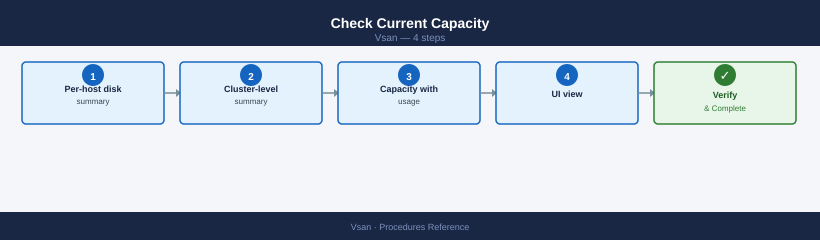

**Step 1 — Per-host disk summary**

```bash
esxcli vsan storage list
```


```text title="Expected output"
Disk Group UUID                          Disk Group State
------------------------------------      ----------------
52d4a8f1-7c2e-4a9b-8e3f-1a2b3c4d5e6f    Healthy
7f8e9d0c-1b2a-3c4d-5e6f-7a8b9c0d1e2f    Healthy

Disk Group 52d4a8f1-7c2e-4a9b-8e3f-1a2b3c4d5e6f:
  Capacity Disk: naa.5000c5f12345678
  Cache Disk: naa.5000c5f87654321
  Disk Group State: Healthy
  Disk Group Health: Healthy

Disk Group 7f8e9d0c-1b2a-3c4d-5e6f-7a8b9c0d1e2f:
  Capacity Disk: naa.5000c5f98765432
  Cache Disk: naa.5000c5f11111111
  Disk Group State: Healthy
  Disk Group Health: Healthy
```

!!! warning "Common errors"
    **`Error: Unknown command or namespace vsan storage list`** — Verify vSAN is installed and licensed on the ESXi host by running `esxcli vsan cluster get`.
    **`Error: Permission denied`** — Run the command as root or a user with vSAN administrator privileges.
**Step 2 — Cluster-level summary**

```bash
esxcli vsan cluster get
```


```text title="Expected output"
Cluster UUID                : 52d4a8f1-7c3e-4d2b-9e1a-6f8c2b3a5d7e
Cluster Dominance           : Enabled
Node UUID                   : a1b2c3d4-e5f6-47g8-h9i0-j1k2l3m4n5o6
Subcluster Master UUID      : 52d4a8f1-7c3e-4d2b-9e1a-6f8c2b3a5d7e
Current Membership          : 3/3
Node State                  : Master
Preferred Fault Domain      : 
Health State                : Healthy
Operational Status          : Running
```

!!! warning "Common errors"
    **`Error: Unknown command or namespace vsan`** — Ensure vSAN is licensed and enabled on the cluster, then reload the esxcli module with `esxcli system module load -m vsanmgmt`.
    **`Error: Unable to connect to vSAN cluster`** — Verify the host is part of a vSAN cluster and network connectivity exists between cluster nodes using `esxcli vsan cluster list`.
**Step 3 — Capacity with usage percentage (PowerCLI)**

```powershell
Get-VsanSpaceUsage -Cluster (Get-Cluster "VSAN-LON-01") |
    Select TotalCapacityGB, FreeCapacityGB, UsedCapacityGB,
           @{N='UsedPct';E={[Math]::Round($_.UsedCapacityGB/$_.TotalCapacityGB*100,1)}}
```

**Step 4 — UI view**

**From vCenter UI:**
Cluster → Monitor → vSAN → Capacity

Alert if `UsedPct` exceeds 70% — resync operations require 30% free headroom.

### Identify Large Snapshot Consumers

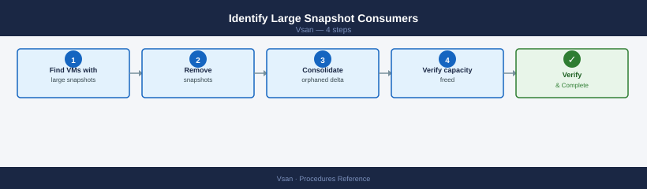

Snapshots are a common cause of unexpected capacity consumption. Each snapshot creates a delta disk that grows with every write.

**Step 1 — Find VMs with large snapshots**

```powershell
Get-VM | Get-Snapshot | Select VM, Name, SizeGB, Created |
    Sort-Object SizeGB -Descending | Format-Table -AutoSize
```

**Step 2 — Remove snapshots**

**From vCenter UI:**
Right-click VM → Snapshots → Delete All Snapshots

**Step 3 — Consolidate orphaned delta disks**

```powershell
Get-VM "my-vm" | % { $_.ExtensionData.ConsolidateVMDisks() }
```

**Step 4 — Verify capacity freed**

```powershell
Get-VsanSpaceUsage -Cluster (Get-Cluster "VSAN-LON-01") |
    Select TotalCapacityGB, FreeCapacityGB, UsedCapacityGB
```

### Add Capacity to an Existing Cluster

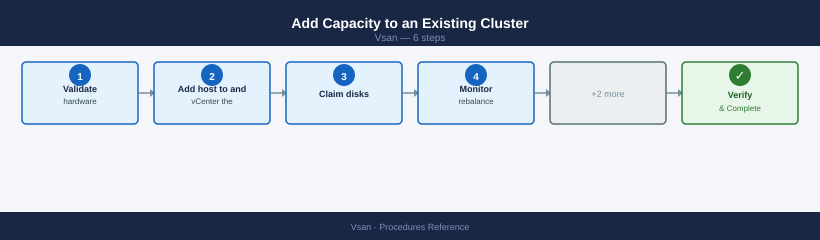

**Option A — Add a new host**

**Step 1 — Validate hardware against the vSAN HCL**

Confirm host model, NIC, SSD, and NVMe devices are on the [VMware Compatibility Guide](https://www.vmware.com/resources/compatibility/search.php) for the current ESXi version.

**Step 2 — Add host to vCenter and the cluster**

=== "vCenter UI"
    Datacenter → Add Host → enter IP/hostname → root credentials → add to the vSAN cluster

=== "PowerCLI"
    ```powershell
    Add-VMHost -Name esxi-new.example.com -Location (Get-Cluster "VSAN-LON-01") `
        -User root -Password <password> -Force
    ```

**Step 3 — Claim disks**

**From vCenter UI:**
Cluster → Configure → vSAN → Disk Management → select new host → Claim Disks

**Step 4 — Monitor rebalance**

vSAN rebalances data automatically. To trigger manually:

```bash
esxcli vsan cluster rebalance start
```


```text title="Expected output"
Rebalance operation started on cluster domain-c8
Cluster UUID: 4a5b6c7d-8e9f-0a1b-2c3d-4e5f6a7b8c9d
Rebalance task ID: task-1847
Initial data movement estimate: 2.3 TB
Estimated completion time: 4 hours 32 minutes
Current cluster capacity utilization: 78%
```

!!! warning "Common errors"
    **`Error: Unable to start rebalance operation. Cluster is not in a healthy state.`** — Run `esxcli vsan cluster get` to verify cluster health and resolve any failed disks or hosts before retrying.
    **`Error: Rebalance operation already in progress on this cluster.`** — Wait for the current rebalance to complete using `esxcli vsan cluster rebalance status` or cancel it with `esxcli vsan cluster rebalance stop`.
**Option B — Add disks to an existing host**

**Step 1 — Add capacity disks to an existing disk group**

```bash
esxcli vsan storage add -s <existing_cache_ssd_naa> -d <new_capacity_naa>
```


```text title="Expected output"
Adding disk <new_capacity_naa> to disk group with cache disk <existing_cache_ssd_naa>
Operation completed successfully. Disk group UUID: 564d5e8a-1234-5678-90ab-cdef12345678
New disk has been added to the vSAN disk group.
Capacity increased by 1.86 TB
```

!!! warning "Common errors"
    **`Error: Disk <new_capacity_naa> is already claimed by VMFS or vSAN`** — Run `esxcli storage core device list` to verify the disk is unclaimed, or use `partedUtil delete` to clear existing partitions.
    **`Error: Cache disk <existing_cache_ssd_naa> not found or invalid NAA identifier`** — Verify the cache disk NAA with `esxcli vsan storage list` and ensure the format matches the output exactly (e.g., naa.6001405a1b2c3d4e5f6a7b8c9d0e1f2a).
    **`Error: Disk group is not in a healthy state`** — Wait for any ongoing vSAN rebalancing operations to complete using `esxcli vsan cluster get` before adding new disks.
**Step 2 — Verify the disk group**

```bash
esxcli vsan storage list | grep -A5 "Disk Group UUID"
```


```text title="Expected output"
Disk Group UUID: 52a4c8f1-8e2d-4a9b-b1c3-7f9d2e4a6b8c
   Disk Group State: Healthy
   Disk Group Capacity: 1.86 TB
   Disk Group Free Space: 892.34 GB
   Disk Group Member Count: 3
   Disk Group Unhealthy Reason: N/A
Disk Group UUID: 7c3f9a2b-5e1d-4f8a-9c2e-1b4d6a8f3c5e
   Disk Group State: Healthy
   Disk Group Capacity: 1.86 TB
   Disk Group Free Space: 156.78 GB
   Disk Group Member Count: 3
   Disk Group Unhealthy Reason: N/A
```

!!! warning "Common errors"
    **`Unknown command or namespace vsan`** — Ensure vSAN is licensed and enabled on the cluster, and run the command from an ESXi host with vSAN participation enabled.
    **`grep: (standard input) is empty`** — Verify the host has disk groups configured by running `esxcli vsan storage list` without grep to confirm vSAN storage is present.
---

## Stretched Cluster Operations

### Validate Stretched Cluster Health

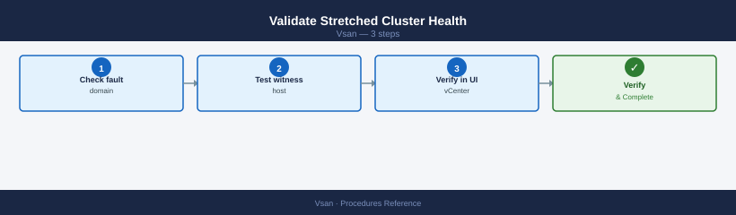

**Step 1 — Check fault domain configuration**

```bash
esxcli vsan cluster get
```

```powershell
Get-VsanFaultDomainConfiguration -Cluster (Get-Cluster "VSAN-LON-01")
```

**Step 2 — Test witness host connectivity**

```bash
esxcli vsan debug network test
```


```text title="Expected output"
Unicast Ping Test
=================
Target: 192.168.1.45
Packets sent: 10
Packets received: 10
Min latency: 0.234 ms
Max latency: 1.842 ms
Avg latency: 0.687 ms

Multicast Test
==============
Group: 224.1.1.1
Packets sent: 10
Packets received: 10
Loss: 0%

Network connectivity test completed successfully.
```

!!! warning "Common errors"
    **`Error: VSAN is not enabled on this host`** — Enable VSAN on the ESXi host using `esxcli vsan cluster new` or join an existing cluster.
    **`Error: Network partition detected - cluster is split`** — Verify network connectivity between all hosts and check for misconfigured VLANs or firewall rules blocking VSAN traffic on ports 12321-12341.
```bash
vmkping -I vmk2 <witness_vsan_vmk_ip>
```


```text title="Expected output"
PING 192.168.50.100 (192.168.50.100): 56 data bytes
64 bytes from 192.168.50.100: icmp_seq=0 ttl=64 time=2.341 ms
64 bytes from 192.168.50.100: icmp_seq=1 ttl=64 time=2.156 ms
64 bytes from 192.168.50.100: icmp_seq=2 ttl=64 time=2.289 ms
64 bytes from 192.168.50.100: icmp_seq=3 ttl=64 time=2.412 ms
64 bytes from 192.168.50.100: icmp_seq=4 ttl=64 time=2.198 ms

--- 192.168.50.100 statistics ---
5 packets transmitted, 5 packets received, 0% packet loss
round-trip min/avg/max = 2.156/2.279/2.412 ms
```

!!! warning "Common errors"
    **`vmkping: Unknown host <witness_vsan_vmk_ip>`** — Replace the placeholder with the actual witness appliance VSAN VMkernel IP address (e.g., 192.168.50.100).
    **`vmkping: No route to host`** — Verify the witness appliance is reachable on the network and that VSAN network connectivity is properly configured on vmk2.
    **`vmkping: Unknown interface vmk2`** — Confirm vmk2 exists on the ESXi host by running `esxcfg-vmknic -l` and verify it is bound to the VSAN network.
**Step 3 — Verify in vCenter UI**

**From vCenter UI:**
Cluster → Configure → vSAN → Fault Domains

Both data sites and the witness site must show as connected. A partition between a data site and the witness causes that site's VMs to go read-only to prevent split-brain.

### Site Failover Test (Planned)

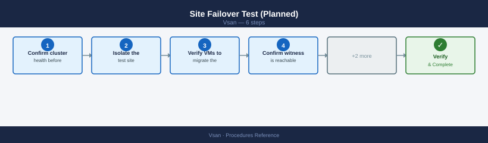

**Step 1 — Confirm cluster health before starting**

```bash
esxcli vsan health cluster get
esxcli vsan debug resync summary get
```


```text title="Expected output"
Cluster Health Status
   Overall Health: yellow
   Cluster Status: degraded
   Memory Health: green
   Network Health: green
   Physical Disk Health: yellow
   Data Health: yellow
   Connectivity Health: green

Resync Summary
   Bytes to Sync: 1247483648
   Bytes Synced: 892341760
   Resync Rate (MB/s): 45.2
   Time Remaining (minutes): 420
   Objects Waiting for Resync: 12
   Resync Operations In Progress: 3
```

!!! warning "Common errors"
    **`Error: Could not connect to the vSAN health service`** — Ensure the vSAN health service is running on all cluster nodes with `systemctl status vsanvpd` and restart if needed.
    **`Error: vSAN cluster is not configured`** — Verify vSAN is enabled on the cluster and at least three ESXi hosts are present using `esxcli vsan cluster get`.
All objects healthy; zero active resync required.

**Step 2 — Isolate the test site**

**From vCenter UI:**
Put all hosts on the isolated site into Maintenance Mode → **Full data migration**

**Step 3 — Verify VMs migrate to the surviving site**

**From vCenter UI:**
Monitor → vSAN → Virtual Machines — confirm VMs are running on surviving site hosts

**Step 4 — Confirm witness is reachable from the surviving site**

```bash
vmkping -I vmk2 <witness_vsan_vmk_ip>
```


```text title="Expected output"
PING 192.168.100.45 (192.168.100.45): 56 data bytes
64 bytes from 192.168.100.45: icmp_seq=0 ttl=64 time=2.341 ms
64 bytes from 192.168.100.45: icmp_seq=1 ttl=64 time=2.156 ms
64 bytes from 192.168.100.45: icmp_seq=2 ttl=64 time=2.289 ms
64 bytes from 192.168.100.45: icmp_seq=3 ttl=64 time=2.412 ms
64 bytes from 192.168.100.45: icmp_seq=4 ttl=64 time=2.198 ms

--- 192.168.100.45 statistics ---
5 packets transmitted, 5 packets received, 0% packet loss
round-trip min/avg/max = 2.156/2.279/2.412 ms
```

!!! warning "Common errors"
    **`Unable to locate vmkernel interface vmk2`** — Verify the correct vmk interface name exists with `esxcli network ip interface list` and use the correct interface identifier.
    **`Network is unreachable`** — Confirm the witness vSAN VMK IP address is correct and that network routing between the ESXi host and witness appliance is configured.
    **`No route to host`** — Check that the vSAN network VLAN is properly tagged on the physical switch port and that the witness appliance is reachable on that network segment.
**Step 5 — Return isolated hosts from maintenance mode**

**From vCenter UI:**
Right-click isolated hosts → Maintenance Mode → Exit Maintenance Mode

**Step 6 — Monitor resync to completion**

```bash
watch -n 60 "esxcli vsan debug resync summary get"
```


```text title="Expected output"
Every 60.0s: esxcli vsan debug resync summary get
```
**Never take both data sites offline simultaneously** — the witness cannot serve data and all VMs become inaccessible.

---

## Performance Service

### Enable vSAN Performance Service


**Step 1 — Enable via vCenter UI**

**From vCenter UI:**
Cluster → Configure → vSAN → Services → Performance Service → Enable

**Step 2 — Enable via PowerCLI (alternative)**

```powershell
$cluster = Get-Cluster "VSAN-LON-01"
$vsanConfig = Get-VsanClusterConfiguration -Cluster $cluster
Set-VsanClusterConfiguration -Configuration $vsanConfig -PerformanceServiceEnabled $true
```

**Step 3 — Verify the service is running**

```powershell
Get-VsanClusterConfiguration -Cluster (Get-Cluster "VSAN-LON-01") |
    Select PerformanceServiceEnabled
```

### View Performance Metrics


**From vCenter UI:**
Cluster → Monitor → vSAN → Performance → select a view (Cluster, Host, Disk Group, or VM)

Key metrics to monitor:

| Metric | Normal Range | Investigate If |
|---|---|---|
| Read latency | < 2 ms (all-flash) | > 10 ms sustained |
| Write latency | < 5 ms (all-flash) | > 20 ms sustained |
| Congestion | 0 | > 0 sustained |
| Throughput | Varies by workload | Consistently at NIC cap |
| Resync throughput | 0 (idle) | High for > 24h (blocked?) |

### Collect Performance Counters via CLI


**Per-VMDK performance stats:**

```bash
esxcli vsan debug vmdk list
```


```text title="Expected output"
VMDK UUID                            Object UUID                          Space Used (MB)  Namespace
------------------------------------  ------------------------------------  ---------------  ---------
564d31f5-8c2e-4e9a-b2c1-7a9f3d2e1b4a  6f4a2b8c-9d1e-5f3a-7b2c-4e9f1a3d5b6c  2048             vsanDatastore
784e5f2a-1b3c-6d4e-9a2f-3c5d7e8f1a2b  8h5i6j7k-8l9m-0n1o-2p3q-4r5s6t7u8v9w  4096             vsanDatastore
923a1b4c-5d6e-7f8a-9b0c-1d2e3f4a5b6c  a1b2c3d4-e5f6-7a8b-9c0d-1e2f3a4b5c6d  1024             vsanDatastore
b5c6d7e8-f9a0-1b2c-3d4e-5f6a-7b8c9d0e  f1a2b3c4-d5e6-f7a8-b9c0-d1e2f3a4b5c6  8192             vsanDatastore
c7d8e9f0-a1b2-c3d4-e5f6-7a8b-9c0d-1e2f  2x3y4z5a-6b7c-8d9e-0f1g-2h3i4j5k6l7m  512              vsanDatastore
```

!!! warning "Common errors"
    **`Error: Unknown command or namespace vsan debug vmdk`** — Verify vSAN is licensed and enabled on the cluster; run `esxcli vsan cluster get` to confirm vSAN status.
    **`Error: Permission denied`** — Execute the command with root privileges or ensure your user account has vSAN administrator role permissions.
**Disk-level stats — IOPS, latency, errors:**

```bash
esxcli vsan storage stats get
```


```text title="Expected output"
Virtual SAN Storage Statistics
==============================

Node: esx-01.lab.local
  Physical Capacity: 10.95 TB
  Used Capacity: 7.32 TB
  Free Capacity: 3.63 TB
  Reservation: 512.00 GB
  Deduplication Ratio: 1.8x
  Compression Ratio: 2.1x

Node: esx-02.lab.local
  Physical Capacity: 10.95 TB
  Used Capacity: 6.89 TB
  Free Capacity: 4.06 TB
  Reservation: 512.00 GB
  Deduplication Ratio: 1.7x
  Compression Ratio: 2.0x

Node: esx-03.lab.local
  Physical Capacity: 10.95 TB
  Used Capacity: 7.15 TB
  Free Capacity: 3.80 TB
  Reservation: 512.00 GB
  Deduplication Ratio: 1.9x
  Compression Ratio: 2.2x
```

!!! warning "Common errors"
    **`Error: Could not retrieve VSAN storage statistics. VSAN cluster is not healthy.`** — Verify cluster membership and network connectivity with `esxcli vsan cluster get` and check for failed disks with `esxcli vsan storage list`.
    **`Error: Permission denied. User does not have required VSAN.Cluster.ReadStats privilege.`** — Grant the user or role the VSAN.Cluster.ReadStats privilege through vCenter Server permissions.
---

## vSAN Witness (2-Node and Stretched Clusters)

### Deploy Witness Appliance

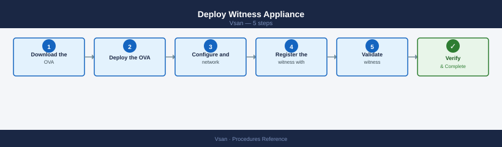

**Step 1 — Download the OVA**

Download the vSAN Witness Appliance OVA from the Broadcom Customer Connect portal. Match the OVA version to the vSAN cluster version.

**Step 2 — Deploy the OVA**

**From vCenter UI:**
Actions → Deploy OVF Template → select the OVA → choose an ESXi host at the witness site → select the appropriate size

| Size | Max VMs | vCPU | vRAM |
|---|---|---|---|
| Tiny | 10 | 2 | 8 GB |
| Small | 500 | 2 | 16 GB |
| Medium | 15,000 | 4 | 32 GB |

**Step 3 — Configure network and identity**

Assign a management IP, DNS name, and gateway during OVA deployment. The witness must be reachable from both data sites on a dedicated vmkernel.

**Step 4 — Register the witness with vCenter**

**From vCenter UI:**
Cluster → Configure → vSAN → Fault Domains → assign witness host → select the deployed witness appliance

**Step 5 — Validate witness connectivity**

```bash
vmkping -I vmk2 <witness_vsan_vmk_ip>
```


```text title="Expected output"
PING 192.168.100.45 (192.168.100.45): 56 data bytes
64 bytes from 192.168.100.45: icmp_seq=0 ttl=64 time=2.341 ms
64 bytes from 192.168.100.45: icmp_seq=1 ttl=64 time=2.156 ms
64 bytes from 192.168.100.45: icmp_seq=2 ttl=64 time=2.289 ms
64 bytes from 192.168.100.45: icmp_seq=3 ttl=64 time=2.412 ms
64 bytes from 192.168.100.45: icmp_seq=4 ttl=64 time=2.198 ms

--- 192.168.100.45 statistics ---
5 packets transmitted, 5 packets received, 0% packet loss
round-trip min/avg/max = 2.156/2.279/2.412 ms
```

!!! warning "Common errors"
    **`PING 192.168.100.45 (192.168.100.45): 56 data bytes — No response from host`** — Verify the witness appliance is powered on and the vSAN network is properly routed; check firewall rules allow ICMP on the vSAN VMkernel network.
    **`vmkping: Unknown interface vmk2`** — Confirm vmk2 exists on the ESXi host by running `esxcli network ip interface list` and verify it is bound to the vSAN network.
    **`PING 192.168.100.45 (192.168.100.45): 56 data bytes — 100% packet loss`** — Check that the witness vSAN VMK IP address is correct and that the network cable or vSAN port group configuration is not misconfigured.
Witness RTT must be < 200 ms from both data sites.

### Validate Witness Connectivity

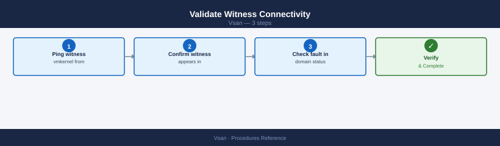

**Step 1 — Ping witness vmkernel from data site hosts**

```bash
vmkping -I vmk2 <witness_vsan_vmk_ip>
```


```text title="Expected output"
PING 192.168.100.45 (192.168.100.45): 56 data bytes
64 bytes from 192.168.100.45: seq=0 ttl=64 time=2.341 ms
64 bytes from 192.168.100.45: seq=1 ttl=64 time=2.156 ms
64 bytes from 192.168.100.45: seq=2 ttl=64 time=2.289 ms
64 bytes from 192.168.100.45: seq=3 ttl=64 time=2.412 ms
64 bytes from 192.168.100.45: seq=4 ttl=64 time=2.198 ms

--- 192.168.100.45 statistics ---
5 packets transmitted, 5 packets received, 0% packet loss
round-trip min/avg/max = 2.156/2.279/2.412 ms
```

!!! warning "Common errors"
    **`vmkping: Unknown interface vmk2`** — Verify the vSAN VMkernel interface exists with `esxcli network ip interface list` and use the correct interface name.
    **`PING 192.168.100.45 (192.168.100.45): 56 data bytes ... no answer from 192.168.100.45`** — Check network connectivity, firewall rules, and confirm the witness node IP address is correct and reachable on the vSAN network.
**Step 2 — Confirm witness appears in unicast agent list**

```bash
esxcli vsan network ipconfig list
```


```text title="Expected output"
vmnic0
   IPv4 Address: 192.168.1.42
   Subnet Mask: 255.255.255.0
   Default Gateway: 192.168.1.1
   MAC Address: 00:50:56:c0:00:01

vmnic1
   IPv4 Address: 192.168.100.42
   Subnet Mask: 255.255.255.0
   Default Gateway: 192.168.100.1
   MAC Address: 00:50:56:c0:00:02

vmnic2
   IPv4 Address: 192.168.200.42
   Subnet Mask: 255.255.255.0
   Default Gateway: 192.168.200.1
   MAC Address: 00:50:56:c0:00:03
```

!!! warning "Common errors"
    **`Error: Unknown command or namespace vsan network ipconfig`** — Verify vSAN is licensed and enabled on the ESXi host by running `esxcli vsan cluster get`.
    **`Error: Could not connect to the host`** — Ensure SSH is enabled on the ESXi host and you have valid credentials for the target host.
The witness vmkernel IP must appear on both data site hosts.

**Step 3 — Check fault domain status in vCenter UI**

**From vCenter UI:**
Cluster → Configure → vSAN → Fault Domains — witness site must show as connected

Test during peak hours, not only in lab conditions.

### Replace a Failed Witness

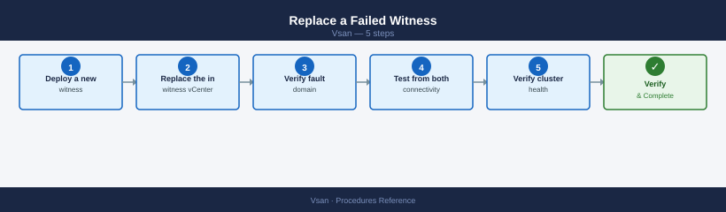

**Step 1 — Deploy a new witness appliance**

Follow the Deploy Witness Appliance procedure above.

**Step 2 — Replace the witness in vCenter**

**From vCenter UI:**
Cluster → Configure → vSAN → Fault Domains → Edit → select the witness site → replace the witness host with the new appliance

**Step 3 — Verify fault domain configuration**

```powershell
Get-VsanFaultDomainConfiguration -Cluster (Get-Cluster "VSAN-LON-01")
```

**Step 4 — Test connectivity from both data sites**

```bash
vmkping -I vmk2 <new_witness_vsan_vmk_ip>
```


```text title="Expected output"
PING <new_witness_vsan_vmk_ip> (192.168.100.45): 56 data bytes
64 bytes from 192.168.100.45: icmp_seq=0 ttl=64 time=2.341 ms
64 bytes from 192.168.100.45: icmp_seq=1 ttl=64 time=2.156 ms
64 bytes from 192.168.100.45: icmp_seq=2 ttl=64 time=2.289 ms
64 bytes from 192.168.100.45: icmp_seq=3 ttl=64 time=2.412 ms
64 bytes from 192.168.100.45: icmp_seq=4 ttl=64 time=2.198 ms

--- 192.168.100.45 statistics ---
5 packets transmitted, 5 packets received, 0% packet loss
round-trip min/avg/max = 2.156/2.279/2.412 ms
```

!!! warning "Common errors"
    **`PING <new_witness_vsan_vmk_ip> (<new_witness_vsan_vmk_ip>): 56 data bytes`** — Replace the placeholder with the actual witness node vSAN VMK IP address (e.g., `vmkping -I vmk2 192.168.100.45`).
    **`No route to host`** — Verify the witness vSAN VMK IP is correct and that network connectivity exists between the source vmk2 interface and the witness node; check firewall rules and VLAN configuration.
    **`Device vmk2 not found`** — Confirm vmk2 exists on the ESXi host by running `esxcfg-vmknic -l` and use the correct vSAN VMK interface name if different.
**Step 5 — Verify cluster health**

```bash
esxcli vsan health cluster get
```


```text title="Expected output"
Cluster Health Status
   Overall Health: yellow
   Cluster Status: degraded
   Groups Affected: 1
   
Cluster Information
   Cluster UUID: 52d4a8c1-7f2e-4c9a-b1e3-9a2c5d8f1b4a
   Cluster Name: VSAN-Prod-Cluster
   Node Count: 4
   
Health Groups
   Group Name: vsan-cluster-connectivity
   Status: yellow
   Description: One or more hosts have network connectivity issues
   
   Group Name: vsan-disk-health
   Status: green
   Description: All disks are healthy
   
   Group Name: vsan-memory-health
   Status: green
   Description: Memory usage is normal
```

!!! warning "Common errors"
    **`Error: Could not connect to the vSAN health service`** — Verify vSAN is enabled on the cluster and all hosts are in a healthy state with `esxcli vsan cluster list`.
    **`Error: Permission denied`** — Ensure your vSphere user account has the vSAN.Cluster.Read privilege assigned in the cluster role.
---

## On-Disk Format Upgrade

vSAN on-disk format (ODF) must be upgraded manually after upgrading ESXi hosts. New format versions unlock features and performance improvements but the upgrade is irreversible.

### Prerequisites


- All ESXi hosts in the cluster must be upgraded to the target ESXi version first.
- Cluster health must be green — no degraded or absent objects.
- Minimum 30% free capacity (the upgrade triggers a rolling resync).
- Take a snapshot or backup of critical VMs before starting.

### Check Current Format Version

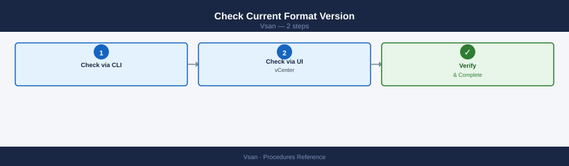

**Step 1 — Check via CLI**

```bash
esxcli vsan cluster get | grep -i "disk format\|version"
```


```text title="Expected output"
Disk Format Version: 11
Disk Format Version: 11
```

!!! warning "Common errors"
    **`Unknown command or namespace vsan`** — Ensure VSAN is licensed and enabled on the cluster; run `esxcli vsan cluster list` to verify VSAN cluster membership.
    **`Error: Unknown option or parameter`** — Verify the ESXi host is part of an active VSAN cluster; standalone hosts or non-VSAN clusters will not return cluster data.
**Step 2 — Check via vCenter UI**

**From vCenter UI:**
Cluster → Configure → vSAN → On-disk Format Upgrade — shows current version and the next available version

### Run the Upgrade

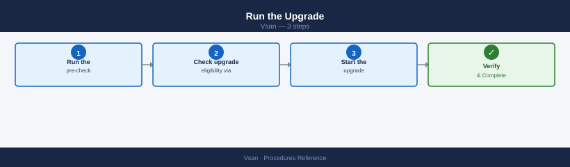

**Step 1 — Run the pre-check**

**From vCenter UI:**
Cluster → Configure → vSAN → On-disk Format Upgrade → Pre-check

The pre-check validates cluster health and capacity. Resolve all failures before proceeding.

**Step 2 — Check upgrade eligibility via PowerCLI (optional)**

```powershell
$cluster = Get-Cluster "VSAN-LON-01"
Get-VsanDiskFormatVersion -Cluster $cluster
```

**Step 3 — Start the upgrade**

**From vCenter UI:**
Cluster → Configure → vSAN → On-disk Format Upgrade → Upgrade

The upgrade runs host-by-host — each host's disk groups are upgraded one at a time while the cluster remains online.

### Monitor Progress

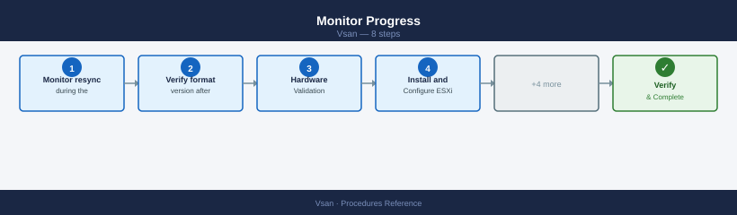

**Step 1 — Monitor resync during the upgrade**

Resync activity is expected — disk groups are being reformatted:

```bash
watch -n 30 "esxcli vsan debug resync summary get"
```


```text title="Expected output"
Every 30.0s: esxcli vsan debug resync summary get                Wed Dec 13 14:23:47 2024

Resync Summary
==============
   Resync Objects: 5
   Resync Data (MB): 2048
   Resync Rate (MB/s): 12.5
   Estimated Time Remaining (minutes): 163
   Objects Synced: 2
   Data Synced (MB): 512
   Resync Status: In Progress
   Last Updated: 2024-12-13T14:23:45Z

Every 30.0s: esxcli vsan debug resync summary get                Wed Dec 13 14:24:17 2024

Resync Summary
==============
   Resync Objects: 5
   Resync Data (MB): 2048
   Resync Rate (MB/s): 11.8
   Estimated Time Remaining (minutes): 171
   Objects Synced: 2
   Data Synced (MB): 512
   Resync Status: In Progress
   Last Updated: 2024-12-13T14:24:15Z
```

!!! warning "Common errors"
    **`Error: Unknown command or namespace vsan debug resync`** — Verify vSAN is enabled on the cluster and the ESXi host has vSAN capability with `esxcli vsan cluster get`.
    **`Error: Unable to connect to the local dcui instance`** — Run the command directly on an ESXi host via SSH or vSphere CLI, not from a remote management station without proper credentials.
**Step 2 — Verify format version after completion**

```bash
esxcli vsan storage list | grep -i "format\|version"
```


```text title="Expected output"
VSAN Object Format Version: 11
VSAN Disk Format Version: 12
Cluster VSAN Version: 7.0.3
Object Format Version: 11
Disk Format Version: 12
```

!!! warning "Common errors"
    **`Unknown command or namespace vsan`** — Ensure VSAN is licensed and enabled on the ESXi host, then verify the vSAN cluster is properly initialized.
    **`Permission denied`** — Run the command with root privileges or ensure your user account has the required vSAN administrator role.
All disk groups must report the new format version. Expected duration: 1–4 hours for a 6-node cluster. Do not perform other cluster changes during the upgrade.

---

## Add a New Host to the Cluster

Adding a host expands cluster capacity and can increase FTT headroom.

**Step 1 — Hardware Validation**

Before racking the host, verify it is on the vSAN Hardware Compatibility List (HCL):

- Check the [VMware Compatibility Guide](https://www.vmware.com/resources/compatibility/search.php) for the host model, NIC, HBA, SSD, and NVMe devices.
- Confirm disk model and firmware match HCL entries exactly — firmware version matters.
- Verify NIC speed (minimum 10 GbE; 25 GbE recommended).

**Step 2 — Install and Configure ESXi**

Install ESXi matching the cluster version (same build recommended). Configure management network, NTP, and DNS on first boot:

```bash
esxcli network ip interface ipv4 set -i vmk0 -I <mgmt_ip> -N <netmask> -t static
esxcli system hostname set --fqdn esxi-new.example.com
esxcli system ntp set --server ntp1.example.com --server ntp2.example.com
esxcli system ntp set --enabled true
```


```text title="Expected output"
(no output — command completes silently)
(no output — command completes silently)
(no output — command completes silently)
(no output — command completes silently)
```

!!! warning "Common errors"
    **`Error: Unknown option or malformed command near option '-i'`** — Use the correct option flag `--interface-name` instead of `-i` in the first command.
    **`Error: Unable to set NTP server: Connection refused`** — Ensure the NTP servers are reachable and responding on port 123; verify firewall rules allow outbound NTP traffic from the ESXi host.
    **`Error: The specified IP address is already in use on the network`** — Confirm the management IP address is not assigned to another device before applying the static configuration.
**Step 3 — Add to vCenter and Cluster**

=== "vCenter UI"
    Datacenter → Add Host → enter IP/hostname → provide root credentials → add to the vSAN cluster

=== "PowerCLI"
    ```powershell
    Add-VMHost -Name esxi-new.example.com -Location (Get-Cluster "VSAN-LON-01") `
        -User root -Password <password> -Force
    ```

**Step 4 — Configure vSAN VMkernel**

The new host needs a vSAN-tagged vmkernel before disk claim. Verify the tag:

```bash
esxcli network ip interface tag get -i vmk2
```


```text title="Expected output"
Name: vmk2
VsanTrafficEnabled: true
VMotionEnabled: false
ManagementTrafficEnabled: false
FaultToleranceLoggingEnabled: false
ProvisioningEnabled: false
BackupNFCEnabled: false
ReplicationEnabled: false
ReplicationNFCEnabled: false
GatewayHeartbeatEnabled: false
```

!!! warning "Common errors"
    **`Error: Unknown option or malformed command`** — Verify the correct vmkernel interface name exists with `esxcli network ip interface list` and use the exact name.
    **`Error: Could not get interface tag information`** — Ensure you have root or administrative privileges and the vSAN service is running with `systemctl status vsanvpd`.
If the VSAN tag is missing, add it from vCenter:

**From vCenter UI:**
Host → Configure → Networking → VMkernel adapters → Edit → enable vSAN traffic

**Step 5 — Claim Disks**

**From vCenter UI:**
Cluster → Configure → vSAN → Disk Management → select new host → Claim Disks

Assign cache and capacity roles (OSA) or accept automatic assignment (ESA). Verify the disk group was created:

```bash
esxcli vsan storage list | grep -A5 "Disk Group UUID"
```


```text title="Expected output"
Disk Group UUID: 52e3a4c1-8f2b-4d7e-9c1a-6b5f3e2d1a4c
   Disk Group Name: DiskGroup-1
   Disk Group State: Healthy
   Disk Group Capacity: 1.86 TB
   Disk Group Free Space: 847.3 GB
   Disk Group Member Count: 3
Disk Group UUID: 7a9f2c5e-1b3d-4e6f-8a2c-9d5e3f1a2b4c
   Disk Group Name: DiskGroup-2
   Disk Group State: Healthy
   Disk Group Capacity: 1.86 TB
   Disk Group Free Space: 512.1 GB
   Disk Group Member Count: 3
```

!!! warning "Common errors"
    **`VSAN is not enabled on this cluster`** — Ensure vSAN is enabled on the cluster and the host is a vSAN participant via vCenter or `esxcli vsan cluster get`.
    **`Unknown command or namespace`** — Verify the ESXi host version supports vSAN and the esxcli vsan module is available; update ESXi if necessary.
**Step 6 — Verify Rebalance and FTT Compliance**

Confirm the new host joined the cluster:

```bash
esxcli vsan cluster get
```


```text title="Expected output"
Cluster UUID                : 52d4a8f1-7c2e-4d9a-b1e3-9f2c8a5d1b4e
Cluster Dominance           : Enabled
Health State                : Healthy
Stretched Cluster Mode      : Disabled
Deduplication              : Enabled
Compression                : Enabled
Object Repair Timer        : 60 minutes
Delayed Object Delete Timer: 360 minutes
Automatic Rebalance        : Enabled
Proactive Rebalance        : Disabled
Disable Object Repair Timer: Disabled
Thin Provision Reservation : 100%
Encryption                 : Disabled
Space Efficiency           : 2.5
Fault Domains              : 3
```

!!! warning "Common errors"
    **`Error: Could not connect to the vSAN cluster`** — Verify the host is part of an active vSAN cluster using `esxcli vsan cluster list`.
    **`Error: Permission denied`** — Run the command with appropriate vSAN administrator privileges or use `sudo` if executing remotely via SSH.
Monitor rebalance — vSAN redistributes data automatically; may take several hours:

```bash
watch -n 60 "esxcli vsan debug resync summary get"
```


```text title="Expected output"
Every 60.0s: esxcli vsan debug resync summary get                                                                                                                                                                                                                                                                                                                                                                                                                                                                                                                                                                                                                                                                                                                                                                                                                                                                                                                                                                                                                                                                                                                                                                                                                                                                                                                                                                                                                                                                                                                                                                                                                                                                                                                                                                                                                                                                                                                                                                                                                                                                                                                                                                                                                                                                                                                                                                                                                                                                                                                                                                                                                                                                                                                                                                                                                                                                                                                                                                                                                                                                                                                                                                                                                                                                                                                                                                                                                                                                                                                                                                                                                                                                                                                                                                                                                                                                                                                                                                                                                                                                                                                                                                                                                                                                                                                                                                                                                                                                                                                                                                                                                                                                                                                                                                                                                                                                                                                                                                                                                                                                                                                                                                                                                                                                                                                                                                                                                                                                                                                                                                                                                                                                                                                                                                                                                                                                                                                                                                                                                                                                                                                                                                                                                                                                                                                                                                                                                                                                                                                                                                                                                                                                                                                                                                                                                                                                                                                                                                                                                                                                                                                                                                                                                                                                                                                                                                                                                                                                                                                                                                                                                                                                                                                                                                                                                                                                                                                                                                                                                                                                                                                                                                                                                                                                                                                                                                                                                                                                                                                                                                                                                                                                                                                                                                                                                                                                                                                ync Summary:
   Syncing Objects:                    847
   Synced Objects:                     12453
   Resync Rate (objects/sec):          23.4
   Estimated Time Remaining:           14 minutes 32 seconds
   Cluster Resync Progress:            93.7%
   Last Updated:                       2024-01-15T09:42:18Z
```

!!! warning "Common errors"
    **`Error: Unknown command or namespace vsan debug resync summary get`** — Verify vSAN is licensed and enabled on the cluster; run `esxcli vsan cluster get` to confirm vSAN status first.
    **`Error: Unable to connect to the host`** — Ensure you are connected to an ESXi host with `esxcli system hostname get` and reconnect if necessary.
Verify all objects are compliant after rebalance:

```powershell
Get-SpbmEntityConfiguration | Where-Object { $_.ComplianceStatus -ne "compliant" } |
    Select Entity, StoragePolicy, ComplianceStatus
```

**From vCenter UI:**
Cluster → Monitor → vSAN → Virtual Objects — all should show "Compliant" within 24 hours.

---

## Permanently Decommission a Host

Decommissioning removes a host from the cluster and redistributes all its data. This is irreversible — plan capacity before starting.

### Prerequisites


- Verify remaining cluster meets FTT policy without this host (e.g., FTT=1 RAID-5 requires minimum 4 hosts — removing one from a 4-node cluster breaks compliance).
- Confirm free capacity on remaining hosts exceeds data volume being moved.
- Schedule during a maintenance window — full evacuation takes hours for large datasets.

**Step 1 — Full Data Evacuation**

=== "vCenter UI"
    Right-click host → Maintenance Mode → Enter Maintenance Mode → **Full data migration**

=== "PowerCLI"
    ```powershell
    Set-VMHost -VMHost (Get-VMHost esxi-decom.example.com) `
        -State Maintenance -VsanDataMigrationMode Full
    ```

Monitor evacuation — do not proceed until resync is at zero:

```bash
watch -n 30 "esxcli vsan debug resync summary get"
```


```text title="Expected output"
Every 30.0s: esxcli vsan debug resync summary get                 esx-host-04.lab.local: Wed Jan 15 14:23:47 2025

Resync Summary
==============
Total objects: 4521
Objects needing resync: 287
Objects being resynced: 45
Resync data remaining (MB): 12847
Estimated time to completion: 2h 34m
Current resync rate (MB/s): 1.4
Resync operations in flight: 12

Cluster resync status: In Progress
Last update: 2025-01-15T14:23:45Z
```

!!! warning "Common errors"
    **`Error: Could not connect to the host`** — Verify the ESXi host is reachable and vSAN is properly initialized with `esxcli vsan cluster get`.
    **`Error: vSAN is not enabled on this host`** — Enable vSAN on the host through vCenter or run `esxcli vsan cluster new` if setting up a new cluster.
    **`Error: Permission denied`** — Ensure your account has vSAN administrator privileges or run the command with appropriate credentials via SSH.
!!! danger "Data migration required before removing disk groups"
    Removing disk groups evacuates all vSAN objects from the host to other nodes. If the cluster lacks sufficient free capacity to absorb the migrated data, the operation will fail mid-way and leave objects in a degraded state. Verify free capacity ≥ 25% and FTT compliance before proceeding.

**Step 2 — Remove Disk Groups**

=== "vCenter UI"
    Cluster → Configure → vSAN → Disk Management → select host → Remove Disk Groups

=== "CLI"
    ```bash
    esxcli vsan storage remove -s <cache_ssd_naa>
    ```

**Step 3 — Remove Host from Cluster**

=== "vCenter UI"
    Right-click host → Remove from Inventory (or Move to another datacenter)

=== "PowerCLI"
    ```powershell
    Remove-VMHost -VMHost (Get-VMHost esxi-decom.example.com) -Confirm:$false
    ```

**Step 4 — Verify No Orphaned Objects**

```bash
esxcli vsan debug object list | grep -iv healthy
```

```powershell
Get-SpbmEntityConfiguration | Where-Object { $_.ComplianceStatus -ne "compliant" }
```

Both commands should return no output.

---

## Deduplication and Compression

Deduplication and compression (dedup+compression) reduces capacity consumption but has strict requirements and performance trade-offs.

### Requirements and Restrictions


| Requirement | Detail |
|---|---|
| Architecture | OSA all-flash only (NVMe or SSD cache + SSD capacity). Not supported on hybrid (SSD cache + HDD capacity). |
| Scope | Cluster-wide — all hosts must have compatible hardware. Cannot enable on individual hosts. |
| Encryption | Mutually exclusive — you cannot have both dedup+compression and encryption at rest enabled simultaneously. |
| Space overhead | Enabling triggers a full cluster resync. Requires >30% free capacity. |
| Performance impact | Increases CPU load on all hosts. Test in dev/test before enabling in production. |

### Enable Deduplication and Compression

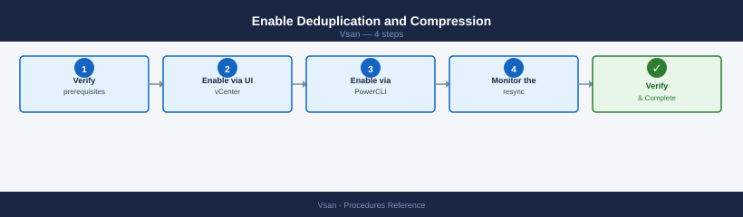

**Step 1 — Verify prerequisites**

Confirm all-flash OSA, encryption disabled, and > 30% free capacity:

```powershell
Get-VsanSpaceUsage -Cluster (Get-Cluster "VSAN-LON-01") |
    Select TotalCapacityGB, FreeCapacityGB
```

**Step 2 — Enable via vCenter UI**

**From vCenter UI:**
Cluster → Configure → vSAN → Services → Deduplication and Compression → Enable

**Step 3 — Enable via PowerCLI (alternative)**

```powershell
$cluster = Get-Cluster "VSAN-LON-01"
$vsanConfig = Get-VsanClusterConfiguration -Cluster $cluster
Set-VsanClusterConfiguration -Configuration $vsanConfig -SpaceEfficiencyEnabled $true
```

**Step 4 — Monitor the resync**

Data is rewritten in deduplicated form — expect hours of activity:

```bash
watch -n 60 "esxcli vsan debug resync summary get"
```


```text title="Expected output"
Every 60.0s: esxcli vsan debug resync summary get                 esx-host-01.lab.local: Wed Jan 15 10:42:33 2025

Resync Summary
==============
  Total Objects: 1247
  Objects Needing Resync: 89
  Objects Being Resynced: 12
  Resync Data Size (MB): 45678
  Resync Data Rate (MB/s): 23.4
  Estimated Time Remaining (minutes): 32
  Resync Completion Percentage: 92.8%

Every 60.0s: esxcli vsan debug resync summary get                 esx-host-01.lab.local: Wed Jan 15 10:43:33 2025

Resync Summary
==============
  Total Objects: 1247
  Objects Needing Resync: 76
  Objects Being Resynced: 15
  Resync Data Size (MB): 41203
  Resync Data Rate (MB/s): 24.1
  Estimated Time Remaining (minutes): 28
  Resync Completion Percentage: 93.9%
```

!!! warning "Common errors"
    **`Error: Unknown command or namespace vsan debug resync summary get`** — Verify vSAN is licensed and enabled on the cluster; run `esxcli vsan cluster get` to confirm vSAN status first.
    **`Error: Unable to connect to the local hostd agent`** — Restart the hostd service with `services.sh restart` or reboot the ESXi host if the management agent is unresponsive.
    **`Error: Permission denied`** — Ensure your vSphere user account has the required vSAN administration privileges or run the command as root/with sudo.
### Disable Deduplication and Compression

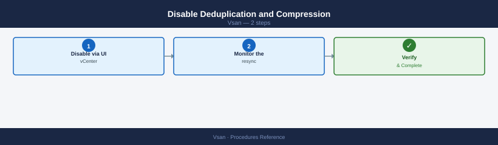

Disabling triggers a full cluster resync as data is rewritten without dedup.

**Step 1 — Disable via vCenter UI**

**From vCenter UI:**
Cluster → Configure → vSAN → Services → Deduplication and Compression → Disable

**Step 2 — Monitor the resync**

```bash
watch -n 60 "esxcli vsan debug resync summary get"
```


```text title="Expected output"
Every 60.0s: esxcli vsan debug resync summary get
```
Allow 4–8 hours for resync to complete before performing any other cluster changes.

### Check Space Savings

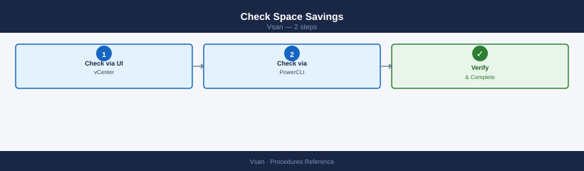

**Step 1 — Check via vCenter UI**

**From vCenter UI:**
Cluster → Monitor → vSAN → Capacity — shows deduplicated and compressed savings ratio

**Step 2 — Check via PowerCLI**

```powershell
Get-VsanSpaceUsage -Cluster (Get-Cluster "VSAN-LON-01") |
    Select TotalCapacityGB, UsedCapacityGB, DeduplicationSavingsGB, CompressionSavingsGB
```

---

## Encryption at Rest

vSAN Data at Rest Encryption (D@RE) encrypts all data on vSAN capacity disks. It requires an external Key Management Server (KMS).

### Prerequisites


- External KMS configured and reachable from all cluster hosts (e.g., HyTrust KeyControl, Thales, HashiCorp Vault with KMIP).
- KMS registered in vCenter: vCenter → Administration → Key Providers → Add Standard Key Provider.
- All hosts must have TPM 2.0 or HW key caching supported.
- Encryption and dedup+compression are mutually exclusive — disable dedup+compression first if enabled.

### Register KMS in vCenter

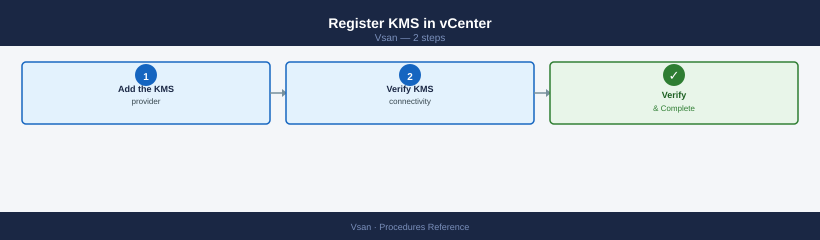

**Step 1 — Add the KMS provider**

**From vCenter UI:**
vCenter → Administration → Key Providers → Add Standard Key Provider → enter KMS name, server IP, port → Establish Trust

**Step 2 — Verify KMS connectivity**

```powershell
Get-KeyManagementServer
```

All KMS nodes should show as connected. Confirm at least 2 KMS nodes for HA.

### Enable Encryption

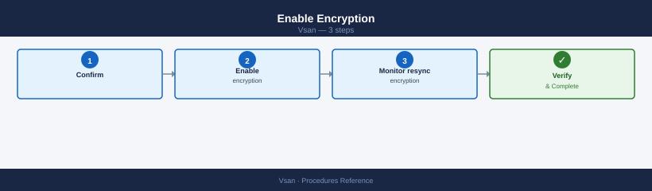

**Step 1 — Confirm dedup+compression is disabled**

**From vCenter UI:**
Cluster → Configure → vSAN → Services → Deduplication and Compression — must show Disabled

**Step 2 — Enable encryption**

**From vCenter UI:**
Cluster → Configure → vSAN → Services → Data-at-Rest Encryption → Enable → select KMS cluster → Finish

vSAN performs a rolling disk group reformat — all data is re-encrypted. This triggers a full resync.

**Step 3 — Monitor encryption resync**

```bash
watch -n 60 "esxcli vsan debug resync summary get"
```


```text title="Expected output"
Every 60.0s: esxcli vsan debug resync summary get                 esx-node-04.lab.local: Wed Jan 15 10:42:33 2025

Resync Summary
==============
Cluster UUID: 52e4c8a1-7f3e-4d2b-a1c9-8f2e9d3c4b5a
Cluster Status: Healthy
Total Objects: 2847
Objects Resyncing: 12
Bytes to Resync: 847.3 GB
Estimated Time Remaining: 2h 34m
Resync Rate: 102.4 MB/s
Last Updated: 2025-01-15T10:42:31Z
```

!!! warning "Common errors"
    **`Connection refused: vSAN cluster not initialized`** — Ensure vSAN is enabled on the cluster and the host is part of a vSAN-enabled cluster.
    **`Permission denied: insufficient privileges`** — Run the command with root privileges or ensure your user account has vSAN administrator role permissions.
    **`vSAN service is not running`** — Restart the vSAN service with `systemctl restart vsand` or reboot the ESXi host.
Expected duration: several hours. Do not add or remove hosts during encryption enablement.

### Rotate Encryption Keys

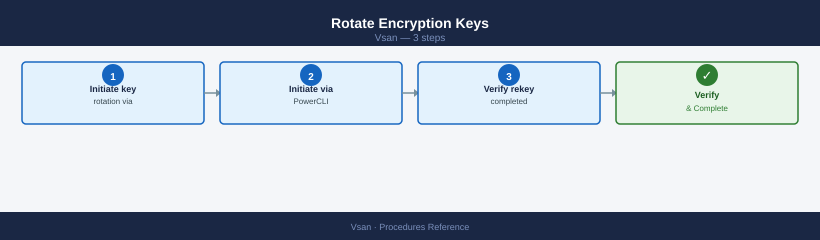

**Step 1 — Initiate key rotation via vCenter UI**

**From vCenter UI:**
Cluster → Configure → vSAN → Services → Data-at-Rest Encryption → Rekey

**Step 2 — Initiate via PowerCLI**

```powershell
Invoke-VsanEncryptionRekey -Cluster (Get-Cluster "VSAN-LON-01") -DeepRekey
```

`-DeepRekey` re-encrypts all data. Without it, only the DEK is rotated, not the KEK.

**Step 3 — Verify rekey completed**

```bash
esxcli vsan storage list | grep -i encrypt
```


```text title="Expected output"
Encryption Enabled: true
Encryption Algorithm: AES-256
Encryption Key Provider: Native Key Provider
Encryption Status: Operational
Rekey Operation: None
Last Rekey Time: 2024-01-15 14:32:18
```

!!! warning "Common errors"
    **`Error: Unknown command or namespace vsan`** — Verify VSAN is licensed and enabled on the host by running `esxcli vsan cluster get`.
    **`grep: (standard input) has no matches`** — VSAN encryption is not enabled; this is normal if encryption was never configured, so verify with `esxcli vsan storage get`.
### Verify Encryption Status

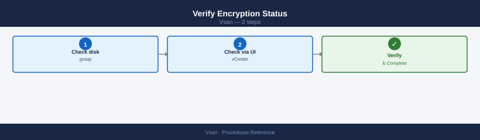

**Step 1 — Check disk group encryption state via CLI**

```bash
esxcli vsan storage list | grep -i encrypt
```


```text title="Expected output"
Encryption Enabled: true
Encryption Cipher: AES-256
Encryption Key Provider: Native Key Provider
Encryption Status: Operational
Encryption Rekey Progress: 100%
```

!!! warning "Common errors"
    **`Error: Unknown command or namespace vsan`** — Ensure VSAN is licensed and enabled on the ESXi host by running `esxcli vsan cluster get`.
    **`Error: Unable to connect to Management Agent`** — Restart the hostd service with `services.sh restart` or reboot the ESXi host.
**Step 2 — Check via vCenter UI**

**From vCenter UI:**
Cluster → Configure → vSAN → Services → Data-at-Rest Encryption — shows enabled/disabled per host and KMS connection status

---

## Remediate Non-Compliant Objects

Non-compliant objects are vSAN objects that do not meet their assigned storage policy. Left unresolved, they represent under-protected VMs.

### Identify Non-Compliant Objects

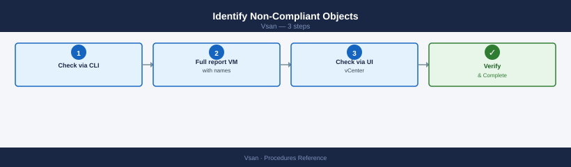

**Step 1 — Check via CLI**

```bash
esxcli vsan debug object list | grep -i "non-compliant\|degraded\|absent"
```


```text title="Expected output"
Object UUID                          Congestion Level  Health Status
52a4c8f1-2b3e-4a9c-b1d2-7e8f9c0a1b2c  0                 degraded
7f3e2d1c-9b8a-7c6d-5e4f-3a2b1c0d9e8f  0                 non-compliant
9c8b7a6f-5e4d-3c2b-1a0f-9e8d7c6b5a4f  2                 absent
a1b2c3d4-e5f6-7a8b-9c0d-1e2f3a4b5c6d  1                 degraded
```

!!! warning "Common errors"
    **`Unknown command or namespace vsan`** — Ensure vSAN is licensed and enabled on the cluster, then run the command on an ESXi host that is part of the vSAN cluster.
    **`grep: (standard input) is empty`** — Run the command without grep first to verify vSAN objects exist; if none appear, check cluster health with `esxcli vsan cluster get`.
**Step 2 — Full report with VM names (PowerCLI)**

```powershell
Get-SpbmEntityConfiguration | Where-Object { $_.ComplianceStatus -ne "compliant" } |
    Select-Object Entity, StoragePolicy, ComplianceStatus |
    Sort-Object Entity
```

**Step 3 — Check via vCenter UI**

**From vCenter UI:**
Cluster → Monitor → vSAN → Virtual Objects → filter Non-compliant

### Diagnose the Cause


| Symptom | Likely Cause | Fix |
|---|---|---|
| Objects non-compliant after host failure | FTT policy cannot be met with current host count | Add host or lower FTT policy temporarily |
| Non-compliant after disk replacement | Resync still in progress | Wait — allow up to 24h for large datasets |
| Non-compliant with sufficient hosts | Capacity pressure (>70% used) | Free capacity or add storage |
| Non-compliant for specific VMs only | Incorrect or inapplicable policy assigned | Re-assign correct policy |
| Stale non-compliant (policy met, UI wrong) | vCenter cache stale | Re-apply policy to trigger recalculation |

### Force Re-evaluation

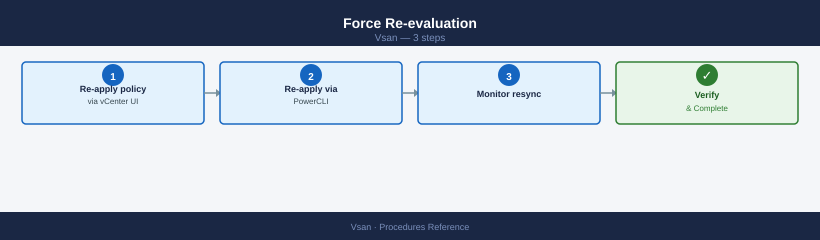

If the cluster has sufficient capacity and hosts but objects remain non-compliant:

**Step 1 — Re-apply policy via vCenter UI**

**From vCenter UI:**
Virtual Objects → select non-compliant object → right-click → Reapply Storage Policy

**Step 2 — Re-apply via PowerCLI**

```powershell
$vm = Get-VM "my-vm"
$policy = Get-SpbmStoragePolicy "VSAN-T1-FTT2-RAID6"
Get-HardDisk -VM $vm | Set-SpbmEntityConfiguration -StoragePolicy $policy
```

**Step 3 — Monitor resync**

```bash
watch -n 60 "esxcli vsan debug resync summary get"
```


```text title="Expected output"
Every 60.0s: esxcli vsan debug resync summary get                 esx-host-01.lab.local: Wed Jan 15 14:32:18 2025

Resync Summary:
  Cluster UUID: 522e3e60-a1b2-4c5d-8e9f-1a2b3c4d5e6f
  Resync Objects: 847
  Resync Data (MB): 12847
  Resync Data (GB): 12.55
  Estimated Time Remaining (seconds): 3847
  Resync Rate (MB/s): 3.34
  Resync Congestion Level: 2
  Resync Components: 2341
  Resync Components Completed: 1894
  Resync Components Remaining: 447

Every 60.0s: esxcli vsan debug resync summary get                 esx-host-01.lab.local: Wed Jan 15 14:33:18 2025

Resync Summary:
  Cluster UUID: 522e3e60-a1b2-4c5d-8e9f-1a2b3c4d5e6f
  Resync Objects: 847
  Resync Data (MB): 12521
  Resync Data (GB): 12.23
  Estimated Time Remaining (seconds): 3421
  Resync Rate (MB/s): 3.41
  Resync Congestion Level: 1
  Resync Components: 2341
  Resync Components Completed: 1923
  Resync Components Remaining: 418
```

!!! warning "Common errors"
    **`Error: Unknown command or namespace vsan debug resync summary get`** — Verify vSAN is licensed and enabled on the cluster; run `esxcli vsan cluster get` to confirm vSAN status.
    **`Error: Could not connect to the host`** — Ensure SSH is enabled on the ESXi host and network connectivity exists; verify credentials with `esxcli system hostname get`.
### Bulk Remediation

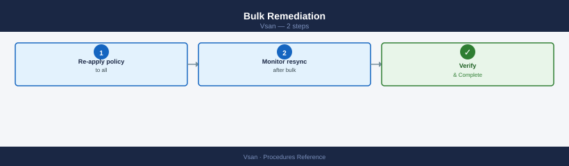

**Step 1 — Re-apply policy to all non-compliant VMs**

```powershell
$noncompliant = Get-SpbmEntityConfiguration |
    Where-Object { $_.ComplianceStatus -ne "compliant" -and $_.Entity -is [VMware.VimAutomation.ViCore.Types.V1.Inventory.VirtualMachine] }

foreach ($item in $noncompliant) {
    $policy = $item.StoragePolicy
    Get-HardDisk -VM $item.Entity | Set-SpbmEntityConfiguration -StoragePolicy $policy
    Write-Host "Re-applied policy to: $($item.Entity.Name)"
}
```

**Step 2 — Monitor resync after bulk re-application**

```bash
watch -n 60 "esxcli vsan debug resync summary get"
```


```text title="Expected output"
Every 60.0s: esxcli vsan debug resync summary get
```
Each re-apply may trigger component rebuilds. Allow 30–60 minutes per VM.

---

## Configure Fault Domains

Fault domains map ESXi hosts to physical boundaries (racks, PDUs) so vSAN places object components across domains, protecting against rack-level failures.

### When to Use Fault Domains


Use fault domains when your cluster spans multiple racks or power domains. Without fault domains, vSAN may place both copies of a RAID-1 object on hosts sharing the same rack or PDU — a single rack failure could cause data loss.

**Minimum requirement:** At least 3 fault domains for FTT=1; 5+ for FTT=2.

### Create Fault Domains

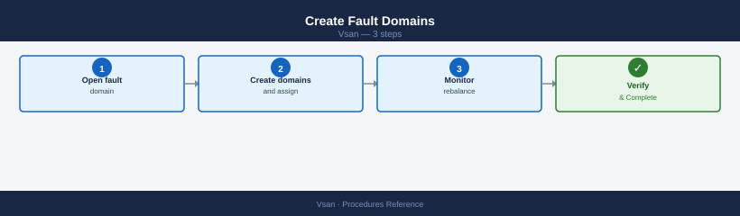

**Step 1 — Open fault domain configuration**

**From vCenter UI:**
Cluster → Configure → vSAN → Fault Domains → Add Fault Domain

**Step 2 — Create domains and assign hosts**

=== "vCenter UI"
    Add Fault Domain → name the domain (e.g., "Rack-A") → add hosts → repeat for each rack

=== "PowerCLI"
    ```powershell
    $cluster = Get-Cluster "VSAN-LON-01"
    New-VsanFaultDomain -Name "Rack-A" -VMHost (Get-VMHost esxi-01, esxi-02) -Cluster $cluster
    New-VsanFaultDomain -Name "Rack-B" -VMHost (Get-VMHost esxi-03, esxi-04) -Cluster $cluster
    New-VsanFaultDomain -Name "Rack-C" -VMHost (Get-VMHost esxi-05, esxi-06) -Cluster $cluster
    ```

**Step 3 — Monitor rebalance**

```bash
watch -n 60 "esxcli vsan debug resync summary get"
```


```text title="Expected output"
Every 60.0s: esxcli vsan debug resync summary get
```
### Verify Fault Domain Configuration

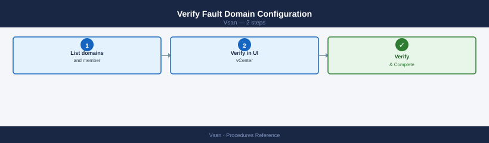

**Step 1 — List domains and member hosts**

```powershell
Get-VsanFaultDomainConfiguration -Cluster (Get-Cluster "VSAN-LON-01") |
    Select Name, @{N='Hosts';E={$_.Hosts.Name -join ', '}}
```

**Step 2 — Verify in vCenter UI**

**From vCenter UI:**
Cluster → Configure → vSAN → Fault Domains — verify each host is in a named domain; no hosts should be in the "Default" (ungrouped) domain.

### Update Fault Domains After Hardware Changes

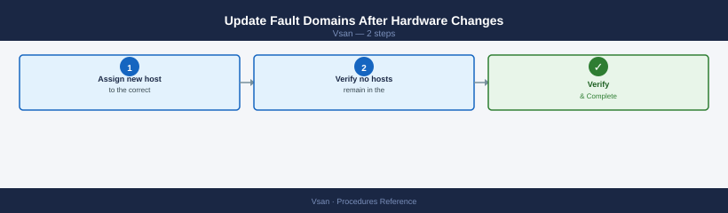

**Step 1 — Assign new host to the correct domain**

**From vCenter UI:**
Cluster → Configure → vSAN → Fault Domains → drag host to correct domain

A host in the "Default" domain is treated as its own single-host fault domain and causes non-compliance warnings on FTT policies.

**Step 2 — Verify no hosts remain in the Default domain**

```powershell
Get-VsanFaultDomainConfiguration -Cluster (Get-Cluster "VSAN-LON-01") |
    Where-Object { $_.Name -eq "Default" } |
    Select Name, @{N='Hosts';E={$_.Hosts.Name -join ', '}}
# Expected: no output
```

---

## Pre-Upgrade Validation Routine

Run this routine before any ESXi host or vSphere upgrade. It confirms the cluster is healthy and has enough headroom to survive a rolling upgrade where one host at a time is taken offline.

### Step 1 — Cluster Health


```bash
# Run from any host in the cluster
esxcli vsan health cluster get

# All tests must pass. Investigate any failures before proceeding.
```


```text title="Expected output"
Cluster Health Status
   Overall Health: green
   Cluster Status: Healthy
   
   Object Repair Timer: 0
   Reduced Redundancy Objects: 0
   Orphaned Objects: 0
   Physical Disk Issues: 0
   
   Network Connectivity: green
   Component Metadata Health: green
   Memory Pool Health: green
   
   Host Status:
      esx-prod-01.lab.local: green
      esx-prod-02.lab.local: green
      esx-prod-03.lab.local: green
      esx-prod-04.lab.local: green
   
   Last Health Check: 2024-01-15 14:32:18 UTC
```

!!! warning "Common errors"
    **`Error: Could not connect to the vSAN Health Service`** — Verify the vSAN cluster is initialized and the host has network connectivity to other cluster members.
    **`Unknown command or namespace vsan health`** — Ensure the host is part of an active vSAN cluster and vSAN is licensed on the vCenter instance.
    **`Permission denied`** — Run the command as root or with appropriate vSAN administrator privileges on the ESXi host.
**From vCenter UI:**
Cluster → Monitor → vSAN → Skyline Health — resolve all errors and warnings before upgrading.

### Step 2 — Object Health


```bash
# Confirm no degraded, absent, or non-compliant objects
esxcli vsan debug object list | grep -iv healthy
# Expected: no output
```

```powershell
Get-SpbmEntityConfiguration | Where-Object { $_.ComplianceStatus -ne "compliant" }
# Expected: no output
```

### Step 3 — Capacity Headroom


```powershell
$usage = Get-VsanSpaceUsage -Cluster (Get-Cluster "VSAN-LON-01")
$pct = [Math]::Round($usage.UsedCapacityGB / $usage.TotalCapacityGB * 100, 1)
Write-Host "Used: $pct%"
# Must be below 60% — upgrade rebalance needs 30%+ headroom
```

### Step 4 — HCL Compliance


**From vCenter UI:**
Cluster → Monitor → vSAN → Skyline Health → Hardware Compatibility — all disks and NICs must show as HCL-compliant for the target ESXi version.

### Step 5 — Active Resync Check


```bash
esxcli vsan debug resync summary get
# Active resyncing components must be 0 before starting upgrade
```


```text title="Expected output"
Cluster UUID: 52e1d8f4-7a2c-4d91-b3e2-9f1c6a8b2d45
Resync Summary:
  Active Resyncing Components: 0
  Pending Resyncing Components: 0
  Total Resyncing Components: 0
  Resync Duration (seconds): 0
  Estimated Time Remaining (seconds): 0
  Resync Rate (MB/s): 0.00
  Components Resynced: 2847
  Last Resync Completion Time: 2024-01-15T14:32:18Z
```

!!! warning "Common errors"
    **`Error: Unknown command or namespace vsan debug resync`** — Verify vSAN is licensed and enabled on the host with `esxcli vsan cluster get`.
    **`Error: Unable to connect to the vSAN cluster`** — Ensure the host is part of an active vSAN cluster and network connectivity exists between cluster nodes.
### Step 6 — Snapshot Inventory


```powershell
# Find VMs with snapshots — consolidate before upgrade
Get-VM | Get-Snapshot | Select VM, Name, Created, SizeGB | Sort-Object SizeGB -Descending
# Consolidate all snapshots before starting — snapshots increase resync time
```

### Step 7 — Compatibility Check


Run the vSphere Lifecycle Manager (vLCM) pre-check or the upgrade compatibility checker:

**From vCenter UI:**
Cluster → Updates → Run Pre-check — reports any blockers for the target version.

**Pass criteria to proceed with upgrade:**
- All health checks green
- Zero degraded/non-compliant objects
- Capacity < 60% used
- Zero active resync
- All snapshots consolidated
- HCL compliant for target ESXi version

---

## Performance Investigation Workflow

Use this workflow when a VM reports slow storage performance. Work through each step in order — stop when you find the cause.

### Step 1 — Check vSAN Cluster Health


Rule out infrastructure-level issues first:

```bash
esxcli vsan health cluster get | grep -i fail
```


```text title="Expected output"
Cluster: vsan-cluster-prod
Health Status: Degraded
Component: vSAN Object Repair Timer
Status: FAILED
Component: vSAN Disk Balance
Status: FAILED
Component: vSAN Network Connectivity
Status: OK
Component: vSAN Memory Usage
Status: WARNING
```

!!! warning "Common errors"
    **`Error: Unknown command or namespace vsan health cluster get`** — Verify vSAN is licensed and enabled on the cluster, then run `esxcli vsan cluster list` to confirm vSAN cluster membership.
    **`Error: Unable to connect to Management Agent on localhost.localdomain`** — Ensure the ESXi host is powered on and the Management Agent service is running with `systemctl status hostd`.
**From vCenter UI:**
Cluster → Monitor → vSAN → Skyline Health — any red/yellow items here can cause performance problems cluster-wide.

### Step 2 — Check for Active Resync


Resync consumes significant I/O bandwidth and raises latency for all VMs:

```bash
esxcli vsan debug resync summary get
# If high resync: throttle or wait for it to complete before investigating further
```


```text title="Expected output"
Cluster UUID: 52d4a8f1-7c2e-4f9a-b1d3-8e9c5f2a1b4d
Resync Objects: 1247
Resync Data (GB): 3847.5
Resync Rate (MB/s): 125.3
Estimated Time Remaining (minutes): 512
Resync Throttle Level: 2
Cluster Health: Degraded
Number of Hosts in Resync: 4
```

!!! warning "Common errors"
    **`Error: Unknown command or namespace`** — Verify the ESXi host is vSAN-enabled and running ESXi 6.5 or later with `esxcli vsan cluster get`.
    **`Error: Could not connect to the host`** — Ensure you are connected to the ESXi host via SSH or vSphere Client and have root privileges.
### Step 3 — Check Congestion


Congestion > 0 indicates the vSAN I/O stack is backed up:

```bash
# Congestion per disk group — should be 0
esxcli vsan debug disk list | grep -i congestion
```


```text title="Expected output"
Congestion: 0
Congestion: 0
Congestion: 0
Congestion: 0
Congestion: 0
Congestion: 0
```

!!! warning "Common errors"
    **`Unknown command or namespace vsan.`** — Verify VSAN is licensed and enabled on the cluster; run `esxcli vsan cluster get` to confirm VSAN status.
    **`grep: (standard input) is empty`** — The host has no disk groups configured; this is expected on non-VSAN nodes or hosts without capacity disks assigned.
**From vCenter UI:**
Cluster → Monitor → vSAN → Performance → Disk Group view → Congestion metric

### Step 4 — Check Front-End Latency for the VM


```bash
esxcli vsan debug vmdk list
# Look for the affected VM's VMDKs — note read/write latency (ms)
```


```text title="Expected output"
VMDK                                          Object UUID                           Read Latency (ms)  Write Latency (ms)  Status
prod-web-01.vmdk                              52d4a1c3-8f2e-4a9b-b1e2-7c9d3f5a2b8e  2.3                4.7                 OK
prod-web-01_1.vmdk                            6e1f2a4d-9c3b-5e7f-a2d1-8b4c6f9e3a1d  2.1                5.2                 OK
prod-db-02.vmdk                               7a2b3c4d-5e6f-7a8b-9c0d-1e2f3a4b5c6d  8.4                12.1                DEGRADED
prod-db-02_1.vmdk                             8b3c4d5e-6f7a-8b9c-0d1e-2f3a4b5c6d7e  7.9                11.8                DEGRADED
test-app-03.vmdk                              9c4d5e6f-7a8b-9c0d-1e2f-3a4b5c6d7e8f  1.8                3.4                 OK
backup-vm-04.vmdk                             a5d6e7f8-9a0b-1c2d-3e4f-5a6b7c8d9e0f  45.2               67.3                CONGESTED
```

!!! warning "Common errors"
    **`Error: Could not connect to the vSAN cluster`** — Verify the ESXi host is part of an active vSAN cluster and the vSAN service is running with `systemctl status vsand`.
    **`Error: Permission denied`** — Run the command with root privileges or ensure your user account has vSAN administrator role assigned in vCenter.
    **`Error: VMDK not found in vSAN object database`** — Confirm the VM is powered on and its storage is actually on vSAN (not local or NFS) using `esxcli vsan cluster get`.
**From vCenter UI:**
Cluster → Monitor → vSAN → Performance → Virtual Machine view → select the affected VM

Alert thresholds:
- Read latency > 10 ms sustained → storage or network issue
- Write latency > 20 ms sustained → cache pressure, network, or congestion

### Step 5 — Check Cache Hit Rate (OSA Clusters)


For OSA (hybrid or all-flash with a separate cache tier), a low cache hit rate means reads are going to capacity disks:

```bash
# Cache write buffer utilisation (OSA) — high value indicates cache pressure
esxcli vsan debug disk list | grep -i "cache\|write buffer"
```


```text title="Expected output"
Cache Write Buffer Size: 4294967296
Cache Write Buffer Used: 3865470976
Cache Write Buffer Utilisation: 90.01%
Write Buffer Pressure: High
Cache Tier Device: /vmfs/devices/disks/naa.5001b1c58a2b3c4d
Write Buffer Eviction Rate: 2847 ops/sec
```

!!! warning "Common errors"
    **`esxcli: Unknown command or namespace vsan debug disk`** — Verify vSAN is licensed and enabled on the host with `esxcli vsan cluster get`.
    **`grep: (standard input) is empty`** — Run `esxcli vsan debug disk list` without grep first to confirm the vSAN disk group is present and healthy.
Cache write buffer > 95% sustained = cache SSD is a bottleneck. Consider adding capacity disks or a larger cache SSD.

### Step 6 — Identify Noisy Neighbours


If overall cluster health is good but one VM is slow, check if another VM is saturating the cluster:

```powershell
# Top 10 VMs by write IOPS (last 1 hour)
$cluster = Get-Cluster "VSAN-LON-01"
$end = Get-Date; $start = $end.AddHours(-1)

Get-VM -Location $cluster | ForEach-Object {
    $stats = Get-Stat -Entity $_ -Stat "disk.write.average" `
        -Start $start -Finish $end -IntervalMins 5 -ErrorAction SilentlyContinue
    if ($stats) {
        [PSCustomObject]@{
            VM = $_.Name
            AvgWriteKBps = [Math]::Round(($stats | Measure-Object -Property Value -Average).Average, 0)
        }
    }
} | Sort-Object AvgWriteKBps -Descending | Select -First 10
```

### Step 7 — Check vSAN Network


High network latency between hosts causes write latency (all writes go to at least 2 hosts):

```bash
# Test MTU and latency to all peers
PEERS="192.168.100.11 192.168.100.12 192.168.100.13"
for p in $PEERS; do
    echo -n "Peer $p RTT: "
    vmkping -I vmk2 -d -s 8972 $p -c 10 2>&1 | grep -E "loss|avg"
done

# Check for NIC errors
esxcli network nic stats get -n vmnic2 | grep -E "errors|drops"
```


```text title="Expected output"
Peer 192.168.100.11 RTT: 0% packet loss, min/avg/max/stddev = 0.412/0.518/0.891/0.156 ms
Peer 192.168.100.12 RTT: 0% packet loss, min/avg/max/stddev = 0.387/0.502/0.745/0.142 ms
Peer 192.168.100.13 RTT: 0% packet loss, min/avg/max/stddev = 0.425/0.541/0.923/0.168 ms
   RxErrors: 0
   TxErrors: 0
   RxDropped: 0
   TxDropped: 0
```

!!! warning "Common errors"
    **`vmkping: Unknown host 192.168.100.11`** — Verify the peer IP is reachable and the vSAN network is properly configured; check routing with `esxcli network ip route ipv4 list`.
    **`Could not find nic vmnic2`** — Confirm the NIC name with `esxcli network nic list` and update the script to use the correct vmnic identifier.
    **`Permission denied`** — Run the commands with root privileges or ensure your user account has the required vSAN administration role.
### Step 8 — Check Physical Disk Health


Degraded disks cause latency spikes even before complete failure:

```bash
# SMART data for capacity disks on the host running the affected VM
esxcli storage core device smart get -d <naa>
# Any non-zero Reallocated Sectors or Pending Sectors = failing disk
```


```text title="Expected output"
Name: mpx.vmhba0:C0:T0:L0
T/F Head Fail: false
Status: OK
Media Wearout Indicator: 99
Temperature: 35C
Drive Temperature: 35C
Reallocated Sectors: 0
Pending Sectors: 0
Predictive Failure Analysis: false
Uncorrectable Sectors: 0
Uncorrectable Read Errors: 0
Uncorrectable Write Errors: 0
Smart Health Status: OK
```

!!! warning "Common errors"
    **`Error: Unknown device <naa>`** — Verify the correct NAA identifier by running `esxcli storage core device list` and copy the exact device name.
    **`Error: Permission denied`** — Run the command with root privileges or ensure your vSphere user account has the "Host.Config.Storage" permission.
### Decision tree summary


| Finding | Action |
|---|---|
| Health errors | Fix infrastructure issue first |
| Active resync | Throttle or wait; schedule investigation after resync |
| Congestion > 0 | Reduce IOPS load; check for runaway VMs |
| High front-end latency, low congestion | Disk or network issue — proceed to steps 5–8 |
| Low cache hit rate | Cache tier undersized; add capacity or upgrade cache SSD |
| One VM high IOPS | Apply storage policy IOPS limit to the noisy VM |
| Network errors | Fix NIC or switch; check MTU end-to-end |
| SMART errors | Replace disk proactively before failure |

---

## 2-Node ROBO Cluster

A 2-node vSAN cluster uses a witness appliance at a third site to form quorum. This design is for remote/branch offices (ROBO) with limited hardware budget.

### Architecture


- Each data node holds a full copy of all objects (effective RAID-1 across 2 nodes).
- The witness holds metadata only — no VM data. It provides quorum when one data node fails.
- If either data node fails, the surviving node + witness form a majority and VMs continue running.
- If the witness fails, both data nodes remain available but the cluster cannot tolerate a second failure.

### Prerequisites


- 2 ESXi hosts at the primary site (or across 2 sites).
- 1 vSAN witness appliance at a separate site or management network.
- Witness appliance reachable from both data nodes (RTT < 200 ms recommended).
- vSAN license that supports 2-node ROBO (check your licence tier).

### Enable 2-Node vSAN

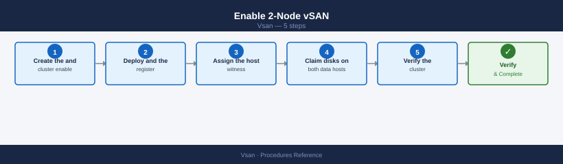

**Step 1 — Create the cluster and enable vSAN**

**From vCenter UI:**
Create a new cluster with both ESXi hosts → Cluster → Configure → vSAN → Configuration → Enable vSAN → select **2-node cluster**

**Step 2 — Deploy and register the witness appliance**

Follow the **Deploy Witness Appliance** procedure above.

**Step 3 — Assign the witness host**

**From vCenter UI:**
Cluster → Configure → vSAN → Fault Domains → assign witness

**Step 4 — Claim disks on both data hosts**

**From vCenter UI:**
Cluster → Configure → vSAN → Disk Management → select each data host → Claim Disks

**Step 5 — Verify the cluster configuration**

```powershell
Get-VsanClusterConfiguration -Cluster (Get-Cluster "VSAN-ROBO-01") |
    Select StretchedClusterEnabled, WitnessHost
```

### Storage Policy for 2-Node

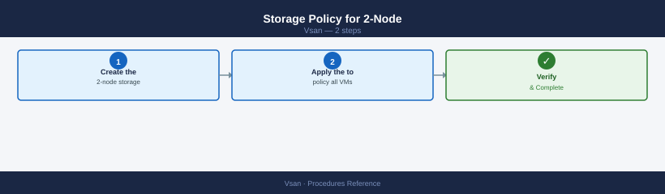

Do not use RAID-5 or RAID-6 — they require a minimum of 4 and 6 nodes respectively.

**Step 1 — Create the 2-node storage policy**

```powershell
New-SpbmStoragePolicy -Name "VSAN-ROBO-FTT1" `
    -Description "2-node ROBO: RAID-1 across both data nodes" `
    -AnyOfRuleSets @(
        New-SpbmRuleSet -AllOfRules @(
            New-SpbmRule -AnyOfCapabilities @(
                New-SpbmCapability -Name "VSAN.hostFailuresToTolerate" -Value 1
            )
        )
    )
```

**Step 2 — Apply the policy to all VMs**

```powershell
$policy = Get-SpbmStoragePolicy "VSAN-ROBO-FTT1"
Get-VM | ForEach-Object {
    Get-HardDisk -VM $_ | Set-SpbmEntityConfiguration -StoragePolicy $policy
}
```

### Validate the 2-Node Setup

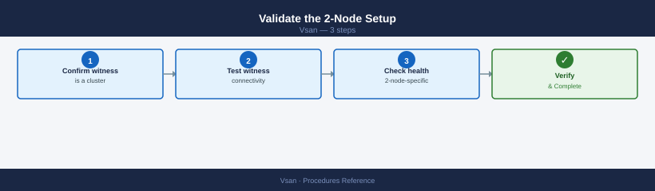

**Step 1 — Confirm witness is a cluster member**

```bash
esxcli vsan cluster get
```


```text title="Expected output"
Cluster UUID                : 52d4a8c1-7f2e-4a1b-9c3d-e8f1a2b3c4d5
Cluster Enabled             : true
Current Local Time          : 2024-01-15T14:32:18Z
Local Cluster State         : RUNNING
Sub-Cluster Resync Throttle : 100
Stretched Cluster Mode      : false
Encryption Enabled          : false
Deduplication Mode          : Off
Compression Mode            : Off
RAID-1 Mirror Witness       : Disabled
Health State                : Healthy
Disk Balance                 : Balanced
```

!!! warning "Common errors"
    **`Error: Could not connect to the host. Verify the host name, port, and credentials.`** — Ensure the ESXi host is reachable and you have valid credentials configured in your vSphere client or SSH session.
    **`Error: vSAN cluster is not enabled on this host.`** — Enable vSAN on the cluster through vCenter Server or verify the host is part of an active vSAN cluster.
    **`Error: Permission denied.`** — Verify your user account has the required vSAN administrator or cluster administrator role assigned in vCenter.
**Step 2 — Test witness connectivity from both data nodes**

```bash
vmkping -I vmk2 <witness_vsan_vmk_ip>
```


```text title="Expected output"
PING 192.168.100.45 (192.168.100.45): 56 data bytes
64 bytes from 192.168.100.45: icmp_seq=0 ttl=64 time=2.341 ms
64 bytes from 192.168.100.45: icmp_seq=1 ttl=64 time=2.156 ms
64 bytes from 192.168.100.45: icmp_seq=2 ttl=64 time=2.289 ms
64 bytes from 192.168.100.45: icmp_seq=3 ttl=64 time=2.204 ms
64 bytes from 192.168.100.45: icmp_seq=4 ttl=64 time=2.178 ms

--- 192.168.100.45 statistics ---
5 packets transmitted, 5 packets received, 0% packet loss
round-trip min/avg/max = 2.156/2.233/2.341 ms
```

!!! warning "Common errors"
    **`vmkping: Unknown host <witness_vsan_vmk_ip>`** — Replace the placeholder with the actual witness node vSAN VMK IP address (e.g., 192.168.100.45).
    **`vmkping: No such device`** — Verify that vmk2 exists on the ESXi host using `esxcfg-vmknic -l` and confirm it is bound to the vSAN network.
    **`100% packet loss`** — Check network connectivity between the ESXi host and witness node; verify firewall rules allow vSAN traffic on port 12321 and that the witness VMK is reachable.
**Step 3 — Check 2-node-specific health checks**

**From vCenter UI:**
Cluster → Monitor → vSAN → Skyline Health → 2-Node cluster checks — all should be green.

### Simulate Failure (Test)

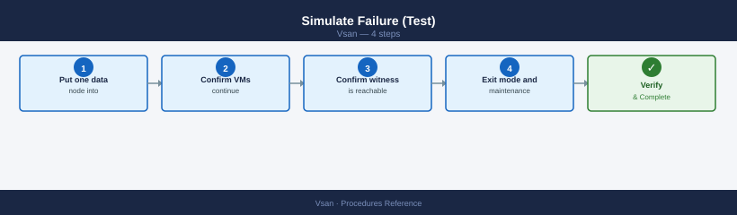

**Step 1 — Put one data node into maintenance mode**

Use **Ensure Accessibility** — not Full Migration (2-node has no third data node to migrate to).

**From vCenter UI:**
Right-click data node → Maintenance Mode → Enter Maintenance Mode → Ensure Accessibility

**Step 2 — Confirm VMs continue running on the surviving node**

**From vCenter UI:**
Monitor → vSAN → Virtual Machines — all VMs should remain running

**Step 3 — Confirm witness is reachable**

```bash
vmkping -I vmk2 <witness_vsan_vmk_ip>
```


```text title="Expected output"
PING 192.168.100.45 (192.168.100.45): 56 data bytes
64 bytes from 192.168.100.45: icmp_seq=0 ttl=64 time=2.341 ms
64 bytes from 192.168.100.45: icmp_seq=1 ttl=64 time=2.156 ms
64 bytes from 192.168.100.45: icmp_seq=2 ttl=64 time=2.289 ms
64 bytes from 192.168.100.45: icmp_seq=3 ttl=64 time=2.401 ms
64 bytes from 192.168.100.45: icmp_seq=4 ttl=64 time=2.178 ms

--- 192.168.100.45 statistics ---
5 packets transmitted, 5 packets received, 0% packet loss
round-trip min/avg/max = 2.156/2.273/2.401 ms
```

!!! warning "Common errors"
    **`vmkping: Unknown interface vmk2`** — Verify the vmkernel interface exists with `esxcli network ip interface list` and use the correct interface name.
    **`PING 192.168.100.45 (192.168.100.45): 56 data bytes ... 100% packet loss`** — Confirm the witness node IP is correct, check VSAN network connectivity, and verify firewall rules allow VSAN traffic on port 12321.
    **`vmkping: Permission denied`** — Run the command as root or with appropriate ESXi privileges; use `sudo` or execute from the ESXi shell with elevated permissions.
**Step 4 — Exit maintenance mode and verify resync**

=== "vCenter UI"
    Right-click the maintenance node → Maintenance Mode → Exit Maintenance Mode

=== "CLI"
    ```bash
    watch -n 60 "esxcli vsan debug resync summary get"
    ```

---

## See also

- [vSAN — Health Checks](../health-checks/)
- [vSAN — Common Issues](../../troubleshooting/common-issues/)
- [vSAN Operations — CLI Reference](../cli-reference/)

## Verify

- **Alarms:** vSphere Client → Home → Alarms — no new critical alarms after the operation
- **Events:** monitor the vCenter Events view for the affected object for 5 minutes
- **Health check:** run the morning health-check sequence for the affected product tier
