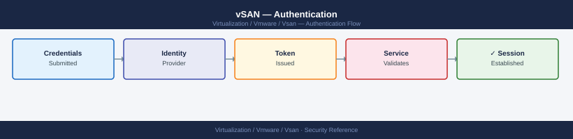

---
tags:
  - security
  - vmware
  - vsan
  - vsphere-8
---
# vSAN — Authentication

<div class="kb-summary">
vSAN does not have its own authentication system. All access to vSAN management functions is authenticated through vCenter Server, which in turn delegates identity verification to the vSphere SSO domain and configured identity sources.

*Applies to: vSAN 7.x / 8.x*
</div>


---

## Before you begin

- **Access:** vCenter Administrator role
- **Change management:** security changes require CAB approval in most environments
- **Rollback plan:** document current state before any security control change
- **Testing:** validate in a non-production environment first where possible

---

## Authentication Stack

### Multi-Factor Authentication

vCenter SSO supports SAML-based MFA through external identity providers:

- **ADFS with MFA policies:** Configure AD FS as a SAML 2.0 identity provider in vCenter SSO.
- **Okta / Azure AD (Entra ID):** Configure as SAML IdP — supported from vSphere 7.0 U2 onward.
- **RSA SecurID:** Available as a Smart Card / CAC integration or via ADFS relay.

**Configure external IdP (vSphere 7.0+):**

vSphere Client → vCenter → Administration → Single Sign-On → Configuration → Identity Provider → Change to ADFS / external

Note: When an external IdP is configured, the vsphere.local domain remains available for break-glass access via the direct SSO login page at `https://vcenter/ui/`.

---

## Service Accounts

### Principles

- Use dedicated service accounts for each integration (backup, monitoring, automation).
- Assign the minimum required vCenter role to each service account.
- Do not share service account credentials between systems.
- Rotate service account passwords on a defined schedule (90 days recommended, or per policy).
- Store credentials in a secrets manager (HashiCorp Vault, CyberArk, Azure Key Vault) rather than configuration files.

### Recommended Service Accounts

| Account | Purpose | Required Role |
|---|---|---|
| `svc-veeam-vcenter` | Veeam backup integration | Veeam-defined custom role (backup operator) |
| `svc-aria-vcenter` | Aria Operations monitoring | Read Only + vSAN performance access |
| `svc-ansible-vcenter` | Ansible automation | Custom role with required task permissions |
| `svc-vlcm-agent` | vLCM hardware manager | Administrator (restricted to cluster scope) |

### Create a Least-Privilege Monitoring Account

```powershell
Connect-VIServer <vcenter>

# Create a read-only role with vSAN performance access
$permissions = @(
    "System.Anonymous", "System.Read", "System.View",
    "Global.VCServer",
    "Performance.ModifyIntervals",
    "VirtualMachine.State.CreateSnapshot"  # required for Veeam-style tools
)

New-VIRole -Name "vSAN-Monitor-RO" -Privilege (Get-VIPrivilege -Id $permissions)

# Assign the role to the monitoring service account on the cluster
$principal = "EXAMPLE\svc-aria-vcenter"
Set-VIPermission -Entity (Get-Cluster "VSAN-LON-01") `
                 -Principal $principal `
                 -Role "vSAN-Monitor-RO" `
                 -Propagate $true
```

---

## Session and Token Management

### vCenter Session Tokens

vCenter issues session tokens after successful SSO authentication. Default session settings:

| Setting | Default | Recommendation |
|---|---|---|
| Session timeout | 30 minutes (inactivity) | Keep at 30 minutes or reduce to 15 minutes for privileged roles |
| Max login attempts before lockout | Not limited by default | Set via SSO policy — recommend 5 attempts |
| Lockout duration | N/A (not set) | Configure 15-minute lockout after 5 failures |

**Configure SSO lockout policy:**

vSphere Client → vCenter → Administration → Single Sign-On → Configuration → Local Accounts → Lockout Policy

| Field | Recommended Value |
|---|---|
| Maximum number of failed login attempts | 5 |
| Time interval between failures (seconds) | 180 |
| Unlock time (seconds) | 900 (15 minutes) |

### API Tokens and Automation

For automation with PowerCLI or REST API, use session tokens rather than embedding credentials in scripts:

```powershell
# Request a session token (avoids passing credentials in each call)
Connect-VIServer <vcenter> -Credential (Get-Credential)
$session = $global:DefaultVIServer.SessionId

# Use the session token in API calls
# PowerCLI maintains the session automatically during the script run
Disconnect-VIServer -Confirm:$false
```

For REST API automation:

```bash
# Authenticate and get a session token
TOKEN=$(curl -s -u "administrator@vsphere.local:password" \
    -X POST "https://vcenter/api/session" \
    -k | tr -d '"')

# Use the token in subsequent calls
curl -s -H "vmware-api-session-id: $TOKEN" \
    "https://vcenter/api/vcenter/cluster" -k | jq '.'

# Terminate the session when done
curl -s -H "vmware-api-session-id: $TOKEN" \
    -X DELETE "https://vcenter/api/session" -k
```


```text title="Expected output"
{
  "value": [
    {
      "cluster": "domain-c8",
      "name": "Production-Cluster-01",
      "drs_enabled": true,
      "ha_enabled": true,
      "vsan_enabled": true
    },
    {
      "cluster": "domain-c12",
      "name": "DR-Cluster-02",
      "drs_enabled": true,
      "ha_enabled": true,
      "vsan_enabled": false
    },
    {
      "cluster": "domain-c15",
      "name": "Test-Cluster-03",
      "drs_enabled": false,
      "ha_enabled": false,
      "vsan_enabled": true
    }
  ]
}
```

!!! warning "Common errors"
    **`curl: (60) SSL certificate problem: self signed certificate`** — Add `-k` flag to curl commands to skip certificate verification (already present in example, but ensure it's not removed).
    **`{"type":"com.vmware.vapi.std.errors.unauthenticated","value":{"messages":[{"args":[],"default_message":"Invalid session."}]}}`** — Verify the TOKEN variable is populated correctly by checking `echo $TOKEN` before the second curl call; re-authenticate if empty.
    **`curl: (7) Failed to connect to vcenter port 443: Connection refused`** — Confirm vCenter hostname/IP is correct and accessible on port 443 with `ping vcenter` or `nc -zv vcenter 443`.
---

## ESXi Host Authentication

### SSH Access

SSH to ESXi hosts is disabled by default and should remain disabled in production. Enable only when required for maintenance, then disable again.

```bash
# Enable SSH from ESXi shell (local console)
esxcli system maintenanceMode set --enable true  # if host needs to be in MM first
vim-cmd hostsvc/enable_ssh
vim-cmd hostsvc/start_ssh

# Disable SSH after maintenance
vim-cmd hostsvc/stop_ssh
vim-cmd hostsvc/disable_ssh
```


```text title="Expected output"
(no output — command completes silently)
(no output — command completes silently)
(no output — command completes silently)
(no output — command completes silently)
(no output — command completes silently)
```

!!! warning "Common errors"
    **`vim-cmd: Unknown command 'hostsvc/enable_ssh'`** — Use the correct vim-cmd syntax: `vim-cmd hostsvc/enable_ssh` requires the ESXi host to be accessible via vSphere API; run these commands directly in the ESXi local console or SSH session, not remotely.
    **`Error: The object or item could not be found on the server`** — Ensure you are running vim-cmd on the ESXi host itself (via SSH or local console), not from a vCenter Server or remote management station.
**Or from vCenter UI:**
Host → Configure → Services → SSH → Start / Stop

### Root Password Management

- The ESXi root password should be managed through vCenter host profiles or a configuration management tool.
- Rotate root passwords on a schedule (90 days).
- Store root credentials in a privileged access management (PAM) system.
- Consider disabling direct root login via SSH and using named admin accounts with `su` — supported from ESXi 8.0.

### Active Directory for ESXi Host Access

ESXi hosts can be joined to Active Directory, allowing domain users to authenticate to the ESXi shell and DCUI.

```bash
# Join ESXi host to AD from ESXi shell
esxcli system settings advanced set \
    -o /Config/HostAgent/plugins/hostsvc/esxAdminsGroup \
    -s "vSphere Admins"

# Join host to domain via vCenter
# vSphere Client → Host → Configure → System → Authentication Services → Join Domain
```


```text title="Expected output"
(no output — command completes silently)
```

!!! warning "Common errors"
    **`Error: Unknown option or flag '-o'`** — Use the correct esxcli syntax: `esxcli system settings advanced set --option=/Config/HostAgent/plugins/hostsvc/esxAdminsGroup --string-value="vSphere Admins"`.
    **`Error: Permission denied`** — Ensure you are logged into the ESXi shell with root or equivalent administrative credentials, not a standard user account.
When joined to AD, members of the `ESX Admins` group (or the configured group) receive Administrator access to the ESXi host.

**Post-join verification:**

```bash
/opt/likewise/bin/lwsm status
# lsass service should be running
```


```text title="Expected output"
Service 'lsass' (Local Security Authority)
	Status: running
	PID: 2847

Service 'netlogond' (Net Logon)
	Status: running
	PID: 2891

Service 'dcerpc' (DCE/RPC)
	Status: running
	PID: 2834

Service 'eventlog' (Event Log)
	Status: running
	PID: 2856

Service 'srvsvc' (Server Service)
	Status: running
	PID: 2903
```

!!! warning "Common errors"
    **`Service 'lsass' (Local Security Authority) Status: stopped`** — Restart the lsass service with `/opt/likewise/bin/lwsm start lsass` and verify domain connectivity.
    **`bash: /opt/likewise/bin/lwsm: No such file or directory`** — Verify Likewise Open is installed with `rpm -qa | grep likewise` and reinstall if missing.
    **`Error: Failed to query service status`** — Check that the Likewise daemon is running with `/opt/likewise/bin/lwsm list` and restart the service with `/opt/likewise/bin/lwsm restart`.
**Add AD groups to vCenter permissions after joining:**

vSphere Client → vCenter → Permissions → Add → select identity source → search AD group → assign role

---

## Certificate-Based Authentication

### vSAN and VMCA

vCenter's VMware Certificate Authority (VMCA) issues certificates to all ESXi hosts during cluster onboarding. These certificates authenticate host-to-host vSAN communications (CMMDS cluster membership protocol).

Verify certificate status:

```bash
# Check host certificate
esxcli system certificate info list

# Check VMCA certificate chain
/usr/lib/vmware/vmca/bin/certool --status
```


```text title="Expected output"
Certificate Information
   Certificate Path: /etc/vmware/ssl/rui.crt
   Certificate Issuer: CN=esx-host-01.lab.local,O=VMware,C=US
   Certificate Expiration Date: 2025-12-15
   Certificate Thumbprint: A1:B2:C3:D4:E5:F6:G7:H8:I9:J0:K1:L2:M3:N4:O5:P6
   Certificate Status: Valid

VMCA Certificate Chain Status
   VMCA Root Certificate Status: Valid
   Root Certificate Expiration: 2030-06-20
   Intermediate Certificate Status: Valid
   Intermediate Expiration: 2027-03-10
   Host Certificate Status: Valid
   Host Certificate Expiration: 2025-12-15
   Chain Validation: PASSED
```

!!! warning "Common errors"
    **`Error: Unable to connect to localhost:443`** — Verify the ESXi host management network is reachable and the certificate service is running with `systemctl status vmware-vpxd`.
    **`Certificate has expired`** — Regenerate the host certificate using `esxcli system certificate install` or request a new signed certificate from your VMCA.
    **`VMCA service is not running`** — Start the VMCA service with `/etc/init.d/vmware-vpxd restart` or check logs in `/var/log/vmware/vpxd/vpxd.log`.
**Custom CA certificates:** Replace VMCA-issued certificates with certificates from an enterprise CA (Microsoft CA, HashiCorp Vault PKI) if your security policy requires it. vSAN continues to function after certificate replacement — vCenter orchestrates the replacement rolling.

vSphere Client → vCenter → Administration → Certificate Management → Replace VMCA Root Certificate

### TLS Configuration

vSAN management traffic between vCenter and ESXi hosts uses TLS 1.2 minimum. TLS 1.0 and 1.1 are disabled by default from vSphere 7.0 onward.

Verify TLS settings on VCSA:

```bash
# On VCSA shell
/usr/lib/vmware-vmafd/bin/vecs-cli entry list --store MACHINE_SSL_CERT
```


```text title="Expected output"
Entry [1]:
	Alias: __MACHINE_CERT
	Entry type: Certificate
	Metadata: CN=vcsa-01.lab.local,O=VMware,C=US
	Alias: __MACHINE_CERT_CHAIN
	Entry type: Certificate chain
	Metadata: CN=vcsa-01.lab.local,O=VMware,C=US; CN=VMware-Root,O=VMware,C=US
	Alias: __MACHINE_PRIVATE_KEY
	Entry type: Private key
	Metadata: RSA 2048-bit
```

!!! warning "Common errors"
    **`Error: Could not connect to certificate store`** — Ensure the vmafd service is running with `systemctl status vmafd` and restart if needed.
    **`Error: Access denied`** — Run the command with elevated privileges using `sudo` or directly as root user.
Configure minimum TLS version in vCenter:
vSphere Client → vCenter → Configure → Advanced Settings → `config.tls.minVersion` = `TLSv1.2`
---

## Related Reference

- [Standard LDAP Integration](../../../../../security/ldap-integration/index.md) — field reference, service account standards, TLS requirements, and connectivity testing
- [Standard SAML Configuration](../../../../../security/saml-configuration/index.md) — SP/IdP setup, Azure AD and Okta steps, attribute mapping, and security requirements

## See also

- [vSAN — Access Control](../access-control/)
- [vSAN — Hardening](../hardening/)
