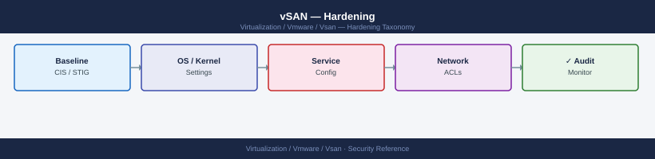

---
tags:
  - security
  - vmware
  - vsan
  - vsphere-8
description: "vSAN hardening covers the security baseline configuration applied to the ESXi hosts that form the vSAN cluster, the vCenter managing the cluster, and the..."
---
# vSAN — Hardening

<div class="kb-summary">
vSAN hardening covers the security baseline configuration applied to the ESXi hosts that form the vSAN cluster, the vCenter managing the cluster, and the vSAN-specific settings. References: VMware vSphere Security Configuration Guide (Broadcom), DISA STIG for vSphere ESXi.

*Applies to: vSAN 7.x / 8.x*
</div>


## Before you begin

- **Access:** vCenter Administrator role
- **Change management:** security changes require CAB approval in most environments
- **Rollback plan:** document current state before any security control change
- **Testing:** validate in a non-production environment first where possible

---

## ESXi Host Hardening

**Service baseline:**

| Service | Production State | Notes |
|---|---|---|
| SSH | Stopped, disabled | Enable only for maintenance; disable after |
| ESXi Shell | Stopped, disabled | Enable via DCUI only when needed |
| NTP | Running | Required — vSAN is sensitive to clock drift |
| SFCBD (CIM) | Stopped | Disable unless using SNMP hardware monitoring |
| Syslog | Running | Required for log shipping to SIEM |
| vSAN Transport | Running | Core vSAN service — do not disable |

### SSH Hardening

When SSH must be enabled for maintenance, restrict it:

```bash
# Restrict SSH to management network only (ESXi firewall)
esxcli network firewall ruleset set --ruleset-id sshServer --allowed-all false
esxcli network firewall ruleset allowedip add --ruleset-id sshServer --ip-address 10.0.0.0/24

# Set SSH idle timeout (auto-disconnect after 5 minutes)
esxcli system settings advanced set -o /UserVars/ESXiShellInteractiveTimeOut -i 300
esxcli system settings advanced set -o /UserVars/ESXiShellTimeOut -i 300

# Disable SSH banner suppression (show legal notice)
esxcli system settings advanced set -o /Config/Etc/motd -s "Authorized access only. Activity monitored."
```


```text title="Expected output"
Operation completed successfully.
Operation completed successfully.
Operation completed successfully.
Operation completed successfully.
Operation completed successfully.
```

!!! warning "Common errors"
    **`Error: Unknown option or setting '/UserVars/ESXiShellInteractiveTimeOut'`** — Verify the exact parameter name with `esxcli system settings advanced list | grep -i timeout` as the setting may differ by ESXi version.
    **`Error: Ruleset 'sshServer' does not exist`** — Use `esxcli network firewall ruleset list` to confirm the correct ruleset name (typically `sshServer` on ESXi 6.5+, but may vary).
### ESXi Firewall

```bash
# List all enabled firewall rules
esxcli network firewall ruleset list | grep "true\s"

# Verify vSAN-required ports are open
esxcli network firewall ruleset list | grep -E "vSAN|CMMDS|FaultTolerance"

# Close rules not required in your environment
esxcli network firewall ruleset set --ruleset-id ntpClient --enabled true
esxcli network firewall ruleset set --ruleset-id DHCPv6 --enabled false    # if IPv6 not in use
esxcli network firewall ruleset set --ruleset-id httpClient --enabled false  # if not using vSAN HCL check
```


```text title="Expected output"
Name                    Enabled
------                  -------
syslog                  true
ntpClient               true
CIMHttpsServer          true
vpxHeartbeats           true
vSAN                    true
CMMDS                   true
vSphere-Client          true
...

Name                    Enabled
------                  -------
vSAN                    true
CMMDS                   true
FaultTolerance          true

(no output — command completes silently)
(no output — command completes silently)
(no output — command completes silently)
```

!!! warning "Common errors"
    **`Error: Unknown option or malformed command`** — Verify the ruleset-id exists by running `esxcli network firewall ruleset list` and use the exact name from the output.
    **`Error: This operation requires elevated privileges`** — Run the commands as root or with appropriate ESXi administrative credentials.
### Account and Password Policies

```bash
# Set password complexity requirements (DCUI → Security Profile → Password Policy)
# Or via advanced settings
esxcli system settings advanced set -o /Security/PasswordQualityControl \
    -s "min=disabled,disabled,disabled,disabled,15 similar=deny retry=3 max=64"

# Set account lockout after 5 failed attempts
esxcli system settings advanced set -o /Security/AccountLockFailures -i 5
esxcli system settings advanced set -o /Security/AccountUnlockTime -i 900

# Set password history (prevent reuse of last 5 passwords)
esxcli system settings advanced set -o /Security/PasswordHistory -i 5
```


```text title="Expected output"
(no output — command completes silently)
(no output — command completes silently)
(no output — command completes silently)
(no output — command completes silently)
```

!!! warning "Common errors"
    **`Error: Unknown option /Security/PasswordQualityControl`** — Verify the advanced setting name matches your ESXi version (some versions use `/Security/PasswordQuality` without `Control`); check `esxcli system settings advanced list | grep -i password` to confirm available options.
    **`Error: Invalid value for option /Security/AccountLockFailures: value must be an integer`** — Remove the `-i` flag if the parameter expects a string, or ensure the value is a valid integer without quotes.
**Via host profile (recommended for cluster-wide enforcement):**

vSphere Client → Policies and Profiles → Host Profiles → Edit Profile → Security and Services → Security Settings → Password Policies

### Limit Root Account

```bash
# Disable root login via SSH (requires named accounts or PAM integration)
# Edit /etc/ssh/sshd_config (persistent across reboots via /etc/ssh/keys-root/ only during session)
# Better approach: use ESXi host profile to manage root access

# Check current root login setting
grep PermitRootLogin /etc/ssh/sshd_config
```


```text title="Expected output"
PermitRootLogin no
```

!!! warning "Common errors"
    **`grep: /etc/ssh/sshd_config: No such file or directory`** — This command runs on ESXi hosts where SSH config is located at `/etc/ssh/sshd_config`; verify SSH is enabled on the host and you are connected to the correct ESXi system.
    **`Permission denied`** — Run the command as root or with `sudo` since `/etc/ssh/sshd_config` requires elevated privileges to read on some ESXi versions.
From ESXi 8.0, the `PermitRootLogin` option can be set to `no` with named admin accounts defined. Document this change before applying — losing root SSH access to all hosts simultaneously is a recovery scenario.

### Audit Logging to Syslog

All ESXi security events should ship to a central syslog server (SIEM):

```bash
# Configure remote syslog
esxcli system syslog config set --loghost=udp://siem.example.com:514
esxcli system syslog reload

# Verify syslog is shipping
esxcli system syslog config get

# Open firewall for syslog
esxcli network firewall ruleset set --ruleset-id syslog --enabled true
```


```text title="Expected output"
(no output — command completes silently)
(no output — command completes silently)
Loghost: udp://siem.example.com:514
Default Network Retry Timeout: 180
Default Network Retry Attempts: 3
Queue Drop Mark: 90
(no output — command completes silently)
```

!!! warning "Common errors"
    **`Error: Unknown option --loghost`** — Use `--loghost=` syntax without spaces (e.g., `--loghost=udp://siem.example.com:514`).
    **`Error: Unable to resolve hostname siem.example.com`** — Verify DNS resolution on the ESXi host with `esxcli network ip dns server list` and ensure the SIEM server hostname is correct.
    **`Error: Ruleset syslog not found`** — The ruleset name is `syslog` but may not exist on all ESXi versions; use `esxcli network firewall ruleset list` to confirm the exact ruleset name.
**Key events to monitor in syslog:**

- `SSH login`
- `Root login`
- `Failed authentication`
- `Host entering maintenance mode`
- `vSAN health alarm`
- `Disk group failure`

### NTP Configuration

vSAN requires clock synchronisation within 500 milliseconds across all cluster hosts. Clock drift causes CMMDS partitioning, health check failures, and object resync issues.

```bash
# Configure NTP servers
esxcli system ntp set --server ntp1.example.com --server ntp2.example.com

# Enable NTP
esxcli system ntp set --enabled true

# Verify NTP status
esxcli system ntp get
esxcli system time get
ntpq -p   # shows NTP peer status
```


```text title="Expected output"
(no output — command completes silently)
(no output — command completes silently)
Enabled: true
ConfigFile: /etc/ntp.conf
Servers: ntp1.example.com,ntp2.example.com

Current Time: 2024-01-15T14:32:47Z
Timezone: UTC
NTP Synchronized: true

     remote           refid      st t when poll reach   delay   offset  jitter
==============================================================================
*ntp1.example.co 10.0.0.1         2 u   64  128  377   12.456   -1.234   2.105
+ntp2.example.co 10.0.0.2         2 u   62  128  377   15.789    0.567   1.892
-ntp.ubuntu.com  216.239.35.0     2 u  126  128  377   48.234   12.456   5.234
```

!!! warning "Common errors"
    **`Connection refused`** — Verify that NTP servers are reachable from the ESXi host and that firewall rules allow UDP port 123 outbound.
    **`Error: Unable to set NTP servers`** — Ensure you have root/administrator privileges and that the ESXi host is not in lockdown mode.
    **`ntpq: read: Connection refused`** — Confirm that the ntpd service is running with `systemctl status ntpd` or restart it with `systemctl restart ntpd`.
**Via host profile:**
Host Profiles → Security and Services → Time Configuration → NTP Configuration

---

## vCenter Hardening

### VCSA Appliance Settings

```bash
# SSH to VCSA (disable after configuration)
# Set session timeout in SSO
# vSphere Client → vCenter → Administration → SSO → Configuration → Session → Timeout
```

**Disable unnecessary services on VCSA:**

From VCSA management UI (`https://vcenter:5480`):
- Services → review running services
- Disable SFTP, FTP, Telnet if enabled

**Enable VCSA audit logging:**

VCSA ships audit logs to `/var/log/audit/`. Forward via rsyslog to SIEM:

```bash
# On VCSA shell — configure rsyslog to forward to SIEM
cat >> /etc/vmware-syslog/syslog.conf << EOF
*.* @siem.example.com:514
EOF
/etc/init.d/rsyslog restart
```


```text title="Expected output"
(no output — command completes silently)
 * Stopping rsyslog                                             [ OK ]
 * Starting rsyslog                                             [ OK ]
```

!!! warning "Common errors"
    **`cat: /etc/vmware-syslog/syslog.conf: Permission denied`** — Run the commands with `sudo` or as root user.
    **`Job for rsyslog.service failed because the control process exited with error code.`** — Verify the syslog.conf syntax is correct and the SIEM server address is reachable with `telnet siem.example.com 514`.
### TLS and Cipher Configuration

vCenter uses TLS 1.2 minimum from vSphere 7.0. Verify:

```bash
# From VCSA shell — check enabled TLS versions
/usr/lib/vmware-vmafd/bin/vecs-cli entry list --store MACHINE_SSL_CERT | grep -i tls
```


```text title="Expected output"
TLSv1.2
TLSv1.3
Certificate CN=vcsa-01.corp.local, OU=VMware, O=VMware, C=US
Issuer CN=VMware-Root-CA, OU=VMware, O=VMware, C=US
```

!!! warning "Common errors"
    **`Error: Could not connect to local certificate store`** — Ensure the vmafd service is running with `systemctl status vmafd` and restart if needed.
    **`grep: (standard input): No such file or directory`** — Verify the MACHINE_SSL_CERT store exists by running `vecs-cli store list` first to confirm certificate stores are accessible.
Disable weak ciphers via the vSphere Client:
vCenter → Configure → Advanced Settings → search for `config.tls` and `config.ssl`

### Limit vCenter API Access

Restrict access to the vCenter management plane:

```bash
# vSphere Client → vCenter → Configure → Firewall
# Restrict inbound HTTPS/443 to management network only
# This is typically done at the network layer (firewall/NSX)
```

At the network layer, vCenter management traffic (HTTPS/443) should only be reachable from:
- Admin workstations on the management VLAN.
- Automation systems (Ansible, Terraform) on a controlled network segment.
- Backup tools (Veeam, Commvault) via their proxy VMs.

---

## vSAN-Specific Hardening Settings

### Enable Data-in-Transit Encryption

Encrypt all vSAN host-to-host data traffic to prevent packet capture on the vSAN network:

```powershell
Connect-VIServer <vcenter>
$config = Get-VsanClusterConfiguration -Cluster (Get-Cluster "VSAN-LON-01")
Set-VsanClusterConfiguration -Configuration $config -DataInTransitEncryptionEnabled $true
```

### Enable Data-at-Rest Encryption

See the Encryption page for full KMS setup. Enable only after KMS is configured and validated:

```powershell
Set-VsanClusterConfiguration `
    -Configuration $config `
    -EncryptionEnabled $true `
    -KmsCluster (Get-KeyManagementServer "prod-kms")
```

### Disable vSAN iSCSI Target Service (if Not Used)

vSAN iSCSI target service allows non-vSphere hosts to access vSAN as an iSCSI block store. If not in use, disable it to reduce attack surface.

vSphere Client → Cluster → Configure → vSAN → iSCSI Target Service → Disable

### Restrict vSAN File Services (if Not Used)

vSAN File Services exposes NFS and SMB shares. If not required, do not enable it. If enabled:

- Restrict NFS export access by IP/subnet.
- Use SMB with NTFS ACLs and Kerberos authentication.
- Do not expose file service endpoints on untrusted VLANs.

### Check vSAN Disk Format Version

Keep vSAN disk format at the current version for each vSAN release. Older disk format versions lack security and performance improvements.

```powershell
# Check disk format version
Get-VsanClusterConfiguration -Cluster (Get-Cluster "VSAN-LON-01") |
    Select DiskFormatVersion
```

Upgrade disk format after cluster upgrades:
vSphere Client → Cluster → Configure → vSAN → Advanced Options → Disk Format Version → Upgrade

---

## Compliance and Auditing

### VMware Security Configuration Guide (SCG)

The VMware Security Configuration Guide (Broadcom KB) defines recommended settings for vSphere and vSAN. Apply all applicable settings from the SCG for the deployed vSphere version.

Key SCG controls for vSAN environments:

| Control | Setting |
|---|---|
| ESXi SSH disabled | Disabled (enable only for maintenance) |
| ESXi shell disabled | Disabled |
| Password complexity | Minimum 15 characters, complexity enforced |
| Account lockout | 5 failures → 15-minute lockout |
| NTP configured | Two NTP servers minimum |
| Syslog to remote | Enabled and configured |
| TLS minimum version | TLS 1.2 |
| Managed object browser (MOB) | Disabled |
| vCenter SSO lockout | Configured |

### DISA STIG for VMware vSphere ESXi

The DISA STIG (Security Technical Implementation Guide) for VMware ESXi provides CAT I/II/III findings with specific remediation scripts. Applicable to US Government and FedRAMP environments.

Obtain the STIG from: [https://public.cyber.mil/stigs/](https://public.cyber.mil/stigs/)

Key CAT I findings for vSAN hosts:

| STIG ID | Finding | Remediation |
|---|---|---|
| ESXI-80-000001 | Remote logging not configured | Configure syslog to remote server |
| ESXI-80-000002 | SSH enabled | Disable SSH service |
| ESXI-80-000048 | NTP not configured | Configure NTP with two sources |
| ESXI-80-000116 | Password policy insufficient | Set minimum complexity |
| ESXI-80-000148 | DCUI access not restricted | Limit DCUI access to console only |

### vSAN Compliance with Aria Operations

Aria Operations with the vSAN management pack provides ongoing compliance dashboards:

- vSphere Security Configuration Guide compliance score per host.
- vSAN encryption status per cluster.
- Open firewall rules per host.
- Certificate expiry tracking.

Use the compliance score as a leading indicator — any drift from baseline triggers an alert.

---

## Host Profile Enforcement

Use vCenter Host Profiles to enforce hardening settings cluster-wide and detect drift automatically.

```powershell
# Create a host profile from a hardened reference host
$referenceHost = Get-VMHost "esxi-01-hardened.example.com"
$profile = New-VMHostProfile -Name "vSAN-Hardening-Baseline" -ReferenceHost $referenceHost

# Attach the profile to the cluster
$cluster = Get-Cluster "VSAN-LON-01"
foreach ($host in (Get-VMHost -Location $cluster)) {
    Set-VMHostProfile -Entity $host -Profile $profile
}

# Check compliance
Test-VMHostProfileCompliance -VMHost (Get-VMHost -Location $cluster) |
    Select VMHost, ComplianceStatus, InComplianceChecks, NotInComplianceChecks |
    Format-Table -AutoSize
```

**Remediate non-compliant hosts:**

```powershell
# Apply profile to non-compliant host (requires maintenance mode)
$host = Get-VMHost "esxi-02.example.com"
Invoke-VMHostProfile -VMHost $host -Profile $profile -Confirm:$false
```

Host profiles are the recommended mechanism for maintaining configuration consistency on vSAN clusters. Any manual change to a host will show as non-compliant in the next profile check.

## See also

- [vSAN — Access Control](../access-control/)
- [vSAN — Authentication](../authentication/)
- [vSAN — Health Checks](../../operations/health-checks/)
