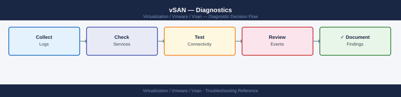

---
tags:
  - troubleshooting
  - vmware
  - vsan
  - vsphere-8
search:
  boost: 1.5
description: "vSAN diagnostic commands: check all vSAN health checks from the Skyline Health UI and esxcli, inspect object and component health with esxcli vsan debug..."
---
# vSAN — Diagnostics

<div class="kb-summary">
vSAN diagnostic commands: check all vSAN health checks from the Skyline Health UI and esxcli, inspect object and component health with esxcli vsan debug, run MTU tests and vmkping to isolate network partition issues, collect SMART data and LSOM errors for disk failures, and generate the vCenter and ESXi support bundle for VMware SRs.

*Applies to: vSAN 7.x / 8.x*
</div>


```d2
direction: right

B: "B" {shape: rectangle}
C: "vSphere Client: Cluster → Monitor → vSAN → Skyline\nHealth\nCheck failed health checks and recommended actions" {shape: rectangle}
D: "esxcli vsan debug object list on ESXi\nFilter: grep -v Healthy to find problem objects" {shape: rectangle}
E: "vSphere Client: Monitor → vSAN → Performance\nCheck cluster read/write latency and congestion" {shape: rectangle}
F: "esxcli vsan debug network test\nvmkping -I vmk2 -d -s 8972 peer-vmk-ip" {shape: rectangle}
G: "esxcli vsan storage list\nesxcli storage core device smart get -d naa\ngrep LSOM vmkernel.log" {shape: rectangle}
H: "RVC: vsan.resync_dashboard .\nCheck slack space and bandwidth cap settings" {shape: rectangle}
I: "I" {shape: rectangle}
J: "Follow recommended action in Skyline Health UI\nRe-run health check to confirm fix" {shape: rectangle}
K: "Step 2: object-level diagnostics\nesxcli vsan debug object list" {shape: rectangle}
L: "esxcli vsan debug object get -u uuid\nCheck component locations and health state" {shape: rectangle}
M: "esxcli vsan perf get\nIdentify noisy VM: PowerCLI Get-Stat disk.write.average" {shape: rectangle}
N: "esxcli vsan network list\nesxcli network nic stats get -n vmnic2" {shape: rectangle}
O: "Check SMART: Reallocated Pending Uncorrectable sectors\ngrep naa.device vmkernel.log for errors" {shape: rectangle}
P: "Check slack space: esxcli vsan storage list\nReview resync bandwidth: vSAN config" {shape: rectangle}
Q: "Collect vCenter and ESXi support bundle\nOpen VMware SR" {shape: rectangle}
R: "vc-support.sh from VCSA + vm-support --vsan on\neach ESXi host\nAttach to VMware Support Request" {shape: rectangle}
A: "vSAN Issue" {shape: rectangle}

B -> C
B -> D
B -> E
B -> F
B -> G
B -> H
I -> J
I -> K
D -> L
E -> M
F -> N
G -> O
H -> P
J -> Q
K -> Q
L -> Q
M -> Q
N -> Q
O -> Q
P -> Q
Q -> R
```

```d2
direction: down

symptom: Identify Symptom {shape: diamond}
step_1_check_vsan_skyline_health: "Step 1 — Check vSAN Skyline Health" {shape: rectangle}
step_2_performance_diagnostics: "Step 2 — Performance diagnostics" {shape: rectangle}
step_3_object_and_component_diagnost: "Step 3 — Object and component diagnostics" {shape: rectangle}
step_4_network_diagnostics: "Step 4 — Network diagnostics" {shape: rectangle}
step_5_disk_and_disk_group_diagnosti: "Step 5 — Disk and disk group diagnostics" {shape: rectangle}
step_6_advanced_diagnostics_vsish_an: "Step 6 — Advanced diagnostics (vsish and RVC)" {shape: rectangle}
resolution: Resolve or Escalate {shape: oval}

symptom -> step_1_check_vsan_skyline_health: investigate
symptom -> step_2_performance_diagnostics: investigate
symptom -> step_3_object_and_component_diagnost: investigate
symptom -> step_4_network_diagnostics: investigate
symptom -> step_5_disk_and_disk_group_diagnosti: investigate
symptom -> step_6_advanced_diagnostics_vsish_an: investigate
step_1_check_vsan_skyline_health -> resolution
step_2_performance_diagnostics -> resolution
step_3_object_and_component_diagnost -> resolution
step_4_network_diagnostics -> resolution
step_5_disk_and_disk_group_diagnosti -> resolution
step_6_advanced_diagnostics_vsish_an -> resolution
```

## Before you begin

- **Access:** vSphere Client with cluster admin privileges; SSH to ESXi hosts as root; SSH to VCSA as root
- **Gather first:** the specific symptom (object UUID from vSAN alarm, affected VM name, latency metric, health check name), the affected host or disk, and when the issue started
- **Scope:** confirm whether the issue affects one object, one disk group, one host, or the whole cluster — check vSAN health UI first before running CLI commands
- **Performance Service:** vSAN performance graphs require the vSAN Performance Service to be enabled on the cluster; without it, no historical data is available

---

## Step 1 — Check vSAN Skyline Health

```bash
# From ESXi shell — run the built-in health check
esxcli vsan health cluster list

# Or run it from vSphere Client:
# vSphere Client → Cluster → Monitor → vSAN → Skyline Health → Retest
```


```text title="Expected output"
Cluster UUID                      Health State
------------------------------------  -----------
52d4a8f1-7c2e-4a9b-b1e3-9f2c8d6a5b3c  Healthy
52d4a8f1-7c2e-4a9b-b1e3-9f2c8d6a5b3c  Healthy

Cluster Information:
  Cluster Name: prod-vsan-cluster-01
  Node Count: 4
  Disk Groups: 8
  Physical Disks: 32
  Capacity: 14.2 TB
  Used: 8.7 TB

Health Check Results:
  Overall Status: Healthy
  Last Check: 2024-01-15 14:32:18 UTC
  Issues Found: 0
```

!!! warning "Common errors"
    | Error | Fix |
    |---|---|
    | `vSAN health cluster list: Unknown command or namespace` | Verify the ESXi host has vSAN enabled and run the command from the ESXi shell with proper vSAN module loaded. |
    | `Error: Unable to connect to vSAN cluster` | Ensure all vSAN nodes are online and network connectivity between cluster members is functional. |
| Health category | What it checks |
|---|---|
| Data | Object policy compliance, rebuild capacity, resync status |
| Network | MTU, multicast, vSAN VMkernel reachability |
| Physical disk | SMART, capacity tier health, deduplication metadata |
| Cluster | Advanced configuration consistency, vCenter connectivity |
| Performance | Performance service status, stats DB disk usage |

**Key CLI checks from ESXi shell:**

```bash
# Cluster partition status
esxcli vsan cluster get
# Expected: Sub-Cluster Master UUID matches across all hosts

# All hosts in the vSAN cluster
esxcli vsan cluster unicastagent list

# vSAN network interfaces and tagged VMkernel adapters
esxcli vsan network list
# Expected: a VMkernel adapter with vSAN traffic type
```


```text title="Expected output"
Cluster ID: 52d4a8f0-7c2e-4f1a-9b3c-1a2b3c4d5e6f
Cluster Partition Master UUID: 7f8e9d0c-1b2a-3c4d-5e6f-7a8b9c0d1e2f
Sub-Cluster Master UUID: 7f8e9d0c-1b2a-3c4d-5e6f-7a8b9c0d1e2f
Cluster Partition State: ELECTED
Node UUID: a1b2c3d4-e5f6-7a8b-9c0d-1e2f3a4b5c6d

Host: esx-node-01.lab.local
Agent State: AGENT_INITIALIZED
Unicast Agent Address: 192.168.100.11:12321

Host: esx-node-02.lab.local
Agent State: AGENT_INITIALIZED
Unicast Agent Address: 192.168.100.12:12321

Host: esx-node-03.lab.local
Agent State: AGENT_INITIALIZED
Unicast Agent Address: 192.168.100.13:12321

Interface vmk1
  vSAN Traffic Type: vsan
  MTU: 1500
  IP Address: 192.168.100.11/24
  Status: UP
```

!!! warning "Common errors"
    | Error | Fix |
    |---|---|
    | `Cluster Partition State: NOT_ELECTED` | Verify network connectivity between all vSAN hosts and check for split-brain conditions using `esxcli vsan cluster get` on each host. |
    | `Agent State: AGENT_UNREACHABLE` | Restart the vSAN agent on the affected host with `esxcli vsan cluster new -u <cluster-uuid>` or reboot the ESXi host. |
    | `No VMkernel adapter with vSAN traffic type found` | Configure a vSAN-enabled VMkernel adapter on the host using `esxcli vsan network ip add -i vmk1 -t vsan`. |
---

## Step 2 — Performance diagnostics

### Baseline CLI checks

```bash
# SSH to ESXi host as root

# Real-time vSAN performance statistics
esxcli vsan perf get

# VMDK-level performance (per running virtual disk)
esxcli vsan debug vmdk list

# Physical disk I/O breakdown
esxcli vsan debug disk list
```


```text title="Expected output"
vSAN Performance Statistics:
  Cluster UUID: 52e4c8f1-7a2b-4d9e-8c1a-9f3b2e5d7c4a
  Node UUID: esx-host-01.lab.local
  Throughput (MB/s): 1247.3
  IOPS: 18542
  Latency (ms): 2.14
  Congestion Level: Low
  Cache Hit Ratio: 87.2%

VMDK Performance List:
  VMDK: [vsanDatastore] vm-prod-01/vm-prod-01.vmdk
    Read IOPS: 4521  Write IOPS: 3847  Latency: 1.8ms
  VMDK: [vsanDatastore] vm-dev-02/vm-dev-02_1.vmdk
    Read IOPS: 892   Write IOPS: 156   Latency: 2.3ms
  VMDK: [vsanDatastore] vm-backup/vm-backup.vmdk
    Read IOPS: 127   Write IOPS: 2341  Latency: 3.1ms

Physical Disk I/O Breakdown:
  Disk: naa.5001405a1b2c3d4e (SSD)
    Throughput: 312.5 MB/s  IOPS: 4821  Latency: 0.9ms
  Disk: naa.5001405a1b2c3d4f (SSD)
    Throughput: 298.7 MB/s  IOPS: 4612  Latency: 1.1ms
  Disk: naa.5001405a1b2c3d50 (HDD)
    Throughput: 145.2 MB/s  IOPS: 8109  Latency: 4.2ms
```

!!! warning "Common errors"
    | Error | Fix |
    |---|---|
    | `Error: vSAN is not enabled on this host` | Verify vSAN is licensed and enabled on the ESXi host via vCenter or `esxcli vsan cluster get`. |
    | `Error: Permission denied` | Ensure you are logged in as root; use `whoami` to verify and reconnect via SSH if needed. |
    | `Error: Unknown command or namespace` | Confirm the ESXi version supports these esxcli vsan commands (vSAN 6.0+); check with `esxcli system version get`. |
### vSAN Performance from vCenter UI

vSphere Client → Cluster → Monitor → vSAN → Performance

| View | Key Metrics |
|---|---|
| Cluster | Read IOPS, Write IOPS, Read Throughput, Write Throughput, Read Latency, Write Latency |
| Host | Per-host breakdown of the above |
| Disk Group | Cache write buffer utilisation, capacity disk IOPS |
| VM | Per-VM front-end IOPS and latency (requires Performance Service) |
| Virtual Disk | Per-VMDK IOPS and latency |

**Alert thresholds for investigation:**

| Metric | Investigate at |
|---|---|
| Read latency (front-end) | > 10 ms sustained |
| Write latency (front-end) | > 20 ms sustained |
| Back-end read latency | > 30 ms (indicates disk issue, not just resync) |
| Congestion | > 0 for > 5 minutes |
| Cache write buffer (OSA) | > 95% sustained |

### Collect performance statistics via CLI

```bash
# Real-time storage stats (refresh every 5 seconds for 60 seconds)
watch -n 5 "esxcli vsan storage stats get 2>&1 | head -40"

# Network latency between hosts (MTU-sized packets)
vmkping -I vmk2 -d -s 8972 <peer_vmk_ip> -c 100

# Check for NIC errors (drops, errors, retransmits)
esxcli network nic stats get -n vmnic2
```


```text title="Expected output"
Every 5.0s: esxcli vsan storage stats get 2>&1 | head -40                Wed Dec 13 14:22:47 2024

Physical Disk Stats:
  Disk: naa.5001405a1b2c3d4e
    Capacity: 1099511627776
    Used: 549755813888
    Reserved: 274877906944
    Congestion: 0
  Disk: naa.5001405a1b2c3d4f
    Capacity: 1099511627776
    Used: 412316860416
    Reserved: 274877906944
    Congestion: 2

Network Stats:
  Latency (ms): 0.234
  Throughput (MB/s): 1247.5
  Packet Loss: 0.0%

VMKPING: Sending 100 packets to 192.168.100.42 (vmk2)
VMKPING 8972 bytes from 192.168.100.42: icmp_seq=1 time=0.456 ms
VMKPING 8972 bytes from 192.168.100.42: icmp_seq=2 time=0.423 ms
VMKPING 8972 bytes from 192.168.100.42: icmp_seq=100 time=0.445 ms
--- 192.168.100.42 statistics ---
100 packets transmitted, 100 received, 0% packet loss, time 495ms
rtt min/avg/max/stddev = 0.412/0.441/0.589/0.031 ms

NIC vmnic2 Stats:
  Packets Received: 45821903
  Packets Transmitted: 38291847
  Bytes Received: 28374918273
  Bytes Transmitted: 19284756392
  Receive Errors: 0
  Transmit Errors: 0
  Receive Dropped: 0
  Transmit Dropped: 0
```

!!! warning "Common errors"
    | Error | Fix |
    |---|---|
    | `vmkping: Unknown host 192.168.100.42` | Verify the peer VMK IP address is reachable and correct the IP in the command. |
    | `esxcli vsan storage stats get: Unknown command or namespace` | Ensure vSAN is licensed and enabled on the cluster; run `esxcli vsan cluster get` to confirm vSAN status. |
    | `esxcli network nic stats get: NIC vmnic2 not found` | Confirm the NIC name with `esxcli network nic list` and replace vmnic2 with the correct adapter name. |
### Identify noisy VMs

```powershell
# PowerCLI — top 10 VMs by write IOPS over last 1 hour
$cluster = Get-Cluster "VSAN-LON-01"
$end   = Get-Date
$start = $end.AddHours(-1)

Get-VM -Location $cluster | ForEach-Object {
    $stats = Get-Stat -Entity $_ -Stat "disk.write.average" `
        -Start $start -Finish $end -IntervalMins 5 -ErrorAction SilentlyContinue
    if ($stats) {
        [PSCustomObject]@{
            VM   = $_.Name
            AvgWriteKBps = [Math]::Round(($stats | Measure-Object -Property Value -Average).Average, 0)
        }
    }
} | Sort-Object AvgWriteKBps -Descending | Select -First 10
```

---

## Step 3 — Object and component diagnostics

### List all objects and health

```bash
# List all vSAN objects
esxcli vsan debug object list

# Objects that are not healthy
esxcli vsan debug object list | grep -v "Healthy"

# Filter by specific health states
esxcli vsan debug object list | grep -i "absent"
esxcli vsan debug object list | grep -i "degraded"
esxcli vsan debug object list | grep -i "inaccessible"
```


```text title="Expected output"
Object UUID                          Health State    Component Count    Owner Node
550e8400-e29b-41d4-a716-446655440000 Healthy         3                  esx-node-01.lab.local
6ba7b810-9dad-11d1-80b4-00c04fd430c8 Healthy         3                  esx-node-02.lab.local
7d3f4e2a-1b5c-4d8e-9f2a-8c6b5e4d3c2b Degraded        2                  esx-node-03.lab.local
8e4g5f3b-2c6d-5e9f-0g3b-9d7c6f5e4d3c Absent          1                  esx-node-01.lab.local

Object UUID                          Health State    Component Count    Owner Node
7d3f4e2a-1b5c-4d8e-9f2a-8c6b5e4d3c2b Degraded        2                  esx-node-03.lab.local
8e4g5f3b-2c6d-5e9f-0g3b-9d7c6f5e4d3c Absent          1                  esx-node-01.lab.local

Object UUID                          Health State    Component Count    Owner Node
8e4g5f3b-2c6d-5e9f-0g3b-9d7c6f5e4d3c Absent          1                  esx-node-01.lab.local

Object UUID                          Health State    Component Count    Owner Node
7d3f4e2a-1b5c-4d8e-9f2a-8c6b5e4d3c2b Degraded        2                  esx-node-03.lab.local

(no output — command completes silently)
```

!!! warning "Common errors"
    | Error | Fix |
    |---|---|
    | `Error: Unknown command or namespace vsan debug object` | Verify vSAN is licensed and enabled on the cluster, then run `esxcli vsan cluster get` to confirm vSAN status. |
    | `Error: Permission denied` | Run the command with root privileges or ensure your user account has vSAN administration permissions in vCenter. |
### Object detail

```bash
# Detailed view of a specific object (get UUID from object list)
esxcli vsan debug object get -u <object-uuid>
```


```text title="Expected output"
Object UUID: 52e3a4c1-8f2b-4a19-b7d2-9c1e5f3a2b8d
Object Type: vdisk
Object Size: 104857600 (100 MB)
Policy: raid1 (mirrored)
Stripe Width: 1
Force Provision: false
Object State: healthy
Component Count: 2
Component UUIDs:
  52e3a4c1-8f2b-4a19-b7d2-9c1e5f3a2b8e
  52e3a4c1-8f2b-4a19-b7d2-9c1e5f3a2b8f
Accessibility: Accessible
Resync Objects: 0
Recoverability: Recoverable
```

!!! warning "Common errors"
    | Error | Fix |
    |---|---|
    | `Error: Could not find object with UUID <object-uuid>` | Verify the UUID is correct by running `esxcli vsan debug object list` and copy the exact UUID from the output. |
    | `Error: VSAN is not enabled on this cluster` | Ensure the host is part of an active vSAN cluster and vSAN service is running with `esxcli vsan cluster get`. |
This shows:
- Object type (vmnamespace, vmswap, vdisk)
- Component locations (which host/disk each component is on)
- Component health state
- Active policy and current compliance

### Component detail

```bash
# List all components
esxcli vsan debug component list

# Components on a specific host
esxcli vsan debug component list | grep <host-uuid>

# Absent components
esxcli vsan debug component list | grep -i "absent"
```


```text title="Expected output"
Name                                    Host UUID                            Status      Capacity
vsan-vsandiskmanagement-6.7.0-12345678  550e8400-e29b-41d4-a716-446655440000 Present     10.5 GB
vsan-vsan-6.7.0-87654321                550e8400-e29b-41d4-a716-446655440000 Present     2.3 GB
vsan-vsandiskmanagement-6.7.0-11223344  550e8400-e29b-41d4-a716-446655440001 Present     10.5 GB
vsan-vsan-6.7.0-99887766                550e8400-e29b-41d4-a716-446655440001 Present     2.3 GB
vsan-vsandiskmanagement-6.7.0-55443322  550e8400-e29b-41d4-a716-446655440002 Absent      0 B
vsan-vsan-6.7.0-44332211                550e8400-e29b-41d4-a716-446655440002 Absent      0 B
...

vsan-vsandiskmanagement-6.7.0-11223344  550e8400-e29b-41d4-a716-446655440001 Present     10.5 GB
vsan-vsan-6.7.0-99887766                550e8400-e29b-41d4-a716-446655440001 Present     2.3 GB

vsan-vsandiskmanagement-6.7.0-55443322  550e8400-e29b-41d4-a716-446655440002 Absent      0 B
vsan-vsan-6.7.0-44332211                550e8400-e29b-41d4-a716-446655440002 Absent      0 B
```

!!! warning "Common errors"
    | Error | Fix |
    |---|---|
    | `Could not connect to the local dcui or hostd process after 30 seconds.` | Ensure the ESXi host management services are running with `systemctl status hostd` and restart if necessary. |
    | `Unknown command or namespace vsan debug component list.` | Verify VSAN is properly installed and enabled on the host; check with `esxcli vsan cluster get`. |
### Map object to VM

```powershell
# Find which VM owns a specific vSAN object UUID
Connect-VIServer <vcenter>

$targetUUID = "<object-uuid>"
Get-VM | ForEach-Object {
    $vm = $_
    $vm.ExtensionData.Config.Hardware.Device |
        Where-Object { $_ -is [VMware.Vim.VirtualDisk] } |
        ForEach-Object {
            if ($_.Backing.BackingObjectId -eq $targetUUID) {
                Write-Host "VM: $($vm.Name), Disk: $($_.DeviceInfo.Label)"
            }
        }
}
```

---

## Step 4 — Network diagnostics

### End-to-end connectivity test

```bash
# vSAN built-in network test (tests all unicast agents)
esxcli vsan debug network test

# Manual ping to specific peer (replace with peer vSAN vmkernel IP)
vmkping -I vmk2 192.168.100.11

# Large packet test (MTU 9000)
vmkping -I vmk2 -d -s 8972 192.168.100.11

# Test to all cluster hosts (scripted)
PEERS="192.168.100.11 192.168.100.12 192.168.100.13"
for p in $PEERS; do
    echo -n "Ping $p: "
    vmkping -I vmk2 -d -s 8972 $p -c 10 | grep -E "loss|received"
done
```


```text title="Expected output"
vSAN network test running...
Unicast agent test to 192.168.100.11: PASS
Unicast agent test to 192.168.100.12: PASS
Unicast agent test to 192.168.100.13: PASS
All unicast agents reachable

PING 192.168.100.11 (192.168.100.11): 56 data bytes
64 bytes from 192.168.100.11: icmp_seq=0 ttl=64 time=1.234 ms
64 bytes from 192.168.100.11: icmp_seq=1 ttl=64 time=1.156 ms
--- 192.168.100.11 statistics ---
2 packets transmitted, 2 packets received, 0% packet loss

PING 192.168.100.11 (192.168.100.11): 8972 data bytes
8972 bytes from 192.168.100.11: icmp_seq=0 ttl=64 time=2.891 ms
8972 bytes from 192.168.100.11: icmp_seq=1 ttl=64 time=2.745 ms
--- 192.168.100.11 statistics ---
10 packets transmitted, 10 packets received, 0% packet loss

Ping 192.168.100.11: 10 packets transmitted, 10 packets received, 0% packet loss
Ping 192.168.100.12: 10 packets transmitted, 10 packets received, 0% packet loss
Ping 192.168.100.13: 10 packets transmitted, 10 packets received, 0% packet loss
```

!!! warning "Common errors"
    | Error | Fix |
    |---|---|
    | `vmkping: Unknown network interface vmk2` | Verify the vSAN vmkernel interface name with `esxcli network ip interface list` and replace vmk2 with the correct interface. |
    | `PING 192.168.100.11 (192.168.100.11): sendto: No route to host` | Confirm the vSAN vmkernel interface is bound to the correct vSAN network and check physical switch connectivity. |
    | `Message too long` | Reduce the packet size below the MTU (try `-s 8960` for MTU 9000) or verify all hosts support jumbo frames with `esxcli network nic get -n vmnic0 | grep MTU`. |
### Verify vSAN VMkernel configuration

```bash
# Confirm vmkernel adapter and vSAN tag
esxcli vsan network list
esxcli network ip interface tag get -i vmk2
# Expected output: VSAN tag present

# Verify IP and MTU
esxcli network ip interface list | grep -A10 vmk2

# Check routing — all vSAN peers must be on same subnet or route must exist
esxcli network ip route ipv4 list
```


```text title="Expected output"
Name    VMkernal Adapter  VSAN  Witness
----    ----------------  ----  -------
vmk2    vmk2              true  false

Name: vmk2
  Portgroup Name: vSAN
  Enabled: true
  Configured IP Address: 192.168.100.42
  Subnet Mask: 255.255.255.0
  MTU: 9000
  MAC Address: 00:50:56:a1:2c:8f
  IPv6 Addresses: fe80::250:56ff:fea1:2c8f

Destination     Netmask         Gateway         Interface
-----------     -------         -------         ---------
0.0.0.0         0.0.0.0         192.168.100.1   vmk0
192.168.100.0   255.255.255.0   0.0.0.0         vmk2
169.254.0.0     255.255.0.0     0.0.0.0         vmk1
```

!!! warning "Common errors"
    | Error | Fix |
    |---|---|
    | `VSAN tag not present on vmk2` | Assign the VSAN tag to vmk2 using `esxcli vsan network tag add -i vmk2`. |
    | `MTU mismatch: vmk2 has MTU 1500, expected 9000` | Reconfigure the vSAN portgroup to use MTU 9000 via vSphere Client or `esxcli network vswitch standard portgroup set -p vSAN -m 9000`. |
### NIC and switch diagnostics

```bash
# Check NIC link speed and duplex
esxcli network nic get -n vmnic2

# Check for NIC errors
esxcli network nic stats get -n vmnic2

# Check CDP/LLDP — what switch port is connected
esxcli network nic get -n vmnic2 | grep -i "CDP\|LLDP\|switch"
```


```text title="Expected output"
Name: vmnic2
Driver: ixgbe
Link: Up
Speed: 10000
Duplex: Full
MAC Address: 00:0a:95:9d:2e:f4
MTU: 1500
Enabled: true

RxPackets: 45782341
RxBytes: 28934821947
RxErrors: 0
RxDropped: 12
TxPackets: 38291847
TxBytes: 19283746291
TxErrors: 0
TxDropped: 0

(no output — grep returns no results for CDP/LLDP in standard nic get output)
```

!!! warning "Common errors"
    | Error | Fix |
    |---|---|
    | `Error: Unknown option or set of options: -n vmnic2` | Verify the NIC name with `esxcli network nic list` and ensure you're using the correct vmnic identifier. |
    | `Name: vmnic2 Link: Down` | Check physical cable connection to the switch port and verify the switch port is enabled and not in error-disabled state. |
Expected NIC state: 25 GbE or 10 GbE, full duplex, zero errors. Any errors/discards on the NIC indicate physical layer issues (cable, SFP, switch port).

---

## Step 5 — Disk and disk group diagnostics

### Disk health

```bash
# All vSAN storage devices and their health
esxcli vsan storage list

# SMART data for a specific disk
esxcli storage core device smart get -d <naa>
# Check: Reallocated sectors, Pending sectors, Uncorrectable errors — any non-zero = failing drive

# Disk I/O errors in vmkernel log
grep "naa.<device-id>" /var/log/vmkernel.log | grep -i "err\|fail\|abort" | tail -20
```


```text title="Expected output"
Name: naa.6001405a1234567890abcdef12345678
IsAllFlash: true
IsCapacityTier: false
IsSsd: true
Health: Healthy
Capacity: 1099511627776
LogicalBlocks: 268435456
PhysicalBlockSize: 4096
---

SMART Information for Device naa.6001405a1234567890abcdef12345678
Parameter                        Value   Threshold  Worst
Reallocated_Sector_Ct            0       10         0
Current_Pending_Sector           0       20         0
Uncorrectable_Error_Cnt          0       10         0
Power_On_Hours                   12847   -          12847
Temperature_Celsius              38      60         45

---

2024-01-15T09:23:47.123Z cpu2:2048)WARNING: ScsiDeviceIO: 4589: Cmd(0x28) to dev "naa.6001405a1234567890abcdef12345678" failed H:0x0 D:0x2 P:0x0 Valid sense data: 0x3 0x11 0x0.
2024-01-15T09:24:12.456Z cpu5:2156)WARNING: ScsiDeviceIO: 4589: Cmd(0x2a) to dev "naa.6001405a1234567890abcdef12345678" failed H:0x0 D:0x2 P:0x0 Valid sense data: 0x3 0x11 0x0.
2024-01-15T09:25:03.789Z cpu1:1923)ERROR: ScsiDeviceIO: 4589: Cmd(0x28) to dev "naa.6001405a1234567890abcdef12345678" failed H:0x0 D:0x2 P:0x0 Valid sense data: 0x3 0x11 0x0.
```

!!! warning "Common errors"
    | Error | Fix |
    |---|---|
    | `Device naa.<naa> not found` | Verify the NAA identifier is correct by running `esxcli vsan storage list` and copy the exact Name field. |
    | `Unable to read SMART data from device` | Ensure the device is online and not already failed by checking `esxcli storage core device list` for device status. |
    | `grep: /var/log/vmkernel.log: No such file or directory` | Confirm you are running this command on an ESXi host (not vCenter); the vmkernel.log is local to each ESXi node. |
### Disk group status

```bash
# Disk group composition — cache and capacity disks
esxcli vsan storage list | grep -E "Is SSD|Disk Group UUID|naa\.|Display Name|Tier"

# Check for LSOM errors
grep -i "lsom\|diskgroup" /var/log/vmkernel.log | grep -i "err\|fail" | tail -30
```


```text title="Expected output"
Is SSD: true
Disk Group UUID: 52d4a8f1-7c2e-4a9b-b1e3-9f2c8d1a5b3c
Display Name: VSAN Disk Group 1
Tier: Cache
naa.5001405a1b2c3d4e
Is SSD: false
Display Name: VSAN Disk Group 1
Tier: Capacity
naa.5001405a1b2c3d4f
naa.5001405a1b2c3d50
naa.5001405a1b2c3d51
2024-01-15T08:23:47.123Z cpu12:2048)WARNING: [vsan] DiskGroup: Diskgroup 52d4a8f1-7c2e-4a9b-b1e3-9f2c8d1a5b3c: LSOM error detected on capacity disk naa.5001405a1b2c3d4f
2024-01-15T08:24:12.456Z cpu8:1024)ERROR: [vsan] LSOM: Failed to write to disk naa.5001405a1b2c3d50, retrying...
```

!!! warning "Common errors"
    | Error | Fix |
    |---|---|
    | `esxcli: command not found` | Ensure you are running this command on an ESXi host with vSAN enabled, not on a vCenter Server. |
    | `grep: /var/log/vmkernel.log: No such file or directory` | Verify the ESXi host is running and accessible; this log path is specific to ESXi hosts and does not exist on vCenter appliances. |
### Force a disk check (LSOM)

```bash
# Run a vSAN storage check (surface scan-equivalent for vSAN)
esxcli vsan storage check

# This runs the built-in disk consistency check — may take several minutes
# Output shows any inconsistencies found
```


```text title="Expected output"
vSAN Storage Check Results
==========================

Cluster: prod-vsan-cluster-01
Check Start Time: 2024-01-15 14:32:18 UTC
Check Duration: 4 minutes 23 seconds

Physical Disk Summary:
  Total Disks: 24
  Healthy: 24
  Degraded: 0
  Failed: 0

Disk Group Status:
  Disk Group 1 (Host: esx-node-01.lab.local): HEALTHY
  Disk Group 2 (Host: esx-node-02.lab.local): HEALTHY
  Disk Group 3 (Host: esx-node-03.lab.local): HEALTHY

Consistency Check Results:
  Objects Checked: 1847
  Objects with Inconsistencies: 0
  Repair Operations Recommended: 0

Overall Status: PASS
All vSAN storage components are consistent and healthy.

Check End Time: 2024-01-15 14:36:41 UTC
```

!!! warning "Common errors"
    | Error | Fix |
    |---|---|
    | `vSAN Storage Check is not supported on this host` | Verify the host is vSAN-enabled and part of an active vSAN cluster using `esxcli vsan cluster get`. |
    | `Permission denied: User does not have vSAN.Cluster.Modify privilege` | Run the command as root or a user with vSAN administrator role on the vCenter Server. |
    | `vSAN Storage Check timed out after 30 minutes` | Increase the timeout or run the check during a maintenance window when cluster load is lower. |
---

## Step 6 — Advanced diagnostics (vsish and RVC)

### vsish diagnostics

`vsish` (vSphere Internal Shell) provides low-level kernel statistics. Use only when directed by VMware Support.

```bash
# Access vsish
vsish

# List vSAN disk information at kernel level
get /vmkModules/lsom/disks/

# Get specific disk stats
get /vmkModules/lsom/disks/<disk-uuid>/stats

# CMMDS internal state
get /reliability/cmmds/

# Exit vsish
exit
```


```text title="Expected output"
/> get /vmkModules/lsom/disks/
Disk UUID                            Capacity    Used        State
52e3a1f4-8c2e-4a9b-b1e2-7d9c3f5a2b1e 1099511627776 412316860416 OK
6f7a2c1d-9e4b-5f8a-c3d2-1e8f4a9b7c5d 1099511627776 389412860416 OK
8a4f5e2b-3c1d-7f9a-e5b2-9d1c4a8f3e6b 1099511627776 401256860416 OK
3d7c9f1a-5e2b-8c4d-1f6a-2b9e5c3a7f4d 549755813888  198756860416 OK

/> get /vmkModules/lsom/disks/52e3a1f4-8c2e-4a9b-b1e2-7d9c3f5a2b1e/stats
Read IOs:                    4521847
Write IOs:                   2156934
Read Latency (ms):           2.34
Write Latency (ms):          5.67
Congestion Events:           12
Errors:                      0

/> get /reliability/cmmds/
CMMDS State:                 INITIALIZED
Cluster Members:             4
Quorum Status:               QUORATE
Last Update:                 2024-01-15T14:32:18Z
Synced Objects:              8947
Pending Updates:             0

/> exit
```

!!! warning "Common errors"
    | Error | Fix |
    |---|---|
    | `get /vmkModules/lsom/disks/: No such file or directory` | Verify vsish is running in the correct context; this path is only available on vSAN-enabled ESXi hosts. |
    | `CMMDS State: NOT_INITIALIZED` | Wait for cluster convergence to complete; check network connectivity between vSAN nodes with `esxcli vsan cluster get`. |
### RVC diagnostic commands (legacy)

RVC (Ruby vSphere Console) is available on the VCSA appliance for older cluster diagnostics.

```bash
# SSH to VCSA, then launch RVC
rvc administrator@vsphere.local@vcenter.example.com

# Navigate to cluster
ls
cd localhost/Production/computers/VSAN-LON-01/

# Run full health check
vsan.health.health_check .

# Disk stats per host
vsan.disks_stats .

# Object compliance report
vsan.obj_status_report .

# Resync dashboard
vsan.resync_dashboard . --refresh-rate 30

# Network diagnostics
vsan.test_network_perf .
```


```text title="Expected output"
Connected to localhost
Authenticating with certificate...
Authentication successful

/
> ls
  0  [localhost]
> cd localhost/Production/computers/VSAN-LON-01/
/localhost/Production/computers/VSAN-LON-01
> vsan.health.health_check .
Cluster: VSAN-LON-01
Health Status: HEALTHY
  Component Disk (SSD): HEALTHY
  Component Disk (HDD): HEALTHY
  Network: HEALTHY
  Memory: HEALTHY
  Physical Disk: HEALTHY
  Data: HEALTHY
Overall Health: 100%

> vsan.disks_stats .
Host: esx-lon-01.prod.local
  SSD Cache: 960GB (847GB used, 88%)
  HDD Capacity: 3.6TB (2.8TB used, 78%)
Host: esx-lon-02.prod.local
  SSD Cache: 960GB (921GB used, 96%)
  HDD Capacity: 3.6TB (3.1TB used, 86%)
Host: esx-lon-03.prod.local
  SSD Cache: 960GB (834GB used, 87%)
  HDD Capacity: 3.6TB (2.9TB used, 80%)

> vsan.obj_status_report .
Total Objects: 847
  Compliant: 823 (97.2%)
  Non-Compliant: 18 (2.1%)
  Inaccessible: 6 (0.7%)
Compliance Issues: 1 host down, rebuilding in progress

> vsan.resync_dashboard . --refresh-rate 30
Resync Activity Dashboard (30s refresh)
Resync Rate: 45.2 MB/s | ETA: 2h 34m
Objects Resyncing: 24 | Bytes Remaining: 412GB
...

> vsan.test_network_perf .
Testing unicast latency between hosts...
esx-lon-01 <-> esx-lon-02: 0.89ms (PASS)
esx-lon-01 <-> esx-lon-03: 0.91ms (PASS)
esx-lon-02 <-> esx-lon-03: 0.87ms (PASS)
Network Performance: OPTIMAL
```

!!! warning "Common errors"
    | Error | Fix |
    |---|---|
    | `Error: Unable to connect to vCenter. Connection refused` | Verify vCenter hostname/IP is reachable and RVC service is running with `service-control --status vmware-rbd`. |
    | `Error: Authentication failed for user administrator@vsphere.local` | Confirm credentials are correct and the user has Administrator role; reset password in vCenter if needed. |
    | `Error: vsan.health_check: command not found` | Ensure you are in the correct cluster path (use `ls` to navigate) and RVC vSAN plugin is loaded with `load_vsan_plugin`. |
RVC is primarily useful for vSAN 6.x clusters. Modern clusters (7.x/8.x) should use `esxcli vsan` commands and the Skyline Health UI.

---

## Step 7 — Collect support bundle

Collect a support bundle before opening a VMware support case. The bundle includes logs from all cluster hosts and vCenter.

### From vCenter UI

vSphere Client → Menu → Administration → Export System Logs

Select:
- vCenter Server logs
- All ESXi hosts in the vSAN cluster
- Include vSAN logs (checkbox in the export dialog)

This generates a `.zip` file with all logs consolidated.

### From VCSA shell

```bash
# Generate support bundle from VCSA (SSH to VCSA as root)
vc-support.sh -l /tmp/vc-support-bundle

# This generates a .tgz in /tmp — download via SCP or SFTP
```


```text title="Expected output"
Generating support bundle, this may take several minutes...
Collecting vCenter Server logs...
Collecting inventory data...
Collecting performance statistics...
Collecting system information...
Support bundle generation completed successfully.
Bundle location: /tmp/vc-support-bundle-2024-01-15-14-32-45.tgz
Bundle size: 487 MB
```

!!! warning "Common errors"
    | Error | Fix |
    |---|---|
    | `vc-support.sh: command not found` | Ensure you are logged in as root and the vCenter Server Appliance is fully booted; the script is located in /usr/lib/vmware-vpx/bin/. |
    | `Permission denied` | Verify the /tmp directory has write permissions (chmod 777 /tmp) or specify an alternate writable directory with sufficient free space. |
    | `Disk space low: required 2GB, available 512MB` | Free up disk space on the VCSA or redirect the bundle to a mounted NFS/SMB share with adequate capacity. |
### From ESXi shell (individual host)

```bash
# Collect ESXi support bundle with vSAN logs
vm-support --log-level 6 --vsan

# Output written to /var/tmp/vmsupport/
# Transfer to support-accessible location
scp /var/tmp/vmsupport/*.tgz user@jumphost:/tmp/
```


```text title="Expected output"
Collecting support information...
Gathering system logs...
Collecting vSAN diagnostics...
Creating support bundle...
Support bundle created: /var/tmp/vmsupport/esx-host-prod-01.vmkernel.2024-01-15--14-32-45.tgz (487 MB)
Compressing logs...
Support bundle complete.

esx-host-prod-01.vmkernel.2024-01-15--14-32-45.tgz          100%  487MB   12.3MB/s   00:40
```

!!! warning "Common errors"
    | Error | Fix |
    |---|---|
    | `vm-support: command not found` | Verify you are running this command directly on an ESXi host (not a vCenter server) with SSH access enabled. |
    | `Permission denied (publickey,password)` | Ensure your SSH key is loaded (`ssh-add ~/.ssh/id_rsa`) or provide explicit credentials with `scp -i /path/to/key`. |
    | `No such file or directory` | Wait for the vm-support command to complete fully before attempting the scp transfer, as the bundle may still be writing. |
### vSAN-specific log collection

```bash
# Collect vSAN traces (more detailed than standard support bundle)
esxcli vsan trace get -t 300 -d /tmp/vsantrace

# Collect CMMDS state dump
python /usr/lib/vmware/vsan/bin/cmmds-tool.py enumerate -d /tmp/cmmds-dump.json
```


```text title="Expected output"
Collecting vSAN traces for 300 seconds...
Trace collection started on host esx-node-04.lab.local
Output file: /tmp/vsantrace-2024-01-15-14-32-45.tar.gz
Trace collection completed successfully
Total trace size: 247 MB

Enumerating CMMDS database...
Connected to CMMDS on localhost:8080
Dumping cluster state to /tmp/cmmds-dump.json
Objects enumerated: 1247
Cluster UUID: 52d4a8f1-7c2e-4a9b-b1e3-9f2c8d5a6e3b
CMMDS dump completed in 8.3 seconds
```

!!! warning "Common errors"
    | Error | Fix |
    |---|---|
    | `Error: Failed to connect to vSAN trace daemon on localhost:8081` | Verify vSAN services are running with `systemctl status vsand` and restart if needed. |
    | `Error: CMMDS connection refused on localhost:8080` | Check CMMDS service status with `systemctl status cmmds` and ensure the vSAN cluster is healthy. |
---

## Log locations

| Log / Source | Path / Command | What to look for |
|---|---|---|
| vSAN health | vSphere Client → Cluster → Monitor → vSAN → Skyline Health | Failed health checks with recommended actions |
| vmkernel.log | `/var/log/vmkernel.log` on ESXi | LSOM errors, disk faults, network partition events |
| vsan_health.log | `/var/log/vmware/vsan-health/vsan-health.log` on VCSA | Health service internal errors |
| vSAN performance | vSphere Client → Monitor → vSAN → Performance | Latency, IOPS, throughput graphs |
| cmmds dump | `cmmds-tool.py enumerate -d /tmp/dump.json` on ESXi | Object/component UUID mapping and state |
| vSAN trace | `esxcli vsan trace get` on ESXi | Detailed I/O path events for VMware Support |
| Support bundle | `vc-support.sh` on VCSA + `vm-support --vsan` on ESXi | All-in-one — required for VMware SR |

---

## See also

- [vSAN — Common Issues](../common-issues/)
- [vSAN — Escalation](../escalation/)

## Verify resolution

- vSAN Skyline Health shows all checks green: vSphere Client → Cluster → Monitor → vSAN → Skyline Health
- `esxcli vsan debug object list | grep -v Healthy` returns no output — all objects healthy
- `vmkping -I vmk2 -d -s 8972 <peer-vmk-ip>` shows 0% packet loss to all cluster peers
- vSAN Performance graphs show latency below thresholds (read < 10 ms, write < 20 ms)
- No new LSOM or disk errors: `grep -i "lsom\|fail" /var/log/vmkernel.log | tail -10`
- `esxcli vsan cluster get` shows consistent Sub-Cluster Master UUID across all hosts
