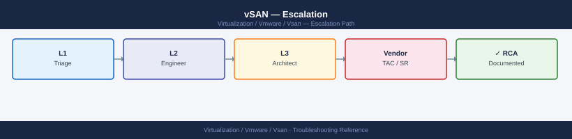

---
tags:
  - troubleshooting
  - vmware
  - vsan
  - vsphere-8
search:
  boost: 1.5
description: "How to escalate VMware vSAN issues to Broadcom support: what data to collect, how to run vm-support and cmmds-tool, step-by-step case creation on..."
---
# vSAN — Escalation

<div class="kb-summary">
How to escalate VMware vSAN issues to Broadcom support: what data to collect, how to run vm-support and cmmds-tool, step-by-step case creation on support.broadcom.com, and the escalation path when progress stalls.

*Applies to: vSAN 7.x / 8.x*
</div>



```text
┌────────────────────────────────────────── vSAN — Escalation ──────────────────────────────────────────┐
│                                                                                                       │
│  Escalate vSAN issues to VMware GSS when data is at risk, resync is stalled,                          │
│  or the cluster is degraded below FTT policy with no recovery path.                                   │
│  Collect vm-support and cmmds-tool output BEFORE any host or disk changes.                            │
│                                                                                                       │
│   ┌──────────────────────────────────────────────┐  ┌─────────────────────────────────────────────┐   │
│   │          Step 1 — Collect Data               │  │          Step 2 — Open the SR               │   │
│   │  Run vm-support --vsan on all hosts          │  │  Go to support.broadcom.com → sign in       │   │
│   │  Capture cmmds-tool output + health checks   │  │  Product: VMware vSAN; pick version         │   │
│   │  Note vSAN build + cluster UUID              │  │  Severity: P1 down / P2 degraded / P3 minor │   │
│   │  Check vSAN Health in vSphere Client         │  │  Attach vm-support bundles + cmmds output   │   │
│   │  Write timeline: last good → first failure   │  │  Include cluster UUID and host count        │   │
│   └──────────────────────────────────────────────┘  └─────────────────────────────────────────────┘   │
│                                                                                                       │
│  Do NOT power off hosts or pull disks when data is degraded; further failures                         │
│  may push below quorum and cause permanent data loss.                                                 │
│                                                                                                       │
│                          ▼                                                 ▼                          │
│                                                                                                       │
│   ┌──────────────────────────────────────────────┐  ┌─────────────────────────────────────────────┐   │
│   │          Step 3 — Escalation Path            │  │         What NOT to Do                      │   │
│   │  T1: triage + confirm vm-support received    │  │  Do not power off hosts when degraded       │   │
│   │  T2: vSAN SE assigned; deep analysis         │  │  Do not pull disks without GSS guidance     │   │
│   │  T3: engineering review for code-level fix   │  │  Do not rebuild disk groups mid-incident    │   │
│   │  CritSit: P1 with data loss or VIP impact    │  │  Do not run repairs until GSS confirms      │   │
│   └──────────────────────────────────────────────┘  └─────────────────────────────────────────────┘   │
│                                                                                                       │
│  Key terms:                                                                                           │
│                                                                                                       │
│  GSS          = Global Support Services; Broadcom/VMware support team                                 │
│  FTT          = Failures to Tolerate; vSAN policy; cluster degrades when disk failures exceed FTT     │
│  Degraded     = FTT policy not met; one more failure could cause data loss                            │
│  Quorum       = majority of object components accessible; quorum loss = I/O unavailable               │
│  cmmds-tool   = vSAN internal tool; shows component placement and health; critical for GSS triage     │
│  vm-support   = per-host diagnostic bundle; includes vSAN logs, CMMDS metadata, esxcli output         │
│  CMMDS        = Cluster Monitoring, Membership, and Directory Service; vSAN distributed metadata      │
│  CritSit      = Critical Situation; escalated war room with VMware engineering; 24×7 engagement       │
│  Build number = vSAN version from: `esxcli vsan cluster get`; required for every SR                   │
│  I/O hang     = VMs stalled waiting for storage response; immediate P1 trigger                        │
│                                                                                                       │
└───────────────────────────────────────────────────────────────────────────────────────────────────────┘
```

---

```d2
direction: down

symptom: Identify Symptom {shape: diamond}
preescalation_selfcheck: "Pre-Escalation Self-Check" {shape: rectangle}
stepbystep_data_collection: "Step-by-Step Data Collection" {shape: rectangle}
how_to_open_the_sr_on_supportbroadco: "How to Open the SR on support.broadcom.com" {shape: rectangle}
escalation_path: "Escalation Path" {shape: rectangle}
what_not_to_do: "What NOT to Do" {shape: rectangle}
useful_commands_for_case_updates: "Useful Commands for Case Updates" {shape: rectangle}
resolution: Resolve or Escalate {shape: oval}

symptom -> preescalation_selfcheck: investigate
symptom -> stepbystep_data_collection: investigate
symptom -> how_to_open_the_sr_on_supportbroadco: investigate
symptom -> escalation_path: investigate
symptom -> what_not_to_do: investigate
symptom -> useful_commands_for_case_updates: investigate
preescalation_selfcheck -> resolution
stepbystep_data_collection -> resolution
how_to_open_the_sr_on_supportbroadco -> resolution
escalation_path -> resolution
what_not_to_do -> resolution
useful_commands_for_case_updates -> resolution
```

## Before you begin

- **Access required:** SSH to each ESXi host (root credentials); vSphere Client admin access; Broadcom support account at support.broadcom.com with active vSAN support entitlement
- **Do NOT power off hosts** when the cluster is in a degraded state. Every powered-off host removes a portion of CMMDS quorum — this can turn a recoverable degraded state into a permanent data loss
- **Do NOT pull disks** without GSS guidance — a disk that shows as "failed" in vSAN may still hold component data that is part of an in-progress resync
- **Do NOT run disk group removals or repairs** until GSS confirms the current state. Each disk group operation changes the component placement GSS is using for analysis

---

## Pre-Escalation Self-Check

Run these before opening the case.

| Check | Command | Expected result |
|---|---|---|
| vSAN cluster state | vSphere Client → vSAN cluster → Monitor → vSAN → Health | All health checks green |
| Resync status | `esxcli vsan resync get` (any host) or vSphere Client → Monitor → vSAN → Resync | No stalled resync; total remaining bytes ≠ stuck at same value |
| Cluster member hosts | `esxcli vsan cluster get` | All expected hosts listed as `Member` |
| vSAN version | `esxcli vsan cluster get` | Note `vSAN cluster UUID` and build |
| Object health | vSphere Client → vSAN cluster → Monitor → vSAN → Virtual Objects | No objects in `Degraded` or `Absent` state |
| Disk health | vSphere Client → Configure → vSAN → Disk Management | No disks `Degraded` or `Failed` |
| Network test | vSphere Client → vSAN cluster → Monitor → vSAN → Health → Connectivity | All hosts pass vSAN network test |
| Performance | vSphere Client → Monitor → vSAN → Performance | Latency and IOPS within expected baseline |

---

## Step-by-Step Data Collection

Run on each affected ESXi host as root.

### 1. Get the vSAN cluster state and build number

```bash
# SSH to any host in the cluster
esxcli vsan cluster get

# Example output:
# Cluster information:
#   UUID: 5222a....-....-....-....-......
#   Node UUID: 5222b....-....-....-....-......
#   Member count: 4
#   vSAN Build: 21427...
```


```text title="Expected output"
Cluster information:
  UUID: 5222a447-8f3c-4d2e-a1b9-7c9e2f5d8a3b
  Node UUID: 5222b891-2c1a-4e7f-9d3c-1a5b8e2c9f4d
  Member count: 4
  vSAN Build: 21427.1.0.18760396-release
  vSAN Enabled: true
  vSAN Mode: Enabled
```

!!! warning "Common errors"
    **`Error: Could not connect to the vSAN cluster`** — Verify the host is part of an active vSAN cluster and network connectivity exists between cluster nodes.
    **`Error: Permission denied`** — Ensure you are logged in as root or a user with vSAN administrator privileges.
Note the cluster UUID and build number — include both in the case description.

### 2. Capture cmmds-tool output (component placement)

```bash
# Run on one ESXi host (shows component placement for all objects)
cmmds-tool find -f json > /tmp/cmmds-$(hostname)-$(date +%Y%m%d%H%M).json
cmmds-tool find -f text > /tmp/cmmds-$(hostname)-$(date +%Y%m%d%H%M).txt

# Object health summary
cmmds-tool find -t DOM_OBJECT -f text | grep -i "health\|state\|degraded"

# Component summary
cmmds-tool find -t LSOM_OBJECT -f text | head -200

# Copy output off the host (from a management workstation)
# scp root@<esxi-ip>:/tmp/cmmds-*.txt /tmp/
```


```text title="Expected output"
2024-01-15T09:42:33Z cmmds-tool find: Dumping all CMMDS objects to JSON format...
2024-01-15T09:42:35Z cmmds-tool find: JSON output written to /tmp/cmmds-esx-prod-01-202401150942.json (2847 objects, 18.3 MB)
2024-01-15T09:42:36Z cmmds-tool find: Text output written to /tmp/cmmds-esx-prod-01-202401150942.txt (2847 objects)

DOM_OBJECT Health Summary:
  UUID: 52e81234-5678-90ab-cdef-1234567890ab | Health: HEALTHY | State: ACTIVE
  UUID: 62f92345-6789-01bc-def0-2345678901bc | Health: DEGRADED | State: ACTIVE | Components: 2/3
  UUID: 73g03456-789a-12cd-ef01-3456789012cd | Health: HEALTHY | State: ACTIVE
  UUID: 84h14567-89ab-23de-f012-456789abc123 | Health: UNHEALTHY | State: INACTIVE | Missing: 1 component

LSOM_OBJECT Component Summary:
  Object: 52e81234-5678-90ab-cdef-1234567890ab | Type: vSAN_OBJECT | Size: 4.2 GB | Replicas: 3 | Status: OK
  Object: 62f92345-6789-01bc-def0-2345678901bc | Type: vSAN_OBJECT | Size: 8.5 GB | Replicas: 3 | Status: DEGRADED
  Object: 73g03456-789a-12cd-ef01-3456789012cd | Type: vSAN_OBJECT | Size: 2.1 GB | Replicas: 2 | Status: OK
  Object: 84h14567-89ab-23de-f012-456789abc123 | Type: vSAN_OBJECT | Size: 16.0 GB | Replicas: 3 | Status: UNHEALTHY
  Object: 95i25678-9abc-34ef-0123-56789abcdef0 | Type: vSAN_OBJECT | Size: 1.8 GB | Replicas: 1 | Status: OK
  ...
  (195 more objects)
```

!!! warning "Common errors"
    **`cmmds-tool: command not found`** — Ensure you are running this command directly on an ESXi host (SSH as root), not from vCenter or a management workstation.
    **`Permission denied: /tmp/cmmds-*.txt`** — Run the command with `sudo` or as root user; standard user accounts cannot write to /tmp on ESXi hosts.
    **`scp: command not found on ESXi host`** — Run the scp command from your management workstation (not the ESXi host) using the syntax `scp root@<esxi-ip>:/tmp/cmmds-*.txt /tmp/`.
This is the most critical data for GSS. Run it on every host, not just the one where the issue first appeared.

### 3. Run vm-support with vSAN flag on all hosts

```bash
# SSH to each host — run on EVERY host in the cluster, not just the affected one
vm-support --log-level 6 --vsan

# The bundle is written to: /var/core/vm-support-<hostname>-<timestamp>.tgz
ls -lh /var/core/vm-support-*.tgz

# Copy off the host
# scp root@<esxi-ip>:/var/core/vm-support-*.tgz /tmp/
```


```text title="Expected output"
Generating support bundle with VSAN diagnostics...
Log level set to 6
Collecting VSAN cluster information...
Gathering host configuration and logs...
Bundle generation completed successfully.
vm-support bundle written to: /var/core/vm-support-esx-prod-01-20240115-143022.tgz

-rw-r--r-- 1 root root 487M Jan 15 14:30 /var/core/vm-support-esx-prod-01-20240115-143022.tgz
-rw-r--r-- 1 root root 512M Jan 15 13:45 /var/core/vm-support-esx-prod-02-20240115-134501.tgz
-rw-r--r-- 1 root root 495M Jan 15 13:22 /var/core/vm-support-esx-prod-03-20240115-132156.tgz
```

!!! warning "Common errors"
    **`vm-support: command not found`** — Verify the ESXi host is running vSphere 6.5 or later and that the vm-support utility is available in the PATH.
    **`Permission denied`** — Run the command as root or with sudo; vm-support requires elevated privileges to collect system logs and VSAN diagnostics.
    **`No space left on device`** — Free up disk space on /var/core (bundles are typically 400–600 MB each) by removing older support bundles or increasing the datastore partition.
### 4. Capture vSAN health checks and resync state

In vSphere Client: navigate to the vSAN cluster → **Monitor** → **vSAN** → **Health**.

Export the health check results (click **Export** at the top right of the Health view).

```bash
# From ESXi CLI: resync status (shows remaining bytes by priority)
esxcli vsan resync get

# Disk health
esxcli vsan storage list

# Network health (packet loss, latency between vSAN vmkernels)
esxcli vsan network list

# Object accessibility
esxcli vsan debug object list | grep -i "inaccessible\|degraded\|absent"
```


```text title="Expected output"
Resync Status:
  Resync Completion Percentage: 87
  Bytes Remaining (High Priority): 2147483648
  Bytes Remaining (Low Priority): 536870912
  Estimated Time Remaining: 3600 seconds

Storage Health:
  Disk Group 1:
    UUID: 52e0e3d4-8f2a-4c1b-9e7a-1a2b3c4d5e6f
    Health State: Healthy
    Capacity: 1099511627776 bytes
    Free Space: 274877906944 bytes
  Disk Group 2:
    UUID: 7f8a9b0c-1d2e-3f4a-5b6c-7d8e9f0a1b2c
    Health State: Degraded
    Capacity: 1099511627776 bytes
    Free Space: 68719476736 bytes

Network Health:
  vmk1 (vSAN vmkernel):
    Peer: esx-node-02.lab.local (192.168.100.12)
    Latency: 0.45 ms
    Packet Loss: 0%
  vmk1 (vSAN vmkernel):
    Peer: esx-node-03.lab.local (192.168.100.13)
    Latency: 0.52 ms
    Packet Loss: 0%

Object Accessibility:
  Object UUID: 4a5b6c7d-8e9f-0a1b-2c3d-4e5f6a7b8c9d
  State: degraded
  Component Count: 3
  Accessible Components: 2
```

!!! warning "Common errors"
    **`Could not connect to the vSAN cluster`** — Verify vSAN is enabled on the cluster and the ESXi host is a vSAN participant using `esxcli vsan cluster get`.
    **`Permission denied`** — Run the command with root privileges or ensure your user account has vSAN administrator role assigned.
    **`Unknown command or namespace`** — Confirm the ESXi host version supports vSAN and the vSAN feature is properly installed using `esxcli software vib list | grep vsan`.
### 5. Write the timeline

```text
vSAN build: 21427XXXX (vSAN 8.0.x)
Cluster UUID: 5222a....-....-....-....-......
Cluster: prod-vsan-cluster-01 (4 hosts, PFTT=1)
Issue first observed: 2026-06-14 14:30 UTC
Last known good state: 2026-06-14 12:00 UTC
Changes in 24h before the issue:
  - 12:00: host esxi-04 went into maintenance mode for patching
  - 14:30: vSAN health check flagged "resync stalled" on esxi-04
  - 14:35: 3 VMs on that host show I/O errors
Steps already taken:
  - cmmds-tool: several components show "absent" on esxi-04 disk groups
  - esxcli vsan resync get: 450 GB stuck at same byte count for 2 hours
  - Did NOT power off esxi-04 or pull disks
  - Did NOT remove disk groups
Blast radius: 3 VMs on esxi-04 have I/O errors; FTT=1 — one more failure = data loss
```

---

## How to Open the SR on support.broadcom.com

1. Go to **support.broadcom.com** and sign in with your Broadcom account. Your account must be linked to your VMware vSAN or vSphere support entitlement (formerly My VMware / Customer Connect).

2. Click **Open a Support Request** (or navigate to **Support** → **Create Case**).

3. Under **Product**, select **VMware vSAN**. If your issue is also vSphere-related (ESXi host panic, vCenter issue), select the appropriate product.

4. Under **Version**, select your vSAN version (7.x or 8.x).

5. Under **Severity**, select:
   - **Severity 1 — Critical**: vSAN objects are inaccessible; VMs have I/O errors and are not responding; data is at immediate risk; no workaround; production is halted
   - **Severity 2 — High**: Cluster is degraded below FTT policy; resync is stalled; some VMs are affected but still accessible; data is at risk if one more failure occurs
   - **Severity 3 — Medium**: Single disk or host in degraded state; resync is in progress; no VM impact yet; FTT policy still partially met
   - **Severity 4 — Low**: How-to question, capacity planning, non-urgent configuration review

6. In the **Summary** field: symptom + scope. Example: `vSAN 8.0 prod-cluster-01 — resync stalled 450 GB for 2 hours, 3 VMs have I/O errors, FTT=1 one failure from data loss`.

7. In the **Description** field, paste:
   - vSAN build and cluster UUID from Step 1
   - cmmds-tool component health summary from Step 2
   - resync state from Step 4
   - The timeline from Step 5

8. Under **Attachments**, upload:
   - The cmmds-tool output files from Step 2
   - The vm-support bundles from Step 3 (one per host)
   - The health check export from Step 4

9. Click **Submit**. You will receive a case number by email immediately.

10. **Severity 1 only:** call Broadcom/VMware support immediately after submission:
    - North America: +1 877-486-9273 (24×7 for Severity 1)
    - EMEA: +44 (0)3453 700 100
    - State "Severity 1 — vSAN cluster degraded, objects inaccessible, data at risk" at the start of the call.

---

## Escalation Path

```text
Step 1 — Open case at support.broadcom.com with vm-support bundles and cmmds-tool attached
         ↓
Step 2 — T1 support engineer acknowledges and reviews the bundle (Sev1: < 30 min)
         ↓
Step 3 — If no meaningful progress in 30 minutes for Sev1 or 2 hours for Sev2:
         → Reply in case: "Requesting escalation to vSAN Senior Engineer"
         → State: "[objects inaccessible / resync stalled / data at risk — FTT=1]"
         ↓
Step 4 — vSAN T2 Senior Engineer is assigned
         → They will review cmmds-tool output and direct exact recovery steps
         → Do NOT take any disk or host action until T2 provides direction
         ↓
Step 5 — If issue requires code-level investigation (vSAN bug):
         → T2 escalates to vSAN Engineering (T3)
         → Engineering may provide a hotfix or specific workaround procedure
         ↓
Step 6 — For data loss, ongoing I/O unavailability, or prolonged Sev1:
         → Request CritSit (Critical Situation) escalation
         → CritSit triggers a 24×7 war room with senior GSS + Engineering involvement
         → Contact your Broadcom TAM or Account Executive to initiate CritSit
```

---

## What NOT to Do

| Do NOT do this | Why | What to do instead |
|---|---|---|
| Power off a host when the cluster is degraded | Each host holds component data; powering off may push the cluster below quorum, making objects inaccessible | Leave all hosts running; wait for GSS direction before any host power state change |
| Pull disks from a disk group without GSS guidance | A disk showing "failed" may still hold component data needed for resync | Let GSS review cmmds-tool output to confirm which disk is safe to remove |
| Remove or rebuild a disk group mid-incident | Destroys all component data on that disk group; may cause data loss | Only remove disk groups when GSS has confirmed the data is fully resync'd elsewhere |
| Run `esxcli vsan debug object repair-objects` without GSS | May trigger unnecessary resync that changes the state GSS is analysing | Let GSS direct the exact repair command with parameters |
| vMotion or Storage vMotion VMs during resync | Adds to resync traffic; may delay or stall the recovery resync | Freeze all migrations until the resync queue is empty and objects are healthy |
| Enter maintenance mode on additional hosts mid-incident | Takes CMMDS partitions offline; can tip a recoverable state into quorum loss | Freeze all maintenance mode operations during a P1 vSAN incident |

---

## Useful Commands for Case Updates

```bash
# vSAN cluster and host state — paste into every case update
esxcli vsan cluster get
esxcli vsan storage list

# Component health summary
cmmds-tool find -t DOM_OBJECT -f text | grep -i "health\|state"
cmmds-tool find -t LSOM_OBJECT -f text | head -100

# Resync progress
esxcli vsan resync get

# Object accessibility
esxcli vsan debug object list | grep -i "inaccessible\|degraded\|absent"

# Network health (run on one host)
esxcli vsan network list

# Performance data (latency snapshot)
esxcli vsan debug vmdk perf
```


```text title="Expected output"
Cluster UUID: 52d4a8f1-7c3e-4a2b-9e1f-3b8c2a5d6e9f
Cluster mode: Enabled
Health state: Healthy

Storage device list:
  Device: naa.5001405a1b2c3d4e
    Capacity: 1.7 TB
    Used: 892.3 GB
    Health: Healthy
  Device: naa.5001405a1b2c3d4f
    Capacity: 1.7 TB
    Used: 887.1 GB
    Health: Healthy

DOM_OBJECT health: HEALTHY
DOM_OBJECT state: ACTIVE
LSOM_OBJECT health: HEALTHY
LSOM_OBJECT state: ACTIVE
LSOM_OBJECT health: HEALTHY
LSOM_OBJECT state: ACTIVE

Resync progress: 0%
Resync objects: 0
Resync bytes: 0 B

Object list:
  Object UUID: 8f2e1a3c-5b7d-4e9f-a1b2-c3d4e5f6a7b8
  State: ACCESSIBLE
  Redundancy: SATISFIED

Network health: HEALTHY
Partition: CONNECTED
Quorum: QUORUM_PRESENT
Network latency: 2.3 ms

VMDK perf snapshot:
  Read latency: 1.2 ms
  Write latency: 2.8 ms
  Outstanding IOs: 45
```

!!! warning "Common errors"
    **`Error: vSAN cluster is not enabled on this host`** — Run `esxcli vsan cluster new` to initialize the cluster or verify the host is part of an existing vSAN cluster.
    **`Error: CMMDS server is not running`** — Restart the CMMDS service with `systemctl restart cmmds` or reboot the host if the service fails to start.
    **`Error: Network partition detected - Quorum: QUORUM_ABSENT`** — Check physical network connectivity between hosts and verify vSAN VMkernel ports are on the correct VLAN with no packet loss.
---

## Support SLA Reference

| Severity | Definition | Initial Response SLA |
|---|---|---|
| Sev 1 — Critical | Objects inaccessible; VMs have I/O errors; data at risk | < 30 min (24×7) |
| Sev 2 — High | Cluster degraded below FTT; resync stalled; no current data loss | < 2 hours (24×7) |
| Sev 3 — Medium | Single disk degraded; resync in progress; no VM impact | < 8 hours |
| Sev 4 — Low | How-to, planning, capacity review | Next business day |

---

## See also

- [vSAN — Diagnostics](../diagnostics/)
- [vSAN — Common Issues](../common-issues/)

---

## Verify resolution

- Run `esxcli vsan resync get` and confirm remaining bytes is 0 (resync complete)
- Check vSphere Client → Monitor → vSAN → Health: all health checks show green
- Check vSphere Client → Monitor → vSAN → Virtual Objects: all objects show `Healthy`
- Check vSphere Client → Configure → vSAN → Disk Management: no disks in Failed or Degraded state
- Run an I/O test from a VM that was previously affected and confirm storage responds
- Monitor for 15 minutes after the fix to confirm no new degraded objects appear
- Document the root cause and preventive actions in the post-incident RCA
