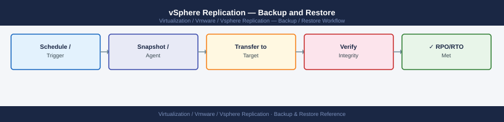

---
tags:
  - operations
  - vmware
  - vsphere-replication
---
# vSphere Replication — Backup and Restore

<div class="kb-summary">
Backup and Restore reference covering What to Back Up, VRA Pre-Upgrade Snapshot, VRA Configuration Backup via OVF Export, Recover a VM Using vSphere Replication (Standalone), Recovery Point Retention and 2 more sections.

*Applies to: vSphere Replication 8.x*
</div>


  VR Backup Strategy

---

## Before you begin

- **Access:** vCenter read-only minimum; Administrator role for remediation steps
- **Timing:** safe to run during business hours unless a step is marked ⚠ (causes interruption)
- **Dependencies:** no active upgrades or migrations on the same infrastructure
- **Logging:** capture command output — paste into the change record on completion

---

## What to Back Up

| Component | Backup Method | Notes |
|---|---|---|
| VRA appliance configuration | vSphere snapshot + OVF export | Configuration lives in vCenter — VCSA backup covers most state |
| VRA-vCenter registration | Covered by VCSA backup | Re-registration needed if vCenter is rebuilt |
| Site pair configuration | Covered by VCSA backup on both sites | Thumbprints stored in vCenter |
| Replication data (target site) | NOT a traditional backup | Point-in-time recovery instances on target datastore |
| VRS (scale-out server) | Redeploy from OVA | Config is minimal — no backup needed |

---

## VRA Pre-Upgrade Snapshot

Always take a snapshot before upgrading or making significant changes:

```yaml
vCenter → [VRA VM] → Snapshots → Take Snapshot
  Name: Pre-Upgrade-VRA-<date>
  Description: Pre-upgrade snapshot — VRA version <current>
  Memory: No (VRA is a stateless appliance — memory snapshot not needed)
```

Delete snapshot after confirming upgrade is successful (within 48 hours).

---

## VRA Configuration Backup via OVF Export

For a full appliance backup:

```text
vCenter → [VRA VM] → right-click → Export OVF Template
  Format: Folder of files (OVF)
  Destination: <shared storage or SCP>
```

Store OVF in a location accessible from both sites. This captures VM disk state including all configuration.

---

## Recover a VM Using vSphere Replication (Standalone)

When not using SRM, manual recovery from vSphere Replication:

```text
vCenter (Target Site) → Site Recovery → Replications → [VM replication] → Recover
  Recovery type: Recovery to the configured target location
  Power state: Power on after recovery
  Recovery point: select from available recovery point instances

OR: "Recover to alternate location" to recover to a different datastore/host
```

Recovery destroys the replication relationship — re-configure replication after recovery if you want to continue replicating back.

---

## Recovery Point Retention

Each replicated VM stores N recovery point instances on the target datastore (configurable per VM):

- Default: 3 instances
- Maximum: 24 instances
- Older instances are replaced by newer ones automatically

To change the number of recovery points:
```text
vCenter → [VM] → right-click → Configure Replication → Edit
  Recovery point instances: 1–24
```

More instances = more disk space consumed at target site.

---

## Restore VRA from Snapshot

If VRA appliance has an issue after a change:

```text
vCenter → [VRA VM] → Snapshots → Manage Snapshots
  Select pre-change snapshot → Revert
  Power on VRA
```

After reverting, verify site pairing is still connected (VRA VAMI → Configuration).

---

## Disaster Recovery of VRA Itself

If the VRA appliance VM is lost (host failure, accidental deletion):

1. Deploy a new VRA OVA at the affected site
2. Configure with same IP address as the original VRA
3. Register with vCenter (VRA VAMI → Configuration → vCenter Server)
4. Site pairing reconnects automatically if the remote site's VRA is intact
5. Replications resume from last successful sync point

Replication data on the target datastore is preserved — only the appliance needs to be redeployed.

---

## See also

- [vSphere Replication — Procedures](../procedures/)
- [vSphere Replication — Common Issues](../../troubleshooting/common-issues/)
- [vSphere Replication — Health Checks](../health-checks/)

## Verify

- **Alarms:** vSphere Client → Home → Alarms — no new critical alarms after the operation
- **Events:** monitor the vCenter Events view for the affected object for 5 minutes
- **Health check:** run the morning health-check sequence for the affected product tier
