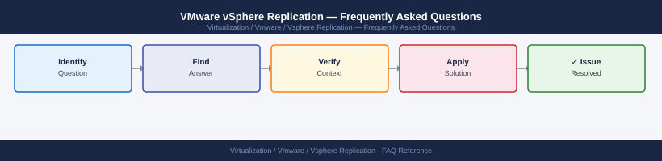

---
tags:
  - vsphere-replication
  - faq
  - operations
---
# VMware vSphere Replication — Frequently Asked Questions

*Applies to: VMware vSphere 7.x / 8.x*

Common questions about VMware vSphere Replication operations, configuration, and troubleshooting. For step-by-step procedures, see the <a href="index.md">Operations</a> section.

## General

**Q: What vSphere Replication version is recommended?**
A: vSphere Replication 8.8.x is the current recommendation. Check: vSphere Replication appliance web UI (https://vr-appliance:5480) → Summary → Version.

**Q: How do I check the current VMware vSphere Replication version?**
A: `https://<vr-appliance>:5480 → Summary → Version`

## Configuration

**Q: What is the minimum RPO for vSphere Replication?**
A: Minimum RPO is 5 minutes. This is not suitable for zero-RPO requirements — use array-based replication (SRDF, SnapMirror) for near-zero RPO. vSphere Replication suits RPO of 15 minutes to 24 hours for most use cases.

**Q: How do I enable multi-point-in-time (MPIT) recovery for vSphere Replication?**
A: When configuring replication, enable 'Enable multiple point in time instances'. Set the number of instances (up to 24). MPIT retains multiple recovery points at the target, allowing recovery to a specific point before ransomware or corruption.

## Operations

**Q: How do I upgrade vSphere Replication without breaking active replications?**
A: Active replications pause briefly during upgrade but resume automatically. Upgrade the vSphere Replication appliance via its VAMI (5480 port). Do not reconfigure replications during upgrade. Verify all replications resume within 30 minutes post-upgrade.

**Q: What is the correct procedure to configure replication for a new VM?**
A: vCenter → VM → Actions → All vSphere Replication Actions → Configure Replication. Select the target site VR server and datastore. Set RPO. Initial full sync begins immediately — monitor progress in vCenter → Monitor → vSphere Replication.

## Troubleshooting

**Q: vSphere Replication shows 'RPO violation' for a VM. What does it mean?**
A: The last successful replication sync exceeded the configured RPO window. Check vSphere Replication appliance health. Verify network bandwidth between sites. Check if the source VM has high change rate. Review vSphere Replication logs for error details.

**Q: Replication bandwidth is saturating the WAN link — where do I start?**
A: Configure bandwidth throttling: vSphere Replication → Site → Bandwidth Throttling. Stagger replication schedules to avoid concurrent syncs. Enable compression (vSphere Replication compresses data in transit by default).

## Backup and Recovery

**Q: How often should I test vSphere Replication recovery?**
A: Use SRM test failover quarterly (if SRM is in use). For standalone vSphere Replication, perform a manual test recovery to an isolated network annually. Verify application consistency of recovered VMs.

**Q: How do I recover a VM using vSphere Replication when the source site is unavailable?**
A: At the recovery site, vCenter → Monitor → vSphere Replication → Incoming Replications → select VM → Recover. The VM is powered on from the latest replica. For MPIT, select the desired recovery point before recovering.

## See Also

- [VMware vSphere Replication Operations](index.md)
- [VMware vSphere Replication Troubleshooting](../troubleshooting/index.md)
