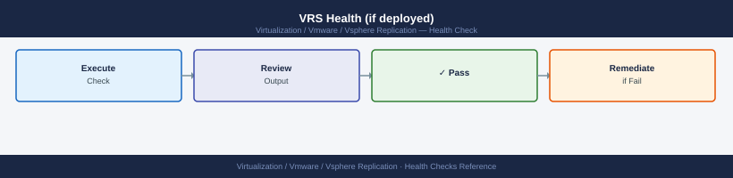
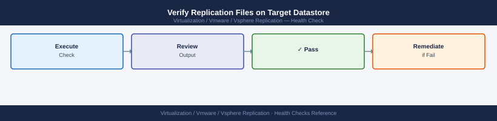
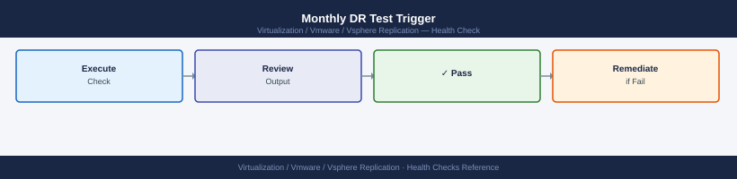

---
tags:
  - operations
  - vmware
  - vsphere-replication
---
# vSphere Replication — Health Checks

<div class="kb-summary">
Health Checks reference covering VRA and Site Pairing Status, Check All Replications for RPO Violations, Verify VRA Disk Space, VRS Health (if deployed), Verify Replication Files on Target Datastore and 2 more sections.

*Applies to: vSphere Replication 8.x*
</div>

  Health Check Chain

## Before you begin

- **Access:** vCenter read-only minimum; Administrator role for remediation steps
- **Timing:** safe to run during business hours unless a step is marked ⚠ (causes interruption)
- **Dependencies:** no active upgrades or migrations on the same infrastructure
- **Logging:** capture command output — paste into the change record on completion

---

## Run This Routine

1. **VR appliance health** — open the VAMI console and verify all services show running: `https://<vr-appliance>:5480` → Summary → check hms and vrms service status.
2. **VRS (scale-out server) health** — if VRS nodes are deployed, confirm each is registered and healthy: vCenter → Site Recovery → vSphere Replication → Replication Servers → all show Connected/Healthy.
3. **Replication count and status** — vSR UI → Monitor → Replication → note total active replication count and confirm no items show in Error state.
4. **RPO violations** — vSR UI → Monitor → Replication → filter by "RPO Violated" → investigate any flagged VMs; each violation needs a root-cause note before close of check.
5. **Disk space on target datastores** — verify all target datastores holding replica VMDKs have >20% free headroom; use vCenter → Datastore → Summary for each target.
6. **Network connectivity between VRAs** — from the source VRA appliance shell, confirm round-trip reachability to the target VRA:
   ```bash
   ping <target-VRA-IP>
   ```
7. **VRA-to-VRA data port reachability** — verify TCP 31031 is open between source and target VRA appliances (this is the vSphere Replication data channel):
   ```bash
   nc -zv <target-VRA-IP> 31031
   ```
8. **VRA registration with vCenter** — vCenter → Site Recovery → vSphere Replication → Replication Appliances → confirm VRA shows Registered and Connected for both sites.
9. **SRM integration check** — if SRM is in use: SRM → Protection Groups → confirm no groups display "Replication Error"; expand any amber groups for detail.
10. **Last successful sync timestamp** — vSR UI → per-VM detail → review "Last Sync" field; flag any VM whose last sync is older than 2× its configured RPO interval.

---

## VRA and Site Pairing Status


```text
vCenter → Site Recovery → Sites
  Both sites should show: Connected
  VRA status: Healthy (green)

vCenter → Site Recovery → vSphere Replication
  Replication Appliances tab: VRA status = OK, Connected
```

```bash
# VRA health via API
curl -sk https://vra-london.example.local/api/rest/vr/health | python3 -m json.tool
# Status should be "OK"
```


```text title="Expected output"
{
  "status": "OK",
  "version": "8.7.0.21456",
  "buildNumber": "21456",
  "timestamp": "2024-01-15T14:32:18.742Z",
  "components": {
    "database": "OK",
    "replication_engine": "OK",
    "network": "OK",
    "storage": "OK"
  },
  "uptime_seconds": 864000,
  "active_replications": 42,
  "pending_syncs": 3
}
```

!!! warning "Common errors"
    **`curl: (60) SSL certificate problem: self signed certificate`** — Add the `-k` flag to skip certificate verification, or import the VRA's certificate into your system trust store.
    **`curl: (7) Failed to connect to vra-london.example.local port 443: Connection refused`** — Verify the VRA appliance is running and the hostname/IP is correct; check firewall rules allowing HTTPS access to port 443.
    **`json.decoder.JSONDecodeError: Expecting value: line 1 column 1`** — Confirm the VRA API service is fully started (may take 2-3 minutes after appliance boot) and the endpoint URL is correct.
---

## Check All Replications for RPO Violations


```text
vCenter → Site Recovery → Replications
  Status column: Green = within RPO
  Amber = approaching RPO limit (>75% of RPO elapsed)
  Red = RPO violation (replication lag > configured RPO)

Any red VM: investigate immediately
```

```bash
# Via REST API — list replications with lag
TOKEN=$(curl -sk -X POST \
  "https://vra-london.example.local/api/rest/vr/authentication/token" \
  -H "Content-Type: application/json" \
  -d '{"username":"admin","password":"<password>"}' | \
  python3 -c "import json,sys; print(json.load(sys.stdin)['token'])")

curl -sk -H "Authorization: Bearer $TOKEN" \
  "https://vra-london.example.local/api/rest/vr/replications" | \
  python3 -c "
import json, sys
reps = json.load(sys.stdin)
for r in reps.get('list', []):
    state = r.get('overallStatus', '')
    name = r.get('name', '?')
    if state != 'OK':
        print(f'[{state}] {name}')
"
```


```text title="Expected output"
[LAGGING] prod-db-vm-01
[LAGGING] web-cluster-02
[SYNCING] app-tier-backup
```

!!! warning "Common errors"
    **`curl: (60) SSL certificate problem: self signed certificate`** — Add `-k` flag to curl (already present) or import the vRA certificate into your system CA bundle.
    **`json.decoder.JSONDecodeError: Expecting value: line 1 column 1 (char 0)`** — Verify the vRA API endpoint is reachable and responding; check credentials and ensure the authentication token endpoint is correct.
    **`curl: (7) Failed to connect to vra-london.example.local port 443: Connection refused`** — Confirm the vRA appliance hostname/IP is correct and the API service is running (`systemctl status vmware-vra` on the appliance).
---

## See also

- [vSphere Replication — Common Issues](../../troubleshooting/common-issues/)
- [vSphere Replication — Procedures](../procedures/)
- [vSphere Replication — CLI Reference](../cli-reference/)

## Verify VRA Disk Space


```bash
ssh admin@vra-london.example.local
df -h
# Monitor /opt and /var partitions
# VRA appliance disk: should have >20% free
```


```text title="Expected output"
admin@vra-london.example.local's password: 
Filesystem      Size  Used Avail Use% Mounted on
/dev/sda1       100G   72G   23G  75% /
/dev/sda2       200G  156G   38G  79% /opt
/dev/sda3       150G  118G   28G  80% /var
/dev/sda4        50G   8G   39G  17% /tmp
tmpfs           16G      0   16G   0% /dev/shm
```

!!! warning "Common errors"
    **`ssh: Could not resolve hostname vra-london.example.local: Name or service not known`** — Verify the hostname is correct and resolvable in DNS, or use the IP address directly instead.
    **`Permission denied (publickey,password).`** — Confirm the admin account credentials are correct and the SSH key or password is valid for this VRA appliance.
    **`Warning: Permanently added 'vra-london.example.local' (ECDSA) to the list of known hosts.`** — This is informational; press Enter to continue, or add the host key to ~/.ssh/known_hosts beforehand with `ssh-keyscan`.
Target-site datastore containing replica VMDKs:
```bash
vCenter (Target Site) → Datastore → check % used
# Keep below 80% — VRA stops writing when datastore fills up
```


```text title="Expected output"
Datastore: ds-replication-01
  Capacity: 2.0 TB
  Used: 1.52 TB (76%)
  Free: 480 GB
  Status: Normal

Datastore: ds-replication-02
  Capacity: 1.5 TB
  Used: 1.35 TB (90%)
  Free: 150 GB
  Status: Warning — approaching capacity limit

Datastore: ds-replication-03
  Capacity: 3.0 TB
  Used: 1.8 TB (60%)
  Free: 1.2 TB
  Status: Normal
```

!!! warning "Common errors"
    **`Datastore capacity at 95% — replication writes suspended`** — Immediately migrate or delete non-critical VMs, or add storage capacity to the datastore.
    **`Permission denied: cannot access datastore inventory`** — Verify your vCenter user account has Datastore.Browse and Datastore.FileManagement privileges on the target site.
---

## VRS Health (if deployed)



```text
vCenter → Site Recovery → vSphere Replication → Replication Servers
  Each VRS should show: Connected, Healthy
  VMs assigned to each VRS: should be balanced
```

```bash
ssh admin@vrs-london-01.example.local
systemctl status hms
```


```text title="Expected output"
admin@vrs-london-01.example.local's password: 
● hms.service - VMware vSphere Replication Management Service
     Loaded: loaded (/etc/systemd/system/hms.service; enabled; vendor preset: enabled)
     Active: active (running) since Mon 2024-01-15 09:42:17 UTC; 3 days ago
       Docs: man:hms(8)
   Main PID: 2847 (java)
      Tasks: 24 (limit: 4915)
     Memory: 487.3M
        CPU: 2h 14m 32s
     CGroup: /system.slice/hms.service
             └─2847 /usr/lib/jvm/java-11-openjdk-11.0.18.0.10-1.el7_9.x86_64/bin/java -Xmx1024m -Xms512m -Dcom.vmware.hms.home=/opt/vmware/hms
```

!!! warning "Common errors"
    **`ssh: Could not resolve hostname vrs-london-01.example.local: Name or service not known`** — Verify the hostname is correct and DNS resolution is working with `nslookup vrs-london-01.example.local` or update your `/etc/hosts` file.
    **`Unit hms.service could not be found.`** — Confirm vSphere Replication is installed on this host; if recently installed, reload systemd with `systemctl daemon-reload`.
    **`Permission denied (publickey,password).`** — Verify the admin account credentials and ensure SSH key-based authentication is configured, or use `ssh -v` to debug the connection.
---

## Verify Replication Files on Target Datastore



Replication data is stored as `.vrepl` and `.hbr` files:

```bash
# SSH to ESXi host on target site
ls /vmfs/volumes/<target-datastore>/<VM-folder>/
# You should see: *.vmdk, *.vmx, *.vrepl, *.hbr files
# .vrepl = replica disk
# .hbr = replication control file

# No .vrepl files = replication not established or recovery was completed
```


```text title="Expected output"
drwxr-xr-x    1 root     root          4096 Nov 15 10:42 .
drwxr-xr-x    1 root     root          4096 Nov 14 09:18 ..
-rw-------    1 root     root    107374182400 Nov 15 10:45 web-app-prod-000001.vmdk
-rw-------    1 root     root       2097152 Nov 15 10:42 web-app-prod.vmdk
-rw-------    1 root     root        8192 Nov 15 10:45 web-app-prod.vmx
-rw-------    1 root     root      16777216 Nov 15 10:44 web-app-prod.vrepl
-rw-------    1 root     root        4096 Nov 15 10:42 web-app-prod.hbr
-rw-------    1 root     root        1024 Nov 15 10:42 web-app-prod.nvram
```

!!! warning "Common errors"
    **`ls: /vmfs/volumes/<target-datastore>/<VM-folder>/: No such file or directory`** — Verify the datastore name and VM folder path are correct, and that the target ESXi host has the datastore mounted.
    **`Permission denied`** — Ensure you are connected via SSH as root or a user with sufficient privileges to access /vmfs/volumes.
---

## Certificate Expiry


```bash
# Check VRA management certificate
echo | openssl s_client -connect vra-london.example.local:443 -servername vra-london.example.local 2>/dev/null \
  | openssl x509 -noout -dates

# Check VRA-to-VRA port (44046)
echo | openssl s_client -connect vra-amsterdam.example.local:44046 2>/dev/null \
  | openssl x509 -noout -dates
```


```text title="Expected output"
notBefore=Jan 15 10:23:45 2023 GMT
notAfter=Jan 15 10:23:45 2026 GMT
notBefore=Feb 3 14:57:12 2024 GMT
notAfter=Feb 3 14:57:12 2027 GMT
```

!!! warning "Common errors"
    **`connect: Connection refused`** — Verify the VRA service is running with `systemctl status vmware-vra` and check firewall rules allow inbound on port 443 or 44046.
    **`depth=0 self signed certificate`** — This is expected for self-signed VRA certificates; add `-showcerts` to the command if you need to inspect the full chain.
    **`unable to load certificate`** — Ensure OpenSSL can reach the host; test basic connectivity first with `ping vra-london.example.local` and verify DNS resolution.
---

## Monthly DR Test Trigger



Run a test recovery on at least one VR-protected VM monthly. For VMs managed by SRM:
```text
SRM → Recovery Plans → [plan] → Test
```

For standalone VR (without SRM):
```text
vCenter → Site Recovery → Replications → [VM] → Recover
  Mode: Test (isolated network)
  After test: Delete the recovered test VM (do not clean up the replication)
```

Document test results — record which VMs were tested, the RPO at time of recovery, and any issues found.
