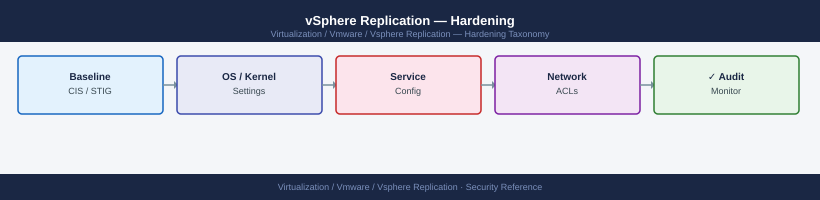

---
tags:
  - security
  - vmware
  - vsphere-replication
---
# vSphere Replication — Hardening

<div class="kb-summary">
Hardening reference covering Post-Deployment Checklist, Restrict SSH Access, Restrict VRA Management Access, Least-Privilege VR Service Account, Enable Encryption for WAN Replications and 3 more sections.

*Applies to: vSphere Replication 8.x*
</div>


  VR Hardening Controls

---

## Before you begin

- **Access:** vCenter Administrator role
- **Change management:** security changes require CAB approval in most environments
- **Rollback plan:** document current state before any security control change
- **Testing:** validate in a non-production environment first where possible

---

## Post-Deployment Checklist

| Control | Action | Priority |
|---|---|---|
| Change VRA admin password | VRA VAMI → Administration → Change Admin Password | Critical |
| Replace self-signed certificate | VRA VAMI → SSL → Upload Certificate | High |
| Restrict SSH to jump hosts only | Firewall or VRA iptables | High |
| Enable replication encryption for WAN links | Per-VM replication config | High |
| Use read-only vCenter service account (read) | Assign minimum vCenter privileges | High |
| Update site pair thumbprints after cert change | Site Recovery → Sites → Edit | Medium |
| Enable monitoring/alerting for RPO violations | Pure1 / vRealize Operations / custom script | Medium |
| Test recovery monthly | Document results | Critical (process) |

---

## Restrict SSH Access

```bash
# SSH to VRA
ssh admin@vra-london.example.local

sudo vim /etc/ssh/sshd_config
# Set:
PermitRootLogin no
PasswordAuthentication no
PubkeyAuthentication yes
MaxAuthTries 3
AllowUsers admin

sudo systemctl restart sshd
```


```text title="Expected output"
admin@vra-london.example.local's password: 
Welcome to vSphere Replication Appliance (VRA) v8.7.2.1
Last login: Wed Jan 15 14:32:18 2025 from 10.45.120.88
vra-london:~$ sudo vim /etc/ssh/sshd_config
[vim editor opens — no terminal output during editing]
vra-london:~$ sudo systemctl restart sshd
vra-london:~$ sudo systemctl status sshd
● sshd.service - OpenSSH server daemon
   Loaded: loaded (/lib/systemd/system/sshd.service; enabled; vendor preset: enabled)
   Active: active (running) since Wed Jan 15 14:33:42 2025; 2s ago
   Process: 8421 ExecStart=/usr/sbin/sshd -D $OPTIONS (code=exited, status=0/SUCCESS)
  Main PID: 8422 (sshd)
     Tasks: 1 (limit: 2048)
    Memory: 3.2M
vra-london:~$
```

!!! warning "Common errors"
    **`sshd: no hostkeys available -- exiting.`** — Restore SSH host keys from backup or regenerate them with `sudo ssh-keygen -A` before restarting sshd.
    **`Permission denied (publickey).`** — Ensure your public key is added to `~/.ssh/authorized_keys` on the VRA before disabling password authentication.
    **`sudo: vim: command not found`** — Use `sudo nano /etc/ssh/sshd_config` or install vim with `sudo apt-get install vim` if nano is unavailable.
Firewall rule: allow SSH (TCP 22) to VRA only from jump host IPs.

---

## Restrict VRA Management Access

```bash
# Limit who can reach VRA VAMI (port 5480) and REST API (port 443)
sudo iptables -A INPUT -p tcp --dport 5480 -s 10.10.10.0/24 -j ACCEPT
sudo iptables -A INPUT -p tcp --dport 5480 -j DROP
sudo iptables -A INPUT -p tcp --dport 443 -s 10.10.10.0/24 -j ACCEPT
sudo iptables -A INPUT -p tcp --dport 443 -j DROP
sudo iptables-save > /etc/iptables/rules.v4
```


```text title="Expected output"
(no output — command completes silently)
(no output — command completes silently)
(no output — command completes silently)
(no output — command completes silently)
(no output — command completes silently)
```

!!! warning "Common errors"
    **`iptables: No chain/target/match by that name`** — Ensure iptables is installed and the kernel module is loaded with `sudo modprobe iptable_filter`.
    **`cannot open /etc/iptables/rules.v4: No such file or directory`** — Create the directory first with `sudo mkdir -p /etc/iptables` before running iptables-save.
    **`Operation not permitted`** — Run all iptables commands with sudo or as root; standard user accounts cannot modify firewall rules.
Port 31031 (replication data receiver) should only accept connections from source site ESXi management IPs:
```bash
# Allow replication traffic from source ESXi subnet only:
sudo iptables -A INPUT -p tcp --dport 31031 -s 10.10.10.0/24 -j ACCEPT
sudo iptables -A INPUT -p tcp --dport 31031 -j DROP
```


```text title="Expected output"
(no output — command completes silently)
(no output — command completes silently)
```

!!! warning "Common errors"
    **`iptables: No chain/target/match by that name`** — Ensure iptables is installed and the kernel module is loaded with `sudo modprobe iptables_filter`.
    **`iptables: Permission denied (you must be root)`** — Run the commands with `sudo` or switch to root user with `su -`.
---

## Least-Privilege VR Service Account

```yaml
vCenter → Administration → Roles → Create Custom Role
  Name: VR-ServiceAccount
  Privileges:
    vSphere Replication → Monitor
    vSphere Replication → Manage
    Virtual machine → Inventory (view)
    Datastore → Browse
    (Do NOT include vSphere Replication → Recover for the service account)

vCenter → Administration → Global Permissions → Add
  User: svc-vsphere-replication@corp.local
  Role: VR-ServiceAccount
  Propagate: Yes
```

Keep the Recovery privilege in a separate role assigned only to the DR team.

---

## Enable Encryption for WAN Replications

```text
vCenter → Site Recovery → Replications → [VM] → Edit
  Encryption: Enable
```

Enable for all VMs replicating over untrusted WAN links. For same-datacenter replications (internal LAN), encryption is optional — rely on network security instead.

---

## Regular Test Recovery

Monthly test is the most important operational security measure — an untested DR capability is not a capability:

```text
vCenter → Site Recovery → Replications → [VM]
  → Recover → Test mode
  Use isolated network (no access to production)
  After test: delete recovered test VM, do NOT remove replication
```

Document: test date, VMs tested, RPO at time of recovery, pass/fail.

---

## Certificate Rotation

```bash
# Check VRA cert expiry
echo | openssl s_client -connect vra-london.example.local:443 2>/dev/null \
  | openssl x509 -noout -enddate

# Renew 30 days before expiry:
# VRA VAMI → SSL → Upload Certificate
```


```text title="Expected output"
notAfter=Dec 15 09:23:47 2025 GMT
```

!!! warning "Common errors"
    **`unable to load certificate`** — Ensure the VRA hostname resolves correctly and port 443 is accessible; verify DNS or add an entry to `/etc/hosts` if needed.
    **`error:14090086:SSL routines:SSL3_GET_SERVER_CERTIFICATE:certificate verify failed`** — This is expected for self-signed certs; the command still extracts the expiry date successfully, so verify the `notAfter` field in the output.
After rotating VRA certificate at either site:
```text
Site Recovery → Sites → [pair] → Edit → Refresh Thumbprints
```

---

## Monitoring and Alerting

Configure alerting for RPO violations — do not rely solely on manual dashboard checks:

```powershell
# Script to run as a scheduled task — alert on non-OK replication states
# (see Scripts page for full implementation)

# Or use vRealize Operations: create alert rule for metric "vsphere.replication.rpm_status"
# Alert when value != 0 (0=OK, 1=Warning, 2=Error)
```

## See also

- [vSphere Replication — Access Control](../access-control/)
- [vSphere Replication — Authentication](../authentication/)
- [vSphere Replication — Health Checks](../../operations/health-checks/)
