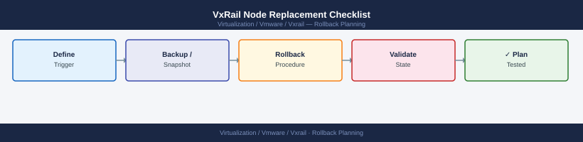

---
tags:
  - vxrail
description: "VxRail Node Replacement Checklist reference covering Confirm the Issue, Capture Current Node Details, Validate Cluster Health Before Replacement..."
---
# VxRail Node Replacement Checklist


<div class="kb-summary">
VxRail Node Replacement Checklist reference covering Confirm the Issue, Capture Current Node Details, Validate Cluster Health Before Replacement, Maintenance Mode, Dell Replacement Workflow and 2 more sections.

*Applies to: VxRail 7.x · 8.x*
</div>



Rollback Decision Tree


```d2
direction: right

plan: "Plan" {shape: oval}
confirm_the_issue: "Confirm the Issue" {shape: rectangle}
capture_current_node_details: "Capture Current Node Details" {shape: rectangle}
validate_cluster_health_before_repla: "Validate Cluster Health Before Replacement" {shape: rectangle}
maintenance_mode: "Maintenance Mode" {shape: rectangle}
dell_replacement_workflow: "Dell Replacement Workflow" {shape: rectangle}
validate_node_rejoin: "Validate Node Rejoin" {shape: rectangle}
validate: "Validate" {shape: oval}

plan -> confirm_the_issue
confirm_the_issue -> capture_current_node_details
capture_current_node_details -> validate_cluster_health_before_repla
validate_cluster_health_before_repla -> maintenance_mode
maintenance_mode -> dell_replacement_workflow
dell_replacement_workflow -> validate_node_rejoin
validate_node_rejoin -> validate
```

## Confirm the Issue

- Confirm the failed node or part with Dell support
- Review the Dell support case for replacement guidance
- Confirm replacement hardware part numbers

## Capture Current Node Details

- Hostname and IP address
- Serial number
- Model
- Current firmware version
- Cluster assignment

## Validate Cluster Health Before Replacement

- Confirm cluster is healthy enough to tolerate node removal
- Confirm vSAN can maintain data availability without this node (check FTT policy)
- Confirm no active vSAN resyncs that would be disrupted

## Maintenance Mode

- Place the node into maintenance mode with the correct evacuation option
- Wait for vSAN to evacuate or ensure data accessibility before proceeding

## Dell Replacement Workflow

- Follow Dell's guided replacement steps from the support case
- Confirm firmware on replacement hardware before insertion
- Do not skip Dell iDRAC or Lifecycle Controller steps

## Validate Node Rejoin

- Confirm the replacement node appears in VxRail Manager
- Confirm it joins the vSAN cluster and disk groups are healthy
- Monitor vSAN rebalancing until complete

## Confirm vSAN Object Health

- Run vSAN Skyline Health after rebalancing completes
- Confirm all objects are Healthy or Compliant
- Confirm cluster capacity is back to normal
