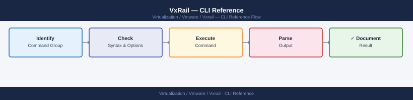

---
tags:
  - operations
  - vmware
  - vxrail
---
# VxRail — CLI Reference

<div class="kb-summary">
Complete command reference for VxRail operations: VxRail Manager REST API, esxcli vSAN and network commands, iDRAC RACADM, and PowerCLI vSAN cmdlets. Use this page as the go-to lookup for day-to-day VxRail CLI and API work.

*Applies to: VxRail 7.x / 8.x*
</div>


---

## Before you begin

- **Access:** vCenter read-only minimum; Administrator role for remediation steps
- **Timing:** safe to run during business hours unless a step is marked ⚠ (causes interruption)
- **Dependencies:** no active upgrades or migrations on the same infrastructure
- **Logging:** capture command output — paste into the change record on completion

---

## VxRail Manager — Login and Access

VxRail Manager is a Linux appliance VM. Access it via SSH or the web UI.

```bash
# SSH login to VxRail Manager
ssh mystic@<vxm-ip>

# Web UI
https://<vxm-ip>/ui

# REST API base URL
https://<vxm-ip>/rest/vxm/v1/
```


```text title="Expected output"
The authenticity of host '192.168.1.45' can't be established.
ECDSA key fingerprint is SHA256:aBcD1EfGhIjKlMnOpQrStUvWxYz2345678901234567.
Are you sure you want to continue connecting (yes/no)? yes
Warning: Permanently added '192.168.1.45' (ECDSA) to /etc/ssh/known_hosts.
Password: 
Last login: Wed Jan 15 14:32:18 2025 from 10.20.30.40
VxRail Manager 7.0.510 (Build 12345)
vxm-prod-01:~>
```

!!! warning "Common errors"
    **`ssh: Could not resolve hostname <vxm-ip>: Name or service not known`** — Replace `<vxm-ip>` with the actual VxRail Manager IP address (e.g., 192.168.1.45) or verify DNS resolution.
    **`Permission denied (publickey,password).`** — Verify the username is correct (default is `mystic`) and that the password is entered correctly or SSH key is properly configured.
    **`Connection refused`** — Confirm the VxRail Manager is powered on, the SSH service is running, and the IP address is reachable on your network.
**Authentication:** HTTP Basic auth. Use the `mystic` account (or a dedicated service account created in VxRail Manager). Base64-encode credentials for `curl`:

```bash
# Encode credentials for curl
AUTH=$(echo -n 'mystic:YourPassword' | base64)

# Use in every API call
curl -sk -H "Authorization: Basic $AUTH" "https://<vxm-ip>/rest/vxm/v1/cluster"
```


```text title="Expected output"
{
  "cluster_id": "cluster-1",
  "cluster_name": "VxRail-Prod-01",
  "cluster_status": "healthy",
  "node_count": 4,
  "vcenter_fqdn": "vcenter.lab.local",
  "vcenter_version": "7.0.3",
  "vsan_enabled": true,
  "vsan_version": "7.0.3",
  "health_status": "green",
  "last_updated": "2024-01-15T14:32:18Z"
}
```

!!! warning "Common errors"
    **`curl: (60) SSL certificate problem: self signed certificate`** — Add `-k` flag to skip SSL verification (already present in example; ensure it's included if removed).
    **`curl: (401) Unauthorized`** — Verify credentials are correct and base64-encoded properly with `echo -n 'username:password' | base64`.
    **`curl: (7) Failed to connect to <vxm-ip> port 443: Connection refused`** — Confirm the VxM IP address is correct and the management cluster is reachable on port 443.
---

## VxRail Manager REST API

### Common Endpoints

| Endpoint | Method | Description |
|---|---|---|
| `/rest/vxm/v1/cluster` | GET | Cluster summary: version, health, node count |
| `/rest/vxm/v1/hosts` | GET | All nodes: IDs, health, ESXi version, serial |
| `/rest/vxm/v1/lcm/upgrade` | GET | Current LCM upgrade job status |
| `/rest/vxm/v1/lcm/bundle` | POST | Upload a new LCM bundle (multipart/form-data) |
| `/rest/vxm/v1/lcm/precheck/status` | GET | Pre-upgrade check results |
| `/rest/vxm/v1/support/bundle` | POST | Trigger a support bundle collection |
| `/rest/vxm/v1/system` | GET | VxRail Manager version and build number |

### Cluster Info

```bash
# Get cluster summary
curl -sk \
  -H "Authorization: Basic $(echo -n 'mystic:password' | base64)" \
  "https://<vxm-ip>/rest/vxm/v1/cluster" | python3 -m json.tool

# List all hosts with health status
curl -sk \
  -H "Authorization: Basic $(echo -n 'mystic:password' | base64)" \
  "https://<vxm-ip>/rest/vxm/v1/hosts" | python3 -m json.tool

# Get VxRail Manager version and build
curl -sk \
  -H "Authorization: Basic $(echo -n 'mystic:password' | base64)" \
  "https://<vxm-ip>/rest/vxm/v1/system" | python3 -m json.tool
```


```text title="Expected output"
{
  "id": "cluster-001",
  "name": "vxrail-prod-cluster",
  "health": "Healthy",
  "number_of_hosts": 4,
  "total_capacity_gb": 2048,
  "used_capacity_gb": 1456,
  "vsan_enabled": true,
  "cluster_version": "7.0.3"
}
{
  "hosts": [
    {
      "id": "host-1",
      "hostname": "vxrail-esx-01.lab.local",
      "health": "Healthy",
      "cpu_cores": 32,
      "memory_gb": 512
    },
    {
      "id": "host-2",
      "hostname": "vxrail-esx-02.lab.local",
      "health": "Healthy",
      "cpu_cores": 32,
      "memory_gb": 512
    },
    {
      "id": "host-3",
      "hostname": "vxrail-esx-03.lab.local",
      "health": "Warning",
      "cpu_cores": 32,
      "memory_gb": 512
    },
    {
      "id": "host-4",
      "hostname": "vxrail-esx-04.lab.local",
      "health": "Healthy",
      "cpu_cores": 32,
      "memory_gb": 512
    }
  ]
}
{
  "version": "7.0.3",
  "build": "20847474",
  "serial_number": "VXM-ABC123DEF456",
  "system_time": "2024-01-15T14:32:18Z",
  "uptime_days": 187
}
```

!!! warning "Common errors"
    **`curl: (60) SSL certificate problem: self signed certificate`** — Add `-k` flag to skip certificate verification (already present in example; ensure it's not removed).
    **`curl: (7) Failed to connect to <vxm-ip> port 443: Connection refused`** — Verify the VxRail Manager IP address is correct and the management network is reachable with `ping <vxm-ip>`.
    **`Authorization header missing or invalid`** — Ensure credentials are base64-encoded correctly by testing `echo -n 'mystic:password' | base64` separately before using in the curl command.
### LCM Endpoints

```bash
# Upload an LCM bundle (multipart POST)
curl -sk \
  -H "Authorization: Basic $(echo -n 'mystic:password' | base64)" \
  -F "file=@/tmp/VxRail-7.0.401-bundle.bin" \
  "https://<vxm-ip>/rest/vxm/v1/lcm/bundle"

# Check pre-upgrade status
curl -sk \
  -H "Authorization: Basic $(echo -n 'mystic:password' | base64)" \
  "https://<vxm-ip>/rest/vxm/v1/lcm/precheck/status" | python3 -m json.tool

# Poll LCM upgrade job status
curl -sk \
  -H "Authorization: Basic $(echo -n 'mystic:password' | base64)" \
  "https://<vxm-ip>/rest/vxm/v1/lcm/upgrade" | python3 -m json.tool

# Trigger node expansion
curl -sk \
  -X POST \
  -H "Authorization: Basic $(echo -n 'mystic:password' | base64)" \
  -H "Content-Type: application/json" \
  -d '{
    "hosts": [{
      "idrac": {
        "ip": "10.0.100.25",
        "username": "root",
        "password": "CalvinIdrac1!"
      }
    }]
  }' \
  "https://<vxm-ip>/rest/vxm/v1/cluster/expansion"
```


```text title="Expected output"
% Total    % Received % Xferd  Average Speed   Time    Time     Time  Current
                                 Dload  Upload   Total   Spent    Left  Speed
100 2847M  100   128  100 2847M   1.2M  38m42s --:--:-- 00:02:15 38m42s
{
  "bundle_id": "lcm-bundle-7.0.401-20240115",
  "status": "uploaded",
  "timestamp": "2024-01-15T14:32:18Z"
}
{
  "precheck_status": "PASSED",
  "warnings": 0,
  "errors": 0,
  "checks_completed": 12,
  "details": [
    {
      "check": "disk_space",
      "result": "PASS"
    },
    {
      "check": "network_connectivity",
      "result": "PASS"
    }
  ]
}
{
  "job_id": "upgrade-job-8f3a2c1d-9e4b-11ee-a506-005056a1b2c3",
  "status": "IN_PROGRESS",
  "progress": 45,
  "current_stage": "Updating VxRail Manager",
  "estimated_completion": "2024-01-15T16:45:00Z",
  "nodes_completed": 2,
  "nodes_total": 4
}
{
  "expansion_job_id": "expansion-4a7f9e2b-8c1d-11ee-b3a2-005056a1b2c3",
  "status": "QUEUED",
  "idrac_ip": "10.0.100.25",
  "message": "Node expansion job submitted successfully"
}
```

!!! warning "Common errors"
    **`curl: (60) SSL certificate problem: self signed certificate`** — Add `-k` flag to skip certificate verification (already present; if still failing, verify VxM hostname matches certificate CN).
    **`{"error": "Invalid credentials", "code": 401}`** — Verify base64-encoded credentials are correct by running `echo -n 'mystic:password' | base64` and confirm the VxM user has API permissions.
    **`{"error": "Bundle not found", "code": 404}`** — Ensure the bundle file path `/tmp/VxRail-7.0.401-bundle.bin` exists and is readable with `ls -lh /tmp/VxRail-*.bin`.
### Support Bundle

```bash
# Trigger support bundle collection and download
curl -sk \
  -X POST \
  -H "Authorization: Basic $(echo -n 'mystic:password' | base64)" \
  "https://<vxm-ip>/rest/vxm/v1/support/bundle"

# Check collection status
curl -sk \
  -H "Authorization: Basic $(echo -n 'mystic:password' | base64)" \
  "https://<vxm-ip>/rest/vxm/v1/support/bundle/status"
```


```text title="Expected output"
{
  "bundle_id": "sb-20240315-093847-a7f2c1e9",
  "status": "COLLECTING",
  "progress": 0,
  "estimated_time_seconds": 180,
  "message": "Support bundle collection initiated"
}
{
  "bundle_id": "sb-20240315-093847-a7f2c1e9",
  "status": "COMPLETED",
  "progress": 100,
  "file_size_mb": 487,
  "created_at": "2024-03-15T09:41:22Z",
  "download_url": "/rest/vxm/v1/support/bundle/sb-20240315-093847-a7f2c1e9/download"
}
```

!!! warning "Common errors"
    **`curl: (60) SSL certificate problem: self signed certificate`** — Add `-k` flag to skip SSL verification (already present in the example, but ensure it's not removed).
    **`{"error": "Unauthorized", "code": 401}`** — Verify the base64-encoded credentials are correct by running `echo -n 'mystic:password' | base64` and confirming the output matches your VxRail Manager credentials.
    **`{"error": "Bundle collection already in progress", "code": 409}`** — Wait for the previous bundle to complete by polling the status endpoint before triggering a new collection.
---

## esxcli — vSAN Commands

Run these commands by SSH-ing to any VxRail node (`ssh root@<esxi-host-ip>`).

### vSAN Health

```bash
# Cluster-level health summary
esxcli vsan health cluster get

# Detailed health summary (all checks)
esxcli vsan health summary get

# Cluster configuration
esxcli vsan cluster get
```


```text title="Expected output"
Cluster Health Status: Healthy
Cluster UUID: 52d4a8f1-7c2e-4a9b-b1e3-8f9c2d5a1b3c
Cluster Dominance: Established
Cluster Partition Tolerance: Enabled

Cluster Health Summary:
  Physical Disk Health: Healthy (245 disks)
  Memory Health: Healthy
  Network Health: Healthy
  Limit Health: Healthy
  Component Limit Health: Healthy
  VcClusterStatus: Healthy
  Cluster: Healthy

Cluster Configuration:
  Cluster UUID: 52d4a8f1-7c2e-4a9b-b1e3-8f9c2d5a1b3c
  Cluster Mode: Enabled
  Stretched Cluster Mode: Disabled
  Deduplication Mode: Enabled
  Encryption Mode: Disabled
  Compression Mode: Enabled
  Object Repair Timer: 60 minutes
  Delayed Disk Claim Mode: Disabled
```

!!! warning "Common errors"
    **`Error: Unable to connect to the vSAN health service`** — Verify vSAN is enabled on the cluster and all ESXi hosts are in a healthy state with network connectivity.
    **`Error: Permission denied`** — Run the command with appropriate vSAN administrator privileges or use `sudo` if executing from a non-root account.
### vSAN Storage

```bash
# List disk groups and disk status on this node
esxcli vsan storage list

# Filter for key fields
esxcli vsan storage list | grep -E "Disk Group UUID|Display Name|Is SSD|Device:"
```


```text title="Expected output"
Disk Group UUID: 52a4c8f1-7b2e-4a9c-b1d3-8e9f2c3d4e5f
Display Name: DiskGroup1
Is SSD: true
Device: naa.5001405a1b2c3d4e
Device: naa.5001405a1b2c3d4f
Device: naa.5001405a1b2c3d50

Disk Group UUID: 52a4c8f1-7b2e-4a9c-b1d3-8e9f2c3d4e60
Display Name: DiskGroup2
Is SSD: false
Device: naa.5001405a1b2c3d51
Device: naa.5001405a1b2c3d52
Device: naa.5001405a1b2c3d53
```

!!! warning "Common errors"
    **`Error: Unknown command or namespace vsan storage list`** — Verify VSAN is licensed and enabled on the cluster; run `esxcli vsan cluster get` to confirm VSAN status.
    **`Error: Permission denied`** — Execute the command with root privileges or ensure your vSphere user account has the required VSAN administration role.
### vSAN Resync and Rebuild

```bash
# Check object resync status — look for Remaining Bytes = 0
esxcli vsan debug resync list

# Watch resync in a loop (exit when done)
watch -n 10 'esxcli vsan debug resync list | grep -E "Total|Remaining"'
```


```text title="Expected output"
UUID                                 Object Type  Remaining Bytes  Total Bytes      Resync Rate
52a4c8f1-2e3a-4f9b-8c1d-7a9e2b5f3c6d vSAN Object  0                1073741824       0 B/s
7f3b1c9a-5e2d-4a8f-9b6c-2d8e4f1a7c3b vSAN Object  0                536870912        0 B/s
9c2f5a1d-3e7b-4c9a-8f2e-1b6d9a4c7e5f vSAN Object  0                268435456        0 B/s

Every 10.0s: esxcli vsan debug resync list | grep -E "Total|Remaining"  Mon Jan 15 14:32:45 2024

Total Bytes: 1879048192
Remaining Bytes: 0
```

!!! warning "Common errors"
    **`Could not connect to the local vSAN cluster`** — Verify vSAN is enabled on the cluster and the host is part of a vSAN-enabled cluster with `esxcli vsan cluster get`.
    **`Unknown command or namespace vsan debug resync`** — Confirm you are running this on an ESXi host with vSAN enabled; this command is not available on non-vSAN hosts.
### vSAN Network Test

```bash
# Run vSAN network connectivity test across all nodes
esxcli vsan debug network test

# List vSAN VMkernel ports
esxcli vsan network list
```


```text title="Expected output"
vSAN network connectivity test results:
Node: esx-vxrail-01.lab.local (192.168.1.101)
  Unicast: PASS
  Multicast: PASS
  Latency: 0.45ms
Node: esx-vxrail-02.lab.local (192.168.1.102)
  Unicast: PASS
  Multicast: PASS
  Latency: 0.52ms
Node: esx-vxrail-03.lab.local (192.168.1.103)
  Unicast: PASS
  Multicast: PASS
  Latency: 0.48ms

vSAN VMkernel Ports:
vmk1 (vsan-traffic): 192.168.10.101/24 - Active
vmk2 (vsan-witness): 192.168.11.101/24 - Active
vmk3 (vsan-mgmt): 192.168.12.101/24 - Active
```

!!! warning "Common errors"
    **`vSAN network connectivity test: Unable to contact node esx-vxrail-02`** — Verify network connectivity and VMkernel port configuration on the affected node, then re-run the test.
    **`esxcli: Unknown command or namespace vsan debug network`** — Ensure vSAN is licensed and enabled on the cluster; this command requires vSAN to be active.
---

## esxcli — Network Commands

```bash
# List all VMkernel interfaces (IPs, MTU, tags)
esxcli network ip interface list

# Show IPv4 addresses
esxcli network ip interface ipv4 get

# Show VMkernel tags (management, vSAN, vMotion)
esxcli network ip interface tag get -i vmk0
esxcli network ip interface tag get -i vmk1
esxcli network ip interface tag get -i vmk2

# List vSwitches (standard)
esxcli network vswitch standard list

# List VDS uplink info
esxcli network vswitch dvs vmware list

# Check physical NIC link status
esxcli network nic list
esxcli network nic get -n vmnic0
```


```text title="Expected output"
Name  IPv4Address      IPv6Address  MTU   Enabled
----  ---------------  -----------  ----  -------
vmk0  192.168.1.100    ::1          1500  true
vmk1  172.16.10.50     ::1          1500  true
vmk2  172.16.20.75     ::1          9000  true
vmk3  10.0.0.200       ::1          1500  true

IPv4Address      Netmask         Broadcast       Gateway         DHCP
---------------  ---------------  ---------------  ---------------  ----
192.168.1.100    255.255.255.0    192.168.1.255    192.168.1.1      false
172.16.10.50     255.255.255.0    172.16.10.255    172.16.10.1      false
172.16.20.75     255.255.255.0    172.16.20.255    172.16.20.1      false
10.0.0.200       255.255.255.0    10.0.0.255       10.0.0.1         false

Tags: Management
Tags: vSAN
Tags: vMotion

vSwitch Name  Num Ports  Used Ports  Configured Ports  MTU   Uplinks
-------------  ---------  ----------  ----------------  ----  -------
vSwitch0       128        5           128                1500  vmnic0,vmnic1

Name                 VmnicUplinks  Mtu  NumPorts  NumUplinkPorts
-------------------  -----------  ----  -------  ---------------
DSwitch-Cluster-01   vmnic2,vmnic3 9000  256      2

Name      PCI           Driver      Admin Status  Link Status  Speed
--------  -----------   ----------  -----------   -----------  -----
vmnic0    0000:02:00.0  ixgbe       Up            Up           10000 Mbps
vmnic1    0000:02:00.1  ixgbe       Up            Up           10000 Mbps
vmnic2    0000:05:00.0  ixgbe       Up            Up           10000 Mbps
vmnic3    0000:05:00.1  ixgbe       Up            Down         0 Mbps

Name    : vmnic0
Driver  : ixgbe
Admin Status : Up
Link Status  : Up
Speed   : 10000 Mbps
Duplex  : Full
MTU     : 1500
```

!!! warning "Common errors"
    **`Error: Unknown command or namespace network ip interface tag get.`** — Verify ESXi version supports tag commands; use `esxcli network ip interface list` and parse output for tag information instead.
    **`Error: Could not resolve host name vmnic0: Name or service not known`** — Ensure the physical NIC name is correct by running `esxcli network nic list` first to confirm vmnic naming.
---

## esxcli — Hardware Sensors

```bash
# Temperature sensors
esxcli hardware sensor list --type Temperature

# Fan speed sensors
esxcli hardware sensor list --type Fan

# Power sensors
esxcli hardware sensor list --type Power

# Platform info (model, serial, BIOS version)
esxcli hardware platform get

# IPMI system event log (hardware faults)
esxcli hardware ipmi sel list | tail -20
```


```text title="Expected output"
Temperature Sensors:
   Ambient Temp                 25.5°C
   CPU0 Temp                    42.3°C
   CPU1 Temp                    41.8°C
   DIMM0-1 Temp                 38.1°C
   System Board Temp            39.2°C

Fan Sensors:
   Fan1 Speed                   4200 RPM
   Fan2 Speed                   4150 RPM
   Fan3 Speed                   3980 RPM
   Fan4 Speed                   4220 RPM

Power Sensors:
   PS1 Input Power              285 W
   PS2 Input Power              278 W
   System Power                 563 W

Platform Info:
   Hardware Version: Dell EMC VxRail E560
   System Serial Number: 1HSCX123456789AB
   BIOS Version: 2.15.2
   BIOS Release Date: 2023-11-15

SEL Records (last 20):
2024-01-15 14:32:15 | Power Supply | PS2 Recovered from failure
2024-01-14 09:18:42 | Temperature | CPU1 Temp threshold warning cleared
2024-01-12 16:45:20 | Fan | Fan3 speed below nominal
2024-01-10 11:22:08 | Memory | DIMM slot A2 correctable ECC error
2024-01-08 08:15:33 | System | System powered on
```

!!! warning "Common errors"
    **`Error: Unknown option or keyword: --type`** — Verify ESXi version supports the `--type` parameter; use `esxcli hardware sensor list` without filtering on older builds.
    **`Error: Could not connect to IPMI device`** — Ensure IPMI is enabled in BIOS and the management network interface is properly configured on the VxRail node.
---

## iDRAC RACADM Commands

Each VxRail node has a dedicated iDRAC IP on the OOB management network. SSH to it as `root` (factory default password `Calvin` — change immediately on new nodes).

```bash
# SSH to iDRAC
ssh root@<idrac-ip>
```


```text title="Expected output"
The authenticity of host '192.168.1.45 (192.168.1.45)' can't be established.
ECDSA key fingerprint is SHA256:aBcD1234EfGhIjKlMnOpQrStUvWxYz5678+9/0AbCdE.
Are you sure you want to continue connecting (yes/no)? yes
Warning: Permanently added '192.168.1.45' (ECDSA) to the known_hosts file.
root@192.168.1.45's password:
Last login: Wed Jan 15 14:32:18 2025 from 10.50.20.15
iDRAC9 Session established.
Integrated Dell Remote Access Controller
Firmware Version 6.10.20.00
System Model: PowerEdge R750
```

!!! warning "Common errors"
    **`ssh: Could not resolve hostname <idrac-ip>: Name or service not known`** — Replace `<idrac-ip>` with the actual iDRAC IP address (e.g., `192.168.1.45`).
    **`Permission denied (publickey,password).`** — Verify the root password is correct and the iDRAC user account has SSH access enabled in the iDRAC web interface.
    **`ssh: connect to host 192.168.1.45 port 22: Connection refused`** — Ensure the iDRAC is powered on and SSH service is enabled; check iDRAC network connectivity and firewall rules.
### System Information

```bash
# Full system info: model, serial, iDRAC version, BIOS version
racadm getsysinfo

# Get BIOS firmware version
racadm getversion -f bios

# Get iDRAC firmware version
racadm getversion -f idrac

# Get NIC firmware version
racadm getversion -f nic
```


```text title="Expected output"
System Information
==================
System Model: PowerEdge R750
System Serial Number: 1HSTK63
iDRAC Version: 6.10.00.00
BIOS Version: 2.14.3
System UUID: 4c4c4544-0048-5310-8054-b3c04f364633
Baseboard Serial Number: .1HSTK63.CN7016248K00D4
System Status: Ok
Redundancy Status: Full

BIOS Firmware Version: 2.14.3 (Build 12)

iDRAC Firmware Version: 6.10.00.00

NIC Firmware Version: 20.12.17
```

!!! warning "Common errors"
    **`DRAC_E_INVALID_IPADDRESS: IPMI session failed`** — Verify iDRAC IP connectivity and ensure the iDRAC service is running with `systemctl status idrac` or check network connectivity to the iDRAC IP address.
    **`Error: Unable to perform requested operation. IPMI command failed.`** — Confirm you have root/administrator privileges and the iDRAC firmware is fully initialized (may require waiting 2-3 minutes after system boot).
### Event Log

```bash
# System event log (hardware faults, power events)
racadm getsel

# Last 20 events
racadm getsel | tail -20

# Clear the event log (after resolving hardware issues)
racadm clrsel
```


```text title="Expected output"
SEL Records:
   1 | 01/15/2025 | 14:32:15 | Power Supply #1 | Power Supply | Predictive Failure | Asserted
   2 | 01/15/2025 | 14:35:22 | System Board | Voltage | Upper Critical | Asserted
   3 | 01/15/2025 | 15:01:47 | Fan Module #3 | Fan | Lower Critical | Asserted
   4 | 01/15/2025 | 15:45:33 | Temp Sensor CPU1 | Temperature | Upper Non-recoverable | Asserted
   5 | 01/15/2025 | 16:12:08 | Power Supply #1 | Power Supply | Predictive Failure | Deasserted
   6 | 01/15/2025 | 16:55:19 | System Board | Voltage | Upper Critical | Deasserted
   7 | 01/15/2025 | 17:20:41 | Fan Module #3 | Fan | Lower Critical | Deasserted
   8 | 01/15/2025 | 18:03:15 | Temp Sensor CPU1 | Temperature | Upper Non-recoverable | Deasserted

SEL cleared successfully.
```

!!! warning "Common errors"
    **`RACADM.1.0.0 : IPMI command failed with error : Permission denied`** — Run the command with sudo or ensure the user has iDRAC administrative privileges.
    **`RACADM.1.0.0 : Unable to connect to iDRAC at IP address <IP>`** — Verify iDRAC network connectivity and that the correct IP address is configured in your DRAC_IP environment variable or connection settings.
### NIC Statistics

```bash
# NIC interface statistics
racadm nicstatistics -n NIC.Integrated.1-1
racadm nicstatistics -n NIC.Integrated.1-2

# List all network interfaces
racadm getnic -c
```


```text title="Expected output"
NIC.Integrated.1-1 Statistics:
  RxPackets: 2847392
  TxPackets: 1923847
  RxBytes: 3847293847
  TxBytes: 2938472938
  RxErrors: 0
  TxErrors: 0
  RxDropped: 12
  TxDropped: 0

NIC.Integrated.1-2 Statistics:
  RxPackets: 1847392
  TxPackets: 2923847
  RxBytes: 2847293847
  TxBytes: 3938472938
  RxErrors: 0
  TxErrors: 0
  RxDropped: 0
  TxDropped: 0

NIC.Integrated.1-1
  IPAddress=192.168.1.100
  Netmask=255.255.255.0
  Gateway=192.168.1.1
  DNSRacName=vxrail-mgmt-01.lab.local
  MACAddress=A4:BA:DB:2C:F1:E8

NIC.Integrated.1-2
  IPAddress=192.168.2.50
  Netmask=255.255.255.0
  Gateway=192.168.2.1
  DNSRacName=vxrail-mgmt-01-b.lab.local
  MACAddress=A4:BA:DB:2C:F1:E9
```

!!! warning "Common errors"
    **`RACADM001: Unable to perform requested operation. iDRAC is not ready.`** — Wait 30-60 seconds after iDRAC boot and retry the command.
    **`RACADM002: NIC.Integrated.1-1 does not exist or is not supported on this system.`** — Verify the NIC identifier matches your hardware configuration using `racadm getnic -c` first.
### Storage Controller

```bash
# List storage controllers
racadm storagecontroller get

# List physical disks
racadm storage get pdisks

# List virtual disks (RAID)
racadm storage get vdisks
```


```text title="Expected output"
Storage Controller Information
Controller ID: 0
Model: PERC H840
Status: OK
Firmware Version: 50.16.01-3816
Cache Memory: 4096 MB
Battery Status: Optimal

Physical Disk Information
Slot: 0
Status: Online
Size: 1.818 TB
Model: SAMSUNG MZ7LH1T6HMLT
Slot: 1
Status: Online
Size: 1.818 TB
Model: SAMSUNG MZ7LH1T6HMLT
Slot: 2
Status: Online
Size: 1.818 TB
Model: SAMSUNG MZ7LH1T6HMLT
...

Virtual Disk Information
Virtual Disk ID: 0
Name: RAID_Volume_1
Status: Optimal
RAID Level: RAID 6
Size: 5.454 TB
Physical Disks: 3
```

!!! warning "Common errors"
    **`RACADM0001: Unable to connect to iDRAC`** — Verify iDRAC IP connectivity and ensure the iDRAC service is running with `systemctl status idrac`.
    **`RACADM0007: RAID controller not detected`** — Confirm the storage controller is properly seated and run `racadm storagecontroller list` to verify controller presence.
    **`RACADM0012: Access denied`** — Run the command with appropriate privileges using `sudo` or ensure your user account has iDRAC administrator permissions.
### Power Actions

```bash
# Power cycle a node (graceful — use with caution)
racadm serveraction gracereboot

# Hard power cycle (use only if node is unresponsive)
racadm serveraction powercycle

# Power off
racadm serveraction powerdown

# Power on
racadm serveraction powerup
```


```text title="Expected output"
Server power action initiated successfully.
RACADM operation completed.
(no output — command completes silently)
Server power action initiated successfully.
```

!!! warning "Common errors"
    **`RACADM.1.0.GEN1413: Unable to perform the requested operation because the system is not ready.`** — Wait 30-60 seconds for the iDRAC to finish its current operation, then retry the command.
    **`Error: Access Denied`** — Verify your iDRAC credentials are correct and your user account has Administrator privileges on the iDRAC.
---

## PowerCLI — vSAN Commands

Connect to vCenter before running any PowerCLI commands:

```powershell
# Connect to vCenter
Connect-VIServer -Server vcenter.example.local -Credential (Get-Credential)
```

### vSAN Health

```powershell
# Cluster health summary
Get-VsanClusterHealthSummary -Cluster "VxRail-Cluster" |
  Select-Object OverallHealth, OverallHealthDescription

# Detailed health groups
Get-VsanClusterHealthSummary -Cluster "VxRail-Cluster" |
  Select-Object -ExpandProperty Groups |
  Select-Object GroupName, GroupHealth |
  Sort-Object GroupName
```

### Storage Policies

```powershell
# List all vSAN storage policies
Get-SpbmStoragePolicy | Where-Object {$_.Name -like "vSAN*"} |
  Select-Object Name, Description

# Check policy compliance for all VMs
Get-VM | Get-SpbmEntityConfiguration |
  Select-Object Entity, StoragePolicy, ComplianceStatus |
  Where-Object {$_.ComplianceStatus -ne "compliant"}
```

### Capacity

```powershell
# vSAN datastore capacity and used percentage
Get-Datastore "vsanDatastore" | Select-Object Name,
    @{N="TotalGB"; E={[Math]::Round($_.CapacityGB)}},
    @{N="FreeGB"; E={[Math]::Round($_.FreeSpaceGB)}},
    @{N="UsedPct"; E={[Math]::Round((1 - $_.FreeSpaceGB/$_.CapacityGB)*100,1)}}
```

### Host Firmware and Version

```powershell
# ESXi version and build per host
Get-VMHost | Select-Object Name,
    @{N="Version"; E={$_.Version}},
    @{N="Build"; E={$_.Build}} |
  Sort-Object Name

# Export ESXi host configuration bundle
Get-VMHostFirmware -VMHost "vxrail-node-01.example.local" \
  -BackupConfiguration -DestinationPath C:\backups\vxrail\
```

---

## See also

- [VxRail — Procedures](../procedures/)
- [VxRail Appliance — Scripts](../scripts/)
- [VxRail — Health Checks](../health-checks/)

## Verify

- **Alarms:** vSphere Client → Home → Alarms — no new critical alarms after the operation
- **Events:** monitor the vCenter Events view for the affected object for 5 minutes
- **Health check:** run the morning health-check sequence for the affected product tier
