---
tags:
  - operations
  - vmware
  - vxrail
---
# VxRail — Procedures

<div class="kb-summary">
Operational procedures for VxRail cluster administration. Covers node maintenance, node expansion, node removal, disk replacement, certificate renewal on VxRail Manager, network reconfiguration, and the change readiness and post-change validation checklists required before any VxRail maintenance operation.

*Applies to: VxRail 7.x / 8.x*
</div>

---

## Before you begin

- **Access:** vCenter read-only minimum; Administrator role for remediation steps
- **Timing:** safe to run during business hours unless a step is marked ⚠ (causes interruption)
- **Dependencies:** no active upgrades or migrations on the same infrastructure
- **Logging:** capture command output — paste into the change record on completion

---

## Change Readiness Checklist

**Run this checklist before any VxRail maintenance operation** (LCM upgrade, node expansion, disk replacement, network changes).

```bash
# 1. Verify vSAN health is all green
esxcli vsan health cluster get

# 2. Confirm resync bytes = 0 (all objects fully synced)
esxcli vsan debug resync list
```


```text title="Expected output"
Cluster Status: HEALTHY
Cluster UUID: 52d4a8f1-2e3c-4d8b-9a1c-7f3e2b5a8c1d
Node Count: 4
Object Count: 1247
Disk Groups: 4
Physical Disk Count: 16
Memory Usage: 45%
CPU Usage: 32%

Resync Objects: 0
Resync Bytes: 0
Resync Rate: 0 B/s
Estimated Time Remaining: 0s
```

!!! warning "Common errors"
    **`vsan health cluster get: Unknown command or namespace`** — Ensure you are running the command on an ESXi host with vSAN enabled, not a vCenter Server.
    **`Error: Unable to retrieve vSAN cluster information`** — Verify the vSAN cluster is fully initialized and all nodes have completed their bootstrap process.
- [ ] vSAN health is all green — `esxcli vsan health cluster get`
- [ ] vSAN resync bytes = 0 — `esxcli vsan debug resync list`
- [ ] All VxRail nodes Online in VxRail Plugin
- [ ] No active vCenter alarms on cluster or hosts
- [ ] DRS is enabled and set to **Fully Automated**
- [ ] vCenter backup current (VAMI: `https://<vcenter>:5480`)
- [ ] VxRail Manager VM backup current (Veeam or equivalent)
- [ ] Change window approved and application teams notified
- [ ] Support contract active; Dell SupportAssist enabled on the cluster

### Post-Change Validation

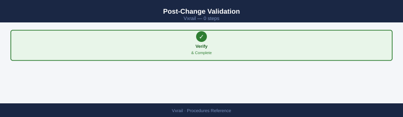

- [ ] All VxRail nodes Online in VxRail Plugin
- [ ] vSAN health all green
- [ ] vSAN resync completed (0 bytes remaining)
- [ ] No new vCenter alarms
- [ ] VMs running normally
- [ ] ESXi version matches expected version (if upgrade was performed)
- [ ] iDRAC hardware health: no new faults

---

## Node Maintenance Mode Procedure

VxRail nodes use vSAN as the storage layer. Before entering maintenance mode, vSAN must evacuate all data objects from the node so no data is at risk. This is different from standard vSphere maintenance mode — use the **vSAN-aware** maintenance mode option.

!!! warning "Verify cluster capacity before entering maintenance mode"
    If the remaining nodes do not have enough free capacity to hold all evacuated objects, the **Full data migration** option will stall indefinitely and the host will never enter maintenance mode. Before starting, confirm that the cluster's used space is below approximately 60% so there is headroom for a single node's objects to be redistributed. If you are capacity-constrained, open a Dell support case before proceeding.

### Step 1 — Confirm Pre-Conditions


```bash
# vSAN must be fully synced before entering maintenance
esxcli vsan debug resync list
# Remaining Bytes must be 0 before proceeding
```


```text title="Expected output"
Cluster UUID: 52d4a8f1-7c3e-4a2b-9e1f-8b2c5d9a1f3e
Node UUID: 4a5b6c7d-8e9f-0a1b-2c3d-4e5f-6a7b-8c9d
Remaining Bytes: 0
Resync Objects: 0
Resync Rate (MB/s): 0
Last Updated: 2024-01-15T14:32:18Z
```

!!! warning "Common errors"
    **`Cluster UUID: N/A`** — Verify vSAN is enabled on the cluster and the host is connected to vCenter with `esxcli vsan cluster get`.
    **`Remaining Bytes: 1247856640`** — Wait for vSAN resync to complete before entering maintenance mode; monitor progress with `esxcli vsan debug resync list` every 5 minutes.
    **`Error: Unable to connect to vSAN cluster`** — Ensure the ESXi host is part of an active vSAN cluster and network connectivity to other cluster nodes is functional.
- All VMs must be able to vMotion off the node (DRS Fully Automated)
- Sufficient capacity on remaining nodes to hold evacuated vSAN objects

### Step 2 — Enter Maintenance Mode

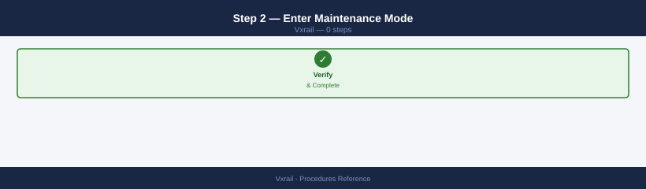


In vCenter: right-click the host → **Maintenance Mode → Enter Maintenance Mode**

In the dialog, set the **vSAN data migration** option:

| Option | When to Use |
|---|---|
| **Full data migration** | Recommended for hardware work — evacuates all vSAN objects off the node |
| Ensure accessibility | Faster; keeps one copy accessible but doesn't fully evacuate — use only for short reboots |
| No data migration | Only if you have no vSAN objects on the node (not typical) |

Select **Full data migration** for any hardware work or LCM upgrade.

```powershell
# PowerCLI — enter maintenance mode with full vSAN evacuation
$host = Get-VMHost "vxrail-node-01.example.local"
Set-VMHost -VMHost $host -State Maintenance -VsanDataMigrationMode Full -Confirm:$false
```

### Step 3 — Wait for Maintenance Mode to be Active

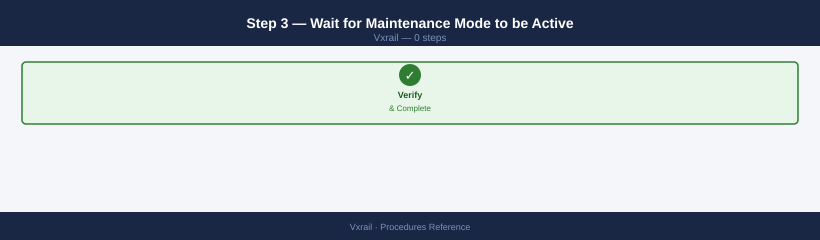

vCenter shows the host icon with a wrench (maintenance) indicator. This can take 10–30 minutes depending on the amount of data to evacuate.

```bash
# Monitor evacuation progress
esxcli vsan debug resync list
# Watch for Remaining Bytes to count down to 0
```


```text title="Expected output"
Cluster UUID: 52e4c8f1-a2b3-4c5d-8e9f-1a2b3c4d5e6f
Resync Operations:
  UUID: 7f8a9b0c-1d2e-3f4a-5b6c-7d8e9f0a1b2c
  Object: vsan:afa8d5e8-1234-5678-90ab-cdef12345678
  Remaining Bytes: 847293456
  Total Bytes: 1099511627776
  Progress: 77%
  
  UUID: 8g9h0i1j-2k3l-4m5n-6o7p-8q9r0s1t2u3v
  Object: vsan:bfb9e6f9-2345-6789-01bc-def123456789
  Remaining Bytes: 0
  Total Bytes: 549755813888
  Progress: 100%
```

!!! warning "Common errors"
    **`esxcli: command not found`** — Run the command from an ESXi host with vSAN enabled, or use SSH to connect to the vSAN cluster host directly.
    **`Error: The VSAN cluster is not healthy`** — Wait for cluster quorum to stabilize or check `esxcli vsan cluster get` to verify cluster membership before monitoring resync operations.
### Step 4 — Perform Work

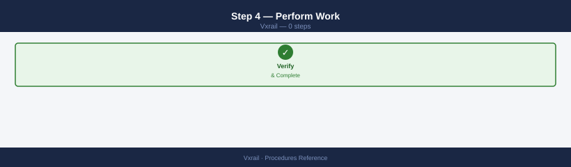

With the node in maintenance mode and VMs migrated off:

- Apply hardware changes, replace failed components, or allow LCM to proceed with upgrade
- iDRAC reboot if needed: `racadm serveraction gracereboot`

### Step 5 — Exit Maintenance Mode


In vCenter: right-click the host → **Maintenance Mode → Exit Maintenance Mode**

```powershell
# PowerCLI — exit maintenance mode
Set-VMHost -VMHost (Get-VMHost "vxrail-node-01.example.local") -State Connected -Confirm:$false
```

### Step 6 — Wait for vSAN Resync

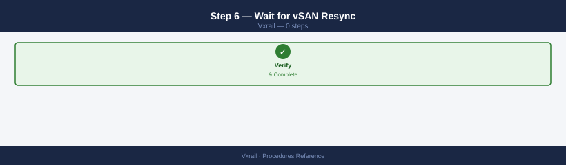

After the node rejoins, vSAN resyncs data back to the node. Do not start another maintenance window until resync completes.

```bash
# Poll resync on any cluster node
esxcli vsan debug resync list
# Proceed only when Remaining Bytes = 0
```


```text title="Expected output"
Cluster UUID: 52e4d8f1-7a2c-4d9e-b8c3-9f1a2b3c4d5e
Resync Operations:
  Object UUID: 7f3a1b2c-4d5e-6f7a-8b9c-0d1e2f3a4b5c
    Remaining Bytes: 0
    Total Bytes: 1073741824
    Completion %: 100
  Object UUID: 8g4b2c3d-5e6f-7g8a-9c0d-1e2f3a4b5c6d
    Remaining Bytes: 0
    Total Bytes: 536870912
    Completion %: 100
  Object UUID: 9h5c3d4e-6f7g-8h9a-0d1e-2f3a4b5c6d7e
    Remaining Bytes: 2147483648
    Total Bytes: 4294967296
    Completion %: 50
Resync Status: In Progress
```

!!! warning "Common errors"
    **`Error: Unknown command or namespace path: vsan debug resync list`** — Verify the ESXi host has vSAN enabled and the vSAN license is active; run `esxcli vsan cluster get` to confirm vSAN is operational.
    **`Error: Unable to connect to the ESXi host`** — Ensure SSH is enabled on the ESXi host and you have network connectivity; verify credentials with `esxcli system hostname get`.
---

## Node Expansion Procedure

Adding a node to a VxRail cluster is orchestrated entirely by VxRail Manager. Manual ESXi installation or manual vSphere cluster addition is not supported.

### Pre-Expansion Requirements

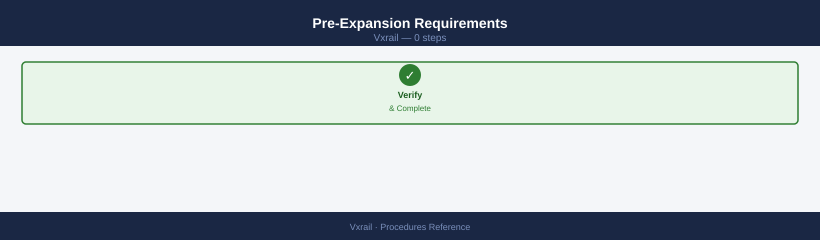

- [ ] New node is racked, cabled, and powered on
- [ ] iDRAC is accessible from the management network and configured with a static IP
- [ ] New node's iDRAC credentials are known (root + password)
- [ ] Node hardware model is compatible with the existing cluster (check Dell VxRail Hardware Compatibility Guide)
- [ ] Available IPs exist in each required network: management, vMotion, vSAN, VM network
- [ ] Existing cluster vSAN health is green and resync = 0

### Step 1 — Verify New Node iDRAC Accessibility


```bash
# Ping the new node iDRAC from the management network
ping <new-node-idrac-ip>

# SSH test
ssh root@<new-node-idrac-ip>
racadm getsysinfo
```


```text title="Expected output"
PING 10.20.30.45 (10.20.30.45) 56(84) bytes of data.
64 bytes from 10.20.30.45: icmp_seq=1 ttl=64 time=2.34 ms
64 bytes from 10.20.30.45: icmp_seq=2 ttl=64 time=1.89 ms
64 bytes from 10.20.30.45: icmp_seq=3 ttl=64 time=2.12 ms
--- 10.20.30.45 statistics ---
3 packets transmitted, 3 received, 0% packet loss, time 2003ms
rtt min/avg/max/stddev = 1.89/2.11/2.34/0.19 ms

System Information
  System Model                          : PowerEdge R750
  BIOS Version                          : 2.14.2
  iDRAC Version                         : 5.00.10.20
  System Firmware Version               : 2.14.2
  Lifecycle Controller Version          : 3.82.82.82
  Baseboard Management Controller Version : 7.02.45
  System UUID                           : 4a5b6c7d-8e9f-0a1b-2c3d-4e5f6a7b8c9d
```

!!! warning "Common errors"
    **`ping: unknown host <new-node-idrac-ip>`** — Replace the placeholder with the actual iDRAC IP address (e.g., `ping 10.20.30.45`).
    **`ssh: connect to host <new-node-idrac-ip> port 22: Connection refused`** — Verify the iDRAC is powered on and SSH is enabled; check iDRAC network connectivity and firewall rules.
    **`RACADM.1.0.0 : IPMI command failed with error: Unable to establish IPMI v1.5 / IPMI v2.0 session`** — Ensure the root credentials are correct and the iDRAC user account has proper permissions configured.
### Step 2 — Initiate Expansion via VxRail Plugin

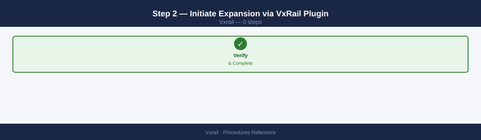

In vCenter: **Menu → VxRail → Cluster → Add Node**

Follow the wizard:

1. VxRail Manager discovers the new node via iDRAC ping
2. Validate the node hardware is compatible with the cluster (model, disk configuration)
3. Configure network settings for the new node: management IP, vMotion IP, vSAN IP
4. Review and confirm — VxRail Manager installs ESXi and joins the node to the cluster automatically

Or trigger via API:

```bash
curl -sk \
  -X POST \
  -H "Authorization: Basic $(echo -n 'mystic:password' | base64)" \
  -H "Content-Type: application/json" \
  -d '{
    "hosts": [{
      "idrac": {
        "ip": "10.0.100.25",
        "username": "root",
        "password": "CalvinIdrac1!"
      }
    }]
  }' \
  "https://<vxm-ip>/rest/vxm/v1/cluster/expansion"
```


```text title="Expected output"
{
  "request_id": "req-a7f3-4c2e-9b1d-7e8f2c5a3b9d",
  "status": "PENDING",
  "expansion_id": "exp-2024-001",
  "hosts_added": 1,
  "cluster_name": "vxrail-cluster-prod",
  "estimated_completion": "2024-01-15T14:32:00Z",
  "message": "Host expansion request submitted successfully"
}
```

!!! warning "Common errors"
    **`curl: (60) SSL certificate problem: self signed certificate`** — Add the `-k` flag to skip SSL verification, or import the VXM certificate into your trusted store.
    **`{"error": "401 Unauthorized", "message": "Invalid credentials"}`** — Verify the base64-encoded username:password is correct by decoding it with `echo 'bXlzdGljOnBhc3N3b3Jk' | base64 -d`.
    **`{"error": "400 Bad Request", "message": "Invalid iDRAC IP address"}`** — Confirm the iDRAC IP `10.0.100.25` is reachable from the VXM appliance with `ping 10.0.100.25` and that the iDRAC credentials are correct.
### Step 3 — Monitor Expansion

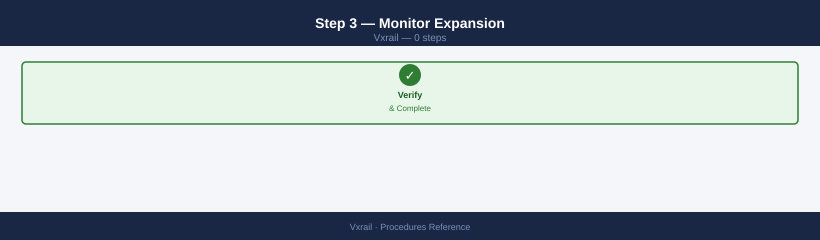

Monitor via: **VxRail Plugin → Cluster → Events** or vCenter Tasks panel.

Expansion steps performed by VxRail Manager:

1. iDRAC discovery and hardware validation
2. Network IP assignment
3. ESXi installation via Auto Deploy / cluster profile
4. Node joins vSphere cluster
5. vSAN disk groups claimed on new node
6. vSAN rebalancing begins automatically

### Step 4 — Wait for vSAN Rebalance


After the node joins, vSAN redistributes objects across the now-larger cluster. This is not instantaneous.

```bash
# Monitor rebalance on any existing cluster node
esxcli vsan debug resync list | grep -E "Total|Remaining"
# Proceed with no further changes until Remaining Bytes = 0
```


```text title="Expected output"
Total Bytes: 1847293845504
Remaining Bytes: 847293845504
Total Bytes: 1847293845504
Remaining Bytes: 0
```

!!! warning "Common errors"
    **`esxcli: command not found`** — Ensure you are connected to an ESXi host via SSH or execute the command within the ESXi shell, not from a remote Linux system.
    **`Unknown command or namespace vsan debug resync`** — Verify VSAN is licensed and enabled on the cluster; this command is unavailable on hosts without VSAN or on older vSphere versions that do not support the debug resync namespace.
### Step 5 — Post-Expansion Validation

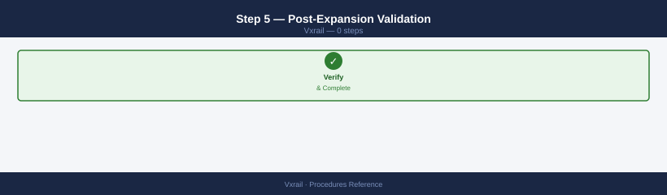

```powershell
# Confirm new node is visible and version matches cluster
Get-VMHost | Select-Object Name, Version, Build, ConnectionState | Sort-Object Name | Format-Table -AutoSize

# vSAN cluster health
Get-VsanClusterHealthSummary -Cluster "VxRail-Cluster" | Select-Object OverallHealth

# Confirm new node disk groups are in vSAN
# vCenter → Cluster → Configure → vSAN → Disk Management
```

---

## Disk Replacement Procedure

### Step 1 — Identify the Failed Disk

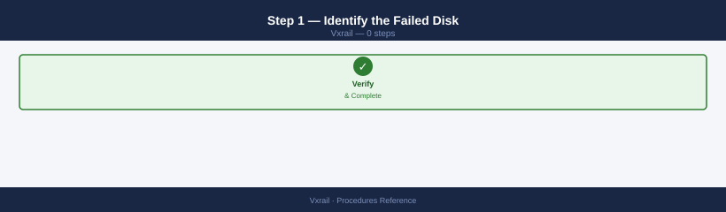

1. A vCenter alarm fires indicating a vSAN component is **Absent** or **Degraded**
2. Navigate to: **vCenter → Cluster → Monitor → vSAN → Physical Disk**
3. Identify the node and disk position of the failed component
4. Confirm in iDRAC: SSH to the node's iDRAC and check the event log

```bash
# iDRAC event log — look for drive fault events
racadm getsel | tail -30

# Physical disk list from iDRAC
racadm storage get pdisks
```


```text title="Expected output"
SEL Records:
 1 | 01/15/2025 14:32:15 | Drive | Physical Drive 0 in Slot 1 | Predictive Failure
 2 | 01/15/2025 14:35:22 | Drive | Physical Drive 1 in Slot 2 | Predictive Failure
 3 | 01/15/2025 15:10:45 | Temperature | System Board Inlet Temp | Upper Critical - going high
 4 | 01/15/2025 16:02:33 | Drive | Physical Drive 0 in Slot 1 | Drive Online
 5 | 01/15/2025 16:15:18 | Power Supply | PSU1 Status | Presence detected
 6 | 01/15/2025 17:45:09 | Drive | Physical Drive 2 in Slot 3 | Predictive Failure
 7 | 01/15/2025 18:22:51 | System Event | SEL | Log area reset/cleared

Physical Disk Inventory:
Disk.Bay.1
  State: Online
  Size: 1863.0 GB
  Model: DELL PERC H840
  Status: OK

Disk.Bay.2
  State: Online
  Size: 1863.0 GB
  Model: DELL PERC H840
  Status: OK

Disk.Bay.3
  State: Degraded
  Size: 1863.0 GB
  Model: DELL PERC H840
  Status: Predictive Failure

Disk.Bay.4
  State: Online
  Size: 1863.0 GB
  Model: DELL PERC H840
  Status: OK
```

!!! warning "Common errors"
    **`DRAC001: Unable to establish IPMI v1.5 / IPMI v2.0 session`** — Verify iDRAC IP connectivity and credentials with `ping <idrac-ip>` and check firewall rules allowing port 623.
    **`DRAC002: RACADM command failed: Access Denied`** — Ensure your user account has iDRAC administrator privileges; use `racadm getconfig -g cfgUserAdmin` to verify role assignments.
    **`DRAC003: No physical disks detected`** — Confirm the PERC RAID controller is detected with `racadm storage get controllers` and reseat the controller if necessary.
```bash
# ESXi — identify failed disk in vSAN
esxcli vsan storage list | grep -E "Disk Group UUID|Display Name|In Caching Tier|Is SSD"
```


```text title="Expected output"
Disk Group UUID: 52a4c8f1-7a2e-4f3b-9c1d-8e5b2a9f6d3c
Display Name: mpx.vmhba0:C0:T0:L0
In Caching Tier: true
Is SSD: true
Disk Group UUID: 52a4c8f1-7a2e-4f3b-9c1d-8e5b2a9f6d3c
Display Name: mpx.vmhba1:C0:T1:L0
In Caching Tier: false
Is SSD: false
Disk Group UUID: 52a4c8f1-7a2e-4f3b-9c1d-8e5b2a9f6d3c
Display Name: mpx.vmhba2:C0:T2:L0
In Caching Tier: false
Is SSD: false
Disk Group UUID: 7f3e9c2a-1b5d-4a8f-6e2c-9d1a5b8f3e7c
Display Name: mpx.vmhba3:C0:T3:L0
In Caching Tier: true
Is SSD: true
```

!!! warning "Common errors"
    **`Unknown command or namespace vsan`** — Verify vSAN is licensed and enabled on the ESXi host with `esxcli vsan cluster get`.
    **`grep: (standard input) is empty`** — Confirm the ESXi host is part of a vSAN cluster and has disk groups configured with `esxcli vsan storage list` without filters.
### Step 2 — Assess vSAN Impact


While the disk is failed, vSAN continues to serve data using remaining copies (if FTT > 0 and data is replicated). Check the number of degraded objects:

```bash
esxcli vsan debug resync list
# Note: resync bytes will show active rebuild activity
```


```text title="Expected output"
Cluster UUID: 52d4a8f1-7c3e-4d2a-9b1e-6f8a2c5d9e3a
Resync Activity:
  Object UUID: 8f2c1a9d-5e7b-4c3f-9a2d-1b8e6f4a7c5d
    Resync Bytes: 2147483648
    Bytes Remaining: 1073741824
    Estimated Time: 45 minutes
  Object UUID: 3c7f9a1e-2d5b-8f4a-6c9e-1a3d7f2b5e8c
    Resync Bytes: 536870912
    Bytes Remaining: 268435456
    Estimated Time: 12 minutes
  Object UUID: 9e2a5f1c-7d3b-4a8f-6e1d-2c9a5f3b7e4d
    Resync Bytes: 1610612736
    Bytes Remaining: 805306368
    Estimated Time: 38 minutes
Total Resync Bytes: 4294967296
Total Bytes Remaining: 2147483648
```

!!! warning "Common errors"
    **`Unknown command or namespace esxcli vsan debug resync`** — Verify VSAN is licensed and enabled on the cluster; run `esxcli vsan cluster get` to confirm VSAN status.
    **`Permission denied`** — Execute the command with root privileges or ensure your user account has VSAN administrator permissions on the ESXi host.
!!! danger "FTT exceeded — data is at risk of permanent loss"
    If `esxcli vsan debug resync list` shows components with zero remaining replicas, vSAN cannot tolerate any further disk or node failure. Do not proceed with the replacement until you have escalated to Dell support and confirmed a recovery path. Replacing the disk at this point without guidance may not recover the objects.

If vSAN shows **no remaining replicas** for any object (FTT exceeded), treat this as a P1 incident and restore immediately.

### Step 3 — Enter Node Maintenance Mode


Before physically replacing the disk, put the node in maintenance mode using **Full data migration** (see [Node Maintenance Mode](#node-maintenance-mode-procedure) above).

!!! warning "Do not hot-swap without maintenance mode if a rebuild is already active"
    If vSAN has already started rebuilding objects to other nodes following the disk failure, those objects are temporarily under-replicated. Removing another disk (even the failed one) without first confirming the rebuild is complete risks exceeding FTT and losing data. Verify `esxcli vsan debug resync list` shows Remaining Bytes = 0, or consult Dell support before proceeding without full maintenance mode.

If the disk failure has already caused vSAN to begin rebuilding on other nodes, you may be able to hot-swap without full maintenance mode — consult Dell support for guidance on whether in-place hot-swap is safe in your cluster configuration.

### Step 4 — Hot-Swap the Disk


- Dell PowerEdge nodes support hot-swap of SAS/SATA/NVMe drives with the carrier
- The failed drive's LED will be amber on the front panel
- Physically remove the failed drive and insert the replacement in the same slot
- iDRAC will detect the new drive automatically

```bash
# After insertion, verify iDRAC sees the new disk
racadm storage get pdisks
```


```text title="Expected output"
List of Physical Disks in the System:

Disk.Bay.1
Object FQDD: Disk.Bay.1
State: Online
Size: 1863.02 GB
Model: SAMSUNG MZ7LH1T6HMLT-00005
Serial Number: S4GUNA0M800123
Media Type: SSD
Predicted Media Life Left: 99%

Disk.Bay.2
Object FQDD: Disk.Bay.2
State: Online
Size: 1863.02 GB
Model: SAMSUNG MZ7LH1T6HMLT-00005
Serial Number: S4GUNA0M800124
Media Type: SSD
Predicted Media Life Left: 99%

Disk.Bay.3
Object FQDD: Disk.Bay.3
State: Online
Size: 1863.02 GB
Model: SAMSUNG MZ7LH1T6HMLT-00005
Serial Number: S4GUNA0M800125
Media Type: SSD
Predicted Media Life Left: 99%
```

!!! warning "Common errors"
    **`DRAC1001: iDRAC is not initialized or not responding`** — Verify iDRAC network connectivity and ensure the management interface is properly configured with `racadm config -g cfgLanIpRacInterface -o cfgIpRacAddress`.
    **`DRAC0332: Insufficient privileges to perform the requested operation`** — Run the command with root privileges or ensure your user account has iDRAC administrator rights.
### Step 5 — Exit Maintenance Mode and Claim Disk in vSAN

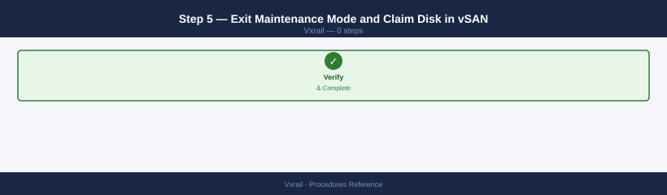

Exit the node from maintenance mode (see Step 5 of the maintenance mode procedure).

Once the node is back Online, claim the new disk in vSAN:

**vCenter → Cluster → Configure → vSAN → Disk Management → Claim Disk**

Select the new unclaimed disk and add it to the existing disk group (or create a new disk group if the cache disk was also replaced).

### Step 6 — Monitor Rebalance and Rebuild

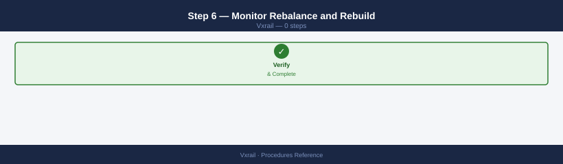

```bash
# Watch vSAN rebalance after disk claim
esxcli vsan debug resync list
# Wait for Remaining Bytes = 0 before declaring the replacement complete
```


```text title="Expected output"
Cluster UUID: 52d4a8f1-2e3c-4d5a-9f1b-7c8e9a0b1c2d
Resyncing Objects: 847
Remaining Bytes: 2847291392
Resync Rate (MB/s): 145.3
Estimated Time Remaining: 5h 23m
Object UUID: 6f7a8b9c-0d1e-2f3a-4b5c-6d7e8f9a0b1c
  Remaining Bytes: 1423645696
  Resync Rate (MB/s): 72.8
Object UUID: 7g8h9i0j-1k2l-3m4n-5o6p-7q8r-9s0t1u2v
  Remaining Bytes: 1423645696
  Resync Rate (MB/s): 72.5
...
```

!!! warning "Common errors"
    **`vSAN cluster is not healthy. Cannot retrieve resync status.`** — Verify vSAN cluster health with `esxcli vsan cluster get` and resolve any failed disks or hosts before checking resync status.
    **`Unknown command or namespace`** — Ensure you are running this command on an ESXi host with vSAN enabled; use `esxcli vsan cluster get` first to confirm vSAN is active.
Validate in vCenter: **Cluster → Monitor → vSAN → Health** — all checks should return to green.

---

## Run VxRail LCM Upgrade

1. VxRail Manager → LCM → **Upgrade**
2. Select the target version — VxRail Manager queries the VxRail update repository and shows available releases
3. Click **Run Compatibility Check** — validates that all nodes, firmware, and vCenter versions are compatible with the target release
4. Resolve any compatibility failures before proceeding (common: vCenter version too old, incompatible firmware baseline)
5. Click **Download Bundle** — VxRail Manager downloads the upgrade bundle (may take time depending on bundle size)
6. Schedule the upgrade window — confirm with application teams; a rolling upgrade causes brief per-node vMotion activity but no cluster-wide outage
7. Click **Start Upgrade** — VxRail Manager upgrades one node at a time: places node in maintenance mode, applies firmware and ESXi upgrade, exits maintenance mode, waits for resync, then moves to the next node
8. Monitor progress: VxRail Manager → LCM → **Events**
9. Post-upgrade validation: run the Post-Change Validation checklist; confirm all nodes show the new ESXi and VxRail version

---

## Add a Node to the VxRail Cluster

1. Rack the new node in the VxRail rack and connect all cables: management, vMotion, vSAN, and VM network uplinks
2. Configure iDRAC with a static management IP and verify it is reachable from the management network
3. VxRail Manager → **Add Node** — VxRail Manager discovers the new node via the iDRAC IP
4. Complete the Add Node wizard:
   - Confirm node hardware is compatible with the existing cluster (model and disk configuration)
   - Configure IP addresses: management, vMotion, vSAN for the new node
   - Map the node to the correct VxRail network profile
5. Submit — VxRail Manager installs ESXi on the new node, joins it to the vSphere cluster, and claims vSAN disk groups automatically
6. Wait for vSAN rebalance to complete (`esxcli vsan debug resync list` — Remaining Bytes = 0)
7. Run the Post-Change Validation checklist

---

## Replace a Failed Disk

1. In vCenter: **Cluster → Monitor → vSAN → Physical Disks** — identify the failed disk (shows as Absent or Degraded)
2. Note the node and disk slot from the physical disk detail pane
3. Confirm the failure in iDRAC: SSH to the node's iDRAC → `racadm getsel | tail -30` — look for drive fault events
4. Initiate vSAN evacuation for the node: put the node in maintenance mode with **Full data migration** (see [Node Maintenance Mode](#node-maintenance-mode-procedure))
5. Physically hot-swap the failed disk — the failed drive's carrier LED is amber; insert the replacement in the same slot
6. Verify iDRAC detects the new disk: `racadm storage get pdisks`
7. Exit maintenance mode — the node rejoins the cluster
8. VxRail Manager automatically reclaims the new disk into the existing vSAN disk group; monitor in vCenter → **Cluster → Configure → vSAN → Disk Management**
9. Wait for vSAN rebuild to complete (`esxcli vsan debug resync list` — Remaining Bytes = 0)

---

## Configure SMTP for VxRail Alerts

1. VxRail Manager → Settings → **SMTP**
2. Configure:
   - **Relay host** — SMTP relay FQDN or IP (e.g., `smtp.example.local`)
   - **Port** — typically 25 (unauthenticated relay) or 587 (STARTTLS)
   - **From address** — sender address for VxRail alert emails (e.g., `vxrail-alerts@example.local`)
3. Add alert email recipients: enter one or more recipient addresses
4. Click **Test Email** — verify a test message is received at the configured address
5. Save — VxRail Manager will now send email alerts for hardware faults, vSAN health changes, and upgrade events

---

## Update VxRail Manager Credentials

Required when vCenter, PSC, or service account passwords are rotated outside of VxRail Manager.

1. VxRail Manager → Settings → **Credentials**
2. Locate the credential entry to update (vCenter admin, PSC admin, or SDDC Manager if VCF-managed)
3. Click **Edit** → enter the new password
4. Click **Test Connectivity** — VxRail Manager validates the credential against the target system
5. Save — VxRail Manager resumes normal operations using the updated credential

If connectivity fails after a credential update, verify the password was entered correctly and that the account has not been locked.

---

## Generate VxRail Log Bundle

Used for Dell support case submission or in-house troubleshooting.

1. VxRail Manager → Support → **Log Bundle**
2. Select the scope:
   - **All nodes** — includes logs from every node in the cluster (large bundle; use for cluster-wide issues)
   - **Specific node** — include only the affected node's logs (use for single-node hardware issues)
3. Click **Generate** — VxRail Manager collects logs from all selected nodes and assembles the bundle
4. When generation completes, click **Download** — save the `.zip` file locally
5. Attach the bundle to the Dell support case via the Dell SupportAssist portal or upload directly to the support case

---

## Configure iDRAC Access on VxRail Node

iDRAC provides out-of-band access for hardware monitoring, remote console, and node discovery.

1. Connect to the iDRAC management IP via browser (`https://<idrac-ip>`) — default credentials are on the node's service tag label
2. Navigate to **iDRAC Settings → Network** → configure a static IP, subnet, gateway, and DNS
3. Navigate to **iDRAC Settings → User Authentication** → set a strong admin password and disable the default root account if policy requires
4. Configure IPMI over LAN: **iDRAC Settings → Network → IPMI Settings** → enable if required for third-party monitoring tools
5. Configure Redfish API access: **iDRAC Settings → Services → Redfish** → enable for programmatic OOB management
6. Test remote console: **Virtual Console → Launch** — verify KVM access to the host

---

## Check VxRail Cluster Compliance

Compliance checks validate that all nodes are running the expected firmware and configuration baseline.

1. VxRail Manager → Inventory → **Cluster**
2. Review the compliance status column for each node — all nodes should show **Compliant**
3. For any node showing **Non-Compliant**, click the node to expand the detail view:
   - **Firmware drift** — node firmware version does not match the cluster's active firmware baseline; remediate via LCM
   - **Configuration drift** — host profile or VxRail configuration differs from the cluster template; investigate and re-apply profile via vCenter **Host Profiles**
4. After remediation, re-run the compliance check to confirm all nodes return to Compliant status
5. Schedule periodic compliance checks (monthly recommended) as part of ongoing operational governance

---

## Remove a Node from VxRail Cluster (Decommission)

Use this procedure to permanently remove a node from the VxRail cluster — for example, to retire aging hardware or reduce cluster size. This is irreversible without a full re-expansion.

!!! warning "Minimum node count"
    A vSAN cluster requires a minimum of 3 nodes (4 for two-host fault tolerance). Removing a node from a 3-node cluster will leave vSAN with insufficient hosts to sustain FTT=1. Confirm remaining node count before proceeding; if at minimum, contact Dell for guidance on transitioning to a 2-node ROBO configuration.

### Step 1 — Pre-Decommission Checks

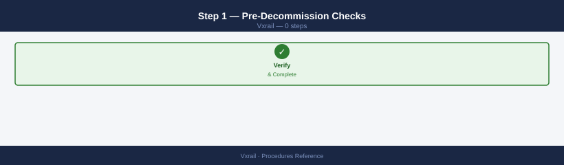

```bash
# Confirm vSAN health is green and resync = 0
esxcli vsan debug resync list
# Verify no components will become non-compliant after removal
esxcli vsan storage list | grep -E "UUID|Compliant"
```


```text title="Expected output"
UUID: 52e4a8f1-7c2e-4a9b-b1d2-9f3e8c7a6b5d
Compliant: true
UUID: 7a3f9e2c-1b8d-4f6a-9c5e-2d8a4b7f1e3c
Compliant: true
UUID: 9d2c5a8f-3e7b-1a4c-6f9e-8b2d5c7a1f4e
Compliant: true
UUID: 4b1e7f3a-9c2d-5a8e-1f6b-3c9a7e2d5b8f
Compliant: true
```

!!! warning "Common errors"
    **`Error: Unknown command or namespace vsan.debug.resync`** — Verify vSAN is licensed and enabled on the cluster with `esxcli vsan cluster get`.
    **`grep: (standard input) is empty`** — Confirm vSAN storage is present by running `esxcli vsan storage list` without grep to check for actual output.
Check that the cluster has sufficient free capacity on remaining nodes to absorb all vSAN objects from the node being removed. Used cluster capacity must be below approximately 60% before starting.

### Step 2 — Migrate All VMs Off the Node

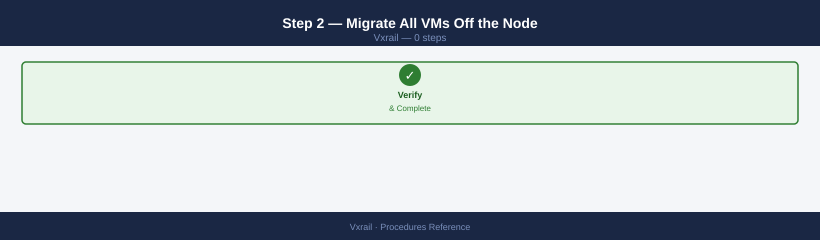

Use vSphere DRS or manual vMotion to move all running VMs to other cluster nodes. This is a separate step from vSAN evacuation.

```powershell
# PowerCLI — vMotion all VMs from the target node
$sourceHost = Get-VMHost "vxrail-node-04.example.local"
Get-VM -Location $sourceHost | Move-VM -Destination (Get-VMHost | Where-Object {$_.Name -ne $sourceHost.Name} | Get-Random)
```

### Step 3 — Enter Maintenance Mode with Full Data Migration

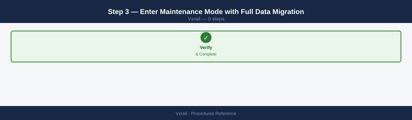

Put the node in maintenance mode using **Full data migration** so vSAN fully evacuates all objects to remaining nodes. See [Node Maintenance Mode](#node-maintenance-mode-procedure) for the detailed steps.

Wait for resync to reach 0 bytes before proceeding:

```bash
esxcli vsan debug resync list
# Remaining Bytes must be 0 before Step 4
```


```text title="Expected output"
Cluster UUID: 52d4a8f1-7c3e-4d92-a1b2-9e8c7f6d5a4b
Node UUID: esx-node-01.lab.local
Resync Status: In Progress
  Object UUID: 6f8a9c2e-1d4b-4a7f-b3e2-8c5d9a1f7e3b
  Remaining Bytes: 0
  Estimated Time Remaining: 0 seconds
  
  Object UUID: 7g9b0d3f-2e5c-5b8g-c4f3-9d6e0b2g8f4c
  Remaining Bytes: 2147483648
  Estimated Time Remaining: 1247 seconds
  
  Object UUID: 8h0c1e4g-3f6d-6c9h-d5g4-0e7f1c3h9g5d
  Remaining Bytes: 0
  Estimated Time Remaining: 0 seconds

Resync Summary: 3 objects, 2 GB remaining
```

!!! warning "Common errors"
    **`error: The VSAN cluster is not healthy`** — Run `esxcli vsan cluster get` to verify cluster membership and quorum before attempting resync operations.
    **`error: Permission denied`** — Execute the command with root privileges or ensure your user account has VSAN administrator role assigned in vCenter.
### Step 4 — Remove the Node via VxRail Plugin

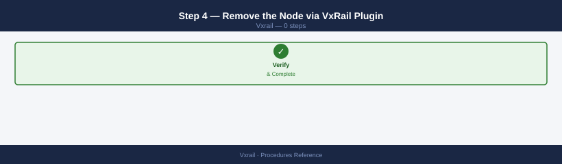

In vCenter: **Menu → VxRail → Cluster → Remove Node**

Select the node to remove and confirm. VxRail Manager:

1. Validates that vSAN has no objects on the node (requires maintenance mode + full evacuation)
2. Removes the host from the vSphere cluster
3. Un-claims the node's disk groups from vSAN
4. Removes the node record from VxRail Manager inventory

### Step 5 — Post-Removal Validation

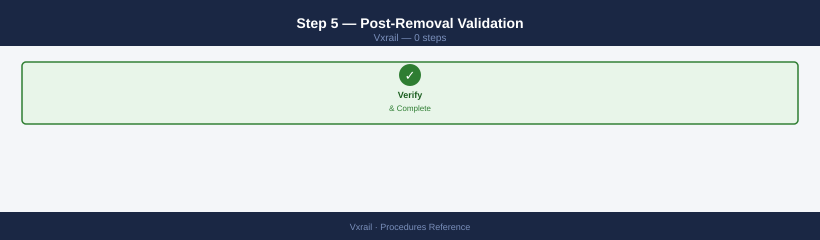

```bash
# Confirm vSAN cluster is healthy with the reduced node count
esxcli vsan health cluster get

# Confirm object compliance on remaining nodes
esxcli vsan debug resync list
```


```text title="Expected output"
Cluster UUID: 52d4a8f1-2e3c-4a5b-9c1d-7e8f9a0b1c2d
Cluster Health State: HEALTHY
Cluster Health Timestamp: 2024-01-15T14:32:18Z
Number of nodes: 3
Number of disk groups: 3
Number of objects: 247
Number of components: 742

Resync Objects: 0
Resync Components: 0
Resync Bytes: 0 B
Resync Time Remaining: 0 seconds
Last Resync Update: 2024-01-15T14:31:45Z
```

!!! warning "Common errors"
    **`vSAN cluster health is degraded`** — Wait 5-10 minutes for object rebalancing to complete after node removal, then re-run the health check.
    **`Unable to connect to a vSAN enabled host`** — Verify the ESXi host is powered on and accessible via network, and that vSAN is enabled on the cluster.
- [ ] Removed node no longer appears in vCenter host list
- [ ] vSAN health all green
- [ ] Resync = 0 bytes
- [ ] Cluster shows correct node count in VxRail Plugin
- [ ] VMs that were running on the removed node are running normally on remaining nodes

### Step 6 — Physical Removal

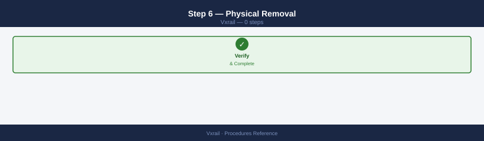

Once the node is fully deregistered: power off the node (`racadm serveraction graceshutdown`), disconnect cables, and remove from rack. The node retains its ESXi installation; factory-reset via RASR if redeploying elsewhere.

---

## Renew VxRail Manager Certificate

VxRail Manager presents a TLS certificate for its UI and API endpoints. This certificate must be renewed before expiry to prevent browser warnings and API authentication failures.

### Option A — LCM-Managed Certificate (Recommended)

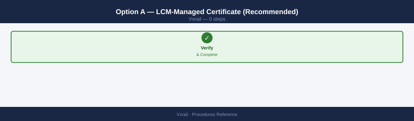

If VxRail is integrated with Aria Suite Lifecycle:

1. LCM → Lifecycle Operations → Environments → VxRail card → **Replace Certificate**
2. Select the new certificate from the LCM Locker (import it first via Locker → Certificates if not already there)
3. Confirm — LCM pushes the cert to VxRail Manager and restarts its web service
4. Verify: browse to `https://<vxm-fqdn>` and confirm the browser shows the new certificate expiry date

### Option B — Direct API Replacement (No LCM)

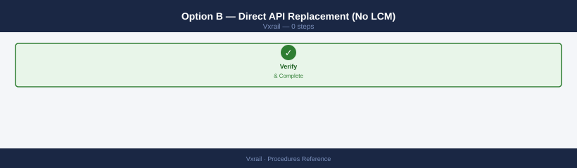

```bash
# Step 1 — Generate a CSR from VxRail Manager
curl -sk \
  -X POST \
  -H "Authorization: Basic $(echo -n 'mystic:<password>' | base64)" \
  -H "Content-Type: application/json" \
  -d '{"common_name":"vxm.example.local","sans":["vxm.example.local","10.0.100.10"]}' \
  "https://<vxm-ip>/rest/vxm/v1/system/certificates/csr" | python3 -m json.tool

# Save the returned CSR and submit to your CA to obtain a signed certificate

# Step 2 — Upload the signed cert and private key to VxRail Manager
curl -sk \
  -X PUT \
  -H "Authorization: Basic $(echo -n 'mystic:<password>' | base64)" \
  -H "Content-Type: application/json" \
  -d '{
    "certificate": "<PEM cert content, single line with \\n>",
    "private_key": "<PEM key content, single line with \\n>"
  }' \
  "https://<vxm-ip>/rest/vxm/v1/system/certificates"
```


```text title="Expected output"
{
  "csr": "-----BEGIN CERTIFICATE REQUEST-----\nMIICljCCAX4CAQAwGDEWMBQGA1UEAwwNdnhtLmV4YW1wbGUubG9jYWwwggEiMA0G\nCSqGSIb3DQEBAQUAA4IBDwAwggEKAoIBAQC7VJTUt9Us8cKjMzEfYyjiWA4/4eTj\nxrx5qPXKqDMKGJHEhEqfKCqGKqVVEGZLzJHBqLvVDZMqPvxLpKMVLZJzqFGKqVVE\nGZLzJHBqLvVDZMqPvxLpKMVLZJzqFGKqVVEGZLzJHBqLvVDZMqPvxLpKMVLZJzqF\nGKqVVEGZLzJHBqLvVDZMqPvxLpKMVLZJzqFGKqVVEGZLzJHBqLvVDZMqPvxLpKMV\nLZJzqFGKqVVEGZLzJHBqLvVDZMqPvxLpKMVLZJzqFGKqVVEGZLzJHBqLvVDZMqPv\nxLpKMVLZJzqFGKqVVEGZLzJHBqLvVDZMqPvxLpKMVLZJzqFGKqVVEGZLzJHBqLvV\nDZMqPvxLpKMVLZJzqFGKqVVEGZLzJHBqLvVDZMqPvxLpKMVLZJzqFGKqVVEGZLzJ\nHBqLvVDZMqPvxLpKMVLZJzqFGKqVVEGZLzJHBqLvVDZMqPvxLpKMVLZJzqFGKqVV\nEGZLzJHBqLvVDZMqPvxLpKMVLZJzqFGKqVVEGZLzJHBqLvVDZMqPvxLpKMVLZJzq\nFGKqVVEGZLzJHBqLvVDZMqPvxLpKMVLZJzqFGKqVVEGZLzJHBqLvVDZMqPvxLpKM\nVLZJzqFGKqVVEGZLzJHBqLvVDZMqPvxLpKMVLZJzqFGKqVVEGZLzJHBqLvVDZMqP\nvxLpKMVLZJ
```
After uploading, VxRail Manager restarts its web service. Allow 1–2 minutes for the restart, then verify via browser that the new certificate is in effect.

---

## Reconfigure Node Network Settings

Use this procedure when a deployed VxRail node's management, vMotion, or vSAN IP addresses need to change — for example, when renumbering the management network.

!!! warning "Network changes require a maintenance window"
    Changing IPs on an active node causes brief vMotion interruption and vSAN connectivity loss during the change. Schedule this during a maintenance window and pre-notify application teams.

### Step 1 — Pre-Check

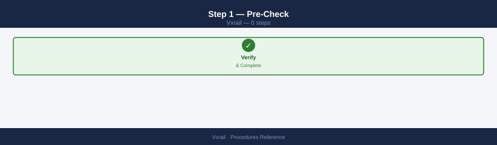

```bash
# Confirm vSAN health and resync = 0 before making any network change
esxcli vsan debug resync list
```


```text title="Expected output"
Cluster UUID: 52e4d8a9-7f2c-4a1b-9e3c-1a2b3c4d5e6f
Node UUID: 4a5b6c7d-8e9f-0a1b-2c3d-4e5f-6a7b-8c9d
Resync Operations: 0
Last Updated: 2024-01-15 14:32:18 UTC
vSAN Health Status: Healthy
Component Resync Count: 0
```

!!! warning "Common errors"
    **`Could not connect to the host. The host may not be running, or the SSL certificate may not be trusted.`** — Verify the ESXi host is reachable and SSH/management access is enabled, then retry the command.
    **`vSAN is not enabled on this host`** — Confirm vSAN is licensed and enabled on the cluster by checking vCenter > Cluster Settings > vSAN.
Verify all replacement IPs are reserved in IPAM and DNS is updated to the new management IP (forward and reverse).

### Step 2 — Enter Maintenance Mode


Put the node in maintenance mode with **Ensure accessibility** (not Full data migration — IP changes don't require full evacuation):

```powershell
Set-VMHost -VMHost (Get-VMHost "vxrail-node-02.example.local") -State Maintenance -VsanDataMigrationMode EnsureAccessibility -Confirm:$false
```

### Step 3 — Reconfigure IPs via VxRail Manager

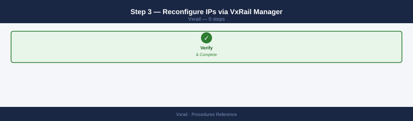

VxRail Manager → **Inventory → Nodes → select node → Edit Network Settings**

Update:
- Management IP and hostname
- vMotion IP
- vSAN IP

Confirm — VxRail Manager updates ESXi vmkernel adapter configurations and updates its own inventory.

### Step 4 — Update iDRAC and DNS

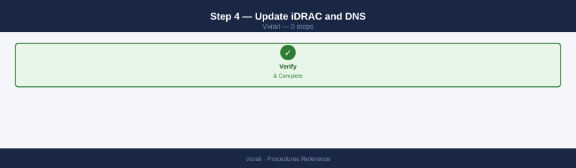

```bash
# Update iDRAC IP if it also changed
racadm set iDRAC.IPv4.Address <new-idrac-ip>
racadm set iDRAC.IPv4.Netmask <mask>
racadm set iDRAC.IPv4.Gateway <gateway>
```


```text title="Expected output"
RACADM.1.1.0=Command completed successfully.
RACADM.1.1.0=Command completed successfully.
RACADM.1.1.0=Command completed successfully.
```

!!! warning "Common errors"
    **`RACADM.1.1.0=Error: IPMI command failed`** — Ensure the iDRAC is accessible and not in a locked state; try `racadm racreset soft` to restart iDRAC services.
    **`RACADM.1.1.0=Error: Invalid IP address format`** — Verify the IP address format is valid (e.g., 192.168.1.100) and the netmask uses standard notation (e.g., 255.255.255.0).
Update DNS: add A and PTR records for the new management IP; remove or update the old records. Verify from another host:

```bash
nslookup vxrail-node-02.example.local
```


```text title="Expected output"
Server:		10.0.0.1
Address:	10.0.0.1#53

Name:	vxrail-node-02.example.local
Address: 192.168.1.42
```

!!! warning "Common errors"
    **`** server can't find vxrail-node-02.example.local: NXDOMAIN`** — Verify the hostname is correct and the DNS server has an A record for this VxRail node; check `/etc/hosts` as a temporary workaround.
    **`** ;; connection timed out; trying next origin`** — Confirm the DNS server (10.0.0.1) is reachable and responsive; check network connectivity and firewall rules blocking port 53.
### Step 5 — Exit Maintenance Mode


```powershell
Set-VMHost -VMHost (Get-VMHost "vxrail-node-02.example.local") -State Connected -Confirm:$false
```

### Step 6 — Validate

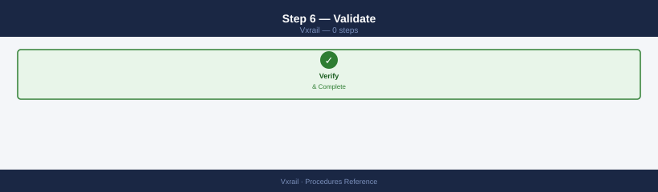

```bash
# Ping the new management IP from the network
ping <new-management-ip>

# Verify vSAN sees the node with the new IPs
esxcli vsan debug resync list
esxcli vsan health cluster get
```


```text title="Expected output"
PING <new-management-ip> (192.168.1.245) 56(84) bytes of data.
64 bytes from 192.168.1.245: icmp_seq=1 ttl=64 time=2.34 ms
64 bytes from 192.168.1.245: icmp_seq=2 ttl=64 time=1.98 ms
64 bytes from 192.168.1.245: icmp_seq=3 ttl=64 time=2.12 ms
^C
--- 192.168.1.245 statistics ---
3 packets transmitted, 3 received, 0% packet loss, time 2003ms
rtt min/avg/max/stddev = 1.98/2.15/2.34/0.15 ms

Cluster resync status:
Node: vxrail-node-01.local (UUID: 564d5f81-a2b4-4c8e-9f2e-1a3b5c7d9e0f)
  Resync objects: 0
  Resync bytes: 0 B
  Status: Idle

Cluster Health Status: HEALTHY
  Cluster UUID: 5a4b3c2d-1e0f-4a5b-6c7d-8e9f-0a1b2c3d4e5f
  Members: 4
  Disk groups: 4
  Physical disks: 16
  Capacity: 100.5 TB
  Used capacity: 45.2 TB
```

!!! warning "Common errors"
    **`PING: sendto: No route to host`** — Verify the new management IP is on the correct subnet and the network gateway/routing is configured on the ESXi host.
    **`esxcli: command not found`** — SSH directly to the ESXi host instead of running commands from a remote shell; esxcli is only available on the ESXi console.
    **`Cluster Health Status: DEGRADED`** — Wait 5-10 minutes for vSAN to complete resynchronization after the IP change, then recheck cluster health.
- [ ] Node Online in VxRail Plugin with new IP
- [ ] vCenter shows host at new management IP
- [ ] vSAN health green, resync = 0
- [ ] vMotion successful from/to the reconfigured node (test a vMotion)
- [ ] iDRAC accessible at new IP (if changed)

---

## See also

- [VxRail — Health Checks](../health-checks/)
- [VxRail — Common Issues](../../troubleshooting/common-issues/)
- [VxRail — CLI Reference](../cli-reference/)

## Verify

- **Alarms:** vSphere Client → Home → Alarms — no new critical alarms after the operation
- **Events:** monitor the vCenter Events view for the affected object for 5 minutes
- **Health check:** run the morning health-check sequence for the affected product tier
