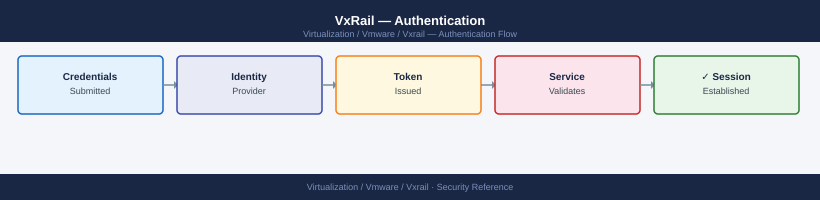

---
tags:
  - security
  - vmware
  - vxrail
description: "Authentication reference for VxRail components. Covers VxRail Manager local and LDAP accounts, iDRAC centralised authentication, vCenter SSO..."
---
# VxRail — Authentication

<div class="kb-summary">
Authentication reference for VxRail components. Covers VxRail Manager local and LDAP accounts, iDRAC centralised authentication, vCenter SSO configuration, ESXi host accounts, and service account policy.

*Applies to: VxRail 7.x / 8.x*
</div>


---

## Before you begin

- **Access:** vCenter Administrator role
- **Change management:** security changes require CAB approval in most environments
- **Rollback plan:** document current state before any security control change
- **Testing:** validate in a non-production environment first where possible

---

## VxRail Manager Local Account (mystic)

VxRail Manager ships with a local admin account named `mystic`. This account is used during initial setup and is the default credential for the VxRail Manager API and UI.

**Required actions before production use:**

- Change the default `mystic` password immediately after initial deployment.
- Store the new credential in a secrets vault (HashiCorp Vault, CyberArk, or equivalent). Do not store in plain text or shared documents.
- After LDAP/AD integration is configured, disable or restrict the `mystic` account for emergency break-glass use only.

```bash
# Change mystic password via VxRail Manager API
curl -sk \
  -X PUT \
  -H "Authorization: Basic $(echo -n 'mystic:OldPassword1!' | base64)" \
  -H "Content-Type: application/json" \
  -d '{"password": "NewPassword1!"}' \
  "https://<vxrail-manager-ip>/rest/vxm/v1/system/user/password"
```


```text title="Expected output"
{
  "request_id": "550e8400-e29b-41d4-a716-446655440000",
  "status": "success",
  "message": "Password updated successfully",
  "user": "mystic",
  "timestamp": "2024-01-15T14:32:18.456Z",
  "effective_immediately": true
}
```

!!! warning "Common errors"
    **`curl: (60) SSL certificate problem: self signed certificate`** — Add the `-k` flag to skip SSL verification (already present in the example, but ensure it's not removed in production use with proper CA certificates).
    **`{"error": "401 Unauthorized", "message": "Invalid credentials"}`** — Verify the base64-encoded credentials are correct by decoding them with `echo 'OldPassword1!' | base64` and confirm the old password matches the current mystic account password.
    **`{"error": "400 Bad Request", "message": "Password does not meet complexity requirements"}`** — Ensure the new password meets VxRail's policy (minimum 8 characters, uppercase, lowercase, number, and special character).
The `mystic` account has full administrative access including LCM trigger, cluster configuration changes, and support uploads. Treat it as a privileged account with corresponding vault and audit controls.

---

## VxRail Manager LDAP/AD Integration

Configure LDAP integration to map Active Directory groups to VxRail Manager roles. This removes the dependency on the shared `mystic` account for day-to-day access and enables individual user accountability.

**Configure via UI:** VxRail Plugin → Settings → LDAP Configuration

**Required LDAP parameters:**

| Parameter | Example value |
|---|---|
| LDAP server | `ldap://dc01.example.local` or `ldaps://dc01.example.local:636` |
| Base DN | `DC=example,DC=local` |
| Bind DN | `CN=svc-vxrail,OU=ServiceAccounts,DC=example,DC=local` |
| Bind password | Stored in vault |
| User attribute | `sAMAccountName` |
| Group search base | `OU=VxRailGroups,DC=example,DC=local` |

**AD group to VxRail role mapping:**

| AD Group | VxRail Manager Role | Access level |
|---|---|---|
| `GRP-VxRail-Admins` | Admin | Full access including LCM, configuration |
| `GRP-VxRail-ReadOnly` | Read-only | View cluster health, no change capability |

Use LDAPS (LDAP over TLS, port 636) in production to prevent credential interception. Import the AD CA certificate into VxRail Manager's trusted store when using LDAPS.

---

## iDRAC Authentication

### Default Credentials

Every VxRail node ships with an iDRAC using default credentials (`root` / `Calvin`). These must be changed on every node before the cluster is placed in production or connected to any network.

**Change via RACADM:**

```bash
# Change iDRAC root password via RACADM (run from node OS or iDRAC SSH)
racadm set iDRAC.Users.2.Password "NewStrongPassword1!"

# Verify the change took effect
racadm get iDRAC.Users.2.UserName
```


```text title="Expected output"
(no output — command completes silently)
root
```

!!! warning "Common errors"
    **`RACADM.1.1.5461 - IPMI command failed`** — Ensure the iDRAC service is running with `systemctl status idrac` and that you have local root or iDRAC administrative privileges.
    **`ERROR: Unable to parse the object value`** — Use a properly quoted password string without unescaped special characters, or wrap the password in single quotes if it contains shell metacharacters.
    **`Access Denied`** — Verify you are running racadm as root or with sudo, as password changes require administrative credentials on the iDRAC.
**Change via iDRAC web UI:** iDRAC UI → iDRAC Settings → Users → root → Edit

### iDRAC LDAP for Centralised Authentication

Configure each iDRAC to authenticate against Active Directory. This eliminates local iDRAC user proliferation and enables centralised revocation when staff leave.

**Configure via RACADM:**

```bash
# Enable LDAP authentication on iDRAC
racadm set iDRAC.LDAP.Enable 1
racadm set iDRAC.LDAP.Server "ldap://dc01.example.local"
racadm set iDRAC.LDAP.BaseDN "DC=example,DC=local"
racadm set iDRAC.LDAP.BindDN "CN=svc-idrac,OU=ServiceAccounts,DC=example,DC=local"
racadm set iDRAC.LDAP.BindPassword "BindPassword1!"
racadm set iDRAC.LDAP.GroupAttributeIsDN 1

# Map AD group to iDRAC Administrator role
racadm set iDRAC.LDAPRoleGroup.1.DN "CN=GRP-iDRAC-Admins,OU=VxRailGroups,DC=example,DC=local"
racadm set iDRAC.LDAPRoleGroup.1.Privilege 0x1FF
```


```text title="Expected output"
RACADM: LDAP.Enable set to 1
RACADM: LDAP.Server set to ldap://dc01.example.local
RACADM: LDAP.BaseDN set to DC=example,DC=local
RACADM: LDAP.BindDN set to CN=svc-idrac,OU=ServiceAccounts,DC=example,DC=local
RACADM: LDAP.BindPassword set successfully
RACADM: LDAP.GroupAttributeIsDN set to 1
RACADM: LDAPRoleGroup.1.DN set to CN=GRP-iDRAC-Admins,OU=VxRailGroups,DC=example,DC=local
RACADM: LDAPRoleGroup.1.Privilege set to 0x1FF
```

!!! warning "Common errors"
    **`RACADM: Error: LDAP Server is not reachable`** — Verify network connectivity to the LDAP server and confirm the hostname/IP resolves correctly from the iDRAC management network.
    **`RACADM: Error: Invalid BindDN or BindPassword`** — Test the service account credentials directly against the LDAP server using ldapsearch or an LDAP client to confirm they are correct.
    **`RACADM: Error: LDAPRoleGroup.1.DN does not exist in LDAP directory`** — Verify the AD group DN exists and is accessible by the bind account using an LDAP query tool.
**iDRAC privilege values:**

| Privilege | Hex value | Role |
|---|---|---|
| Administrator | `0x1FF` | Full iDRAC access including power control |
| Operator | `0x0F9` | Hardware management, no user admin |
| Read-only | `0x001` | View-only access |

### 2FA on iDRAC

iDRAC Enterprise supports two-factor authentication via Smart Card / CAC or RSA SecurID. Enable 2FA for all iDRAC logins where the security policy requires it.

**iDRAC UI → iDRAC Settings → Authentication → Two-Factor Authentication → Enable**

For environments without hardware token infrastructure, enforce IP-based access restriction (OOB VLAN only) as the compensating control — this limits the attack surface to the management network.

---

## vCenter SSO Configuration

vCenter SSO is the identity provider for the management plane. All vCenter, ESXi (via vCenter), and VxRail Plugin access uses SSO for authentication.

### SSO Domain

The default SSO domain is `vsphere.local`. This domain contains the built-in `administrator@vsphere.local` account, which should be used only for break-glass scenarios. Day-to-day admin access must use AD accounts.

### Add Active Directory as Identity Source

**vCenter UI → Administration → Single Sign-On → Configuration → Identity Sources → Add**

| Parameter | Value |
|---|---|
| Identity source type | Active Directory (Windows Integrated) or LDAP |
| Domain name | `example.local` |
| Alias | `EXAMPLE` |
| Server URL | `ldaps://dc01.example.local:636` |
| Base DN for users | `OU=Users,DC=example,DC=local` |
| Base DN for groups | `OU=Groups,DC=example,DC=local` |
| Username | `svc-vcenter@example.local` |

After adding the identity source, assign vCenter roles to AD groups rather than individual users.

### Admin Account Policy

Apply the following SSO policy in production environments:

**vCenter → Administration → Single Sign-On → Configuration → Policies → Password Policy**

| Policy item | Recommended value |
|---|---|
| Maximum lifetime | 90 days |
| Minimum length | 12 characters |
| Complexity | Upper, lower, number, special |
| Maximum failed logins | 5 |
| Auto-unlock time | 300 seconds |

**Session timeout:** Set vCenter session timeout to 30 minutes for idle sessions.
**vCenter → Administration → Single Sign-On → Configuration → Policies → Token Policy → Maximum token lifetime**

---

## ESXi Host Accounts

### host.local Root Account

Each ESXi host has a local `root` account in the `host.local` domain. This account is used:

- During initial setup before the host joins vCenter
- When vCenter is unavailable and direct host access is needed (DCUI)
- For emergency break-glass access when the SSO domain is unavailable

The `root` password is set during VxRail initial setup. Store the root password per host in the vault. Do not use the same password across all hosts — use unique per-host credentials.

### SSO Pass-Through via vCenter

Under Normal Lockdown Mode, ESXi hosts use vCenter SSO tokens for administrator authentication. Admins log into vCenter with their AD credentials and manage ESXi hosts through vCenter — there is no separate ESXi login required for normal operations.

This means:

- ESXi SSH is disabled in Normal Lockdown (direct SSH not available)
- The ESXi Shell is disabled
- All ESXi configuration changes go through vCenter UI, vSphere API, or host profiles

### Exception User List for Lockdown Mode

The exception user list defines accounts that can access ESXi directly even when lockdown mode is active. Required entries:

| Account | Reason |
|---|---|
| VxRail Manager service account | VxRail Manager requires direct host API access for certain LCM operations |
| `root` (host.local) | Break-glass access if vCenter is unavailable |

**vCenter → Host → Configure → Security Profile → Lockdown Mode → Exception Users → Add**

Keep the exception list minimal. Every exception user is a potential bypass of the lockdown control — review quarterly.

---

## Service Account Policy

Dedicated service accounts must be used for VxRail component automation. Do not use named user accounts or the shared `mystic` / `root` accounts for automated processes.

### Required Service Accounts

| Account | Used by | Minimum permissions |
|---|---|---|
| `svc-vxrail` | VxRail Manager (vCenter operations) | VxRail-defined vCenter role (see access control page) |
| `svc-omivv` | OMIVV plugin | OMIVV-defined vCenter role (see access control page) |
| `svc-supportassist` | SupportAssist / iDRAC call-home | iDRAC read-only; no vCenter permissions |
| `svc-idrac-ldap` | iDRAC LDAP bind account | LDAP read-only bind; no AD write permissions |
| `svc-vcenter-ldap` | vCenter SSO identity source bind | LDAP read-only bind; no AD write permissions |

### Service Account Standards

- Use a dedicated OU in AD (`OU=ServiceAccounts,DC=example,DC=local`) for all service accounts
- Passwords must be complex (20+ characters), randomly generated, and stored in vault
- Service account passwords must be rotated annually at minimum, or immediately after any staff departure
- Accounts must have no interactive logon rights — configured via Group Policy (`Deny log on locally`, `Deny log on through Remote Desktop`)
- Review service account permissions after each VxRail LCM upgrade — Dell may adjust required permissions between releases

## See also

- [VxRail — Access Control](../access-control/)
- [VxRail — Hardening](../hardening/)
