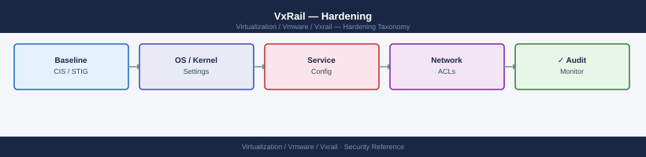

---
tags:
  - security
  - vmware
  - vxrail
description: "Hardening checklist and procedures for VxRail in the VMware product context. Covers VxRail Manager, iDRAC per-node, vSphere/ESXi, network hardening, and..."
---
# VxRail — Hardening

<div class="kb-summary">
Hardening checklist and procedures for VxRail in the VMware product context. Covers VxRail Manager, iDRAC per-node, vSphere/ESXi, network hardening, and SupportAssist security considerations.

*Applies to: VxRail 7.x / 8.x*
</div>


---

## Before you begin

- **Access:** vCenter Administrator role
- **Change management:** security changes require CAB approval in most environments
- **Rollback plan:** document current state before any security control change
- **Testing:** validate in a non-production environment first where possible

---

## VxRail Manager Hardening

### Checklist

- [ ] `mystic` default password changed; stored in secrets vault
- [ ] LDAP configured against AD; AD groups mapped to VxRail Manager roles
- [ ] VxRail Manager API access (port 443) restricted to admin jump hosts at network layer
- [ ] SSH access to VxRail Manager VM (port 22) restricted to admin jump hosts
- [ ] VxRail Manager VM backed up with Veeam or equivalent (not just snapshot); daily, retained 14 days
- [ ] TLS certificate replaced with CA-signed certificate (not self-signed)
- [ ] `mystic` account restricted to break-glass use only after LDAP is operational

### Step-by-Step Procedure

**1 — Change the mystic password**

```bash
# Change mystic password via VxRail Manager API
curl -sk \
  -X PUT \
  -H "Authorization: Basic $(echo -n 'mystic:CurrentPassword1!' | base64)" \
  -H "Content-Type: application/json" \
  -d '{"password": "NewVaultedPassword1!"}' \
  "https://<vxrail-manager-ip>/rest/vxm/v1/system/user/password"
```


```text title="Expected output"
{
  "request_id": "550e8400-e29b-41d4-a716-446655440000",
  "status": "success",
  "message": "Password updated successfully",
  "user": "mystic",
  "timestamp": "2024-01-15T14:32:47.123Z",
  "password_expires_in_days": 90
}
```

!!! warning "Common errors"
    | Error | Fix |
    |---|---|
    | `curl: (60) SSL certificate problem: self signed certificate` | Add the `-k` flag to skip SSL verification, or import the VxRail Manager's CA certificate into your system trust store. |
    | `{"error": "401 Unauthorized", "message": "Invalid credentials"}` | Verify the current mystic password is correct and base64-encoded properly by testing `echo -n 'mystic:CurrentPassword1!' | base64`. |
    | `{"error": "400 Bad Request", "message": "Password does not meet complexity requirements"}` | Ensure the new password meets VxRail's policy (minimum 8 characters, uppercase, lowercase, number, and special character). |
Store the new password in the vault immediately. Document the vault path in the VxRail runbook.

**2 — Configure LDAP**

VxRail Plugin → Settings → LDAP Configuration → Enable LDAP → Enter server, base DN, bind account details, and role group mappings. Refer to the [Authentication](../authentication/) page for the full LDAP configuration reference.

**3 — Restrict API access at network layer**

On the management network firewall or switch ACL:

```bash
# Permit VxRail Manager API access from jump host subnet only
# Source: 10.0.200.0/24 (admin jump hosts)
# Destination: <vxrail-manager-ip>, port 443
# Action: PERMIT
# All other sources to port 443 on VxRail Manager: DENY
```

**4 — Restrict SSH access**

On the management network firewall:

```bash
# Permit SSH to VxRail Manager VM from jump host subnet only
# Source: 10.0.200.0/24
# Destination: <vxrail-manager-ip>, port 22
# Action: PERMIT
# All other sources to port 22: DENY
```

**5 — Configure VM backup**

Add the VxRail Manager VM to the Veeam backup job (or equivalent tool). Do not use vSAN snapshots as the primary backup method — snapshots degrade vSAN performance if left active and are not a substitute for off-cluster backup.

---

## iDRAC Hardening (Per Node)

Apply the following steps to every node in the VxRail cluster. Document completion per node in the build record.

### Checklist

- [ ] Default `root`/`Calvin` credentials changed; unique per-node password in vault
- [ ] iDRAC IP reachable only from OOB management VLAN — not from VM subnets or internet
- [ ] iDRAC LDAP configured for centralised authentication via AD
- [ ] iDRAC firmware current (managed automatically via VxRail LCM bundles)
- [ ] iDRAC Secure Boot enabled and verified via RACADM
- [ ] iDRAC HTTPS enforced; HTTP and Telnet disabled
- [ ] iDRAC SSL certificate replaced with CA-signed certificate

### Step-by-Step Procedure

**1 — Change root credentials (per node)**

```bash
# Change default root/Calvin credentials on iDRAC
racadm set iDRAC.Users.2.Password "UniqueNodePassword1!"

# Verify the username is root (user slot 2 on Dell iDRAC)
racadm get iDRAC.Users.2.UserName
# Expected: UserName=root
```


```text title="Expected output"
[IPMI_SEL.Initialization] Initialized
[IPMI_SEL.Initialization] IPMI SDR cache loading...
[IPMI_SEL.Initialization] IPMI SDR cache loaded successfully
Set successful: iDRAC.Users.2.Password
UserName=root
```

!!! warning "Common errors"
    | Error | Fix |
    |---|---|
    | `RACADM.1.1.5254.0 : IPMI command failed with error: Unable to establish IPMI v1.5 / IPMI v2.0 session` | Verify iDRAC is reachable via network and IPMI is enabled; check firewall rules on port 623. |
    | `RACADM.1.1.5254.0 : Access Denied` | Confirm you are running racadm with root/administrator privileges or use `sudo racadm` if executing remotely. |
Use a unique password for each node — do not reuse the same password across all iDRAC interfaces. Store each per-node credential in the vault under a path that includes the node hostname or iDRAC IP.

**2 — Verify OOB VLAN restriction**

```bash
# Verify iDRAC IP is in the OOB VLAN range
racadm get iDRAC.IPv4.Address

# Confirm no routing exists from VM subnets to the OOB VLAN
# (verify on the network layer — router/firewall ACLs)
```


```text title="Expected output"
iDRAC.IPv4.Address=192.168.1.42
```

!!! warning "Common errors"
    | Error | Fix |
    |---|---|
    | `DRAC_ERROR: DRAC/iLO is currently unavailable` | Ensure the iDRAC service is running with `systemctl status idrac` and verify network connectivity to the iDRAC IP address. |
    | `racadm: connect DRAC failed` | Confirm racadm is installed (`which racadm`), the iDRAC hostname/IP is reachable, and you have valid credentials configured in `~/.racadm` or via `-u`/`-p` flags. |
**3 — Configure iDRAC LDAP**

```bash
# Enable LDAP on iDRAC and map AD group to Administrator role
racadm set iDRAC.LDAP.Enable 1
racadm set iDRAC.LDAP.Server "ldap://dc01.example.local"
racadm set iDRAC.LDAP.BaseDN "DC=example,DC=local"
racadm set iDRAC.LDAP.BindDN "CN=svc-idrac,OU=ServiceAccounts,DC=example,DC=local"
racadm set iDRAC.LDAP.BindPassword "BindPassword1!"
racadm set iDRAC.LDAPRoleGroup.1.DN "CN=GRP-iDRAC-Admins,OU=VxRailGroups,DC=example,DC=local"
racadm set iDRAC.LDAPRoleGroup.1.Privilege 0x1FF
```


```text title="Expected output"
[RACADM] LDAP.Enable set successfully.
[RACADM] LDAP.Server set successfully.
[RACADM] LDAP.BaseDN set successfully.
[RACADM] LDAP.BindDN set successfully.
[RACADM] LDAP.BindPassword set successfully.
[RACADM] LDAPRoleGroup.1.DN set successfully.
[RACADM] LDAPRoleGroup.1.Privilege set successfully.
```

!!! warning "Common errors"
    | Error | Fix |
    |---|---|
    | `RACADM] Error: Unable to connect to LDAP server` | Verify the LDAP server hostname/IP is reachable and the LDAP service is running on port 389 (or 636 for LDAPS). |
    | `[RACADM] Error: Invalid credentials for bind DN` | Confirm the BindDN account exists in Active Directory and the BindPassword is correct and not expired. |
    | `[RACADM] Error: Group DN not found in directory` | Verify the group DN path exists in Active Directory and matches the exact case and distinguished name format. |
**4 — Verify iDRAC firmware currency**

iDRAC firmware is included in VxRail LCM bundles. Keeping the cluster on a current LCM version automatically keeps iDRAC firmware patched. Verify the current iDRAC firmware version:

```bash
racadm getversion -f idrac
# Compare against the expected version for the installed VxRail bundle
```


```text title="Expected output"
iDRAC Version: 5.10.20.00
Firmware Version: 5.10.20.00
Build: 2024.01.15
System Model: PowerEdge R750
System Manufacturer: Dell Inc.
BIOS Version: 2.16.2
```

!!! warning "Common errors"
    | Error | Fix |
    |---|---|
    | `RACADM0001: Unable to connect to iDRAC` | Verify iDRAC IP address is reachable and credentials are configured via `racadm config -g cfgIpmiLan -o cfgIpmiLanIpAddress <IP>`. |
    | `RACADM0213: IPMI is not initialized` | Restart the iDRAC service with `racadm racreset soft` or power-cycle the host to reinitialize IPMI. |
**5 — Verify Secure Boot**

```bash
# Check Secure Boot status
racadm get BIOS.SysProfileSettings.SecureBoot
# Expected: SecureBoot=Enabled

# If disabled, enable it (node will reboot to apply)
racadm set BIOS.SysProfileSettings.SecureBoot Enabled
racadm jobqueue create BIOS.Setup.1-1 -r pwrcycle -s TIME_NOW
```


```text title="Expected output"
BIOS.SysProfileSettings.SecureBoot=Enabled

(no output — command completes silently)
Job ID_123456789 is scheduled for execution.
```

!!! warning "Common errors"
    | Error | Fix |
    |---|---|
    | `BIOS.SysProfileSettings.SecureBoot=Disabled` | Run `racadm set BIOS.SysProfileSettings.SecureBoot Enabled` to enable Secure Boot before scheduling the reboot job. |
    | `ERROR: RACADM0387: The object specified does not exist or is not supported on this system` | Verify the iDRAC firmware is current and the system supports Secure Boot by checking `racadm get BIOS.SysProfileSettings` for available BIOS attributes. |
**6 — Enforce HTTPS, disable HTTP and Telnet**

```bash
# Disable HTTP, leave HTTPS on port 443
racadm set iDRAC.Webserver.HttpPort 0
racadm set iDRAC.Webserver.HttpsPort 443
racadm set iDRAC.Serial.Enable 0
```


```text title="Expected output"
(no output — command completes silently)
(no output — command completes silently)
(no output — command completes silently)
```

!!! warning "Common errors"
    | Error | Fix |
    |---|---|
    | `RACADM0211: Unable to set property. Property value is not valid.` | Verify the iDRAC firmware version supports HttpPort 0; some versions require explicit disabling via a separate flag instead of setting port to 0. |
    | `RACADM0212: IPMI Session limit exceeded` | Close existing iDRAC sessions or wait 5 minutes for session timeout before retrying the racadm commands. |
---

## vSphere/ESXi Hardening

### Checklist

- [ ] Normal Lockdown Mode enabled on all VxRail ESXi hosts
- [ ] SSH disabled on all hosts (`TSM-SSH` service stopped and startup type set to off)
- [ ] ESXi Shell disabled on all hosts (`TSM` service stopped and startup type set to off)
- [ ] Host profiles applied to all VxRail hosts and compliance check is green
- [ ] vSAN data-at-rest encryption enabled (required if data classification mandates it)
- [ ] vSAN in-transit encryption enabled
- [ ] vCenter file-based backup current (VAMI, daily schedule)
- [ ] NKP backup downloaded and stored in vault (if using Native Key Provider)
- [ ] vCenter administrator@vsphere.local password changed from default and vaulted
- [ ] AD identity source added to vCenter SSO; AD groups assigned vCenter roles

### Step-by-Step Procedure

**1 — Enable Normal Lockdown on all hosts**

```powershell
# Enable Normal Lockdown on all VxRail cluster hosts (PowerCLI)
Get-Cluster "VxRail-Cluster" | Get-VMHost | ForEach-Object {
    $_.ExtensionData.EnterLockdownMode()
    Write-Host "Lockdown enabled: $($_.Name)"
}
```

**2 — Disable SSH and ESXi Shell**

```powershell
# Stop and disable SSH and ESXi Shell on all VxRail hosts (PowerCLI)
Get-Cluster "VxRail-Cluster" | Get-VMHost | ForEach-Object {
    $vmhost = $_
    Get-VMHostService -VMHost $vmhost | Where-Object { $_.Key -in "TSM-SSH","TSM" } |
        ForEach-Object {
            Stop-VMHostService -HostService $_ -Confirm:$false
            Set-VMHostService -HostService $_ -Policy Off
            Write-Host "Service $($_.Key) stopped and disabled on $($vmhost.Name)"
        }
}
```

**3 — Apply host profiles**

Create a reference host profile from a known-good VxRail host:

**vCenter → Policy and Profiles → Host Profiles → Extract Host Profile → Select reference host**

Apply the profile to all VxRail hosts:

```powershell
# Apply host profile to all VxRail hosts and check compliance (PowerCLI)
$profile = Get-VMHostProfile -Name "VxRail-Baseline"

Get-Cluster "VxRail-Cluster" | Get-VMHost | ForEach-Object {
    Apply-VMHostProfile -Entity $_ -Profile $profile -Confirm:$false
}

# Check compliance for all hosts
Get-Cluster "VxRail-Cluster" | Get-VMHost | Test-VMHostProfileCompliance |
    Select-Object VMHost, ComplianceStatus, @{N="Issues"; E={$_.IncomplianceElementList.Count}}
```

**4 — Enable vSAN encryption**

Refer to the [Encryption](../encryption/) page for the full vSAN at-rest and in-transit encryption procedures, including the pre-enable checklist and rebuild warning.

**5 — Configure vCenter backup**

**vCenter VAMI (port 5480) → Backup → Configure → Schedule**

```yaml
Protocol: SFTP
Backup location: sftp://backup.example.local/vcentre/
Username: svc-vcenter-backup
Frequency: Daily
Retain: 14 backups
Encrypt backup: Yes (set a password stored in vault)
```

---

## Network Hardening

### Checklist

- [ ] Management VLAN segregated from VM data VLANs (separate VLANs, no routing between them)
- [ ] vSAN VMkernel VLAN not reachable from VM subnets or application networks
- [ ] iDRAC on dedicated OOB VLAN — not routable from VM subnets or internet
- [ ] vCenter VAMI port 5480 restricted to admin subnets at firewall
- [ ] NSX Distributed Firewall rules applied if NSX is deployed on the VxRail cluster
- [ ] vMotion VLAN not reachable from VM subnets (vMotion traffic is unencrypted unless vSphere 7.0+)
- [ ] No split tunnelling on admin VPN that would allow routing from user devices to vSAN or iDRAC VLANs

### VLAN Segregation Architecture

The following VLANs must be present and isolated in a correctly hardened VxRail deployment:

| VLAN | Purpose | Routable from VM subnets? | Internet access? |
|---|---|---|---|
| Management | ESXi VMkernel mgmt, vCenter, VxRail Manager | No | No |
| vSAN | vSAN replication traffic between nodes | No | No |
| vMotion | VM live migration traffic | No | No |
| OOB (iDRAC) | iDRAC management interfaces, OOB only | No | No |
| VM Networks | Guest VM traffic — application workloads | N/A | As required |

**Verify VLAN isolation on the vDS:**

```powershell
# List all port groups and their VLAN IDs on the VxRail vDS (PowerCLI)
Get-VDSwitch | Get-VDPortgroup |
    Select-Object Name, VlanConfiguration, @{N="Ports"; E={$_.NumPorts}} |
    Sort-Object Name
```

Confirm no VM port group has the same VLAN ID as the management, vSAN, vMotion, or OOB VLANs.

### NSX Distributed Firewall Rules (if NSX deployed)

If NSX is deployed on the VxRail cluster, apply DFW rules to enforce micro-segmentation between workload tiers. At minimum, apply the following rules to the VxRail management VMs:

| Rule | Source | Destination | Port | Action |
|---|---|---|---|---|
| Allow VxRail Mgr API from jump hosts | Jump host SG | VxRail Manager SG | 443 | Allow |
| Allow vCenter from admin | Admin SG | vCenter SG | 443, 902 | Allow |
| Block inter-VM traffic to management | Any | VxRail Manager SG | Any | Drop |
| Block VM access to iDRAC VLAN | VM SG | OOB SG | Any | Drop |

Apply DFW rules as NSX Security Groups scoped to the relevant VMs — do not use IP-based rules that can be bypassed by changing a VM's IP address.

---

## SupportAssist Security Considerations

Dell SupportAssist provides proactive monitoring and automated case creation for VxRail hardware faults. When enabled, iDRAC sends hardware telemetry to Dell's cloud for proactive support.

### Security Profile

| Aspect | Detail |
|---|---|
| Connection direction | Outbound only from iDRAC to Dell cloud — no inbound connections required |
| Transport | TLS 1.2+ encrypted; Dell uses certificate pinning |
| Data sent | Hardware health telemetry: temperatures, fan speeds, power, disk SMART data |
| Data NOT sent | VM names, application data, guest OS data, user data |
| Dell access | Dell support staff can view hardware telemetry; no remote access to ESXi or VMs |

### Configuration

**Enable SupportAssist:** VxRail Plugin → Support → SupportAssist → Enable

```bash
# Check SupportAssist status via VxRail Manager API
curl -sk \
  -H "Authorization: Basic $(echo -n 'mystic:password' | base64)" \
  "https://<vxrail-manager-ip>/rest/vxm/v1/support-assist/status"
```


```text title="Expected output"
{
  "status": "ENABLED",
  "last_contact": "2024-01-15T14:32:18Z",
  "next_contact": "2024-01-16T02:32:18Z",
  "contact_method": "HTTPS",
  "proxy_configured": false,
  "certificate_validation": true,
  "support_account": "ACC-VXR-789456",
  "data_collection_enabled": true,
  "last_collection": "2024-01-15T12:00:00Z",
  "collection_interval_hours": 24,
  "remote_support_enabled": true,
  "alert_notifications": "ENABLED"
}
```

!!! warning "Common errors"
    | Error | Fix |
    |---|---|
    | `curl: (60) SSL certificate problem: self signed certificate` | Add `-k` flag to skip certificate verification, or import the VxRail Manager's CA certificate into your system trust store. |
    | `{"error": "Unauthorized", "code": 401}` | Verify the base64-encoded credentials are correct by running `echo -n 'username:password' | base64` and comparing the output to your Authorization header. |
    | `curl: (7) Failed to connect to <vxrail-manager-ip> port 443: Connection refused` | Confirm the VxRail Manager IP address is correct and the HTTPS service is running with `curl -v https://<vxrail-manager-ip>:443`. |
### Hardening Actions

- [ ] Review the data sharing scope in VxRail Plugin → Support → SupportAssist → Data Privacy settings before enabling
- [ ] Confirm data sharing is limited to hardware health only — disable application-level data collection if present
- [ ] For regulated environments (PCI-DSS, HIPAA): obtain written approval from compliance team before enabling; document the data types shared and Dell's data handling commitments
- [ ] Verify SupportAssist traffic only routes to Dell's known cloud endpoints — check firewall logs after enabling to confirm no unexpected outbound connections
- [ ] Confirm iDRAC firmware is current before enabling SupportAssist — older iDRAC firmware versions have had vulnerabilities in the SupportAssist agent

### Regulated Environments (PCI, HIPAA)

In regulated environments, SupportAssist telemetry may need to be reviewed against compliance requirements before enabling. Key questions:

1. Does the telemetry include any data that could be classified as cardholder data or protected health information? (Answer: No — hardware telemetry only. Confirm with Dell's data handling documentation.)
2. Does enabling SupportAssist constitute a third-party data sharing agreement that requires DPA execution with Dell? (Check with your compliance officer.)
3. Can SupportAssist be scoped to specific clusters or nodes to avoid telemetry from systems storing regulated data?

If SupportAssist cannot be approved for regulated clusters, disable it on those clusters and rely on VxRail Manager's proactive health monitoring and manual support case creation for hardware issues.

## See also

- [VxRail — Access Control](../access-control/)
- [VxRail — Authentication](../authentication/)
- [VxRail — Health Checks](../../operations/health-checks/)
