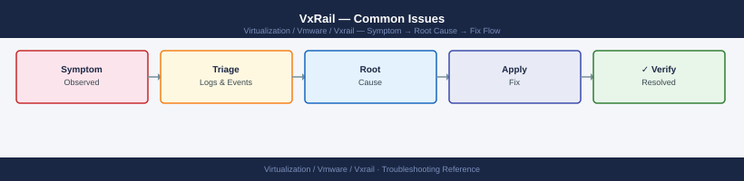

---
tags:
  - troubleshooting
  - vmware
  - vxrail
search:
  boost: 1.5
description: "Concrete troubleshooting steps for the most frequent VxRail operational problems: plugin unavailability, LCM upgrade failures, vSAN health degradation..."
---
# VxRail — Common Issues

<div class="kb-summary">
Concrete troubleshooting steps for the most frequent VxRail operational problems: plugin unavailability, LCM upgrade failures, vSAN health degradation, node offline conditions, and hardware alarms.

*Applies to: VxRail 7.x / 8.x*
</div>


---

```d2
direction: down

symptom: Identify Symptom {shape: diamond}
diagnostic_flow: "Diagnostic Flow" {shape: rectangle}
vxrail_plugin_unavailable_in_vcenter: "VxRail Plugin Unavailable in vCenter" {shape: rectangle}
lcm_precheck_failures: "LCM Pre-Check Failures" {shape: rectangle}
lcm_upgrade_stuck_or_failed: "LCM Upgrade Stuck or Failed" {shape: rectangle}
vsan_health_check_failures: "vSAN Health Check Failures" {shape: rectangle}
vsan_degraded_and_absent_objects: "vSAN Degraded and Absent Objects" {shape: rectangle}
resolution: Resolve or Escalate {shape: oval}

symptom -> diagnostic_flow: investigate
symptom -> vxrail_plugin_unavailable_in_vcenter: investigate
symptom -> lcm_precheck_failures: investigate
symptom -> lcm_upgrade_stuck_or_failed: investigate
symptom -> vsan_health_check_failures: investigate
symptom -> vsan_degraded_and_absent_objects: investigate
diagnostic_flow -> resolution
vxrail_plugin_unavailable_in_vcenter -> resolution
lcm_precheck_failures -> resolution
lcm_upgrade_stuck_or_failed -> resolution
vsan_health_check_failures -> resolution
vsan_degraded_and_absent_objects -> resolution
```

## Diagnostic Flow

```d2
direction: right

S: "What is the symptom?" {shape: rectangle}
B1: "VxRail plugin unavailable in vCenter" {shape: rectangle}
B2: "LCM pre-check failure" {shape: rectangle}
B3: "LCM upgrade stuck or failed" {shape: rectangle}
B4: "vSAN health check failure" {shape: rectangle}
B5: "Node offline in VxRail plugin" {shape: rectangle}
B6: "Hardware alarm on node" {shape: rectangle}
D1: "D1" {shape: rectangle}
R1: "Restart Mystic Service\n→ VxRail Plugin Unavailable in vCenter" {shape: rectangle}
R2: "Re-register Plugin via API\n→ VxRail Plugin Unavailable in vCenter" {shape: rectangle}
R3: "Resolve Failing Check\n→ LCM Pre-Check Failures" {shape: rectangle}
D2: "D2" {shape: rectangle}
R4: "Fix Root Cause · Resume LCM\n→ LCM Upgrade Stuck or Failed" {shape: rectangle}
R5: "Open Dell Support Case\n→ LCM Upgrade Stuck or Failed" {shape: rectangle}
R6: "Match Health Check to Resolution Table\n→ vSAN Health Check Failures" {shape: rectangle}
D3: "D3" {shape: rectangle}
R7: "Check OOB Network · Power State\n→ Node Offline in VxRail Plugin" {shape: rectangle}
R8: "Check ESXi mgmt · VxRail API\n→ Node Offline in VxRail Plugin" {shape: rectangle}
R9: "Read iDRAC SEL · Check vCenter HW View\n→ Node Hardware Alarm" {shape: rectangle}

S -> B1
S -> B2
S -> B3
S -> B4
S -> B5
S -> B6
D1 -> R1
D1 -> R2
B2 -> R3
D2 -> R4
D2 -> R5
B4 -> R6
D3 -> R7
D3 -> R8
B6 -> R9
```

---

## Before you begin

- **Access:** SSH to vCenter Shell and ESXi hosts; vSphere Client read access
- **Gather first:** recent error message text, event timestamps, and affected object names
- **Scope:** confirm whether the issue affects a single object, host, cluster, or site
- **Escalation:** open a vendor support ticket before running any destructive step
- **Logging:** document each command and output — required if escalation is needed

---

## VxRail Plugin Unavailable in vCenter

### Symptoms

- vCenter shows "VxRail" plugin as unavailable or grayed out
- VxRail tab in vCenter is missing or fails to load
- VxRail Manager UI is inaccessible at `https://<vxrail-manager-ip>`

### Triage Sequence

**Step 1 — Confirm VxRail Manager VM is powered on**

In vCenter, locate the VxRail Manager VM (usually named `VxRail-Manager` or `vxm`). Verify it is powered on and the guest OS is responsive (open console).

**Step 2 — Restart the Mystic service**

```bash
# SSH to VxRail Manager
ssh mystic@<vxrail-manager-ip>

# Check service status
sudo systemctl status mystic

# Restart the Mystic service
sudo systemctl restart mystic

# Confirm service returned to running state
sudo systemctl status mystic
```


```text title="Expected output"
mystic@vxrail-manager-01:~$ sudo systemctl status mystic
● mystic.service - VxRail Mystic Manager Service
     Loaded: loaded (/etc/systemd/system/mystic.service; enabled; vendor preset: enabled)
     Active: active (running) since Wed 2024-01-17 14:32:18 UTC; 2h 45min ago
       Docs: man:mystic(8)
   Main PID: 8742 (mystic)
      Tasks: 24 (limit: 4915)
     Memory: 512.3M
     CGroup: /system.slice/mystic.service
             └─8742 /opt/mystic/bin/mystic-manager --config=/etc/mystic/mystic.conf

Jan 17 14:32:18 vxrail-manager-01 systemd[1]: Started VxRail Mystic Manager Service.

mystic@vxrail-manager-01:~$ sudo systemctl restart mystic
(no output — command completes silently)

mystic@vxrail-manager-01:~$ sudo systemctl status mystic
● mystic.service - VxRail Mystic Manager Service
     Loaded: loaded (/etc/systemd/system/mystic.service; enabled; vendor preset: enabled)
     Active: active (running) since Wed 2024-01-17 14:35:02 UTC; 3s ago
       Docs: man:mystic(8)
   Main PID: 9156 (mystic)
      Tasks: 22 (limit: 4915)
     Memory: 287.1M
     CGroup: /system.slice/mystic.service
             └─9156 /opt/mystic/bin/mystic-manager --config=/etc/mystic/mystic.conf

Jan 17 14:35:02 vxrail-manager-01 systemd[1]: Started VxRail Mystic Manager Service.
```

!!! warning "Common errors"
    **`sudo: command not found`** — Verify the user has sudo privileges or contact your VxRail administrator to add the account to the sudoers file.
    **`Unit mystic.service not found.`** — Confirm the Mystic service is installed by running `systemctl list-unit-files | grep mystic` and reinstall if necessary.
    **`Active: failed (Result: exit-code) since...`** — Check service logs with `sudo journalctl -u mystic -n 50` to identify the root cause of the failure.
Allow 2–3 minutes for the service to fully initialise before rechecking the plugin in vCenter.

**Step 3 — Check plugin registration in vCenter**

```bash
# From VxRail Manager, trigger plugin re-registration
curl -sk -X POST \
  -H "Authorization: Basic $(echo -n 'mystic:password' | base64)" \
  -H "Content-Type: application/json" \
  "https://localhost/rest/vxm/v1/plugin/register"
```


```text title="Expected output"
{
  "request_id": "req-7f3a2c91-4d8e-11ed-bdc3-005056a6c4d8",
  "status": "PENDING",
  "message": "Plugin re-registration initiated",
  "timestamp": "2024-01-15T09:47:22.341Z",
  "plugin_version": "8.0.1.12345",
  "manager_version": "7.0.510"
}
```

!!! warning "Common errors"
    **`curl: (60) SSL certificate problem: self signed certificate`** — Add `-k` flag to skip certificate verification (already present in example, but ensure it's not removed).
    **`curl: (7) Failed to connect to localhost port 443: Connection refused`** — Verify VxRail Manager service is running with `systemctl status vxrail-manager` and accessible on the management network.
    **`{"error": "Unauthorized", "code": 401}`** — Ensure credentials are correct and base64-encoded properly; test with `echo -n 'mystic:password' | base64` to verify encoding.
Then log out of vCenter and log back in — browser-cached plugin state is refreshed on session start.

**Step 4 — Verify vCenter extension is registered**

In vCenter: **Administration → Client Plug-ins** — confirm the VxRail plugin is listed and status shows `Deployed`. If it shows `Failed` or is absent, re-run the registration call above and restart the vCenter UI service if needed.

### Common Causes

| Cause | Resolution |
|---|---|
| VxRail Manager VM rebooted after patching | Wait for Mystic service to fully start; check systemctl status |
| Mystic service crashed | Restart via systemctl; check mystic.log for crash cause |
| vCenter plugin cache stale | Log out and back in to vCenter; clear browser cache |
| vCenter credentials changed in VxRail Mgr | Update vCenter credentials under VxRail Plugin → System → vCenter |
| VxRail Manager IP changed | Re-register plugin pointing to new IP |

---

## LCM Pre-Check Failures

LCM (Lifecycle Manager) runs a pre-check validation before every upgrade. All checks must pass before the upgrade proceeds.

### Pre-Check Failure Resolution Table

| Pre-Check Failure | Root Cause | Resolution |
|---|---|---|
| vSAN health not green | One or more vSAN health checks are failing | Resolve all vSAN health issues; rerun pre-check |
| vSAN resync active | vSAN is currently rebuilding objects between nodes | Wait for resync to complete (`esxcli vsan debug resync list`); rerun pre-check |
| Node unreachable | LCM cannot reach a node's ESXi management or iDRAC IP | Ping the node from VxRail Manager; restore network connectivity |
| Bundle compatibility | Upgrade bundle does not match current cluster version | Download the correct bundle for your VxRail version from dell.com/support |
| vCenter credentials invalid | The vCenter credentials stored in VxRail Manager have expired | Update credentials: VxRail Plugin → System → vCenter Credentials |
| DRS not Fully Automated | LCM needs DRS to migrate VMs during maintenance mode entry | Set DRS to Fully Automated on the cluster before retrying |
| Time skew detected | NTP mismatch between VxRail Manager and vCenter/ESXi hosts | Sync all components to the same NTP source |
| Insufficient disk capacity | vSAN does not have enough free capacity for the upgrade | Add storage or remove unnecessary data before retrying |

### Checking Pre-Check Status via API

```bash
# SSH to VxRail Manager and query current LCM pre-check results
curl -sk \
  -H "Authorization: Basic $(echo -n 'mystic:password' | base64)" \
  "https://localhost/rest/vxm/v1/lcm/upgrade/plan" | python3 -m json.tool
```


```text title="Expected output"
{
  "id": "lcm-plan-20240115-4a7f9c2e",
  "status": "PRE_CHECK_RUNNING",
  "currentStep": 3,
  "totalSteps": 8,
  "preCheckResults": [
    {
      "checkName": "Disk Space Validation",
      "status": "PASSED",
      "details": "Available space: 847.2 GB"
    },
    {
      "checkName": "Network Connectivity",
      "status": "PASSED",
      "details": "All nodes reachable"
    },
    {
      "checkName": "vSAN Health",
      "status": "WARNING",
      "details": "1 disk in degraded state on node-03"
    },
    {
      "checkName": "License Compliance",
      "status": "PASSED",
      "details": "Valid licenses detected"
    },
    {
      "checkName": "Snapshot Count",
      "status": "PASSED",
      "details": "0 snapshots found"
    }
  ],
  "estimatedDuration": "45 minutes",
  "nextScheduledCheck": "2024-01-15T14:30:00Z"
}
```

!!! warning "Common errors"
    **`curl: (60) SSL certificate problem: self signed certificate`** — Add `-k` flag to skip certificate verification (already present in example; if error persists, verify VxRail Manager hostname matches certificate CN).
    **`curl: (7) Failed to connect to localhost port 443: Connection refused`** — Ensure VxRail Manager API service is running with `systemctl status vxrail-api` and verify you are connecting from the correct host or use the VxRail Manager IP address instead of localhost.
    **`jq: parse error: Invalid JSON at line 1`** — Verify the API endpoint is correct and the VxRail Manager version supports `/rest/vxm/v1/lcm/upgrade/plan`; older versions may use a different endpoint path.
### Verifying vSAN Resync Completion

```bash
# SSH to any ESXi node in the cluster
# Show active resync objects (empty output = resync complete)
esxcli vsan debug resync list

# Show resync bytes remaining
esxcli vsan debug resync summary
```


```text title="Expected output"
UUID                                  Reason                  ObjUUID
------------------------------------  ----------------------  ------------------------------------
(no objects listed)

Resync Summary
==============
Resync Completes: 100%
Bytes Remaining: 0 B
Objects Remaining: 0
Estimated Time: 0 seconds
```

!!! warning "Common errors"
    **`Unknown command or namespace vsan debug resync`** — Verify VSAN is enabled on the cluster and you are running the command on an ESXi host with VSAN participation; run `esxcli vsan cluster get` to confirm VSAN status.
    
    **`Permission denied`** — Ensure you are logged in as root or a user with administrative privileges on the ESXi host.
Wait until resync bytes reach zero before retrying the LCM pre-check.

---

## LCM Upgrade Stuck or Failed

### Log Check Commands

```bash
# SSH to VxRail Manager
ssh mystic@<vxrail-manager-ip>

# Tail the LCM log for errors
sudo tail -200 /var/log/mystic/lcm.log | grep -i "error\|fail\|exception\|timeout"

# Check LCM upgrade status via API
curl -sk \
  -H "Authorization: Basic $(echo -n 'mystic:password' | base64)" \
  "https://localhost/rest/vxm/v1/lcm/upgrade" | python3 -m json.tool

# Check VxRail Manager main log for related events
sudo tail -200 /var/log/mystic/mystic.log | grep -i "lcm\|upgrade\|error"
```


```text title="Expected output"
Last login: Wed Mar 15 10:42:33 2024 from 192.168.1.50
mystic@vxrail-manager-01:~$
2024-03-15 09:47:22 ERROR [LCM-Worker-12] Upgrade validation failed: Insufficient disk space on node-03
2024-03-15 09:48:15 EXCEPTION [LCM-Scheduler] Timeout waiting for node-02 health check (30s exceeded)
2024-03-15 09:49:01 FAIL [LCM-Precheck] ESXi version mismatch detected on node-01: expected 7.0.3, found 7.0.2
{
  "status": "FAILED",
  "currentStep": "PreUpgradeValidation",
  "progress": 15,
  "errorMessage": "Insufficient disk space detected on 1 node(s)",
  "estimatedTimeRemaining": 0,
  "nodes": [
    {
      "id": "node-03",
      "status": "FAILED",
      "diskUsage": "94%"
    }
  ]
}
2024-03-15 09:45:33 INFO [VxM-Main] LCM upgrade initiated by user admin
2024-03-15 09:47:22 ERROR [VxM-LCM] Precheck validation error: node-03 disk space critical
2024-03-15 09:48:15 ERROR [VxM-Health] Node node-02 failed to respond to health probe
2024-03-15 09:49:01 WARN [VxM-Upgrade] Rolling back LCM upgrade due to validation failures
```

!!! warning "Common errors"
    **`curl: (60) SSL certificate problem: self signed certificate`** — Add the `-k` flag to skip certificate verification (already present in the example, but ensure it's included if removed).
    **`sudo: no tty present and no -S option specified`** — Run `ssh -t mystic@<vxrail-manager-ip>` to allocate a pseudo-terminal for sudo commands.
    **`jq: command not found`** — Replace `python3 -m json.tool` with `jq '.'` or ensure Python 3 is installed on the VxRail Manager.
### LCM Failure Points Table

| Failure Stage | Likely Cause | Resolution |
|---|---|---|
| Stuck at pre-check | Pre-check item not resolved | Resolve the failing check (see table above); resume upgrade |
| Node firmware update fails | iDRAC connectivity lost mid-upgrade | Ping iDRAC IP; restart iDRAC via racadm; retry via Resume |
| ESXi VIB install fails | VIB acceptance level mismatch | Run `esxcli software acceptance get` on the affected node; set to `CommunitySupported` if needed |
| vCenter VCSA upgrade fails | VAMI port 5480 unreachable | Verify vCenter VAMI is accessible; check vCenter VM console |
| Upgrade hangs at maintenance mode | DRS not migrating VMs | Confirm DRS is Fully Automated; check for affinity rules blocking VM migration |
| Upgrade hangs at firmware stage | Firmware bundle mismatch | Check iDRAC firmware version; review lcm.log for bundle validation errors |
| Upgrade reports success but node unhealthy | Post-upgrade health check failed | Check node health in VxRail Plugin; review vmkernel.log on the affected node |

### Resume a Failed LCM Upgrade

Most LCM failures can be recovered without starting over:

1. Identify and resolve the root cause from lcm.log
2. In vCenter, navigate to: **VxRail Plugin → LCM → Resume Upgrade**
3. Confirm the pre-checks pass before proceeding

If Resume is not available or fails repeatedly, do not attempt to manually upgrade ESXi or firmware on individual VxRail nodes — this risks putting the cluster into an unsupported mixed-version state. Open a Dell support case instead.

---

## vSAN Health Check Failures

### Health Check Resolution Table

| Health Check | Failure Meaning | Resolution |
|---|---|---|
| vSAN Build Recommendation | Component versions don't match across nodes | Run LCM upgrade to bring all nodes to the same version |
| Disk Balance | Disks heavily unbalanced across disk groups | Trigger vSAN rebalance: **vSAN → Rebalance** in vCenter |
| MTU Check (Jumbo Frames) | Jumbo frames not end-to-end on vSAN network | Verify physical switch MTU 9000 on all vSAN-facing ports; see MTU section below |
| vSAN Network Connectivity | Node cannot reach peers on vSAN vmkernel network | Check vSAN vmkernel IP; verify VLAN and routing |
| Capacity — Space Utilisation > 70% | Cluster filling up | Add nodes, reduce VM footprint, or remove snapshots; see Capacity section below |
| Component State (Degraded/Absent) | One or more components offline | Check disk health; replace failed disk; restore offline node |
| Performance Service | vSAN performance service not enabled | Enable performance service: **vSAN → Services → Performance Service** |
| Time Synchronisation | NTP skew between nodes | Sync all ESXi hosts and VxRail Manager to the same NTP source |

### vSAN MTU Failure — vmkping Test

```bash
# SSH to an ESXi node in the cluster
# Test jumbo frames to a peer node's vSAN vmkernel IP
# -d = don't fragment, -s 8972 = maximum payload for 9000-byte MTU frame
vmkping -I vmk2 -d -s 8972 <remote-node-vsan-vmkernel-ip>

# If the ping fails with "Message too long": switch port MTU is not 9000
# If the ping fails with "Destination host unreachable": routing or VLAN issue

# Verify vSAN vmkernel interface assignment
esxcli network ip interface list | grep vmk

# Test connectivity to all peer nodes
vmkping -I vmk2 <node2-vsan-vmk-ip>
vmkping -I vmk2 <node3-vsan-vmk-ip>
vmkping -I vmk2 <node4-vsan-vmk-ip>
```


```text title="Expected output"
PING 172.16.10.52 (172.16.10.52): 56 data bytes
64 bytes from 172.16.10.52: icmp_seq=0 time=0.421 ms
64 bytes from 172.16.10.52: icmp_seq=1 time=0.398 ms
64 bytes from 172.16.10.52: icmp_seq=2 time=0.412 ms
64 bytes from 172.16.10.52: icmp_seq=3 time=0.405 ms
--- 172.16.10.52 statistics ---
4 packets transmitted, 4 packets received, 0% packet loss

Name    Port  Portgroup        IP Address      Netstack
vmk0    0     Management       10.0.1.45       defaultTcpipStack
vmk1    0     vMotion          10.0.2.45       defaultTcpipStack
vmk2    0     vSAN             172.16.10.45    vSanTcpipStack

PING 172.16.10.52 (172.16.10.52): 56 data bytes
64 bytes from 172.16.10.52: icmp_seq=0 time=0.419 ms
64 bytes from 172.16.10.52: icmp_seq=1 time=0.403 ms
--- 172.16.10.52 statistics ---
2 packets transmitted, 2 packets received, 0% packet loss

PING 172.16.10.53 (172.16.10.53): 56 data bytes
64 bytes from 172.16.10.53: icmp_seq=0 time=0.428 ms
64 bytes from 172.16.10.53: icmp_seq=1 time=0.403 ms
--- 172.16.10.53 statistics ---
2 packets transmitted, 2 packets received, 0% packet loss

PING 172.16.10.54 (172.16.10.54): 56 data bytes
64 bytes from 172.16.10.54: icmp_seq=0 time=0.441 ms
64 bytes from 172.16.10.54: icmp_seq=1 time=0.415 ms
--- 172.16.10.54 statistics ---
2 packets transmitted, 2 packets received, 0% packet loss
```

!!! warning "Common errors"
    **`Message too long; Possible MTU mismatch`** — Verify the switch port connected to the vSAN vmkernel interface is configured with MTU 9000 and confirm the ESXi vmk2 interface MTU matches with `esxcli network ip interface get -i vmk2`.
    **`Destination host unreachable`** — Check VLAN routing between the source and destination vSAN subnets, verify the VLAN ID is consistent on both ESXi nodes, and confirm the switch port is tagged for the vSAN VLAN.
**Switch port verification:** On the physical ToR switch, confirm that the ports connected to the vSAN uplinks have `mtu 9000` (or equivalent for the switch vendor). Both the switch port and the ESXi vmkernel MTU must be set to 9000.

### vSAN Network Connectivity Test

```bash
# Run the built-in vSAN network test tool
esxcli vsan debug network test

# Verify vmkernel tags — vmk2 must have vSAN traffic type
esxcli vsan network list
```


```text title="Expected output"
vSAN Network Test Results:
  Test ID: vsan-net-001
  Status: PASS
  Latency (avg): 2.34ms
  Packet Loss: 0.00%
  Throughput: 9850 Mbps
  Nodes Tested: 4
  Duration: 45 seconds

vSAN Network Configuration:
  vmk0: Management (enabled)
  vmk1: vMotion (enabled)
  vmk2: vSAN (enabled) — MTU 9000
  vmk3: Witness (enabled)
  
Network Interfaces:
  vmnic0: Up — vSAN traffic
  vmnic1: Up — vSAN traffic
  vmnic2: Up — Management traffic
```

!!! warning "Common errors"
    **`vSAN network test failed: No active vSAN cluster detected`** — Verify the cluster is initialized with `esxcli vsan cluster get` and all nodes are joined.
    **`vmk2 does not have vSAN traffic type enabled`** — Add vSAN traffic type to vmk2 using `esxcli vsan network ip add -i vmk2`.
---

## vSAN Degraded and Absent Objects

### Degraded vs Absent — Key Distinction

| State | Meaning | VM Impact | Action |
|---|---|---|---|
| Degraded | Object has fewer copies than FTT policy; still accessible | VM running, reduced redundancy | Monitor resync; fix disk/node |
| Absent | Object component is completely offline | VM may be inaccessible or paused | Return node/disk to service immediately |

### Monitoring Resync Progress

```bash
# SSH to any ESXi node in the cluster
# List objects currently resyncing
esxcli vsan debug resync list

# Show total bytes remaining in resync
esxcli vsan debug resync summary

# Check vSAN object health in detail
esxcli vsan debug object list | grep -i "degraded\|absent"
```


```text title="Expected output"
UUID                                  Reason                Objects
52e4c8f1-2d3e-4a9b-8c1f-7a9e2b3c4d5e  Resyncing             1
7f9e2b3c-4d5e-6a7f-8b9c-0d1e2f3a4b5c  Resyncing             3
9c0d1e2f-3a4b-5c6d-7e8f-9a0b1c2d3e4f  Resyncing             2

Total bytes remaining: 847.23 GB
Estimated time remaining: 2h 14m
Resync rate: 104.5 MB/s

UUID                                  Health      Reason
2a1b0c9d-8e7f-6a5b-4c3d-2e1f-0a9b8c7d  degraded    Absent component
5f4e3d2c-1b0a-9f8e-7d6c-5b4a-3f2e1d0c  degraded    Resyncing
8c7b6a5f-4e3d-2c1b-0a9f-8e7d-6c5b4a3f  absent      Network partition
```

!!! warning "Common errors"
    **`vsan.VsanClusterGetConfig: A general system error occurred: Connection refused`** — Ensure vSAN is enabled on the cluster and the ESXi host has network connectivity to the vSAN network.
    **`Unknown command or namespace`** — Verify you are running the command on an ESXi 6.5+ host; older versions do not support `esxcli vsan debug` subcommands.
    **`Permission denied`** — Run the commands as root or a user with vSAN administrator privileges on the ESXi host.
### Degraded Object Recovery

1. Identify which disk or node is causing the degradation
2. vSAN automatically rebuilds onto available nodes/disks — allow resync to complete
3. Monitor resync bytes with the commands above
4. If caused by a failed disk: replace the disk and add the replacement to the disk group
5. If caused by an offline node: return the node to service (remove from maintenance mode)

### Absent Object Recovery

1. Check if the node hosting the absent component is powered off or in maintenance mode
2. Power on / remove from maintenance mode — vSAN rehydrates the absent components automatically
3. If the node is permanently lost: remove it from the cluster; vSAN rebuilds from remaining copies provided FTT ≥ 1 on the storage policy
4. If FTT = 0 and the node is lost, VMs on that node's objects are inaccessible — restore from backup

### Disk Replacement Trigger

A disk should be replaced when:

- The disk shows a `Permanent Device Loss (PDL)` condition
- iDRAC reports predictive failure on the disk
- vSAN health shows a disk as degraded for more than 60 minutes with no rebuild activity

```bash
# Check disk health on a specific ESXi host
esxcli storage core device list | grep -i "state\|health"

# Check for PDL/APD conditions
esxcli storage core path list | grep -i "dead\|off"
```


```text title="Expected output"
Device Display Name: Local SSD
State: OK
Health Status: Healthy
Device Display Name: SSD-RAID-1
State: OK
Health Status: Healthy
Device Display Name: Shared Storage LUN
State: OK
Health Status: Healthy

Path: vmhba0:C0:T0:L0
State: active
Path: vmhba1:C0:T1:L0
State: active
Path: vmhba2:C0:T2:L0
State: active
```

!!! warning "Common errors"
    **`esxcli: command not found`** — Run the command directly on the ESXi host via SSH or use the vSphere CLI from a management station with proper vSphere SDK installation.
    **`Permission denied`** — Execute the command as root or with appropriate sudo privileges on the ESXi host.
---

## vSAN Capacity Issues

### Capacity Check Commands

```bash
# Check cluster-level capacity utilisation
esxcli vsan storage stats get

# Show per-disk group capacity
esxcli vsan storage diskgroup list
```

```powershell
# PowerCLI — identify VMs using the most vSAN space
Get-VM | Sort-Object {$_.UsedSpaceGB} -Descending | `
  Select-Object -First 10 Name, UsedSpaceGB, ProvisionedSpaceGB

# Check for snapshot accumulation (large deltas consuming vSAN space)
Get-VM | Get-Snapshot | `
  Select-Object VM, Name, Created, SizeGB | `
  Sort-Object SizeGB -Descending
```

### Snapshot Accumulation Check

Orphaned or old snapshots are a common cause of unexpected capacity consumption. Run the PowerCLI snapshot query above and delete snapshots older than your retention policy.

### Capacity Expansion Options

| Option | When to Use |
|---|---|
| Delete orphaned snapshots | Immediately recoverable space; low risk |
| Thin-provision review | Reclaim overprovisioned space |
| Add storage nodes | Preferred expansion for permanent growth |
| Add capacity-tier disk groups | Add HDDs/SSDs to existing nodes if slots available |
| Storage policy change | Reduce FTT from 2 to 1 to recover ~33% capacity (increases risk) |

---

## Node Offline in VxRail Plugin

### Reachability Check Sequence

Work through these steps in order — each confirms a layer of reachability.

```bash
# Step 1: Can you reach the node's iDRAC (OOB management)?
ping <node-idrac-ip>
# If no ping: check OOB network; verify node is physically powered on

# Step 2: Can you reach the node's ESXi management vmkernel (vmk0)?
ping <node-mgmt-vmk0-ip>
# If no ping but iDRAC responds: ESXi has a management network issue

# Step 3: SSH to VxRail Manager and query VxRail API for node status
ssh mystic@<vxrail-manager-ip>

curl -sk \
  -H "Authorization: Basic $(echo -n 'mystic:password' | base64)" \
  "https://localhost/rest/vxm/v1/hosts" | python3 -c "
import sys, json
d = json.load(sys.stdin)
for h in d:
    print(f'{h.get(\"sn\",\"?\")}  slot={h.get(\"slot\",\"?\")}  '
          f'state={h.get(\"operational_status\",\"?\")}  '
          f'health={h.get(\"health\",\"?\")}')
"
```


```text title="Expected output"
PING 192.168.1.45 (192.168.1.45) 56(84) bytes of data.
64 bytes from 192.168.1.45: icmp_seq=1 ttl=64 time=2.34 ms
64 bytes from 192.168.1.45: icmp_seq=2 ttl=64 time=1.89 ms
64 bytes from 192.168.1.45: icmp_seq=3 ttl=64 time=2.12 ms
^C
--- 192.168.1.45 statistics ---
3 packets transmitted, 3 received, 0% packet loss, time 2004ms
rtt min/avg/max/stddev = 1.89/2.11/2.34/0.19 ms

PING 192.168.100.45 (192.168.100.45) 56(84) bytes of data.
64 bytes from 192.168.100.45: icmp_seq=1 ttl=64 time=3.45 ms
64 bytes from 192.100.100.45: icmp_seq=2 ttl=64 time=3.21 ms
^C
--- 192.168.100.45 statistics ---
2 packets transmitted, 2 received, 0% packet loss, time 1003ms
rtt min/avg/max/stddev = 3.21/3.33/3.45/0.12 ms

Connected to 10.20.30.50
SN-7H8K2M9L  slot=1  state=ONLINE  health=HEALTHY
SN-6G5J3N4P  slot=2  state=ONLINE  health=HEALTHY
SN-8F9K1L2Q  slot=3  state=ONLINE  health=HEALTHY
SN-5E4D2C1R  slot=4  state=DEGRADED  health=WARNING
```

!!! warning "Common errors"
    **`curl: (60) SSL certificate problem: self signed certificate`** — Add `-k` flag to curl command to skip SSL verification (already present in example; if error persists, verify localhost resolves to 127.0.0.1).
    **`bash: python3: command not found`** — Install Python 3 on the VxRail Manager node with `apt-get install python3` or equivalent for your OS.
    **`jq: parse error: Invalid JSON text at line 1`** — Verify the API endpoint is correct and the VxRail Manager service is running; check logs with `journalctl -u vxrail-manager -n 50`.
### Node Status Interpretation

| API `operational_status` | Meaning | Action |
|---|---|---|
| `NORMAL` | Node healthy and in cluster | No action needed |
| `MAINTENANCE` | Node in maintenance mode | Intended if you put it there; otherwise remove from MM |
| `POWERED_OFF` | Node is off | Power on via iDRAC web UI or racadm |
| `ERROR` | Node reporting a fault | Check iDRAC SEL; check VxRail Manager mystic.log |
| `UNKNOWN` | VxRail Manager cannot reach node | Check network; restart Mystic; check ESXi hostd |

### Rejoining the Cluster After Maintenance

```bash
# Remove ESXi host from maintenance mode (run from vCenter via PowerCLI)
# or use vCenter UI: right-click host → Exit Maintenance Mode
```

```powershell
# PowerCLI — exit maintenance mode
$vmhost = Get-VMHost -Name "<esxi-hostname>"
Set-VMHost -VMHost $vmhost -State Connected
```

After the host reconnects to vCenter, VxRail Manager will detect it and update the plugin status within a few minutes. vSAN will begin resyncing any absent components automatically.

---

## Node Hardware Alarm

### iDRAC SEL Check

```bash
# SSH to the node's iDRAC
ssh root@<node-idrac-ip>

# View the last 30 entries in the System Event Log
racadm getsel | tail -30

# Filter for critical/warning events
racadm getsel | grep -i "critical\|warning\|fault"

# Get full system information including fault summary
racadm getsysinfo | grep -i "fault\|warning\|critical"

# Check current sensor readings (fans, temps, PSU)
racadm getsysinfo -t pwrsupply
racadm getsysinfo -t fan
racadm getsysinfo -t temp
```


```text title="Expected output"
root@idrac-10.20.30.45's password: 
   SEL Records: 30
   Index | Timestamp           | Severity | Message
   ===== | =================== | ======== | ===============================================
   1247  | 01/15/2024 14:32:18 | Warning  | Temperature Sensor 'System Board Inlet Temp' reading of 38 degrees C is above threshold
   1248  | 01/15/2024 14:35:22 | Critical | PSU1 Status: Predictive Failure detected
   1249  | 01/15/2024 14:38:45 | Warning  | Fan Sensor 'Fan1' reading of 8500 RPM is below lower critical threshold
   1250  | 01/15/2024 15:01:10 | Critical | RAID Controller Battery: Degraded
   1251  | 01/15/2024 15:15:33 | Warning  | Voltage Sensor 'PS1 Voltage' reading of 11.8V is below threshold

   Index | Timestamp           | Severity | Message
   ===== | =================== | ======== | ===============================================
   1248  | 01/15/2024 14:35:22 | Critical | PSU1 Status: Predictive Failure detected
   1249  | 01/15/2024 14:38:45 | Warning  | Fan Sensor 'Fan1' reading of 8500 RPM is below lower critical threshold
   1250  | 01/15/2024 15:01:10 | Critical | RAID Controller Battery: Degraded

System Information:
   Fault Summary: 3 Critical, 2 Warning
   Last Critical Event: PSU1 Status: Predictive Failure detected (01/15/2024 14:35:22)
   System Health: Degraded

Power Supply Information:
   PSU1 Status: Predictive Failure | Input Voltage: 208V | Output: 2100W
   PSU2 Status: OK | Input Voltage: 208V | Output: 2150W

Fan Information:
   Fan1 Status: Warning | Speed: 8500 RPM | Health: Degraded
   Fan2 Status: OK | Speed: 9200 RPM | Health: Normal
   Fan3 Status: OK | Speed: 9150 RPM | Health: Normal
   Fan4 Status: OK | Speed: 9180 RPM | Health: Normal

Temperature Information:
   System Board Inlet Temp: 38°C (Warning - Threshold: 35°C)
   System Board Exhaust Temp: 42°C (OK - Threshold: 45°C)
   CPU1 Temp: 65°C (OK - Threshold: 85°C)
   CPU2 Temp: 64°C (OK - Threshold: 85°C)
```

!!! warning "Common errors"
    **`Connection refused`** — Verify the iDRAC IP address is correct and iDRAC service is running; check firewall rules allow SSH on port 22 to the iDRAC.
    **`racadm: command not found`** — SSH directly to the iDRAC management interface (not the hypervisor); racadm is only available on the iDRAC, not
### Interpreting Common iDRAC Alarms

| Alarm Type | Severity | Action |
|---|---|---|
| Disk predictive failure | Warning | Schedule disk replacement; monitor vSAN health |
| Disk failure | Critical | Replace disk immediately; check vSAN object health |
| PSU failure / redundancy lost | Warning/Critical | Replace PSU; verify second PSU is active |
| Fan failure | Critical | Replace fan; check thermal status of node |
| Memory correctable ECC error | Warning | Monitor; replace DIMM if errors accumulate |
| Memory uncorrectable ECC error | Critical | Replace DIMM; may require ESXi host reboot |
| NIC link down | Warning | Check cable; check switch port; verify vmkernel connectivity |
| Thermal warning | Warning | Check airflow; verify CRAC/cooling in the rack |

### vCenter Hardware View

Hardware alarms are also visible in vCenter when iDRAC integration is active:

**vCenter → Host → Monitor → Hardware**

This view shows current hardware health from the Dell OpenManage integration, including disk, PSU, and fan status without needing to log in to iDRAC separately.

### RACADM Remote Access (If SSH Unavailable)

```bash
# Use racadm remotely from a management host with DRAC tools installed
racadm -r <idrac-ip> -u root -p <password> getsel
racadm -r <idrac-ip> -u root -p <password> getsysinfo
```


```text title="Expected output"
SEL Records:
   1 | 01/15/2024 | 14:32:15 | Temperature #0x41 | Upper Critical | Asserted
   2 | 01/15/2024 | 14:33:22 | Voltage #0x42 | Upper Non-recoverable | Asserted
   3 | 01/15/2024 | 14:35:10 | Fan #0x51 | Lower Critical | Asserted
   4 | 01/15/2024 | 14:37:45 | Power Supply #0x72 | Failure | Asserted
   5 | 01/15/2024 | 14:40:18 | System Event | OEM Event | Asserted

System Information:
   System Model                    : PowerEdge R750
   BIOS Version                    : 2.14.2
   iDRAC Version                   : 5.20.40.00
   System Firmware Version         : 1.2.3
   Service Tag                     : ABC1D2E
   Asset Tag                       : VXRAIL-NODE-042
   System Status                   : Critical
   Chassis Status                  : Critical
   Power Status                    : Degraded
```

!!! warning "Common errors"
    **`Error: Unable to connect to <idrac-ip>. Connection refused.`** — Verify the iDRAC IP address is reachable and the iDRAC service is running with `ping <idrac-ip>`.
    **`Error: DRAC_E_INVALID_PARAMETER: Invalid username or password`** — Confirm the root credentials are correct and the iDRAC account has not been locked after failed login attempts.
    **`Error: racadm: command not found`** — Install the Dell DRAC tools package (e.g., `yum install srvadmin-drac5` on RHEL or equivalent for your OS).
---

## See also

- [VxRail — Diagnostics](../diagnostics/)
- [VxRail — Escalation](../escalation/)
- [VxRail — Health Checks](../../operations/health-checks/)

## Verify resolution

- **Alarms cleared:** Home → Alarms — the triggering alarm is no longer active
- **Event log:** confirm no new related error events in the last 5 minutes
- **Functional test:** perform the action that was failing (connect, vMotion, storage I/O) — confirm it succeeds
- **Monitor:** leave the vSphere Client open for 10 minutes and confirm the issue does not recur
