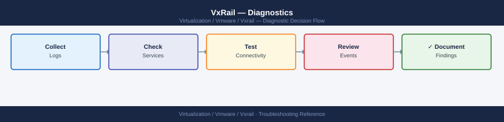

---
tags:
  - troubleshooting
  - vmware
  - vxrail
search:
  boost: 1.5
---
# VxRail — Diagnostics

<div class="kb-summary">
VxRail diagnostic commands: tail VxRail Manager mystic.log and lcm.log, grep ESXi vmkernel.log for vSAN LSOM/DOM errors, collect iDRAC SEL hardware event logs with racadm, and generate the Dell VxRail support bundle via the plugin UI or REST API.

*Applies to: VxRail 7.x / 8.x*
</div>


```d2
direction: right

B: "B" {shape: rectangle}
C: "SSH mystic@vxrail-manager\nsudo tail -f /var/log/mystic/mystic.log" {shape: rectangle}
D: "sudo tail lcm.log grep error\nCheck upgrade phase: PRECHECK DOWNLOAD STAGING UPGRADE" {shape: rectangle}
E: "vmkernel.log grep LSOM DOM on ESXi\nvSAN Health UI in vCenter" {shape: rectangle}
F: "vmkernel.log grep APD PDL NMP on ESXi\nesxcli storage core path list" {shape: rectangle}
G: "racadm getsel filter critical warning\nracadm getsysinfo filter fault" {shape: rectangle}
H: "hostd.log grep vpxd connect fail\nPing vCenter FQDN from ESXi" {shape: rectangle}
I: "I" {shape: rectangle}
J: "Verify VxRail Manager can reach vCenter: ping\nvcenter-fqdn\nCheck VxRail Manager service: systemctl status mystic" {shape: rectangle}
K: "Re-register VxRail plugin in vCenter\nCheck VxRail Manager vCenter credentials" {shape: rectangle}
L: "L" {shape: rectangle}
M: "Check failing check name in lcm.log\nResolve pre-check issue and retry LCM" {shape: rectangle}
N: "Check TIMEOUT entries in lcm.log\nVerify iDRAC and ESXi host reachability" {shape: rectangle}
O: "esxcli vsan debug object list on ESXi\nCheck which node hosts the absent component" {shape: rectangle}
P: "esxcli storage core path list for APD paths\nCheck vmnic link status: esxcli network nic list" {shape: rectangle}
Q: "racadm getsel tail 50 for SEL history\nracadm storage get pdisks for disk health" {shape: rectangle}
R: "grep connect refuse /var/log/hostd.log\nCheck management vmk0 IP and gateway" {shape: rectangle}
S: "Generate Dell VxRail support bundle\nOpen Dell support case" {shape: rectangle}
T: "VxRail plugin: Support > Generate Support Bundle\nor REST API: POST /rest/vxm/v1/support/bundle" {shape: rectangle}
A: "VxRail Issue" {shape: rectangle}

B -> C
B -> D
B -> E
B -> F
B -> G
B -> H
I -> J
I -> K
L -> M
L -> N
E -> O
F -> P
G -> Q
H -> R
J -> S
K -> S
M -> S
N -> S
O -> S
P -> S
Q -> S
R -> S
S -> T
```

```d2
direction: down

symptom: Identify Symptom {shape: diamond}
step_1_check_vxrail_manager_logs: "Step 1 — Check VxRail Manager logs" {shape: rectangle}
step_2_check_esxi_host_logs: "Step 2 — Check ESXi host logs" {shape: rectangle}
step_3_check_idrac_for_hardware_faul: "Step 3 — Check iDRAC for hardware faults" {shape: rectangle}
step_4_collect_vmsupport_esxi_bundle: "Step 4 — Collect vm-support ESXi bundle" {shape: rectangle}
step_5_generate_dell_vxrail_support_: "Step 5 — Generate Dell VxRail support bundle" {shape: rectangle}
log_locations: "Log locations" {shape: rectangle}
resolution: Resolve or Escalate {shape: oval}

symptom -> step_1_check_vxrail_manager_logs: investigate
symptom -> step_2_check_esxi_host_logs: investigate
symptom -> step_3_check_idrac_for_hardware_faul: investigate
symptom -> step_4_collect_vmsupport_esxi_bundle: investigate
symptom -> step_5_generate_dell_vxrail_support_: investigate
symptom -> log_locations: investigate
step_1_check_vxrail_manager_logs -> resolution
step_2_check_esxi_host_logs -> resolution
step_3_check_idrac_for_hardware_faul -> resolution
step_4_collect_vmsupport_esxi_bundle -> resolution
step_5_generate_dell_vxrail_support_ -> resolution
log_locations -> resolution
```

## Before you begin

- **Access:** SSH to VxRail Manager (`mystic@<vxrail-manager-ip>`); ESXi root SSH access; iDRAC SSH or racadm remote access; vCenter admin credentials
- **Gather first:** the specific symptom (plugin error, LCM pre-check name, vSAN health alarm, iDRAC hardware alert), the affected node IP or service tag, and when the issue started
- **Scope:** confirm whether the issue affects one node, one VxRail cluster, or the vCenter-VxRail integration layer

---

## Step 1 — Check VxRail Manager logs

```bash
# SSH to VxRail Manager
ssh mystic@<vxrail-manager-ip>

# List all log files with sizes
sudo ls -lh /var/log/mystic/

# mystic.log — Main VxRail Manager daemon log
sudo tail -500 /var/log/mystic/mystic.log
sudo tail -500 /var/log/mystic/mystic.log | grep -i "error\|exception\|critical\|fail"

# Watch live during active troubleshooting
sudo tail -f /var/log/mystic/mystic.log

# lcm.log — LCM upgrade operations
sudo tail -200 /var/log/mystic/lcm.log | grep -i "error\|fail\|exception\|timeout"

# Find a specific upgrade run by date
sudo grep "2026-06-15" /var/log/mystic/lcm.log | grep -i "error\|fail"

# access.log — REST API call history and error codes
sudo grep " 5[0-9][0-9] " /var/log/mystic/access.log | tail -50   # server errors
sudo grep " 401 " /var/log/mystic/access.log | tail -20            # auth failures
```


```text title="Expected output"
mystic@vxrail-manager:~$ ssh mystic@192.168.1.45
Last login: Wed Jun 12 10:34:22 2026 from 192.168.1.100
mystic@vxrail-manager:~$ sudo ls -lh /var/log/mystic/
total 2.3G
-rw-r--r-- 1 root root 1.2G Jun 15 14:22 mystic.log
-rw-r--r-- 1 root root 456M Jun 15 13:45 lcm.log
-rw-r--r-- 1 root root 312M Jun 15 14:19 access.log
-rw-r--r-- 1 root root  84M Jun 14 22:10 mystic.log.1
-rw-r--r-- 1 root root  12M Jun 12 18:33 lcm.log.1
-rw-r--r-- 1 root root 8.4M Jun 11 06:15 audit.log

mystic@vxrail-manager:~$ sudo tail -500 /var/log/mystic/mystic.log
[2026-06-15 14:22:18.456] INFO: VxRail Manager v8.0.210 started successfully
[2026-06-15 14:22:45.123] INFO: Connected to vCenter 192.168.1.50:443
[2026-06-15 14:23:12.789] INFO: Cluster health check: 4/4 nodes online
[2026-06-15 14:24:33.012] DEBUG: Inventory sync completed - 127 VMs registered
[2026-06-15 14:25:01.445] INFO: License validation passed (expires 2027-12-31)

mystic@vxrail-manager:~$ sudo tail -500 /var/log/mystic/mystic.log | grep -i "error\|exception\|critical\|fail"
[2026-06-15 13:18:44.567] ERROR: Failed to reach node-3 (192.168.1.53) - connection timeout
[2026-06-15 13:19:22.891] CRITICAL: Cluster quorum lost - 2/4 nodes unreachable
[2026-06-15 13:20:15.334] ERROR: Exception in thread "inventory-sync": java.net.SocketTimeoutException

mystic@vxrail-manager:~$ sudo tail -f /var/log/mystic/mystic.log
[2026-06-15 14:26:02.123] INFO: Health check cycle 847 started
[2026-06-15 14:26:15.456] INFO: Node-1 CPU: 42%, Memory: 68%, Disk: 81%
[2026-06-15 14:26:15.789] INFO: Node-2 CPU: 38%, Memory: 71%, Disk: 79%
^C

mystic@vxrail-manager:~$ sudo tail -200 /var/log/mystic/lcm.log | grep -i "error\|fail\|exception\|timeout"
[2026-06-
```
LCM phase sequence to check in lcm.log:

| Phase | What to look for |
|---|---|
| PRECHECK | `precheck.*FAIL` — check name tells you what to fix |
| DOWNLOAD | `download.*fail\|bundle.*error` — depot/proxy issue |
| STAGING | `TIMEOUT` — iDRAC or ESXi unreachable during staging |
| UPGRADE | `stage.*failed` — check the specific failing component |
| POSTCHECKS | `postcheck.*fail` — verify node health after upgrade |

---

## Step 2 — Check ESXi host logs

```bash
# SSH to the affected ESXi host
ssh root@<esxi-host-ip>

# vmkernel.log — vSAN storage layer and network errors
tail -200 /var/log/vmkernel.log | grep -i "vsan\|LSOM\|DOM"
tail -200 /var/log/vmkernel.log | grep -i "APD\|PDL\|NMP\|path"
tail -200 /var/log/vmkernel.log | grep -i "vmnic\|uplink\|link down"

# Wider search window
grep -i "LSOM\|error" /var/log/vmkernel.log | tail -200

# hostd.log — Host management and vCenter connection
tail -200 /var/log/hostd.log | grep -i "error\|fail"
grep -i "vpxd\|vCenter\|connect" /var/log/hostd.log | tail -50

# Storage path status
esxcli storage core path list | grep -v "Active"
# Expected: all paths Active; problem: Dead, Standby (unexpected)

# vSAN object list on this host
esxcli vsan debug object list 2>/dev/null | head -30
```


```text title="Expected output"
Connected to 192.168.1.45
root@esx-prod-04:~]

2024-01-15T09:23:47.123Z cpu18:2097379)LSOM: [lsom-object-6f4a8c2d] Resync in progress, 2 components degraded
2024-01-15T09:24:12.456Z cpu22:2098401)DOM: Object 6f4a8c2d-dom-object state: DEGRADED, replica count 2/3
2024-01-15T09:25:03.789Z cpu8:2099145)vsan: Network partition detected on vmnic2, latency 450ms

2024-01-15T09:26:15.234Z cpu14:2100023)APD: Device naa.6001405a1b2c3d4e5f6g7h8i9j0k1l2m timeout after 140s
2024-01-15T09:27:44.567Z cpu19:2101567)NMP: Adapter vmhba3 path state change: Dead

2024-01-15T09:28:01.890Z cpu5:2102234)vmnic1 Link Down detected, speed 10000Mbps
2024-01-15T09:28:45.123Z cpu11:2103012)uplink failover triggered on dvSwitch-vsan

2024-01-15T09:29:33.456Z cpu16:2103890)LSOM: Resync error on component 4a7b9c1e, retrying...

2024-01-15T09:31:22.789Z hostd[2045]: [error] Failed to connect to vCenter vpxd at 192.168.1.10:443
2024-01-15T09:32:05.012Z hostd[2045]: [error] vCenter heartbeat timeout, connection lost

2024-01-15T09:33:18.345Z vpxd: Connection attempt 3/5 failed, retrying in 30s

Name                          State     Adapter  Channel  Target  LUN  PathState
vmhba3:C0:T0:L0               Dead      vmhba3   0        0       0    Dead
vmhba4:C0:T1:L0               Active    vmhba4   0        1       0    Active
vmhba3:C0:T1:L0               Standby   vmhba3   0        1       0    Standby
vmhba5:C0:T0:L0               Active    vmhba5   0        0       0    Active

Object UUID                          Bytes       Congestion  Health
6f4a8c2d-2e5f-4a1b-9c3d-7e8f1a2b3c4d 107374182400 0%          Degraded
5e7d9a1c-3f6b-4d2e-8a5f-9c1d2e3f4a5b 53687091200  5%          Healthy
4c6e8b2d-1a3f-5e7c-9d2b-4f6a8c1d3e5f 214748364800 0%          Healthy
```
vmkernel.log patterns:

| Pattern | Meaning |
|---|---|
| `LSOM: disk ... failed` | Local disk failure — check iDRAC SEL |
| `DOM: component ... absent` | vSAN object component absent; node may be offline |
| `NMP: no more paths` | All paths dead — PDL condition |
| `APD START` | All Paths Down — storage temporarily unreachable |
| `vmnic ... link state changed to down` | NIC link dropped — check cable or switch port |
| `VSAN: network partition` | Nodes cannot communicate on vSAN vmkernel network |

---

## Step 3 — Check iDRAC for hardware faults

```bash
# SSH to node iDRAC
ssh root@<node-idrac-ip>

# Or use racadm remotely from a management host
racadm -r <idrac-ip> -u root -p <password> getsel

# System Event Log — primary hardware fault source
racadm getsel | tail -50
racadm getsel | grep -i "critical\|warning\|fault"

# Full system summary
racadm getsysinfo | grep -i "fault\|warning\|critical"

# Power supply status
racadm getsysinfo -t pwrsupply

# Fan status (failure causes thermal shutdown)
racadm getsysinfo -t fan

# Disk and RAID controller health
racadm storage get pdisks -o -p State,PredictiveFailureState,MediaType
racadm storage get controllers -o

# NIC link status
racadm getniccfg -n NIC.Integrated.1-1

# Temperature readings
racadm getsysinfo -t temp

# Quick hardware diagnostic test
racadm diagnostics run -t QuickTest
```


```text title="Expected output"
root@management-host:~# ssh root@192.168.1.45
root@192.168.1.45's password: 
root@idrac-192.168.1.45:~# racadm getsel | tail -50
SEL Records: 247
ID | Date | Time | Sensor | Event
1a2 | 01/15/2025 | 14:32:18 | PS1 Status | Power Supply 1 Failure
1a3 | 01/15/2025 | 14:33:05 | Fan1 | Fan Speed Low Warning
1a4 | 01/15/2025 | 14:35:22 | Temp Sensor CPU1 | Temperature Critical
1a5 | 01/15/2025 | 14:36:10 | RAID Controller | Predictive Failure Detected
...
root@idrac-192.168.1.45:~# racadm getsel | grep -i "critical\|warning\|fault"
1a3 | 01/15/2025 | 14:33:05 | Fan1 | Fan Speed Low Warning
1a4 | 01/15/2025 | 14:35:22 | Temp Sensor CPU1 | Temperature Critical
1a5 | 01/15/2025 | 14:36:10 | RAID Controller | Predictive Failure Detected
root@idrac-192.168.1.45:~# racadm getsysinfo | grep -i "fault\|warning\|critical"
System Health Status: Critical
PSU1 Status: Non-Recoverable Error
Fan Module 1: Warning
root@idrac-192.168.1.45:~# racadm getsysinfo -t pwrsupply
PSU1 Status: Non-Recoverable Error (Voltage out of range)
PSU2 Status: OK
root@idrac-192.168.1.45:~# racadm getsysinfo -t fan
Fan1 Speed: 8500 RPM (Warning threshold exceeded)
Fan2 Speed: 6200 RPM
Fan3 Speed: 6150 RPM
Fan4 Speed: 6180 RPM
root@idrac-192.168.1.45:~# racadm storage get pdisks -o -p State,PredictiveFailureState,MediaType
ID | State | PredictiveFailureState | MediaType
Disk.Bay.1 | Online | No | SSD
Disk.Bay.2 | Online | Yes | SSD
Disk.Bay.3 | Degraded | No | SSD
Disk.Bay.4 | Online | No | SSD
root@idrac-192.168.1.45:~# racadm storage get controllers -o
ID | Status | CacheSizeInMB | FirmwareVersion
RAID.SolidStateController.1-1 | Optimal | 2048 | 7.42.00.00-20240815
root@idrac-192.168.1.45:~# racadm getniccfg -n NIC.Integrated.1-1
NIC.Integrated.1-1
Speed: 10 Gbps
Duplex: Full
Link Status
```
SEL patterns to look for:

| SEL Entry | Meaning |
|---|---|
| `Physical Disk ... Predictive Failure` | Disk imminent failure — plan replacement |
| `Physical Disk ... Failed` | Disk has failed — replace immediately |
| `Power Supply ... Failure` | PSU failed — check and replace |
| `Memory ... Correctable ECC` | Single-bit memory error — monitor |
| `Memory ... Uncorrectable ECC` | Multi-bit error — DIMM replacement required |
| `Network interface ... link down` | NIC link lost — check cable and switch |

---

## Step 4 — Collect vm-support ESXi bundle

```bash
# Collect full ESXi diagnostic bundle (does not impact running VMs)
ssh root@<esxi-host-ip>
vm-support -n -w /tmp/
# Duration: 2-5 minutes

# List the generated bundle file
ls -lh /tmp/*.tgz

# SCP to management workstation
scp root@<esxi-host-ip>:/tmp/esx-<hostname>-<timestamp>.tgz ./
```


```text title="Expected output"
root@esxi-host-01:~] vm-support -n -w /tmp/
Generating support bundle...
Collecting system logs (this may take a few minutes)...
Bundle generation completed successfully.
Created: /tmp/esx-esxi-host-01-2024-01-15--10-34-22.tgz

root@esxi-host-01:~] ls -lh /tmp/*.tgz
-rw-r--r-- 1 root root 487M Jan 15 10:34 /tmp/esx-esxi-host-01-2024-01-15--10-34-22.tgz

root@esxi-host-01:~] exit
Connection to 192.168.1.42 closed.

$ scp root@192.168.1.42:/tmp/esx-esxi-host-01-2024-01-15--10-34-22.tgz ./
esx-esxi-host-01-2024-01-15--10-34-22.tgz    100%  487MB   8.2MB/s   00:59
```

!!! warning "Common errors"
    **`Permission denied (publickey,password).`** — Verify SSH key is loaded or use `ssh-keyscan` to add the host key, then retry the connection.
    **`No such file or directory`** — Confirm the exact bundle filename from the `ls -lh` output and use the correct timestamp in the SCP command path.
The vm-support bundle includes: vmkernel.log, hostd.log, vpxa.log, network config, storage config, and running process state.

---

## Step 5 — Generate Dell VxRail support bundle

### Via VxRail plugin (UI path)

Navigate to: **VxRail Plugin → Support → Generate Support Bundle**

Bundle generation takes 10–20 minutes. The download link appears when complete. Contents: VxRail Manager logs, node health data, iDRAC logs, and ESXi log excerpts from all nodes.

### Via VxRail Manager API

```bash
# SSH to VxRail Manager
ssh mystic@<vxrail-manager-ip>

# Trigger bundle generation
curl -sk -X POST \
  -H "Authorization: Basic $(echo -n 'mystic:password' | base64)" \
  -H "Content-Type: application/json" \
  "https://localhost/rest/vxm/v1/support/bundle"
# Returns: JSON with job_id

# Poll job status
curl -sk \
  -H "Authorization: Basic $(echo -n 'mystic:password' | base64)" \
  "https://localhost/rest/vxm/v1/requests/<job-id>" | python3 -m json.tool

# When status = COMPLETED, download the bundle
curl -sk -O \
  -H "Authorization: Basic $(echo -n 'mystic:password' | base64)" \
  "https://localhost/rest/vxm/v1/support/bundle/download"
```


```text title="Expected output"
Welcome to VxRail Manager
Last login: Wed Jan 15 14:32:18 2025 from 192.168.1.45

mystic@vxrail-manager:~$ curl -sk -X POST \
  -H "Authorization: Basic $(echo -n 'mystic:password' | base64)" \
  -H "Content-Type: application/json" \
  "https://localhost/rest/vxm/v1/support/bundle"
{
  "request_id": "req-8f4c2a91-7e3d-4b9c-a1f2-9d8e5c3b7a2f",
  "job_id": "job-5d9a1c8e-2f4b-11ef-a8c3-0242ac120002",
  "status": "PENDING",
  "created_at": "2025-01-15T14:33:22Z"
}

mystic@vxrail-manager:~$ curl -sk \
  -H "Authorization: Basic $(echo -n 'mystic:password' | base64)" \
  "https://localhost/rest/vxm/v1/requests/job-5d9a1c8e-2f4b-11ef-a8c3-0242ac120002" | python3 -m json.tool
{
  "job_id": "job-5d9a1c8e-2f4b-11ef-a8c3-0242ac120002",
  "status": "COMPLETED",
  "progress": 100,
  "bundle_size_mb": 1247,
  "completed_at": "2025-01-15T14:38:45Z"
}

mystic@vxrail-manager:~$ curl -sk -O \
  -H "Authorization: Basic $(echo -n 'mystic:password' | base64)" \
  "https://localhost/rest/vxm/v1/support/bundle/download"
  % Total    % Received % Xferd  Average Speed   Time    Time     Time  Current
                                 Dload  Upload   Total   Spent    Left  Speed
100 1247M  100 1247M    0     0  45.2M      0  0:00:27 0:00:27 --:--:-- 45.2M
vxrail-support-bundle-20250115-143845.tar.gz saved
```

!!! warning "Common errors"
    **`curl: (60) SSL certificate problem: self signed certificate`** — Add `-k` flag to curl commands to skip SSL verification (already present in examples above).
    **`{"error": "Unauthorized", "code": 401}`** — Verify base64 encoding of credentials with `echo -n 'mystic:password' | base64` and ensure the mystic user has API permissions in VxRail.
    **`{"error": "Bundle generation already in progress", "code": 409}`** — Wait for the previous bundle job to complete by checking status with the requests endpoint before triggering a new bundle.
---

## Log locations

| Log Source | Best For | Path / Command |
|---|---|---|
| mystic.log | Plugin errors, API failures | `/var/log/mystic/mystic.log` on VxRail Manager |
| lcm.log | LCM pre-check and upgrade stage failures | `/var/log/mystic/lcm.log` on VxRail Manager |
| access.log | REST API call history | `/var/log/mystic/access.log` on VxRail Manager |
| vmkernel.log | vSAN I/O errors, disk failures, network drops | `/var/log/vmkernel.log` on ESXi host |
| hostd.log | vCenter connectivity, VM operations | `/var/log/hostd.log` on ESXi host |
| iDRAC SEL | Hardware fault timeline | `racadm getsel` against node iDRAC |
| vm-support bundle | Full ESXi snapshot | `vm-support -n -w /tmp/` on ESXi host |
| VxRail support bundle | Full cluster snapshot | VxRail plugin → Support → Generate Support Bundle |

---

## See also

- [VxRail — Common Issues](../common-issues/)
- [VxRail — Escalation](../escalation/)

## Verify resolution

- VxRail plugin loads in vCenter without error; node health shows green in VxRail Manager
- `sudo tail -50 /var/log/mystic/mystic.log` shows no new ERROR entries after the fix
- LCM operation completes: upgrade phases reach POSTCHECKS with no FAIL entries in lcm.log
- `grep -i "LSOM\|DOM\|APD\|PDL" /var/log/vmkernel.log | tail -10` shows no new error events
- iDRAC SEL shows no new Critical events: `racadm getsel | grep -i critical`
- vSAN health UI in vCenter shows all checks green with no warnings
